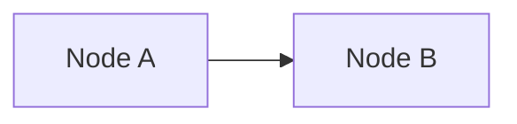

# ADR-0000 — Template for architecture decision records

This file is the template every architecture decision record in HyFib Tailor 360 copies. It fixes the MADR
structure the project uses, the metadata block, the house rules for numbering, status and supersession, and the
minimum quality bar for each section. It is not itself a decision about the system; it is the decision about how
decisions are written down. Copy it to `NNNN-short-kebab-title.md`, delete the guidance in italics, and keep every
heading — a record that drops a heading is incomplete, not concise.

---

## 1. How to use this template

| Step | Rule |
| --- | --- |
| Allocate the number | The next unused four-digit number. Numbers are allocated once and never re-used, including for records that end up rejected or superseded. |
| Name the file | `NNNN-short-kebab-title.md`, lower case, hyphen separated, no dates in the file name. The title in the file is the readable one. |
| Copy this file | Keep all headings in the order below. Remove the guidance paragraphs in *italics*; replace them with the record's own content. |
| Fill the metadata table | Every row. An unknown decision-maker or an unknown date means the record is not ready for review. |
| Write the options | At least three genuinely considered options, each with honest trade-offs. An option written only to be knocked down wastes the reader's time and misleads a future reader into thinking the space was explored. |
| Link it | Add the record to [`README.md`](README.md) in the same pull request, and add a link from any architecture document whose statements now rest on it. |
| Review it | An architecture decision record is reviewed like code: one pull request, linked to the issue that raised it, approved by the technical reviewer and — where the decision has a cost or a business consequence — the business owner. |

### 1.1 Why a metadata table rather than YAML front matter

Canonical MADR puts status, date and decision-makers in YAML front matter. This project uses a Markdown table
instead, for three reasons: the documentation set is read on GitHub and in editors where front matter renders
inconsistently; the project's documentation convention is that anything enumerable is a table; and the table can
carry the extra columns this project needs (the plan decision identifier, the issues affected, and the open
decision a record still depends on). Everything else follows MADR 4.

---

## 2. Statuses

| Status | Meaning | Who may set it |
| --- | --- | --- |
| **Proposed** | Written and open for review. Nothing in the codebase may rely on it yet. | Author |
| **Accepted** | Agreed and in force. Architecture documents, architecture rules and code may rely on it. | Technical reviewer, plus the business owner where there is a cost or business consequence |
| **Superseded by ADR-NNNN** | Replaced by a later record. The text stays exactly as it was; only the metadata changes and a link to the successor is added. | The author of the superseding record, in the same pull request |
| **Deprecated** | No longer in force and not replaced, because the thing it decided no longer exists. | Technical reviewer |
| **Rejected** | Considered and turned down. Kept so the same option is not re-proposed without new information. | Technical reviewer |

A record is never edited to say something different from what was decided. Correcting a typo or adding a link is
an edit; changing the outcome is a new record that supersedes this one. This is the same rule the project applies
to posted invoices, stock-ledger entries and custody events: history is appended to, not rewritten.

A record may be **Accepted** while a business decision it depends on is still open — for example a record that
assumes a hosting model before the owner has chosen one. When that is the case, the *Depends on open decision*
row of the metadata table names the open decision, its owner and its due wave, and Section 8 says exactly what
happens to the record if the decision goes the other way. This is the only permitted form of "not yet settled" in
an accepted record; the project does not write "to be decided" and leave it there.

---

## 3. The template

The block below is the body to copy, shown verbatim so that nothing in it is mistaken for a statement about the
system. Copy everything inside the fence into the new file, then replace the guidance in *italics* with the
record's own content. The `mermaid` example is illustrative; delete it if the record needs no diagram.

````markdown
# ADR-NNNN — *Short imperative title naming the decision, not the problem*

*One short paragraph: what this record decides, for which part of the system, and who needs to read it. A reader
who stops here should still know what was chosen.*

| Field | Value |
| --- | --- |
| **Status** | *Accepted — YYYY-MM-DD* |
| **Deciders** | *Technical reviewer; business owner where applicable* |
| **Consulted** | *Roles or documents consulted, for example the accountant for a financial decision, the Tailor Master for a shop-floor decision* |
| **Informed** | *Who must know once it is in force* |
| **Plan decision** | *The `D`-number in [`../IMPLEMENTATION_PLAN.md`](../IMPLEMENTATION_PLAN.md) Section 3 this record formalises, or "none" if the record originates here* |
| **Plan sections** | *The plan sections that must stay consistent with this record* |
| **Issues affected** | *The GitHub issues that implement or depend on this decision* |
| **Depends on open decision** | *The `OD-NN` item in [`../prd/assumptions-and-open-decisions.md`](../prd/assumptions-and-open-decisions.md), or "none"* |
| **Supersedes / superseded by** | *Record numbers, or "none"* |

---

## 1. Context and problem statement

*What forces exist, what problem must be solved, and what constrains the answer. State the facts a reader needs
who has not read the implementation plan: the scale of the business, the devices, the money and tax rules, the
staffing. Keep it to what bears on this decision. End with the question the record answers, phrased as a
question.*

## 2. Decision drivers

*The criteria the options are judged against, as a table. Each driver must be something an option can be better
or worse at; "good architecture" is not a driver. Where a driver comes from a numeric target, cite it and mark
any figure that is proposed rather than confirmed.*

| # | Driver | Why it matters here |
| --- | --- | --- |
| D1 | *…* | *…* |

## 3. Considered options

*A one-line list of the options, then one subsection each. Three is the minimum. Include the option the reader
would most expect to see chosen even if it was not, and say honestly what is good about it.*

1. *Option A — chosen*
2. *Option B*
3. *Option C*

### 3.1 Option A — *name*

*One paragraph describing the option concretely enough to cost.*

- Good, because *…*
- Good, because *…*
- Bad, because *…*
- Bad, because *…*

### 3.2 Option B — *name*

*As above. The "Bad, because" points for a rejected option must be real; the "Good, because" points must be ones
a proponent would recognise.*

### 3.3 Option C — *name*

*As above.*

### 3.4 Comparison

*A table scoring each option against the drivers from Section 2. Use plain words, not scores out of ten.*

| Driver | Option A | Option B | Option C |
| --- | --- | --- | --- |
| *D1 …* | *…* | *…* | *…* |

## 4. Decision outcome

*"Chosen option: **X**, because …" followed by the specifics that make the decision actionable: the concrete
shape, the settings, the names, the boundaries. A record that says only "we chose X" cannot be implemented from
and cannot be audited against.*

## 5. Consequences

### 5.1 Positive

| Consequence | Who feels it |
| --- | --- |
| *…* | *…* |

### 5.2 Negative

*Every decision costs something. A record with no negative consequences has not been thought about.*

| Consequence | Who feels it | How it is mitigated or where it is handled |
| --- | --- | --- |
| *…* | *…* | *…* |

## 6. Confirmation

*How anyone can tell whether the system still follows this record: the architecture rule identifiers in
[`../architecture/architecture-rules.md`](../architecture/architecture-rules.md), the tests, the review step or
the runbook check. A decision nothing verifies decays into folklore.*

| Check | Mechanism | Where |
| --- | --- | --- |
| *…* | *…* | *…* |

## 7. Diagram

*Optional, and only when a picture shows something the prose cannot. Mermaid `flowchart TD` or `flowchart LR`,
node identifiers without spaces, labels in square or curly brackets.*



## 8. Revisiting this decision

*What new evidence would justify a different answer, and what would have to be true before the change could be
made safely. For a record that depends on an open decision, state here what happens to the record if the decision
goes the other way.*

## 9. Links

| Document | Why it is relevant |
| --- | --- |
| [`../IMPLEMENTATION_PLAN.md`](../IMPLEMENTATION_PLAN.md) | *Sections …* |
| *…* | *…* |
````
