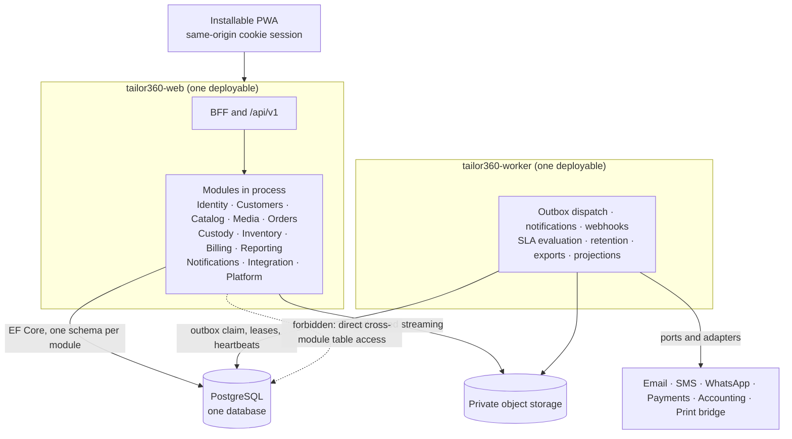

# ADR-0001 — Build HyFib Tailor 360 as a modular monolith with explicit extraction criteria

This record decides the top-level shape of the system: one deployable web host and one deployable worker host
that share in-process module assemblies, with module boundaries enforced by automated tests rather than by
network calls. It also fixes the criteria a module must meet before it may be extracted into a separate service,
so that "we will split it later" is a testable statement rather than an aspiration. Every other architecture
record in this set assumes this one.

| Field | Value |
| --- | --- |
| **Status** | Accepted — 2026-09-04 |
| **Deciders** | Technical reviewer; business owner (operational cost and staffing) |
| **Consulted** | Roadmap issue #1; [`../architecture/module-ownership.md`](../architecture/module-ownership.md) |
| **Informed** | Every implementing session; the pull-request reviewers of all module issues |
| **Plan decision** | D1 (partly, the "modular monolith" half); the module map in plan Section 4.2 and 4.3 |
| **Plan sections** | 2.2 (module ownership is a non-negotiable delivery principle), 4.1, 4.2, 4.3, 5.3 |
| **Issues affected** | #18 (this record), #20 (module skeletons and the architecture tests), #21 (shared persistence platform), #22 (one pipeline, one deployable set), and every module issue #23–#55 |
| **Depends on open decision** | None. OD-01 affects the *language* (ADR-0002), not the shape |
| **Supersedes / superseded by** | None |

---

## 1. Context and problem statement

HyFib is a tailoring business with a small number of branches in Tamil Nadu — three at the baseline sizing
(assumption A5) — serving roughly 100 to 500 orders per branch per month with 20 to 50 concurrent staff users per
branch. There is no platform team, no dedicated operations staff and no on-call rotation; the deployment baseline
is a single virtual machine running Docker Compose, and the disaster-recovery plan assumes one database to
restore (plan D17, D18).

At the same time the domain is genuinely wide. The system covers customer identity and consent, measurement
templates and versions, a configurable catalogue, secure media, orders and garment jobs, a workflow engine,
barcode custody, inventory with an immutable stock ledger, GST billing and payments, reporting projections,
notifications and feedback, and integration adapters. Eleven business capabilities plus a shared platform. Left
unstructured, that becomes a codebase where the Billing module reads an `orders` table directly, a change to a
garment job breaks an invoice, and nobody can say who owns what.

Several invariants also cross what would be service boundaries and must hold **in one database transaction**:

| Invariant | What must commit together |
| --- | --- |
| Order confirmation | The order and its garment jobs, the measurement, design and price snapshots, the allocated barcode identity, the audit event and the outbox message |
| Stock consumption | The immutable ledger entry and the derived balance under a row lock |
| Invoice posting | The invoice, its lines and tax components, the branch/financial-year sequence allocation, the audit event and the outbox message |
| Custody transfer | The append-only scan event, the custody transfer row and the idempotency record |

The roadmap (issue #1) already states the direction — an ASP.NET Core modular monolith, with microservices
explicitly out of scope without an approved architecture decision record. This record is that decision recorded
properly, with the trade-offs stated and with the exit criteria written down.

**The question:** what deployment and code shape gives this domain enforceable internal boundaries and
transactional integrity, at an operational cost a three-branch business can actually carry, without painting the
system into a corner if one part later needs to scale or release independently?

## 2. Decision drivers

| # | Driver | Why it matters here |
| --- | --- | --- |
| D1 | Transactional integrity across capability boundaries | The four invariants above are money, stock and physical-custody guarantees. Making them eventually consistent means writing compensating flows for cases that a single transaction removes entirely |
| D2 | Operability by a business with no platform team | Every additional deployable adds a health check, a log stream, a dashboard, a restart policy, a backup consideration and a failure mode somebody must understand at 22:00 |
| D3 | Enforceable module ownership | Plan Section 2.2 makes "no cross-module table access" non-negotiable. The mechanism must fail on the day a breach is introduced, not on the day someone notices |
| D4 | Cost | A single 4 vCPU / 16 GB virtual machine with 200 GB SSD is the baseline (A5). Per-service infrastructure multiplies that |
| D5 | Delivery cadence | One issue, one branch, one session, one pull request, with three parallel lanes (plan Section 6.1). Modules must be independently *workable* even if they are not independently *deployable* |
| D6 | A credible path out | The decision must not be a one-way door. If media processing or reporting later needs its own resources or release cadence, extraction must be possible without a rewrite |
| D7 | Debuggability | A garment job's life crosses Orders, Custody, Billing and Notifications. Following that path in one process with one correlation identifier is materially easier than following it across four services |

## 3. Considered options

1. **Modular monolith** — one web host and one worker host, sharing in-process module assemblies (chosen)
2. **Layered monolith without module boundaries** — a conventional N-tier application, one data layer
3. **Microservices from day one** — one deployable per business capability
4. **Serverless functions per use case** — each command and query as an independently deployed function

### 3.1 Option 1 — Modular monolith (chosen)

Eleven business modules plus a shared platform, each an independent set of projects (`Domain`, `Application`,
`Infrastructure`, `Api`, `Contracts`), compiled into two hosts: `Tailor360.Web` (the BFF, the `/api/v1` surface
and the static progressive web application) and `Tailor360.Worker` (outbox dispatch, notification and webhook
delivery, due-date and service-level evaluation, retention, exports, projections). Modules communicate through
`Contracts` projects and integration events carried by a transactional outbox; only `Contracts` and `Platform.*`
may be referenced across a module boundary, and architecture tests fail the build when that is broken.

- Good, because the four cross-capability invariants commit in one transaction with no saga, no compensation and
  no partially applied state to reconcile.
- Good, because the whole system is one restore: one PostgreSQL database, one point-in-time recovery timeline,
  one consistent state after a disaster-recovery exercise.
- Good, because module ownership is checked by `NetArchTest` rules that read the project graph and the source, so
  a forbidden reference fails a pull request rather than being discovered during an incident.
- Good, because a developer runs the entire system with `docker compose up` and debugs a garment job's life in
  one process, under one correlation identifier.
- Good, because the two hosts already separate the two things that genuinely have different resource profiles:
  latency-sensitive request handling and long-running background work.
- Bad, because a memory leak, a runaway query or a poison message in one module degrades the whole web host.
  Bulkheads (the bounded `MediaProcessing` concurrency, the connection budget, the rate-limit policy catalogue)
  reduce this but do not remove it.
- Bad, because modules cannot be released independently: a change to Inventory ships the same image as Billing,
  so every release carries every module's risk and every release gate applies to everything.
- Bad, because scaling is coarse. Adding capacity for scan bursts means another web replica carrying every
  module, and a second replica has knock-on requirements (connection budget recomputation or PgBouncer, a
  distributed session-revocation cache — see ADR-0013).
- Bad, because discipline is required forever. The boundaries are conventions plus tests, not networks; the tests
  are what makes them real, so weakening a test quietly weakens the architecture.

### 3.2 Option 2 — Layered monolith without module boundaries

The conventional shape: controllers, services, repositories, one `DbContext`, one schema, entities referencing
each other freely with foreign keys across the whole domain.

- Good, because it is the fastest thing to write in the first three months; no `Contracts` projects, no event
  mapping, no thinking about which module owns a concept.
- Good, because every query can join anything, so reports and screens that span capabilities are trivial at
  first.
- Good, because there is genuinely less machinery: one `DbContext`, one migration history, one set of
  conventions.
- Bad, because ownership becomes unknowable. When Billing joins the garment-job table, a change to job phases
  breaks invoicing, and no test says so before production does.
- Bad, because plan Section 2.2 forbids exactly this, and the release gates (module ownership, reporting never
  authoritative, posted documents immutable) have nowhere to attach.
- Bad, because it makes Option 1's exit path unavailable. Extracting anything later would first require the work
  Option 1 does up front — with a much larger tangle to unpick and no test to tell you when you were done.
- Bad, because the configurable-taxonomy and versioned-snapshot rules (ADR-0009) depend on clear ownership of who
  publishes a version and who may only read one.

### 3.3 Option 3 — Microservices from day one

Eleven deployables plus a gateway, each with its own database, its own pipeline, its own dashboards, communicating
over HTTP and a message broker.

- Good, because each capability could be released, scaled and rolled back on its own schedule.
- Good, because a fault is contained: a stuck media pipeline cannot exhaust the thread pool serving the scan
  endpoint.
- Good, because ownership is enforced by the network — a service physically cannot read another's tables.
- Good, because it is the shape the system would need if HyFib grew into many organisations with very different
  load profiles.
- Bad, because every one of the four transactional invariants becomes a distributed saga with compensations, and
  those compensations are business-visible: a partially confirmed order, an invoice posted against a job that was
  never created, a stock reservation with no consumer.
- Bad, because a message broker, eleven deployment pipelines, eleven health and alerting surfaces, distributed
  tracing as a prerequisite rather than a nicety, and cross-service contract testing as a release gate are all
  operational load for a business with no operations staff.
- Bad, because disaster recovery becomes "restore eleven datastores to a mutually consistent point", which is a
  materially harder exercise than the single-database restore the plan's recovery-point objective assumes.
- Bad, because the cost is real: eleven deployables do not fit the baseline single virtual machine, and the
  hosting decision (OD-02) has not even been taken.
- Bad, because it is premature. At 500 orders per branch per month and fewer than 5,000 scans per day, no module
  has a demonstrated resource conflict with any other.

### 3.4 Option 4 — Serverless functions per use case

Each command and query deployed as an individually scaled function behind an API gateway, with a managed database
and managed queues.

- Good, because scaling is automatic and idle cost is near zero, which suits a business whose load is heavily
  concentrated in shop hours.
- Good, because there are no long-lived hosts to patch.
- Bad, because cold starts hurt exactly the interactions that must feel instant: the scan round trip (a proposed
  target of under one second at the 95th percentile on 4G, to be confirmed by issue #19) and the intake screens.
- Bad, because the module boundary disappears into a flat list of hundreds of functions; ownership is even harder
  to enforce than in Option 2.
- Bad, because it fixes the system to a cloud provider's runtime while the hosting model is undecided (OD-02) and
  on-premises deployment is an explicitly supported outcome (plan D17).
- Bad, because the background work the plan requires — leases, outbox claims with `FOR UPDATE SKIP LOCKED`,
  heartbeats, a bounded media-processing bulkhead — is a poor fit for a function runtime.

### 3.5 Comparison

| Driver | Modular monolith | Layered monolith | Microservices | Serverless functions |
| --- | --- | --- | --- | --- |
| D1 Transactional integrity | One transaction, no sagas | One transaction | Sagas and compensations for every crossing | Sagas, plus limited transaction control |
| D2 Operability without a platform team | Two hosts, one database | One host, one database | Eleven deployables and a broker | Managed, but opaque and provider-specific |
| D3 Enforceable ownership | Architecture tests on the project graph and source | None available | Enforced by the network | Weakest of the four |
| D4 Cost | Fits the baseline single virtual machine | Fits | Does not fit | Unknown and provider-bound |
| D5 Delivery cadence | Modules independently workable | Modules not separable | Independently releasable, at high fixed cost | Fragmented |
| D6 Path out | Extraction criteria in Section 6 below | Would need this work first | Already there | One-way door |
| D7 Debuggability | One process, one correlation identifier | One process | Distributed tracing required | Hardest |

## 4. Decision outcome

**Chosen option: the modular monolith.** It is the only option that keeps the money, stock and custody invariants
in a single transaction while giving the ownership boundaries plan Section 2.2 demands, at an operational cost a
three-branch business can carry. Microservices buy independence the business cannot yet spend and charge for it
in distributed-transaction complexity and operational load; the layered monolith is cheaper today and forecloses
tomorrow.

Concretely, the decision fixes:

| Aspect | Decision |
| --- | --- |
| Deployables | Two application images — `tailor360-web` (BFF, `/api/v1`, static progressive web application) and `tailor360-worker` — plus `tailor360-cli` for migration and operations, all built from the same solution |
| Modules | Identity/Admin, Customers/Measurements, Catalog/Design, Media, Orders/Workflow, Custody/Barcode, Inventory, Billing/Payments, Reporting, Notifications/Feedback, Integration, and the shared Platform |
| Module internals | `Domain` (no framework references), `Application`, `Infrastructure`, `Api`, `Contracts` — the shape is identical for every module |
| What may cross a module boundary | Only another module's `Contracts` project and `Platform.*`. Nothing else: no `Domain`, no `Application`, no `Infrastructure`, no database table, no schema |
| How modules communicate | Synchronously through read contracts published in `Contracts`; asynchronously through versioned integration events carried by the per-module transactional outbox (ADR-0008) |
| Data ownership | One schema per module with its own `DbContext` (ADR-0004); object-storage prefixes owned per module (ADR-0005) |
| Enforcement | Architecture tests with stable identifiers `ARCH-001…` in [`../architecture/architecture-rules.md`](../architecture/architecture-rules.md), running on every pull request |
| Hosts | Hosts reference modules only through registration extension methods; a host never reaches into a module's internals |

Microservices remain out of scope. Extracting any module requires a new architecture decision record that
supersedes this one *for that module* and demonstrates the criteria in Section 6.

## 5. Consequences

### 5.1 Positive

| Consequence | Who feels it |
| --- | --- |
| Order confirmation, invoice posting, stock consumption and custody transfer each commit atomically, so there is no partially applied business state to reconcile | Reception, Cashier, Inventory Clerk, and the Owner reading reports |
| One database to back up, restore and recover to a point in time; the disaster-recovery exercise is one restore | Whoever runs the recovery drill (issue #60) |
| Forbidden cross-module coupling fails a pull request within minutes | Every implementing session |
| A developer runs the whole system locally and traces a garment job end to end in one process | Every implementing session |
| The two genuinely different workloads — request handling and background processing — are already separated into two hosts and can be scaled and restarted independently | Operations |
| Module boundaries make the parallel delivery lanes possible: three sessions can work in disjoint modules without collision | Delivery |

### 5.2 Negative

| Consequence | Who feels it | How it is mitigated or where it is handled |
| --- | --- | --- |
| A fault in one module can degrade the whole web host | All users | Bounded bulkheads (media processing concurrency 2, 30-second timeout), the rate-limit policy catalogue, the connection budget, and health probes that report Degraded without removing the host from rotation (plan Section 4.4) |
| Modules cannot be released independently; every release carries every module's risk | Delivery and operations | Expand-migrate-contract migrations, build-once-promote-the-digest, rehearsed rollback to the previous tag with the database one migration ahead (plan Section 4.7) |
| Scaling is coarse — a second web replica carries all modules | Operations | Accepted at the baseline load. A second replica requires recomputing the connection budget or introducing PgBouncer, and a distributed session-revocation cache (ADR-0013) |
| Boundaries are conventions plus tests, so they erode if the tests are weakened | Reviewers | Every `ARCH-…` rule has a negative control asserting the detector still catches a violation; weakening a rule requires an architecture decision record amending this one |
| A Compose deployment has no rolling update, so a web container swap costs a few seconds of 502 responses | All users, briefly, at release time | Accepted against the availability target; minimised with `--wait` and reverse-proxy retry. Blue-green arrives only with Kubernetes (ADR-0010) |
| Cross-module reads must go through a `Contracts` interface even when a join would be easier, which costs code | Every implementing session | This is the price of the ownership guarantee and is deliberate. Reporting is the release valve: it may subscribe to every module's events (ADR-0011) |

## 6. Extraction criteria — what must be true before a module becomes a service

Extraction is permitted, but only on evidence. All seven criteria must hold for the module in question, and the
evidence must be attached to the superseding architecture decision record. Partial satisfaction is not a case for
extraction; it is a case for fixing whatever is missing while the module is still in-process, which is far
cheaper.

| # | Criterion | Evidence required |
| --- | --- | --- |
| **X1** | **The boundary is already clean.** The module has been consumed exclusively through its `Contracts` project and integration events for at least two releases, with zero granted exceptions in the architecture-rule allowlists | The `ARCH-002`, `ARCH-003` and `ARCH-004` allowlists show no entry for the module; the pull-request history shows no exception granted |
| **X2** | **No invariant spans the boundary.** Every write that today commits with another module's write in one transaction has been re-expressed as an event plus a compensating action, and that eventual-consistency window is acceptable to the business in writing | The invariant is listed in [`../architecture/invariants.md`](../architecture/invariants.md) with its compensating action and the owner's acceptance of the window |
| **X3** | **A measured resource conflict exists that in-process isolation cannot solve.** Load or production telemetry shows the module starving or being starved, after bulkheads, connection budgeting and query tuning have been applied | A load-test or production report against the targets in `docs/nfr/capacity-and-performance.md` (issue #19), plus the record of what in-process mitigation was tried and why it was insufficient |
| **X4** | **Independent release cadence is genuinely needed.** Changes to this module have been blocked by, or have blocked, unrelated releases repeatedly over a measured period | A count from the release log over at least one quarter, not an anecdote |
| **X5** | **Data can be physically separated.** The module's schema has no foreign key, view or query referencing another schema, and no other schema references it | A schema inspection attached to the record; `ARCH-006` (no `DbContext` maps another schema's tables) already green |
| **X6** | **Operations can carry another deployable.** A named owner, a deployment pipeline, health and alerting, distributed tracing across the new boundary, contract tests as a release gate, and a backup and restore procedure that keeps the two datastores mutually consistent | The runbook and the alerting configuration exist before extraction, not after; a rehearsed restore covering both datastores |
| **X7** | **The cost is justified and funded.** The additional infrastructure, monitoring and staffing cost is quantified against the hosting model and accepted by the business owner | A cost note in the superseding record, consistent with the hosting decision (OD-02) |

Two further rules apply to any extraction:

- **Order of extraction.** Modules with the fewest inbound read contracts and no participation in the four
  transactional invariants are the natural first candidates — Media (a self-contained pipeline behind
  `IMediaReference`), Reporting (a subscriber that already reads only `Contracts`), and Integration (already a
  ports-and-adapters shell). Orders, Billing, Custody and Inventory participate in atomic invariants and are the
  last candidates, not the first.
- **The monolith stays the default.** Extracting one module does not open the door to extracting the rest. Each
  extraction is its own record with its own evidence.

## 7. Confirmation

| Check | Mechanism | Where |
| --- | --- | --- |
| Only `Contracts` and `Platform.*` cross a module boundary | Project-graph architecture test | `ARCH-002`, `ARCH-003`, `ARCH-004` in [`../architecture/architecture-rules.md`](../architecture/architecture-rules.md) |
| `Domain` references only `Platform.Abstractions` | Project-graph architecture test | `ARCH-001` |
| No `DbContext` maps another schema's tables | Source-scan architecture test | `ARCH-006` |
| Hosts reference modules only through registration extensions | Project-graph architecture test | `ARCH-009`…`ARCH-012` |
| `Billing` never references `Orders`; `Reporting` references only `Contracts` projects | Project-graph architecture tests | Plan Section 8, issue #18 rule list |
| Every rule's detector still catches a violation | Negative-control test per source-scan rule | `tests/Tailor360.ArchitectureTests` |
| The extraction criteria were applied | Review of the superseding record against Section 6 | Pull-request review by the technical reviewer |

## 8. Revisiting this decision

Revisit when a module satisfies all seven criteria in Section 6, or when the business changes shape in a way this
record did not assume — a second legal entity (see ADR-0007), an order volume an order of magnitude above
assumption A5, or a hosting model that makes multiple deployables cheaper to run than one.

The likeliest realistic trigger is X3 for Media: image decoding, malware scanning, metadata stripping and
derivative generation are CPU-heavy and already isolated behind a bulkhead in the worker. If that bulkhead is
persistently saturated and starving other background jobs, the next step is a second worker instance dedicated to
media processing — which the lease-based job model already supports without code changes — and only then
extraction.

Nothing in this record prevents adding a *second instance* of an existing host. Scaling out `tailor360-worker` is
explicitly supported (`docker compose up --scale worker=2`) and is not an extraction.

## 9. Links

| Document | Why it is relevant |
| --- | --- |
| [`../IMPLEMENTATION_PLAN.md`](../IMPLEMENTATION_PLAN.md) | Sections 2.2, 4.1, 4.2, 4.3, 5.3, 6.1 |
| [`../architecture/context.md`](../architecture/context.md) | The C4 level 1 view this shape sits inside |
| [`../architecture/container.md`](../architecture/container.md) | The two hosts, the database and the object store as containers |
| [`../architecture/components.md`](../architecture/components.md) | The module internals this record fixes |
| [`../architecture/module-ownership.md`](../architecture/module-ownership.md) | Who owns which schema, storage prefix, event and read contract |
| [`../architecture/architecture-rules.md`](../architecture/architecture-rules.md) | The `ARCH-…` rules that make the boundary real |
| [`../architecture/invariants.md`](../architecture/invariants.md) | The invariants that must not cross a boundary without a compensating action |
| [`../prd/assumptions-and-open-decisions.md`](../prd/assumptions-and-open-decisions.md) | Assumptions A1 and A5; the out-of-scope entry for microservices |
| [`0004-postgresql-schema-per-module.md`](0004-postgresql-schema-per-module.md) | The data half of module ownership |
| [`0002-dotnet-10-minimal-apis.md`](0002-dotnet-10-minimal-apis.md) | The platform this shape is built on |
