# ADR-0002 — Build the backend on .NET 10 LTS with ASP.NET Core Minimal APIs

This record decides the backend runtime, framework and endpoint style for both application hosts: .NET 10, the
long-term-support release, with ASP.NET Core Minimal APIs as the endpoint model for the `/api/v1` surface. It also
records the one thing that is still open — whether the build and test environment used to deliver the backend will
have the .NET 10 software development kit available — and what happens to this record if the business owner
answers that question the other way.

| Field | Value |
| --- | --- |
| **Status** | Accepted — 2026-09-04. Final once open decision OD-01 is confirmed in writing (see Section 7) |
| **Deciders** | Technical reviewer; business owner (OD-01, the build environment) |
| **Consulted** | Roadmap issue #1, which fixes ASP.NET Core as the backend |
| **Informed** | Every backend implementing session; whoever provisions the development and continuous-integration environments |
| **Plan decision** | D1 |
| **Plan sections** | 3 (D1), 4.2, 4.4, 5.2, 11 item 1, 12 |
| **Issues affected** | #18 (this record), #20 (solution scaffold and local environment), #21 (persistence platform), #22 (continuous integration and governance), #53 (application programming interface standards, OpenAPI, idempotency), and every backend issue thereafter |
| **Depends on open decision** | OD-01 — backend platform confirmation and build environment. Owner: business owner with the technical reviewer. Raised 2026-09-03, recorded 2026-09-04, needed **before Wave 1**. See [`../prd/assumptions-and-open-decisions.md`](../prd/assumptions-and-open-decisions.md) and plan Section 11 item 1 |
| **Supersedes / superseded by** | None |

---

## 1. Context and problem statement

The roadmap (issue #1) states the backend is an ASP.NET Core long-term-support modular monolith. That settles the
family; it does not settle the release, the endpoint model, or the practical question of where the code gets
built.

Three facts frame the choice.

| Fact | Consequence |
| --- | --- |
| The system must be supportable for years by a small business, not rewritten every eighteen months | The runtime must be a long-term-support release with a support window that comfortably outlasts the first release |
| The architecture is a modular monolith with eleven modules, each owning its own endpoint group, `DbContext` and schema (ADR-0001, ADR-0004) | The endpoint model must let a module define its endpoints inside its own `Api` project and register them from the host, without a framework-wide controller convention pulling them apart |
| Plan Section 4.4 requires cross-cutting metadata on every endpoint — an authorisation policy, an audit filter, a rate-limit policy, idempotency, anti-forgery — verified by architecture tests that read the composed route table | The endpoint model must expose that metadata declaratively and inspectably at composition time |

There is also a practical obstacle recorded in the plan. The Claude Code cloud environment used for the planning
session has **no .NET software development kit** and its egress policy blocks the Microsoft download hosts. That
does not change what the right platform is; it changes what has to be arranged before a backend issue can be
built and tested. The plan records this as open decision OD-01, and Wave 1 cannot start until it is answered.

**The question:** which .NET release and which ASP.NET Core endpoint model should the two hosts be built on, and
what is the fallback if the environment question is answered by changing the platform rather than the environment?

## 2. Decision drivers

| # | Driver | Why it matters here |
| --- | --- | --- |
| D1 | Support lifetime | A tailoring business will not fund a runtime upgrade project. The release must be supported well past the first production year |
| D2 | Module-local endpoint definition | Each module's `Api` project defines its own endpoint group; the host composes them. This is the code-level expression of ADR-0001 |
| D3 | Inspectable endpoint metadata | Architecture rules `ARCH-007`, `ARCH-008`, `ARCH-013` and `ARCH-017`…`ARCH-019` assert on the composed route table: every endpoint has a policy or a justified `[AllowAnonymous("reason")]`, every command endpoint carries the audit filter, every endpoint declares a rate-limit policy |
| D4 | First-class support for the platform features the plan requires | ASP.NET Core Identity with Argon2id and passkeys, Data Protection with a database-backed key ring, `Microsoft.FeatureManagement`, output and request rate limiting, `IOptions` validation on start, OpenTelemetry, `AspNetCore.HealthChecks` |
| D5 | Data access that fits schema-per-module | EF Core with one `DbContext` per module, per-schema migration history, `xmin` concurrency tokens, and PostgreSQL-specific features through Npgsql |
| D6 | Correct money and time semantics | `decimal` arithmetic for money with no floating point anywhere near a rupee; `DateTimeOffset`/`timestamptz` with IANA timezone handling for `Asia/Kolkata` |
| D7 | OpenAPI quality | The progressive web application's typed client is generated from the specification; a contract change must fail the frontend type check (plan Section 4.6) |
| D8 | Buildability in the delivery environment | Whatever is chosen must actually compile and run its tests where the work happens |

## 3. Considered options

1. **.NET 10 LTS with ASP.NET Core Minimal APIs** (chosen)
2. **.NET 10 LTS with ASP.NET Core MVC controllers**
3. **The latest short-term-support .NET release**
4. **A Node.js and TypeScript backend** (for example NestJS or Fastify with Prisma or Drizzle)

### 3.1 Option 1 — .NET 10 LTS with Minimal APIs (chosen)

Two hosts on .NET 10, the current long-term-support release with support to November 2028. Endpoints are defined
as route groups in each module's `Api` project — `app.MapGroup("/api/v1/orders")` with `.RequirePermission(…)`,
`.Audited("orders.confirm")`, `.RequireRateLimiting(…)` — and registered by the host through one extension method
per module.

- Good, because the support window outlasts the first production year by a wide margin, so no runtime upgrade
  competes with feature delivery.
- Good, because an endpoint group lives in the module that owns it, which is exactly the boundary ADR-0001 draws;
  the host composes groups and never knows a module's internals.
- Good, because endpoint metadata is declarative and readable from the composed route table, so architecture
  tests can assert that *every* endpoint has an authorisation policy, an audit filter and a rate-limit policy —
  the deny-by-default guarantee is testable rather than reviewed.
- Good, because the cross-cutting requirements in plan Section 4.4 are first-party framework features rather than
  third-party packages: Identity with passkeys, Data Protection with a persisted key ring, feature management,
  rate limiting, options validation on start, health checks.
- Good, because EF Core supports one `DbContext` per module with an independent migration history table per
  schema, which is the mechanism ADR-0004 depends on.
- Good, because `decimal` is a native type with the semantics GST arithmetic needs; there is no floating-point
  trap waiting in the pricing engine.
- Good, because built-in OpenAPI document generation feeds the generated TypeScript client and the specification
  lint and diff gates.
- Bad, because endpoint definitions are code rather than convention, so consistency across eleven modules depends
  on shared builder extensions and architecture tests rather than on a framework convention doing it for you.
- Bad, because Minimal API handlers can grow into long lambdas if a module is careless; the discipline that
  handlers delegate immediately to an application-layer command or query has to be reviewed for.
- Bad, because the delivery environment currently lacks the software development kit, which is the whole of
  OD-01.

### 3.2 Option 2 — .NET 10 LTS with MVC controllers

The same runtime, with `ControllerBase` classes, attribute routing and filters.

- Good, because the convention is universally familiar; a new contributor needs no explanation of how a route
  gets registered.
- Good, because filters, model binding and validation conventions are mature and heavily documented, and
  `[Authorize]`, `[ValidateAntiForgeryToken]` and custom action filters compose predictably.
- Good, because controller discovery is automatic, so an endpoint cannot be forgotten in a registration
  extension.
- Bad, because automatic assembly-wide controller discovery works against module ownership: a host that scans for
  controllers is coupled to every module's internals, which is precisely what `ARCH-009`…`ARCH-012` forbid.
- Bad, because the per-request overhead and the model-binding pipeline are heavier than Minimal APIs for a
  surface that is almost entirely JSON in and problem-details out.
- Bad, because there is more ceremony per endpoint — a class, a constructor, attributes — for handlers that in
  this system are a validation call, an application-layer dispatch and a result mapping.
- Neutral, because everything Option 1 gains from the framework, Option 2 gains equally: this is a style choice
  within one platform, not a platform choice. If a future module genuinely needs controller features, mixing is
  possible — but the endpoint-metadata architecture tests must then cover both route sources.

### 3.3 Option 3 — The latest short-term-support .NET release

Track the newest release rather than the long-term-support one, upgrading annually.

- Good, because the newest runtime and framework features arrive first.
- Good, because performance improvements land sooner.
- Bad, because a short-term-support release is supported for roughly eighteen months, so a forced upgrade
  arrives during the first production year — a project with no feature value that the business must nonetheless
  fund and regression-test.
- Bad, because it puts a moving runtime under a system whose release gates include a penetration test, an
  accessibility audit and an accountant's approval of GST output; each of those is re-run against a runtime
  change.
- Bad, because a small business without a platform team is the least able to absorb an unplanned upgrade.

### 3.4 Option 4 — A Node.js and TypeScript backend

A single language across the whole stack: TypeScript on the client and on the server, with a framework such as
NestJS or Fastify and an ORM such as Prisma or Drizzle.

- Good, because it removes the language boundary: one toolchain, one package manager, shared validation schemas
  between client and server, one set of skills.
- Good, because it builds and tests in the current delivery environment today, with no software development kit
  to install and no blocked download hosts — it dissolves OD-01 rather than answering it.
- Good, because Node.js is a fine fit for a network-bound API surface, and the ecosystem for the specific things
  this system needs (barcode rendering, PDF generation, image processing) is real.
- Bad, because it contradicts the roadmap, which fixes ASP.NET Core. Changing it is the business owner's call,
  not this plan's, and it would re-open D1, ADR-0001's host shape, the persistence platform and the whole of
  Wave 1.
- Bad, because JavaScript has no native decimal type. Every rupee, paisa, tax rate and stock quantity would go
  through a decimal library, and every place that forgets is a silent rounding defect in an invoice — against a
  domain where the accountant signs off the arithmetic.
- Bad, because the plan's cross-cutting mechanisms would each need an ecosystem equivalent chosen and owned:
  Data Protection key ring, Identity with passkeys, feature management, the health-probe semantics, and the
  architecture tests that read a composed route table.
- Bad, because it is a strictly larger change than fixing the environment: the environment problem is solved by a
  session-start hook that installs the software development kit and an egress allowlist, or by a self-hosted
  runner with Docker.

### 3.5 Comparison

| Driver | .NET 10 LTS + Minimal APIs | .NET 10 LTS + controllers | Latest STS .NET | Node.js + TypeScript |
| --- | --- | --- | --- | --- |
| D1 Support lifetime | To November 2028 | To November 2028 | About 18 months | Node.js LTS, comparable |
| D2 Module-local endpoints | Route groups per module, host composes | Assembly-wide discovery couples the host | Same as the chosen option | Achievable, needs its own convention |
| D3 Inspectable metadata | Composed route table, testable | Testable, two sources if mixed | Same as the chosen option | Framework-dependent |
| D4 Platform features | First-party | First-party | First-party | Assembled from the ecosystem |
| D5 Schema-per-module data access | EF Core, per-schema history | Same | Same | Possible, less direct |
| D6 Money semantics | Native `decimal` | Native `decimal` | Native `decimal` | Library decimal, easy to bypass |
| D7 OpenAPI and generated client | Built-in generation | Built-in generation | Built-in generation | Good, framework-dependent |
| D8 Buildable in the current environment | Needs OD-01 resolved | Needs OD-01 resolved | Needs OD-01 resolved | Works today |

## 4. Decision outcome

**Chosen option: .NET 10 long-term support with ASP.NET Core Minimal APIs.** It matches the roadmap, gives a
support window that outlasts the first production year, provides the cross-cutting platform features the plan
requires as first-party components, and — decisively for ADR-0001 — lets each module define its own endpoint
group with declarative metadata that architecture tests can read from the composed route table.

The decision fixes:

| Aspect | Decision |
| --- | --- |
| Runtime | .NET 10 (long-term support), pinned in `global.json` so every environment builds the same |
| Framework | ASP.NET Core; two hosts, `Tailor360.Web` and `Tailor360.Worker` (a .NET Worker Service) |
| Endpoint model | Minimal API route groups, defined in each module's `Api` project, registered by the host through one extension method per module |
| Endpoint metadata | Every endpoint declares an authorisation policy or a justified `[AllowAnonymous("reason")]`, a rate-limit policy from the catalogue, and — for state-changing endpoints — the `[Audited("module.action")]` filter |
| Data access | EF Core 10 with Npgsql, one `DbContext` per module, `xmin` concurrency tokens (ADR-0004) |
| Validation and errors | FluentValidation in the application layer; RFC 9457 problem details with field errors and a correlation identifier, never a stack trace |
| Configuration | `IOptions<T>` bound from `appsettings`, environment variables and secret files, validated with `ValidateOnStart` so a missing required value fails startup rather than the first request |
| Contract | OpenAPI generated from the route table; linted with Spectral and diffed with `oasdiff` on every pull request; the progressive web application's client is generated from it |
| Language level | C# with nullable reference types enabled and warnings as errors, per plan Section 5.2 |

Controllers are not forbidden outright, but a module that wants one must justify it in review and extend the
endpoint-metadata architecture tests to cover the second route source in the same pull request.

```mermaid
flowchart LR
    req["HTTP request<br/>same-origin, cookie session"] --> pipe

    subgraph pipe["Tailor360.Web pipeline"]
        fh["Forwarded headers<br/>known proxy networks only"] --> sec["Security headers and CSP"]
        sec --> auth["Cookie authentication<br/>session revocation check"]
        auth --> csrf["Anti-forgery, Origin<br/>and Sec-Fetch-Site check"]
        csrf --> rl["Rate limiting<br/>policy per endpoint"]
        rl --> route["Minimal API route group<br/>per module"]
    end

    route --> policy{"Permission<br/>and branch scope"}
    policy -->|"denied"| deny["403 problem details<br/>audited authz.denied"]
    policy -->|"granted"| idem["Idempotency store<br/>after authorisation"]
    idem --> handler["Application command or query"]
    handler --> ef["Module DbContext<br/>own schema only"]
    handler --> audit["Audit event and outbox<br/>same transaction"]
```

## 5. Consequences

### 5.1 Positive

| Consequence | Who feels it |
| --- | --- |
| No runtime end-of-life falls inside the first production year, so no upgrade project competes with feature delivery | The business owner, who funds it |
| Endpoint groups live inside the module that owns them, so ADR-0001's boundary holds at the endpoint layer too | Every implementing session |
| Deny-by-default authorisation, audit coverage and rate-limit coverage are assertions over the composed route table, not review checklists | Security reviewers; issue #56a and #56b |
| Money arithmetic uses a native decimal type end to end, so the accountant's golden-master tests exercise the same type the invoice is computed in | The Cashier and the accountant |
| One `DbContext` per module with its own migration history is a first-class EF Core capability, not a workaround | Issue #21 and every module issue |
| The generated TypeScript client turns a breaking contract change into a failing frontend type check | Frontend sessions |

### 5.2 Negative

| Consequence | Who feels it | How it is mitigated or where it is handled |
| --- | --- | --- |
| The backend cannot be built or tested in an environment without the .NET software development kit and access to the package hosts | Every backend session | OD-01. Plan Section 12 specifies a session-start hook that installs the software development kit and the required egress allowlist, or a self-hosted runner or dev container with Docker |
| Consistency across eleven modules' endpoint definitions depends on shared builder extensions and tests rather than a framework convention | Reviewers | Shared `RequirePermission`, `Audited`, `RequireStepUp` and rate-limit extensions in `Platform.Security` and `Platform.Observability`; architecture tests fail an endpoint missing any of them |
| Minimal API handlers can accumulate logic in lambdas | Reviewers | The convention is that a handler validates, dispatches to the application layer and maps the result; anything else is a review finding |
| Two languages in the repository — C# and TypeScript — mean two toolchains, two linters and two test runners in continuous integration | Delivery | Accepted; the pipeline budget of 15 minutes for the pull-request stage accounts for both (plan Section 5.3) |
| Container images are larger than a Node.js equivalent | Operations | Accepted at the baseline sizing; images are pinned, non-root, read-only and scanned |
| Dedicated .NET skills are needed for maintenance | The business | A consideration for the support arrangement, not an architecture problem; noted for the owner alongside OD-01 |

## 6. Confirmation

| Check | Mechanism | Where |
| --- | --- | --- |
| The runtime version is the same everywhere | `global.json` pins the software development kit; the continuous-integration image matches | Issue #20 |
| Every endpoint declares an authorisation policy or a justified anonymous marker | Endpoint-inventory architecture test | `ARCH-007`, `ARCH-008` in [`../architecture/architecture-rules.md`](../architecture/architecture-rules.md) |
| Every state-changing endpoint carries the audit filter | Endpoint-inventory architecture test | `ARCH-013` |
| Every endpoint declares a rate-limit policy from the catalogue | Endpoint-inventory architecture test | `ARCH-017`…`ARCH-019` |
| No endpoint accepts more than one authentication scheme | Endpoint-inventory architecture test | Plan Section 4.4; see [`0006-bff-cookie-session.md`](0006-bff-cookie-session.md) |
| The OpenAPI document stays clean and does not break undocumented | Spectral lint and `oasdiff` gates | Issue #53, plan Section 5.3 |
| Configuration fails fast when a required value is missing | Startup validation test with a deliberately incomplete configuration | Issue #21 |

## 7. Revisiting this decision

Two triggers, one planned and one conditional.

- **Planned.** When .NET 10 approaches end of support in late 2028, the successor long-term-support release is
  adopted. That is an upgrade, not a new decision, and does not need a new record unless the endpoint model
  changes.
- **Conditional.** If the business owner answers OD-01 by choosing a Node.js and TypeScript backend rather than by
  provisioning a software-development-kit-capable environment, this record is **superseded**, not amended. The
  superseding record must restate the money-type mitigation (a decimal library used consistently, with a lint rule
  and property tests), name the replacements for the first-party platform features in Section 3.4, and re-plan
  Wave 1. ADR-0001 (the modular monolith shape), ADR-0004 (schema per module), ADR-0005, ADR-0006 and ADR-0007
  are all expressible on either platform and would survive largely unchanged.

Until OD-01 is confirmed in writing, no backend issue may be merged, because it could not have been built or
tested. The plan makes this the Wave 0 exit gate.

## 8. Links

| Document | Why it is relevant |
| --- | --- |
| [`../IMPLEMENTATION_PLAN.md`](../IMPLEMENTATION_PLAN.md) | Sections 3 (D1), 4.2, 4.4, 5.2, 11 item 1, 12 |
| [`../prd/assumptions-and-open-decisions.md`](../prd/assumptions-and-open-decisions.md) | OD-01, its owner, its due wave and what it blocks |
| [`../architecture/container.md`](../architecture/container.md) | The two hosts as containers |
| [`../architecture/conventions.md`](../architecture/conventions.md) | Money, time, identifier, concurrency and versioning conventions this platform must honour |
| [`../architecture/architecture-rules.md`](../architecture/architecture-rules.md) | The endpoint-inventory rules that depend on the composed route table |
| [`0001-modular-monolith.md`](0001-modular-monolith.md) | The shape this platform hosts |
| [`0004-postgresql-schema-per-module.md`](0004-postgresql-schema-per-module.md) | The EF Core arrangement this record assumes |
| [`0006-bff-cookie-session.md`](0006-bff-cookie-session.md) | The authentication path registered on this surface |
