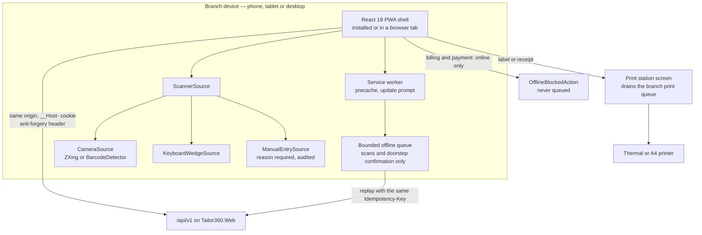

# ADR-0003 — Deliver the client as a React 19 and TypeScript installable progressive web application

This record decides how staff reach the system on the shop floor: one installable progressive web application
built with React 19 and TypeScript, served from the same origin as the application programming interface, rather
than native Android and iOS applications or a plain server-rendered site. It fixes the client stack, the
installability and offline posture, and the fallbacks that make camera scanning and label printing work on the
devices a tailoring branch actually owns.

| Field | Value |
| --- | --- |
| **Status** | Accepted — 2026-09-04 |
| **Deciders** | Technical reviewer; business owner (device fleet and cost) |
| **Consulted** | Roadmap issue #1 and epic #12; assumption A4 (hardware) |
| **Informed** | Every frontend implementing session; Reception, Tailor Master, Tailor, Inventory Clerk, Cashier, Delivery Staff and Branch Manager as the users of it |
| **Plan decision** | D2 |
| **Plan sections** | 2.3 (browser matrix and accessibility release gates), 4.6, 5.2 |
| **Issues affected** | #18 (this record), #50 (design system, layouts, installability, localisation), #51 (service worker, updates, offline resilience), #52 (accessibility, cross-browser, performance), #36 (scanner experience), #35 (label printing and the print station), #28 and #32b (capture and intake screens), #48 (delivery screens) |
| **Depends on open decision** | OD-07 — device, browser and printer matrix. Owner: business owner. Needed **before the Wave 0 exit gate**. The matrix bounds what "supported" means but does not change the client model |
| **Supersedes / superseded by** | None |

---

## 1. Context and problem statement

The people who use this system are standing at a counter, sitting at a cutting table, or at a customer's door.
Assumption A4 fixes the fleet: Android phones and tablets, iPhones and iPads, desktop browsers, universal serial
bus or Bluetooth keyboard-wedge barcode scanners, thermal label printers and A4 printers. Devices at the counter
and in the workshop may be shared between staff.

The work those devices must do is specific:

| Journey | Client requirement |
| --- | --- |
| Intake and measurement capture | Long forms with numeric measurement inputs including inch fractions, resumable across interruptions, on a phone held in one hand |
| Scanning | Camera decoding of Code 128 and QR, plus keyboard-wedge input, plus an audited manual-entry fallback; continuous scanning without a round trip per garment |
| Photographs | Camera capture of material and reference images, uploaded over a branch's 4G or shared broadband |
| Workboard and queues | Dense tables on desktop, master-detail on tablet, a scanner-first action on phone |
| Billing and payment | Online-only, never queued offline, with unambiguous blocked-action states |
| Delivery | A doorstep confirmation scan that may happen with a poor connection |
| Printing | Labels and receipts to a thermal printer, invoices to A4 |

Release gates make the bar explicit: WCAG 2.2 AA, a browser matrix covering the latest Chrome, Edge, Firefox and
Safari plus iOS/iPadOS Safari and Android Chrome, and cross-browser and performance evidence per release.

**The question:** what client technology delivers those journeys across that fleet, at a cost and release cadence
a three-branch business can sustain, without an app store standing between a bug fix and the shop floor?

## 2. Decision drivers

| # | Driver | Why it matters here |
| --- | --- | --- |
| D1 | One codebase across phone, tablet and desktop | Three lanes of delivery cannot also mean three client codebases; the design system, forms and validation must be written once |
| D2 | Release cadence measured in minutes, not review queues | A wrong tax rate or a broken workboard must be fixable the same day. App store review is not compatible with that |
| D3 | Camera and keyboard-wedge scanning on the real fleet | Barcode custody is the spine of the product. Decoding must work on mid-range Android and on iOS Safari, and must never depend on a single browser interface |
| D4 | Installability and a bounded offline capability | Staff expect an icon on the home screen. Some operations may be queued offline (scans, the doorstep delivery confirmation); billing and payment must not be |
| D5 | Accessibility and localisation | WCAG 2.2 AA is a release gate; `en-IN` first with a `ta-IN` catalogue, and layouts that tolerate 40 per cent text growth |
| D6 | Same-origin with the application programming interface | ADR-0006 puts authentication in a `__Host-` prefixed cookie on one origin; a client on a different origin would need a different, weaker scheme |
| D7 | Cost and skills | One frontend stack, one hiring profile, no per-platform signing certificates, no developer programme fees, no separate release pipelines |
| D8 | Device management reality | The business does not run a mobile device management system. Whatever ships must be installable by a staff member from a link |

## 3. Considered options

1. **React 19 and TypeScript installable progressive web application** (chosen)
2. **Native Android and iOS applications** (Kotlin and Swift, or a single .NET MAUI codebase)
3. **React Native or Expo**, with a separate web client for desktop
4. **Server-rendered multi-page application** with no installability and no offline capability

### 3.1 Option 1 — React 19 and TypeScript progressive web application (chosen)

A Vite-built single-page application served by `Tailor360.Web` from the same origin as `/api/v1`, installable
through a web application manifest, with a Workbox service worker for precaching, update prompts and a bounded
offline queue. TanStack Query for server state, React Router for routing, Tailwind CSS with headless accessible
primitives for the design system, react-hook-form with zod for forms, `@zxing/browser` for camera decoding with
the native `BarcodeDetector` interface used when present, FormatJS for localisation, and a typed client generated
from the OpenAPI document.

- Good, because one codebase serves phone, tablet and desktop; layouts are chosen by container queries rather
  than by user-agent sniffing, so a tablet in a stand and a desktop at the counter get the right density without
  a second application.
- Good, because a fix reaches every device on the next load — no store review, no staged rollout, no fleet of
  devices stuck on an old version. The version gate is server-side: `GET /api/version` plus a `426` response for
  clients below the minimum supported version.
- Good, because it shares the origin with the application programming interface, which is what makes the
  `__Host-` cookie session in ADR-0006 possible and keeps every token out of browser storage.
- Good, because scanning has three independent sources behind one interface — camera, keyboard wedge and audited
  manual entry — so a device with a broken camera, a denied permission or a hardware scanner all work.
- Good, because the typed client is generated from the OpenAPI document, so a contract change fails the frontend
  type check rather than reaching a user.
- Good, because accessibility tooling is mature: axe in continuous integration, Playwright across Chromium,
  Firefox and WebKit, Storybook stories for the loading, empty, error, offline and forbidden state of every
  screen.
- Bad, because iOS Safari is the weakest platform for progressive web applications: install is a manual
  "Add to Home Screen", storage can be evicted, background synchronisation is unavailable, and web push has
  historically required installed mode. The offline queue must therefore be explicit and visible, never assumed.
- Bad, because there is no direct access to a thermal printer from a mobile browser, which is why the print queue
  and the print-station screen exist rather than being a convenience.
- Bad, because camera decoding performance on low-end Android is variable; a decoding library plus a torch and
  focus strategy is more work than a native scanner view.
- Bad, because service workers add a genuinely difficult failure mode — a stale cached shell — which has to be
  designed against deliberately (versioned precache, never caching protected responses, an update prompt).

### 3.2 Option 2 — Native Android and iOS applications

Kotlin and Swift, or a single .NET MAUI codebase, distributed through the app stores or through enterprise
distribution, with a separate web client for desktop.

- Good, because camera scanning, printer access over Bluetooth, background upload and local storage are all
  first-class and fast, with no browser variability.
- Good, because installation is familiar to staff, and push notifications are unconditionally available.
- Good, because device capabilities the web cannot reach — direct thermal printer control, reliable background
  work — would remove the print-station indirection.
- Bad, because every fix goes through store review; the shop floor waits days for a change the business needs
  today.
- Bad, because it is two or three codebases (Android, iOS, and still a desktop web client for the Cashier and
  Branch Manager), which triples the accessibility, localisation and design-system work the release gates apply
  to.
- Bad, because it needs signing certificates, developer programme membership, provisioning and, realistically,
  device management — organisational overhead a three-branch business does not have.
- Bad, because authentication would move to a token model on a separate origin, giving up the cookie-session
  posture of ADR-0006 and adding secure token storage per platform.
- Bad, because the cost is not justified by the requirement: nothing in the journeys above needs a native
  capability that the web cannot reach except direct printer control, which the print station solves.

### 3.3 Option 3 — React Native or Expo, plus a separate web client

Share TypeScript and some logic, but render natively on mobile and build a second client for desktop browsers.

- Good, because it keeps one language and much shared logic while getting native scanning and printing.
- Good, because over-the-air updates soften the store-review problem for JavaScript-only changes.
- Bad, because "one codebase" is not true in practice: the component layer, navigation, forms and the design
  system diverge between the native client and the desktop web client, so the WCAG 2.2 AA gate, the pseudo-locale
  stories, the visual regression baselines and the cross-browser evidence are all done twice.
- Bad, because it still needs store distribution, signing and device provisioning for the mobile half.
- Bad, because the plan's client architecture — offline queue, service worker, generated OpenAPI client, network
  and permission states — would have two implementations with two sets of bugs.
- Bad, because it carries the disadvantages of both other options for the benefit of a capability set the print
  station already covers.

### 3.4 Option 4 — Server-rendered multi-page application

Razor Pages, Blazor Server or a similar server-rendered approach, with no installability and no offline
capability.

- Good, because it is the simplest thing that could work: no client build, no service worker, no state
  synchronisation, no generated client.
- Good, because it removes an entire class of bug — there is no stale cached shell if there is no cache.
- Good, because it shares the origin and the cookie session, exactly as Option 1 does.
- Bad, because the scanner experience needs client-side continuous decoding with immediate feedback; a page
  round trip per garment is unusable at a counter with a queue behind it.
- Bad, because the measurement capture wizard, the design picker and the workboard are stateful, interaction-heavy
  screens; rebuilding that interactivity on a server round trip is slower for the user and, over a branch's
  connection, unreliable.
- Bad, because there is no installability and no bounded offline queue, so the doorstep delivery confirmation and
  a workshop with a weak signal have no answer at all.
- Bad, because Blazor Server in particular depends on a persistent connection, which is the opposite of what a
  patchy 4G connection at a customer's door provides.

### 3.5 Comparison

| Driver | Progressive web application | Native applications | React Native plus web | Server-rendered |
| --- | --- | --- | --- | --- |
| D1 One codebase | Yes, all three form factors | No, two or three | No, two | Yes |
| D2 Release cadence | Minutes, server-controlled | Days, store review | Mixed | Minutes |
| D3 Scanning | Camera, wedge and manual behind one interface | Best available | Best on mobile, separate on desktop | Not viable |
| D4 Installable and bounded offline | Yes, weakest on iOS | Yes, strongest | Yes on mobile only | No |
| D5 Accessibility and localisation gates | One implementation to certify | Two or three | Two | One |
| D6 Same-origin cookie session | Yes | No, token model | No for mobile | Yes |
| D7 Cost and skills | One stack, no store overhead | Highest | High | Lowest |
| D8 Installable without device management | Yes, from a link | Needs distribution | Needs distribution | Not applicable |

## 4. Decision outcome

**Chosen option: the React 19 and TypeScript installable progressive web application.** It is the only option
that delivers all three form factors from one codebase, reaches the shop floor in minutes, and keeps the client
on the same origin as the application programming interface so that ADR-0006's cookie session — and therefore the
no-tokens-in-browser-storage guarantee — remains available. Its real weaknesses are on iOS and around printing,
and both are answered by design rather than by hope: an explicit, visible offline queue with a hard allowlist, and
a print queue with a print-station screen.

The decision fixes:

| Aspect | Decision |
| --- | --- |
| Framework and build | React 19, TypeScript in strict mode, Vite; no `any`; ESLint and Prettier |
| Serving | Static assets served by `Tailor360.Web` on the same origin as `/api/v1` |
| Server state | TanStack Query, injecting `Idempotency-Key`, `X-Correlation-Id`, `X-Client-Version` and the anti-forgery header, with conflict handling |
| Routing and layout | React Router with role-optimised shells; phone, tablet and desktop layouts selected by container queries, never by user agent |
| Forms | react-hook-form with zod; one `FieldProps` contract; a shared step-aware `FormErrorSummary`; `FractionInput` and `NumericStepper` for measurements |
| Scanning | A `ScannerSource` interface with `CameraSource` (`@zxing/browser`, using the native `BarcodeDetector` when present), `KeyboardWedgeSource` and `ManualEntrySource` (reason required, audited). The server re-validates namespace, check character, identity status and branch on every resolve and command |
| Installability | `manifest.webmanifest` with maskable icons, `display: standalone` and screenshots, iOS meta tags, and an Install page, shipped in Wave 1 so device evidence is recorded in installed mode |
| Service worker | Workbox via `vite-plugin-pwa`: precache versioned assets, network-first for the application programming interface, stale-while-revalidate only for an explicit allowlist of non-sensitive reference endpoints, never cache protected responses |
| Offline posture | A bounded queue for approved idempotent operations only — scan submissions and the doorstep delivery-confirmed scan against an online dispatch authorisation. Billing, payment and inventory reconciliation are online-only and show an `OfflineBlockedAction` state that says the action will not be queued |
| Printing | `IPrintQueue` and a print-station screen; every print action on a phone layout offers "Send to print station" first and "Download PDF" as the fallback |
| Localisation | FormatJS with ICU MessageFormat, `en-IN` default and a `ta-IN` catalogue, one `formatters` module for INR with lakh and crore grouping, `dd-MM-yyyy` dates and 12-hour time |
| Accessibility | WCAG 2.2 AA as a release gate; axe in Storybook and in end-to-end runs; status conveyed by icon and text, never colour alone; focus never obscured by bottom bars or the virtual keyboard |
| Client contract | The typed client is generated from OpenAPI with `openapi-typescript` and `openapi-fetch` |
| Version gate | `GET /api/version` drives the update prompt; the server answers `426` to clients below the minimum supported version |

## 5. Consequences

### 5.1 Positive

| Consequence | Who feels it |
| --- | --- |
| A defect is fixed and live the same day, on every device, with no store review | The business owner and every user |
| One design system, one accessibility certification, one localisation catalogue, one set of visual regression baselines | Frontend sessions and the release gates |
| No token ever reaches browser storage, because the client and the application programming interface share an origin | Security review; issues #23, #53, #56b |
| Staff install from a link with no device management system, and evidence is captured in installed mode | Branch Manager and Owner |
| A contract change fails the frontend type check before it can reach a user | Every session touching an endpoint |
| Scanning degrades gracefully: denied camera permission falls back to the hardware scanner, and both fall back to audited manual entry by job number | Reception, Tailor Master, Delivery Staff |

### 5.2 Negative

| Consequence | Who feels it | How it is mitigated or where it is handled |
| --- | --- | --- |
| iOS Safari installability is manual and its storage can be evicted | Staff on iPhones and iPads | The Install page gives explicit iOS instructions; the offline queue is bounded, visible and has a maximum age; nothing important lives only in client storage; queue loss degrades to "scan again", never to lost business state (issue #51) |
| No background synchronisation on Safari, so a queued scan sends when the application is next opened | Delivery Staff | The queue state is shown persistently, not as a toast; the doorstep confirmation references an online dispatch authorisation obtained before leaving the branch (issue #48) |
| A mobile browser cannot drive a thermal printer | Reception and Cashier on phones | The print queue and print-station screen are part of the design, not a workaround; an optional network or local print-bridge adapter arrives with issue #55 |
| Camera decode speed varies on low-end Android | Whoever scans on that device | The keyboard-wedge source is the primary path in the workshop; `BarcodeDetector` is used when present; issue #36 records per-device evidence and OD-07 bounds the supported set |
| A stale cached application shell is a real failure mode | All users | Versioned precache, never caching protected responses, an update prompt driven by `GET /api/version`, and a server `426` for clients below the minimum supported version; rollback is rehearsed with an old client cached in a browser (plan Section 4.7) |
| Service worker, offline queue and conflict handling are genuinely complex code | Frontend sessions | Confined to issue #51 with explicit tests for install, update, rollback, duplicate submission, conflict and quota eviction; the offline allowlist is deliberately tiny |
| Two toolchains in one repository | Delivery | Accepted; the pull-request pipeline budget accounts for both |

## 6. Confirmation

| Check | Mechanism | Where |
| --- | --- | --- |
| The browser matrix is met | Playwright across Chromium, Firefox and WebKit at phone, tablet and desktop profiles in both orientations | Issue #52, plan Section 5.3 |
| WCAG 2.2 AA holds | axe in Storybook and in end-to-end runs, plus manual screen-reader and 200 per cent zoom notes per journey | Issues #50 and #52 |
| No horizontal overflow and no obscured focus | A Playwright helper asserting at 320, 360, 768, 1024 and 1280 pixels and at 200 per cent zoom | Issue #50 |
| No token in browser storage | A browser test inspecting `localStorage`, `sessionStorage` and IndexedDB after login | Issue #23, re-run by #53 |
| Protected responses are never cached | Cache inspection test over the service-worker registration | Issue #51 |
| Only allowlisted operations are queued offline | Unit and end-to-end tests over the queue allowlist, including a blocked billing action | Issue #51 |
| The generated client matches the contract | `openapi-typescript` regeneration plus the frontend type check in continuous integration | Issue #53 |
| Performance budgets hold | Lighthouse CI budgets with a before-and-after report per release | Issue #52 |

## 7. Revisiting this decision

Revisit if one of the following becomes true, and record the outcome as a new decision rather than as a change of
practice.

| Trigger | What it would mean |
| --- | --- |
| A required capability proves genuinely unreachable from the web on a supported device — for example, direct thermal printing that the print station cannot cover, or reliable background upload on iOS | A narrowly scoped companion native application for that one capability, not a wholesale move; the progressive web application would remain the primary client |
| The supported device matrix (OD-07) settles on hardware whose browser cannot meet the scanning or performance targets | Either the matrix or the client model changes; the evidence would come from issue #36 and issue #52 |
| Push notifications to staff become a hard requirement on a platform that cannot deliver them to an installed progressive web application | A companion application or a different notification channel; the notification module already treats channels as adapters |

Nothing here is a reason to revisit on its own: iOS install friction, occasional queue eviction, or a camera that
decodes slowly on an old handset. Those are known costs, mitigated above, and were accepted when this record was
made.

## 8. Links

| Document | Why it is relevant |
| --- | --- |
| [`../IMPLEMENTATION_PLAN.md`](../IMPLEMENTATION_PLAN.md) | Sections 2.3, 3 (D2), 4.6, 5.2 |
| [`../architecture/container.md`](../architecture/container.md) | The client as a container and its relationship to the web host |
| [`../architecture/components.md`](../architecture/components.md) | The client-side component structure |
| [`../prd/glossary.md`](../prd/glossary.md) | Role and domain vocabulary the interface must use |
| [`../prd/assumptions-and-open-decisions.md`](../prd/assumptions-and-open-decisions.md) | Assumption A4 (hardware) and OD-07 (device, browser and printer matrix) |
| [`0006-bff-cookie-session.md`](0006-bff-cookie-session.md) | Why the client shares an origin with the application programming interface |
| [`0005-object-storage-authorised-delivery.md`](0005-object-storage-authorised-delivery.md) | How the client obtains images without ever holding a storage location |
