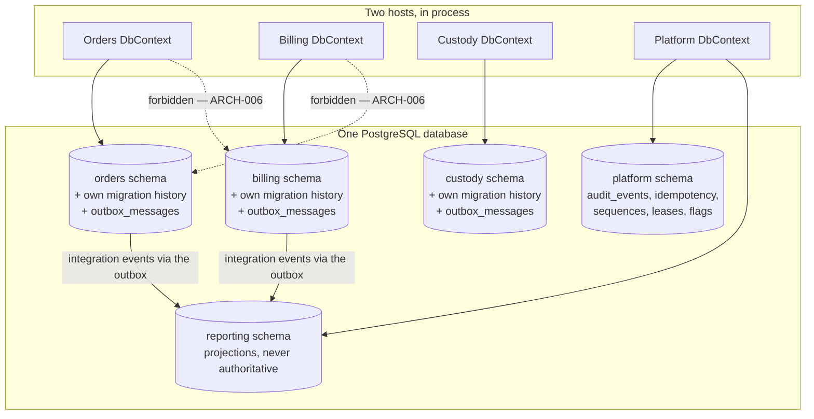

# ADR-0004 — One PostgreSQL database, one schema and one DbContext per module, with per-schema migration history

This record decides how HyFib Tailor 360 stores its relational data: a single PostgreSQL database in which each
module owns exactly one schema, is mapped by exactly one EF Core `DbContext`, and carries its own migration
history table. It is the data half of the module ownership that ADR-0001 draws in code, and it is what makes
"no module reads another module's tables" a testable statement rather than a rule people try to remember.

| Field | Value |
| --- | --- |
| **Status** | Accepted — 2026-09-04 |
| **Deciders** | Technical reviewer |
| **Consulted** | [`../architecture/module-ownership.md`](../architecture/module-ownership.md); [`../architecture/invariants.md`](../architecture/invariants.md) |
| **Informed** | Every implementing session; whoever runs backups and restores |
| **Plan decision** | D3 |
| **Plan sections** | 2.2, 4.2, 4.3, 4.4 (configuration, secrets and database roles), 4.5, 5.2 |
| **Issues affected** | #18 (this record), #20 (module skeletons and the local environment), #21 (persistence platform, migrations, outbox, audit chain), #40 and #44–#46 (reporting projections), #57 (audit retention by partition detach), #60 (backups and point-in-time recovery), and every module issue that owns a schema |
| **Depends on open decision** | None. OD-02 (hosting model) decides *where* the database runs, not how it is partitioned |
| **Supersedes / superseded by** | None |

---

## 1. Context and problem statement

ADR-0001 fixes eleven business modules plus a shared platform inside one deployable web host and one worker host,
with boundaries enforced by architecture tests. Those boundaries mean nothing if the Billing module can write
`SELECT * FROM garment_jobs`. Plan Section 2.2 makes this non-negotiable: no cross-module table access unless an
architecture decision record permits it; modules talk through `Contracts` projects and events.

At the same time four invariants must commit in a single database transaction (ADR-0001 Section 1): order
confirmation with its snapshots, barcode identity, audit event and outbox message; stock consumption with its
ledger entry and balance; invoice posting with its sequence allocation; and a custody transfer with its scan
event and idempotency record. Two of those — order confirmation allocating a barcode identity, and invoice posting
writing an audit event — span module schemas.

The operational context is equally binding. The baseline is a single virtual machine with PostgreSQL sized at
about 2 GB resident memory and `max_connections = 100`, a connection budget allocated across the web host, the
worker, the migrator and tooling, and a disaster-recovery plan built on one point-in-time recovery timeline with a
proposed recovery-point objective of 15 minutes and a recovery-time objective of 4 hours (both proposed, to be
confirmed by issue #19).

Several further requirements land squarely on the storage layer: append-only tables protected by triggers so the
application role physically cannot update or delete a posted invoice, a ledger entry or a custody event; a
hash-chained audit table partitioned by month so retention is a partition detach rather than a mass delete; a
read-only reporting role; and an outbox table per module claimed with `FOR UPDATE SKIP LOCKED`.

**The question:** how should the relational store be partitioned so that module ownership is enforceable by
construction, the atomic invariants still commit in one transaction, and a three-branch business still has one
thing to back up and restore?

## 2. Decision drivers

| # | Driver | Why it matters here |
| --- | --- | --- |
| D1 | Ownership must be enforceable, not remembered | A forbidden cross-module read has to fail a pull request, and ideally fail at the database as well |
| D2 | The four atomic invariants must stay atomic | Money, stock and physical custody guarantees; making them eventually consistent creates business-visible partial states |
| D3 | One restore | Recovery-point and recovery-time objectives assume one database and one point-in-time recovery timeline; multiple stores would need mutually consistent recovery |
| D4 | Connection budget | `max_connections = 100` on the baseline machine, split across web transactional and reporting pools, worker pools, the migrator and tooling. Each additional datastore multiplies pools |
| D5 | Independent module migrations | A module must be able to evolve its own tables without coordinating a shared migration history, so parallel delivery lanes do not collide |
| D6 | Least privilege at the database | Distinct roles for migration, application, reporting, retention and backup, with the runtime role holding no schema-definition rights |
| D7 | Append-only enforcement below the application | Immutability of posted invoices, ledger entries, scan events and audit rows must survive an application defect |
| D8 | Operability | One database to tune, monitor, vacuum, patch and restore, by people who are not database administrators |

## 3. Considered options

1. **One database, one schema and one `DbContext` per module, per-schema migration history** (chosen)
2. **One database, one schema, one `DbContext`**
3. **One PostgreSQL cluster, one database per module**
4. **A separate database server per module** (managed instances, or one container each)

### 3.1 Option 1 — One database, schema per module, `DbContext` per module (chosen)

Twelve schemas — `identity`, `customers`, `catalog`, `media`, `orders`, `custody`, `inventory`, `billing`,
`reporting`, `notifications`, `integration`, `platform` — in one database. Each module's `Infrastructure` project
holds one `DbContext` that maps only its own schema, with its own `__EFMigrationsHistory` table inside that
schema. No foreign key crosses a schema boundary; cross-module references are identifier columns validated by
application invariants and integration events.

- Good, because ownership is visible in the physical model. A `DbContext` that maps another schema's table is a
  source-scan architecture rule failure (`ARCH-006`), and the schema layout makes an accidental join obvious in
  review.
- Good, because the atomic invariants remain a single transaction: one connection, one `TransactionScope` across
  the two `DbContext` instances involved, no distributed coordination, no compensation.
- Good, because there is exactly one thing to back up, restore and recover to a point in time, and a restore is
  automatically internally consistent across every module.
- Good, because each module owns its migration history, so two sessions in different modules never contend on a
  shared history table and migrations apply independently and in any order.
- Good, because database roles apply cleanly: `t360_migrator` owns the schemas and the triggers and is the only
  role with schema-definition rights; `t360_app` has data-manipulation rights with insert-only grants on
  append-only tables and no truncate; `t360_reporting` reads `reporting.*` and contract views in a read-only
  transaction; `t360_retention` detaches and drops audit partitions; `t360_backup` reads for backup.
- Good, because it keeps a documented, mechanical path to extraction: a schema with no cross-schema foreign key,
  view or query is a schema that can be lifted out (ADR-0001 criterion X5).
- Good, because one connection pool per host per role fits the connection budget; the budget is validated at
  startup against `SHOW max_connections` and alerts at 80 per cent.
- Bad, because referential integrity across modules is the application's job. A garment job identifier stored in
  `billing` is not enforced by a foreign key, so an orphan is possible if an invariant is wrong; reconciliation
  jobs exist partly for this reason.
- Bad, because nothing at the database level physically prevents a determined developer from writing raw SQL
  across schemas. The grant model narrows this and the architecture tests catch it, but it is a discipline
  boundary rather than a wall.
- Bad, because a query that would like to join across modules — a report over orders, billing and custody — has
  to be served by the Reporting module's own projections rather than by a convenient join.

### 3.2 Option 2 — One database, one schema, one `DbContext`

The conventional arrangement: everything in `public`, one context, one migration history, foreign keys anywhere.

- Good, because it is the simplest possible setup, with one migration history and one context to configure.
- Good, because referential integrity is enforced by the database everywhere, so orphan rows are impossible.
- Good, because any join is available to any query, which makes ad-hoc reporting trivial.
- Bad, because it makes module ownership unenforceable at exactly the layer where violations do the most damage.
  There is no `ARCH-006` to write, because there is nothing to detect.
- Bad, because one migration history is a contention point for parallel lanes: two sessions adding migrations in
  the same release collide on ordering.
- Bad, because it forecloses ADR-0001's extraction path entirely — untangling cross-schema foreign keys after
  the fact is the expensive version of the work this option skips.
- Bad, because plan Section 2.2 forbids it.

### 3.3 Option 3 — One cluster, one database per module

Twelve databases in one PostgreSQL cluster, each with its own connection pool.

- Good, because isolation is stronger than schemas: a cross-database query is not possible without a foreign-data
  wrapper, so ownership is enforced by the engine.
- Good, because it is still one server to patch, monitor and host, so the infrastructure cost is close to
  Option 1.
- Good, because per-database roles and grants are very clean.
- Bad, because a transaction cannot span two databases in PostgreSQL. Order confirmation allocating a barcode
  identity, and invoice posting writing an audit event, would each need two-phase commit or a saga — the exact
  cost ADR-0001 rejected microservices to avoid.
- Bad, because connection pools multiply: twelve databases times the pools each host needs, against
  `max_connections = 100`. This forces a connection pooler on day one for no functional gain.
- Bad, because point-in-time recovery restores the whole cluster to one moment, which is fine, but any
  per-database logical restore reintroduces the cross-database consistency problem the single database avoids.
- Bad, because the shared platform tables — outbox, idempotency, audit, sequences, leases — are used by every
  module and would either be duplicated or become a cross-database dependency.

### 3.4 Option 4 — A separate database server per module

Each module gets its own PostgreSQL instance, container or managed service.

- Good, because it is the strongest isolation available and would let one module's storage be scaled or tuned
  independently.
- Good, because it is the arrangement a genuine microservices split would eventually need, so it would be one
  fewer step at extraction time.
- Bad, because it is a distributed data architecture without a distributed architecture's benefits: the code
  still ships as one deployable, so all the coordination cost is paid and none of the release independence is
  gained.
- Bad, because the atomic invariants become distributed transactions, as in Option 3.
- Bad, because twelve instances do not fit the baseline single virtual machine, and each adds memory,
  connections, backup configuration, monitoring, patching and a restore procedure.
- Bad, because disaster recovery becomes "restore twelve stores to a mutually consistent point", which is
  materially harder than the plan's single restore and would move the recovery-time objective in the wrong
  direction.

### 3.5 Comparison

| Driver | Schema per module | Single schema | Database per module | Server per module |
| --- | --- | --- | --- | --- |
| D1 Enforceable ownership | Testable, and visible in the physical model | Not possible | Enforced by the engine | Enforced by the engine |
| D2 Atomic invariants | One transaction | One transaction | Two-phase commit or sagas | Two-phase commit or sagas |
| D3 One restore | Yes | Yes | Cluster restore, logical restore is harder | No |
| D4 Connection budget | Fits | Fits | Needs a pooler immediately | Does not fit |
| D5 Independent migrations | Per-schema history | Shared history, contention | Per database | Per server |
| D6 Least privilege | Clean role and grant model | Coarse | Clean | Clean |
| D7 Append-only enforcement | Triggers owned by the migrator role | Possible but ownership is unclear | Possible | Possible |
| D8 Operability | One database | One database | One server, twelve databases | Twelve servers |

## 4. Decision outcome

**Chosen option: one PostgreSQL database with one schema and one `DbContext` per module, each schema carrying its
own migration history.** It is the only option that makes ownership enforceable while keeping the money, stock and
custody invariants in a single transaction and leaving the business with one database to restore.

The decision fixes:

| Aspect | Decision |
| --- | --- |
| Engine | PostgreSQL 16 or later, one database |
| Schemas | `identity`, `customers`, `catalog`, `media`, `orders`, `custody`, `inventory`, `billing`, `reporting`, `notifications`, `integration`, `platform` |
| Mapping | Exactly one `DbContext` per module, in that module's `Infrastructure` project, mapping only its own schema |
| Migration history | `__EFMigrationsHistory` inside each module's own schema, so migrations apply per module and in any order |
| Cross-schema references | Identifier columns only. No foreign key, view or query crosses a schema boundary; integrity is an application invariant backed by reconciliation jobs |
| Naming | Tables and columns in `snake_case`; every table carries `id`, `organisation_id`, `branch_id` where scoped, `created_at`, `created_by`, `updated_at`, `updated_by` and `xmin` |
| Identifiers | UUIDv7 primary keys; human-readable display numbers come from per-branch and per-financial-year sequences and are never lookup keys on unauthenticated surfaces |
| Concurrency | `xmin` as the concurrency token, surfaced as `ETag` and `If-Match` on editable aggregates, with a 409 problem-details response carrying the current version |
| Append-only tables | Audit events, ledger entries, scan events, custody transfers, posted invoices, payments, receipts and QC results are protected by triggers owned by `t360_migrator` that reject `UPDATE` and `DELETE` from the application role |
| Audit table | Hash-chained (`seq`, `prev_hash`, `row_hash`) by a `BEFORE INSERT` trigger, range-partitioned by month so retention is a partition detach under `t360_retention` |
| Outbox | One `outbox_messages` table per module schema, claimed with `UPDATE … WHERE id IN (SELECT … FOR UPDATE SKIP LOCKED) RETURNING *`, woken by `LISTEN outbox_<module>` with a 5-second poll fallback |
| Database roles | `t360_migrator` (schema-definition rights, owns schemas and triggers, used only by `migrate` and `init-reference-data`), `t360_app` (data manipulation; insert-only on append-only tables; no truncate), `t360_reporting` (read-only), `t360_retention` (partition detach and drop), `t360_backup` |
| Connection budget | Web transactional 30, web reporting 10, worker transactional 20, worker reporting 10, migrator 2, tooling 5, reserve 10, against `max_connections = 100`; validated at startup and alerting at 80 per cent |
| Migration compatibility | Forward-only, expand-migrate-contract, backward compatible with the previous release; the startup check tolerates applied-but-unknown migrations so release N runs against a database at N+1 |
| Reporting | Projections live in the `reporting` schema and are never the authoritative source of financial, stock, workflow or custody state |

## 5. Consequences

### 5.1 Positive

| Consequence | Who feels it |
| --- | --- |
| A cross-module table access fails a pull request within minutes and is visible in the physical model besides | Every implementing session |
| Order confirmation, invoice posting, stock consumption and custody transfer stay atomic with no saga or compensation | Reception, Cashier, Inventory Clerk |
| One backup, one point-in-time recovery timeline, one internally consistent restore | Whoever runs the recovery drill (issue #60) |
| Two sessions in different modules add migrations without colliding on a shared history | Parallel delivery lanes |
| A posted invoice, a ledger entry, a scan event and an audit row cannot be altered by the application role even if the application has a defect | The Owner, the accountant and the auditor |
| Audit retention is a partition detach rather than a mass delete, so it is fast and does not bloat the table | Operations; issue #57 |
| A module whose schema has no cross-schema dependency satisfies ADR-0001 extraction criterion X5 by construction | A future extraction |

### 5.2 Negative

| Consequence | Who feels it | How it is mitigated or where it is handled |
| --- | --- | --- |
| Cross-module referential integrity is not enforced by the database, so orphan references are possible | Data quality overall | Application invariants recorded in [`../architecture/invariants.md`](../architecture/invariants.md); reconciliation jobs in the worker; reporting reconciliation runs that report mismatches rather than hiding them |
| A convenient cross-module join is unavailable | Whoever writes a report or a screen spanning modules | The Reporting module owns projections built from events and read contracts (ADR-0011); the customer timeline is composed in the BFF from `ITimelineSource` implementations, not by a join |
| Twelve migration histories mean twelve places a migration can be pending | Operations and the startup check | `/health/startup` fails on any unapplied migration; the `migrate` service runs once before the hosts start; the command-line tool reports per-module state |
| Nothing at the engine level stops raw SQL across schemas | Reviewers | Role grants narrow it; `ARCH-006` and the source-scan rules detect it; a genuine need requires an architecture decision record amending this one |
| A single database is a single point of contention: one module's heavy query can affect another | All users | The connection budget separates transactional and reporting pools; `t360_reporting` runs read-only; statement timeouts and the rate-limit catalogue bound the blast radius; a read replica is an option that requires recomputing the budget |
| Restoring a single module's data alone is not a native operation | Operations, rarely | Accepted. A single-module restore is a logical restore into a scratch database followed by a targeted, reviewed data fix — a runbook procedure (issue #60), not an everyday one |
| Two `DbContext` instances in one transaction need care with connection sharing | Backend sessions | Handled once in `Platform.Persistence`, with tests for the confirmation participant hook and the audit interceptor (issue #21) |

## 6. Confirmation

| Check | Mechanism | Where |
| --- | --- | --- |
| No `DbContext` maps another schema's tables | Source-scan architecture test | `ARCH-006` in [`../architecture/architecture-rules.md`](../architecture/architecture-rules.md) |
| Only `Contracts` and `Platform.*` cross a module boundary | Project-graph architecture tests | `ARCH-002`, `ARCH-003`, `ARCH-004` |
| Each schema has its own migration history and migrates from an empty database and from the previous snapshot | Integration tests over Testcontainers PostgreSQL | Issue #21 |
| The application role cannot update or delete an append-only row | Integration test asserting the trigger rejects the write | Issue #21, re-verified by #57 |
| The audit hash chain is unbroken and has no gaps | Hourly verification job plus a chain-head anchor compared against the backup bucket | Issue #57 |
| The runtime role holds no schema-definition rights | Startup verification of role grants | Issue #21 |
| The connection budget is respected | Startup validation against `SHOW max_connections`, exported with an 80 per cent alert | Issue #21, plan Section 4.4 |
| Migrations are backward compatible with the previous release | Expand-migrate-contract review plus a rollback rehearsal with the database one migration ahead | [`../dev/migrations.md`](../dev/migrations.md), issue #59 |

## 7. Revisiting this decision

Revisit if measurement — not intuition — shows one of the following.

| Trigger | Likely response |
| --- | --- |
| One module's read load consistently degrades others despite the split pools, statement timeouts and query tuning | A read replica for `reporting` first, with a recomputed connection budget or PgBouncer in transaction mode; a separate datastore only if that is insufficient |
| The database grows far past the projected 5 GB per year and one module dominates it | Partitioning within that module's schema, or archival, before any structural change |
| A module satisfies all seven ADR-0001 extraction criteria | Its schema moves with it. Criterion X5 exists precisely so this record does not have to be unpicked at that point |
| More than one web replica becomes necessary | Not a change to this record, but it requires recomputing the connection budget or introducing PgBouncer, and a distributed session-revocation cache (ADR-0013) |

## 8. Links

| Document | Why it is relevant |
| --- | --- |
| [`../IMPLEMENTATION_PLAN.md`](../IMPLEMENTATION_PLAN.md) | Sections 2.2, 3 (D3, D9, D10, D11), 4.2, 4.3, 4.4, 4.5, 5.2 |
| [`../architecture/module-ownership.md`](../architecture/module-ownership.md) | Which module owns which schema, storage prefix, event and read contract |
| [`../architecture/invariants.md`](../architecture/invariants.md) | The invariants that replace cross-schema foreign keys |
| [`../architecture/conventions.md`](../architecture/conventions.md) | Naming, money, time, identifier and concurrency conventions |
| [`../architecture/architecture-rules.md`](../architecture/architecture-rules.md) | `ARCH-006` and the module-boundary rules |
| [`../platform/database.md`](../platform/database.md) | Roles, grants and the operational view of the database |
| [`../dev/migrations.md`](../dev/migrations.md) | How a migration is written, applied and rolled back |
| [`0001-modular-monolith.md`](0001-modular-monolith.md) | The code half of module ownership and the extraction criteria |
| [`0005-object-storage-authorised-delivery.md`](0005-object-storage-authorised-delivery.md) | The equivalent ownership rule for object storage prefixes |
| [`0007-branch-aware-single-tenancy.md`](0007-branch-aware-single-tenancy.md) | Why every scoped table carries `organisation_id` and `branch_id` |
