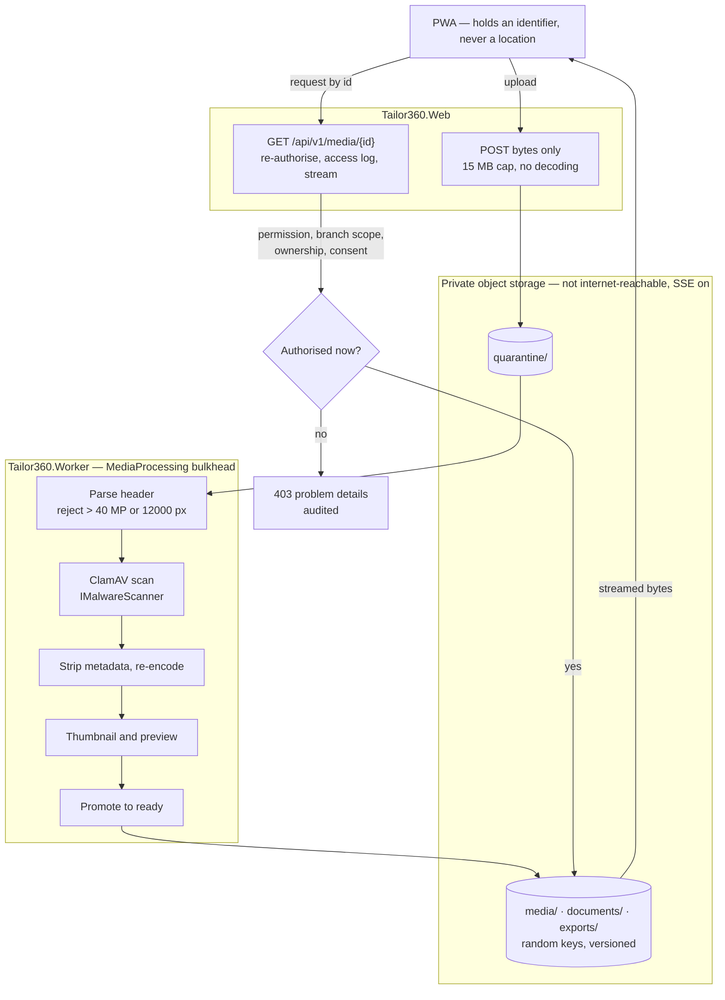

# ADR-0005 — Store files in private S3-compatible object storage and deliver them only by authorised streaming

This record decides where photographs, documents and exports live and how they reach a browser: a private,
S3-compatible object store that is not reachable from the internet, with every byte delivered through an
application endpoint that re-authorises the request and streams the object. The progressive web application never
receives a storage location, and pre-signed public links are out of scope. It also fixes the upload pipeline —
quarantine, malware scan, metadata strip, re-encode, promote — and who owns which prefix.

| Field | Value |
| --- | --- |
| **Status** | Accepted — 2026-09-04 |
| **Deciders** | Technical reviewer; business owner (storage cost and retention) |
| **Consulted** | Plan Sections 4.4 (media pipeline) and 4.3 (storage ownership) |
| **Informed** | Every session touching media, documents or exports; whoever runs backups |
| **Plan decision** | D4, with D16 (malware scanning) |
| **Plan sections** | 2.1, 2.3, 3 (D4, D16, D18), 4.3, 4.4, 4.6 |
| **Issues affected** | #18 (this record), #20 (local MinIO and the storage distribution decision), #31 (secure media pipeline), #24 (per-request re-authorisation), #42 (invoice, estimate and receipt artefacts under `documents/`), #46 (governed exports under `exports/`), #55 (provider adapters), #57 (retention, holds and data-subject requests), #60 (bucket versioning, object lock and off-site copies) |
| **Depends on open decision** | OD-02 (hosting model — decides the concrete storage product and its cost band) and OD-08 (retention periods for images and documents). Neither changes the delivery model |
| **Supersedes / superseded by** | None |

---

## 1. Context and problem statement

The system holds files that are, in order of sensitivity: customer material and reference photographs, garment
design and QC evidence images, delivery evidence, measurement diagrams, invoice, estimate and receipt documents,
and generated report exports. At the baseline sizing (assumption A5) that is roughly 22 GB of original images a
year plus about 30 per cent derivatives, from three branches, uploaded over branch broadband and 4G.

The requirements are unambiguous. Roadmap issue #1 and issue #31 require private storage with no stable public
locations. Issue #24 requires that every media request be re-authorised — not authorised once at the point a link
is created, but on each retrieval. Plan Section 2.3 makes consent, retention and access controls on photographs
and measurements a release-level acceptance criterion.

There are two ways a file usually reaches a browser, and they differ in exactly the property that matters here.
A pre-signed link is a bearer credential: whoever holds the string can fetch the object until it expires, from
any network, with no further check. It cannot be revoked, it is not single-use, and it leaks the way strings leak
— in a screenshot sent to a family group, in a browser history on a shared counter device, in a proxy log, in a
support ticket. A streamed response, by contrast, is authorised at the moment of retrieval by the same permission
and branch-scope machinery as every other endpoint, and it can be denied the instant a user is deactivated or a
consent is withdrawn.

The photographs in question are of customers' garments and, in practice, sometimes of customers. This is a
domain where the second property is worth paying for.

**The question:** where should files be stored, and by what path should they reach an authorised member of staff,
given that the storage endpoint must not be internet-reachable and every retrieval must be re-authorised?

## 2. Decision drivers

| # | Driver | Why it matters here |
| --- | --- | --- |
| D1 | Every retrieval must be authorised at retrieval time | Issue #24. Permission, branch scope, resource ownership and consent state can all change between the moment a screen is rendered and the moment an image is fetched |
| D2 | No stable or shareable location | Issue #31. A location that survives outside the session is a credential the system did not intend to issue |
| D3 | Revocability | A deactivated user, a withdrawn consent or a retention deletion must take effect immediately, not when a link expires |
| D4 | Uploads are untrusted input | Anything a phone can produce can be adversarial: malformed images, decompression bombs, embedded payloads, misleading content types, location metadata in EXIF |
| D5 | Auditability | Sensitive reads are audited (plan Section 4.4); an access log is required for media |
| D6 | Portability | The same code must run against MinIO locally and against S3, R2 or Azure Blob through the S3 interface in production, because the hosting model is undecided (OD-02) |
| D7 | Ownership per module | Media owns image prefixes, Billing owns `documents/`, Reporting owns `exports/`; no module writes into another's prefix (ADR-0004's rule, applied to storage) |
| D8 | Recoverability and retention | Non-current object versions must be retained at least as long as database backups, with an off-site copy, and retention deletion must be a real deletion when it is due |
| D9 | Cost and operability on the baseline machine | Storage is roughly 100 GB with growth alerts; image processing is CPU-heavy and must not compete with request handling |

## 3. Considered options

1. **Private S3-compatible storage with authorised streaming through an application endpoint** (chosen)
2. **Private storage with pre-signed URLs handed to the browser**
3. **A public bucket or content delivery network with unguessable keys**
4. **Files in PostgreSQL as `bytea` or large objects**

### 3.1 Option 1 — Private storage, authorised streaming (chosen)

Objects live in a private S3-compatible bucket whose endpoint is not reachable from the internet, with
server-side encryption on every bucket, random object keys and a per-module prefix. The client requests
`/api/v1/media/{id}` — an identifier, not a location — and the endpoint re-checks permission, branch scope,
resource ownership and consent, records an access-log entry, and streams the object with range support and
`Cache-Control: private, no-store`.

- Good, because authorisation happens at the moment of retrieval, so a deactivation, a permission change, a
  branch reassignment or a withdrawn consent takes effect on the very next request.
- Good, because there is no string a user can copy that will fetch the file elsewhere. The identifier in the URL
  is useless without the session and the permission.
- Good, because the storage endpoint stays off the internet entirely, which removes bucket-policy
  misconfiguration — the most common cause of object storage exposure — as a class of risk.
- Good, because every sensitive read can be audited and access-logged in one place, which is what the privacy and
  retention work (issue #57) needs.
- Good, because retention and holds are meaningful: when a retention job deletes an object, it is gone, and no
  outstanding link can still fetch it.
- Good, because the S3 interface keeps the deployment portable across MinIO, S3, R2 and Azure Blob while OD-02 is
  open.
- Bad, because every byte passes through the web host, consuming its bandwidth, its sockets and a request thread
  for the duration of the transfer. A branch loading a gallery of thumbnails puts real load on the host.
- Bad, because a content delivery network cannot be put in front of the objects, so a device on a slow connection
  gets no edge caching.
- Bad, because streaming must be implemented carefully: range requests for large documents, correct entity tags,
  no buffering of whole objects into memory, and a bulkhead so a burst of downloads cannot exhaust the host.

### 3.2 Option 2 — Private storage with pre-signed URLs

The application authorises once, then returns a time-limited signed link and the browser fetches directly from
the storage endpoint.

- Good, because bytes bypass the application entirely, so the web host's bandwidth and threads are untouched and
  large downloads scale with the storage service rather than with the host.
- Good, because it is simple to implement and is the mainstream pattern for exactly this problem.
- Good, because a content delivery network can sit in front of the storage endpoint.
- Bad, because the signed link is a bearer credential with none of the session's protections: it works from any
  network, in any browser, for anyone who has the string, until it expires. It is time-bound, never single-use.
- Bad, because it cannot be revoked. Deactivating a user, withdrawing a consent or deleting under a retention
  policy does not invalidate a link already issued.
- Bad, because it requires the storage endpoint to be internet-reachable, which is precisely what plan D4
  refuses; that in turn re-opens bucket policy, cross-origin configuration and public-access-block as things that
  must be right forever.
- Bad, because the retrieval is invisible to the application, so the media access log and the audit of sensitive
  reads become partial.
- Bad, because short expiry does not solve it: an expiry short enough to be safe breaks a slow 4G download, and
  one long enough to work is long enough to leak.

### 3.3 Option 3 — Public bucket or content delivery network with unguessable keys

Objects are publicly readable but the keys are long random strings, so in practice nobody finds them.

- Good, because it is the cheapest and fastest possible delivery, with edge caching and no application
  involvement at all.
- Good, because it is trivially simple, with no signing and no expiry logic.
- Bad, because security rests entirely on the secrecy of a URL that is, by construction, shared with a browser —
  and therefore with its history, its cache, any extension, any proxy, any screenshot and any support ticket.
- Bad, because there is no authorisation of any kind: a customer's garment photographs would be readable by
  anyone who ever obtained the link, permanently.
- Bad, because it is incompatible with consent withdrawal, retention deletion, branch scoping and the audit of
  sensitive reads — four requirements this system has.
- Bad, because it fails the release-level acceptance criterion on consent and access controls for photographs
  outright.

### 3.4 Option 4 — Files in PostgreSQL

Store bytes in `bytea` columns or PostgreSQL large objects, delivered through the same authorised endpoint.

- Good, because authorisation, transactionality and backup are unified: an image and its metadata commit
  together, and one backup covers everything.
- Good, because there is one fewer service to run, secure, monitor and pay for — appealing on a single virtual
  machine.
- Good, because it removes the orphan problem entirely: no object without a row and no row without an object.
- Bad, because 22 GB of images a year plus derivatives lands in the database, against a projected database growth
  of under 5 GB a year. Backup size, backup duration, restore duration and the recovery-time objective all move
  in the wrong direction for data that is immutable and does not need transactional storage.
- Bad, because it inflates the working set and competes with the transactional workload for the same 2 GB of
  memory on the baseline machine.
- Bad, because streaming large binary data out of PostgreSQL ties up a database connection from the budget for
  the duration of the transfer.
- Bad, because it gives up the storage-side capabilities the plan relies on: object versioning with non-current
  retention, object lock, lifecycle rules and an inexpensive off-site copy.

### 3.5 Comparison

| Driver | Authorised streaming | Pre-signed URLs | Public with unguessable keys | Bytes in PostgreSQL |
| --- | --- | --- | --- | --- |
| D1 Authorised at retrieval | Yes, every request | Once, at issue time | Never | Yes |
| D2 No shareable location | Yes | No, the link is the credential | No | Yes |
| D3 Revocable immediately | Yes | No, only on expiry | No | Yes |
| D4 Untrusted upload handling | Same pipeline in all four options | Same | Same | Same |
| D5 Access log and audit | Complete | Partial | None | Complete |
| D6 Portability | S3 interface, any provider | S3 interface | Provider-specific | Database only |
| D7 Prefix ownership per module | Yes | Yes | Yes | Not applicable |
| D8 Versioning, object lock, off-site copy | Yes | Yes | Yes | Only via database backups |
| D9 Cost on the baseline machine | Host bandwidth and threads | Cheapest | Cheapest | Worst: backup and memory pressure |

## 4. Decision outcome

**Chosen option: private S3-compatible storage with authorised streaming.** The property that decides it is
revocability. In a system that records consent, enforces retention, scopes access by branch and audits sensitive
reads, a delivery mechanism that issues an unrevocable bearer credential for a customer's photographs is not
acceptable, however convenient. The cost — bytes through the web host — is real and is mitigated rather than
denied.

The decision fixes:

| Aspect | Decision |
| --- | --- |
| Storage | Private S3-compatible object storage. MinIO in development; S3, R2 or Azure Blob through the S3 interface in production. Issue #20 confirms the distribution to pin |
| Reachability | The storage endpoint is not internet-reachable. It is reached only by the web host and the worker on the internal network |
| Encryption | Server-side encryption on every bucket |
| Keys | Random object keys, never derived from customer data, a file name or a sequential identifier |
| Prefix ownership | Media owns the material, reference, diagram, QC-evidence and delivery-evidence prefixes; Billing owns `documents/`; Reporting owns `exports/`. No module writes to another module's prefix, enforced by per-module credentials or bucket policy |
| Delivery | One authorised endpoint per class, addressed by identifier. It re-checks permission, branch scope, resource ownership and consent on **every** request, writes an access-log entry, and streams the object with range support, an entity tag and `Cache-Control: private, no-store` |
| What the client never receives | A bucket name, an object key, a storage host, or any signed link |
| Upload path | The web host accepts bytes only, up to a default 15 MB cap, straight into the quarantine bucket. It never decodes an image |
| Processing | All decoding happens in the worker inside a bounded `MediaProcessing` bulkhead (concurrency 2, 30-second timeout): header parsed for dimensions and rejected above 40 megapixels or 12,000 pixels on a side, decoded signature validated, ClamAV scan through `IMalwareScanner`, metadata stripped and the image re-encoded, thumbnail and preview derivatives produced, then the object is promoted from quarantine to ready |
| Quarantine | An object is not retrievable until it has passed the scan and been promoted; a failed scan raises `MediaQuarantined` |
| Versioning and retention | Bucket versioning on, with non-current version retention at least as long as the database backup retention, an off-site copy of media buckets, and retention or hold state honoured by the deletion job |
| Degraded behaviour | Object storage reports Degraded on `/health/detail` and gates uploads with `503 media.unavailable`; it never removes the host from rotation |
| Pre-signed redirect mode | Out of scope. Adopting it requires a new architecture decision record that accepts an internet-reachable storage endpoint and states how revocation and the access log would still be satisfied |

## 5. Consequences

### 5.1 Positive

| Consequence | Who feels it |
| --- | --- |
| Deactivating a user, withdrawing a consent or reassigning a branch takes effect on the very next image request | The customer whose photographs they are; the privacy work in issue #57 |
| There is no link to leak: a screenshot of a URL fetches nothing without the session | Everyone |
| Bucket misconfiguration cannot expose the store, because the store is not on the internet | Security review; issue #56b |
| Every sensitive read is logged and auditable in one place | The Owner and the auditor |
| Retention deletion is real deletion, with no outstanding credential that still works | Issue #57 |
| The same code runs against MinIO and against any S3-compatible provider, so OD-02 stays genuinely open | Operations |
| Adversarial uploads are decoded only in the worker, behind a bulkhead, never in the request path | All users, through host stability |

### 5.2 Negative

| Consequence | Who feels it | How it is mitigated or where it is handled |
| --- | --- | --- |
| Every byte passes through the web host, using its bandwidth and a request thread | All users at peak | Derivatives mean galleries fetch thumbnails, not originals; range requests and entity tags allow resumption and revalidation; streaming never buffers a whole object; the `default-user` rate-limit policy bounds bursts. Measured against the issue #19 targets |
| No content delivery network or edge caching | Staff on slow connections | Accepted. Derivatives are small; the five-photo upload target on throttled 4G is an explicit issue #31 acceptance criterion, and download sizes are budgeted alongside it |
| Image processing is CPU-heavy and shares the worker with other jobs | Background job latency | The `MediaProcessing` bulkhead is bounded at concurrency 2 with a 30-second timeout; if it saturates persistently, a second worker instance handles it without code change (ADR-0001, trigger X3) |
| Two stores means orphans are possible in both directions | Data quality | The quarantine-to-ready promotion is the only path to retrievability; an outage and orphan-cleanup job reconciles both directions, with tests in issue #31 |
| Storage cost and growth must be watched | The business owner | 100 GB baseline with growth alerts; retention periods come from OD-08; the cost band is part of OD-02 |
| A storage outage blocks uploads | Reception and whoever is capturing photographs | Uploads answer `503 media.unavailable` with a clear state in the interface; the rest of the system keeps working, because storage Degraded never removes the host from rotation |
| Malware scanning adds latency and a dependency | Upload turnaround | ClamAV sits behind `IMalwareScanner` and is feature-flagged, with a fake by default in tests and the real contract test in a separate continuous-integration job |

## 6. Confirmation

| Check | Mechanism | Where |
| --- | --- | --- |
| The client never receives a storage location | Contract test over every media, document and export response shape; browser inspection in the end-to-end run | Issue #31, re-checked by #53 |
| Every media request is re-authorised | Authorisation-matrix tests including a revoked user, a cross-branch user and a withdrawn consent between two requests | Issues #24 and #31 |
| The storage endpoint is not internet-reachable | Storage-endpoint isolation test plus a network review in the deployment issue | Issues #31 and #59 |
| Uploads are never decoded in the web host | Source-scan review and the adversarial upload corpus, including decompression bombs | Issue #31 |
| Metadata is stripped and objects are re-encoded | EXIF strip test over a corpus with location metadata | Issue #31 |
| Objects are unreachable until promoted | Quarantine test asserting a pre-scan object is not retrievable | Issue #31 |
| Server-side encryption is on for every bucket | Storage health check asserting encryption configuration | Issues #31 and #60 |
| No module writes into another module's prefix | Per-module credentials or bucket policy, with an integration test attempting a forbidden write | Issue #31, plan Section 4.3 |
| Retention and holds behave | Retention idempotency and hold tests; a deleted object is genuinely gone | Issue #57 |
| Non-current versions and the off-site copy exist | Backup and immutability review | Issue #60 |

## 7. Revisiting this decision

Revisit if the streaming cost becomes a measured problem rather than a theoretical one — for example if media
delivery consistently consumes a large share of the web host's capacity at peak against the issue #19 targets.
The responses, in order of preference:

| Step | What it changes |
| --- | --- |
| Tune first | Smaller derivatives, better cache revalidation with entity tags, lazy loading in galleries, a dedicated rate-limit policy for media |
| Separate the path | Serve media from a second web instance sharing the same authorisation, so image traffic does not compete with commands. No change to this record |
| Reverse-proxy delegated streaming | Have the application authorise and then hand the transfer to the reverse proxy on the internal network. The authorisation property is preserved; this is an implementation change and needs only an amendment |
| Pre-signed redirect mode | Only with a new architecture decision record that supersedes this one, accepts an internet-reachable storage endpoint, and states explicitly how revocation, consent withdrawal, retention deletion and the media access log would be satisfied — because a time-bound link satisfies none of them today |

## 8. Links

| Document | Why it is relevant |
| --- | --- |
| [`../IMPLEMENTATION_PLAN.md`](../IMPLEMENTATION_PLAN.md) | Sections 2.1, 2.3, 3 (D4, D16, D18), 4.3, 4.4 |
| [`../architecture/module-ownership.md`](../architecture/module-ownership.md) | The storage-prefix ownership column |
| [`../architecture/container.md`](../architecture/container.md) | Object storage as a container and its network position |
| [`../architecture/invariants.md`](../architecture/invariants.md) | Media state invariants: quarantine, ready, retention hold |
| [`../prd/assumptions-and-open-decisions.md`](../prd/assumptions-and-open-decisions.md) | Assumption A5 (volumes), OD-02 (hosting), OD-08 (retention); the deferred entry for redirect-to-pre-signed delivery |
| [`0004-postgresql-schema-per-module.md`](0004-postgresql-schema-per-module.md) | Why files are not in the database, and the equivalent ownership rule for schemas |
| [`0006-bff-cookie-session.md`](0006-bff-cookie-session.md) | The session that authorises each retrieval |
| [`0003-react-typescript-pwa.md`](0003-react-typescript-pwa.md) | The client that holds identifiers rather than locations |
