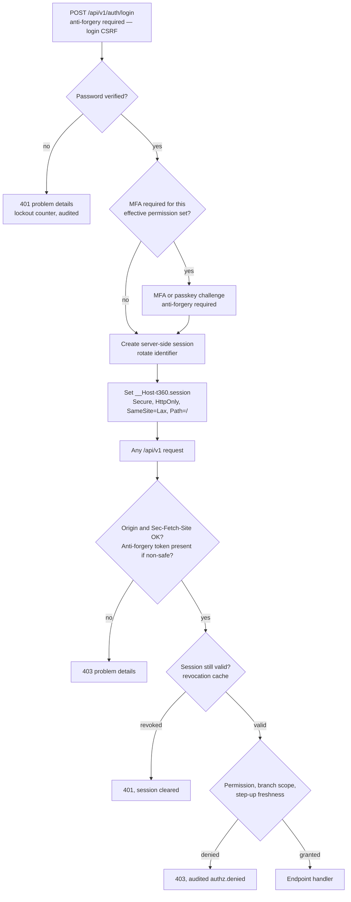

# ADR-0006 — Authenticate through a backend-for-frontend with `__Host-` prefixed cookie sessions

This record decides how a member of staff proves who they are: the web host serves both the progressive web
application and the `/api/v1` surface on one origin, and the browser holds an opaque session identifier in a
`__Host-` prefixed cookie backed by server-side session state. No access token, refresh token or identifier token
is ever placed in browser storage. It also fixes the cross-site request forgery defences — including on the login
endpoints themselves — and the `Origin` and `Sec-Fetch-Site` checks that sit behind them.

| Field | Value |
| --- | --- |
| **Status** | Accepted — 2026-09-04 |
| **Deciders** | Technical reviewer; business owner (shared-device behaviour) |
| **Consulted** | Roadmap issue #1; assumption A2 (staff-only, no customer accounts) |
| **Informed** | Every session touching authentication, authorisation, the client, or an endpoint's metadata |
| **Plan decision** | D5, with D21 (the session-revocation cache) |
| **Plan sections** | 2.2, 3 (D5), 4.4 (authentication and session; authorisation; customer links), 4.6 |
| **Issues affected** | #18 (this record), #23 (authentication, sessions, multi-factor authentication, recovery), #24 (permissions and branch scope), #53 (application programming interface standards, security headers, content security policy), #56a and #56b (threat models and the security baseline), #51 (offline queue replay under a live session) |
| **Depends on open decision** | OD-12 — primary authentication strategy and devices. Owner: business owner with the technical reviewer. Needed **before Wave 1**. It settles federation versus local accounts, the multi-factor-required role set, and shared-device behaviour; it does not change the cookie-session model itself (see Section 7) |
| **Supersedes / superseded by** | None |

---

## 1. Context and problem statement

This is a staff-only application. Assumption A2 fixes that customers hold no accounts at all — they interact
through expiring, purpose-bound links for estimates, status and feedback — so there is no consumer identity
surface and no third-party client to accommodate in version 1. The users are Reception, Tailor Master, Tailor,
Inventory Clerk, Cashier, Delivery Staff, Branch Manager and Owner, working on branch devices that may be shared
between staff at a counter or in the workshop.

ADR-0003 puts the client on the same origin as the application programming interface. That is what makes the
choice below available: a browser client that shares an origin with its server has no cross-origin problem to
solve, so the strongest browser credential mechanism is on the table.

Four requirements bear directly on the decision.

| Requirement | Source |
| --- | --- |
| Revocation must be effective quickly — a proposed 60 seconds at the 99th percentile on every host, to be confirmed by issue #19 — when a user is deactivated, suspended, has their role changed, or logs out everywhere | Plan Section 4.4, issue #23 |
| Cross-site request forgery must be prevented on every non-safe request, **and on the login, multi-factor challenge, passkey and recovery endpoints** (login cross-site request forgery, where an attacker logs a victim into the attacker's account) | Plan Section 4.4 |
| An idle session must warn before it ends and allow re-authentication in place, retrying the pending request with the same `Idempotency-Key` — a WCAG 2.2 success criterion, not only a convenience | Plan Sections 4.4 and 4.6 |
| A cross-site scripting defect must not hand an attacker a portable credential | Release gate: no unresolved critical or high security findings |

The last one deserves stating plainly. This application renders customer names, garment notes, item descriptions
and free-text feedback. A content security policy with nonces, output encoding and a strict component library make
cross-site scripting unlikely, but no team should design as though it is impossible. The question is what an
attacker gets if it happens once.

**The question:** what credential should the browser hold, where should it be kept, and what must guard it?

## 2. Decision drivers

| # | Driver | Why it matters here |
| --- | --- | --- |
| D1 | Blast radius of a cross-site scripting defect | A credential readable by JavaScript can be exfiltrated and replayed from anywhere. One that is not readable cannot |
| D2 | Immediate revocation | Deactivation, suspension, role change, password change and logout-everywhere must take effect within the revocation target on every host |
| D3 | Cross-site request forgery resistance, including at login | Cookies are sent by the browser automatically, so a cookie scheme must actively defend against forgery — at login as well as after it |
| D4 | Shared counter and workshop devices | A device is used by several people in a day; sessions must end predictably and be re-enterable without losing typed work |
| D5 | Simplicity that can be reasoned about | One authentication path for `/api/v1`, so "which credential authorised this?" always has one answer |
| D6 | Step-up authentication | Some permissions require recent strong authentication; the session must carry `last_strong_auth_at` and the endpoint must be able to demand it |
| D7 | Offline queue replay | A queued scan replays later under the same session, with the same idempotency key, and must be refused if the principal has since been revoked |
| D8 | No third-party browser client in version 1 | There is no cross-origin consumer to accommodate, so no compromise is needed for one |

## 3. Considered options

1. **Backend-for-frontend with a `__Host-` prefixed opaque session cookie and server-side session state** (chosen)
2. **Bearer JSON web token in `localStorage` or `sessionStorage`**
3. **Access token in memory plus a refresh token in a cookie** (the silent-refresh hybrid)
4. **External identity provider with tokens forwarded to a separate application programming interface origin**

### 3.1 Option 1 — Backend-for-frontend with a `__Host-` cookie session (chosen)

`Tailor360.Web` serves the static progressive web application and `/api/v1` on one origin. On successful
authentication it creates a server-side session record and sets `__Host-t360.session` to an opaque 256-bit
identifier. The cookie carries `Secure`, `HttpOnly`, `SameSite=Lax`, `Path=/` and no `Domain`, which is what the
`__Host-` prefix requires and enforces. Every non-safe request additionally carries an anti-forgery header token,
and middleware rejects any non-safe request whose `Sec-Fetch-Site` is `cross-site` or whose `Origin` is not the
host origin.

- Good, because the credential is not readable by JavaScript. A cross-site scripting defect can still act *as*
  the user inside the page, which is bad, but it cannot take a portable credential away and replay it from
  elsewhere later.
- Good, because the session is server-side state, so revocation is immediate and total: deactivate a user and
  the very next request on any host fails, once the revocation cache has been consulted.
- Good, because the `__Host-` prefix is enforced by the browser: a cookie with that prefix cannot be set with a
  `Domain` attribute or without `Secure`, which removes subdomain-injection tricks by construction.
- Good, because the session identifier is opaque, so it carries no claims a client could read or an attacker
  could learn from, and rotating it on login, multi-factor completion, step-up, password change, multi-factor
  reset and role change is trivial.
- Good, because step-up fits naturally: `last_strong_auth_at` on the session row, and an endpoint declaring
  `.RequireStepUp()` demands re-authentication within five minutes.
- Good, because the timeout warning and in-place re-authentication work without losing state: the pending request
  is retried with the same `Idempotency-Key`, so no work is lost and nothing is applied twice.
- Good, because there is exactly one authentication path on `/api/v1`, with justified `[AllowAnonymous("reason")]`
  endpoints as the only exception, and an architecture test asserts no endpoint accepts more than one scheme.
- Bad, because it requires server-side session storage and a revocation check on every request, which is state
  the stateless-token options do not need.
- Bad, because with more than one web replica the revocation cache must be shared or bounded, which is a
  dependency (ADR-0013) the single-replica baseline does not otherwise need.
- Bad, because a non-browser client cannot use this scheme, so any future third-party integration needs a
  separate one on `/api/ext/v1/**`.
- Bad, because iOS Safari caps script-writable storage lifetimes and some cookie lifetimes; sliding server-side
  expiry rather than a long cookie lifetime is required, which is a design constraint to respect.

### 3.2 Option 2 — Bearer token in browser storage

The server issues a signed JSON web token; the client stores it in `localStorage` or `sessionStorage` and sends
it in an `Authorization` header.

- Good, because it is stateless: no session store, no revocation lookup, and horizontal scaling is trivial.
- Good, because cross-site request forgery is structurally not a concern, since the browser does not attach the
  header automatically.
- Good, because the same token works for a browser client, a future mobile client and a third-party integration,
  with one scheme to document.
- Bad, because any script running on the page can read the token, which makes a single cross-site scripting
  defect a full credential theft rather than a session-bound compromise. The stolen token works from the
  attacker's machine, on their schedule.
- Bad, because revocation is genuinely hard: a signed token is valid until it expires. Making deactivation
  effective within 60 seconds means checking a revocation list on every request, at which point the statelessness
  that motivated the option is gone and a session store has been rebuilt with worse ergonomics.
- Bad, because short expiry plus refresh moves the problem rather than solving it: the refresh token becomes the
  valuable, long-lived, storage-resident credential.
- Bad, because it needs storage the offline-capable client must then be careful never to persist to disk, on
  devices that are shared.
- Bad, because it buys cross-origin flexibility this system does not need — the client is same-origin by design
  (ADR-0003).

### 3.3 Option 3 — Access token in memory plus refresh token in a cookie

Keep a short-lived access token in a JavaScript variable, never in storage, and hold a refresh token in an
`HttpOnly` cookie, silently refreshing.

- Good, because the access token is not persisted, so it does not survive a reload or a tab close and is not
  readable from storage.
- Good, because the refresh token gets cookie protections, so the long-lived credential is `HttpOnly`.
- Good, because it retains a token model for a future non-browser client without exposing a long-lived token to
  scripts.
- Bad, because it is strictly more machinery than Option 1 for strictly less benefit here: a cookie plus a
  refresh endpoint plus in-memory token plumbing plus refresh-race handling, in exchange for a property
  (statelessness) that the revocation requirement immediately takes away again.
- Bad, because a cross-site scripting defect can still read the in-memory token and, worse, can call the refresh
  endpoint at will to mint fresh ones for as long as the page lives.
- Bad, because refresh-token rotation, reuse detection and the resulting session-invalidation logic reintroduce
  server-side session state anyway.
- Bad, because a refresh in flight during a queued-request replay is an additional concurrency case for the
  offline queue to handle.

### 3.4 Option 4 — External identity provider with tokens to a separate origin

Federate authentication to an external provider; the client obtains tokens and calls an application programming
interface on a different origin.

- Good, because it centralises identity, password policy, multi-factor enrolment and recovery in a product built
  for it, which is genuinely less code to own.
- Good, because it is the right answer if HyFib ever runs several applications that must share staff identity.
- Good, because it gives single sign-on and provider-side security features for free.
- Bad, because it introduces an external dependency on the login path: if the provider is unreachable, the shop
  floor cannot work, and a tailoring branch has no fallback counter process for that.
- Bad, because it does not remove the token-storage question — it relocates it — and a cross-origin application
  programming interface gives up the same-origin cookie option entirely.
- Bad, because revocation now depends on the provider's propagation, which is harder to hold to a 60-second
  target than a local session store.
- Bad, because it adds a recurring cost and a vendor relationship for a business with fewer than a hundred staff
  accounts.
- Neutral, because this is exactly what OD-12 asks the owner to decide. If federation is chosen, it replaces the
  *credential-establishment* step; the session cookie afterwards can and should remain as described here.

### 3.5 Comparison

| Driver | BFF cookie session | Token in storage | In-memory plus refresh cookie | External provider, separate origin |
| --- | --- | --- | --- | --- |
| D1 Cross-site scripting blast radius | Session-bound, not portable | Full credential theft | Page-lifetime theft plus minting | Depends, usually portable |
| D2 Immediate revocation | Yes, server-side | No, without rebuilding a session store | Partial, via rotation and reuse detection | Provider-dependent |
| D3 Cross-site request forgery | Anti-forgery token, `SameSite`, `Origin` and `Sec-Fetch-Site`, including at login | Not applicable | Applies to the refresh endpoint | Not applicable |
| D4 Shared devices | Predictable timeout, in-place re-entry | Token may outlive the person at the counter | Better than storage | Provider-dependent |
| D5 One path to reason about | Yes, one scheme on `/api/v1` | Yes | Two mechanisms | Two systems |
| D6 Step-up | `last_strong_auth_at` on the session | Needs a claim and a re-issue | Needs a re-issue | Provider round trip |
| D7 Offline replay refused after revocation | Yes | No, until expiry | Partial | Provider-dependent |
| D8 Fits a same-origin client | Perfectly | Unnecessary flexibility | Unnecessary flexibility | Actively works against it |

## 4. Decision outcome

**Chosen option: the backend-for-frontend with a `__Host-` prefixed opaque session cookie.** The deciding
consideration is what an attacker gets from one mistake. Every option can be made to work; only this one ensures
that a cross-site scripting defect does not hand over a portable, unrevocable credential, and only this one makes
deactivation effective on the next request rather than at token expiry. The statelessness the token options offer
is illusory here, because the 60-second revocation requirement forces a per-request lookup regardless.

The decision fixes:

| Aspect | Decision |
| --- | --- |
| Topology | One origin. `Tailor360.Web` serves the static progressive web application and `/api/v1` |
| Cookie | `__Host-t360.session`, an opaque 256-bit session identifier, with `Secure`, `HttpOnly`, `SameSite=Lax`, `Path=/` and no `Domain` |
| Session state | Server-side session tickets in `identity.sessions`, with device and session inventory, logout-everywhere and immediate revocation |
| Rotation | The session identifier rotates on login, multi-factor completion, step-up, password change, multi-factor reset and role change |
| Revocation | Checked per request through the revocation cache backed by `identity.sessions`; revalidated per request when more than one web replica runs (ADR-0013). Target: effective within 60 seconds at the 99th percentile (proposed, to be confirmed by issue #19) |
| Timeouts | Sliding inactivity and absolute timeouts, with a two-minute warning dialogue (WCAG 2.2.1) and in-place re-authentication that retries the pending request with the same `Idempotency-Key` |
| Credentials | ASP.NET Core Identity with an Argon2id password hasher, time-based one-time-password multi-factor authentication, and passkeys |
| Step-up | Permissions carry `RequiresMfa` and `RequiresStepUp`; a step-up endpoint declares `.RequireStepUp()` and demands multi-factor re-authentication within five minutes, recorded in `identity.sessions.last_strong_auth_at` |
| Anti-forgery | A header token is required on every non-safe request from a cookie principal **and** on the login, multi-factor challenge, passkey and recovery endpoints, which closes login cross-site request forgery |
| Origin checks | Middleware rejects any non-safe request whose `Sec-Fetch-Site` is `cross-site`, or whose `Origin` is not the host origin |
| Browser storage | No access token, refresh token, identifier token or session identifier is written to `localStorage`, `sessionStorage` or IndexedDB. A browser test asserts this after login |
| Authentication paths | Exactly two in version 1: the cookie scheme for `/api/v1/**`, and justified `[AllowAnonymous("reason")]` endpoints (customer links, payment callbacks, health, telemetry ingest). An architecture test asserts no endpoint accepts more than one scheme |
| Future third-party clients | Application keys or OAuth client credentials on `/api/ext/v1/**`, a separate later issue, never sharing the cookie scheme |
| Customer links | Outside this scheme entirely: 128 random bits, only the SHA-256 hash stored, purpose-bound, expiring, revocable and rate-limited, served by a minimal page outside the application shell and the service-worker scope, with its own strict content security policy, `Referrer-Policy: no-referrer` and `Cache-Control: no-store` |
| Trusted devices | An optional revocable trusted-device cookie for shared counter devices, subject to OD-12 |

## 5. Consequences

### 5.1 Positive

| Consequence | Who feels it |
| --- | --- |
| A cross-site scripting defect cannot yield a portable credential that works later from elsewhere | Everyone; the penetration test in issue #56b |
| Deactivation, suspension, role change and logout-everywhere take effect on the next request | The Owner and Branch Manager, when someone leaves |
| Login cross-site request forgery is closed, not merely unlikely | Security review |
| A session timeout warns, and re-authentication in place retries the pending request exactly once with the same idempotency key, so typed work is never lost and never double-applied | Reception and Cashier mid-transaction; WCAG 2.2.1 |
| One authentication path on `/api/v1` means one answer to "what authorised this request?" | Every implementing session; the audit trail |
| A queued offline scan replayed by a since-revoked principal is refused rather than served from the idempotency store | Security review; issues #51 and #53 |
| No token storage means nothing sensitive survives on a shared counter device after logout | Branch Manager |

### 5.2 Negative

| Consequence | Who feels it | How it is mitigated or where it is handled |
| --- | --- | --- |
| Server-side session state and a per-request revocation check are required | The web host | The revocation cache is backed by `identity.sessions` with a documented propagation bound; a single replica needs no distributed cache (ADR-0013) |
| More than one web replica requires a shared or revalidated revocation cache | Operations, later | Explicitly recorded in ADR-0013 as a condition of adding a replica, alongside recomputing the connection budget |
| Non-browser clients cannot use this scheme | A future integration partner | Deliberate. Application keys or OAuth client credentials arrive on `/api/ext/v1/**` as a separate surface with its own threat model |
| Cross-site request forgery defence must be maintained on every non-safe endpoint forever | Every implementing session | Enforced centrally by middleware rather than per endpoint; the `Origin` and `Sec-Fetch-Site` check is global; the browser-side test suite in issue #53 re-runs it |
| A cross-site scripting defect can still act as the user within the page | Everyone | Reduced, not removed: an enforcing nonce-based content security policy from issue #53, components that emit no inline scripts or styles, output encoding, and step-up authentication on the most damaging actions |
| iOS Safari constrains cookie and storage lifetimes | Staff on iPhones and iPads | Sliding server-side expiry rather than a long-lived cookie; an unexpected logout is a re-login, never lost work, because drafts are shared server-side |
| A shared device leaves a session open if nobody logs out | Branch Manager | Absolute and inactivity timeouts; device and session inventory with logout-everywhere; the optional revocable trusted-device cookie is subject to OD-12 |
| Forwarded-header handling must be exactly right behind the reverse proxy, or the client address used for rate limiting is spoofable | Security | `ForwardedHeadersOptions.KnownNetworks` limited to the reverse-proxy network, failing fast when empty outside development; a spoof test is part of issue #53 |

## 6. Confirmation

| Check | Mechanism | Where |
| --- | --- | --- |
| Cookie name, prefix and attributes are exactly as decided | Integration test asserting the `Set-Cookie` header | Issue #23 |
| No token in browser storage | Browser test inspecting `localStorage`, `sessionStorage` and IndexedDB after login | Issues #23 and #53 |
| Anti-forgery is required on non-safe requests and on login, multi-factor, passkey and recovery endpoints | Integration tests per endpoint class, including a login cross-site request forgery case | Issue #23 |
| Cross-site requests are rejected | Middleware tests over `Sec-Fetch-Site: cross-site` and a foreign `Origin` | Issue #23 |
| Session fixation is prevented | Test asserting the identifier rotates on login, multi-factor, step-up, password change, multi-factor reset and role change | Issue #23 |
| Revocation meets its target | Revocation service-level-objective test across hosts | Issue #23, target confirmed by #19 |
| Exactly one authentication scheme per endpoint | Endpoint-inventory architecture test | Plan Section 4.4; [`../architecture/architecture-rules.md`](../architecture/architecture-rules.md) |
| Every anonymous endpoint carries a justification | Endpoint-inventory architecture test | `ARCH-007`, `ARCH-008` |
| Authorisation runs before the idempotency lookup | Integration test replaying a key as a revoked principal | Issue #53 |
| Step-up freshness is enforced | Authorisation-matrix test with a fresh and a stale strong-authentication dimension | Issue #24 |

## 7. Revisiting this decision

| Trigger | Likely response |
| --- | --- |
| OD-12 chooses federation with an external identity provider | The provider replaces credential establishment — password, multi-factor, recovery. The session cookie described here stays: the host exchanges the provider's assertion for a local session, so revocation, step-up freshness and the single `/api/v1` path are preserved. That is an amendment to this record, not a supersession |
| A third-party or machine client is required | A separate scheme on `/api/ext/v1/**` with its own threat model. This record is unchanged; the architecture test that forbids two schemes on one route is what keeps them apart |
| A native mobile client is introduced | Only then does a token model become necessary, and only for that client, on its own surface. See ADR-0003 Section 7 for when that would even be considered |
| More than one web replica is deployed | Not a change to this record, but it triggers the shared or revalidated revocation cache condition in ADR-0013 |

## 8. Links

| Document | Why it is relevant |
| --- | --- |
| [`../IMPLEMENTATION_PLAN.md`](../IMPLEMENTATION_PLAN.md) | Sections 2.2, 3 (D5, D21), 4.4, 4.6 |
| [`../architecture/architecture-rules.md`](../architecture/architecture-rules.md) | The endpoint-policy and single-scheme rules that enforce this record |
| [`../architecture/container.md`](../architecture/container.md) | The single-origin topology |
| [`../prd/assumptions-and-open-decisions.md`](../prd/assumptions-and-open-decisions.md) | Assumption A2 and OD-12 |
| [`0003-react-typescript-pwa.md`](0003-react-typescript-pwa.md) | Why the client shares an origin with the application programming interface |
| [`0005-object-storage-authorised-delivery.md`](0005-object-storage-authorised-delivery.md) | The session that re-authorises every media retrieval |
| [`0007-branch-aware-single-tenancy.md`](0007-branch-aware-single-tenancy.md) | The branch scope evaluated alongside every permission |
