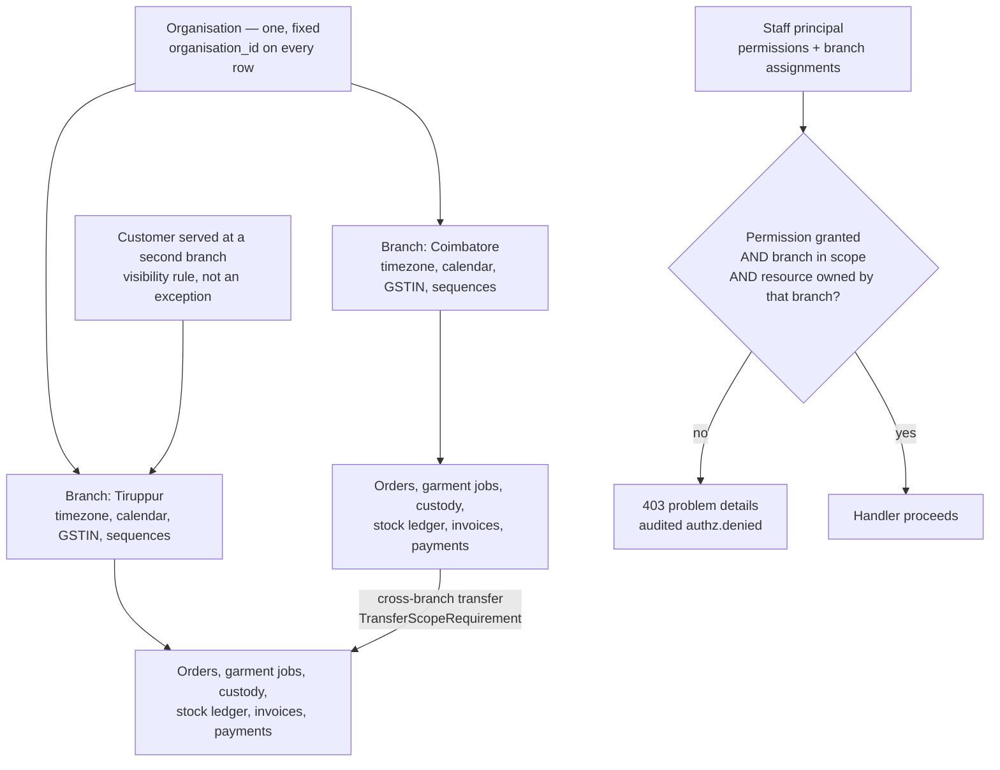

# ADR-0007 — Model one organisation with branch scoping, and keep multi-tenancy an additive change

This record decides the tenancy model: HyFib Tailor 360 serves exactly one organisation — one legal entity — and
scopes every operational record to a branch. `organisation_id` is carried on rows from day one as a fixed value,
so that if a second legal entity is ever required the change is additive rather than a schema rewrite. It also
states, concretely, everything that would have to change if multi-tenancy became a requirement, so that the
"branch-aware from day one" claim is a costed statement rather than a comforting one.

| Field | Value |
| --- | --- |
| **Status** | Accepted — 2026-09-04 |
| **Deciders** | Technical reviewer; business owner (the business shape this assumes) |
| **Consulted** | Assumption A1 (one legal entity, branches in Tamil Nadu, INR, GST-registered) |
| **Informed** | Every implementing session; the accountant, for GST registration and document numbering |
| **Plan decision** | D7 |
| **Plan sections** | 2.2, 3 (D7, D9, D10, D11), 4.3, 4.4 (authorisation), 4.5 |
| **Issues affected** | #18 (this record), #24 (permissions and branch scope), #25 (branch administration, timezones, working calendars), #37 (cross-branch custody transfers), #42 (invoice numbering per branch and financial year), #41 (branch availability on price lists), #44–#46 (branch-scoped reporting), #26 (customer visibility across branches) |
| **Depends on open decision** | OD-06 — branches at launch, with timezones, working calendars and GST registrations. Owner: business owner. Needed **before the Wave 1 exit**. It fixes the data, not the model |
| **Supersedes / superseded by** | None |

---

## 1. Context and problem statement

Assumption A1 states the business plainly: one legal entity, one or more branches, all in India, INR only,
GST-registered. The baseline is three branches. Customers are served at a branch but may reappear at another;
garments and materials move between branches; a branch has its own timezone setting (default `Asia/Kolkata`), its
own working calendar for due dates and service-level clocks, its own GST registration, and its own document
number sequences per financial year.

Two failure modes bracket the decision.

The first is building for one shop. If branch is an afterthought — a label on a report rather than a scoping
dimension — then the second branch breaks everything at once: a Cashier sees another branch's takings, a due date
is computed in the wrong working calendar, an invoice sequence collides, and a Tailor is offered a job that is
physically two hundred kilometres away. Retrofitting a scoping dimension into authorisation, sequences, unique
indexes and every report is expensive and error-prone.

The second is building for a software-as-a-service business that does not exist. Full multi-tenancy — tenant
resolution, per-tenant isolation, per-tenant onboarding, offboarding, export and deletion, noisy-neighbour
controls, per-tenant encryption keys — is a large amount of machinery, and every one of those mechanisms is a
place where a bug leaks one tenant's data to another. HyFib is one business. Multi-legal-entity tenancy is
explicitly out of scope in the requirements.

**The question:** what is the smallest scoping model that makes a multi-branch business correct today, while
keeping the door to multi-tenancy open at a cost that is known rather than guessed?

## 2. Decision drivers

| # | Driver | Why it matters here |
| --- | --- | --- |
| D1 | Branch correctness from the first release | Isolation of takings, queues, stock and reports between branches is a release-level acceptance criterion, not a later feature |
| D2 | Deliberate cross-branch flows | A customer served at a second branch, a garment or material transferred between branches, and branch-specific catalogue or price availability are real business scenarios that scoping must permit rather than block |
| D3 | Correct due dates and money | Each branch has its own timezone, working calendar and GST registration; document sequences are per branch and financial year |
| D4 | No unnecessary machinery | Every isolation mechanism built for a tenant that does not exist is code to maintain and a place for a leak |
| D5 | A costed path to multi-tenancy | If the business ever adds a second legal entity, the change must be additive; the cost must be written down now, while it is cheap to think about |
| D6 | Testable isolation | Cross-branch access must be denied by default and proven by tests, not by convention |
| D7 | Backup and restore granularity | Whatever the model, the restore story must stay the single-database restore ADR-0004 assumes |

## 3. Considered options

1. **One organisation, branch-scoped, with `organisation_id` carried on rows from day one** (chosen)
2. **Full multi-tenancy from day one**, with a tenant discriminator and row-level security
3. **A database or schema per tenant**
4. **No branch concept** — a single-shop model, adding branches later

### 3.1 Option 1 — One organisation, branch-scoped, `organisation_id` present (chosen)

A single organisation identifier, fixed for the installation, is a column on every operational aggregate
alongside `branch_id`. Authorisation evaluates permission plus branch scope plus resource ownership on every
request. Branch carries the timezone, the working calendar and the GST registration; sequences key on branch and
financial year. Cross-branch actions exist, but only as explicit, granted capabilities.

- Good, because branch isolation is real from the first release, evaluated by policy handlers rather than by
  each query remembering to filter, and provable by the authorisation-matrix tests with own-branch and
  other-branch expectations for every endpoint.
- Good, because the cross-branch scenarios the business actually has are expressible: a `TransferScopeRequirement`
  grants users of the destination branch exactly the receive, reject and resolve actions on a job in a pending
  cross-branch transfer, and nothing more.
- Good, because due dates, service-level clocks, report cut-offs, tax treatment and document numbering are all
  computed against the branch that owns the record, which is what makes them correct.
- Good, because carrying `organisation_id` costs almost nothing today — one column, one constant, one index term
  — and it is the single thing whose absence would make multi-tenancy a rewrite rather than an addition.
- Good, because it keeps one database, one restore and one point-in-time recovery timeline (ADR-0004).
- Bad, because `organisation_id` is dead weight until the day it is not: a column on every table with exactly one
  value, which a reader will reasonably ask about.
- Bad, because branch scope is enforced by policy handlers rather than by the database, so a query that forgets
  its scope is a defect the tests must catch rather than something the engine refuses.
- Bad, because it is not isolation in the security sense. All branches share one database, one application role
  and one set of credentials; the boundary is authorisation, not separation.

### 3.2 Option 2 — Full multi-tenancy from day one

A tenant discriminator on every row, tenant resolution from the host name or a session claim, PostgreSQL
row-level security policies, per-tenant configuration and per-tenant onboarding and offboarding.

- Good, because it would be genuinely ready for a second legal entity, or for offering the platform to another
  tailoring business, with no migration at all.
- Good, because row-level security enforces the boundary in the engine, which is stronger than policy handlers:
  a query that forgets its filter returns nothing rather than everything.
- Good, because it forces per-tenant thinking about configuration, sequences and reporting from the start, which
  is where retrofits usually go wrong.
- Bad, because it is a large amount of machinery for a business with one legal entity and no plan to acquire
  another: tenant resolution, per-tenant provisioning, per-tenant key management, per-tenant export and deletion,
  noisy-neighbour controls, and a per-tenant restore story.
- Bad, because it makes single-tenant restore harder: recovering one tenant's data from a shared database is a
  logical restore and a targeted data operation, which is precisely the complexity the single-database model
  avoids.
- Bad, because row-level security has to be exactly right, and every path that legitimately crosses tenants — a
  platform administrator, a background job, a migration — becomes a carefully audited exception.
- Bad, because it would confuse the model users actually live in. Staff think in branches, not tenants; two
  scoping dimensions where one is always constant invites mistakes in both.

### 3.3 Option 3 — Database or schema per tenant

Each tenant gets its own database or its own set of schemas, selected at connection time.

- Good, because isolation is the strongest available short of separate servers, and a per-tenant restore is
  trivial.
- Good, because per-tenant sizing, retention and backup schedules become possible.
- Bad, because it collides directly with ADR-0004: schemas are already how modules are separated, so tenancy
  would need either a second dimension of schemas — twelve per tenant — or a database per tenant with the
  connection-budget multiplication and cross-database transaction problems that record already rejected.
- Bad, because with one tenant it delivers nothing at all while costing connection routing, per-tenant migration
  orchestration and per-tenant monitoring.
- Bad, because cross-tenant reporting, if ever needed, becomes a data-integration project.

### 3.4 Option 4 — No branch concept

Model a single shop. Add branches when a second one opens.

- Good, because it is the least code today, and the domain model is simpler to read.
- Good, because every query is unambiguous: there is only one of everything.
- Bad, because the business already has more than one branch at the baseline sizing, so this is wrong on the day
  of the first release, not later.
- Bad, because branch is not a column that can be added late: it is a term in the authorisation model, in every
  unique index, in the document sequence key, in the due-date calculation, in the working calendar, in the GST
  registration and in every report. Retrofitting it touches everything and would silently produce wrong invoice
  numbers or wrong due dates while it was being retrofitted.
- Bad, because the release-level acceptance criteria explicitly require role and branch isolation.

### 3.5 Comparison

| Driver | Branch-scoped single organisation | Full multi-tenancy | Database per tenant | No branch concept |
| --- | --- | --- | --- | --- |
| D1 Branch correctness now | Yes | Yes, plus unused machinery | Yes, plus unused machinery | No |
| D2 Deliberate cross-branch flows | Explicit, granted capabilities | Possible, more layers | Hard across databases | Not applicable |
| D3 Timezone, calendar, GST, sequences | Keyed on branch | Keyed on branch within tenant | Same | Not modelled |
| D4 No unnecessary machinery | Minimal: one constant column | Substantial | Substantial | Minimal but wrong |
| D5 Costed path to multi-tenancy | Additive, Section 6 | Already there | Already there | Rewrite |
| D6 Testable isolation | Authorisation-matrix tests per endpoint | Engine-enforced plus tests | Engine-enforced | Nothing to test |
| D7 Single restore | Preserved | Harder per tenant | Easy per tenant, hard overall | Preserved |

## 4. Decision outcome

**Chosen option: one organisation, branch-scoped, with `organisation_id` carried on rows from day one.** It makes
the multi-branch business correct on the first day, keeps the authorisation model to one dimension staff actually
recognise, avoids building isolation machinery for a tenant that does not exist, and — through one otherwise
redundant column — keeps multi-tenancy an additive change rather than a rewrite.

The decision fixes:

| Aspect | Decision |
| --- | --- |
| Organisation | Exactly one, with a fixed identifier for the installation. It is not an aggregate with a lifecycle; there is no organisation administration surface |
| Column convention | Every table carries `organisation_id`; every operational aggregate additionally carries `branch_id` |
| Branch | Owns its code, IANA timezone (default `Asia/Kolkata`), optional working calendar of holidays, GST registration and catalogue and price availability |
| Authorisation | Permission plus branch scope plus resource ownership, evaluated by `IAuthorizationRequirement` handlers; deny by default, enforced by an architecture test |
| Cross-branch access | Only through explicitly granted capabilities. `TransferScopeRequirement` grants users of the destination branch exactly the receive, reject and resolve actions on a job in a pending cross-branch transfer |
| Customer visibility | Customers are visible according to the branch-visibility rule in the Customers module; a customer served at a second branch is a supported scenario, not an exception |
| Sequences and numbering | Display numbers and document numbers are allocated per branch and financial year — `O-<branch>-<FY>-000001`, invoice numbers likewise — and numbers are never reused |
| Time | Stored as `timestamptz` in UTC; displayed, and used for due dates, service-level clocks and report cut-offs, in the owning branch's timezone and working calendar |
| Reporting | Every projection and export is branch-scoped and filtered by the caller's scope; a filter-inference or export leak is a tested failure case |
| Tenancy scope | Multi-legal-entity tenancy is out of scope. Adopting it requires a new architecture decision record superseding this one, using Section 6 as its starting checklist |

## 5. Consequences

### 5.1 Positive

| Consequence | Who feels it |
| --- | --- |
| A Cashier at one branch cannot see or act on another branch's takings, queues or stock, and this is proven per endpoint | The Owner; the security review |
| Due dates, service-level clocks and report cut-offs are computed in the branch's own timezone and working calendar | Reception and Tailor Master, whose promises to customers depend on it |
| Invoice and document numbers are allocated per branch and financial year with no collision under concurrency | The Cashier and the accountant |
| Cross-branch transfers and a customer served at a second branch are designed-for scenarios with their own scope rules, not workarounds | Delivery Staff, Branch Manager, Reception |
| One dimension of scoping, matching how staff describe their world | Everyone using the system |
| The multi-tenancy path is additive and its cost is written down in Section 6 rather than discovered later | The business owner |

### 5.2 Negative

| Consequence | Who feels it | How it is mitigated or where it is handled |
| --- | --- | --- |
| `organisation_id` holds one value everywhere and looks like dead weight | Every reader of the schema | Documented here and in [`../architecture/conventions.md`](../architecture/conventions.md) as the deliberate cost of keeping multi-tenancy additive |
| Branch scope is enforced by policy handlers, not by the database | Security | Deny-by-default enforced by an architecture test; every new or changed endpoint must add role and own-branch or other-branch expectations to the authorisation-matrix fixtures, and the matrix test fails on any endpoint without an entry |
| This is authorisation, not isolation: all branches share one database and one application role | Security review | Stated plainly rather than overclaimed. Cross-branch access requires a permission, and every denial is audited; a stronger boundary would mean Option 2 or 3 and their costs |
| A query that forgets its branch filter returns another branch's rows | Data confidentiality | Scope is applied in the authorisation layer and in shared query filters rather than per query; cross-branch and insecure-direct-object-reference tests are part of issue #24 |
| A user assigned to several branches needs an unambiguous current-branch context | Branch Manager and Owner | Branch selection is explicit in the interface and is carried on the request, never inferred; the audit event records the branch acted for |
| If a second legal entity ever arrives, the work in Section 6 is real, even if additive | The business owner | Costed in advance rather than discovered mid-project; nothing in the model has to be undone first |

## 6. What would change if multi-tenancy were ever required

This is the checklist a superseding record would start from. Nothing here is speculative: each line is a place
where the current model assumes exactly one organisation. Together they are why the decision is "additive", not
"free".

| # | Area | What changes |
| --- | --- | --- |
| M1 | Organisation as an aggregate | It gains a lifecycle — created, configured, suspended, closed — with administration screens, an owner and an audit trail. Today it is a constant |
| M2 | Tenant resolution | A request must resolve its organisation before authorisation: from the host name, a path segment or a session claim. The `__Host-` cookie session (ADR-0006) would carry it, and the resolution must be unspoofable |
| M3 | Authorisation | Every requirement handler gains an organisation term above branch, and every permission grant becomes organisation-scoped. The authorisation matrix gains a cross-organisation dimension for every endpoint |
| M4 | Unique indexes and sequences | Every unique index and every sequence key gains `organisation_id`. Most already carry the column, which is the point of this record; the indexes and the sequence allocator still have to be changed and re-tested |
| M5 | Database enforcement | A decision on PostgreSQL row-level security per tenant versus continued application-level scoping. If row-level security is adopted, every background job, migration and administrative path needs an audited bypass |
| M6 | GST and documents | Per-organisation GST registrations, place-of-supply rules, document sequences and invoice templates; the accountant's golden-master fixtures multiply per organisation |
| M7 | Object storage | Per-organisation prefixes, per-organisation credentials or buckets, and a decision on per-organisation encryption keys. The prefix ownership rule in ADR-0005 gains an organisation level |
| M8 | Backup and restore | Restoring one organisation from a shared database is a logical restore plus a targeted data operation. Either the restore runbook accepts that, or the storage model changes — which reopens ADR-0004 |
| M9 | Retention and privacy | Retention policies, data-subject requests, exports and deletions all become per-organisation, including the audit partitions and the media retention job |
| M10 | Feature flags and configuration | Flag scope gains an organisation level above branch; the evaluation audit and the propagation bound must cover it |
| M11 | Reporting | Every projection, checkpoint, scheduled report and export gains an organisation dimension, and cross-organisation aggregation becomes an explicitly permitted, audited capability rather than an accident |
| M12 | Onboarding and offboarding | Provisioning a new organisation with reference data, and offboarding one with a complete export and verified deletion, both become supported operations with runbooks |
| M13 | Noisy neighbours | Rate-limit policies, the connection budget and background-job leases gain fairness across organisations, so one busy tenant cannot starve another |
| M14 | Support access | A platform administrator who can cross organisations becomes a role that must exist, be minimal, be step-up protected and be audited on every use |

The order matters: M2, M3 and M4 are prerequisites for everything else; M8 and M9 are the ones most often
discovered late, and they are the ones that would most likely force a change to ADR-0004.

## 7. Confirmation

| Check | Mechanism | Where |
| --- | --- | --- |
| Every endpoint has role and own-branch or other-branch expectations | Authorisation-matrix fixtures; the matrix test fails on any endpoint without an entry | Issue #24 |
| Cross-branch access is denied unless explicitly granted | Cross-branch and insecure-direct-object-reference tests | Issue #24 |
| A destination-branch user can receive, reject or resolve a pending transfer and nothing more | `TransferScopeRequirement` tests | Issue #37 |
| Document numbers do not collide under concurrency and are per branch and financial year | Concurrent numbering tests | Issue #42 |
| Due dates and report cut-offs honour the branch timezone and working calendar | Timezone-boundary tests, including a holiday in one branch and not another | Issues #33 and #44 |
| Reports and exports never leak another branch's rows | Filter-inference and export-leak tests | Issue #44 |
| Two-branch behaviour is verified by a person, not only by tests | Two-branch manual walkthrough record | Issue #24 |

## 8. Revisiting this decision

Revisit if the business acquires a second legal entity, if HyFib decides to run the platform for another
business, or if a regulatory requirement demands physical separation of one branch's data. In any of those cases
the superseding record works through Section 6 in order and states, for each line, what is being built and what
is being deferred.

A larger number of branches is **not** a trigger. Branch scoping is designed to scale with branches; what would
need attention at many branches is capacity — the connection budget, projection throughput and report windows —
which belongs to ADR-0004 and the non-functional requirements, not here.

## 9. Links

| Document | Why it is relevant |
| --- | --- |
| [`../IMPLEMENTATION_PLAN.md`](../IMPLEMENTATION_PLAN.md) | Sections 2.2, 3 (D7, D9, D10, D11), 4.3, 4.4, 4.5 |
| [`../architecture/conventions.md`](../architecture/conventions.md) | The column convention, identifiers, money, time and sequence rules |
| [`../architecture/module-ownership.md`](../architecture/module-ownership.md) | Which module owns branches, sequences and the scoping contracts |
| [`../architecture/invariants.md`](../architecture/invariants.md) | Numbering, custody and dispatch invariants that are branch-keyed |
| [`../prd/workflows/branch-scenarios.md`](../prd/workflows/branch-scenarios.md) | The branch scenarios this model must support |
| [`../prd/assumptions-and-open-decisions.md`](../prd/assumptions-and-open-decisions.md) | Assumption A1, OD-06, and the out-of-scope entry for multi-legal-entity tenancy |
| [`0004-postgresql-schema-per-module.md`](0004-postgresql-schema-per-module.md) | The storage model this scoping sits inside |
| [`0006-bff-cookie-session.md`](0006-bff-cookie-session.md) | The session that carries the principal whose branch scope is evaluated |
| [`0001-modular-monolith.md`](0001-modular-monolith.md) | The module boundaries branch scope is applied within |
