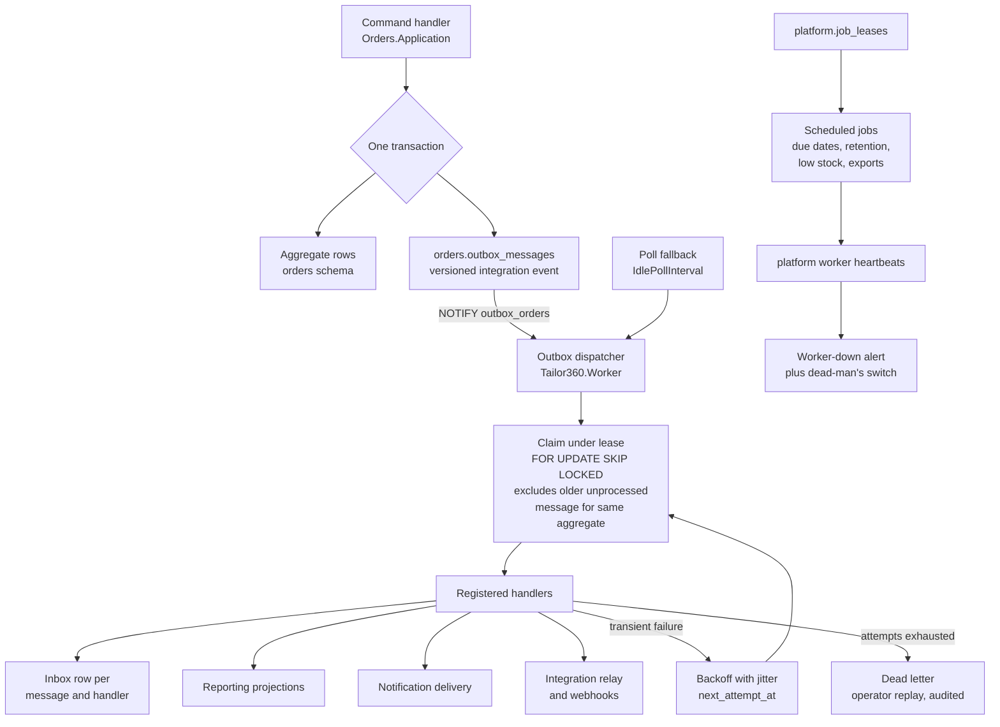

# ADR-0008 — Publish facts through a transactional outbox and run side effects in a worker host

This record decides how one module tells another that something happened, and how the work that follows a
commit — notifications, webhooks, projections, print jobs, due-date evaluation, retention — actually runs. The
answer is a transactional outbox and inbox held in PostgreSQL, claimed under a lease by a separate .NET Worker
Service, woken by `LISTEN`/`NOTIFY`, with per-aggregate ordering and a dead-letter path. No message broker is
introduced in the baseline. Every session that publishes an integration event, writes an outbox handler or adds
a background job must read this record.

| Field | Value |
| --- | --- |
| **Status** | Accepted — 2026-09-04 |
| **Deciders** | Technical reviewer; business owner (operations ownership and the alert channel) |
| **Consulted** | Roadmap issue #1; epics #3 and #13; assumption A5 (volumes) |
| **Informed** | Every backend implementing session; whoever is on call once [`OD-15`](../prd/assumptions-and-open-decisions.md) is settled |
| **Plan decision** | D6, with D12 (background processing) |
| **Plan sections** | 2.2 (module ownership, reporting never authoritative), 3 (D6, D12), 4.3, 4.4 (outbox/inbox, provider calls, health probes), 5.2 (event naming and versioning) |
| **Issues affected** | #18 (this record), #21 (outbox, inbox, leases, audit chain), #20 (worker host and health probes), #25 (dead-letter replay endpoint), #44–#46 (projections), #47 (notification delivery), #54 (integration relay and webhooks), #55 (provider adapters), #57 (retention jobs), #58 (worker alerting) |
| **Depends on open decision** | [`OD-01`](../prd/assumptions-and-open-decisions.md) — backend platform and build environment (plan Section 11 item 1). The mechanism in this record is database-level and survives that decision; only the host names and library choices would change. [`OD-15`](../prd/assumptions-and-open-decisions.md) — operations ownership and alert channel (plan Section 11 item 15) decides who is paged for a dead letter or a stalled dispatcher |
| **Supersedes / superseded by** | None |

---

## 1. Context and problem statement

A garment job does not exist in isolation. Confirming an order allocates a barcode identity, snapshots
measurements and design, reserves stock, may issue an estimate, and should eventually tell the customer. Posting
an invoice changes what the dispatch gate allows and what the sales report shows. A scan moves custody and can
breach a service-level clock. None of that work belongs inside the transaction that confirms the order: some of
it is another module's business, some of it calls a payment gateway or a messaging provider over the internet,
and some of it must survive the web host being restarted mid-request.

Three constraints shape the answer.

**Module ownership.** [ADR-0001](0001-modular-monolith.md) and [ADR-0004](0004-postgresql-schema-per-module.md)
forbid one module reading another's tables. Modules communicate through `Contracts` projects and versioned
integration events. So there must be a publication mechanism, and it must be one that an architecture test can
police.

**No dual write.** If a module writes its aggregate to PostgreSQL and then publishes to a broker, a crash between
the two loses the fact; publishing first and then committing invents a fact that never happened. Money, stock and
custody are all in this class. The publication must commit in the same transaction as the state change.

**Operational capacity.** Assumption A5 sizes this business at roughly three branches, 500 orders per month per
branch and fewer than 5,000 scans a day, on a baseline production virtual machine of 4 vCPU and 16 GB of RAM.
There is no operations team. Whatever runs must be something the deployment already contains and already backs
up.

Against that, the mechanism still has to be *correct* in ways a small business will notice: a customer must not
receive the same "your garment is ready" message four times; a stock reservation must not be applied twice; two
worker replicas must not process one garment job's events out of order; and when a webhook to a provider fails
permanently, somebody must be able to see it and replay it rather than discovering the gap weeks later.

**The question:** how do modules publish facts and execute post-commit side effects, exactly-once in effect and
in order per aggregate, without adding infrastructure this business cannot operate?

## 2. Decision drivers

| # | Driver | Why it matters here |
| --- | --- | --- |
| D1 | Atomicity of state change and publication | A confirmed order that never announced itself, or an announcement without a confirmed order, corrupts custody, billing and reporting. No dual write is acceptable |
| D2 | Ordering within one aggregate | `JobAssigned` arriving before `GarmentJobCreated` would make a projection and a notification both wrong. Global ordering is not needed; per-aggregate ordering is |
| D3 | At-least-once delivery with at-most-once *effect* | The transport may retry; the business effect may not repeat. Duplicate suppression must be part of the mechanism, not each handler's problem |
| D4 | Operability by a business with no operations team | One more always-on server process is a real cost: monitoring, backups, upgrades, disk, credentials, a failure domain that can be down while PostgreSQL is up |
| D5 | Visible failure and operator recovery | A permanently failing message must land somewhere a human can list, understand and replay, with an audit trail |
| D6 | Latency good enough for the shop floor | A "ready for delivery" message minutes late is fine; the proposed starting target is outbox lag under 30 seconds at the 95th percentile (**proposed, to be confirmed** by issue #19) |
| D7 | Room to scale to a second worker without a rewrite | `docker compose up --scale worker=2` must be a configuration change, not a code change |
| D8 | Enforceable module boundaries | The Integration module relays events; it must never gain a reason to read Orders or Billing tables |
| D9 | Provider calls outside transactions | A payment gateway or messaging provider held inside a database transaction turns a slow vendor into a database outage |

## 3. Considered options

1. **Transactional outbox and inbox in PostgreSQL, dispatched by a worker host** (chosen)
2. **A message broker** — RabbitMQ, Azure Service Bus or Kafka — as the transport
3. **Synchronous in-process handlers inside the originating transaction**, with no outbox
4. **An in-memory background queue in the web host** (a `Channel<T>` drained by a hosted service)
5. **A job library with its own storage** — Hangfire or Quartz.NET — as the durable queue

### 3.1 Option 1 — Transactional outbox and inbox in PostgreSQL (chosen)

Each module schema carries an `outbox_messages` table. The command handler writes the aggregate and the outbox
row in one transaction, so publication is as durable as the fact itself. A dispatcher in the `Tailor360.Worker`
host claims a batch under a lease, runs the registered handlers, records an inbox row per (message, handler) so
a redelivery is skipped, and marks the message processed. Wake-up is `LISTEN outbox_<module>` with a short poll
as a fallback. Retries use exponential backoff with jitter; a message that exhausts its attempts is dead-lettered
for operator replay.

- Good, because publication is atomic with the state change by construction. There is no window in which the
  order is confirmed and the fact is missing, or the reverse.
- Good, because the transport is the database that is already deployed, already monitored, already backed up and
  already restored in the disaster-recovery exercise. Nothing new can be down.
- Good, because per-aggregate ordering is expressible in the claim itself: the claim excludes any message whose
  aggregate has an older unprocessed message, so two dispatchers can run without reordering one garment job's
  stream.
- Good, because `SELECT … FOR UPDATE SKIP LOCKED` gives competing consumers for free, and the lease plus a
  heartbeat means a worker that dies mid-batch has its work redelivered rather than lost.
- Good, because `LISTEN`/`NOTIFY` brings latency down to the round trip in the common case, while the poll
  fallback means a missed notification costs seconds, not a stuck queue.
- Good, because dead letters are rows in a table the operator can query, and replay is a command with an audit
  trail rather than a broker console.
- Good, because a message and its handler outcomes sit in the same backup as the business data, so a restore is
  consistent rather than a business state at time T with a queue at time T′.
- Bad, because polling and claiming put load on PostgreSQL that a broker would absorb, and a large backlog is
  table bloat that autovacuum has to keep up with.
- Bad, because it is code the team owns: claim semantics, lease expiry, backoff, dead letters and replay are all
  ours to get right and to test, where a broker ships them.
- Bad, because fan-out to many independent subscribers is clumsier than a topic exchange, and cross-system
  integration still needs the Integration module's webhook relay on top.
- Bad, because at very high throughput the single-table claim becomes a contention point; this is comfortably
  outside assumption A5's volumes, but it is a real ceiling.

### 3.2 Option 2 — A message broker as the transport

RabbitMQ or Azure Service Bus (or Kafka, for a log-shaped variant) carrying integration events between modules
and to the worker, with MassTransit or a similar abstraction on top.

- Good, because delivery, retry, dead-letter queues, competing consumers and topic fan-out are mature,
  operationally understood features rather than application code.
- Good, because it decouples producers from consumers in a way that makes a future extraction of a module into a
  service almost free — the transport is already remote.
- Good, because back-pressure and throughput headroom are far beyond anything this business will produce, and
  observability tooling for brokers is excellent.
- Bad, because it does not remove the outbox. Publishing to a broker from inside a database transaction is
  exactly the dual write this decision exists to prevent, so a correct broker design *still* writes an outbox row
  and relays it. The broker is therefore additive complexity, not a replacement.
- Bad, because it is another always-on component on a 16 GB virtual machine, with its own storage, credentials,
  upgrade path, backup story and failure mode — and no one to operate it. Plan Section 10 records "observability
  stack too heavy for one VM" as a live risk; a broker is the same shape of risk.
- Bad, because backup and restore stop being a single consistent object: restoring the database to a point in
  time leaves the broker holding messages about a future that no longer exists.
- Bad, because ordering guarantees are per queue or per partition, so per-aggregate ordering means partitioning
  by aggregate identifier — the same problem as Option 1, solved in a place with less visibility.

### 3.3 Option 3 — Synchronous in-process handlers inside the originating transaction

The command handler calls the other module's handler directly, in process, inside the same transaction; an
in-memory mediator dispatches domain events before commit.

- Good, because it is the least machinery: no tables, no worker, no dispatcher, no eventual consistency to
  explain, and a single stack trace when something fails.
- Good, because consistency is trivially strong — either everything happened or nothing did.
- Good, because for genuinely intra-transaction concerns it is the *right* answer, and the design keeps it: the
  barcode identity is allocated inside the order-confirmation transaction through a confirmation-participant
  hook, precisely because "exactly one active identity per garment job" is an invariant, not a side effect.
- Bad, because it couples modules at run time and at deployment time. A slow or failing notification path would
  roll back a confirmed order, which is the wrong business behaviour: the order is real whether or not the
  message sent.
- Bad, because any external call — a messaging provider, a payment gateway, an object store — would then sit
  inside a database transaction, holding a connection against a budget of 100 while a vendor times out.
- Bad, because it cannot express retry. A transient provider failure has nowhere to live except the user's error
  message.
- Bad, because scheduled work (due dates, retention, projections, low-stock evaluation) has no home at all: those
  are not triggered by a request.

### 3.4 Option 4 — An in-memory background queue in the web host

Command handlers enqueue work onto a bounded in-process channel that a hosted service drains after the response
is returned.

- Good, because it is simple, has no infrastructure and removes the external call from the request path.
- Good, because latency is excellent — the work starts microseconds after commit.
- Bad, because it is not durable. A restart, a crash, a deployment or an out-of-memory kill loses whatever was
  queued, and the plan's release process replaces web containers routinely. Losing a notification is tolerable
  once; losing a stock consumption or a projection update is not.
- Bad, because it puts background load in the host that must stay responsive for the counter, competing for the
  same connection budget and the same CPU.
- Bad, because with two web replicas there is no coordination: both would evaluate due dates, both would send.

### 3.5 Option 5 — A job library with its own storage (Hangfire or Quartz.NET)

Enqueue jobs through Hangfire (PostgreSQL storage) or schedule them with Quartz.NET, using its dashboard for
retries and failures.

- Good, because retries, scheduling, a dashboard and distributed locks arrive already written and battle-tested,
  which is a genuine saving over Option 1's dispatcher.
- Good, because it stores state in PostgreSQL, so it keeps the "no new infrastructure" property.
- Good, because cron-style scheduling — nightly retention, weekly restore checks, scheduled reports — is exactly
  what these libraries are for.
- Bad, because enqueueing a job is not transactional with the aggregate write unless the job store shares the
  transaction and the connection, which these libraries do not guarantee across our per-module `DbContext`
  boundaries. The dual write returns.
- Bad, because per-aggregate ordering is not a concept these libraries have; two workers will happily run two
  jobs for one garment job concurrently.
- Bad, because their tables sit outside the module schema model, their dashboards are a second authorisation
  surface to secure, and their storage is not covered by the append-only trigger and audit conventions the rest
  of the database follows.
- Bad, because job payloads become a serialisation contract with no versioning discipline, where integration
  events have JSON Schema and a version suffix.

### 3.6 Comparison

| Driver | Outbox in PostgreSQL | Message broker | Synchronous in-transaction | In-memory queue | Job library |
| --- | --- | --- | --- | --- | --- |
| D1 Atomic publication | Yes, by construction | Only if an outbox is added anyway | Yes, but couples failure | No | No |
| D2 Per-aggregate ordering | Yes, in the claim | Partition by aggregate | Trivially | No | No |
| D3 At-most-once effect | Inbox row per handler | Consumer-side dedup still needed | Not applicable | No | Handler's problem |
| D4 Operable without an operations team | Yes, nothing new to run | No, a new always-on component | Yes | Yes | Mostly, plus a dashboard to secure |
| D5 Visible failure and replay | Dead-letter table, CLI then endpoint | Dead-letter queue, broker console | None | None | Dashboard |
| D6 Latency | Sub-second typical via `NOTIFY` | Sub-second | Immediate | Immediate | Seconds |
| D7 Second worker replica | Configuration only | Configuration only | Not applicable | Unsafe | Configuration only |
| D8 Module boundaries enforceable | Yes, events plus architecture tests | Yes | No, direct coupling | No | Weak |
| D9 Provider calls outside transactions | Yes | Yes | No | Yes | Yes |
| Backup and restore consistency | One database, one restore | Two systems to reconcile | One | Lost on restart | One database |

## 4. Decision outcome

**Chosen option: the transactional outbox and inbox in PostgreSQL, dispatched by the `Tailor360.Worker` host.**
It is the only option that makes publication atomic with the state change without introducing a component this
business would have to learn to operate. Option 2 is the option a larger organisation would choose, and it
remains the migration target — but it does not remove the outbox, so adopting it today would mean building this
mechanism *and* running a broker. That is a cost to pay when there is a reason, and Section 8 records what that
reason would look like.

The decision fixes the following.

### 4.1 The outbox

| Aspect | Decision |
| --- | --- |
| Location | `outbox_messages` in **each module's own schema** — `orders.outbox_messages`, `billing.outbox_messages`, and so on. No shared table, so no cross-schema write and no contention between modules |
| Write | The command handler writes the aggregate and the outbox row in one transaction through `Tailor360.Platform.Persistence`. A module never publishes any other way |
| Columns | Message identity, aggregate type and identity, event type and version, payload, headers (correlation and causation), `locked_by`, `locked_until`, `attempts`, `next_attempt_at`, `processed_at`, `dead_lettered_at` |
| Payload | A versioned integration event named `orders.order-confirmed.v1`, with a JSON Schema and an example under `docs/integration/events/`. Payloads carry identifiers, codes, statuses, timestamps, amounts and branch codes only, unless the event is classified personal and the subscriber is approved for it |
| Claim | One short transaction: `UPDATE … WHERE id IN (SELECT … FOR UPDATE SKIP LOCKED) RETURNING *`, excluding any message whose aggregate has an older unprocessed message |
| Ordering | Per aggregate, guaranteed by that exclusion. There is deliberately **no** global ordering guarantee |
| Handling | Handlers and provider calls run **after the claim transaction commits**, never inside it |
| Lease | Held for `Outbox:LeaseDuration` (default two minutes) and extended by a heartbeat while a handler runs. An expired lease is redelivered, which is why every handler is inbox-deduplicated |
| Wake-up | `LISTEN outbox_<module>` sent on commit, with a poll fallback (`Outbox:IdlePollInterval`, default two seconds) so a lost notification costs seconds |
| Retry | Exponential backoff with jitter from `Outbox:RetryBaseDelay` (five seconds) to `Outbox:RetryMaximumDelay` (ten minutes), up to `Outbox:MaximumAttempts` (eight) |
| Dead letter | `dead_lettered_at` set; the message stays in place, visible and replayable. Replay is a CLI command in Wave 1 and an authenticated, audited endpoint from issue #25 |
| Retention | Processed messages are pruned by the retention job; dead letters are never pruned automatically |

### 4.2 The inbox

Delivery is at-least-once. An **inbox row keyed by (message, handler)** turns that into at-most-once *effect*: a
redelivered message finds its inbox row and the handler is skipped. Handlers must still be written to tolerate a
second call, because the inbox row and the handler's own writes commit together but a crash can happen anywhere.
The inbox is a mechanism, not an excuse: no handler may depend on being called exactly once.

### 4.3 The worker host

`Tailor360.Worker` is a separate .NET Worker Service container sharing the module assemblies with the web host.
It runs the outbox dispatcher, notification delivery, webhook delivery, due-date and service-level evaluation,
low-stock evaluation, retention and cleanup, export generation, reporting projections and reconciliation,
scheduled reports, media processing under its bulkhead, and the backup-age monitor.

| Aspect | Decision |
| --- | --- |
| Scheduled jobs | Acquire a row lease in `platform.job_leases` before running, so a second replica is safe |
| Identity | Jobs run as a `SystemPrincipal` constructible only through `IWorkerScopeFactory` from a `[WorkerJob]` attribute declaring the job's permissions and branch scope; a job acting for a user runs under an impersonation principal rebuilt from that user's *current* permissions |
| Heartbeat | Per instance; the "worker down" alert fires when no instance is younger than twice the heartbeat interval |
| Health | Its own probes: `/health/live` includes "the dispatcher loop is ticking"; `/health/startup` includes one heartbeat write; `/health/ready` is database reachability only. Outbox lag reports **Degraded** on `/health/detail`, drives an alert, and never removes a host from rotation |
| Scale-out | `docker compose up --scale worker=2` requires no code change; leases and the claim make it safe. The connection budget must be recomputed first (plan Section 4.4) |
| Watchdog | Compose does not restart unhealthy containers, so the host runs an in-process watchdog: three consecutive liveness failures exits with code 70 under `restart: unless-stopped` |

### 4.4 Relationship to other modules

The **Integration** module keeps a relay copy of integration events and owns webhook subscriptions and
deliveries; it never reads another module's tables. **Reporting** builds projections from these events and from
`Contracts` read contracts only, and a projection is never authoritative ([ADR-0011](0011-reporting-read-models.md)).
Every outbound provider call follows intent → call with the intent identifier as the provider's idempotency key →
apply the verified outcome; a timeout is `unknown` and is resolved by status polling, never assumed successful
([ADR-0012](0012-integration-ports-and-adapters.md)).

### 4.5 What is explicitly not deferred to the outbox

Anything that is an invariant rather than a consequence stays inside the originating transaction: the barcode
identity allocated during order confirmation, the stock balance updated with the ledger entry, the audit row
appended by the `SaveChanges` interceptor, and the invoice's document number taken from its sequence. The outbox
carries *facts about what happened*, never the enforcement of a rule.

## 5. Consequences

### 5.1 Positive

| Consequence | Who feels it |
| --- | --- |
| A confirmed order, a posted invoice and a recorded scan always announce themselves, even across a crash or a deployment | Every module downstream; Reception, Cashier and Delivery Staff who would otherwise chase a missing message |
| Nothing new has to be operated, monitored, credentialed, patched or backed up | The business owner, and whoever holds operations ownership under OD-15 |
| A restore is consistent: business state and pending messages come back from one backup at one point in time | Disaster-recovery exercises (issue #60) |
| A failed webhook or notification is a row an operator can list, understand and replay with an audit trail | Branch Manager and the on-call operator |
| Two worker replicas are a scaling knob, not a redesign | Delivery, when volumes grow |
| Slow vendors cannot become database outages, because provider calls never run inside a transaction | Cashier at the counter during a payment-gateway incident |
| Module boundaries stay enforceable because events, not table reads, are the only cross-module push | Every implementing session; architecture rules ARCH-004 and ARCH-011 |

### 5.2 Negative

| Consequence | Who feels it | How it is mitigated or where it is handled |
| --- | --- | --- |
| Claim, lease, backoff, dead-letter and replay logic is code we own and must test | Backend sessions | Written once in `Tailor360.Platform.Persistence` under issue #21, documented in [`../platform/outbox.md`](../platform/outbox.md), with tests for concurrent claims, lease expiry, ordering and redelivery |
| Every consumer is eventually consistent, so a screen can show a fact slightly before or after a downstream effect | Reception and Branch Manager reading reports | Freshness is displayed rather than hidden ([ADR-0011](0011-reporting-read-models.md)); the proposed lag target is under 30 seconds at the 95th percentile (**proposed, to be confirmed** by issue #19) |
| Handlers must be idempotent even with the inbox, which is a discipline reviewers have to hold | Backend sessions | Stated in the module README template and checked in review; the inbox is documented as a mechanism, not a guarantee of single invocation |
| Outbox tables are hot: inserts, updates and deletes on the same rows create bloat | Whoever tunes the database | Processed rows pruned by the retention job; autovacuum settings and index design fixed in issue #21; backlog age is a health check |
| A poison message can block one aggregate's stream until it dead-letters | The customer or job behind that aggregate | Bounded by `MaximumAttempts` and the backoff cap — at most a few minutes before the stream moves on; the dead letter raises an alert |
| PostgreSQL is now both the system of record and the transport, so a database incident stops both | Everyone | Accepted deliberately: a broker would not have helped, because the facts live in the database anyway. Availability is a hosting concern under OD-02 |
| `LISTEN`/`NOTIFY` does not survive a connection drop, so a notification can be missed | Latency, briefly | The poll fallback bounds the loss to `Outbox:IdlePollInterval`; the notification is an optimisation, never the delivery mechanism |
| Cross-system fan-out is our code (the webhook relay), not a broker feature | Issue #54 | Confined to the Integration module with delivery records, signatures, retries and dead letters of its own |

## 6. Confirmation

| Check | Mechanism | Where |
| --- | --- | --- |
| No module writes another module's outbox table | ARCH-005 — no `DbContext` maps a table in another schema | [`../architecture/architecture-rules.md`](../architecture/architecture-rules.md), `SourceConventionTests` |
| Only `Contracts` and `Platform.*` cross a module boundary, so events are the only push | ARCH-004 | `ModuleBoundaryTests` (#20) |
| Reporting consumes contracts and events only | ARCH-011 | `ModuleBoundaryTests` (#20) |
| Every outbound call from a handler goes through the vetted client | ARCH-016 — `HttpClient` is never constructed directly | `SourceConventionTests` (#20) |
| Two dispatchers never reorder one aggregate's stream | Integration test running concurrent claims over a seeded aggregate stream | Issue #21 |
| An expired lease redelivers rather than loses | Integration test that kills a claim mid-flight and asserts redelivery plus inbox suppression | Issue #21 |
| A handler called twice has one effect | Inbox tests per handler, plus the idempotency rules in plan Section 4.4 | Issues #21, #47, #54 |
| Dead letters are visible and replayable with an audit trail | CLI `replay-outbox` in Wave 1; authenticated, audited endpoint from #25 | Issues #21, #25 |
| Outbox lag is observable and alerts | `/health/detail` degraded state, backlog-age health check and an OpenTelemetry metric | Issues #21, #58 |
| The worker is alive | Per-instance heartbeat; alert when no instance is younger than twice the interval; external dead-man's switch | Issues #21, #58 |
| Integration events are versioned and schema-checked | JSON Schema and examples under `docs/integration/events/`, checked in the contract tests | Issue #54, plan Section 5.2 |

## 7. Diagram

## 8. Revisiting this decision

Revisit if one of the following becomes true, and record the outcome as a new record rather than as a change of
practice.

| Trigger | What it would mean |
| --- | --- |
| A module is extracted into a separate service under the criteria in [ADR-0001](0001-modular-monolith.md) | The transport becomes remote and a broker earns its keep. The outbox stays: the module still writes its fact atomically and a relay pushes it to the broker |
| Sustained outbox backlog that a second worker replica does not clear, or claim contention visible in database load | Partition the claim, or move the transport to a broker with per-aggregate partitioning. Evidence would come from the metrics in issue #58 and the mixed-load test |
| A subscriber outside this system needs a durable, replayable stream rather than webhooks | Either a broker or an event log; the versioned integration events are already shaped for it |
| The hosting model chosen under OD-02 (plan Section 11 item 2) includes a managed broker at negligible operational cost | Re-cost Option 2. Managed removes most of D4's objection but none of the atomicity argument, so the outbox remains |

If OD-01 resolves to a Node.js and TypeScript backend rather than ASP.NET Core, this record survives unchanged in
substance: the outbox and inbox tables, the claim, the lease, the ordering rule and the dead-letter path are
database-level. Only the host names, the library choices and the architecture-test tooling would be restated.

Nothing here is a reason to revisit on its own: a single dead-lettered webhook, a notification arriving twenty
seconds late, or a poison message that blocked one aggregate for four minutes. Those are the designed behaviour.

## 9. Links

| Document | Why it is relevant |
| --- | --- |
| [`../IMPLEMENTATION_PLAN.md`](../IMPLEMENTATION_PLAN.md) | Sections 3 (D6, D12), 4.3, 4.4, 5.2 |
| [`../platform/outbox.md`](../platform/outbox.md) | The operator-level description: publishing, delivery, leases, retries, replay and configuration |
| [`../architecture/architecture-rules.md`](../architecture/architecture-rules.md) | ARCH-004, ARCH-005, ARCH-011 and ARCH-016, which keep this mechanism the only cross-module push |
| [`../architecture/module-ownership.md`](../architecture/module-ownership.md) | Which module publishes which event, and who may consume it |
| [`../architecture/sequences/order-confirmation.md`](../architecture/sequences/order-confirmation.md) | The confirmation transaction, the barcode allocation inside it and the outbox row written with it |
| [`../architecture/failure-modes.md`](../architecture/failure-modes.md) | What the system does when the worker, the database or a provider is unavailable |
| [`0001-modular-monolith.md`](0001-modular-monolith.md) | Why modules communicate through contracts and events, and the extraction criteria this record defers to |
| [`0004-postgresql-schema-per-module.md`](0004-postgresql-schema-per-module.md) | Why the outbox lives in each module's own schema |
| [`0011-reporting-read-models.md`](0011-reporting-read-models.md) | The largest consumer of these events, and why its output is never authoritative |
| [`0012-integration-ports-and-adapters.md`](0012-integration-ports-and-adapters.md) | How a handler reaches a payment, messaging or accounting provider safely |
| [`0010-deployment-portability.md`](0010-deployment-portability.md) | Where the worker host runs and how it is scaled |
| [`../prd/assumptions-and-open-decisions.md`](../prd/assumptions-and-open-decisions.md) | OD-01 (backend platform), OD-02 (hosting) and OD-15 (operations ownership and alert channel) |
