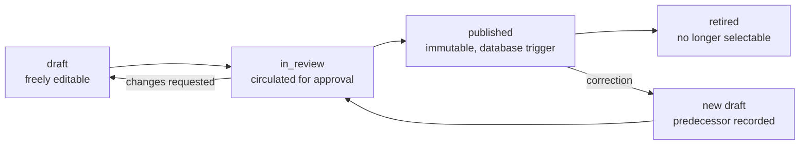
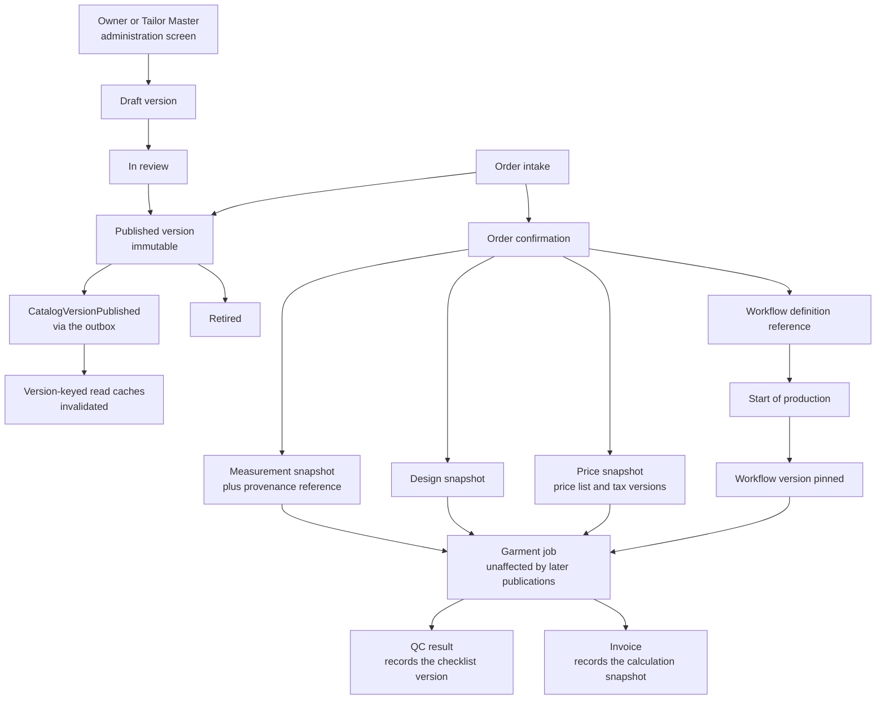

# ADR-0009 — Hold the configurable taxonomy as versioned data, and protect in-flight orders with snapshots

This record decides where stitching categories, service types, measurement templates, design options, workflow
definitions, quality-control checklists, price lists, tax configuration and the other business vocabulary live:
as versioned rows with a draft → published → retired lifecycle, authored by the Owner and the Tailor Master
through the administration screens, never as enumerations or classes that need a deployment to change. It also
fixes how an order already in the workshop is protected from a republished template — by copying, not by
referring. Every session that adds a configurable concept must read this record.

| Field | Value |
| --- | --- |
| **Status** | Accepted — 2026-09-04 |
| **Deciders** | Technical reviewer; business owner (who may author and publish) |
| **Consulted** | Roadmap issue #1; the Tailor Master for measurement templates and workflow phases; the accountant for tax configuration and price lists |
| **Informed** | Every implementing session touching Catalog, Customers, Orders, Billing, Inventory or Notifications; Reception and Tailor Master as the people who see the result |
| **Plan decision** | D8, with D10 (pricing and tax versions recorded on every calculation) |
| **Plan sections** | 2.1 (categories without code changes), 2.2 (configuration, not code), 3 (D8), 4.3, 4.5 |
| **Issues affected** | #18 (this record), #17 (the drafted taxonomy and the configurable-versus-fixed list), #27 (measurement templates), #29 (measurement capture), #30 (design options), #33 and #34 (workflow definitions and quality-control checklists), #41 (price lists and tax configuration), #40 (costing assumptions), #43 (dispatch policy), #57 (retention policies) |
| **Depends on open decision** | [`OD-10`](../prd/assumptions-and-open-decisions.md) — initial catalogue, measurement templates, design options and quality-control checklists, reviewed from the seeded drafts (plan Section 11 item 10). Owner: business owner with the Tailor Master; needed **before Wave 2**. [`OD-05`](../prd/assumptions-and-open-decisions.md) — valuation method and rounding conventions (plan Section 11 item 5) fills in the tax and costing versions. Neither changes the mechanism; both fill it with content |
| **Supersedes / superseded by** | None |

---

## 1. Context and problem statement

The roadmap names five stitching categories to start with — Blouse, with Pattern and Aari work beneath it;
Salwar; Lehenga; Gown; Kids — and then says the thing that decides this record: administrators must be able to
add categories **without code changes**. The same requirement reaches much further than categories. Plan
Section 2.2 lists categories, measurements, workflow phases, quality-control checklists, taxes, prices, alerts,
retention and feature availability as configuration rather than code.

That is not an unusual ambition; what makes it sharp here is the shop floor.

A blouse takes days to stitch. During those days the Owner may add a measurement field, the Tailor Master may
reorder the phases, the accountant may change a tax rate, and a price list may take effect. If a garment job
merely *refers* to "the Blouse measurement template", then the sheet a Tailor picks up on Thursday is not the
sheet Reception filled in on Monday, and the invoice recalculated at delivery is not the estimate the customer
agreed to. Those are not edge cases; in a business where an estimate is a promise and a measurement is the
difference between a fitting garment and a remake, they are the failure modes that matter.

There is also a governance dimension. Plan Section 2.2 requires complete auditability, and issue #24 requires
that only authorised principals change configuration. "Somebody edited the Aari work checklist" must be a
recorded, attributable, reversible act — not a row that quietly differs from what it said yesterday.

And there is a limit worth naming early. The temptation with configurable systems is to keep generalising until
the configuration *is* a programming language, at which point nobody can reason about it, it cannot be tested,
and it is not really configurable by the Owner at all. Plan Section 10 records exactly this risk: "configurable
taxonomy increases complexity" against a mitigation of seed data, admin screens per issue and rule languages
kept small.

**The question:** where does the business vocabulary live so that the Owner can change it without a deployment,
the change is attributable and reversible, and an order already in the workshop is unaffected by it?

## 2. Decision drivers

| # | Driver | Why it matters here |
| --- | --- | --- |
| D1 | Change without a deployment | A new category, a new design option or a corrected field range must be a screen the Owner uses, not a pull request. This is a stated product outcome, not a preference |
| D2 | In-flight orders must not shift under the workshop | A garment job's measurement sheet, design selection, workflow, checklist and price must mean the same thing on the day it is delivered as on the day it was confirmed |
| D3 | Attribution and reversibility | Who published this checklist, when, and what did the previous one say? An answer must exist without reading a backup |
| D4 | Reproducible money | Recomputing an invoice a year later must produce the figure that was charged, which requires knowing which price list and which tax configuration were in force |
| D5 | Reviewable before it reaches a Tailor | A half-finished checklist must not appear on the workshop screen. Drafts must be safely editable and separately publishable |
| D6 | Testable and seedable | Integration tests, the synthetic dataset and the interim staging environment all need a known-good starting taxonomy |
| D7 | Bounded expressiveness | Conditional fields and option dependencies are needed; a general rules engine is not. The complexity has to stop somewhere explicit |
| D8 | Branch differences | A category or price may be available at one branch and not another, without forking the taxonomy |

## 3. Considered options

1. **Versioned data with a draft → published → retired lifecycle, plus snapshots on the order** (chosen)
2. **Taxonomy in code** — enumerations, classes and seeded migrations
3. **Mutable configuration rows** — one current row per concept, edited in place
4. **An external configuration system or rules engine** — a headless content system, a feature-flag service, or a
   decision engine such as DMN

### 3.1 Option 1 — Versioned data with a publication lifecycle and order snapshots (chosen)

Every configurable concept is a row with a lifecycle: `draft` → `in_review` → `published` → `retired`. A
published version is immutable, enforced by a database trigger, and a change is a *new version*, never an edit.
Orders do not point at "the current version": at confirmation the garment job copies the measurement values, the
design selection, the price calculation and the references it needs into snapshots it owns, with a provenance
reference back to the version it came from. The workflow definition is pinned when production starts.

- Good, because it delivers the stated outcome directly: the Owner adds a category, a service type or a design
  option through an administration screen and it is live, with no build, no deployment and no engineer.
- Good, because in-flight work is protected by construction rather than by care. Republishing a template cannot
  reach a confirmed job, because the job holds a copy, not a pointer.
- Good, because attribution is inherent: a version has a publisher, a publication time and a predecessor, so
  "what changed and who did it" is a query, not an investigation.
- Good, because money is reproducible. Every calculation stores the pricing and tax configuration version it
  used (plan D10), so an invoice can be re-derived years later.
- Good, because a published version being immutable makes caching safe and simple: the version identifier is the
  cache key, so a cached value can never be stale in a way that matters ([ADR-0013](0013-caching.md)).
- Good, because drafts give the Owner and the Tailor Master somewhere to work before anything reaches a Tailor,
  which is what OD-10's review process needs.
- Good, because seed data ships as drafts, so the interim staging environment and the tests have a real taxonomy
  from Wave 1 without pretending the Owner has approved it.
- Bad, because it is more tables, more lifecycle code and more screens than a hard-coded taxonomy, and every
  module that consumes it must handle "which version" explicitly.
- Bad, because a mistake in a published version cannot be edited away; it must be corrected by publishing a
  successor and retiring the wrong one, which is slower in the moment even though it is right in the record.
- Bad, because versions accumulate, so listings need filtering and the retention policy has to say what happens
  to a retired version that no live order references.
- Bad, because a compile-time typo becomes a run-time data problem: nothing stops the Owner naming a field
  badly, so validation and review have to carry weight that the compiler carried before.

### 3.2 Option 2 — Taxonomy in code

Categories as enumerations, measurement fields as classes or records, workflow phases as a state machine in C#,
checklists as constants, with seeded migrations to populate reference tables.

- Good, because it is the fastest to build, the easiest to test and the most refactorable: the compiler finds
  every use of a field the day it is renamed.
- Good, because invalid states are frequently unrepresentable, and the domain model reads exactly like the
  business.
- Good, because there is no version to choose, no draft to publish and no snapshot to maintain, which removes a
  whole class of bug.
- Bad, because it fails the requirement outright. "Administrators add categories without a deployment" cannot be
  satisfied by anything that needs a build, and the roadmap states it as a product outcome, not a nicety.
- Bad, because every taxonomy change becomes an engineering request with a lead time, which for a business that
  adds an Aari work variant during a wedding season is a real operational cost.
- Bad, because the audit question — who changed the Blouse checklist and when — becomes "read the git history",
  which is not available to the Owner or an Auditor.
- Bad, because it would still not solve the in-flight problem: deploying a changed field set changes the meaning
  of rows already written, with no snapshot to fall back on.

### 3.3 Option 3 — Mutable configuration rows

One current row per category, template, checklist and price, edited in place through administration screens, with
an audit log recording the edit.

- Good, because it satisfies D1 with the least machinery: an edit screen, a table and an audit row.
- Good, because there is only ever one answer to "what is the Blouse template", so no module has to reason about
  versions and no cache has to be keyed by one.
- Good, because it is what most small business systems actually do, so it is familiar to anyone maintaining it.
- Bad, because it breaks D2 completely. Editing the template changes what every existing measurement sheet
  means, retroactively and invisibly. A field deleted on Tuesday takes Monday's measurement with it.
- Bad, because it breaks D4: an invoice recalculated after a tax rate change silently produces a different number
  from the one the customer paid, and there is no version to point at in a dispute.
- Bad, because the audit log records that a change happened but not a usable "before", so reversal is manual
  reconstruction.
- Bad, because there is no draft state, so a half-edited checklist is live on the workshop screen the moment it
  is saved.
- Bad, because caching becomes genuinely hard: the value behind a key can change without the key changing, which
  is the invalidation problem [ADR-0013](0013-caching.md) is designed to avoid.

### 3.4 Option 4 — An external configuration system or rules engine

A headless content system, a hosted feature-configuration service, or a decision engine (for example DMN) holding
the taxonomy and the rules, called by the application.

- Good, because publishing workflows, draft previews, role-based authoring and version history arrive already
  built, often with better authoring ergonomics than anything built here.
- Good, because a rules engine would express conditional measurement fields and design-option dependencies far
  more powerfully than a small in-house rule language.
- Good, because it separates the authoring surface from the application, which is attractive if non-technical
  authoring is a large ongoing need.
- Bad, because it puts the business vocabulary outside the database that everything else joins to, so a report
  cannot join a garment job to its category name without a network call or a synchronised copy.
- Bad, because it adds an external dependency with its own availability, cost, credentials and egress
  requirements — and the on-premises hosting candidate under OD-02 has a deliberately short egress list.
- Bad, because backup and restore stop being a single consistent operation: restoring the database to a point in
  time leaves the taxonomy at whatever the external system says now.
- Bad, because a general rules engine is a second programming language in the product, which is precisely the
  complexity D7 exists to refuse, and it does nothing at all about the in-flight snapshot problem.

### 3.5 Comparison

| Driver | Versioned data plus snapshots | Taxonomy in code | Mutable rows | External system or rules engine |
| --- | --- | --- | --- | --- |
| D1 Change without deployment | Yes | No | Yes | Yes |
| D2 In-flight orders protected | Yes, by snapshot | No | No | No, not addressed |
| D3 Attribution and reversibility | Version has a publisher and a predecessor | Git history only | Audit log without a usable "before" | Depends on the vendor |
| D4 Reproducible money | Version recorded on every calculation | Not applicable | No | Only with a synchronised copy |
| D5 Reviewable before publication | Draft and in-review states | Pull request review | No | Yes |
| D6 Testable and seedable | Seeded as drafts | Trivially | Yes | Awkward in tests |
| D7 Bounded expressiveness | Small rule language, deliberately | Full language, but for engineers | Small | Unbounded |
| D8 Branch differences | Availability on the version | Code branching | Possible | Possible |
| Cost of first delivery | Highest of the in-database options | Lowest | Low | Medium plus a subscription |

## 4. Decision outcome

**Chosen option: versioned data with a publication lifecycle, and snapshots on the order.** It is the only option
that satisfies both D1 and D2 — configurable without a deployment, and stable under the workshop — and it is the
only one that makes reproducible money possible. Option 2 remains the right answer for anything that is a *rule
of the system* rather than a *choice of the business*, and Section 4.4 draws that line explicitly rather than
leaving it to taste.

### 4.1 The lifecycle

| State | Meaning | Who may act |
| --- | --- | --- |
| `draft` | Freely editable, invisible to operational screens, may be deleted | The permission that owns the concept (for example `catalog.edit`), per the permission matrix approved under OD-13 |
| `in_review` | Circulated for approval; the review record is what OD-10 signs off | Owner, or the Tailor Master for workshop-facing content |
| `published` | Immutable and selectable. Enforced by a database trigger that rejects UPDATE and DELETE from the application role | Publication is a distinct, audited permission with a mandatory reason |
| `retired` | No longer selectable for new work; existing references remain valid forever | The publishing permission |

A correction to a published version is a **new draft with the predecessor recorded**, published as a successor,
after which the old version is retired. There is no edit path and no delete path for a published version.

### 4.2 What is versioned data

| Concept | Owning module | Version granularity | Consumed as |
| --- | --- | --- | --- |
| Categories and service types | Catalog | `CatalogVersion` — one coherent published version | Selected at order intake; the version identifier is recorded on the order |
| Design option groups, options and dependency rules | Catalog | Within the catalogue version | Validated at selection; copied into the design snapshot |
| Measurement templates and their fields | Customers | `MeasurementTemplateVersion` | A measurement version is captured against exactly one template version |
| Quality-control checklist templates | Catalog | `QcChecklistVersion` | Referenced by the service type; the checklist in force is recorded on the quality-control result |
| Workflow definitions and phases | Orders | `WorkflowDefinitionVersion` | Referenced at confirmation, **pinned** at start of production |
| Price lists | Billing | `PriceListVersion`, effective-dated | Recorded on every price calculation |
| Tax configuration | Billing | `TaxConfigurationVersion`, effective-dated | Recorded on every calculation snapshot |
| Payment modes | Billing | Versioned, effective-dated | Recorded on the payment |
| Alert policies and reorder rules | Inventory | Versioned | Recorded on the raised alert |
| Retention policies | Platform | Versioned | Recorded on the retention run |
| Costing assumptions | Reporting | Versioned | Recorded on the valuation or costing run |
| Notification templates | Notifications | `TemplateVersion` | Recorded on the delivery |
| Dispatch policy | Billing | Versioned | Recorded on the dispatch exception and the eligibility evaluation |

Each service type carries the per-category links that make a category usable without code: its measurement
template, its workflow definition, its design option groups, its price-list item and its quality-control
checklist. Adding a category is therefore adding rows and publishing them — no new table, no new endpoint, no
deployment.

### 4.3 How in-flight orders are protected

| Moment | What is copied or pinned | Why |
| --- | --- | --- |
| Estimate issued | The priced draft-order snapshot, including the price-list and tax-configuration versions | The customer agreed to a number; that number must be reproducible |
| Order confirmed | The measurement snapshot (canonical millimetre values, with a provenance reference to the measurement version), the design snapshot, the price snapshot, the category and service-type version, the workflow definition reference and the quality-control checklist reference | The garment job is now a promise with a due date. Nothing published afterwards may change what it means |
| Production started | The **workflow version is pinned** | Reordering phases mid-garment would strand a job between two definitions |
| Quality control recorded | The checklist version in force at that moment | A pass must state what it passed against |
| Invoice posted | The calculation snapshot with both configuration versions, and immutable lines and tax components | Plan Section 2.2: posted invoices are immutable; corrections are compensating documents |

Snapshots are copies with provenance, not pointers with history. A snapshot answers "what did this job say"
without consulting the catalogue at all; the provenance reference answers "where did it come from" for audit and
for reporting. Job snapshots are immutable after confirmation; a revision is permitted only before production
starts and creates a new revision record rather than editing the snapshot.

### 4.4 Where the line is drawn — configurable versus fixed

Configuration covers the business's *choices*. It never covers the system's *rules*. The following stay in code
and change only through a pull request, and, where they are architectural, through a record like this one:

- Invariants — one active barcode identity per garment job; balance equals posted charges minus allocations
  minus credits plus refunds; a measurement draft is consumed exactly once; a posted invoice is never updated.
- The dispatch gate's *existence* (quality control and payment must both pass before dispatch). Its parameters —
  the payment rule, the approval role, the exception expiry — are configuration, pending OD-04.
- Identifier formats, the barcode payload structure and the check character, money types and rounding
  mechanics, financial-year boundaries and the audit hash chain.
- The permission catalogue itself. Which role holds which permission is configuration; what a permission *means*
  is code.
- The lifecycle in Section 4.1. Adding a sixth state would be a change to this record.

The rule language stays small on purpose: conditional field visibility and range validation on measurement
templates, and option dependency and exclusion rules on design groups. Anything a proposal cannot express in
those terms is a code change with a registered validator, not a richer rule language.
[`../prd/configurable-vs-fixed.md`](../prd/configurable-vs-fixed.md) is the authoritative row-by-row list and is
maintained alongside this record.

### 4.5 Publication, caching and seeding

Publishing raises an event — `CatalogVersionPublished` and its equivalents — carried through the transactional
outbox ([ADR-0008](0008-transactional-outbox-and-workers.md)). Consumers use it to invalidate their version-keyed
read caches, whose staleness bound is documented in [ADR-0013](0013-caching.md). Because a published version is
immutable, the version identifier is a safe cache key: a cached value can be old, but it can never be *wrong*.

Seed data for the initial scope ships as **drafts**, not published versions, so that no unreviewed field set or
checklist can reach a Tailor before OD-10 is settled. The `init-reference-data` command in `Tailor360.Cli` loads
them; synthetic seeding refuses to run in production unconditionally.

## 5. Consequences

### 5.1 Positive

| Consequence | Who feels it |
| --- | --- |
| A new category, service type, design option or checklist goes live the day the Owner decides, with no engineering involvement | Owner, Branch Manager, Tailor Master |
| A garment job means the same thing at delivery as at confirmation, whatever was published in between | Reception, Tailor, Tailor Master and the customer |
| An invoice can be re-derived years later from the versions recorded on it | Cashier, Owner, the accountant, and any audit under OD-05 |
| "Who published this and what did the previous one say" is a query with an answer | Auditor and Branch Manager |
| Drafts mean unreviewed content never reaches the workshop screen | Tailor Master; the OD-10 review process |
| Immutable published versions make catalogue caching safe with a trivial key | Every screen that loads the catalogue; [ADR-0013](0013-caching.md) |
| Tests, synthetic data and the interim staging environment all start from a known taxonomy | Every implementing session |

### 5.2 Negative

| Consequence | Who feels it | How it is mitigated or where it is handled |
| --- | --- | --- |
| More tables, more lifecycle code and an administration screen per concept | Backend and frontend sessions | Delivered incrementally with the issue that needs each concept (#27, #30, #33, #34, #41), not as one large configuration subsystem |
| A published mistake needs a successor version rather than an edit, which feels slow in the moment | Owner and Tailor Master | Publication carries a mandatory reason and the successor path is one screen; the alternative — silent retroactive edits — is what this record refuses |
| Versions accumulate and listings get long | Owner and Branch Manager | Retired versions are filtered out by default; retention for versions no live order references is set with OD-08 |
| Snapshots duplicate data, so a garment job stores what the catalogue also stores | Storage and whoever reads the schema | Deliberate. Assumption A5 puts database growth under 5 GB a year, and snapshots are small next to media |
| The compiler no longer checks the taxonomy, so a bad field key or a broken dependency rule is a run-time problem | Owner authoring; Tailor reading a bad sheet | Draft and review states, validation on publication, dependency validators registered by consuming modules, and the OD-10 review before anything is published |
| Reporting must resolve versions to present a stable series when a category is renamed | Owner reading a trend | The metric dictionary defines each figure and the projections carry the version identifier ([ADR-0011](0011-reporting-read-models.md)) |
| Two coherent versions can be in force at once — the published catalogue, and the older one an in-flight job pinned | Anyone debugging a discrepancy | The provenance reference on every snapshot makes it explicit and queryable; the sequence documents show it in context |
| The temptation to keep widening the rule language will recur | Future sessions | Section 4.4 draws the line and this record is the place to change it; a registered validator in code is the sanctioned escape hatch |

## 6. Confirmation

| Check | Mechanism | Where |
| --- | --- | --- |
| A published version cannot be updated or deleted | Database trigger rejecting UPDATE and DELETE from the application role, with an integration test that attempts both | Issues #27, #30, #34, #41; plan Section 5.2 |
| A confirmed garment job is unaffected by a republished template | Integration test: confirm a job, publish a changed template version, assert the job's snapshot and its rendered sheet are unchanged | Issues #29, #32 |
| A workflow version is pinned at start of production | Integration test publishing a changed workflow mid-job | Issue #33 |
| Every price and tax calculation records its configuration versions | Golden-master fixtures under `tests/fixtures`, reviewed with the accountant under OD-05 | Issue #41 |
| Publication is audited with an actor, a reason and a predecessor | The `[Audited]` endpoint filter and the audit chain (ARCH-008) | [`../architecture/architecture-rules.md`](../architecture/architecture-rules.md), issue #21 |
| No module reads another's taxonomy tables | ARCH-004 and ARCH-005 | `ModuleBoundaryTests`, `SourceConventionTests` (#20) |
| Seed data is loaded as drafts and production refuses synthetic seeding | `init-reference-data` and `seed-synthetic` behaviour tests | Issue #21 |
| The configurable-versus-fixed list matches the code | Review step on any pull request adding a configurable concept, against [`../prd/configurable-vs-fixed.md`](../prd/configurable-vs-fixed.md) | Plan Section 5.1 item 8 |

## 7. Diagram

## 8. Revisiting this decision

| Trigger | What it would mean |
| --- | --- |
| Owners repeatedly need a rule the small language cannot express — for example pricing that depends on measured fabric consumption | Add a registered validator or calculator in code with a versioned identifier the configuration selects, rather than widening the rule language. That is a change to Section 4.4, recorded here |
| Version proliferation makes the administration screens unusable | A grouping or "release" concept over versions, so several concepts publish together. That is an addition to the lifecycle and would need this record updated |
| A second legal entity appears, contradicting assumption A1 | Taxonomy scope gains an entity dimension; see [ADR-0007](0007-branch-aware-single-tenancy.md), which would be the record that changes first |
| Authoring genuinely outgrows the administration screens | Option 4's authoring ergonomics become worth re-costing, but the published versions must still land in this database, because reporting, snapshots and backups all depend on that |

If OD-10 (plan Section 11 item 10) returns a materially different category hierarchy or field set, **nothing in
this record changes** — that decision fills the mechanism with content. The record would change only if the
owner concluded that categories should *not* be administrator-editable after all, which would contradict a stated
product outcome in the roadmap.

Nothing here is a reason to revisit on its own: a taxonomy version published in error, a long version list, or a
snapshot that duplicates a catalogue row. Those are the designed costs.

## 9. Links

| Document | Why it is relevant |
| --- | --- |
| [`../IMPLEMENTATION_PLAN.md`](../IMPLEMENTATION_PLAN.md) | Sections 2.1, 2.2, 3 (D8, D10), 4.3, 4.5 |
| [`../prd/configurable-vs-fixed.md`](../prd/configurable-vs-fixed.md) | The authoritative row-by-row list of what is configuration and what is code |
| [`../prd/category-hierarchy.md`](../prd/category-hierarchy.md) | The initial hierarchy and the per-category links every service type carries |
| [`../prd/measurement-templates.md`](../prd/measurement-templates.md) | The proposed field sets that seed the first template versions |
| [`../prd/state-transitions.md`](../prd/state-transitions.md) | Where a pinned workflow version and a snapshot appear in the lifecycle |
| [`../architecture/invariants.md`](../architecture/invariants.md) | The invariants that stay in code, including snapshot immutability |
| [`../architecture/module-ownership.md`](../architecture/module-ownership.md) | Which module owns each versioned concept and what it publishes |
| [`../architecture/sequences/order-confirmation.md`](../architecture/sequences/order-confirmation.md) | The confirmation transaction that takes the snapshots |
| [`0013-caching.md`](0013-caching.md) | Why an immutable published version makes the catalogue cache safe |
| [`0008-transactional-outbox-and-workers.md`](0008-transactional-outbox-and-workers.md) | How a publication event reaches consumers |
| [`0011-reporting-read-models.md`](0011-reporting-read-models.md) | How reporting handles renamed and reversioned taxonomy |
| [`0007-branch-aware-single-tenancy.md`](0007-branch-aware-single-tenancy.md) | Branch availability on a version, and the tenancy boundary around it |
| [`../prd/assumptions-and-open-decisions.md`](../prd/assumptions-and-open-decisions.md) | OD-05 (valuation and rounding), OD-10 (initial catalogue and templates), OD-13 (permission matrix) |
