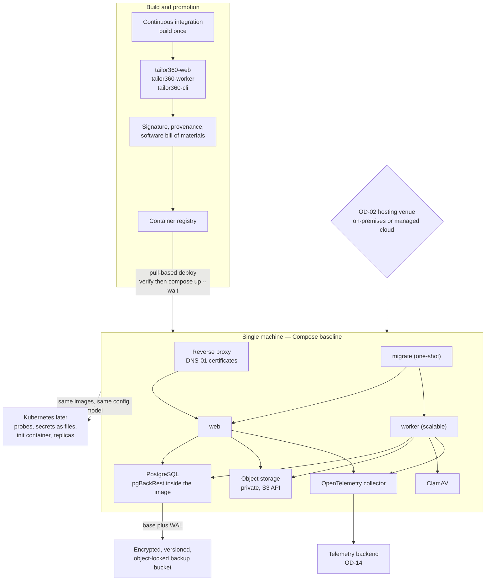

# ADR-0010 — Ship as portable containers with a Compose baseline and a Kubernetes-ready path

This record decides the deployment unit and the baseline topology: three signed container images —
`tailor360-web`, `tailor360-worker` and `tailor360-cli` — orchestrated by Docker Compose on a single virtual
machine, written so that the identical images run under Kubernetes later without an application change. It does
**not** decide where that machine lives: single-VM on-premises versus managed cloud remains an owner decision.
Every session touching `infra/`, a Dockerfile, configuration binding or a health probe must read this record.

| Field | Value |
| --- | --- |
| **Status** | Accepted — 2026-09-04 |
| **Deciders** | Technical reviewer; business owner (hosting venue and budget) |
| **Consulted** | Roadmap issue #1 (containerised, portable deployment); epics #14 and #15; assumption A5 (sizing) |
| **Informed** | Every implementing session; whoever operates the environment once OD-02 and OD-15 are settled |
| **Plan decision** | D17, with D12 (worker scale-out), D13 (observability footprint) and D18 (backups) |
| **Plan sections** | 3 (D17, D18), 4.4 (health probe semantics, configuration and secrets), 4.7 (deployment topology) |
| **Issues affected** | #18 (this record), #20 (local Compose environment), #22 (interim staging), #59 (environments, infrastructure as code, CI/CD), #60 (backups and disaster recovery), #58 (observability footprint), #61 (go-live) |
| **Depends on open decision** | [`OD-02`](../prd/assumptions-and-open-decisions.md) — hosting model and indicative monthly budget (plan Section 11 item 2). Owner: business owner; needed **before the Wave 1 exit gate**. This record deliberately decides the *unit* and the *shape* so that the venue can be chosen late without re-engineering. [`OD-14`](../prd/assumptions-and-open-decisions.md) — telemetry backend (plan Section 11 item 14) decides whether a second machine is provisioned for observability |
| **Supersedes / superseded by** | None |

---

## 1. Context and problem statement

The roadmap requires containerised, portable deployment. That word "portable" is doing real work here, because
the venue is genuinely undecided: plan Section 11 item 2 asks the owner to choose cloud — and which provider — or
on-premises, and notes that the answer fixes the infrastructure-as-code tooling, the backup destination and the
transport-layer-security approach, and is needed by issue #19 before the availability, recovery-point and
recovery-time objectives can be selected.

Meanwhile the work cannot wait for that answer. Issue #22 needs an interim staging environment reachable over
transport-layer security from the end of Wave 1, so that real-device testing of scanning and label printing has
somewhere to run. Something must be deployable before the venue is chosen.

The shape of the thing being deployed is already fixed by earlier records. [ADR-0001](0001-modular-monolith.md)
gives one web host and one worker host sharing module assemblies. [ADR-0004](0004-postgresql-schema-per-module.md)
gives one PostgreSQL database. [ADR-0005](0005-object-storage-authorised-delivery.md) gives private,
S3-compatible object storage that is not internet-reachable. [ADR-0008](0008-transactional-outbox-and-workers.md)
puts background work in a separate worker that must be able to run as two replicas without a code change. Add a
reverse proxy that can obtain certificates behind network address translation, a malware scanner, an
observability collector and a backup mechanism, and the component list is complete.

The operating context is unusual only in its smallness. Assumption A5 sizes the baseline production machine at
4 vCPU, 16 GB of RAM and 200 GB of solid-state disk, with resident memory already accounted: PostgreSQL 2 GB,
web 0.5 GB, worker 0.5 GB, object storage 0.5 to 1 GB, the malware scanner 1.5 to 2 GB, the proxy 0.1 GB and the
collector 0.3 GB. There is no platform team. Plan Section 10 records "observability stack too heavy for one VM"
as a live risk, which is a fair warning about every optional component.

Two constraints follow from the venue being open. First, no application code may depend on how it is
orchestrated — no host paths, no orchestrator-specific service discovery, no assumption that a sibling container
starts first. Second, the on-premises candidate has a short, enumerated egress list (the malware-signature
mirror, the backup bucket endpoint, the certificate-authority domain-validation provider, the observability
backend and the container registry), so nothing may quietly require the open internet.

**The question:** what is the deployment unit and the baseline topology, such that an environment exists before
the hosting venue is chosen, and choosing either venue later is a configuration exercise rather than a rewrite?

## 2. Decision drivers

| # | Driver | Why it matters here |
| --- | --- | --- |
| D1 | The venue can be chosen late, and changed | OD-02 is open and needed only by the Wave 1 exit gate. A decision that forces the answer now would be the wrong shape |
| D2 | Operable by a business with no platform team | Whoever runs this will run a handful of commands, read a runbook and call for help. Complexity has a direct cost in downtime |
| D3 | Fits assumption A5's machine | 16 GB with the malware scanner and the collector already accounted leaves very little headroom for an orchestrator |
| D4 | Identical artefact from development to production | "Works on staging" must mean the same bytes; promotion is by digest after signature and provenance verification |
| D5 | Certificates behind network address translation | An on-premises branch has no inbound port 80, so domain validation must not require one |
| D6 | Backups and disaster recovery are part of the topology, not an afterthought | Recovery-point and recovery-time objectives are release gates; the database image itself must carry the archiving mechanism |
| D7 | A second worker, and later a second web replica, without a code change | [ADR-0008](0008-transactional-outbox-and-workers.md) already made this safe; the topology must not undo it |
| D8 | Short, enumerable egress | The on-premises candidate must be installable in a network where everything outbound is justified |
| D9 | A credible path to higher availability | Compose cannot do rolling updates. Whatever is chosen must not have to be rebuilt when that becomes unacceptable |

## 3. Considered options

1. **Containers with a Docker Compose baseline, written to be Kubernetes-ready** (chosen)
2. **Kubernetes from day one** — k3s on a virtual machine, or a managed cluster
3. **Platform as a service or serverless containers** — Azure App Service or Container Apps, Google Cloud Run,
   AWS App Runner, with managed PostgreSQL and object storage
4. **Direct installation on the virtual machine** — systemd units, no containers

### 3.1 Option 1 — Containers with a Compose baseline, Kubernetes-ready (chosen)

Three application images plus PostgreSQL with pgBackRest inside it, an S3-compatible object store, the malware
scanner, a reverse proxy and an observability collector, described by a Compose file per environment.
Configuration comes from environment variables and secret files, health probes have orchestrator-neutral
semantics, and no application code knows what is orchestrating it. Provisioning is Terraform for cloud or
Ansible for on-premises.

- Good, because it satisfies D1 exactly: the same images and the same configuration model run on a rented cloud
  virtual machine, on a machine in the back office of a branch, or later on a cluster. The venue decision under
  OD-02 becomes an infrastructure choice rather than an application choice.
- Good, because Compose is genuinely operable by one person: `docker compose ps`, `logs`, `up -d`, a runbook and
  a backup command. That is the honest ceiling of what this business can support, and it is enough.
- Good, because the footprint fits. An orchestrator's own control plane would take a meaningful slice of 16 GB
  that assumption A5 has already allocated to PostgreSQL and the malware scanner.
- Good, because the one-shot `migrate` service with `condition: service_completed_successfully` gives a correct
  ordered start-up without application-level retry loops, and the same shape becomes an init container or a Job
  under Kubernetes.
- Good, because pgBackRest lives *inside* the PostgreSQL image, since `archive_command` cannot run in a sidecar —
  which means continuous write-ahead-log archiving works identically wherever the container runs.
- Good, because the certificate strategy — a proxy using domain-validation challenges over the domain name
  system — works behind network address translation, which the on-premises candidate needs and the cloud
  candidate does not mind.
- Good, because promotion is by image digest with signature and provenance verification, and deployment to a
  machine is pull-based: the machine verifies the signature and pulls, so no deployment key to production is held
  by the build system.
- Bad, because Compose has no rolling update. Replacing the web container costs a few seconds of proxy errors on
  every release — accepted against the proposed availability target, minimised with `--wait` and proxy retry, and
  removed only when Kubernetes arrives.
- Bad, because a single machine is a single point of failure. Availability above roughly 99.5 per cent monthly
  (**proposed, to be confirmed** by issue #19) is not reachable this way.
- Bad, because "Kubernetes-ready" is a claim that decays unless it is tested; without a periodic exercise it
  becomes an aspiration.
- Bad, because Compose has no secret manager, no policy engine and no admission control, so those controls live
  in the pipeline and in review rather than in the platform.

### 3.2 Option 2 — Kubernetes from day one

k3s on the same virtual machine, or a managed cluster from a cloud provider, with a Helm chart from the start.

- Good, because rolling updates, readiness gating, restart policies, horizontal scaling, secret objects and
  network policies are platform features rather than application concerns — and network policy is exactly what
  the worker's egress restriction wants.
- Good, because it removes the "Kubernetes-ready but untested" weakness of Option 1 by making it the actual
  target.
- Good, because a managed cluster brings certificate management, ingress, log shipping and monitoring
  integrations that would otherwise be assembled by hand.
- Bad, because it is a large operational surface for a business with no platform team: upgrades, certificate
  rotation inside the cluster, storage classes, and a class of failure that reads as unintelligible to a
  non-specialist. Plan Section 10's warning about the observability stack applies with more force here.
- Bad, because on a 16 GB machine, k3s plus its data store competes with PostgreSQL and the malware scanner for
  memory that assumption A5 has already spent.
- Bad, because a managed cluster is a monthly cost with no known budget: OD-02 explicitly has not fixed one.
- Bad, because it buys availability the rest of the system cannot yet use. With one PostgreSQL instance and one
  object store on one machine, a rolling web update does not make the system highly available; it makes one
  component highly available in front of a single point of failure.

### 3.3 Option 3 — Platform as a service or serverless containers

The web host on a managed container platform, the worker as a background service or a scheduled job, with
managed PostgreSQL and the provider's object storage.

- Good, because it removes machine administration entirely: patching, disk, certificates and scaling become the
  provider's problem, which is a real saving for a business with no operations staff.
- Good, because managed PostgreSQL brings point-in-time recovery, automated backups and failover, directly
  serving the recovery-point and recovery-time objectives that D6 cares about.
- Good, because it scales down as well as up, and the deployment pipeline is usually a single command.
- Bad, because it forecloses OD-02 rather than deferring it. Choosing a platform is choosing a provider, and the
  on-premises candidate — which a tailoring business with intermittent connectivity may reasonably prefer —
  becomes unreachable without a rebuild.
- Bad, because the always-on worker with `LISTEN`/`NOTIFY` and lease-based claims is a poor fit for
  scale-to-zero and request-driven models; keeping it warm is either a configuration fight or a second product.
- Bad, because the private, not-internet-reachable object storage of
  [ADR-0005](0005-object-storage-authorised-delivery.md) and the malware scanner both need somewhere to live that
  these platforms do not naturally provide.
- Bad, because cost is consumption-shaped and unbudgeted, which is exactly what OD-02 exists to settle first.

### 3.4 Option 4 — Direct installation on the virtual machine

Publish the .NET applications to the machine, run them as systemd units, install PostgreSQL, the object store and
the malware scanner from packages, and configure the proxy directly.

- Good, because it is the least abstraction: fewer layers to understand, no container runtime to keep patched,
  and direct visibility of processes and files.
- Good, because it uses less memory than any containerised option, which on a 16 GB machine is not nothing.
- Good, because operating-system package management handles security updates for the dependencies without a
  rebuild.
- Bad, because it fails D4 outright. The artefact promoted to production is not the artefact tested, and
  "install these versions in this order" is a runbook rather than a reproducible unit.
- Bad, because it fails D1: moving to any other venue is a fresh installation, and moving to a cluster later is a
  complete repackaging.
- Bad, because dependency drift between development, staging and production is the default rather than an
  incident, and the roadmap explicitly asks for containers.
- Bad, because rollback becomes "reinstall the previous version and hope", where an image digest makes rollback
  exact.

### 3.5 Comparison

| Driver | Compose baseline, Kubernetes-ready | Kubernetes from day one | Platform as a service | Direct installation |
| --- | --- | --- | --- | --- |
| D1 Venue chosen late and changeable | Yes, either venue | Yes, but at a cost | No, forecloses on-premises | No |
| D2 Operable without a platform team | Yes | No | Yes, best of all | Partly, runbook-heavy |
| D3 Fits a 4 vCPU, 16 GB machine | Yes | Tight | Not applicable | Yes, best of all |
| D4 Identical artefact everywhere | Yes, by digest | Yes | Yes | No |
| D5 Certificates behind network address translation | Yes, domain-validation challenge | Yes, more assembly | Provider-managed | Yes |
| D6 Backups in the topology | pgBackRest inside the database image | Same, plus operators | Provider point-in-time recovery | Manual |
| D7 Second worker without a code change | Yes, `--scale worker=2` | Yes | Awkward | Manual |
| D8 Short, enumerable egress | Yes | Yes, with network policy | No, provider-dependent | Yes |
| D9 Path to higher availability | Yes, the images already fit a cluster | Already there | Provider's | No |
| Release interruption | A few seconds of proxy errors | None | None | Seconds to minutes |
| Monthly cost | One machine | One machine plus overhead, or a cluster fee | Consumption, unbudgeted | One machine |

## 4. Decision outcome

**Chosen option: containers with a Docker Compose baseline, written to be Kubernetes-ready.** It is the only
option that lets the environment exist now and lets OD-02 be answered later without re-engineering. Option 3 is
the option a reader would expect a small business to choose, and it may well win once OD-02 is settled toward a
cloud — but choosing it today would decide the venue by accident, which is precisely what plan Section 11 item 2
reserves to the owner.

**This record does not decide the venue.** Single-VM on-premises versus managed cloud stays open as OD-02, owned
by the business owner and needed before the Wave 1 exit gate. What this record decides is that the answer is a
configuration and infrastructure-as-code exercise, not an application change.

### 4.1 Artefacts

| Image | Contents | Properties |
| --- | --- | --- |
| `tailor360-web` | The BFF, `/api/v1` and the built progressive web application assets | Non-root, read-only root filesystem, pinned base image, software bill of materials, signature and provenance attestation |
| `tailor360-worker` | The background processing host with its own health endpoints | As above |
| `tailor360-cli` | `migrate`, `init-reference-data`, `seed-synthetic` (never in production), `replay-outbox`, `flags set`, `rebuild-projection`, `create-owner` | As above; requires `--operator` and `--reason` outside development |

Build once; promote the **identical digest** after verifying signature and provenance. A tag is never rebuilt.

### 4.2 The Compose baseline

| Service | Role | Notes |
| --- | --- | --- |
| Reverse proxy (Caddy) | Transport-layer security termination, routing | Certificates by domain-name-system domain validation, so it works behind network address translation. Only `/health/live` is exposed externally; `/c/**` customer-link paths are redacted in its logs |
| `migrate` (one-shot) | Applies migrations, then exits | Web and worker depend on it with `condition: service_completed_successfully` |
| `web` | The web host | In-process watchdog: three consecutive liveness failures exit with code 70 under `restart: unless-stopped`, because Compose does not restart unhealthy containers |
| `worker` | Background processing | Scalable with `--scale worker=2`; leases make that safe |
| PostgreSQL with pgBackRest | System of record plus continuous archiving | pgBackRest is **inside** the image because `archive_command` cannot live in a sidecar. Base backups plus write-ahead-log archiving to an encrypted, versioned, object-locked bucket whose retention is enforced by bucket lifecycle |
| Object storage (MinIO locally) | Private media and document storage | Not internet-reachable; per-module prefixes; server-side encryption; versioning with non-current-version retention at least as long as database backup retention |
| ClamAV | Malware scanning behind `IMalwareScanner` | Feature-flagged; uploads quarantined until the scan passes |
| OpenTelemetry collector | Telemetry egress | Collector-only by default; the self-hosted metrics and logging stack is an optional profile for development, air-gapped installations and game days |
| Mailpit | Captured mail | Non-production only |

Every service caps its container logs (`json-file`, 50 MB × 5). Environments: development (Compose), test
(ephemeral in continuous integration), interim staging (a single machine from Wave 1, behind a network gate,
synthetic data only), then staging and production managed by infrastructure as code under issue #59.

### 4.3 The portability rules that make "Kubernetes-ready" true

These are the constraints application code must obey. They are what turns a claim into a property.

| Rule | Why |
| --- | --- |
| Configuration comes from `appsettings`, environment variables and secret **files** (`AddKeyPerFile("/run/secrets")`), validated at start-up with `ValidateOnStart` | Docker secrets and Kubernetes secrets both present as files. No code change between them |
| No secret value ever appears in a Compose `environment:` block or a `.env` file; those carry non-secret settings only | The same discipline works for a Kubernetes secret |
| No application code reads a host path, a container name or an orchestrator interface | Service addresses are configuration; nothing infers topology |
| Health probes have orchestrator-neutral semantics: `/health/live` (process responsive and the dispatcher loop ticking, no network dependency), `/health/startup` (configuration valid, no unapplied migration, data-protection ring loaded), `/health/ready` (database reachable only), `/health/detail` (internal or `admin.health.read`) | Compose `healthcheck` and Kubernetes liveness, startup and readiness probes map one to one. Non-essential dependencies report **Degraded** on the detail endpoint and never remove a host from rotation |
| The data-protection key ring is persisted in `platform.data_protection_keys`, protected by a certificate or key-management key supplied as a secret; start-up **fails** if the ring is on the local filesystem outside development | Otherwise a second replica cannot decrypt what the first wrote |
| Object storage is reached only through the S3 application programming interface | MinIO, S3, R2 and Azure Blob via the S3 interface are then interchangeable |
| Ordered start-up is expressed as a one-shot migration step, not as application retry loops | Becomes an init container or a Job unchanged |
| Worker concurrency is safe by database lease, never by "there is only one instance" | Replica count becomes a scaling knob |
| No reliance on a sticky session or on in-process state surviving a restart | A second web replica must be a configuration change, subject to the connection budget below |

**The connection budget is a portability constraint, not a tuning note.** Plan Section 4.4 allocates against
`max_connections = 100`: web transactional 30, web reporting 10, worker transactional 20, worker reporting 10,
migrator 2, tooling 5, reserve 10. It is validated at start-up against `SHOW max_connections` and exported with an
alert at 80 per cent. A second web replica or a read replica requires recomputing it, or PgBouncer in transaction
mode. Scaling is therefore a deliberate act with a prerequisite, not a slider.

### 4.4 Release and rollback

Deployment to a machine is **pull-based**: a `tailor360-deploy` unit on the machine verifies the cosign
signature, runs `migrate`, then `docker compose up -d --wait --pull always`. No deployment key to production is
held by the build system. Migrations follow expand–migrate–contract, and the start-up check tolerates
applied-but-unknown migrations so release N runs against a database already at N+1. Rollback is redeploying
tag N, rehearsed with the database at N+1 **and** a progressive web application at N+1 cached in a browser; the
minimum supported client version is raised only in the release *after* the change that requires it.

### 4.5 Provisioning and what OD-02 will fix

Terraform for a cloud venue, Ansible for on-premises. The venue decision changes the following and nothing else
in the application:

| Fixed by OD-02 | On-premises single machine | Managed cloud |
| --- | --- | --- |
| Provisioning tool | Ansible | Terraform |
| PostgreSQL | In the Compose stack with pgBackRest inside the image | Optionally the provider's managed database with point-in-time recovery plus a nightly logical dump to the same locked bucket |
| Object storage | MinIO in the stack, plus an off-site copy | The provider's bucket with object lock and versioning |
| Certificates | Domain-validation challenge over the domain name system, behind network address translation | Either, usually the same |
| Backup destination | An encrypted, versioned, object-locked bucket, with the cipher key escrowed separately | The same, in the provider's storage |
| Availability, recovery-point and recovery-time objectives | Stated per hosting model in `docs/nfr/slo.md` and selected once OD-02 is taken | As stated there |
| Egress list | Malware-signature mirror, backup bucket, certificate-authority domain-validation provider, observability backend, container registry | Provider-internal for most of these |

## 5. Consequences

### 5.1 Positive

| Consequence | Who feels it |
| --- | --- |
| An environment exists from the end of Wave 1 without waiting for OD-02, so real-device scanning and label testing has somewhere to run | Issue #22, and every device rehearsal after it |
| The venue can be chosen — or changed — as an infrastructure exercise, not an application rewrite | The business owner, holding OD-02 |
| The artefact tested is bit-for-bit the artefact deployed, and rollback is an exact digest | Release gates; whoever is awake during a bad release |
| One person can operate the system with a handful of commands and a runbook | Whoever holds operations ownership under OD-15 |
| Continuous write-ahead-log archiving works identically wherever the database container runs, because pgBackRest is inside the image | Recovery-point objective; issue #60 |
| A second worker is a flag, and a second web replica is a documented, budgeted step | Delivery, as volumes grow |
| Local development, continuous integration and staging share one stack definition, so "works on my machine" is a smaller category | Every implementing session |

### 5.2 Negative

| Consequence | Who feels it | How it is mitigated or where it is handled |
| --- | --- | --- |
| Compose cannot roll updates, so a web container swap costs a few seconds of proxy errors per release | Whoever is at the counter at that moment | Accepted against the proposed availability target (**proposed, to be confirmed** by issue #19); minimised with `--wait` and proxy retry; releases scheduled outside counter hours; removed when Kubernetes arrives |
| One machine is one point of failure: an outage is total until it is restored | Every branch | The recovery-time objective and the disaster-recovery exercise are release gates (issue #60); higher availability is an explicit OD-02 cost conversation, not a silent assumption |
| "Kubernetes-ready" decays unless exercised | Whoever migrates later | Section 4.3 states the rules as testable properties, several already enforced (start-up fails on a filesystem key ring; the connection budget is validated); a Helm chart is written when Kubernetes is actually chosen, not speculatively |
| Compose provides no secret manager, policy engine or admission control | Security review, issue #56b | Secrets as files with fail-fast validation; image signing, provenance and vulnerability scanning enforced in the pipeline; the reverse proxy exposes only `/health/live` |
| The malware scanner and the optional observability stack are heavy for a 16 GB machine | Whoever sizes the machine | Collector-only is the default and the self-hosted stack is an opt-in profile (plan D13); memory is budgeted per component in assumption A5; growth alerts on disk and memory |
| Container updates are a rebuild rather than an operating-system package update | Delivery | Base images pinned and updated by dependency automation, with vulnerability scanning of images and infrastructure as a release gate |
| Operators must learn container basics | Whoever holds OD-15 | The runbooks in issue #59 and #60 are written to be followed without container expertise; the command surface is deliberately tiny |
| Scaling the web tier is gated on recomputing the connection budget | Whoever scales it | Stated in Section 4.3 and validated at start-up with an alert at 80 per cent; PgBouncer is the named remedy |

## 6. Confirmation

| Check | Mechanism | Where |
| --- | --- | --- |
| Configuration binds from environment and secret files, and start-up fails when a required value is missing | `ValidateOnStart` plus a configuration test using sentinel values that must not appear in logs, problem details, health payloads or telemetry | Issue #21, plan Section 4.4 |
| Start-up refuses a filesystem data-protection key ring outside development | Start-up check with a test | Issue #21 |
| The connection budget matches the database | Start-up validation against `SHOW max_connections`, exported with an alert at 80 per cent | Issue #21, issue #58 |
| Health probes behave as specified for both orchestrators | Integration tests per probe, plus Compose `healthcheck` definitions and the in-process watchdog | Issues #20, #21, #59 |
| Images are non-root, read-only, pinned, signed and attested | Pipeline gates: build, software bill of materials, cosign signature, provenance, Trivy scan of images and infrastructure | Issue #59, plan Section 5.3 |
| Only the promoted digest reaches an environment | Pull-based deploy verifying the signature before `compose up` | Issue #59 |
| Migrations are backward compatible with the previous release | Expand–migrate–contract review on every pull request, plus a migration dry-run gate | Plan Section 5.1 item 4, `docs/dev/migrations.md` |
| Rollback works with the database ahead and an old client cached | Rehearsed rollback exercise per release | Issue #59, plan Section 4.7 |
| Backup, restore and disaster recovery actually work | Weekly automated restore on the staging machine (never production, never a hosted runner); retention 35 daily plus 12 monthly; a disaster-recovery exercise per release cycle | Issue #60, plan D18 |
| Backups cannot be deleted by the archiving identity | Object-locked bucket with lifecycle-enforced retention; the archiver identity has no delete permission | Issue #60 |
| Egress stays within the enumerated list | Network policy and proxy configuration for worker egress; review of any new outbound dependency | Issue #59, [ADR-0012](0012-integration-ports-and-adapters.md) |

## 7. Diagram

## 8. Revisiting this decision

| Trigger | What it would mean |
| --- | --- |
| OD-02 selects managed cloud with an availability target Compose cannot meet | Move to the provider's managed database and a cluster or container platform. The images and the configuration model are unchanged; a Helm chart and the probe mapping in Section 4.3 are written then |
| The few seconds of errors per release become unacceptable — for example when a second branch bills continuously | Kubernetes with blue-green or rolling updates, which is the reason "Kubernetes-ready" is a property rather than a slogan |
| A second web replica is genuinely needed | Recompute the connection budget or introduce PgBouncer in transaction mode first, then scale. A distributed cache also becomes relevant ([ADR-0013](0013-caching.md)) |
| The observability footprint or the malware scanner exhausts the machine | Move the observability stack to a second machine (already the OD-14 alternative) or a hosted backend; re-size against assumption A5 |
| Multiple legal entities or many more branches appear | Re-cost the whole topology; assumption A1 and [ADR-0007](0007-branch-aware-single-tenancy.md) would be revisited first |

Nothing here is a reason to revisit on its own: a release causing a few seconds of proxy errors, a container
restart, or an operator needing the runbook. Those were accepted when this record was made.

## 9. Links

| Document | Why it is relevant |
| --- | --- |
| [`../IMPLEMENTATION_PLAN.md`](../IMPLEMENTATION_PLAN.md) | Sections 3 (D17, D18), 4.4, 4.7 |
| [`../architecture/deployment.md`](../architecture/deployment.md) | The deployment view in detail, environment by environment |
| [`../architecture/container.md`](../architecture/container.md) | The containers this record packages and how they relate |
| [`../architecture/failure-modes.md`](../architecture/failure-modes.md) | What happens when the database, the object store or the worker is unavailable |
| [`../dev/setup.md`](../dev/setup.md) | Running the Compose stack locally |
| [`../platform/secrets.md`](../platform/secrets.md) | The secret-file model that keeps the images orchestrator-neutral |
| [`../platform/database.md`](../platform/database.md) | Database roles, the connection budget and migration handling |
| [`0001-modular-monolith.md`](0001-modular-monolith.md) | Why there are two hosts rather than many services |
| [`0005-object-storage-authorised-delivery.md`](0005-object-storage-authorised-delivery.md) | Why object storage is private and reached only through the S3 interface |
| [`0008-transactional-outbox-and-workers.md`](0008-transactional-outbox-and-workers.md) | Why the worker can be scaled by replica count alone |
| [`0013-caching.md`](0013-caching.md) | What changes about caching when a second replica appears |
| [`../prd/assumptions-and-open-decisions.md`](../prd/assumptions-and-open-decisions.md) | OD-02 (hosting model and budget), OD-14 (telemetry backend), OD-15 (operations ownership), assumption A5 (sizing) |
