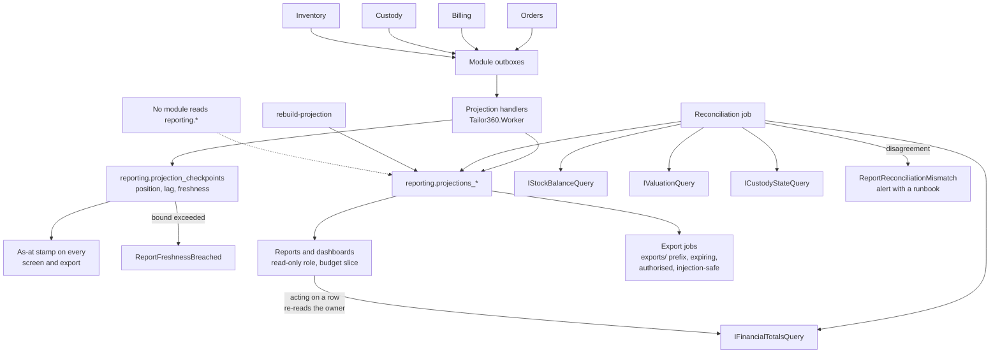

# ADR-0011 — Serve reports from rebuildable projections with checkpoints and reconciliation

This record decides where a report's numbers come from: a Reporting module that maintains its own read models in
its own schema, built from versioned integration events, tracked by per-projection checkpoints, and reconciled
against the authoritative modules on a schedule — rather than querying another module's tables directly or
standing up a separate data warehouse. It also fixes the rule that makes this safe: a projection is never the
source of truth for money, stock, workflow or custody. Every session adding a report, an export or a dashboard
must read this record.

| Field | Value |
| --- | --- |
| **Status** | Accepted — 2026-09-04 |
| **Deciders** | Technical reviewer; business owner (which figures are published) |
| **Consulted** | Roadmap issue #1; epic #10; the accountant for the goods-and-services-tax summary and sales figures |
| **Informed** | Every implementing session that publishes an event; Owner and Branch Manager as the readers of these reports |
| **Plan decision** | None directly — this record originates here, and formalises plan Section 2.2's rule that reporting projections are never the authoritative source |
| **Plan sections** | 2.2 (projections never authoritative), 4.3 (Reporting module), 4.4 (connection budget, database roles), 5.2 (export safety), 10 (report drift risk) |
| **Issues affected** | #18 (this record), #44 (operational reports and filter inference), #45 and #46 (projections, reconciliation, scheduled reports and exports), #40 (valuation and costing assumptions), #42 (goods-and-services-tax output), #58 (freshness alerting) |
| **Depends on open decision** | [`OD-05`](../prd/assumptions-and-open-decisions.md) — valuation method, rounding conventions and the statutory retention period for goods-and-services-tax records (plan Section 11 item 5), co-signed by the accountant. It decides what several published figures *mean*, not how they are served. [`OD-08`](../prd/assumptions-and-open-decisions.md) — retention periods, which bound how long an export file lives |
| **Supersedes / superseded by** | None |

---

## 1. Context and problem statement

The Owner wants to know what was sold this month, what tax is due, what stock is worth, which garment jobs are
late, how many alterations came back, and which branch is slower. The Branch Manager wants today's workboard and
this week's exceptions. The accountant wants a goods-and-services-tax summary they can file from, and an export
that lands in the accounting system. None of that is exotic; all of it crosses modules.

Two constraints make it interesting.

The first is ownership. [ADR-0001](0001-modular-monolith.md) and
[ADR-0004](0004-postgresql-schema-per-module.md) forbid a module reading another module's tables, and the
architecture rules make that testable — ARCH-005 for schemas, ARCH-011 specifically for Reporting. A report that
joins `billing.invoices` to `orders.garment_jobs` to `custody.scan_events` would be the single largest violation
of the design, and it would silently make every one of those schemas an unversioned public interface that nobody
could change again.

The second is authority. Plan Section 2.2 states it flatly: reporting projections are never the authoritative
source of financial, stock, workflow or custody state. A number on a dashboard that people act on — refuse a
dispatch, approve a variance, file a return — must be traceable to the module that owns it. And plan Section 10
records the matching risk: "report/projection drift or reporting load hurting transactions", with the impact
"wrong decisions, slow billing".

There is also an operating constraint. This runs on one machine with one PostgreSQL instance and a connection
budget of 100 connections, of which reporting gets 10 on the web host and 10 in the worker. A report that scans a
year of invoices must not be able to slow the Cashier taking a payment at the counter.

**The question:** where do report numbers come from, such that no module boundary is violated, no figure is
mistaken for the truth, and a heavy report cannot hurt the counter?

## 2. Decision drivers

| # | Driver | Why it matters here |
| --- | --- | --- |
| D1 | A projection is never authoritative | Someone will eventually act on a report. The design must make "this is derived" structurally true and visible, not a convention |
| D2 | Module boundaries hold | Reporting must be able to answer cross-module questions without a single cross-schema read, or the boundaries mean nothing |
| D3 | Drift is detected, not discovered | Derived data will diverge. The question is whether the system notices before a person does |
| D4 | Reporting load cannot hurt transactions | The counter and the workshop must stay fast during a month-end export |
| D5 | Freshness is visible | A figure that is 40 seconds behind is fine if it says so, and dangerous if it does not |
| D6 | Rebuildable from scratch | A projection bug must be fixable by rebuilding, not by hand-correcting rows |
| D7 | Operable on one machine | No separate database, no separate cluster, no extract-transform-load platform, no second thing to back up |
| D8 | Exports are governed | Files leave the building. They need authorisation, expiry, injection defences, row caps and an audit trail |
| D9 | Figures have definitions | "Revenue" must mean one thing, written down, or two reports will disagree and both will be defended |

## 3. Considered options

1. **A Reporting module with projections and checkpoints in its own schema, built from events and reconciled
   against read contracts** (chosen)
2. **Query the module tables directly**, through cross-schema views or a reporting-only database role
3. **A separate analytics warehouse** — ClickHouse, DuckDB or a managed warehouse — fed by extract-transform-load
4. **Aggregate on demand over authoritative tables**, with no read models, optionally against a read replica

### 3.1 Option 1 — Projections with checkpoints and reconciliation (chosen)

Reporting owns the `reporting` schema: `projections_*` tables, one per read model; `projection_checkpoints`
carrying position, lag and a freshness indicator; a metric dictionary defining every published figure;
reconciliation runs; report schedules; export jobs; costing assumption versions; and goods-and-services-tax
summary layouts. Projections are built by worker handlers from versioned integration events. A separate
reconciliation job recomputes control totals from the authoritative modules through their read contracts —
`IFinancialTotalsQuery`, `IStockBalanceQuery`, `IValuationQuery`, `ICustodyStateQuery` — and raises
`ReportReconciliationMismatch` when they disagree.

- Good, because it answers cross-module questions without a single cross-module table read. Reporting subscribes
  to events and calls `Contracts`; ARCH-011 keeps it that way.
- Good, because "never authoritative" becomes structural: no module reads `reporting.*`, so no business decision
  can be taken from a projection by accident. Reporting is a leaf.
- Good, because drift is detected rather than discovered. Reconciliation compares derived totals against the
  owning module's own figure and alerts on disagreement, which is the direct mitigation for the plan's
  report-drift risk.
- Good, because a projection bug is fixable: `rebuild-projection` replays and recomputes, and the checkpoint
  makes partial progress resumable.
- Good, because freshness is a first-class value from the checkpoint, so every screen and every export can carry
  an "as at" stamp instead of implying it is live.
- Good, because load isolation is available inside one database: a read-only role with
  `default_transaction_read_only`, its own slice of the connection budget, statement timeouts, and large ranges
  restricted to the worker.
- Good, because it costs nothing new to operate: one schema in the database that is already backed up, restored
  and monitored.
- Bad, because projections are eventually consistent, so a figure can lag the transaction that produced it, and
  people must be taught to read the freshness stamp.
- Bad, because it is genuinely more code: a handler and a rebuild path per read model, a reconciliation
  comparison per control total, and a checkpoint to maintain.
- Bad, because it stores data twice, and a rebuild over a year of events takes time that has to be budgeted.
- Bad, because a mismatch alert needs an owner and a runbook, or it becomes noise that is muted.

### 3.2 Option 2 — Query module tables directly

Reporting queries `billing`, `orders`, `custody` and `inventory` tables directly, or through cross-schema views,
using a read-only database role.

- Good, because it is always exactly current: no lag, no checkpoint, no reconciliation, and no possibility of
  drift, because there is nothing to drift from.
- Good, because it is far less code — a query per report and nothing else — and it is what most systems of this
  size do.
- Good, because a new report is a new query, which is a genuinely fast path from question to answer.
- Bad, because it makes every module's physical schema a public interface. A column rename in Billing breaks a
  report in another module, and no architecture test can save it — ARCH-005 and ARCH-011 exist precisely to
  prevent this, so the option contradicts the boundaries the product is built on.
- Bad, because it invites a report to become authoritative: once a screen joins `orders` to `billing`, the
  temptation to have a command read the same join is immediate.
- Bad, because load is not isolatable in any meaningful way. A year-long aggregate over `billing.invoices` locks
  horns with the Cashier posting a payment, on the same tables, in the same instance.
- Bad, because the figures have no definitions and no versioning, so two reports over the same tables can
  disagree with equal authority.

### 3.3 Option 3 — A separate analytics warehouse

Extract to ClickHouse, DuckDB or a managed warehouse; model there; serve reports and exports from it.

- Good, because analytical performance would be excellent, and complex historical analysis would stop competing
  with transactional load entirely — the cleanest possible answer to D4.
- Good, because it scales far past anything assumption A5 describes, and brings mature tooling for scheduled
  transformations and dashboards.
- Good, because it separates the analytical model from the operational one, which is the right long-term shape if
  reporting ever becomes a product in its own right.
- Bad, because it is a second data store to deploy, secure, back up, restore and reconcile — on a 16 GB machine
  with no platform team, and against an on-premises candidate with a deliberately short egress list.
- Bad, because it makes point-in-time recovery incoherent: restoring the operational database leaves the
  warehouse describing a future that no longer exists.
- Bad, because it moves personal and financial data into a second place with its own authorisation model,
  widening the surface that issues #56b and #57 must cover.
- Bad, because the extract pipeline reintroduces exactly the drift Option 1 detects, but across a system
  boundary where reconciliation is harder.
- Bad, because none of that is warranted at roughly 500 orders per branch per month. This is the right answer to
  a problem this business does not have.

### 3.4 Option 4 — Aggregate on demand, no read models

Compute every report at request time from the authoritative tables, through the owning modules' read contracts,
optionally against a PostgreSQL read replica.

- Good, because there is no derived state at all: nothing to rebuild, nothing to reconcile, nothing stale, and
  the smallest possible amount of code.
- Good, because every figure is by definition current and traceable to the owning module.
- Good, because a read replica would give real load isolation without a new technology.
- Bad, because a cross-module report becomes a fan-out of contract calls that must then be joined in memory,
  which is both slow and awkward for anything with a time series.
- Bad, because repeated month-end aggregation over the same rows is wasteful and unpredictable in latency, and
  the connection budget gives reporting only ten connections per host.
- Bad, because a read replica is another instance to provision and monitor, and it needs the hosting decision
  (OD-02) that is deliberately still open.
- Bad, because it offers no place to hold a costing assumption version, a metric definition or a
  goods-and-services-tax layout, so those would scatter across modules.

### 3.5 Comparison

| Driver | Projections with reconciliation | Query module tables | Separate warehouse | Aggregate on demand |
| --- | --- | --- | --- | --- |
| D1 Never authoritative | Structural — Reporting is a leaf | Blurred immediately | Structural but remote | Not applicable |
| D2 Module boundaries hold | Yes, events and contracts only | No, schemas become public | Yes, at the extract boundary | Yes |
| D3 Drift detected | Reconciliation with alerts | No drift, no boundary either | Drift across a system boundary | No drift |
| D4 Load isolation | Read-only role, budget slice, worker-only ranges | Poor | Best | Poor without a replica |
| D5 Freshness visible | Checkpoint per projection | Always current | Pipeline lag, often hidden | Always current |
| D6 Rebuildable | Yes, `rebuild-projection` | Not applicable | Yes, re-extract | Not applicable |
| D7 Operable on one machine | Yes, one schema | Yes | No | Yes, plus a replica |
| D8 Governed exports | Owned by Reporting | Scattered | In the warehouse | Scattered |
| D9 Figures defined | Metric dictionary | None | Usually modelled | None |
| Additional code | Highest | Lowest | High, plus a pipeline | Low |

## 4. Decision outcome

**Chosen option: a Reporting module owning projections, checkpoints and reconciliation in its own schema.** It
is the only option that answers cross-module questions without dissolving the module boundaries, and the only one
that makes "derived, not authoritative" a structural property rather than a warning in a document. Option 3 is
the right answer at a scale this business is nowhere near; Section 8 records what would have to change for it to
become correct.

### 4.1 What Reporting owns

| Table group | Contents |
| --- | --- |
| `projections_*` | One table per read model: operational, sales, goods-and-services-tax, stock, workflow and custody |
| `projection_checkpoints` | Per projection: position, lag and a freshness indicator |
| Metric dictionary | The definition of every published figure — name, meaning, unit, filters, the owning module and the authoritative contract it reconciles against |
| Reconciliation runs | Comparison results, with the mismatch and the period |
| Report schedules | Scheduled report definitions, recipients and delivery records |
| Export jobs | Requested exports, their state, artefact keys and expiry |
| Costing assumption versions | Versioned inputs to costing and valuation figures ([ADR-0009](0009-configurable-taxonomy-as-versioned-data.md)) |
| Goods-and-services-tax summary layouts | The layout the accountant signs off |

Reporting owns the `exports/` object-storage prefix. It **publishes** only `ReportReconciliationMismatch` and
`ReportFreshnessBreached`, and it exposes **no read contract to any other module**. Reporting is a leaf: it
consumes events and contracts, and nothing consumes it.

### 4.2 How a projection is built and kept honest

| Step | Mechanism |
| --- | --- |
| Input | Versioned integration events delivered through the transactional outbox ([ADR-0008](0008-transactional-outbox-and-workers.md)), inbox-deduplicated per handler |
| Ordering | Per aggregate, guaranteed by the outbox claim. Projections must tolerate events from different aggregates arriving in any relative order |
| Position | Advanced in `projection_checkpoints` in the **same transaction** as the projected rows, so a crash cannot advance past unwritten work |
| Freshness | Derived from the checkpoint and surfaced on every screen and export as an "as at" stamp; `ReportFreshnessBreached` fires when it exceeds the configured bound |
| Rebuild | `rebuild-projection` in `Tailor360.Cli` replays from the beginning into a new table, then swaps. A rebuild is the standard fix for a projection defect; hand-correcting projection rows is never permitted |
| Reconciliation | A scheduled worker job recomputes control totals from the owning modules through `IFinancialTotalsQuery`, `IStockBalanceQuery`, `IValuationQuery` and `ICustodyStateQuery`, compares them with the projection, records the run and raises `ReportReconciliationMismatch` on disagreement |
| Alerting | A mismatch and a freshness breach are alerts with a named owner and a runbook, not dashboard decoration |

The reconciliation source is deliberately the **owning module's contract**, not a second query over the same
events. Comparing a projection against the events that built it proves nothing; comparing it against Billing's
own total is what makes it a control.

### 4.3 The authority rule

| Question | Answered by |
| --- | --- |
| What is this customer's outstanding balance? | Billing, through `IFinancialTotalsQuery` — never a projection |
| May this garment job be dispatched? | Billing's `IDispatchEligibilityQuery` and Custody's state — never a projection |
| What is the stock balance of this item? | Inventory's `IStockBalanceQuery` — never a projection |
| Where is this garment now? | Custody's `ICustodyStateQuery` — never a projection |
| What did we sell last month, and what tax is due? | A Reporting projection, stamped with its freshness and reconciled |
| Which jobs are overdue on the workboard? | A Reporting projection for the list view; the action taken on a job re-reads the owning module |

No command handler reads `reporting.*`. Any screen that both *shows* a projected list and *acts* on a row
re-reads the authoritative module before acting. This is what makes eventual consistency safe here: a stale list
can only ever cause a wasted click, never a wrong write.

### 4.4 Load isolation and exports

| Control | Setting |
| --- | --- |
| Database role | `t360_reporting`: `SELECT` on `reporting.*` and contract views, `default_transaction_read_only` |
| Connection budget | Web reporting 10, worker reporting 10, within the 100-connection budget validated at start-up |
| Long ranges | Large date ranges and full exports run in the worker, never in a request thread |
| Timeouts | Statement timeouts on the reporting role, so a runaway query cannot hold a connection indefinitely |
| Export files | Written to the `exports/` prefix, served by an authorised, expiring download endpoint; never a stable location |
| Export safety | Every cell beginning `=`, `+`, `-`, `@`, tab or carriage return is prefixed with an apostrophe and quoted; UTF-8 with a byte-order mark; rows capped (default 50,000, larger exports paginated into an archive); spreadsheet cells are strings unless the metric dictionary types the column |
| Authorisation and audit | `reports.export` permission, branch scope enforced, and an explicit audit entry for the sensitive read |
| Retention | Exports expire under the retention policy; the period is set with OD-08 |
| Verification | A mixed-load test asserts that reporting load does not degrade transactional latency beyond the targets in `docs/nfr/slo.md` (**proposed, to be confirmed** by issue #19) |

### 4.5 Freshness targets

Plan Section 8's proposed starting targets include outbox lag under 30 seconds at the 95th percentile
(**proposed, to be confirmed** by issue #19). Projection freshness is bounded by that lag plus projection
handling time; the exact per-report bound, and what a breach means for each report, are stated in
`docs/nfr/slo.md` by issue #19 and are **proposed, to be confirmed** until it is approved. What this record
fixes is that a bound exists per projection, that it is measured from the checkpoint, and that exceeding it
raises `ReportFreshnessBreached` rather than passing silently.

## 5. Consequences

### 5.1 Positive

| Consequence | Who feels it |
| --- | --- |
| Cross-module reports exist without a single cross-module table read, so module schemas stay private and changeable | Every implementing session; architecture rules ARCH-005 and ARCH-011 |
| No business decision can be taken from a projection by accident, because nothing reads `reporting.*` | Cashier, Delivery Staff and Branch Manager at the moment a decision matters |
| Divergence is caught by a scheduled control, not by an Owner noticing a wrong figure | Owner and the accountant |
| A projection defect is fixed by rebuilding rather than by editing rows | Whoever is on call; issue #46 |
| Every figure carries an "as at" stamp, so trust is calibrated rather than assumed | Owner and Branch Manager |
| A month-end export cannot slow the counter, because it runs in the worker under a read-only role with its own budget | Cashier and Reception |
| Every published figure has a written definition, so two reports cannot disagree with equal authority | The accountant, and OD-05's sign-off |
| Exports are authorised, expiring, injection-safe and audited | Security review (#56b) and privacy work (#57) |

### 5.2 Negative

| Consequence | Who feels it | How it is mitigated or where it is handled |
| --- | --- | --- |
| Reports lag the transactions behind them | Owner and Branch Manager | The freshness stamp is on every screen and export; the bound is stated per projection in `docs/nfr/slo.md`; a breach alerts |
| A handler, a rebuild path and a reconciliation comparison per read model is real, recurring work | Backend sessions | Delivered per report issue (#44, #45, #46) with a shared projection harness rather than as one large subsystem |
| Data is stored twice, and a full rebuild over a year of events takes time | Storage and whoever runs a rebuild | Assumption A5 puts database growth under 5 GB a year; rebuilds run in the worker into a new table and swap, so no report is offline while it runs |
| Reconciliation mismatch alerts need a human owner or they become noise | Whoever holds operations ownership under OD-15 | A runbook per control total in issue #46; the alert names the period, the figures and the owning module |
| A screen that lists from a projection and acts on the owning module is more code than a single query | Frontend and backend sessions | Stated once as a pattern in Section 4.3 and applied consistently; it is what makes staleness harmless |
| A renamed or reversioned category can break a historical series | Owner reading a trend | Projections carry the taxonomy version identifier ([ADR-0009](0009-configurable-taxonomy-as-versioned-data.md)); the metric dictionary states how a series handles a rename |
| The metric dictionary must be maintained or it decays | Everyone who trusts a number | Plan Section 5.1 item 8 makes updating it part of the Definition of Done for any pull request that changes a report |

## 6. Confirmation

| Check | Mechanism | Where |
| --- | --- | --- |
| Reporting references only `Contracts` projects | ARCH-011 | [`../architecture/architecture-rules.md`](../architecture/architecture-rules.md), `ModuleBoundaryTests` (#20) |
| No `DbContext` maps a table outside its own schema, in either direction | ARCH-005 | `SourceConventionTests` (#20) |
| No module reads `reporting.*` | ARCH-011 plus a database-grant test asserting the application role has no read on `reporting` beyond Reporting's own context | Issues #20, #45 |
| A checkpoint never advances past unwritten rows | Integration test: fail mid-projection, restart, assert no gap and no duplicate | Issue #45 |
| A rebuild reproduces the same read model | Golden-master test comparing a rebuilt projection with an incrementally built one over the same fixture | Issue #46 |
| Reconciliation detects an injected divergence | Integration test that corrupts a projection row and asserts `ReportReconciliationMismatch` is raised | Issue #46 |
| Freshness is displayed and breaches alert | Screen tests for the "as at" stamp; an alert rule on `ReportFreshnessBreached` | Issues #44, #58 |
| Reporting load does not degrade transactional latency | Mixed-load test per release against the targets in `docs/nfr/slo.md` | Issue #46, plan Section 5.3 |
| Exports are injection-safe | A unit test over the injection corpus for every export path | Plan Section 5.2 |
| Exports are authorised, expiring and audited | Authorisation matrix fixtures for `reports.export`; expiry and audit tests | Issues #24, #45, #57 |
| Every published figure has a definition | Review step against the metric dictionary on any pull request changing a report | Plan Section 5.1 item 8 |

## 7. Diagram

## 8. Revisiting this decision

| Trigger | What it would mean |
| --- | --- |
| Reporting load measurably degrades transactional latency despite the read-only role, the budget slice and worker-only ranges | A PostgreSQL read replica first — cheapest and least disruptive — and only then Option 3. The hosting model under OD-02 decides which is available |
| Analytical questions outgrow projections: multi-year cohorts, ad-hoc slicing, external data | A warehouse becomes correct. The versioned integration events are already the right feed for it, so the migration is additive rather than a rewrite |
| A module is extracted into a service under [ADR-0001](0001-modular-monolith.md)'s criteria | Reporting's feed becomes remote for that module. Because it already consumes only events and contracts, nothing about this record changes |
| Reconciliation repeatedly finds real divergence | That is a defect in a projection or a handler, not a reason to change this record — it is the control working. A pattern of divergence in one area would justify making that figure authoritative-only, with no projection at all |

Nothing here is a reason to revisit on its own: a report 40 seconds behind, a rebuild taking minutes, or a single
reconciliation mismatch that turned out to be a handler bug. Those are the designed behaviour.

## 9. Links

| Document | Why it is relevant |
| --- | --- |
| [`../IMPLEMENTATION_PLAN.md`](../IMPLEMENTATION_PLAN.md) | Sections 2.2, 4.3, 4.4, 5.2, 10 |
| [`../architecture/module-ownership.md`](../architecture/module-ownership.md) | Reporting's owned data, its published events and the rule that it is a leaf |
| [`../architecture/architecture-rules.md`](../architecture/architecture-rules.md) | ARCH-005 and ARCH-011, which make this decision testable |
| [`../architecture/invariants.md`](../architecture/invariants.md) | The authoritative invariants a projection may never restate |
| [`../architecture/sequences/invoice-and-payment.md`](../architecture/sequences/invoice-and-payment.md) | The financial events projections consume and reconcile against |
| [`../architecture/failure-modes.md`](../architecture/failure-modes.md) | What a stale or failed projection does to the screens that use it |
| [`0008-transactional-outbox-and-workers.md`](0008-transactional-outbox-and-workers.md) | How events reach the projection handlers, and the ordering they can rely on |
| [`0009-configurable-taxonomy-as-versioned-data.md`](0009-configurable-taxonomy-as-versioned-data.md) | Why projections carry taxonomy version identifiers, and where costing assumptions come from |
| [`0004-postgresql-schema-per-module.md`](0004-postgresql-schema-per-module.md) | Why `reporting` is its own schema with its own role |
| [`0010-deployment-portability.md`](0010-deployment-portability.md) | The connection budget the reporting slice comes out of |
| [`../prd/assumptions-and-open-decisions.md`](../prd/assumptions-and-open-decisions.md) | OD-05 (valuation, rounding and goods-and-services-tax retention), OD-08 (retention periods), OD-15 (who owns a mismatch alert) |
