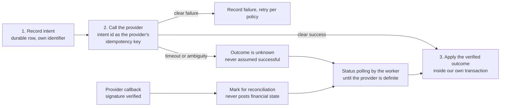
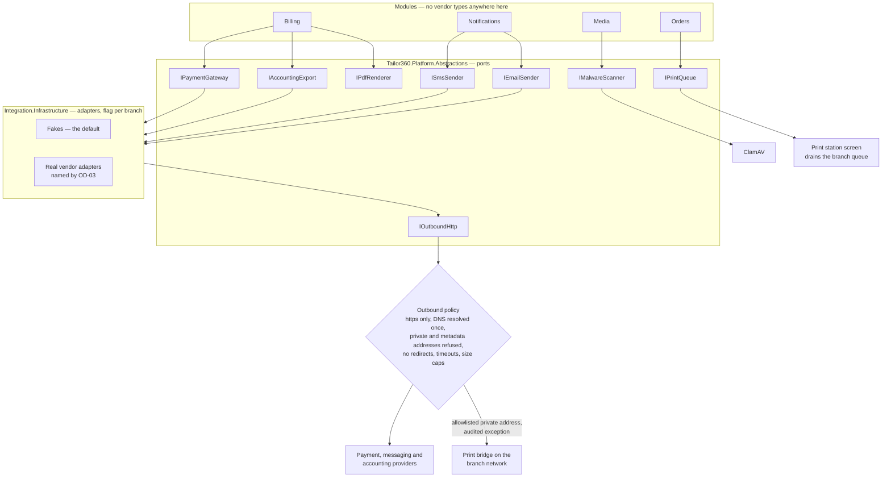

# ADR-0012 — Reach external systems only through ports, with replaceable adapters and a strict outbound policy

This record decides how payment gateways, messaging providers, the accounting system and printers attach to
HyFib Tailor 360: through narrow ports declared in `Tailor360.Platform.Abstractions`, implemented by adapters
that live only in `Tailor360.Modules.Integration.Infrastructure`, defaulting to fakes, enabled per branch by
feature flag, and reaching the network only through one vetted outbound client. It also fixes the sequence that
keeps money consistent when a vendor is slow or ambiguous. Every session adding an external dependency must read
this record.

| Field | Value |
| --- | --- |
| **Status** | Accepted — 2026-09-04 |
| **Deciders** | Technical reviewer; business owner (vendor selection and support ownership) |
| **Consulted** | Roadmap issue #1; epics #11 and #13; the accountant for the accounting export target |
| **Informed** | Every implementing session that calls anything outside the process; Cashier and Reception, whose screens change when a provider is unavailable |
| **Plan decision** | D20 (providers and staged enablement), with D15 (rendering and printing ports) and D16 (malware scanning) |
| **Plan sections** | 3 (D15, D16, D20), 4.3 (Integration module), 4.4 (provider calls, outbound HTTP policy, print queue), 5.3 (contract tests) |
| **Issues affected** | #18 (this record), #31 (malware scanning), #32a and #35 (document rendering, barcode rendering, print queue), #47 (notification adapters), #54 (webhooks and the integration relay), #55 (payment, accounting and print-bridge adapters), #59 (worker egress and network policy), #56b (hardening review) |
| **Depends on open decision** | [`OD-03`](../prd/assumptions-and-open-decisions.md) — providers: the short-message and messaging vendors, the payment gateway for unified-payments-interface and card, and the accounting export target (plan Section 11 item 3). Owner: business owner; needed **before Wave 4**. This record fixes the shape so that the vendors can be named late. [`OD-04`](../prd/assumptions-and-open-decisions.md) — the payment rule for dispatch, which decides whether a doorstep payment adapter is needed at all. [`OD-15`](../prd/assumptions-and-open-decisions.md) — who is paged when an adapter fails |
| **Supersedes / superseded by** | None |

---

## 1. Context and problem statement

The system has to talk to the outside world in four directions, and each of them is a different kind of risk.

**Money.** A customer pays through a unified-payments-interface or card gateway. The gateway can accept a
payment and then time out before it tells us, or call back twice, or call back with a payload someone else
forged. A payment recorded that did not happen, or a payment that happened and was never recorded, is the worst
failure this system can have — worse than being down, because being down is visible.

**Messages.** Short-message, messaging-application and electronic-mail providers deliver order-ready
notifications, estimate links and feedback requests. They fail in duller ways — a rate limit, an expired
credential, a template rejected — but they carry customer contact details and message bodies, so what is logged
and retained matters.

**Accounting.** The accountant needs an export in a format their software ingests. That is a file, not an
application programming interface, but it is still an external contract with a shape that must be verified.

**Printing.** A phone browser cannot drive a thermal label printer. Plan D15 already answers that with a print
queue and a print-station screen, with an optional network or local bridge adapter arriving later — and a bridge
on a branch's local network is an outbound call to a private address, which is exactly what a
server-side-request-forgery defence normally forbids.

Two facts sharpen all of this. First, **the vendors are not chosen**: plan Section 11 item 3 leaves the
short-message, messaging, payment and accounting targets to the owner, needed before Wave 4. Building against a
specific vendor now would mean rebuilding later. Second, **provider software-development kits are large**: they
bring transitive dependencies, their own transport clients, their own retry behaviour and their own logging, and
if they spread across modules they become impossible to replace and hard to audit.

There is also an attack surface. Anything that takes a location and fetches it — a webhook target, a callback
verification, a print bridge address — is a server-side-request-forgery vector into a machine that also holds
PostgreSQL, private object storage and, on a cloud venue, an instance metadata endpoint.

**The question:** how do external systems attach, so that a vendor can be chosen late and swapped later, money
cannot be half-recorded, and no outbound call becomes a way into the machine?

## 2. Decision drivers

| # | Driver | Why it matters here |
| --- | --- | --- |
| D1 | Vendors chosen late, replaced later | OD-03 is open until Wave 4, and a small business changes vendors on price and support |
| D2 | Money is never half-recorded | A timeout must resolve to a known outcome, not a guess. Callbacks must not be able to post financial state |
| D3 | Vendor software-development kits stay contained | Their dependencies, transport clients and logging must not leak into domain or application code |
| D4 | Develop and test without a live vendor | Every pull request runs in continuous integration with no vendor credentials |
| D5 | Outbound calls cannot become an attack path | One vetted client, private address ranges refused, metadata endpoints unreachable, no redirect following |
| D6 | Staged, reversible enablement | A new adapter goes live at one branch, behind a flag, and can be turned off in seconds |
| D7 | Somebody owns each live integration | An adapter without a named support owner is an outage nobody can resolve |
| D8 | Failures are visible and retryable | A failed notification or webhook must be a durable record with a replay path, not a lost log line |
| D9 | Personal data is minimised at the boundary | Recipient addresses and rendered bodies must not spread into logs and telemetry |

## 3. Considered options

1. **Ports in `Platform.Abstractions`, adapters in `Integration.Infrastructure`, fakes by default, feature-flagged
   per branch** (chosen)
2. **Call vendor software-development kits directly from the module that needs them**
3. **A separate integration service or hosted integration platform** between the monolith and the vendors
4. **Configuration-driven generic HTTP integration** with no typed ports — declared endpoints, templates and
   mappings

### 3.1 Option 1 — Ports and adapters, fakes by default (chosen)

Each external capability is a narrow interface owned by `Tailor360.Platform.Abstractions`: `IEmailSender`,
`ISmsSender`, `IPaymentGateway`, `IAccountingExport`, `IPrintQueue`, `IMalwareScanner`, `IPdfRenderer`,
`IBarcodeRenderer`, `IOutboundHttp`. Implementations live in `Integration.Infrastructure` (or, for rendering and
printing, in the platform infrastructure that owns them), are selected by configuration, default to fakes, and
are enabled per branch by feature flag. Vendor types never cross a port. All network access goes through
`IOutboundHttp`.

- Good, because it satisfies D1 exactly: the port is written by the issue that needs the capability, the fake
  ships first, and the real adapter is added when OD-03 names the vendor — with no change above the port.
- Good, because ARCH-009 makes containment testable rather than aspirational: provider software-development kit
  packages may be referenced only by `Integration.Infrastructure` and by test projects, so a kit cannot leak.
- Good, because every pull request runs against fakes with no credentials, and the adapter contract suites run
  the same tests against the fake and against the real adapter, so "the fake drifted" is a test failure.
- Good, because a feature flag per branch makes enablement staged and instantly reversible, which is what a
  business with three branches actually wants on the day it switches payment provider.
- Good, because one vetted outbound client is a single place to enforce the whole network policy — scheme,
  address ranges, redirects, timeouts, response caps and logging — instead of nine places that each nearly get it
  right.
- Good, because the intent → call → verified outcome sequence lives above the port, so it is the same for every
  payment vendor and is testable without one.
- Bad, because a narrow port sometimes cannot express a vendor's better feature, so a capability is either lost
  or the port grows, which is a design conversation on every adapter.
- Bad, because fakes can drift into optimism: a fake that never rate-limits, never returns `unknown` and never
  duplicates a callback teaches the code the wrong lessons.
- Bad, because it is more indirection than calling a kit directly, and a reader tracing a payment must go through
  an interface to find the implementation.
- Bad, because the server-side-request-forgery policy genuinely blocks a legitimate case — a print bridge on the
  branch's own network — so an explicit, audited exception has to exist.

### 3.2 Option 2 — Call vendor software-development kits directly from the module

Billing references the payment kit; Notifications references the messaging kits; each module handles its own
retries and callbacks.

- Good, because it is the shortest path from requirement to working code, with no interface to design and no
  fake to maintain.
- Good, because the vendor's own kit usually handles authentication, retries, pagination and errors better than a
  thin wrapper would, and its documentation matches the code exactly.
- Good, because there is one fewer layer to read when debugging a live call.
- Bad, because it makes the vendor a compile-time dependency of a business module, so changing vendor is a change
  to Billing or Notifications rather than to an adapter — the opposite of D1 with OD-03 still open.
- Bad, because kits and their transitive dependencies spread across modules, which widens the dependency-review
  and vulnerability surface and violates ARCH-009 by construction.
- Bad, because tests need either credentials or per-vendor mocking, and continuous integration has neither.
- Bad, because each kit brings its own transport client, so the outbound network policy of D5 is bypassed by
  design — private address ranges, redirects and timeouts become whatever the vendor chose.
- Bad, because the intent → call → verified outcome discipline would be reimplemented per vendor, and one of
  them would get it wrong.

### 3.3 Option 3 — A separate integration service or hosted integration platform

A small service, or a hosted integration platform, sits between the application and the vendors, translating and
retrying.

- Good, because it isolates vendor changes completely, and a hosted platform brings connectors, retries,
  transformation and monitoring already built.
- Good, because it would remove vendor dependencies from the deployable entirely, which is the strongest possible
  form of D3.
- Good, because it scales to many integrations without the monolith growing.
- Bad, because it is another deployable to run, secure, monitor, back up and pay for — on the single machine of
  [ADR-0010](0010-deployment-portability.md), with no platform team, against an on-premises candidate with a
  deliberately short egress list.
- Bad, because it moves payment callbacks and customer contact details into a second system with its own
  authorisation model, widening what issues #56b and #57 must cover.
- Bad, because it does not remove the hard part. The intent → call → verified outcome sequence and the
  reconciliation of ambiguous payments still belong next to the financial records, so the service would carry
  transport concerns while the difficult logic stays here.
- Bad, because it contradicts [ADR-0001](0001-modular-monolith.md) without meeting any of its extraction
  criteria.

### 3.4 Option 4 — Configuration-driven generic HTTP integration

Declare each provider as configuration — a base location, authentication, request and response templates, field
mappings — and drive them from one generic engine with no typed ports.

- Good, because a new provider is configuration rather than code, which is genuinely attractive for simple
  message-sending vendors.
- Good, because it centralises the transport, so the outbound policy is enforced in one place by construction.
- Good, because it reuses the versioned-data philosophy of
  [ADR-0009](0009-configurable-taxonomy-as-versioned-data.md), which is already in the product.
- Bad, because payment integration is not a mapping problem. Idempotency keys, status polling, signature
  verification and the resolution of `unknown` outcomes are logic, and expressing logic in configuration produces
  the rules engine [ADR-0009](0009-configurable-taxonomy-as-versioned-data.md) explicitly refuses.
- Bad, because a configuration-declared destination is a server-side-request-forgery vector with an
  administration screen attached; plan Section 4.4 requires provider base locations to come from configuration
  files and never from request data, and this option blurs that line.
- Bad, because there is no compile-time contract, so a mapping mistake is a run-time failure against a live
  vendor rather than a failing test.
- Bad, because contract testing becomes untyped and weak exactly where the money is.

### 3.5 Comparison

| Driver | Ports and adapters | Kits in modules | Separate integration service | Generic HTTP configuration |
| --- | --- | --- | --- | --- |
| D1 Vendor chosen late, replaced later | Yes, swap the adapter | No, a module change | Yes | Yes for simple vendors |
| D2 Money never half-recorded | Sequence above the port, once | Reimplemented per vendor | Split across two systems | Not expressible |
| D3 Kits contained | Yes, ARCH-009 | No | Yes, strongest | Yes |
| D4 Test without a vendor | Fakes plus contract suites | Credentials or mocks | Needs the service running | Weak, untyped |
| D5 Outbound policy enforceable | One vetted client | Bypassed by each kit | Two policies to maintain | One place, but a configurable destination |
| D6 Staged, reversible enablement | Flag per branch | Redeploy | Flag plus a deployment | Flag |
| D7 Support ownership per integration | Documented before enabling | Implicit | Split | Implicit |
| D8 Failures durable and retryable | Delivery records and dead letters | Per module | In the service | Generic |
| D9 Personal data minimised | Redaction at the port | Vendor kit logging | Two systems | Generic |
| Operational cost | None new | None new | A deployable and a subscription | None new |

## 4. Decision outcome

**Chosen option: ports in `Platform.Abstractions`, adapters in `Integration.Infrastructure`, fakes by default,
feature-flagged per branch.** It is the only option that lets OD-03 stay open without blocking delivery, keeps
vendor kits containable by a test, and puts the one piece of genuinely hard logic — resolving an ambiguous
payment — in one place next to the financial records.

### 4.1 The ports

Ports are introduced by the first issue that needs them and extended afterwards only by non-breaking change.

| Port | Capability | First introduced by | Default |
| --- | --- | --- | --- |
| `IOutboundHttp` | The only way to make an outbound call | #54 / #55, policy stated in plan Section 4.4 | The vetted client; there is no alternative |
| `IEmailSender` | Electronic mail | #47 | Mailpit locally, then a simple-mail-transfer-protocol adapter |
| `ISmsSender` | Short messages | #47 | Fake |
| Messaging-application sender | Messaging-application delivery | #47 | Fake |
| `IPaymentGateway` | Unified-payments-interface and card | #55 | Fake |
| `IAccountingExport` | Accounting export batches | #55 | File export in the agreed format |
| `IPrintQueue` | Queue a label, receipt, invoice, estimate or measurement sheet | #35 | Database-backed queue drained by the print-station screen |
| Print bridge | Optional network or local printing | #55 | Absent |
| `IMalwareScanner` | Upload scanning | #31 | ClamAV, feature-flagged; uploads quarantined until the scan passes |
| `IPdfRenderer` | Document rendering with a Tamil-capable font | #32a | The default renderer named in plan D15 |
| `IBarcodeRenderer` | Code 128 and quick-response images | #35 | The default renderer named in plan D15 |

**Anti-corruption is the rule.** A vendor type never appears in a port signature, in a domain model or in an
application handler. The adapter translates, including translating vendor error codes into the port's own
outcome vocabulary.

### 4.2 The sequence that protects money

This applies to every provider call with a financial or externally visible effect, and it lives **above** the
port so that every vendor inherits it.

| Rule | Why |
| --- | --- |
| A provider is never called inside a database transaction | A slow vendor would otherwise hold a connection from a budget of 100 and turn into a database incident |
| The intent identifier is the provider's idempotency key | A retried call cannot charge twice |
| A timeout is `unknown`, resolved by status polling — never assumed successful and never assumed failed | This is the single rule that prevents a half-recorded payment |
| A callback verifies its signature, and **never posts financial state itself** | A forged or replayed callback then cannot move money; it can only ask the reconciler to look |
| Every delivery attempt is a durable record with retries, backoff and a dead letter | Failures are visible and replayable ([ADR-0008](0008-transactional-outbox-and-workers.md)) |
| Reconciliation runs on a schedule against the provider's own records | Ambiguity is closed by a job, not by a person remembering |

### 4.3 The outbound policy

Every call from the web host or the worker — webhooks and their verification challenges, payment and messaging
providers, the print bridge, the accounting target, simple-mail-transfer-protocol host validation — goes through
one client factory that:

- requires `https`, with exactly one exception: a print bridge may use `http` on an explicitly allowlisted
  private (RFC 1918) address, configured per branch and audited;
- resolves the domain name **once** and rejects loopback, private, carrier-grade network-address-translation,
  link-local, multicast, IPv6 unique-local and link-local, IPv4-mapped and cloud-metadata addresses;
- connects to the **validated address** while presenting the original host for transport security and server-name
  indication, so a rebound name cannot redirect the connection;
- disables automatic redirects — a 3xx response is a delivery failure, not a hop;
- enforces per-call timeouts and response-size caps;
- logs the destination host and address, and never the body;
- uses provider base locations from **configuration files, never from request data**.

Worker egress goes through a dedicated proxy or network-address translation with a network policy (issue #59), so
the enumerated egress list of [ADR-0010](0010-deployment-portability.md) stays enumerable.

Outbound **webhooks** to third parties (issue #54) follow the same client, are signed, are verified with a
challenge on subscription, keep delivery records with retries and dead letters, and are subject to the same
address restrictions — a subscriber cannot register an internal address.

### 4.4 Enabling a real adapter

An adapter reaches a branch only when all of the following are true:

| Gate | Evidence |
| --- | --- |
| The vendor is named under OD-03 | The open decision is closed for that capability |
| The adapter contract suite passes against both the fake and the real vendor | Contract tests in `tests/Tailor360.ContractTests`, plus the recorded-interaction suite in continuous integration |
| A support-ownership document exists | Who to call, credential ownership, rate limits, cost, escalation, and the rollback to the fake |
| Secrets are supplied as files, never in a Compose environment block or a `.env` file | [`../platform/secrets.md`](../platform/secrets.md) |
| The feature flag is off by default and enabled for one branch first | `platform.feature_flags`, mutation restricted to `admin.feature_flags` with a mandatory reason and an evaluation audit |
| Personal data at the boundary is minimised and redacted | No recipient addresses, rendered bodies, tokens or card data in logs, problem details, telemetry or health payloads |

Card credentials are never stored. Turning an adapter off is a flag change, and the fake resumes.

## 5. Consequences

### 5.1 Positive

| Consequence | Who feels it |
| --- | --- |
| Delivery proceeds with OD-03 still open, because every capability ships against a fake first | Every implementing session; the Wave 4 schedule |
| Changing payment or messaging vendor is an adapter and a flag, not a change to Billing or Notifications | The business owner, on price or support grounds |
| A gateway timeout resolves to a known outcome instead of a guess, and a forged callback cannot move money | Cashier, Owner, and the customer who paid |
| One place enforces the whole outbound policy, so a new integration cannot quietly weaken it | Security review (#56b) |
| Vendor kits and their dependencies cannot spread, which keeps dependency review and vulnerability scanning tractable | Delivery and the release gates |
| A failing provider degrades a feature rather than the system: uploads answer `503 media.unavailable`, notifications queue, and the counter keeps working | Reception and Cashier during a vendor incident |
| Every live integration has a named support owner before it is switched on | Whoever holds operations ownership under OD-15 |
| A phone can print, because the print queue is a port with a station screen rather than a browser trying to drive a printer | Reception and Cashier |

### 5.2 Negative

| Consequence | Who feels it | How it is mitigated or where it is handled |
| --- | --- | --- |
| A narrow port can lose a vendor feature that would have been useful | Whoever wanted that feature | Ports are extended by non-breaking change when a real need appears; the trade-off is recorded in the adapter's pull request |
| Fakes can drift into being more forgiving than reality | Backend sessions, and then production | Contract suites run the same tests against fake and real; fakes deliberately simulate rate limits, timeouts, duplicate callbacks and `unknown` outcomes |
| More indirection to read when tracing a call | Anyone debugging | Correlation and causation identifiers flow through the port; the delivery record names the adapter and the outcome |
| The address policy blocks legitimate private destinations | Branches wanting a local print bridge | One explicit exception, allowlisted per branch, `http` permitted only on a private address, audited, and reviewed in #56b |
| Every provider call becomes at least two writes — intent and outcome — plus a polling job | Backend sessions | The pattern is written once and reused; it is the price of never half-recording a payment |
| Reconciliation and dead letters need a human owner or they accumulate | Whoever is on call | Runbooks in issues #55 and #58; alerts name the provider, the intent and the age |
| A vendor's rate limit or outage becomes a queue rather than an error at the counter | The customer waiting for a message | Notification delivery is asynchronous by design; the in-application notification centre and the customer link do not depend on a vendor |

## 6. Confirmation

| Check | Mechanism | Where |
| --- | --- | --- |
| Provider software-development kits stay in one project | ARCH-009 — kit packages referenced only by `Integration.Infrastructure` and test projects | [`../architecture/architecture-rules.md`](../architecture/architecture-rules.md), `ModuleBoundaryTests` (#20) |
| No code constructs its own transport client | ARCH-016 — `HttpClient` is never constructed directly; outbound calls go through `IOutboundHttp`, with a single sanctioned file | `SourceConventionTests` (#20) |
| Ports are declared in the platform, not in a module | ARCH-004 — only `Contracts` and `Platform.*` cross a module boundary | `ModuleBoundaryTests` (#20) |
| Private, loopback, link-local and metadata addresses are refused | Unit tests over the address classifier, including IPv4-mapped IPv6 and the cloud metadata address; a redirect returns a delivery failure | Issues #54, #55 |
| A provider is never called inside a database transaction | Integration test asserting no ambient transaction at the adapter boundary | Issue #55 |
| A timeout resolves by polling, never by assumption | Contract-suite scenario returning a timeout, then a definite status | Issue #55 |
| A callback cannot post financial state | Integration test posting a valid and a forged callback, asserting only a reconciliation marker results | Issue #55 |
| A duplicate callback has one effect | Idempotency records keyed by principal, route and key, per plan Section 4.4 | Issues #53, #55 |
| Fake and real adapters satisfy the same contract | Adapter contract suites run against both | Plan Section 5.3 |
| Secrets never surface | Sentinel-value test across logs, problem details, telemetry and health payloads | Issue #21 |
| An adapter is off until deliberately enabled | Feature-flag default off, mutation restricted to `admin.feature_flags` with a reason and an evaluation audit | Issues #21, #25 |
| Personal data is minimised at the boundary | Redaction policy tests; no recipient addresses or rendered bodies in logs | Issues #47, #57 |

## 7. Diagram

## 8. Revisiting this decision

| Trigger | What it would mean |
| --- | --- |
| OD-03 names a vendor whose model the port cannot express — for example a payment flow that must redirect the browser | Extend the port by non-breaking change and record the widened contract; if the model is fundamentally different, a new record for that capability alone |
| Integrations grow well beyond the current four directions | Re-cost Option 3. The port boundary is already where such a service would attach, so the migration is additive |
| A vendor's own kit proves materially more reliable than an adapter over the vetted client | Permit that kit *inside* `Integration.Infrastructure` only, keeping ARCH-009, and record why the outbound policy is still satisfied — this must not become a general exemption |
| The print bridge exception proves risky in the hardening review (#56b) | Withdraw it and rely on the print station alone; the print queue works without a bridge |
| A distributed cache or a second replica changes how provider rate limits are shared | Rate-limit coordination moves with it; see [ADR-0013](0013-caching.md) |

Nothing here is a reason to revisit on its own: a vendor outage, a dead-lettered webhook, or a payment resolved
by polling rather than by callback. Those are the designed behaviour.

## 9. Links

| Document | Why it is relevant |
| --- | --- |
| [`../IMPLEMENTATION_PLAN.md`](../IMPLEMENTATION_PLAN.md) | Sections 3 (D15, D16, D20), 4.3, 4.4, 5.3 |
| [`../architecture/architecture-rules.md`](../architecture/architecture-rules.md) | ARCH-004, ARCH-009 and ARCH-016, which make containment and the outbound policy testable |
| [`../architecture/module-ownership.md`](../architecture/module-ownership.md) | What the Integration module owns and why it never reads another module's tables |
| [`../architecture/components.md`](../architecture/components.md) | Where ports and adapters sit in the component structure |
| [`../architecture/failure-modes.md`](../architecture/failure-modes.md) | How the system behaves when a provider is unavailable |
| [`../dev/ports.md`](../dev/ports.md) | The port catalogue as implementers see it |
| [`../platform/secrets.md`](../platform/secrets.md) | How provider credentials are supplied and kept out of logs |
| [`../platform/feature-flags.md`](../platform/feature-flags.md) | Staged, reversible enablement per branch |
| [`0008-transactional-outbox-and-workers.md`](0008-transactional-outbox-and-workers.md) | Delivery records, retries and dead letters for provider and webhook calls |
| [`0010-deployment-portability.md`](0010-deployment-portability.md) | The enumerated egress list and worker network policy |
| [`0005-object-storage-authorised-delivery.md`](0005-object-storage-authorised-delivery.md) | Why the object store is not internet-reachable, which the outbound policy also protects |
| [`../prd/assumptions-and-open-decisions.md`](../prd/assumptions-and-open-decisions.md) | OD-03 (providers), OD-04 (dispatch payment rule), OD-15 (operations ownership) |
