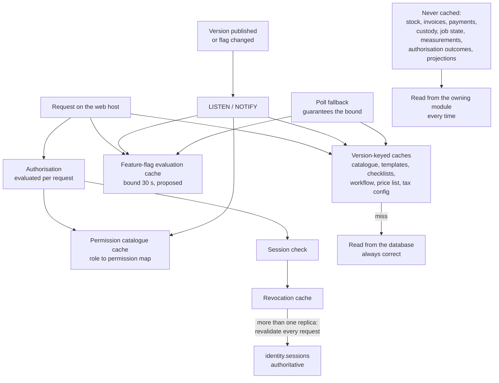

# ADR-0013 — Cache only in process, only with explicit invalidation, and never authoritatively

This record decides what may be cached, where, and for how long it may be wrong. The answer is: in-process
caches in the web host for the published catalogue, price and tax versions, workflow definitions, the permission
catalogue, feature-flag evaluation and session revocation — each with an explicit invalidation path and a stated
staleness bound — and no distributed cache in the baseline. No cache is ever authoritative for money, stock,
custody, workflow state or an authorisation decision. Every session tempted to add a cache must read this record.

| Field | Value |
| --- | --- |
| **Status** | Accepted — 2026-09-04 |
| **Deciders** | Technical reviewer |
| **Consulted** | Roadmap issue #1; epics #2 and #3; assumption A5 (memory budget) |
| **Informed** | Every backend implementing session; security review (#56b) |
| **Plan decision** | D21 |
| **Plan sections** | 2.2 (nothing derived is authoritative), 3 (D21), 4.4 (feature flags, session revocation, connection budget), 4.6 (client-side caching in the service worker) |
| **Issues affected** | #18 (this record), #21 (flag evaluation and propagation), #23 (session revocation), #24 (permission evaluation), #27 and #29 (catalogue and template reads), #41 (price and tax version reads), #51 (service-worker caching), #59 (what changes with a second replica) |
| **Depends on open decision** | [`OD-02`](../prd/assumptions-and-open-decisions.md) — hosting model (plan Section 11 item 2), because a managed cache service may become cheap enough to change the baseline. [`OD-12`](../prd/assumptions-and-open-decisions.md) — authentication strategy and shared devices (plan Section 11 item 12), which affects how aggressively session state may be cached. Neither changes the rules below; both could change the *implementation* of the session-revocation cache |
| **Supersedes / superseded by** | None |

---

## 1. Context and problem statement

Some values are read on almost every request. Rendering the order-intake screen needs the published catalogue,
the service types, the measurement template and the design option groups. Pricing an estimate needs the price
list and the tax configuration. Authorising any request needs the permission catalogue and the caller's effective
permissions. Almost every code path consults a feature flag. Loading the workboard needs the workflow
definition.

Reading all of that from PostgreSQL every time is not free, and the budget is tight in a specific way: plan
Section 4.4 allocates 30 transactional connections to the web host out of 100 total, and assumption A5 budgets
the web host 0.5 GB of resident memory on a 16 GB machine that also runs PostgreSQL, object storage and a malware
scanner. So both the database round trips and the memory a cache would consume are constrained resources.

Caching this kind of data is normally uncontroversial. Here, two things make it delicate.

**Some of it is a security control.** A revoked session, a deactivated user and a removed permission must stop
working quickly. If those decisions are served from a cache with an unbounded lifetime, then "log this person
out" becomes advisory. Plan Section 8's proposed targets state session revocation and user deactivation
effective on every host within 60 seconds at the 99th percentile (**proposed, to be confirmed** by issue #19),
which is a bound a cache must respect, not a hope.

**Some of it decides money.** A price list or tax configuration served stale would produce an invoice at
yesterday's rate. That specific risk is already largely designed away —
[ADR-0009](0009-configurable-taxonomy-as-versioned-data.md) makes a published version immutable and records the
version on every calculation — but only if the cache is keyed by version rather than by concept.

There is also a deployment fact that decides the shape of the answer. The baseline of
[ADR-0010](0010-deployment-portability.md) is one web container and one worker container on one machine.
In-process caching in that topology has exactly one instance to keep coherent. Add a second web replica and every
propagation bound suddenly has to hold across processes, which is a genuinely different problem.

**The question:** what may be cached, keyed how, invalidated by what, and within what staleness bound — such that
no cache can make an authorisation decision wrong, an invoice wrong, or a revocation slow?

## 2. Decision drivers

| # | Driver | Why it matters here |
| --- | --- | --- |
| D1 | No cache is ever authoritative | Plan Section 2.2's rule about derived data applies to caches as much as to projections |
| D2 | Security decisions have a hard propagation bound | Revocation and deactivation are controls; "eventually" is not a specification |
| D3 | Money is never priced from a stale value | An invoice must reflect the configuration version it records |
| D4 | Invalidation must be explicit and traceable | Time-to-live alone hides bugs: a wrong value simply expires and nobody learns why it was wrong |
| D5 | Operable in the baseline topology | One web container, one worker, one machine, no additional service |
| D6 | Memory-bounded | The web host has roughly 0.5 GB of resident memory in assumption A5; an unbounded cache is an outage |
| D7 | A cache miss must always be correct | Correctness never depends on a cache being warm, present or reachable |
| D8 | A second replica must not silently break a bound | Adding a replica must have a stated, enforced consequence, not a quiet regression |

## 3. Considered options

1. **In-process caches with explicit event-driven invalidation and documented staleness bounds; no distributed
   cache in the baseline** (chosen)
2. **A distributed cache — Redis or Valkey — from day one**
3. **No caching at all**: read PostgreSQL for every value
4. **HTTP caching at the reverse proxy and in the client** for reference data

### 3.1 Option 1 — In-process caches with explicit invalidation (chosen)

`IMemoryCache`-style caches inside the web host, each with a declared key strategy, a declared invalidation
trigger, a declared staleness bound and a size limit. Immutable published versions are cached by version
identifier, so the key changes when the value does. Mutable-but-bounded values — feature flags, session
revocation — are invalidated by a `LISTEN`/`NOTIFY` signal with a documented propagation bound and a poll
fallback. Nothing authoritative is cached at all.

- Good, because it needs no new infrastructure, which matters on the single machine of
  [ADR-0010](0010-deployment-portability.md) with no platform team.
- Good, because a version-keyed cache of an immutable value cannot serve a wrong answer: a new published version
  is a new key, so the worst case is a cold read, not a stale price.
- Good, because in-process lookups are nanoseconds, which is where the latency benefit actually is; a network
  round trip to a cache service is the same order as the PostgreSQL query it replaces for small values.
- Good, because explicit invalidation, driven by the publication events of
  [ADR-0009](0009-configurable-taxonomy-as-versioned-data.md), makes staleness a bounded and testable property
  rather than a guess about how long is safe.
- Good, because the security-sensitive caches keep hard bounds: flag propagation within 30 seconds
  (**proposed, to be confirmed** by issue #19) and session revocation revalidated per request whenever more than
  one web replica runs.
- Bad, because it does not survive a restart, so every deployment starts cold and the first requests are slower.
- Bad, because it multiplies by replica count: two web containers hold two copies and can disagree for up to the
  propagation bound.
- Bad, because a `LISTEN`/`NOTIFY` signal is lost if the connection drops, so the poll fallback is what actually
  guarantees the bound — and that fallback must be tested, not assumed.
- Bad, because "add a small cache here" is an easy, unreviewed decision, and unreviewed caches are how
  authoritative data ends up cached by accident.

### 3.2 Option 2 — A distributed cache from day one

Redis or Valkey, shared by the web host and the worker, holding catalogue values, flag evaluations, session
revocation state and rate-limit counters.

- Good, because there is one copy, so coherence across replicas is solved rather than bounded — the direct answer
  to D8.
- Good, because it survives application restarts, so deployments do not start cold.
- Good, because it would also serve rate-limit counters and coordination primitives that currently use the
  database, which becomes genuinely valuable at more than one replica.
- Good, because eviction, expiry and memory limits are built in and observable.
- Bad, because it is another always-on component to deploy, secure, monitor, back up and patch, on a machine that
  assumption A5 has already fully budgeted — the same objection [ADR-0008](0008-transactional-outbox-and-workers.md)
  makes to a broker.
- Bad, because it adds a failure mode with no current benefit: with one web replica, it replaces a nanosecond
  in-process lookup with a network round trip and a dependency that can be down.
- Bad, because a shared cache holding session and permission state is a security surface — its own credentials,
  its own network exposure, its own data at rest — for data that is currently in PostgreSQL behind existing
  controls.
- Bad, because it invites caching more than it should: once a fast shared store exists, caching an authoritative
  balance stops feeling wrong.

### 3.3 Option 3 — No caching at all

Every value read from PostgreSQL on every request, relying on indexes, the buffer cache and prepared statements.

- Good, because it is unambiguously correct: there is no staleness, no invalidation, no propagation bound and no
  cache-coherence class of bug.
- Good, because it is the least code, and it makes revocation and deactivation immediate by construction.
- Good, because PostgreSQL's own buffer cache already makes these small, hot reads cheap, so the benefit of an
  application cache is smaller than intuition suggests.
- Bad, because it spends connections from a budget of 30 on the web host: rendering one intake screen would make
  several round trips for values that changed last month.
- Bad, because permission and flag evaluation happen on effectively every request, including the ones that then
  do real work, so the fixed cost is paid everywhere.
- Bad, because it makes the per-request latency depend on database load, so a heavy report or a vacuum shows up
  as slow authorisation at the counter.
- Bad, because it is fragile in the wrong direction: the first person who notices will add an unreviewed cache,
  and this record exists partly to give them a sanctioned way to do it.

### 3.4 Option 4 — HTTP caching at the reverse proxy and in the client

`Cache-Control` on reference endpoints, cached by the reverse proxy and by the client, including the service
worker's stale-while-revalidate strategy.

- Good, because it removes work from the application entirely for genuinely public, non-sensitive reference data.
- Good, because the progressive web application already does a bounded version of this: precached versioned
  assets and stale-while-revalidate for an explicit allowlist of non-sensitive reference endpoints.
- Good, because it costs nothing to operate — the proxy is already there.
- Bad, because almost nothing here is non-sensitive. Catalogue availability is branch-scoped, permissions are
  per-principal, and plan Section 4.6 forbids caching protected responses at all.
- Bad, because a proxy cache has no way to be invalidated by a publication event, so its staleness is
  time-based — exactly what D4 rejects.
- Bad, because it cannot help authorisation or flag evaluation, which are the highest-frequency reads.
- Bad, because a caching mistake here leaks one principal's data to another, which is a different severity from a
  stale price.

### 3.5 Comparison

| Driver | In-process with explicit invalidation | Distributed cache | No caching | HTTP and proxy caching |
| --- | --- | --- | --- | --- |
| D1 Never authoritative | Enforced by the permitted list | Enforced by discipline only | Trivially | Not applicable |
| D2 Hard propagation bound | Stated per cache, with a poll fallback | Immediate across replicas | Immediate | Time-based only |
| D3 No stale pricing | Version-keyed immutable values | Same, plus coherence | Trivially | Not usable |
| D4 Explicit invalidation | Publication events plus notify | Same, centralised | Not applicable | No |
| D5 Operable in the baseline | Yes, nothing new | No, a new component | Yes | Yes |
| D6 Memory-bounded | Size limits per cache, per replica | Bounded centrally | Not applicable | Proxy-managed |
| D7 Miss is always correct | Yes | Yes | Not applicable | Yes |
| D8 Second replica safe | Bound holds; revocation revalidated per request | Yes, best | Yes | Yes |
| Latency benefit | Highest for small hot values | Network round trip | None | Only for public data |
| New failure mode | None | Yes | None | Stale or mis-scoped responses |

## 4. Decision outcome

**Chosen option: in-process caches with explicit invalidation and documented staleness bounds, and no
distributed cache in the baseline.** It takes the latency benefit where it is real — small, hot, mostly
immutable values — without adding a component to a machine that has no room for one, and it makes the two
security-sensitive cases (flags and revocation) bounded rather than indefinite. Option 2 is the right answer the
day a second web replica exists, and Section 8 says so explicitly.

### 4.1 What may be cached

This list is exhaustive. A cache not listed here needs an addition to this record.

| Cache | Key | Invalidation | Staleness bound | Notes |
| --- | --- | --- | --- | --- |
| Published catalogue version — categories, service types, design option groups and rules | Catalogue version identifier | Not needed for a given key; `CatalogVersionPublished` refreshes "which version is current" | The **current-version pointer** refreshes within the propagation bound; the version's *content* can never be stale, because it is immutable | The single most valuable cache; see [ADR-0009](0009-configurable-taxonomy-as-versioned-data.md) |
| Measurement template versions | Template version identifier | As above | As above | Content immutable |
| Quality-control checklist versions | Checklist version identifier | As above | As above | Content immutable |
| Workflow definition versions | Definition version identifier | As above | As above | A running job uses its pinned version |
| Price list and tax configuration versions | Version identifier | Publication event for the concept | Content immutable; the current-version pointer within the propagation bound | The calculation records the version it used, so an invoice is reproducible |
| Feature-flag evaluation | Flag key, scope (organisation or branch), and the evaluation inputs | `FeatureFlagChanged` over `LISTEN`/`NOTIFY`, with a poll fallback | **30 seconds** (plan D21; **proposed, to be confirmed** by issue #19) | Safe default is off; every evaluation is auditable |
| Permission catalogue and role-to-permission map | Catalogue version | Role or permission change event | Propagation bound | *Which* permissions a role holds. Not the caller's effective set |
| Session validity and revocation | Session identifier | `identity.sessions` is authoritative; the cache is a negative-and-positive check in front of it | **Revalidated against the database per request whenever more than one web replica runs.** Target: revocation and deactivation effective on every host within 60 seconds at the 99th percentile (**proposed, to be confirmed** by issue #19) | The one cache whose rules tighten rather than relax under scale-out |
| Branch metadata — code, timezone, working calendar | Branch identifier plus a version | `BranchCreated`, `BranchCalendarChanged` | Propagation bound | Feeds due dates and report cut-offs |
| Static assets in the client | Content hash in the file name | New deployment; update prompt driven by `GET /api/version` | Until the update prompt is accepted | Service worker; never caches protected responses |
| Non-sensitive reference endpoints in the client | Endpoint plus parameters | Stale-while-revalidate on an explicit allowlist | One revalidation cycle | Allowlist only; plan Section 4.6 |

### 4.2 What must never be cached

| Never cached | Why |
| --- | --- |
| Stock balances, reservations and valuations | Authoritative; a stale balance oversubscribes material |
| Invoice totals, payment allocations, outstanding balances, dispatch eligibility | Authoritative; money and the dispatch gate |
| Custody state, scan history, delivery authorisations | Authoritative; a stale custody state authorises the wrong handover |
| Garment job state, phase, assignment, quality-control result | Authoritative workflow state |
| Measurement values | Authoritative, and personal |
| A principal's *effective* permission set as a durable decision, or any authorisation outcome | Evaluated per request. A denial is never cached, and a grant is never cached beyond the request |
| Media bytes outside the authorised streaming path | Every media request is re-authorised ([ADR-0005](0005-object-storage-authorised-delivery.md)) |
| Any personal data in a shared or client-side cache | Privacy and the response-caching rules of plan Section 4.6 |
| Reporting projections | Already derived; caching derived data over derived data hides freshness ([ADR-0011](0011-reporting-read-models.md)) |

### 4.3 The rules every permitted cache obeys

1. **A miss is always correct.** Behaviour with a cold, disabled or failed cache is identical apart from latency,
   and there is a test that runs the journey with caching disabled.
2. **Prefer an immutable key over an expiry.** Where a value has a version, cache by version. Only the pointer to
   "the current version" needs invalidating, and it is small.
3. **Invalidation is explicit and event-driven**, carried by `LISTEN`/`NOTIFY` and backed by a poll fallback so a
   dropped connection costs seconds, not correctness. A time-to-live is a backstop, never the primary mechanism.
4. **Every cache declares a size limit and an eviction policy**, sized against the web host's memory budget in
   assumption A5, and exports hit rate, size and eviction count as metrics.
5. **Every cache declares its staleness bound in this record.** A bound that cannot be stated is a cache that
   must not exist.
6. **Nothing authoritative is cached**, per Section 4.2. This is the rule that does not bend.
7. **Negative caching of authorisation is forbidden.** A denial is recomputed every time.
8. **A second web replica requires the bounds to be re-verified** before it is deployed, alongside recomputing
   the connection budget ([ADR-0010](0010-deployment-portability.md)).

### 4.4 What changes when a second replica appears

| Concern | Baseline (one web replica) | With two or more replicas |
| --- | --- | --- |
| Catalogue and version content | In process, version-keyed | Unchanged — immutable content cannot diverge |
| Current-version pointer | Refreshed by notify within the bound | Unchanged; each replica refreshes independently within the bound |
| Feature flags | Notify plus poll, bound 30 seconds (**proposed**) | Unchanged bound; each replica must meet it independently, and the bound is measured per replica |
| Session revocation | Cached check in front of `identity.sessions` | **Revalidated per request** against the database, per plan Section 4.4 |
| Rate-limit counters | Per process | Must move to a shared store, or the effective limit multiplies by replica count — a reason to introduce Option 2 |
| Introduction of a distributed cache | Not present | Permitted, and at that point flags, revocation and rate limits are the first things to move, keeping the same bounds |

## 5. Consequences

### 5.1 Positive

| Consequence | Who feels it |
| --- | --- |
| Hot reads cost nanoseconds instead of a database round trip, so screens open quickly and connections stay free for real work | Reception and Tailor Master at the counter and in the workshop |
| A cached price or template can never be wrong, because immutable versions are keyed by version | Cashier, the accountant, and anyone reconciling an invoice |
| Revocation and deactivation stay controls with a stated bound rather than best-effort | Security review (#56b); the Owner disabling an account |
| Feature-flag changes propagate within a stated bound, so switching an adapter off is a real emergency lever | Whoever holds operations ownership under OD-15 |
| No cache service to deploy, secure, patch or monitor in the baseline | The business owner; the machine's memory budget |
| The permitted list makes "should I cache this?" a two-minute question with a written answer | Every backend session |

### 5.2 Negative

| Consequence | Who feels it | How it is mitigated or where it is handled |
| --- | --- | --- |
| Every deployment starts with a cold cache, so the first requests after a release are slower | Whoever is using the system at that moment | Values are small and refill in the first requests; releases are scheduled outside counter hours; the interruption already exists from the container swap ([ADR-0010](0010-deployment-portability.md)) |
| Two replicas can disagree for up to the propagation bound | A user whose flag or role just changed | The bound is stated, measured and tested; session revocation switches to per-request revalidation rather than relying on the bound |
| A lost `LISTEN`/`NOTIFY` signal delays invalidation to the poll interval | Latency of a change taking effect | The poll fallback is the guarantee and the notify is the optimisation, mirroring [ADR-0008](0008-transactional-outbox-and-workers.md); a test asserts the bound holds with notifications suppressed |
| In-process caches consume the web host's limited memory | The machine, under load | Size limits per cache, eviction metrics, and a memory budget from assumption A5; a growth alert |
| Cache-invalidation bugs are silent by nature | Everyone, potentially | The permitted list is short and mostly immutable-keyed; bounds are tested; the caching-disabled journey test catches correctness dependencies |
| Rate limiting is per process, so the effective limit scales with replica count | Security posture, if a replica is added carelessly | Named explicitly in Section 4.4 as a prerequisite for scale-out, alongside the connection budget |
| No architecture rule enforces the permitted list today | Reviewers | **Open — recorded 2026-09-04, owner: technical reviewer with issue #21.** A proposed architecture rule would assert that cache abstractions appear only in sanctioned files and never in a `Domain` project, added to [`../architecture/architecture-rules.md`](../architecture/architecture-rules.md) with the next identifier in that document's sequence. Until it exists, the control is review against Section 4.1 |

## 6. Confirmation

| Check | Mechanism | Where |
| --- | --- | --- |
| Every journey is correct with caching disabled | An integration-test run with caches switched off, asserting identical outcomes | Issue #21 |
| A published version is visible within the propagation bound | Integration test publishing a version and asserting visibility inside the bound, with notifications suppressed so the poll fallback is what is measured | Issues #21, #27 |
| A feature-flag change propagates within 30 seconds (**proposed, to be confirmed**) | Timed integration test plus the evaluation audit | Issues #21, #25 |
| A revoked session stops working within the stated bound, and immediately with more than one replica | Authentication tests for revocation, logout-all and role change; per-request revalidation asserted in the multi-replica configuration | Issue #23 |
| An authorisation denial is never served from a cache | Authorisation matrix tests including a permission removed mid-session | Issue #24 |
| No authoritative value is cached | Review against Section 4.2 on every pull request adding a cache, plus the proposed architecture rule in Section 5.2 | Plan Section 5.1 item 8 |
| Caches stay within the memory budget | Size limits with exported cache size, hit rate and eviction metrics; alert on sustained eviction | Issues #21, #58 |
| The client never caches a protected response | Cache inspection test over the service-worker registration | Issue #51 |
| Scale-out prerequisites are honoured | Start-up validation of the connection budget, and the documented replica checklist | Issues #21, #59 |

## 7. Diagram

## 8. Revisiting this decision

| Trigger | What it would mean |
| --- | --- |
| A second web replica is deployed | Introduce a distributed cache (Option 2). Rate-limit counters move first, then flag propagation and session revocation, keeping the bounds in Section 4.1. Recompute the connection budget in the same change |
| The hosting model chosen under OD-02 includes a managed cache at negligible cost and effort | Re-cost Option 2. Managed removes most of the operational objection, but nothing about Section 4.2 changes |
| Measured cache hit rates show a cache is not earning its complexity | Remove it. A cache with no measured benefit is pure risk |
| Issue #19 sets a revocation bound the current design cannot meet | Tighten to per-request revalidation everywhere, or move revocation state to a shared store. The bound wins over the cache |
| OD-12 settles on shared counter devices with trusted-device cookies | Re-examine what session state may be cached at all on a shared device, and record the outcome here |

Nothing here is a reason to revisit on its own: a cold cache after a deployment, a flag taking twenty seconds to
propagate, or a cache miss on the first request of the day. Those are the designed behaviour.

## 9. Links

| Document | Why it is relevant |
| --- | --- |
| [`../IMPLEMENTATION_PLAN.md`](../IMPLEMENTATION_PLAN.md) | Sections 2.2, 3 (D21), 4.4, 4.6 |
| [`../platform/feature-flags.md`](../platform/feature-flags.md) | The propagation bound and the evaluation audit in operational detail |
| [`../platform/database.md`](../platform/database.md) | The connection budget these caches protect |
| [`../architecture/architecture-rules.md`](../architecture/architecture-rules.md) | Where the proposed cache-usage rule in Section 5.2 would be added |
| [`../architecture/invariants.md`](../architecture/invariants.md) | The authoritative state that Section 4.2 forbids caching |
| [`0009-configurable-taxonomy-as-versioned-data.md`](0009-configurable-taxonomy-as-versioned-data.md) | Why an immutable published version makes a version-keyed cache safe |
| [`0008-transactional-outbox-and-workers.md`](0008-transactional-outbox-and-workers.md) | The `LISTEN`/`NOTIFY` plus poll-fallback pattern this record reuses |
| [`0006-bff-cookie-session.md`](0006-bff-cookie-session.md) | Session tickets, rotation and the revocation requirement |
| [`0010-deployment-portability.md`](0010-deployment-portability.md) | The single-replica baseline and what scaling out requires first |
| [`0011-reporting-read-models.md`](0011-reporting-read-models.md) | Why projections are not cached on top of being derived |
| [`0005-object-storage-authorised-delivery.md`](0005-object-storage-authorised-delivery.md) | Why media is re-authorised on every request rather than cached |
| [`../prd/assumptions-and-open-decisions.md`](../prd/assumptions-and-open-decisions.md) | OD-02 (hosting model), OD-12 (authentication and shared devices), assumption A5 (memory budget) |
