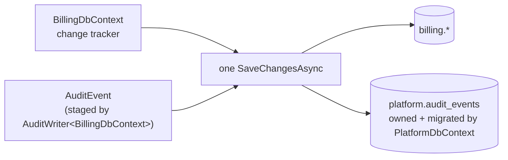

# ADR-0015 — Map the shared audit ledger into a module's own context, by name, rather than relay or share a transaction

This record decides how a module enlists its own audit entry in the same database transaction as the mutation it
describes, closing a gap issue #179 found in G-2. The chosen shape is a second, literal mapping of the single
table `platform.audit_events` into the module's own `DbContext`, through one shared, reviewed helper —
`AuditEventMapping.Configure` — never migrated by that context and reachable only through a module's own
`AuditWriter<TContext>`-based port. ARCH-005 is amended with exactly this one named exception. Every session
adding a module's own audit-writer port, or reviewing a pull request that touches `AuditEventMapping`,
`AuditWriter<TContext>` or ARCH-005, must read this record.

| Field | Value |
| --- | --- |
| **Status** | Accepted — 2026-09-12 |
| **Deciders** | Technical reviewer |
| **Consulted** | [`architecture-rules.md`](../architecture/architecture-rules.md) ARCH-005; [`module-ownership.md`](../architecture/module-ownership.md); [`invariants.md`](../architecture/invariants.md) G-2 and CI-08; [`0004-postgresql-schema-per-module.md`](0004-postgresql-schema-per-module.md); [`0008-transactional-outbox-and-workers.md`](0008-transactional-outbox-and-workers.md) |
| **Informed** | Every session giving a module its own audit-writer port; the reviewer of PR #218 |
| **Plan decision** | D3, read together with D6 |
| **Plan sections** | 5.1 (audit coverage), 5.2 (append-only tables) |
| **Issues affected** | #179 (this record's trigger), #21 (original audit chain and outbox platform), #77 (the outbox precedent this record distinguishes itself from) |
| **Depends on open decision** | None |
| **Supersedes / superseded by** | None. It fills in a mechanism [`ADR-0004`](0004-postgresql-schema-per-module.md) Section 1 left open ("two `DbContext` instances in one transaction... handled once in `Platform.Persistence`... issue #21") rather than replacing anything ADR-0004 decided |

---

## 1. Context and problem statement

G-2 requires the audit event for a mutation to be written in the same transaction as the mutation. Until issue
#179, `IAuditWriter` wrote through `PlatformDbContext` on its own connection, so a handler's business change and
its audit entry were always two separate `SaveChangesAsync` calls: a crash between them could leave a committed
mutation with no audit row, or an audit row for a mutation that never committed. Four Billing handlers
(`CashierSessionHandler.OpenAsync`/`CloseAsync`, `PaymentHandler.RecordAsync`/`AllocateManuallyAsync`,
`RefundHandler.ReverseAsync`/`RefundAsync`, `ReconciliationHandler.ApproveAsync`) hit exactly this window.

ADR-0004 already named this exact crossing — "invoice posting writing an audit event... span[s] module schemas" —
and deliberately left its mechanism undecided: "two `DbContext` instances in one transaction need care with
connection sharing... handled once in `Platform.Persistence`, with tests for the confirmation participant hook and
the audit interceptor (issue #21)". That interceptor was never built; #179 is the first time a module actually
needed the guarantee, and found the gap.

The fix landed as `AuditEventMapping.Configure(modelBuilder)`, called from `BillingDbContext.OnModelCreating` in
addition to `PlatformDbContext`'s own, so `AuditWriter<BillingDbContext>` can add an `AuditEvent` to the context's
own change tracker and let the context's own `SaveChangesAsync` carry it. PR #218's review found that ARCH-005 —
"every schema declared in a module's `Infrastructure` project equals that module's own schema name... and no
other" — has no exception for this, and that the test enforcing it, `SourceConventionTests
.Arch005_ModulePersistenceDeclaresOnlyItsOwnSchema`, only reads `HasDefaultSchema` declarations, so it did not
even see the new mapping. Two respectable-looking alternatives exist. **The question:** does ARCH-005 gain a
narrow, named exception for this one table and this one call site, or does the design change instead?

## 2. Decision drivers

| # | Driver | Why it matters here |
| --- | --- | --- |
| D1 | G-2 is preserved exactly | "Written in the same transaction" must mean the canonical `platform.audit_events` row, not a proxy for it — the whole point of #179 |
| D2 | CI-08's chain stays singular | One hash chain, one `prev_hash` sequence, one hourly verification job — not one chain per module |
| D3 | ARCH-005's hazard is not reopened | Ownership, migration rights and write privilege on a shared table must not spread to a second owner |
| D4 | Proportionate to the defect being fixed | A review-comment fix closes a rule/detector gap; it does not rebuild working, tested production code to a materially different shape |
| D5 | The exception is checked, not just documented | A future reviewer, and the test suite, must be able to tell this exception from any other cross-schema attempt |

## 3. Considered options

1. Map `platform.audit_events` a second time into the module's own context, by name, through one shared helper —
   chosen
2. Give each module its own local `audit_events` (or reuse its own `outbox_messages`) and relay it into the
   canonical ledger asynchronously
3. Share one database transaction across the module's own context and a separate `PlatformDbContext`, exactly as
   ADR-0004 originally sketched ("the audit interceptor")

### 3.1 Option 1 — Map the shared table into the module's own context by name (chosen)

`AuditEventMapping.Configure` is the one place `AuditEvent` is configured, called from every context that needs to
track a row on its own change tracker; `ToTable(..., t => t.ExcludeFromMigrations())` keeps every caller except
`PlatformDbContext` from ever creating or altering the physical table, and the application role's grants are
unchanged. ARCH-005 gains exactly one named exception — schema `platform`, table `audit_events`, call site
`AuditEventMapping.Configure` — checked by an extended detector rather than switched off.

- Good, because the audit row commits in the literal same `SaveChangesAsync` call as the business row: the
  strongest form of D1, stronger than a shared ambient transaction across two round trips.
- Good, because it costs no new migration, no new table, no new background job, and no change to any of the four
  handlers #179 already fixed — D4.
- Good, because the hash chain and its sequence stay exactly what they are today: one table, one trigger, one
  chain — D2.
- Bad, because ARCH-005's assertion is no longer "no exceptions among the eleven modules", and every future reader
  of the rule has to learn the one named case — mitigated by naming it in the assertion itself, not only in prose.
- Bad, because the detector's precision depends on recognising a specific call by name in source text, which a
  determined rewrite could evade — the same limitation every other `SourceScanner`-based rule in this suite
  already accepts (ARCH-014, ARCH-015, ARCH-016, ARCH-020).

### 3.2 Option 2 — Per-module local table plus a relay into the canonical ledger

Modelled on the outbox fix (issue #77): each module keeps its own `audit_events` (or stages an event on its
existing `outbox_messages`), and a worker-side relay, mirroring `OutboxDispatcher`, moves each staged entry into
`platform.audit_events` asynchronously.

- Good, because it never maps a foreign schema into a module context at all: ARCH-005 needs no exception, and the
  detector needs no extension.
- Good, because it reuses infrastructure (`ModuleEventPublisher<TContext>`, `OutboxDispatcher`) this codebase
  already trusts for exactly this class of atomicity defect.
- Bad, because it does not actually deliver D1: the canonical ledger row is no longer written in the mutation's
  own transaction, only a local proxy is. G-2 would have to be reworded from "written in the same transaction" to
  "queued for eventual, at-least-once delivery" — a materially weaker guarantee than the one #179 was chartered to
  establish, for the specific record whose purpose is tamper-evident, verifiable timeliness.
- Bad, because the outbox precedent it claims to follow is not actually analogous: `outbox_messages` is duplicated
  **per module schema** precisely because each module's events have no single, ordered, hash-chained identity
  across modules to preserve. `audit_events` does — that is what CI-08 checks — so duplicating the table would
  either give every module its own chain (breaking D2) or require the relay to be the sole writer of the
  canonical chain, which makes the "local" table nothing more than a bespoke second outbox for one event type.
- Bad, because it is materially more to build for a review-comment fix than D4 tolerates: a new migration per
  module, a new relay job with its own `[WorkerJob]` declaration (ARCH-021), and a rewrite of
  `AuditTransactionAtomicityTests` to assert a weaker property than it asserts today.

### 3.3 Option 3 — Share one transaction across two `DbContext` instances

Build the "audit interceptor" ADR-0004 sketched: the caller's own context opens the transaction, hands its
underlying `DbTransaction` to a separate `PlatformDbContext` instance via `Database.UseTransaction`, and both
contexts save into it before it commits. `BillingDbContext` would then map only `billing`, exactly as ARCH-005
already requires with no exception at all.

- Good, because it is the option ARCH-005 needs no amendment for: each context maps only its own schema, and D1 is
  fully met — the canonical row commits with the mutation, on two round trips inside one transaction.
- Good, because it is the mechanism ADR-0004 already anticipated and costed as a shared concern of
  `Platform.Persistence`, not a per-module one.
- Bad, because it was scoped once already (issue #21) and not delivered — #179 is the record of that gap, not
  evidence the remaining work is small. Connection- and transaction-sharing across `DbContext` instances is
  sensitive to EF Core's execution strategy (retrying strategies reject a user-managed transaction unless every
  operation runs inside a matching retry wrapper), to Npgsql connection lifetime, and to who owns disposal — the
  kind of subtlety a review-comment fix should not take on, per D4.
- Bad, because it changes the call shape of the four already-fixed handlers again — from "stage on the change
  tracker, then one save" to "open a transaction, save on two contexts, then commit" — a second reorder of working,
  tested code in the same area within one issue's lifetime.
- Left open for a future record if a module ever needs to enlist a *different* module's table this way; this
  record does not rule it out, it only declines to build it now for a single, already-solved table.

### 3.4 Comparison

| Driver | Option 1 (chosen) | Option 2 (relay) | Option 3 (shared transaction) |
| --- | --- | --- | --- |
| D1 same-transaction ledger row | Met, strongest form | Not met — eventual | Met |
| D2 one chain | Met | At risk | Met |
| D3 ownership hazard | Contained by name | Contained | Contained |
| D4 proportionate | Yes — no production change | No — new table, migration, job per module | No — rebuilds a known-hard mechanism |
| D5 checkable exception | Yes — detector extended | N/A (no exception needed, but wrong guarantee) | N/A (no exception needed) |

## 4. Decision outcome

Chosen option: **Option 1**. `AuditEventMapping.Configure(modelBuilder)` stays the one, shared, reviewed way a
module's own `Infrastructure` project may map `platform.audit_events` a second time, `ExcludeFromMigrations()` on
every context but `PlatformDbContext`. ARCH-005's assertion is amended to name this one exception explicitly —
table `audit_events`, schema `platform`, call site `AuditEventMapping.Configure`, nothing else — and
`SourceConventionTests.Arch005_ModulePersistenceDeclaresOnlyItsOwnSchema` is extended to check an explicit
`ToTable(name, schema)` overload against the module's own schema, recognising only that one named call as the
exception, with a negative control (`NegativeControlTests.Arch005DetectorCatchesAnUnsanctionedForeignSchemaMapping`)
proving the extended check still fails an unnamed violation. No production code changes: the mechanism `BillingDbContext`,
`AuditWriter<TContext>` and `IBillingAuditWriter` already use is the one this record ratifies.

A module other than Billing adopting an `AuditWriter<TContext>`-based port follows the identical shape — its own
port interface, its own binding, the same `AuditEventMapping.Configure` call — and needs no further ADR, because
this record already covers the general case, not only Billing's instance of it.

## 5. Consequences

### 5.1 Positive

| Consequence | Who feels it |
| --- | --- |
| Every audited Billing mutation and its ledger entry commit or roll back together, verified by `AuditTransactionAtomicityTests` | Cashiers, the accountant, an auditor reading the chain |
| ARCH-005 states the truth about the codebase instead of a truth a code comment argued for outside the catalogue | Every future reviewer of a module's `Infrastructure` project |
| No new table, migration, background job or handler reshuffle | This pull request's reviewer; whoever operates the worker |

### 5.2 Negative

| Consequence | Who feels it | How it is mitigated or where it is handled |
| --- | --- | --- |
| ARCH-005 is no longer exception-free; a reader has to learn the one named case | A future contributor reading the rule for the first time | Named in the assertion itself, in the allowed-exceptions row, and in this record — not left to a code comment alone |
| The detector's recognition of `AuditEventMapping.Configure` is a textual proxy, not proof the helper never changes what it maps | Whoever next edits `AuditEventMapping` | The helper's own remarks state the table it maps is fixed; a change there is a change to a single, well-known file and is exactly the kind of change ARCH-005's amendment and this record should be revisited for (Section 8) |
| A second module adopting this pattern adds a second call site the detector must also recognise as the same one exception, not a new one | Whoever reviews that module's pull request | The detector matches the call by name, not by module, so it already covers every future adopter without a further edit |

## 6. Confirmation

| Check | Mechanism | Where |
| --- | --- | --- |
| A module's own `Infrastructure` project maps no schema but its own, with the one named exception | `SourceConventionTests.Arch005_ModulePersistenceDeclaresOnlyItsOwnSchema` | `tests/Tailor360.ArchitectureTests/SourceConventionTests.cs` |
| The extended detector still fails an unnamed cross-schema mapping, and accepts only the exact named pair | `NegativeControlTests.Arch005DetectorCatchesAnUnsanctionedForeignSchemaMapping`, `NegativeControlTests.Arch005DetectorAcceptsOnlyTheNamedAuditEventMappingCall` | `tests/Tailor360.ArchitectureTests/NegativeControlTests.cs` |
| The audit row and the business row commit or roll back together | `AuditTransactionAtomicityTests` | `tests/Tailor360.IntegrationTests/Billing/AuditTransactionAtomicityTests.cs` |
| The physical table is created, altered and hash-chained only by `Tailor360.Platform.Persistence` | Migration review; `ExcludeFromMigrations()` on every other context | `src/Platform/Tailor360.Platform.Persistence/Auditing/AuditEventMapping.cs` |

## 7. Diagram

## 8. Revisiting this decision

If `AuditEventMapping` ever needs to map more than `audit_events`, or a second shared Platform table needs the
same treatment, this record and ARCH-005's exception both need a new pull request, not a quiet extension of the
detector's pattern. If the number of modules adopting an `AuditWriter<TContext>` port grows large enough that
`platform.audit_events` write contention becomes measurable, that is a capacity question for a new record — it
does not by itself argue for Option 2 or Option 3, both of which cost more than a locking or partitioning change
inside `Tailor360.Platform.Persistence` would.

## 9. Links

| Document | Why it is relevant |
| --- | --- |
| [`../architecture/architecture-rules.md`](../architecture/architecture-rules.md) | ARCH-005, amended by this record |
| [`../architecture/module-ownership.md`](../architecture/module-ownership.md) | The Platform section's description of the mapping, cross-referenced to this record |
| [`../architecture/invariants.md`](../architecture/invariants.md) | G-2, CI-08 |
| [`0004-postgresql-schema-per-module.md`](0004-postgresql-schema-per-module.md) | The crossing this record's mechanism resolves, and the interceptor option this record declines for now |
| [`0008-transactional-outbox-and-workers.md`](0008-transactional-outbox-and-workers.md) | Why `outbox_messages` is duplicated per module schema, and why `audit_events` is not treated the same way |
