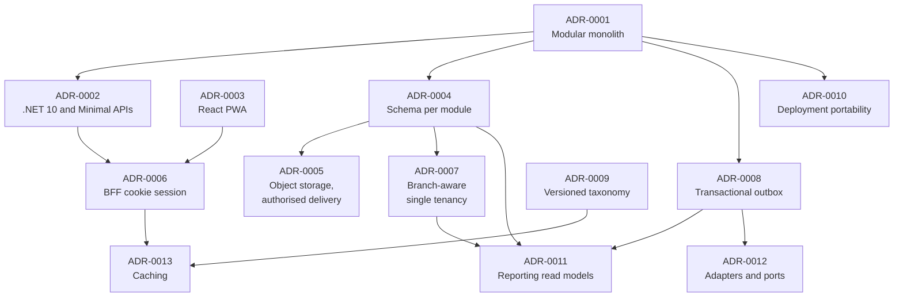

# Architecture decision records

This directory holds the architecture decision records for HyFib Tailor 360 — the decisions that shape the
system, each written down with the context that produced it, the options that were genuinely considered, and the
consequences the project agreed to live with. A record explains *why* the system is the way it is; the
[`../architecture/`](../architecture/) documents describe *what* it is, and
[`../IMPLEMENTATION_PLAN.md`](../IMPLEMENTATION_PLAN.md) describes how it gets built. When a statement in an
architecture document, an `ARCH-…` rule or a module README needs a reason, the reason lives here.

---

## 1. The records

Thirteen decision records, ADR-0001 to ADR-0013, were produced by issue #18 as the Wave 0 architecture baseline.
All thirteen are **Accepted**, dated 4 September 2026. Nine of them remain conditional on a business decision that
is still open — Section 5 names each one, its owner and what happens if it goes the other way. The table below
also lists ADR-0000, which is not a decision about the system but the decision about how decisions are written.

| # | Record | Decides | Status | Plan decision |
| --- | --- | --- | --- | --- |
| 0000 | [`0000-template.md`](0000-template.md) | The MADR structure, metadata block, statuses and quality bar every record below follows | Accepted — 2026-09-04 | — |
| 0001 | [`0001-modular-monolith.md`](0001-modular-monolith.md) | A modular monolith of two hosts sharing in-process module assemblies, with seven explicit criteria a module must meet before it may be extracted into a service | Accepted — 2026-09-04 | D1 (shape) |
| 0002 | [`0002-dotnet-10-minimal-apis.md`](0002-dotnet-10-minimal-apis.md) | .NET 10 long-term support with ASP.NET Core Minimal API route groups defined per module | Accepted — 2026-09-04, final once OD-01 is confirmed | D1 (platform) |
| 0003 | [`0003-react-typescript-pwa.md`](0003-react-typescript-pwa.md) | A React 19 and TypeScript installable progressive web application rather than native applications | Accepted — 2026-09-04 | D2 |
| 0004 | [`0004-postgresql-schema-per-module.md`](0004-postgresql-schema-per-module.md) | One PostgreSQL database, one schema and one `DbContext` per module, per-schema migration history | Accepted — 2026-09-04 | D3 |
| 0005 | [`0005-object-storage-authorised-delivery.md`](0005-object-storage-authorised-delivery.md) | Private S3-compatible storage delivered only by authorised streaming, never by public or pre-signed public links | Accepted — 2026-09-04 | D4, D16 |
| 0006 | [`0006-bff-cookie-session.md`](0006-bff-cookie-session.md) | A backend-for-frontend with `__Host-` prefixed cookie sessions, anti-forgery including at login, and `Origin` and `Sec-Fetch-Site` checks | Accepted — 2026-09-04 | D5 |
| 0007 | [`0007-branch-aware-single-tenancy.md`](0007-branch-aware-single-tenancy.md) | One organisation with branch scoping, and the costed checklist of what multi-tenancy would change | Accepted — 2026-09-04 | D7 |
| 0008 | [`0008-transactional-outbox-and-workers.md`](0008-transactional-outbox-and-workers.md) | Publishing facts through a per-module transactional outbox, with inbox deduplication, leases and a dedicated worker host running the side effects | Accepted — 2026-09-04 | D6, D12 |
| 0009 | [`0009-configurable-taxonomy-as-versioned-data.md`](0009-configurable-taxonomy-as-versioned-data.md) | Categories, templates, workflows, checklists, prices, taxes and policies as draft, published and retired versioned data rather than code, with snapshots protecting in-flight orders | Accepted — 2026-09-04 | D8 |
| 0010 | [`0010-deployment-portability.md`](0010-deployment-portability.md) | Shipping as portable container images with a Docker Compose baseline and a Kubernetes-ready path | Accepted — 2026-09-04 | D17, D12, D13, D18 |
| 0011 | [`0011-reporting-read-models.md`](0011-reporting-read-models.md) | Serving reports from rebuildable projections with checkpoints and reconciliation, never as the authoritative source of financial, stock, workflow or custody state | Accepted — 2026-09-04 | Plan 2.2, 4.3 |
| 0012 | [`0012-integration-ports-and-adapters.md`](0012-integration-ports-and-adapters.md) | Reaching external systems only through ports, with replaceable adapters confined to `Integration.Infrastructure` and a strict outbound policy | Accepted — 2026-09-04 | D20, D15, D16 |
| 0013 | [`0013-caching.md`](0013-caching.md) | Caching only in process, only with explicit invalidation, and never authoritatively | Accepted — 2026-09-04 | D21 |
| 0014 | [`0014-document-rendering-and-object-storage.md`](0014-document-rendering-and-object-storage.md) | QuestPDF behind `IPdfRenderer`, ZXing.Net behind `IBarcodeRenderer`, MinIO's client behind `IObjectStorage`, and a logging print queue until the print bridge | Proposed — 2026-09-12 | D15, D4 |
| 0015 | [`0015-shared-audit-ledger-mapped-into-module-contexts.md`](0015-shared-audit-ledger-mapped-into-module-contexts.md) | Mapping `platform.audit_events` a second time into a module's own `DbContext`, by name through `AuditEventMapping.Configure`, as ARCH-005's one named exception, rather than a per-module ledger relayed later or a shared transaction across two contexts | Accepted — 2026-09-12 | D3, D6 |

Records 0001 to 0007 and the template were issued in the first batch of issue #18; records 0008 to 0013 complete
the same issue and the same Wave 0 baseline. Record 0015 fills in a mechanism ADR-0004 left open rather than
completing that baseline. Every record listed here is in force except where its status says otherwise.

## 2. How the records relate

## 3. Which record answers which question

| If you are asking… | Read |
| --- | --- |
| Why is this not a set of microservices, and what would have to be true before it were? | [`0001-modular-monolith.md`](0001-modular-monolith.md), Sections 3 and 6 |
| Why .NET, and why Minimal APIs rather than controllers? | [`0002-dotnet-10-minimal-apis.md`](0002-dotnet-10-minimal-apis.md) |
| Why is there no app in the store, and how does scanning work on iOS? | [`0003-react-typescript-pwa.md`](0003-react-typescript-pwa.md) |
| Why can my module not just join to another module's table? | [`0004-postgresql-schema-per-module.md`](0004-postgresql-schema-per-module.md) and [`0001-modular-monolith.md`](0001-modular-monolith.md) |
| Why does the client never get an image URL? | [`0005-object-storage-authorised-delivery.md`](0005-object-storage-authorised-delivery.md) |
| Why is there no token in browser storage, and why is anti-forgery needed on login? | [`0006-bff-cookie-session.md`](0006-bff-cookie-session.md) |
| Why does every table carry an `organisation_id` that only ever holds one value? | [`0007-branch-aware-single-tenancy.md`](0007-branch-aware-single-tenancy.md), Sections 4 and 6 |
| Why does every module have its own outbox table? | [`0008-transactional-outbox-and-workers.md`](0008-transactional-outbox-and-workers.md) |
| Why can an administrator add a category without a deployment? | [`0009-configurable-taxonomy-as-versioned-data.md`](0009-configurable-taxonomy-as-versioned-data.md) |
| Why Docker Compose rather than Kubernetes at launch? | [`0010-deployment-portability.md`](0010-deployment-portability.md) |
| Why does a report never decide whether a garment may be dispatched? | [`0011-reporting-read-models.md`](0011-reporting-read-models.md) |
| Why is the payment gateway's software development kit referenced by only one project? | [`0012-integration-ports-and-adapters.md`](0012-integration-ports-and-adapters.md) |
| Why is there no cache in front of the invoice total? | [`0013-caching.md`](0013-caching.md) |

## 4. Writing a new record

| Step | What to do |
| --- | --- |
| 1 | Copy [`0000-template.md`](0000-template.md) to `NNNN-short-kebab-title.md` using the next unused number. Numbers are never re-used |
| 2 | Fill every row of the metadata table, including the plan decision, the issues affected and any open decision it depends on |
| 3 | Write at least three genuinely considered options with honest trade-offs. An option written only to be knocked down is worse than no option at all |
| 4 | State the negative consequences. A record with none has not been thought about |
| 5 | Say how compliance is confirmed: the `ARCH-…` rule, the test, the review step or the runbook check |
| 6 | Add the record to Section 1 of this file, and link it from every architecture document whose statements now rest on it |
| 7 | Open one pull request linked to the issue that raised the decision, approved by the technical reviewer — and by the business owner where there is a cost or a business consequence |

Superseding a record never rewrites it. The original text stays exactly as it was; only its status changes, a
link to the successor is added, and the successor explains what changed and why. This is the same rule the system
applies to posted invoices, stock-ledger entries and custody events.

## 5. Records that are still conditional

An accepted record may depend on a business decision that is still open. Where that is so, the record's metadata
names the open decision and its final section says what happens if the decision goes the other way. The open
decisions themselves live in [`../prd/assumptions-and-open-decisions.md`](../prd/assumptions-and-open-decisions.md)
and in Section 11 of [`../IMPLEMENTATION_PLAN.md`](../IMPLEMENTATION_PLAN.md).

| Record | Open decision | Owner | Needed by | Effect if it goes the other way |
| --- | --- | --- | --- | --- |
| ADR-0002 | OD-01 backend platform and build environment | Business owner with the technical reviewer | Before Wave 1 | Superseded, not amended, if a Node.js and TypeScript backend is chosen; ADR-0001, 0004, 0005, 0006 and 0007 survive largely unchanged |
| ADR-0003 | OD-07 device, browser and printer matrix | Business owner | Before the Wave 0 exit | Bounds what "supported" means; the client model is unaffected |
| ADR-0005 | OD-08 retention periods, and OD-02 for the storage product and cost band | Business owner, with the accountant for financial records | Before the Wave 1 exit | Fixes retention numbers and the concrete product; the authorised-delivery model is unaffected |
| ADR-0006 | OD-12 primary authentication strategy and devices | Business owner with the technical reviewer | Before Wave 1 | Federation would replace credential establishment only; the cookie session, revocation and step-up model are retained as an amendment |
| ADR-0007 | OD-06 branches at launch, with timezones, working calendars and GST registrations | Business owner | Before the Wave 1 exit | Fixes the seed data, not the model |
| ADR-0010 | OD-02 hosting model and indicative monthly budget; OD-14 telemetry backend | Business owner | Before the Wave 1 exit (OD-02); before Wave 5 (OD-14) | The Compose baseline and the container unit stand either way; the venue, infrastructure-as-code tooling, backup destination and whether a second machine is provisioned are filled in once chosen |
| ADR-0011 | OD-05 valuation method, rounding conventions and GST record retention; OD-08 retention periods | Business owner, co-signed by the accountant | Before Wave 3 for rounding, before Wave 4 for valuation | Decides what several published figures mean and how long an export lives, not how they are served |
| ADR-0012 | OD-03 providers; OD-04 the dispatch payment rule; OD-15 operations ownership and alert channel | Business owner | Before Wave 4 (OD-03, OD-04); before Wave 5 (OD-15) | Names the vendors and decides whether a doorstep payment adapter is needed at all; the port-and-adapter shape is unaffected |
| ADR-0013 | OD-02 hosting model; OD-12 authentication strategy and shared devices | Business owner with the technical reviewer | Before the Wave 1 exit (OD-02); before Wave 1 (OD-12) | Could change the implementation of the session-revocation cache; the rule that no cache is ever authoritative is unaffected |

## 6. Related documents

| Document | What it holds |
| --- | --- |
| [`../IMPLEMENTATION_PLAN.md`](../IMPLEMENTATION_PLAN.md) | Section 3 lists decisions D1 to D21; Section 4 is the target architecture; Section 11 lists the open business decisions |
| [`../architecture/context.md`](../architecture/context.md) | C4 level 1: people, external systems and the trust boundary |
| [`../architecture/container.md`](../architecture/container.md) | C4 level 2: hosts, database, object storage and their relationships |
| [`../architecture/components.md`](../architecture/components.md) | C4 level 3: module internals |
| [`../architecture/deployment.md`](../architecture/deployment.md) | How the containers are deployed and promoted |
| [`../architecture/module-ownership.md`](../architecture/module-ownership.md) | Who owns which schema, storage prefix, event and read contract |
| [`../architecture/invariants.md`](../architecture/invariants.md) | The guarantees the system must never break |
| [`../architecture/conventions.md`](../architecture/conventions.md) | Money, time, identifiers, concurrency, versioning and migration compatibility |
| [`../architecture/architecture-rules.md`](../architecture/architecture-rules.md) | The `ARCH-…` catalogue that enforces these decisions on every pull request |
| [`../prd/glossary.md`](../prd/glossary.md) | The vocabulary every record uses |
| [`../prd/assumptions-and-open-decisions.md`](../prd/assumptions-and-open-decisions.md) | Assumptions A1 to A5 and open decisions OD-01 to OD-15 |
