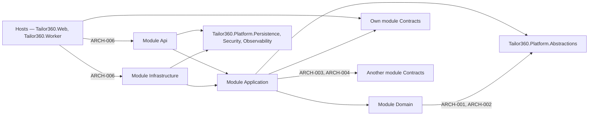
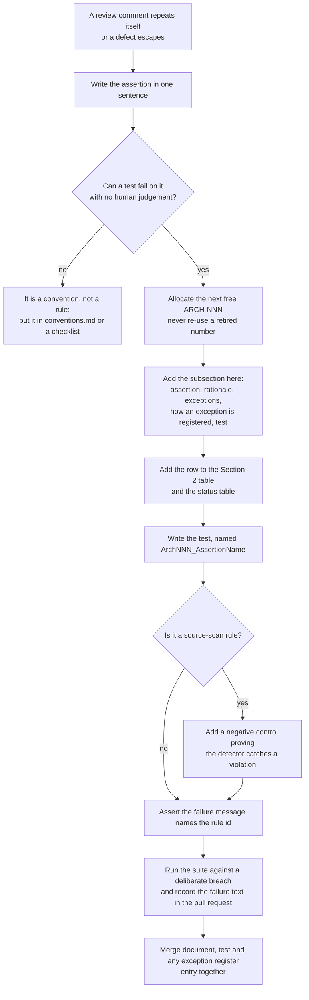

# Architecture rules — the `ARCH-…` catalogue

This document is the specification of every architecture rule that HyFib Tailor 360 enforces automatically. Each
rule has a stable identifier, one assertion a test can fail on, the reason the rule exists, the exceptions that are
allowed and exactly how an exception is registered, and the test class and test method that implement it in
`tests/Tailor360.ArchitectureTests`. It is the contract between the architecture documents and the test suite: the
boundaries stated in [`module-ownership.md`](module-ownership.md), the guarantees in [`invariants.md`](invariants.md)
and the pipeline in [`components.md`](components.md) are only real to the extent that a rule below fails when they
are broken. Nothing here overrides [`../IMPLEMENTATION_PLAN.md`](../IMPLEMENTATION_PLAN.md) Sections 4 and 5;
terminology follows [`../prd/glossary.md`](../prd/glossary.md).

---

## 1. How to read this catalogue

| Element | What it means |
| --- | --- |
| **Identifier** | `ARCH-NNN`, allocated once and never re-used. A retired rule keeps its number and is marked retired; a changed rule keeps its number and records the change in the pull request that alters it. |
| **Assertion** | One sentence, written so that a test either passes or fails on it. If an assertion needs the word "should", it is not a rule yet — it belongs in [`conventions.md`](conventions.md) or a review checklist. |
| **Rationale** | Why the codebase is worse without the rule. A rule with no failure mode behind it is deleted rather than kept. |
| **Allowed exceptions** | The complete, closed list. "None" means none, and a pull request that needs one must change this document. |
| **How an exception is registered** | The mechanism: an entry in a named allowlist in the test, an endpoint-level metadata call, or an architecture decision record in [`../adr/`](../adr/). An exception that exists only in a reviewer's head is a defect. |
| **Test** | The test class and method that fail when the rule is broken, and the file that holds them. |
| **Status** | *Enforced* — the test exists and runs on every pull request. *Specified* — the rule is agreed and the named issue adds the test when the code it governs first exists. |

Rules are checked by four kinds of detector, each chosen because it fails on the day a breach is introduced rather
than on the day someone first exercises it.

| Detector | Reads | Used by | Why this and not something else |
| --- | --- | --- | --- |
| Project graph | Every `*.csproj` on disk, through `RepositoryLayout` | ARCH-001 … ARCH-004, ARCH-006, ARCH-009 … ARCH-012 | Compiled metadata omits a reference nobody has called yet; the project file does not |
| Source scan | The `.cs` text of every non-test project under `src/`, through `SourceScanner` | ARCH-005, ARCH-014 … ARCH-016 | Catches constructs the compiler is perfectly happy with; comments are skipped so a rule quoted in a doc comment is not reported as a breach of itself |
| Endpoint inventory | The live route table built by `WebApplicationFactory` | ARCH-007, ARCH-008, ARCH-013, ARCH-017 … ARCH-019 | An endpoint's policy, audit and rate-limit metadata exist only once the application is composed |
| Negative control | A synthetic snippet fed to the same detector | Every source-scan rule | Proves the detector still catches a violation, so a broken regular expression cannot make a rule silently pass |

---

## 2. The catalogue

| ID | Assertion | Test class |
| --- | --- | --- |
| ARCH-001 | A module's `Domain` project references `Tailor360.Platform.Abstractions` and nothing else. | `ModuleBoundaryTests` |
| ARCH-002 | A module's `Domain` project references no EF Core, no ASP.NET Core and no third-party SDK package. | `ModuleBoundaryTests` |
| ARCH-003 | A module's `Application` project never references another module's `Infrastructure` or `Api` project. | `ModuleBoundaryTests` |
| ARCH-004 | Only a module's `Contracts` project and the `Tailor360.Platform.*` libraries may be referenced across a module boundary. | `ModuleBoundaryTests` |
| ARCH-005 | No `DbContext` maps a table in a schema belonging to another module. | `SourceConventionTests` |
| ARCH-006 | A host composes a module only through that module's registration extension methods, and references only its `Api`, `Infrastructure` or `Contracts` project. | `HostCompositionTests` |
| ARCH-007 | Every HTTP endpoint declares an authorisation policy or a justified anonymous exposure. | `EndpointPolicyTests` |
| ARCH-008 | Every state-changing endpoint carries the audit filter. | `EndpointPolicyTests` |
| ARCH-009 | Provider SDK packages are referenced only by `Tailor360.Modules.Integration.Infrastructure` and by test projects. | `ModuleBoundaryTests` |
| ARCH-010 | No Billing project references any Orders project. | `ModuleBoundaryTests` |
| ARCH-011 | Reporting references only the `Contracts` projects of other modules. | `ModuleBoundaryTests` |
| ARCH-012 | No project except a test project references `Tailor360.Web` or `Tailor360.Worker`. | `ModuleBoundaryTests` |
| ARCH-013 | Every request and response payload type on the public API is declared in an `Api` project; no `Domain` type is ever returned from an endpoint. | `EndpointPolicyTests` |
| ARCH-014 | `DateTime.Now`, `DateTimeOffset.Now`, `DateTime.UtcNow`, `DateTimeOffset.UtcNow` and `DateTime.Today` appear nowhere in `src/` outside the clock abstraction. | `SourceConventionTests` |
| ARCH-015 | `Guid.NewGuid()` appears nowhere in `src/` outside the identifier generator. | `SourceConventionTests` |
| ARCH-016 | `HttpClient` is never constructed directly; outbound calls go through `IOutboundHttp`. | `SourceConventionTests` |
| ARCH-017 | Every endpoint declares exactly one rate-limit policy from the catalogue. | `EndpointPolicyTests` |
| ARCH-018 | Every endpoint whose required permission is marked `RequiresStepUp` declares `.RequireStepUp()`. | `EndpointPolicyTests` |
| ARCH-019 | No endpoint accepts more than one authentication scheme. | `AuthenticationSchemeTests` |

### 2.1 Implementation status

| ID | Status | Test project today | Owning issue |
| --- | --- | --- | --- |
| ARCH-001 … ARCH-006 | Enforced | `tests/Tailor360.ArchitectureTests` | #20 |
| ARCH-007, ARCH-008 | Enforced | `tests/Tailor360.ContractTests` — see **ROD-01** in Section 6 | #20 |
| ARCH-009 … ARCH-012 | Enforced | `tests/Tailor360.ArchitectureTests` | #20 |
| ARCH-013 | Specified | — | #25, backstopped by the OpenAPI gate in #53 |
| ARCH-014 … ARCH-016 | Enforced | `tests/Tailor360.ArchitectureTests` | #20 |
| ARCH-017 | Specified | — | #53 |
| ARCH-018 | Specified | — | #24 |
| ARCH-019 | Enforced | `tests/Tailor360.ContractTests` | #23 |

### 2.2 The dependency shape the rules defend

Every arrow that is not drawn is forbidden. In particular there is no arrow from any module into another module's
`Domain`, `Application`, `Infrastructure` or `Api`; none from a module to a host; and none from Billing to Orders.

---

## 3. The rules

### ARCH-001 — A `Domain` project references only `Tailor360.Platform.Abstractions`

| | |
| --- | --- |
| **Assertion** | The `ProjectReference` set of every `Tailor360.Modules.<Module>.Domain` project is exactly `["Tailor360.Platform.Abstractions"]`. |
| **Rationale** | The domain layer holds the invariants in [`invariants.md`](invariants.md) — a garment job may not be confirmed without an active barcode identity, a posted invoice is never updated, a custody transfer is append-only. Those rules must be executable in a plain unit test with no database, no host and no clock, or they will be tested through the API or not at all. |
| **Allowed exceptions** | None. A domain project that needs anything further has put logic in the wrong layer: the dependency belongs in `Application` behind a port declared in `Platform.Abstractions`. |
| **How an exception is registered** | It is not. Changing the allowed set requires an architecture decision record in [`../adr/`](../adr/) amending ADR-0001 and an edit to the expected array in the test, in the same pull request. |
| **Test** | `ModuleBoundaryTests.Arch001_DomainReferencesOnlyPlatformAbstractions` in `tests/Tailor360.ArchitectureTests/ModuleBoundaryTests.cs` |

### ARCH-002 — A `Domain` project references no EF Core, ASP.NET Core or third-party SDK

| | |
| --- | --- |
| **Assertion** | No `PackageReference` in a `Domain` project starts with `Microsoft.EntityFrameworkCore`, `Npgsql`, `Microsoft.AspNetCore`, `Serilog`, `OpenTelemetry` or `FluentValidation`. |
| **Rationale** | ARCH-001 governs project references; this rule governs packages, which are the other way a framework reaches the domain. A domain entity carrying an EF Core attribute or an ASP.NET Core type couples the business rules to a persistence and hosting choice that ADR-0001 exists to keep replaceable, and makes the module impossible to extract later without a rewrite. |
| **Allowed exceptions** | None. The forbidden-prefix list is a floor, not a ceiling: any package that pulls in persistence, hosting, telemetry or validation machinery is added to it when it first appears. |
| **How an exception is registered** | It is not. The forbidden-prefix array in the test is the register, and it only grows; removing a prefix needs an ADR. |
| **Test** | `ModuleBoundaryTests.Arch002_DomainReferencesNoInfrastructureFrameworks` in `tests/Tailor360.ArchitectureTests/ModuleBoundaryTests.cs` |

### ARCH-003 — `Application` never references another module's `Infrastructure` or `Api`

| | |
| --- | --- |
| **Assertion** | For every `Application` project, each referenced module project that belongs to a different module has layer `Contracts`. |
| **Rationale** | An application layer that reached into another module's `Infrastructure` would be reading that module's tables through its repositories, which is the same breach as a cross-schema join with extra steps, and would freeze that module's storage design. Reaching into another module's `Api` would couple two modules through an HTTP shape that exists for the client, not for them. Modules talk through `Contracts` and versioned integration events — rule MO-3 of [`module-ownership.md`](module-ownership.md). |
| **Allowed exceptions** | References inside the same module are unrestricted; `Tailor360.Platform.*` is always allowed. There is no exception for a foreign module. |
| **How an exception is registered** | It is not. A genuinely missing capability is added to the owning module's `Contracts` project by that module's owner, or an ADR in [`../adr/`](../adr/) records a sanctioned coupling and this rule is amended with it. |
| **Test** | `ModuleBoundaryTests.Arch003_ApplicationNeverReferencesAnotherModulesInfrastructureOrApi` in `tests/Tailor360.ArchitectureTests/ModuleBoundaryTests.cs` |

### ARCH-004 — Only `Contracts` and `Tailor360.Platform.*` cross a module boundary

| | |
| --- | --- |
| **Assertion** | For every module project, each referenced project that belongs to a different module has layer `Contracts`. |
| **Rationale** | This is the rule that makes "modular monolith" a fact rather than a folder convention: the surface one module exposes to another is exactly its `Contracts` project — integration events, read contracts, identifiers and codes. It is what allows a module to change its tables, its aggregates and its internal services without a repository-wide search, and what keeps the extraction criteria in ADR-0001 achievable. |
| **Allowed exceptions** | The `Tailor360.Platform.*` libraries, which every layer may reference within its own tier, and same-module references. Nothing else. |
| **How an exception is registered** | It is not. A cross-module coupling of any other shape may not be merged without an ADR in [`../adr/`](../adr/), and that ADR must change this rule in the same pull request — see [`module-ownership.md`](module-ownership.md) Section 1. |
| **Test** | `ModuleBoundaryTests.Arch004_OnlyContractsAndPlatformCrossModuleBoundaries` in `tests/Tailor360.ArchitectureTests/ModuleBoundaryTests.cs`, with the detector's negative control in `NegativeControlTests.Arch004DetectorCatchesACrossModuleInfrastructureReference` |

### ARCH-005 — No `DbContext` maps a table in another module's schema

| | |
| --- | --- |
| **Assertion** | Every schema declared in a module's `Infrastructure` project equals that module's own schema name — `identity`, `customers`, `catalog`, `media`, `orders`, `custody`, `inventory`, `billing`, `reporting`, `notifications`, `integration` — and no other. |
| **Rationale** | Schema-per-module (D3, ADR-0004) is what makes forbidden cross-module data access visible to a test and enforceable by a database role. Two modules mapping one table is the failure that turns the monolith back into a single tangled schema, and it defeats the append-only triggers that protect ledger entries, scan events and posted invoices, because a second owner can map the same rows with different expectations. |
| **Allowed exceptions** | The `platform` schema, which is owned by `Tailor360.Platform.Persistence` — outbox, inbox, idempotency keys, sequences, audit events, feature flags, print jobs, job leases — and is not a module `Infrastructure` project, so it is outside the scanned set. Reporting reads other modules' data only from its own projections, never from their tables. |
| **How an exception is registered** | It is not. A module needing another module's data adds a read contract or subscribes to an event. `ModuleContextRegistry` additionally refuses at runtime to register two contexts for one schema, so the rule also fails fast outside the test suite. |
| **Test** | `SourceConventionTests.Arch005_ModulePersistenceDeclaresOnlyItsOwnSchema` in `tests/Tailor360.ArchitectureTests/SourceConventionTests.cs`. The detector reads `HasDefaultSchema("…")` declarations; #21 extends it to the explicit `ToTable(name, schema)` overloads when the first entity mapping lands, and the negative control for the extended detector is added with it. |

### ARCH-006 — Hosts compose modules only through registration extensions

| | |
| --- | --- |
| **Assertion** | The web host calls `Add<Module>Module(` and `Map<Module>Endpoints(` for each of the eleven modules, and neither host references a module project whose layer is other than `Api`, `Infrastructure` or `Contracts`. |
| **Rationale** | The host's job is composition, not knowledge. If `Tailor360.Web` constructed a module's handlers or wired its `DbContext` directly, moving a type inside the module would break the host, the worker and the web host would drift apart, and a module could no longer be started in isolation in an integration test. One registration method per module also makes the composition auditable at a glance in [`components.md`](components.md). |
| **Allowed exceptions** | The hosts' own concerns — the BFF pipeline, session and anti-forgery, health probes, the timeline composition endpoint, the version endpoint and the PWA fallback — are host code and are not module registrations. |
| **How an exception is registered** | A new host-level entry point is added to the composition table in [`components.md`](components.md) in the same pull request. A module requiring bespoke host wiring instead extends its own registration extension. |
| **Test** | `HostCompositionTests.Arch006_HostsComposeModulesOnlyThroughRegistrationExtensions` and `HostCompositionTests.Arch006_HostsDoNotReferenceModuleInternals` in `tests/Tailor360.ArchitectureTests/HostCompositionTests.cs`; `HostCompositionTests.EveryModuleIsRegisteredByTheWebHost` additionally fails when a module is built but never registered. |

### ARCH-007 — Every endpoint declares a policy or a justified anonymous exposure

| | |
| --- | --- |
| **Assertion** | Every endpoint in the live route table carries either authorisation metadata or `AnonymousJustificationMetadata`; an endpoint with neither fails. |
| **Rationale** | Deny by default is the only safe default for a system holding customer contact details, measurements, garment images and financial documents. The failure this rule prevents is silent: a new endpoint that simply omits `.RequirePermission(…)` is reachable by anyone who can reach the host, and no reviewer reliably notices an absence. Requiring an explicit, written justification turns every anonymous route into a deliberate, reviewable decision. |
| **Allowed exceptions** | The health probes `/health/live`, `/health/startup`, `/health/ready` and `/health/detail`; and any endpoint declared with `AllowAnonymousWithJustification`. The anonymous set sanctioned by plan Section 4.4 is: customer link pages under `/c/{purpose}/{token}`, payment provider callbacks, telemetry ingest, the version endpoint, the PWA shell fallback, the OpenAPI document in Development only, and the sign-in, MFA-challenge, passkey and recovery endpoints, which are anonymous by nature and are protected instead by anti-forgery, the `auth-anon` and `mfa-challenge` rate-limit policies and the `Sec-Fetch-Site`/`Origin` check. |
| **How an exception is registered** | In code, by calling `.AllowAnonymousWithJustification(justification, reviewedIn)` from `Tailor360.Platform.Security.Endpoints`. The justification must be longer than 20 characters and `reviewedIn` must name the issue, ADR or threat model where the exposure was reviewed; `EndpointPolicyTests.EveryAnonymousExposureRecordsItsReview` fails otherwise. From #56a onward the referenced threat model must also list the endpoint. |
| **Test** | `EndpointPolicyTests.Arch007_EveryEndpointDeclaresAPolicyOrAJustifiedAnonymousExposure`, currently in `tests/Tailor360.ContractTests/EndpointPolicyTests.cs` because it needs a composed application to read the route table — see **ROD-01**. The citation each exemption carries is checked separately by `EndpointReviewCitationTests.EveryReviewCitationNamesADocumentThatExists`: a `reviewedIn` naming a document that is not in the repository makes the register circular, and because the citation lives in a C# string literal the markdown link checker cannot see it. |

### ARCH-008 — Every state-changing endpoint carries the audit filter

| | |
| --- | --- |
| **Assertion** | Every endpoint whose HTTP methods include `POST`, `PUT`, `PATCH` or `DELETE` carries `AuditedEndpointMetadata`. |
| **Rationale** | Complete auditability is a product outcome, not a nicety: the business needs to know which Cashier posted an invoice, which Tailor Master reassigned a garment job, which Delivery Staff recorded a dispatch and which Branch Manager approved a variance. The audit event is written in the same transaction as the mutation and hash-chained, so a command endpoint without the filter leaves a permanent hole in a chain that is otherwise verifiable — and the hole is only discovered when someone asks who did something. |
| **What this rule does and does not assert** | It asserts the **declaration**, not the effect. `.Audited("module.action")` attaches metadata and writes nothing; the row is written by the handler through `IAuditWriter`. That split is deliberate — the entry belongs in the same unit of work as the change it describes, which only the handler holds — but it means the rule can be green over a handler that records nothing, and #23 shipped five such endpoints before the gap was found. Until a generic filter exists (deferred: it would have to skip every handler that already self-audits, or double-write the sign-in and passkey actions), the effect is asserted per flow, by tests named in that flow's threat model — for authentication, CTL-37 to CTL-39 of [`../security/threat-models/authentication.md`](../security/threat-models/authentication.md). **A pull request adding an `.Audited(…)` endpoint owes an integration test that the row appears.** |
| **Allowed exceptions** | None for state-changing endpoints. Read endpoints carry the filter only where the read is itself sensitive — a measurement sheet, a media stream, a governed export — and those are added by explicit `.Audited(…)` calls rather than by this rule. |
| **How an exception is registered** | It is not. `.Audited("module.action")` is one line; a command that genuinely must not be audited requires an ADR in [`../adr/`](../adr/) and an amendment to this rule. Note that audit coverage and idempotency are separate obligations: see plan Section 5.1 item 2. |
| **Test** | `EndpointPolicyTests.Arch008_EveryStateChangingEndpointIsAudited`, currently in `tests/Tailor360.ContractTests/EndpointPolicyTests.cs` — see **ROD-01**. |

### ARCH-009 — Provider SDK packages live only in `Integration.Infrastructure`

| | |
| --- | --- |
| **Assertion** | No project other than `Tailor360.Modules.Integration.Infrastructure` and the test projects references a package whose name starts with a listed vendor prefix (currently `Razorpay`, `Stripe`, `Twilio`, `SendGrid`, `AWSSDK`, `Google.Apis`, `Zoho`). |
| **Rationale** | Providers are an owner decision that is not yet taken (plan Section 11 item 3) and will change over the system's life. Ports live in `Platform.Abstractions` and adapters in one project, so swapping an SMS or payment provider touches one place, contract tests can exercise the adapter without the rest of the system, and a vendor's transitive dependencies never reach the domain or the hosts. It also keeps provider credentials confined to the one project that is allowed to make outbound calls. |
| **Allowed exceptions** | Test projects, which need a vendor's test double or its wire types to write contract tests; and `Tailor360.Modules.Integration.Infrastructure` itself. |
| **How an exception is registered** | By adding the project name to the exempt set in the test, which requires an ADR in [`../adr/`](../adr/) recording why an adapter cannot live in Integration. Adding a new vendor prefix to the list when an adapter arrives (#55) is mandatory and needs no exception. |
| **Test** | `ModuleBoundaryTests.Arch009_VendorSdksAreConfinedToIntegrationInfrastructure` in `tests/Tailor360.ArchitectureTests/ModuleBoundaryTests.cs` |

### ARCH-010 — Billing never references Orders

| | |
| --- | --- |
| **Assertion** | No project belonging to the Billing module has a project reference whose name starts with `Tailor360.Modules.Orders`. |
| **Rationale** | The dependency runs the other way: Billing publishes `IPricingService` and `IDispatchEligibilityQuery`, and Orders consumes them when it prices an estimate and when it asks whether a garment job may be dispatched. Billing must stay correct and re-computable when an order is later revised or cancelled, which it can only do if its posted documents depend on its own snapshots rather than on live order state. Inverting the reference would also create a cycle, because Orders already depends on the pricing contract. |
| **Allowed exceptions** | None. Order facts reach Billing as command input and as versioned integration event payloads such as `orders.order-confirmed.v1`. |
| **How an exception is registered** | It is not. This rule is the enforced reading of open decision **AOD-01** in [`module-ownership.md`](module-ownership.md); if the reviewer prefers a project-level reference, that document, this rule and the test change together in one pull request. |
| **Test** | `ModuleBoundaryTests.Arch010_BillingNeverReferencesOrders` in `tests/Tailor360.ArchitectureTests/ModuleBoundaryTests.cs` |

### ARCH-011 — Reporting references only `Contracts` projects

| | |
| --- | --- |
| **Assertion** | Every module project that Reporting references and that belongs to another module has layer `Contracts`. |
| **Rationale** | Reporting projections are never the authoritative source of financial, stock, workflow or custody state (plan Section 2.2). A projection that reached into another module's tables would freeze that module's schema, would read half-written state, and would tempt someone to answer a question about money from a read model instead of from Billing. Building projections from events and reconciling them against `IFinancialTotalsQuery` and `IStockBalanceQuery` keeps the authority where it belongs. |
| **Allowed exceptions** | `Tailor360.Platform.*` and Reporting's own projects. Contract views over another module's schema do not exist — see open decision **AOD-03** in [`module-ownership.md`](module-ownership.md); if any are ever published, this rule gains a named allowlist of views rather than a blanket exception. |
| **How an exception is registered** | Only by publishing the missing fact as a read contract or an event from the owning module. |
| **Test** | `ModuleBoundaryTests.Arch011_ReportingReferencesOnlyContractsOfOtherModules` in `tests/Tailor360.ArchitectureTests/ModuleBoundaryTests.cs` |

### ARCH-012 — Only tests reference a host

| | |
| --- | --- |
| **Assertion** | No project except a test project references `Tailor360.Web` or `Tailor360.Worker`. |
| **Rationale** | A host is a composition root and a deployment unit, not a library. A module that referenced the web host would be untestable without starting a server, could not run in the worker, and would make the host impossible to change; it would also invert the composition direction that ARCH-006 depends on. |
| **Allowed exceptions** | Test projects, which reference a host through `WebApplicationFactory` in order to assert against the composed application — this is how ARCH-007, ARCH-008 and the authorisation matrix are checked at all. |
| **How an exception is registered** | The exemption is the project-name suffix `Tests`. A non-test project needing host types means the types belong in `Platform.*` instead, and moving them is the fix. |
| **Test** | `ModuleBoundaryTests.Arch012_OnlyTestsReferenceHosts` in `tests/Tailor360.ArchitectureTests/ModuleBoundaryTests.cs` |

### ARCH-013 — Public payload types live in `Api` projects; domain entities are never returned

| | |
| --- | --- |
| **Assertion** | Every request and response body type reachable from the route table, and every schema component in the generated OpenAPI document, is declared in a `Tailor360.Modules.*.Api` project or in `Tailor360.Web`; no type declared in a `*.Domain` project appears in either. |
| **Rationale** | Returning an aggregate publishes the domain model as an API: a renamed field becomes a breaking change for the PWA, an added property silently leaks data the caller is not entitled to — a customer's contact details, a measurement value, an internal cost — and the field-level minimisation policies that project DTOs per role have nothing to attach to. A DTO in the `Api` project is also the only place where a versioned, documented, `oasdiff`-checked shape can live. |
| **Allowed exceptions** | Value objects declared in `Tailor360.Platform.Abstractions` that exist precisely to be serialised — `Money`, problem-details payloads, cursor tokens and the shared error contract — plus primitive and framework types. A module's `Contracts` types are for module-to-module use and are **not** an allowed HTTP payload unless the same shape is re-declared in the `Api` project. |
| **How an exception is registered** | By adding a type to the named allowlist of serialisable platform types in the test, in a pull request that says why the type is safe to publish. |
| **Test** | `EndpointPolicyTests.Arch013_EndpointPayloadTypesAreDeclaredInApiProjects`, to live in `tests/Tailor360.ContractTests/EndpointPolicyTests.cs` alongside ARCH-007 and ARCH-008 because it too reads the composed route table — see **ROD-01**. **Specified, not yet implemented**: the #20 scaffold publishes no data-returning endpoint. Due with the first such endpoint (#25), and no later than the OpenAPI lint and diff gate (#53). |

### ARCH-014 — The ambient clock is never read outside the clock abstraction

| | |
| --- | --- |
| **Assertion** | No line of non-comment source under `src/` matches `DateTime.Now`, `DateTime.UtcNow`, `DateTime.Today`, `DateTimeOffset.Now` or `DateTimeOffset.UtcNow`, except in the sanctioned implementation file. |
| **Rationale** | Time drives due dates, phase SLA clocks, custody-transfer overdue alerts, financial-year sequences and retention jobs. Read from the ambient clock, none of that can be tested without waiting for the date to arrive, and a branch working calendar or the `Asia/Kolkata` display timezone cannot be applied consistently (D11). `IClock` also keeps server timestamps authoritative for scans and transitions, which is what makes a custody chain defensible. |
| **Allowed exceptions** | Exactly one: `SystemClock.cs`, the sanctioned `IClock` implementation. Tests are outside the scanned set by construction, as only non-test projects under `src/` are scanned. |
| **How an exception is registered** | By adding the file name to the `sanctioned` array in the test method, with a comment naming the reason and the reviewer. Comment lines are skipped by the scanner, so quoting the forbidden expression in documentation does not trip the rule. |
| **Test** | `SourceConventionTests.Arch014_AmbientClockIsNotUsedOutsideTheClockAbstraction` in `tests/Tailor360.ArchitectureTests/SourceConventionTests.cs`, with the detector's negative control in `NegativeControlTests.Arch014DetectorCatchesAmbientClockUse` |

### ARCH-015 — Entity identifiers come only from the identifier generator

| | |
| --- | --- |
| **Assertion** | No line of non-comment source under `src/` matches `Guid.NewGuid(`, except in the sanctioned generator file. |
| **Rationale** | Identifiers are UUIDv7 (`Guid.CreateVersion7()`) so that primary keys are time-ordered and inserts keep index locality on tables that grow fastest — scan events, ledger entries, audit events (D9). A random v4 identifier scattered through those tables costs write throughput on exactly the paths that must stay fast at the counter and in the workshop, and it removes the creation-order information that operators rely on when reconstructing a custody chain. |
| **Allowed exceptions** | Exactly one: `UuidV7IdGenerator.cs`, the sanctioned `IIdGenerator` implementation. Random values that are *not* entity identity — barcode payload bodies, customer link tokens, session identifiers — are generated from `RandomNumberGenerator` with the entropy and alphabet fixed in D9 and plan Section 4.4, never from a `Guid`, so they never appear here. |
| **How an exception is registered** | As for ARCH-014: a file name added to the `sanctioned` array with a stated reason. |
| **Test** | `SourceConventionTests.Arch015_RandomIdentifiersAreNotCreatedOutsideTheIdGenerator` in `tests/Tailor360.ArchitectureTests/SourceConventionTests.cs`, with the negative control in `NegativeControlTests.Arch015DetectorCatchesRandomIdentifierCreation` |

### ARCH-016 — Outbound HTTP goes through `IOutboundHttp`

| | |
| --- | --- |
| **Assertion** | No line of non-comment source under `src/` matches `new HttpClient(`, except in the sanctioned client file. |
| **Rationale** | One client factory carries the whole outbound policy: HTTPS required, DNS resolved once with loopback, RFC 1918, CGNAT, link-local and cloud-metadata addresses rejected, redirects disabled, per-call timeouts, response-size caps and destination logging (plan Section 4.4). A hand-rolled `HttpClient` bypasses every one of those and turns a webhook subscription or a print-bridge address into a server-side request forgery primitive. |
| **Allowed exceptions** | Exactly one: `OutboundHttpClient.cs`, the sanctioned `IOutboundHttp` implementation. `IHttpClientFactory` registrations inside that implementation are part of it. |
| **How an exception is registered** | As for ARCH-014, and additionally only with a security review recorded in the pull request, because this rule is a security control as well as an architecture rule. |
| **Test** | `SourceConventionTests.Arch016_HttpClientIsNotConstructedDirectly` in `tests/Tailor360.ArchitectureTests/SourceConventionTests.cs`, with the negative control in `NegativeControlTests.Arch016DetectorCatchesDirectHttpClientConstruction` |

### ARCH-017 — Every endpoint declares exactly one rate-limit policy

| | |
| --- | --- |
| **Assertion** | Every endpoint in the live route table carries rate-limit metadata naming exactly one policy from the catalogue `auth-anon`, `mfa-challenge`, `link-anon`, `callback`, `telemetry-ingest`, `scan-burst`, `export-heavy`, `default-user`, `default-ip`. |
| **Rationale** | An unlimited endpoint is a denial-of-service and credential-stuffing surface, and the policies differ by an order of magnitude: a scanning burst from Delivery Staff replaying a queued round of scans must not be throttled like a sign-in attempt, and a heavy export must not compete with the counter. Requiring a declaration per endpoint means the choice is made by the author, once, and is visible in review. |
| **Allowed exceptions** | The health probes, which the reverse proxy and the external uptime check must reach at a fixed cadence. |
| **How an exception is registered** | By adding the endpoint to the exempt set in the test with the policy decision recorded in the pull request; adding a new policy to the catalogue requires updating [`components.md`](components.md) Section 5 and this rule together. |
| **Test** | `EndpointPolicyTests.Arch017_EveryEndpointDeclaresARateLimitPolicy`. **Specified, not yet implemented**: due with #53. The policy names are fixed; their numeric limits are **proposed, to be confirmed** by #19 and are not part of this rule. |

### ARCH-018 — Step-up permissions are declared on the endpoint

| | |
| --- | --- |
| **Assertion** | Every endpoint whose required permission is marked `RequiresStepUp` in the permission catalogue also declares `.RequireStepUp()`. |
| **Rationale** | Step-up re-authentication is what protects the small set of actions that can move money or erase evidence — approving a dispatch exception, reversing a payment, resetting another user's MFA, exporting personal data. The permission catalogue is the single place where that sensitivity is declared; without this rule the flag is documentation, and an endpoint can require the permission while silently accepting a session that has not re-authenticated within the five-minute window. |
| **Allowed exceptions** | None. An action that should not need step-up has its permission's flag changed in the catalogue, which is an owner-visible change to the permission matrix `docs/security/permission-matrix.md`, delivered by #24. |
| **How an exception is registered** | It is not. The register is the permission catalogue itself. |
| **Test** | `EndpointPolicyTests.Arch018_StepUpPermissionsRequireStepUpOnTheEndpoint`. **Specified, not yet implemented**: due with #24, alongside the authorisation matrix fixtures that exercise the fresh and stale dimensions. |

### ARCH-019 — No endpoint accepts more than one authentication scheme

| | |
| --- | --- |
| **Assertion** | No endpoint's authorisation metadata names more than one authentication scheme; `/api/v1/**` accepts the session cookie scheme only. |
| **Rationale** | Version 1 registers exactly two authentication paths — the cookie scheme behind the BFF, and justified anonymous endpoints. An endpoint that accepted both a cookie and a future API key would be reachable by a client that carries neither anti-forgery protection nor the browser guarantees the cookie scheme depends on, and confused-deputy bugs of that shape are hard to see in review. Third-party and trusted clients get their own surface at `/api/ext/v1/**` in a later issue. |
| **Allowed exceptions** | None inside `/api/v1/**`. When `/api/ext/v1/**` arrives, its endpoints accept exactly one scheme too, and the rule gains a per-prefix expectation rather than an exemption. |
| **How an exception is registered** | It is not; a second scheme on one route requires an ADR in [`../adr/`](../adr/) amending ADR-0006. |
| **Test** | `AuthenticationSchemeTests.Arch019_TheApplicationRegistersExactlyOneAuthenticationScheme`, over the composed host's `IAuthenticationSchemeProvider`. Asserting the registered set rather than each endpoint's metadata is the stronger form: while one scheme exists, no endpoint can name a second, so the rule holds by construction and cannot be broken one route at a time. The per-endpoint assertion returns when `/api/ext/v1/**` arrives and there is more than one scheme to tell apart. |

---

## 4. The exception register

Every exception in force across the whole catalogue, in one place, so that a reviewer can see the total exposure
without reading the tests. An exception that is not in this table does not exist.

| Rule | Exception in force | Where it is registered | Reviewed in |
| --- | --- | --- | --- |
| ARCH-007 | The four health probes under `/health/` | Health-probe metadata recognised by the test | #20, plan Section 4.4 |
| ARCH-007 | OpenAPI document, mapped in Development only | `AllowAnonymousWithJustification` in `Tailor360.Web` | #20 |
| ARCH-007 | PWA shell fallback to `index.html` | `AllowAnonymousWithJustification` in `Tailor360.Web` | #20 |
| ARCH-007 | `GET /api/version` | `AllowAnonymousWithJustification` in `VersionEndpoints` | #20 |
| ARCH-009 | Test projects; `Tailor360.Modules.Integration.Infrastructure` | Exempt set in the test method | #20, extended by #55 |
| ARCH-012 | Projects whose name ends in `Tests` | Name suffix check in the test | #20 |
| ARCH-014 | `SystemClock.cs` | `sanctioned` array in the test method | #20 |
| ARCH-015 | `UuidV7IdGenerator.cs` | `sanctioned` array in the test method | #20 |
| ARCH-016 | `OutboundHttpClient.cs` | `sanctioned` array in the test method | #20 |

Rules ARCH-001 … ARCH-006, ARCH-008, ARCH-010, ARCH-011, ARCH-018 and ARCH-019 have no exceptions in force and, per
their subsections above, admit none without an architecture decision record.

---

## 5. Candidate rules, not yet adopted

Recorded so that they are not re-discovered, and so that nobody assumes they are already enforced. None of these is
a rule today.

| Candidate assertion | Why it is not yet a rule | Would be owned by |
| --- | --- | --- |
| No `float` or `double` appears in a money or tax type | The convention is stated in [`conventions.md`](conventions.md) and enforced centrally by the EF decimal facets; a source-scan rule needs a way to distinguish money from a legitimate ratio such as a wastage percentage | #42 |
| Every append-only table has a trigger rejecting `UPDATE` and `DELETE` from the application role | This is a database fact, not a project or source fact; it belongs to a migration-inspection integration test | #21 |
| Every integration event class has a JSON Schema and an example under `docs/integration/events/` | No integration event exists yet | #21, extended by #54 |
| Every module writes only to its own object-storage prefix | Enforced by per-module storage credentials or a bucket policy and asserted by an integration test against MinIO, not by a static rule | #31 |
| `SystemPrincipal` is constructed only through `IWorkerScopeFactory` from a `[WorkerJob]`-attributed job | The worker job surface does not exist yet; the assertion is easy once it does | #24 |

---

## 6. Open decisions

Registered against [Section 11 of the plan](../IMPLEMENTATION_PLAN.md) and mirrored in
[`../prd/assumptions-and-open-decisions.md`](../prd/assumptions-and-open-decisions.md). Each carries an interim
position, so no rule above is left undefined while it is open.

| ID | Question | Interim position | Owner | Raised |
| --- | --- | --- | --- | --- |
| **ROD-01** | ARCH-007 and ARCH-008 need a composed application to read the route table, which ARCH-012 permits only from a test project and which the contract suite already builds. Should they live in `tests/Tailor360.ArchitectureTests` with their own `WebApplicationFactory`, or stay in `tests/Tailor360.ContractTests`? | They stay in `tests/Tailor360.ContractTests/EndpointPolicyTests.cs` and are listed here as `ARCH-…` rules. Both suites are required checks on every pull request (plan Section 5.3), so the gate is identical either way; only the file location is at issue. Whichever is chosen, the class name `EndpointPolicyTests` and the method names above do not change. | Technical reviewer | 2026-09-04 |
| **ROD-02** | Does ARCH-004 hold for the customer-timeline composition, where the web host merges `ITimelineSource` entries from five modules? | It holds unchanged: the port is declared in `Tailor360.Platform.Abstractions`, each module implements it in its own `Infrastructure`, and the host composes them — no module references another. If a future requirement needs cross-module joining rather than merging, it needs an ADR before it needs a rule change. | Backend lead | 2026-09-04 |
| **ROD-03** | ARCH-013's allowlist of serialisable platform types cannot be finalised before the first data-returning endpoints exist. | The allowlist starts empty apart from `Money` and the shared problem-details and pagination contracts, and grows only by named entry with a reason. | Backend lead, with the technical reviewer | 2026-09-04 |

---

## 7. How to add a rule

A new rule is a change to the architecture and arrives the same way any other does: by pull request, with the
document and the test in the same change.

The obligations behind that diagram, stated plainly:

| Obligation | Detail |
| --- | --- |
| One sentence, no judgement | If deciding whether the rule is broken needs an opinion, it is a convention. Conventions live in [`conventions.md`](conventions.md) and the pull-request checklist, not here. |
| Stable identifier | Take the next free number. Never re-use the number of a retired rule; a reader searching an old pull request for `ARCH-011` must not land on a different rule. |
| Name the failure mode | The rationale states what goes wrong without the rule, in terms of this business — a leaked measurement, an unauditable dispatch, a frozen schema. A rule whose rationale is "it is cleaner" is refused. |
| Closed exception list | Write the exceptions and the registration mechanism before writing the test. "We will decide case by case" is not a mechanism. |
| Test names the rule | The test method is `ArchNNN_…` and its failure message begins with `ARCH-NNN:` and names the offending project, file or route, so a failure is actionable without opening this document. |
| Negative control | Every source-scan rule ships a control in `NegativeControlTests` that feeds a deliberate violation to the same detector, so a regular expression that stops matching cannot make the rule pass silently. |
| Prove it fails | The pull request records the output of the test against a deliberate breach. A rule never observed failing is not known to work. |
| Same pull request | Document, test, exception-register entry and — where a boundary changes — [`module-ownership.md`](module-ownership.md), [`invariants.md`](invariants.md) and the ADR, all together. |

Retiring or weakening a rule follows the same route in reverse: an ADR in [`../adr/`](../adr/) explaining what
replaces the guarantee, the subsection marked retired with the ADR named and the number left in place, and the test
deleted in the same pull request rather than skipped. A rule that is temporarily failing is never disabled by a
`Skip` attribute; either the breach is fixed or the rule changes.

---

## 8. Maintenance and related documents

This catalogue is amended in the pull request that changes what is enforced — never afterwards. When a module is
added, its projects are covered by ARCH-001 … ARCH-006 automatically because the rules iterate the project graph;
when a vendor adapter, a rate-limit policy, an anonymous endpoint or a sanctioned implementation file is added, the
corresponding list in Section 4 is updated with it.

| Document | What it adds |
| --- | --- |
| [`module-ownership.md`](module-ownership.md) | What each module owns, publishes and consumes — the boundaries ARCH-003 … ARCH-005 and ARCH-009 … ARCH-011 defend |
| [`invariants.md`](invariants.md) | The aggregate invariants the domain layers protected by ARCH-001 and ARCH-002 enforce |
| [`conventions.md`](conventions.md) | Money, time, identifiers, concurrency, API versioning and migration compatibility — the conventions behind ARCH-013 … ARCH-016 |
| [`components.md`](components.md) | The request pipeline whose stages ARCH-006 … ARCH-008 and ARCH-017 … ARCH-019 govern |
| [`container.md`](container.md) and [`deployment.md`](deployment.md) | The containers and networks these rules assume, including the health probes exempted by ARCH-007 |
| [`context.md`](context.md) | The trust boundary and what is allowed to cross it |
| [`../adr/`](../adr/) | ADR-0001 modular monolith, ADR-0004 schema per module, ADR-0006 BFF cookie session, ADR-0012 integration adapters and ports — the decisions these rules implement |
| [`../prd/glossary.md`](../prd/glossary.md) | The terms used above: garment job, estimate, order, custody transfer, phase, QC, rework, alteration, dispatch |
| [`../IMPLEMENTATION_PLAN.md`](../IMPLEMENTATION_PLAN.md) | Section 4.2 for the solution layout, Section 4.4 for the cross-cutting mechanisms, Section 5.3 for the gate every rule runs in |
