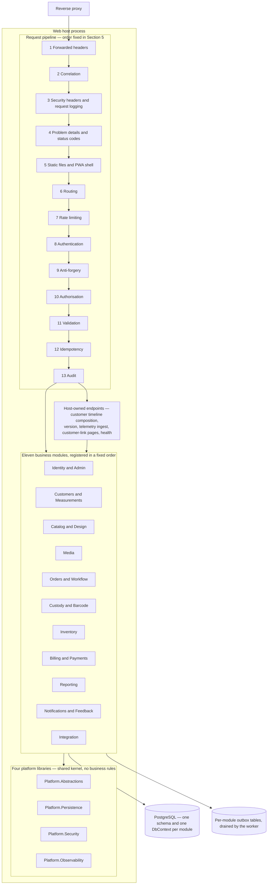
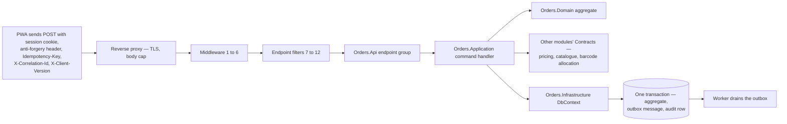

# Component view — inside the web host

This document is the C4 level 3 view of container **C3**, the ASP.NET Core web host described in
[`container.md`](container.md). It records how the host is composed from eleven business modules and four platform
libraries, the order of the request pipeline, and the exact path a request takes from the reverse proxy to a module
endpoint and back. Read it with [`module-ownership.md`](module-ownership.md), which fixes what each module owns, and
[`architecture-rules.md`](architecture-rules.md), which lists the `ARCH-…` rules that make the boundaries described
here testable rather than aspirational. The worker host, container C4, composes the same modules through the same
registration extensions and runs their background handlers; only the pipeline in Section 5 is specific to the web
host.

---

## 1. Component diagram

---

## 2. Composition root and module registration

The host owns no business logic. Its composition root does four things, in this order:

1. **Load configuration**, binding `appsettings`, environment variables and secret files from `/run/secrets`
   through `AddKeyPerFile`, validated on start-up with `ValidateOnStart` so a missing required value fails the
   process rather than surfacing later as a runtime error. Secrets never travel in a compose `environment:` block.
2. **Register the platform libraries** — the shared kernel, security, persistence and observability services that
   every module depends on.
3. **Register each module through its own registration extension**, `Add<Module>Module(IServiceCollection,
   IConfiguration)`. The host references a module *only* through this extension and the module's endpoint mapper; it
   never references a module's `Domain`, `Application` or `Infrastructure` types directly. This is an architecture
   rule, not a convention, and it is asserted by a test.
4. **Map each module's endpoints** through `Map<Module>Endpoints(IEndpointRouteBuilder)`, then the small set of
   host-owned endpoints: health probes, `GET /api/version`, the client-telemetry ingest endpoint, the customer-link
   pages under `/c/**`, and the single-page-application fallback that returns `index.html` for any path the API did
   not claim.

Registration order is fixed and deliberate: Identity, Customers, Catalog, Media, Orders, Custody, Inventory,
Billing, Reporting, Notifications, Integration. It follows the dependency direction of the contracts so that a
registration mistake surfaces as a start-up failure rather than as a subtle runtime resolution order.

Two endpoints are allowed to be anonymous in the application shell — the OpenAPI document, mapped in Development
only, and the PWA shell itself, which must load before a session exists so the sign-in screen can be shown. Both
carry an explicit written justification and the issue that introduced them; every datum the shell then requests is
authorised normally.

---

## 3. The eleven business modules

Each module owns exactly one PostgreSQL schema and one `DbContext`, publishes its integration events and read
contracts, and consumes other modules only through their `Contracts` projects. The full ownership table, including
object-storage prefixes, is [`module-ownership.md`](module-ownership.md); this table is the registration view.

| # | Module | Schema | Endpoint prefix | Registration extension | Core responsibility inside the host |
| --- | --- | --- | --- | --- | --- |
| 1 | Identity and Admin | `identity` | `/api/v1/identity` | `AddIdentityModule` / `MapIdentityEndpoints` | Users, roles, permissions, branch assignments, sessions, MFA and passkeys, recovery, branches with timezone and working calendar |
| 2 | Customers and Measurements | `customers` | `/api/v1/customers` | `AddCustomersModule` / `MapCustomersEndpoints` | Customers, aliases, consent, communication preferences, duplicate candidates and merges, measurement templates, drafts and versions |
| 3 | Catalog and Design | `catalog` | `/api/v1/catalog` | `AddCatalogModule` / `MapCatalogEndpoints` | Categories, service types, catalog versions, design option groups, options and rules, QC checklist templates |
| 4 | Media | `media` | `/api/v1/media` | `AddMediaModule` / `MapMediaEndpoints` | Upload acceptance into quarantine, authorised streaming delivery, retention holds, access log. All decoding happens in the worker |
| 5 | Orders and Workflow | `orders` | `/api/v1/orders` | `AddOrdersModule` / `MapOrdersEndpoints` | Estimates, orders, garment jobs, snapshots, workflow engine, phases, assignments, QC results, rework, alterations, holds, the ready-for-delivery gate |
| 6 | Custody and Barcode | `custody` | `/api/v1/custody` | `AddCustodyModule` / `MapCustodyEndpoints` | Barcode identities, label prints, scan events, custody transfers, reconciliation cases, the delivery queue, dispatch authorisations |
| 7 | Inventory | `inventory` | `/api/v1/inventory` | `AddInventoryModule` / `MapInventoryEndpoints` | Items, units, suppliers, locations, the immutable stock ledger, balances, reservations, purchases, stocktakes, low-stock alerts, valuation |
| 8 | Billing and Payments | `billing` | `/api/v1/billing` | `AddBillingModule` / `MapBillingEndpoints` | Pricing and tax engine, price lists, invoices, credit and debit notes, payments, receipts, cashier sessions, dispatch eligibility and exceptions |
| 9 | Reporting | `reporting` | `/api/v1/reporting` | `AddReportingModule` / `MapReportingEndpoints` | Read models and projections, checkpoints, the metric dictionary, reconciliation runs, scheduled reports, governed exports |
| 10 | Notifications and Feedback | `notifications` | `/api/v1/notifications` | `AddNotificationsModule` / `MapNotificationsEndpoints` | Templates and intents, deliveries, the in-app notification centre, customer links, feedback, service-recovery cases |
| 11 | Integration | `integration` | `/api/v1/integration` | `AddIntegrationModule` / `MapIntegrationEndpoints` | Integration event relay, webhook subscriptions and deliveries, provider configuration, payment intents and callbacks, accounting export batches |

Two ownership rules govern this table and are enforced by tests:

- **Reporting is never authoritative.** Projections are derived, rebuildable and carry a visible freshness
  indicator. Financial, stock, workflow and custody truth is only ever read from the owning module.
- **Billing never references Orders**, and Reporting references only `Contracts` projects. Where Orders needs a
  price it calls Billing's pricing contract, which never references an order entity.

### 3.1 The shape every module has inside

| Layer | May reference | Contains |
| --- | --- | --- |
| `Domain` | `Platform.Abstractions` only | Aggregates, invariants, domain events. No framework references at all |
| `Application` | Its own `Domain`, `Platform.*`, other modules' `Contracts` | Commands and queries, FluentValidation validators, authorisation requirements, ports, integration-event mappers. Never another module's `Infrastructure` |
| `Infrastructure` | Its own `Domain` and `Application`, `Platform.*` | The EF `DbContext` mapping only its own schema, repositories, adapters, outbox handlers, the `Add<Module>Module` extension |
| `Api` | Its own `Application`, `Platform.*` | Minimal API endpoint groups, request and response DTOs, the `Map<Module>Endpoints` extension |
| `Contracts` | `Platform.Abstractions` | Integration events and read contracts that other modules are permitted to reference. **The only project other modules may reference** |

---

## 4. The four platform libraries

The platform is a shared kernel and holds **no business rules**. It is the only other thing a module may reference
across a boundary.

| Library | Provides | Used by every module for |
| --- | --- | --- |
| `Platform.Abstractions` | `Result`, `DomainEvent`, `IClock`, `IIdGenerator`, `Money`, and the ports: `IEmailSender`, `IPdfRenderer`, `IBarcodeRenderer`, `IPrintQueue`, `IOutboundHttp`, `IMalwareScanner`, `ITimelineSource` | Talking to the outside world without naming a vendor. Provider SDK packages are referenced only by `Integration.Infrastructure` and test projects |
| `Platform.Persistence` | EF Core conventions, the outbox and inbox tables, sequence allocation, idempotency storage, and the audit writer with its `SaveChanges` interceptor | Writing an aggregate, its outbox message and its audit event in one transaction |
| `Platform.Security` | The permission catalogue, authorisation policies and requirement handlers, branch scope evaluation, step-up, and the endpoint extensions that declare them | `.RequirePermission("orders.confirm")`, `.RequireStepUp()`, field-level minimisation, and the justified-anonymous escape hatch |
| `Platform.Observability` | OpenTelemetry traces, metrics and logs, Serilog configuration with the redaction policy, correlation middleware, and the health-check endpoints | Correlation and causation identifiers everywhere, and the four probes of [`container.md`](container.md) Section 4 |

Ports arrive with the issue that first needs them and are extended only by non-breaking change afterwards:
`IPdfRenderer` with the estimate PDF, `IBarcodeRenderer` and `IPrintQueue` with label printing.

---

## 5. Request pipeline order

The order below is normative. Each stage names what it does, how it fails, and where it is configured. Stages 1 to
6 are middleware that run for every request; stages 7 to 13 apply per endpoint, declared on the endpoint itself so
that a missing declaration is a test failure rather than a silent gap.

| # | Stage | What it does | Failure response |
| --- | --- | --- | --- |
| 1 | **Forwarded headers** | Rewrites the scheme and client address from the proxy's headers. It must be first, because everything after it — rate limiting, cookie handling, logging enrichment, the outbound policy's audit trail — reads the client address or scheme. Trusted networks are limited to the reverse-proxy network through `ForwardedHeadersOptions.KnownNetworks`, and an empty list fails fast outside Development | Misconfiguration is a start-up failure, not a runtime surprise |
| 2 | **Correlation** | Accepts an inbound `X-Correlation-Id` or mints one, pushes it into the log context, the current activity and the response, so a request, its events, its logs and its traces share one identifier across both hosts | Never fails a request |
| 3 | **Security headers and request logging** | Sets the security header set including the enforcing nonce-based content security policy, and logs the request through Serilog under the redaction policy. `/c/**` paths are redacted here | Never fails a request |
| 4 | **Problem details and status codes** | Converts every unhandled failure into an RFC 9457 problem document carrying field errors and the correlation identifier, and never a stack trace | This *is* the failure path |
| 5 | **Static files and the PWA shell** | Serves the precached application assets. The shell is anonymous by justified exception; the data it then requests is not | `404` for an unknown asset |
| 6 | **Routing** | Selects the endpoint and therefore the endpoint's declared policies for the stages below | `404` |
| 7 | **Rate limiting** | Applies the endpoint's declared rate-limit policy from the catalogue registered by `RateLimitPolicies` — `auth-anon`, `mfa-challenge` and `recovery-anon` for the credential surface, `write` and `default-user` for ordinary authenticated traffic, `scan-burst` sized for offline-queue replay, `export-heavy`, and `default-ip` for anonymous traffic that is not a credential endpoint. The customer-link, provider-callback and telemetry-ingest policies arrive with the endpoints that need them (#47, #55, #52), because the catalogue an endpoint may name and the limiters the host registers are asserted to be the same set: a published name with no limiter behind it throws on the first request rather than failing review. Every endpoint declares exactly one policy (ARCH-017); the credential policies key on the client address resolved in stage 1, the rest on the account, and a refusal on a credential policy is audited | `429` problem details |
| 8 | **Authentication** | Resolves the `__Host-t360.session` cookie to a server-side session, checks revocation, and establishes the principal with its permissions and branch scope. Exactly two authentication paths exist in v1: the cookie scheme, and justified `[AllowAnonymous("reason")]` endpoints — customer links, payment callbacks, health and telemetry ingest. An architecture test asserts that no endpoint accepts more than one scheme | `401` problem details |
| 9 | **Anti-forgery** | Requires the anti-forgery header on every non-safe request from a cookie principal, **and** on login, MFA challenge, passkey and recovery endpoints, because login itself is forgeable. A companion check rejects a non-safe request whose `Sec-Fetch-Site` is cross-site or whose `Origin` is not the host origin | `400` problem details |
| 10 | **Authorisation** | Evaluates permission, branch scope and resource ownership together. Deny by default; a missing policy is an architecture-test failure. `RequiresStepUp` permissions additionally require multi-factor re-authentication within the last five minutes. A denied request to a state-changing or step-up endpoint is audited as `authz.denied`, coalesced per actor, endpoint and minute, and never sampled | `403` problem details |
| 11 | **Validation** | FluentValidation runs against the parsed request before any idempotency record is touched, so a malformed request is rejected without consuming or recording a key. Request size and time limits apply here too, and `X-Client-Version` is compared with the minimum supported client | `400` with field errors, or `426` for an outdated client |
| 12 | **Idempotency** | For `confirm`, `scan`, `post`, `pay`, `callback` and `webhook` commands, looks up `(principal_id, route template, Idempotency-Key)`. Because authentication and authorisation have already run, a replay by a revoked or unauthorised principal is refused rather than served from the store. The same key with a different request hash is `422 idempotency.key-reused`; a duplicate arriving while the first is in flight waits up to five seconds and then returns `409 idempotency.in-progress`. Records are retained seven days, which must exceed the offline queue's maximum age plus worker retry horizons. Scan events deduplicate additionally on `(actor_id, client_event_uuid)`; the same UUID under a different actor is `409 custody.event-conflict`, never a replay | `409` or `422` problem details |
| 13 | **Audit** | The `[Audited("module.action")]` endpoint filter records actor, action, resource, reason and correlation for every state-changing endpoint, and explicit calls cover sensitive reads such as the measurement sheet, media and exports. The audit row is appended by a `SaveChanges` interceptor **in the same transaction as the mutation**, and its hash chain is computed by a database trigger the application role cannot bypass. An architecture test fails a command endpoint that lacks the filter | An audit failure fails the transaction |

Concurrency sits alongside stages 11 to 13 rather than inside them: editable aggregates carry `xmin` or an explicit
version as a concurrency token and honour `ETag` and `If-Match`, answering `409` problem details with the current
version.

---

## 6. How a request reaches a module endpoint

The worked example is `POST /api/v1/orders/{orderId}/confirm` — the command that turns a priced draft into a
confirmed order, allocates a barcode identity for each garment job and freezes every snapshot.

Step by step:

1. The PWA issues the command through the generated API client, which injects the anti-forgery header, a
   client-generated `Idempotency-Key`, `X-Correlation-Id` and `X-Client-Version`.
2. The reverse proxy terminates TLS, applies the request-body cap and forwards to the host on the internal network.
3. Middleware stages 1 to 6 establish the real client address, the correlation identifier, the security headers and
   the route match.
4. Endpoint filters 7 to 12 apply the endpoint's declared rate-limit policy, resolve the session, check
   anti-forgery, evaluate `orders.confirm` against the caller's permissions and branch scope, validate the request
   body, and take the idempotency record.
5. `Orders.Api` maps the DTO to an application command. The endpoint group holds no business logic; it declares the
   policy, the rate-limit policy and the audit action, and delegates.
6. `Orders.Application` orchestrates. Where it needs something another module owns, it calls that module's
   **contract** — Billing's pricing contract for the price snapshot, Catalog's validators and snapshot builder for
   the design snapshot, Custody's `IBarcodeIdentityAllocator` through the confirmation-participant hook for the
   barcode identity. It never opens another module's `DbContext` and never reads another module's table.
7. `Orders.Domain` enforces the invariants: snapshots become immutable at confirmation, and a revision is only
   possible while every job is still confirmed and none has entered production.
8. `Orders.Infrastructure` persists through the module's own `DbContext`. In **one transaction** it writes the
   aggregate, the outbox message for `orders.order-confirmed.v1`, and the audit row appended by the interceptor and
   hash-chained by the trigger.
9. After the transaction commits, the worker claims the outbox message, dispatches it to in-process handlers,
   notification intents and webhook subscriptions, all inbox-deduplicated so at-least-once delivery is
   exactly-once in effect.
10. The response is the created resource with its `ETag`; the idempotency record stores the status and body so a
    retry with the same key returns the same answer rather than confirming twice.

---

## 7. Cross-module communication

| Mechanism | When it is used | Rule |
| --- | --- | --- |
| **Read contract** | A module needs a fact another module owns, synchronously and now — dispatch eligibility, stock balance, catalogue availability, the user directory | The interface lives in the owner's `Contracts` project and is implemented by the owner's `Application`. The caller depends on the interface only |
| **Integration event** | A module needs to react to something that happened elsewhere — a notification on order confirmation, a projection refresh, a webhook | Written to the owner's outbox in the same transaction as the change, versioned as `orders.order-confirmed.v1`, carrying identifiers, codes, statuses, timestamps, amounts and branch codes only. Personal payloads require the event to be classified personal and the subscriber approved |
| **Confirmation-participant hook** | Work that must happen inside another module's transaction, such as allocating a barcode identity at order confirmation | The participant is registered by the owning module and invoked by the orchestrating one through the platform, so neither module gains a reference to the other's internals |
| **Catalogue dependency validator** | A module needs to veto a catalogue publication — for example, every service type must reference a published measurement template | Registered with Catalog through a contract; Catalog calls it without knowing who registered it |
| **BFF composition** | The customer timeline, which merges consents, measurements, orders, invoices, payments, custody events, notifications and feedback | Each module implements `ITimelineSource`. The composition endpoint lives in the **host**, not in Customers, and filters entries by the caller's permissions and branch scope. Customers never references another module |

---

## 8. What the web host deliberately does not do

| Not in the web host | Where it happens | Why |
| --- | --- | --- |
| Image decoding, dimension checks, metadata stripping, re-encoding, thumbnailing | Worker, under the `MediaProcessing` bulkhead | A decoder is an attack surface and a memory risk; it must never sit on the request path |
| Malware scanning | Worker | Same reason, plus the scan is slow |
| Provider calls — SMS, WhatsApp, email, payment, accounting, webhooks | Worker, through `IOutboundHttp` | A provider call must never sit inside a database transaction, and a timeout must be resolvable by polling rather than by guessing |
| Projection building, reconciliation, scheduled reports, retention jobs | Worker | Reporting load must never compete with billing and scanning for the transactional pool |
| Long export generation | Worker; the host issues a job and serves the finished artefact | Keeps request latency bounded |
| Direct thermal printing | The print station screen draining `platform.print_jobs` | A phone browser cannot drive a thermal printer; **Download PDF** is the fallback |

---

## 9. Open decisions affecting this view

| Ref | Question | Owner | Status |
| --- | --- | --- | --- |
| OD-12 | The authentication strategy behind stage 8, the MFA-required role set, and whether a revocable trusted-device cookie exists for shared counter devices | Business owner, with the technical reviewer | Open, raised 2026-09-03, needed before W1 |
| OD-13 | The permission catalogue's default role grants, which stage 10 evaluates and the authorisation matrix fixtures assert | Business owner | Open, raised 2026-09-03, needed before W1 exit |
| OD-04 | The dispatch payment rule, which decides the semantics Billing's dispatch-eligibility contract returns and who may approve an exception | Business owner | Open, raised 2026-09-03, needed before W4 |
| — | The numeric limits in the stage 7 rate-limit policy catalogue | Issue #19 | **Proposed, to be confirmed**; the catalogue's shape is fixed, its numbers are not |

---

## 10. Related documents

| Document | What it adds |
| --- | --- |
| [`container.md`](container.md) | The containers this host sits among, their scaling and their health probes |
| [`context.md`](context.md) | The trust boundary this pipeline defends and what crosses it |
| [`module-ownership.md`](module-ownership.md) | The full owns, publishes and consumes table for all eleven modules |
| [`invariants.md`](invariants.md) | The rules the domain layers in Section 3.1 enforce |
| [`conventions.md`](conventions.md) | Money, time, identifiers, concurrency, API versioning and migration compatibility |
| [`architecture-rules.md`](architecture-rules.md) | Each `ARCH-…` rule, its assertion, its allowed exceptions and the test that implements it |
| [`sequences/`](sequences/) | The four representative flows drawn end to end, including the confirmation walked through in Section 6 |
