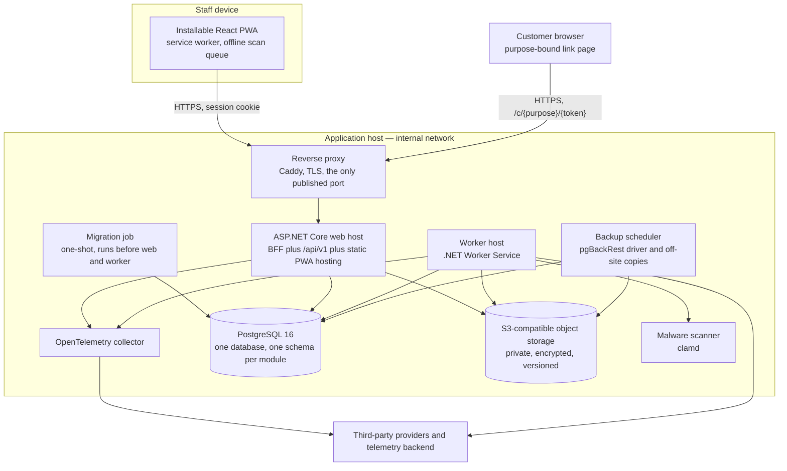

# Container view — HyFib Tailor 360

This document is the C4 level 2 view. It lists every deployable unit inside the trust boundary drawn in
[`context.md`](context.md), and for each one records its responsibility, its technology, how it scales, how it
behaves when it or a dependency fails, and the health endpoints it exposes. Read it with
[`deployment.md`](deployment.md), which places these containers on networks, ports and volumes, and with
[`components.md`](components.md), which opens the web host. Nothing here overrides
[`../IMPLEMENTATION_PLAN.md`](../IMPLEMENTATION_PLAN.md) Sections 4.4 and 4.7; where a number is not yet agreed it is
marked as an open decision in Section 8.

---

## 1. Container diagram

---

## 2. Container catalogue

| # | Container | Technology | One-line responsibility | Published beyond the internal network |
| --- | --- | --- | --- | --- |
| C1 | Installable PWA | React 19, TypeScript, Vite, Workbox | The whole staff user interface, installable and scanner-first | Served as static assets by C3 |
| C2 | Reverse proxy | Caddy | TLS termination, the single inbound door, request-size and header hygiene | **Yes** — the only container that is |
| C3 | Web host | ASP.NET Core on .NET 10, Minimal APIs | BFF session, `/api/v1`, static hosting of C1, all synchronous business work | No — reached only through C2 |
| C4 | Worker host | .NET Worker Service | Outbox dispatch, media processing, scheduled and long-running work, all provider calls | No |
| C5 | PostgreSQL | PostgreSQL 16, one database | The single authoritative store, one schema per module | **Never** |
| C6 | Object storage | S3-compatible; MinIO in the baseline | Private storage for media, rendered documents and governed exports | **Never** |
| C7 | Malware scanner | ClamAV `clamd` | Scans every uploaded object before it may leave quarantine | **Never** |
| C8 | OpenTelemetry collector | OpenTelemetry Collector or Grafana Alloy | Receives traces, metrics and logs and ships them to the chosen backend | No |
| C9 | Migration job | `tailor360-cli` image, one-shot | Applies migrations and reference data before C3 and C4 start | No |
| C10 | Backup scheduler | pgBackRest driver plus object copies | Schedules base backups, verifies freshness, copies media off site | No |
| C11 | Mail sink | Mailpit | Non-production only: catches every outbound email so nothing reaches a real customer | Gated address only |

C9, C10 and C11 are supporting containers; they are described in Section 6 and placed in
[`deployment.md`](deployment.md).

---

## 3. The eight primary containers in detail

### C1 — Installable React PWA

| Aspect | Detail |
| --- | --- |
| **Responsibility** | Every staff screen: intake, measurement capture, design selection, order and estimate, workboard, scan and custody, inventory, billing and cashier, delivery, reporting and administration. Chooses phone, tablet or desktop layout by container query, never by user agent |
| **Technology** | React 19 with TypeScript strict, Vite, TanStack Query, React Router, Tailwind CSS 4 with headless accessible primitives, react-hook-form with zod, `@zxing/browser` with the native `BarcodeDetector` where present, Workbox through `vite-plugin-pwa`, FormatJS with ICU messages, an API client generated from OpenAPI |
| **Scaling** | Per device. The bundle is precached by the service worker and versioned; there is nothing to scale server-side beyond static asset delivery by C3 |
| **Failure behaviour** | Network loss shows a persistent, non-dismissable network banner. Only approved idempotent operations — scan submissions and the doorstep delivery-confirmed scan referencing an online dispatch authorisation — enter the bounded offline queue. Billing, payment and inventory reconciliation show `OfflineBlockedAction`: "Needs connection — this will not be queued". A retry reuses the same `Idempotency-Key` and never discards typed input. An outdated client receives `426` from the server and is prompted to update |
| **Health endpoints** | None of its own. It reads `GET /api/version` to drive the update prompt, and surfaces the server's health only as user-facing state |

### C2 — Reverse proxy

| Aspect | Detail |
| --- | --- |
| **Responsibility** | Terminates TLS, is the single inbound door, caps the request body, strips and sets response headers, and forwards to C3 on the internal network. Automatic certificates through ACME DNS-01, so certificates work behind NAT |
| **Technology** | Caddy, configured by `infra/caddy/Caddyfile` |
| **Scaling** | One instance in the Compose baseline. Compose has no rolling update, so a web container swap costs a few seconds of `502`s — accepted against the availability target, minimised by `--wait` and proxy retry. Blue-green arrives with the Kubernetes path |
| **Failure behaviour** | If the proxy is down the application is unreachable; this is the outage the external uptime check exists to catch. If C3 is unhealthy the proxy returns `502` rather than serving stale content |
| **Health endpoints** | It proxies `GET /api/version` for its own container health check. Plan Section 4.4 fixes the target that only `/health/live` is reachable from outside; the interim baseline is stricter still — the Caddyfile answers `404` to every `/health/**` path, and external liveness is checked through `/api/version`. Issue #59 reconciles the two when the hardened proxy configuration lands |

### C3 — ASP.NET Core web host

| Aspect | Detail |
| --- | --- |
| **Responsibility** | Three jobs in one process: serve the PWA's static assets; be the backend for frontend that holds the session, the anti-forgery token and the customer-link pages; and host `/api/v1`, where every module's Minimal API endpoints live. It also composes the customer timeline across modules through `ITimelineSource`. It performs **no** image decoding, **no** provider calls inside a transaction and **no** long-running work |
| **Technology** | .NET 10 LTS, Minimal APIs, EF Core 10 with one `DbContext` per module, ASP.NET Core Identity with Argon2id, TOTP and passkeys, Serilog, OpenTelemetry, `AspNetCore.HealthChecks` |
| **Scaling** | Vertical first. The process is stateless: sessions, the Data Protection key ring, idempotency records and feature flags all live in PostgreSQL, so a second replica is a configuration change, not a code change. Two conditions attach to it — the connection budget (web transactional 30, web reporting 10 against `max_connections = 100`) must be recomputed or PgBouncer introduced in transaction mode, and the session-revocation cache must be revalidated per request once more than one replica runs. A distributed cache is optional and only introduced with more than one replica |
| **Failure behaviour** | Startup fails fast on missing or invalid configuration, an unapplied migration, or a Data Protection key ring on the local file system outside Development. In flight, PostgreSQL loss fails readiness and the instance stops serving; object storage, the scanner, providers, outbox lag and backup age report **Degraded** and never remove the host from rotation. Compose does not restart `unhealthy` containers, so the host runs an in-process watchdog: three consecutive liveness failures exit with code 70 and `restart: unless-stopped` brings it back |
| **Health endpoints** | `/health/live`, `/health/startup`, `/health/ready`, `/health/detail` — semantics in Section 4 |

### C4 — Worker host

| Aspect | Detail |
| --- | --- |
| **Responsibility** | Outbox dispatch per module, notification delivery, webhook delivery, due-date and SLA evaluation, low-stock evaluation, retention and cleanup, export generation, report projections and reconciliation, scheduled reports, backup-age monitoring, and the whole media pipeline — header dimension check, signature validation, malware scan, metadata strip, re-encode, derivatives, promotion out of quarantine |
| **Technology** | .NET Worker Service sharing the same module assemblies as C3; SkiaSharp for image work under a bounded `MediaProcessing` bulkhead (concurrency 2, 30 s timeout); `IOutboundHttp` for every external call |
| **Scaling** | Horizontal by design: `docker compose up --scale worker=2` needs no code change. Outbox claims use `FOR UPDATE SKIP LOCKED` in one short transaction that excludes messages whose aggregate has an older unprocessed message, so two dispatchers never reorder one aggregate's stream; scheduled jobs take a row lease in `platform.job_leases`; heartbeats are per instance. The worker's own connection budget is 20 transactional plus 10 reporting |
| **Failure behaviour** | A lost lease is redelivered, which is why every handler is inbox-deduplicated. Retries use back-off with jitter and dead-letter after their budget, replayable only by an authorised, audited operator action. A provider timeout is `unknown` and is resolved by status polling, never assumed successful. The "worker down" alert fires when no instance has a heartbeat younger than twice the interval. The same watchdog and exit-code-70 pattern as C3 applies |
| **Health endpoints** | Its own `/health/live`, `/health/startup`, `/health/ready`, `/health/detail` on an internal port that is never published |

### C5 — PostgreSQL

| Aspect | Detail |
| --- | --- |
| **Responsibility** | The one authoritative store for every module. One database, one schema per module (`identity`, `customers`, `catalog`, `media`, `orders`, `custody`, `inventory`, `billing`, `reporting`, `notifications`, `integration`, `platform`). It also holds sessions, the Data Protection key ring, outbox and inbox tables, idempotency records, sequences, feature flags, job leases, worker heartbeats and the hash-chained audit log |
| **Technology** | PostgreSQL 16 or later, data checksums on, `max_connections` matching the validated connection budget. Four runtime roles beyond the migrator — `t360_app` (DML, insert-only on append-only tables, no `TRUNCATE`), `t360_reporting` (read-only), `t360_retention` (partition detach and drop), `t360_backup`. The runtime connection never holds DDL |
| **Scaling** | Vertical: CPU, memory and IO on one primary. A read replica for reporting is possible but requires recomputing the connection budget. Managed PostgreSQL is an option under the hosting decision |
| **Failure behaviour** | This is the one dependency whose loss is not a degradation: readiness fails on both hosts and they stop serving. Append-only tables are protected by triggers that reject `UPDATE` and `DELETE` from the application role, so a compromised application cannot rewrite the ledger, the audit chain or a posted invoice. Recovery is base backup plus continuous WAL — see [`deployment.md`](deployment.md) Section 7 |
| **Health endpoints** | `pg_isready` for the container check. The hosts' readiness probe is a `SELECT 1` with a 2 s timeout |

### C6 — Object storage

| Aspect | Detail |
| --- | --- |
| **Responsibility** | Private storage for media originals and derivatives, rendered PDFs and governed exports. Ownership is fixed: Media owns the material, reference, illustration, QC-evidence and delivery-evidence prefixes, Billing owns `documents/`, Reporting owns `exports/`. No module writes to another module's prefix, enforced by per-module credentials or bucket policies |
| **Technology** | S3 API. MinIO in the Compose baseline; S3, R2 or Azure Blob through the S3 API in production. Server-side encryption on every bucket, random object keys, versioning with non-current-version retention at or above the database backup retention |
| **Scaling** | Single node in the baseline, sized against assumption A5 — roughly 22 GB of originals per year plus about 30 per cent derivatives at three branches — with growth alerts. In a cloud deployment the managed bucket removes the question entirely |
| **Failure behaviour** | Reported **Degraded**, never Unhealthy. Uploads answer `503 media.unavailable`; existing streams fail cleanly; every other feature continues. The PWA never holds a storage URL, so nothing in the client keeps working against the store while the server thinks it is down |
| **Health endpoints** | `GET /minio/health/ready` from outside the container; `mc ready local` from inside, because the MinIO image ships neither curl nor wget |

### C7 — Malware scanner

| Aspect | Detail |
| --- | --- |
| **Responsibility** | Scans every uploaded object while it sits in quarantine. Nothing is promoted to a servable state until the scan passes |
| **Technology** | ClamAV `clamd` behind the `IMalwareScanner` port, feature-flagged. A fake scanner is the default in development and in the standard integration run; the real `clamd` contract test runs in its own job, and interim staging runs the real scanner because that is where the media pipeline is rehearsed |
| **Scaling** | One instance. It is memory-bound rather than CPU-bound — roughly 1.5 to 2 GB resident for the signature database — and the worker's bulkhead of concurrency 2 is what actually bounds the load put on it |
| **Failure behaviour** | Reported **Degraded**. Uploaded objects remain quarantined and are never served; the pipeline resumes when the scanner returns. A quarantined object is never a servable object, so a scanner outage cannot become a delivery of unscanned bytes |
| **Health endpoints** | `clamdcheck.sh`, which asks `clamd` itself whether it is answering. The TCP port opens well before the signature database is loaded, so a port check would be misleading |

### C8 — OpenTelemetry collector

| Aspect | Detail |
| --- | --- |
| **Responsibility** | Single egress point for traces, metrics and logs from C3, C4 and the client telemetry endpoint; batching, redaction reinforcement and export to the chosen backend |
| **Technology** | OpenTelemetry Collector or Grafana Alloy, configured by `infra/observability/otel-collector-config.yaml`. The self-hosted Prometheus, Loki, Tempo, Grafana and Alertmanager stack stays available as a compose profile for development, air-gapped installs and game days |
| **Scaling** | One instance on the application host in the collector-only default. If the self-hosted stack is chosen it runs on a separate VM, because it adds roughly 3 to 4 GB of resident memory |
| **Failure behaviour** | Loss of the collector never affects request handling: the hosts export nothing when no OTLP endpoint is configured, and buffer then drop when the collector is unreachable. This is exactly why the **external dead-man's switch and uptime check are mandatory** — "VM down" and "backup job dead" must never be silent |
| **Health endpoints** | The `health_check` extension answers on port 13133, probed from the host. The collector image is built `FROM scratch` and contains no shell or HTTP client, so it cannot probe itself from inside |

---

## 4. Health probe semantics

Both application hosts expose the same four probes. The rule behind them is that **readiness never depends on a
non-essential dependency**: a degraded capability must not remove a host from rotation, because taking the host out
would turn a partial outage into a total one.

| Probe | Question it answers | Checks | Consumers |
| --- | --- | --- | --- |
| `/health/live` | Is the process responsive and, in the worker, is the dispatcher loop still ticking | In-process flags only, no network dependency | Watchdog, orchestrator liveness, external uptime check |
| `/health/startup` | Has this instance finished coming up | Configuration validated, no unapplied migration, Data Protection key ring loaded; the worker additionally writes one heartbeat | Orchestrator startup probe, deploy script |
| `/health/ready` | May this instance receive traffic | Database reachable — `SELECT 1` with a 2 s timeout — and nothing else | Reverse proxy, `depends_on: service_healthy`, `up --wait` |
| `/health/detail` | What is the state of everything | Every registered check as Healthy, Degraded or Unhealthy | Internal network or the `admin.health.read` permission only. Never exposed publicly |

Checks that report **Degraded** on `/health/detail`, drive alerts and gate features, but never fail readiness:
object storage, the malware scanner, provider adapters, outbox and projection lag, and backup age.

Compose does not restart containers that report `unhealthy`, so each application host runs an in-process watchdog:
three consecutive liveness failures exit with code 70, and `restart: unless-stopped` brings the container back.

---

## 5. Degradation matrix

| Dependency lost | Web host | Worker host | What staff see |
| --- | --- | --- | --- |
| PostgreSQL | Readiness fails, stops serving | Readiness fails, jobs stop claiming | An outage; recovery is a restore or a failover decision |
| Object storage | Degraded; uploads `503 media.unavailable` | Degraded; media pipeline pauses | Image upload disabled with an explicit reason; everything else works |
| Malware scanner | Unaffected | Degraded; objects stay quarantined | Uploaded images are accepted but not yet viewable |
| Provider — SMS, WhatsApp, email, payment | Unaffected | Degraded; retries and dead letters | Messages delayed; in-app notifications unaffected; payments never guessed |
| OpenTelemetry collector | Unaffected | Unaffected | Nothing, which is why the dead-man's switch is mandatory |
| Worker host entirely | Unaffected for reads and commands | — | Outbox lag alert; notifications, projections and media processing stall; nothing is lost, because the outbox is durable |
| Reverse proxy | Unreachable | Unaffected | Total outage from the branch's point of view |

---

## 6. Supporting containers

| Container | Purpose | Lifecycle | Notes |
| --- | --- | --- | --- |
| C9 Migration job | Applies module migrations and reference data | One-shot; C3 and C4 wait on `condition: service_completed_successfully` | Runs as `t360_migrator`, the only role holding DDL. Migrations are forward-only and expand-migrate-contract, so release N runs against a database at N+1 |
| C10 Backup scheduler | Drives scheduled pgBackRest base backups, media off-site copies and backup-freshness reporting | Long-running | The `archive_command` for continuous WAL cannot live in a sidecar because PostgreSQL invokes it, so pgBackRest is installed **inside** the PostgreSQL image; the scheduler holds the backup credentials. The worker holds none and reads freshness from `pg_stat_archiver` and scheduler metrics. Retention is enforced by bucket lifecycle on an object-locked bucket, never by `pgbackrest expire`, and the archiver identity cannot delete |
| C11 Mail sink | Catches outbound email in development and interim staging | Long-running, non-production only | Mailpit. Interim staging has no provider credentials at all, so no message can reach a real customer |

---

## 7. Resource baseline

These figures are the plan's **proposed, to be confirmed** starting point from assumption A5. Issue #19 replaces
them with measured targets, and the hosting decision (OD-02) fixes the shape.

| Container | Proposed resident memory | Note |
| --- | --- | --- |
| PostgreSQL | 2 GB | Sized with the connection budget, not independently of it |
| Web host | 0.5 GB | — |
| Worker host | 0.5 GB | Media bulkhead of 2 is what bounds peak use |
| Object storage | 0.5 to 1 GB | MinIO in the baseline |
| Malware scanner | 1.5 to 2 GB | Signature database dominates |
| Reverse proxy | 0.1 GB | — |
| Collector | 0.3 GB | Self-hosted observability instead would add 3 to 4 GB and belongs on its own VM |
| **Baseline VM** | **4 vCPU, 16 GB RAM, 200 GB SSD** | Object storage 100 GB with growth alerts; staging 2 vCPU, 8 GB |

---

## 8. Open decisions affecting this view

| Ref | Question | Owner | Status |
| --- | --- | --- | --- |
| OD-01 | Confirmation of ASP.NET Core on .NET 10 and a build environment that has the SDK | Business owner, with the technical reviewer | Open, raised 2026-09-03, needed before W1 |
| OD-02 | Hosting model and indicative monthly budget, which fixes whether C5 and C6 are self-hosted or managed and therefore the whole scaling and backup story | Business owner | Open, raised 2026-09-03, needed before W1 exit |
| OD-03 | Which providers C4 actually calls | Business owner | Open, raised 2026-09-03, needed before W4 |
| OD-14 | Hosted telemetry backend versus the self-hosted stack, which decides whether C8 is alone on the VM or joined by a second one | Business owner | Open, raised 2026-09-03, needed before W5 |
| — | Every availability, latency, lag and RPO or RTO figure this view implies | Issue #19, stakeholder review | **Proposed, to be confirmed**; targets live in [`../nfr/slo.md`](../nfr/slo.md) |

---

## 9. Related documents

| Document | What it adds |
| --- | --- |
| [`context.md`](context.md) | Who uses the system, which external systems it touches, and the trust boundary |
| [`components.md`](components.md) | Inside C3: module registration, the request pipeline and how a request reaches an endpoint |
| [`deployment.md`](deployment.md) | Networks, published versus internal ports, volumes, secret files, backups and environments |
| [`module-ownership.md`](module-ownership.md) | Which module owns which schema, contracts and storage prefix |
| [`architecture-rules.md`](architecture-rules.md) | The `ARCH-…` rules that keep these containers honest |
| [`../nfr/slo.md`](../nfr/slo.md) | Availability, latency, lag, RPO and RTO per candidate hosting model |
