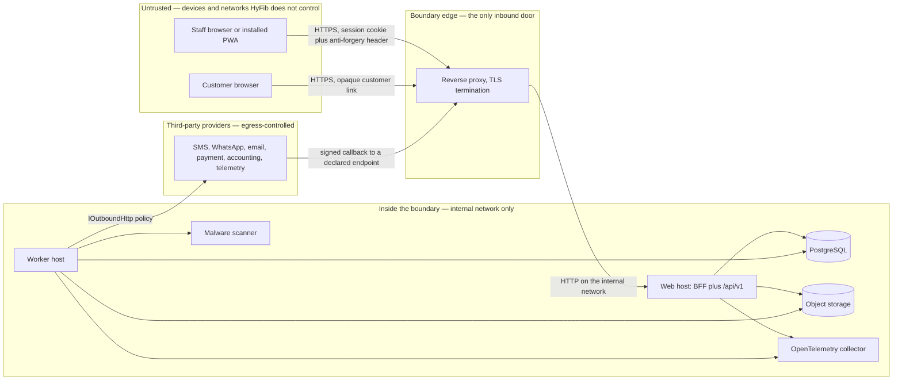

# System context — HyFib Tailor 360

This document is the C4 level 1 view of HyFib Tailor 360. It names the people who use the system, the customers it
serves indirectly, the external systems it depends on, the trust boundary drawn around the parts HyFib operates, and
exactly what is allowed to cross that boundary in each direction. It is the entry point of the architecture set:
read it before [`container.md`](container.md) (level 2), [`components.md`](components.md) (level 3) and
[`deployment.md`](deployment.md). Terminology follows [`../prd/glossary.md`](../prd/glossary.md); module ownership
follows [`module-ownership.md`](module-ownership.md); the decisions behind each statement are recorded as
architecture decision records in [`../adr/`](../adr/) and in Sections 3 and 4 of
[`../IMPLEMENTATION_PLAN.md`](../IMPLEMENTATION_PLAN.md).

---

## 1. What the system is

HyFib Tailor 360 is a **staff-only** tailoring operations platform for a single Indian legal entity — the
organisation — operating one or more branches in Tamil Nadu. It runs as an installable React progressive web
application backed by an ASP.NET Core modular monolith, and it tracks a garment from customer intake, measurement
and design selection, through the order and its garment jobs, production phases, QC, barcode custody transfers,
invoicing and payment, to dispatch, delivery and feedback.

Fixed context facts, all from plan Sections 2 and 3:

| Fact | Value | Source |
| --- | --- | --- |
| Legal entities | One organisation; branch-aware from day one; multi-legal-entity tenancy is out of scope | D7, A1 |
| Currency and tax | INR only; GST-registered; CGST and SGST or IGST decided by place of supply | D10, A1 |
| Financial year | April to March; part of every document sequence key | D10 |
| Timezone | UTC in storage; branch IANA timezone, default `Asia/Kolkata`, for display, due dates, SLA clocks and report cut-offs | D11 |
| Languages | `en-IN` first, `ta-IN` catalogue alongside it; customer-facing pages follow the customer's language | Plan 4.6 |
| Customer accounts | None. Customers interact only through expiring, purpose-bound links | A2 |

---

## 2. Context diagram

```mermaid
flowchart TD
    subgraph staff["Branch staff — phones, tablets, desktop browsers"]
        reception["Reception"]
        master["Tailor Master"]
        tailor["Tailor"]
        clerk["Inventory Clerk"]
        cashier["Cashier"]
        delivery["Delivery Staff"]
        manager["Branch Manager"]
        owner["Owner"]
    end

    customer["Customer<br/>no account, no password"]

    subgraph boundary["Trust boundary — operated by HyFib"]
        system["HyFib Tailor 360<br/>installable PWA, web host, worker host"]
        db[("PostgreSQL<br/>one database, one schema per module")]
        objects[("Private object storage<br/>S3 API, server-side encryption")]
        av["Malware scanner<br/>ClamAV"]
    end

    subgraph onprem["Branch premises — local devices"]
        wedge["Keyboard-wedge barcode scanner"]
        labelprinter["Thermal label printer"]
        docprinter["A4 document printer"]
    end

    subgraph third["Third-party systems — outside the boundary"]
        sms["SMS and WhatsApp provider"]
        email["Email provider"]
        pay["Payment provider — UPI and card"]
        books["Accounting package"]
        otel["Telemetry backend"]
    end

    reception --> system
    master --> system
    tailor --> system
    clerk --> system
    cashier --> system
    delivery --> system
    manager --> system
    owner --> system

    system --> db
    system --> objects
    system --> av

    system -->|"purpose-bound expiring link"| customer
    customer -->|"opens estimate, status or feedback link"| system

    wedge -->|"decoded barcode payload"| staff
    system -->|"queued print job, drained by the print station"| labelprinter
    system -->|"queued print job or PDF download"| docprinter

    system -->|"transactional and consented messages"| sms
    system -->|"transactional email"| email
    system -->|"payment intent"| pay
    pay -->|"signed callback, never authoritative"| system
    system -->|"export batch"| books
    system -->|"traces, metrics, logs"| otel
```

---

## 3. People

### 3.1 The eight shop-floor and management roles

Roles are **default permission bundles**. Authorisation is always evaluated on permission plus branch scope, never
on a role name (plan Section 4.4, issue #24). The default grants themselves are an open decision — **OD-13**,
plan [Section 11](../IMPLEMENTATION_PLAN.md) item 13.

The permission column below quotes **only** permission keys the implementation plan already names. The catalogue
itself is empty until issue #24 populates it, so the column illustrates the shape of a grant, never the final set.

| Role | What the role does in the shop | Primary device and surface | Permission keys the plan already names |
| --- | --- | --- | --- |
| Reception | Finds or creates the customer, records consent, captures material and reference images, builds the order draft, issues the estimate, confirms the order, prints labels | Counter tablet or desktop | `customers.read`, `customers.read_contact`, `orders.confirm` |
| Tailor Master | Starts production, pins the workflow version, assigns garment jobs against capability and capacity, decides rework | Workshop tablet, workboard view | Production, assignment and rework keys are set by #24 |
| Tailor | Takes custody by scan, works phases, records material consumption, hands the garment on | Phone, scanner-first layout | `custody.scan` |
| Inventory Clerk | Maintains items, suppliers, locations and reorder rules; records purchases, issues, returns and wastage; runs stocktakes | Store desktop or tablet | `inventory.approve_variance` |
| Cashier | Records advances and payments, allocates them, issues receipts, opens and closes the cashier session, reconciles | Counter desktop | `payments.record`, `billing.post_invoice` |
| Delivery Staff | Works the delivery queue, performs the receive scan, dispatches, confirms the doorstep handover | Phone, offline-tolerant scan queue | `custody.dispatch` |
| Branch Manager | Supervises one or more branches: exception queues, holds, reconciliation cases, variance approvals, branch configuration within granted permissions | Desktop | Branch-scoped approval keys are set by #24 |
| Owner | Approves catalogue, prices, tax, permissions and alert policies; approves dispatch exceptions; reads cross-branch reports | Desktop | `billing.approve_dispatch_exception`, `reports.export`, `admin.users`, `admin.feature_flags` |

### 3.2 Other principals the context must account for

| Principal | Nature | Note |
| --- | --- | --- |
| Admin | Human, non-shop-floor | Administers users, branches, roles and configuration; a superset of Branch Manager |
| Measurement Staff | Permission bundle (`measurements.capture`) | May be granted to Reception rather than held by dedicated staff — **OD-13** |
| Auditor | Human, read-only | Audit events, financial records and deactivated customers; never state-changing |
| HyFib super-user | Vendor-side human | Feature-flag changes only, with a mandatory reason and evaluation audit |
| System principal (`WorkerPrincipal`, `IsSystem`) | Machine | The worker's own identity, constructible only through `IWorkerScopeFactory` from a declared `[WorkerJob]` scope carrying its permissions and branch scope. The same type with a requester behind it is the impersonation principal |

### 3.3 The customer

The customer is a **person the system serves but never an authenticated user**. There is no customer account, no
customer password and no customer self-service portal; customer self-service is explicitly out of scope
(plan #17 deliverable, [`../prd/assumptions-and-open-decisions.md`](../prd/assumptions-and-open-decisions.md)).
A customer reaches the system only through a **customer link**: 128 random bits, Base64url, of which only the
SHA-256 hash is stored, bound to one purpose (`estimate`, `status`, `feedback`), expiring, revocable and
rate-limited. Links are served under `/c/{purpose}/{token}` by a minimal server-rendered page outside the PWA shell
and outside the service-worker scope, with its own strict content security policy, `Referrer-Policy: no-referrer`
and `Cache-Control: no-store`; the reverse proxy, request logging and OpenTelemetry redact every `/c/**` path.

---

## 4. External systems and operated dependencies

The table separates systems by **zone**, because the trust boundary in Section 5 treats them very differently. An
"operated dependency" is a component HyFib runs itself; it sits inside the boundary and is never reachable from the
internet. A "third-party system" sits outside the boundary and every call to it goes through the outbound HTTP
policy of plan Section 4.4.

| System | Zone | Purpose | Direction | Port and adapter | Default at launch |
| --- | --- | --- | --- | --- | --- |
| SMS and WhatsApp provider | Third party | Transactional customer messages: order confirmed, ready for delivery, dispatch, feedback request | Outbound; delivery-status callbacks inbound | Notifications channel adapter behind `IOutboundHttp` | Fake adapter; first real candidates MSG91 for SMS and Meta Cloud API or an aggregator for WhatsApp — **OD-03** |
| Email provider | Third party | Transactional email, estimate and invoice links, staff notifications | Outbound (SMTP) | `IEmailSender` | Fake adapter in development; Mailpit sink in development and interim staging — **OD-03** |
| Payment provider | Third party | UPI and card collection against a recorded payment intent | Outbound call; signed callback inbound | Integration payment adapter; callbacks are an `[AllowAnonymous]` endpoint with signature verification | Fake adapter; first real candidates Razorpay or PhonePe — **OD-03** |
| Accounting package | Third party | Periodic export of posted invoices, credit notes, payments and receipts | Outbound, batch | `AccountingExportBatch` in Integration | Tally XML export is the plan's default target — **OD-03** |
| Label printer | On-premises device | Thermal barcode labels for garment jobs and stock | Outbound, via a person | `IPrintQueue` and `platform.print_jobs`; a print-station screen on a printer-connected device drains its branch's queue through the browser print dialog. A phone never drives a thermal printer directly | Print station; optional local print bridge from #55. Label size and whether a QR accompanies Code 128 is **OD-09** |
| Document printer | On-premises device | A4 invoices, receipts, estimates, job cards, measurement sheets | Outbound, via a person | Same print queue; **Download PDF** is the always-available fallback | Print station or download |
| Object storage | Operated dependency | Private storage for material, reference, illustration, QC and delivery evidence images, rendered documents and governed exports | Outbound from web and worker over the S3 API | MinIO locally; S3, R2 or Azure Blob via the S3 API in production | Server-side encryption on every bucket, random object keys, per-module prefixes, versioning. **Never internet-reachable**; the PWA never receives a storage URL |
| Malware scanner | Operated dependency | Scans every uploaded object before it can be promoted out of quarantine | Outbound from the worker over `clamd` | `IMalwareScanner`, feature-flagged | ClamAV; a fake scanner is the default in development and unit or integration runs |
| Telemetry backend | Third party (or operated) | Receives traces, metrics and logs from the OpenTelemetry collector | Outbound from the collector | OTLP | Collector on the application VM shipping to a hosted backend is the plan default; the self-hosted stack is a compose profile — **OD-14** |
| External uptime and dead-man's switch | Third party | Proves "the VM is up" and "the backup job still runs" from outside the system | Inbound probe and outbound heartbeat | Health probe and scheduled ping | Mandatory under either telemetry choice (D13) |

---

## 5. The trust boundary

### 5.1 Where it is drawn

The boundary encloses **everything HyFib operates for the application**: the reverse proxy, the ASP.NET Core web
host, the worker host, PostgreSQL, the object storage, the malware scanner and the OpenTelemetry collector. It does
**not** enclose the staff device, the customer's device, any third-party provider, or the branch's printers and
scanners.

The single inbound door is the reverse proxy. **PostgreSQL, the object storage and the malware scanner publish no
port outside the internal network in any environment** — see [`deployment.md`](deployment.md) Section 8, which
states this as a rule rather than a configuration choice.

### 5.2 What crosses inbound

| Flow | Carries | Control at the boundary |
| --- | --- | --- |
| Staff request to `/api/v1/**` | JSON command or query, `Idempotency-Key` on retried commands, `X-Correlation-Id`, `X-Client-Version` | Same-origin `__Host-t360.session` cookie (`Secure; HttpOnly; SameSite=Lax`) referencing a server-side session; anti-forgery header on every non-safe request; `Sec-Fetch-Site` and `Origin` checks; rate-limit policy per endpoint; permission plus branch-scope authorisation; deny by default |
| Staff upload of an image | Bytes only, capped by default at 15 MB | Accepted into the quarantine bucket without decoding. All decoding, dimension checks, malware scan, metadata strip and re-encode happen in the worker under a bounded bulkhead |
| Barcode scan | An opaque payload from a camera, a keyboard-wedge scanner or a reasoned manual entry | Server re-validates the namespace, the check character, the identity status and the branch on every resolve and command; scan events deduplicate on `(actor_id, client_event_uuid)` |
| Customer opening a link | An opaque 128-bit token in the path | Hash lookup, purpose match, expiry, revocation, use count and a dedicated rate-limit policy; rendered outside the PWA shell; the path is redacted from logs and telemetry |
| Payment provider callback | A signed provider notification | An explicitly justified `[AllowAnonymous]` endpoint with signature verification and its own rate-limit policy. **A callback never posts financial state**; it records a fact that the reconciliation worker resolves |
| Client telemetry | Batched, sampled and redacted web vitals, error stack hashes and scanner metrics | Same-origin ingest endpoint with its own rate-limit policy; exported onward through the collector |
| External uptime probe | A liveness request only | The reverse proxy exposes no probe surface beyond what [`container.md`](container.md) Section 4 records |

### 5.3 What crosses outbound

| Flow | Carries | Control at the boundary |
| --- | --- | --- |
| Customer message (SMS, WhatsApp, email) | Rendered body from a published, logic-less template with a declared variable allowlist | Consent, communication preference, quiet hours, de-duplication and rate limits are evaluated server-side before any send; a refusal is recorded as a suppression with its reason |
| Payment intent | Amount, currency, branch, an intent identifier used as the provider idempotency key | Intent recorded first, then the call; a timeout is `unknown` and resolved by status polling, never assumed successful |
| Accounting export | Posted invoices, credit and debit notes, payments and receipts in the agreed format | Batch, governed export path with the export injection guard of plan Section 5.2 |
| Webhook to a trusted third party | A versioned integration event carrying identifiers, codes, statuses, timestamps, amounts and branch codes only | Signed and replay-protected; personal payloads only when the event is classified personal **and** the subscriber is approved for it |
| Telemetry | Traces, metrics and structured logs | Serilog redaction policy; no request bodies, tokens, measurements, image bytes, rendered message bodies, recipient addresses or card data |
| Any outbound HTTP | — | One `IOutboundHttp` factory: `https` required, DNS resolved once, loopback, RFC 1918, CGNAT, link-local, multicast, IPv6 ULA and cloud-metadata addresses rejected, connection made to the validated IP with the original host for TLS and SNI, redirects disabled, per-call timeout and response-size cap, destination host and IP logged |

### 5.4 What never crosses

| Never crosses | Why |
| --- | --- |
| Personally identifiable information in a barcode payload | Barcodes are opaque by design: a namespace letter plus eleven random Crockford base32 characters and one check character, for example `G-7K3M9QW2XZ4B`. A label carries a display number and human cues; the payload carries none |
| An object-storage URL to a browser | Media is streamed by an API endpoint that re-authorises every request. Presigned URLs are out of scope until an ADR accepts exposing the storage endpoint |
| A bearer token into browser storage | Authentication is a server-side session referenced by an opaque `HttpOnly` cookie |
| Card credentials | Never stored, never logged, never in an event payload |
| Secrets in logs, problem details, health payloads or telemetry | Enforced by the redaction policy and tested with sentinel values |
| Synthetic data into production | Production refuses synthetic seeding unconditionally |
| A cross-module table read | Modules talk only through `Contracts` projects and versioned integration events; enforced by architecture tests in [`architecture-rules.md`](architecture-rules.md) |

---

## 6. Behaviour when an external system fails

Availability of a dependency is never allowed to remove a host from rotation; the failure is expressed as a
degraded capability with a plain-language state in the interface. Detail is in [`container.md`](container.md)
Section 5.

| Failure | Behaviour |
| --- | --- |
| Object storage unavailable | Uploads answer `503 media.unavailable`; already-streamed media fails cleanly; the rest of the application continues. Reported **Degraded**, never Unhealthy |
| Malware scanner unavailable | Uploaded objects stay in quarantine and are never served; the media pipeline resumes when the scanner returns |
| SMS, WhatsApp or email provider unavailable | Deliveries retry with back-off from the outbox and dead-letter after their retry budget; staff see in-app notifications regardless |
| Payment provider unavailable or slow | The intent stands as `unknown` and is resolved by status polling; no financial state is posted on a guess |
| Accounting package unreachable | The export batch is retried; nothing in the ledger depends on it |
| Telemetry backend unreachable | The collector buffers and drops per its configuration; the application is unaffected. The external dead-man's switch is what makes this visible |
| Printer offline | The print job stays queued; **Download PDF** remains available |
| Network down at the branch | Only the approved idempotent scan operations queue offline. Billing, payment and inventory reconciliation are online-only and show an explicit "Needs connection — this will not be queued" state |
| PostgreSQL unavailable | Readiness fails and the instance stops serving. This is the one dependency that is not a degradation |

---

## 7. Open decisions affecting this view

Every item below is **open** and must not be presented as settled. Identifiers are those of
[`../prd/assumptions-and-open-decisions.md`](../prd/assumptions-and-open-decisions.md), which maps one-to-one onto
plan [Section 11](../IMPLEMENTATION_PLAN.md).

| Ref | Question this view depends on | Owner | Status |
| --- | --- | --- | --- |
| OD-03 | Which SMS, WhatsApp, email, payment and accounting vendors are named, and who owns support for each | Business owner | Open, raised 2026-09-03, needed before W4 |
| OD-06 | The branches at launch, with timezones, working calendars and GST registrations | Business owner | Open, raised 2026-09-03, needed before W1 exit |
| OD-07 | The device, browser, scanner and printer matrix this context must support | Business owner | Open, raised 2026-09-03, needed before W0 exit |
| OD-08 | Retention periods for measurements, images, feedback free text, notification bodies, logs and backups | Business owner, co-signed by the accountant | Open, raised 2026-09-03, needed before W1 exit |
| OD-09 | Thermal label size and whether a QR code accompanies the Code 128 | Business owner | Open, raised 2026-09-03, needed before W3 |
| OD-12 | Local staff accounts versus federation, the MFA-required role set, and whether counter devices are shared or personal | Business owner, with the technical reviewer | Open, raised 2026-09-03, needed before W1 |
| OD-13 | The default role-to-permission grants behind the eight roles in Section 3.1 | Business owner | Open, raised 2026-09-03, needed before W1 exit |
| OD-14 | Hosted telemetry backend versus the self-hosted stack | Business owner | Open, raised 2026-09-03, needed before W5 |
| OD-15 | Who receives priority-one pages out of hours, and on which channel | Business owner | Open, raised 2026-09-03, needed before W5 |

---

## 8. Related documents

| Document | What it adds |
| --- | --- |
| [`container.md`](container.md) | The containers inside the boundary, their scaling and failure behaviour, and their health endpoints |
| [`components.md`](components.md) | Inside the web host: modules, platform libraries and the request pipeline |
| [`deployment.md`](deployment.md) | Networks, ports, volumes, secrets, backups and the staging gate |
| [`module-ownership.md`](module-ownership.md) | Which module owns which data, contracts and storage prefixes |
| [`invariants.md`](invariants.md) | The rules the design must never break |
| [`conventions.md`](conventions.md) | Money, time, identifiers, concurrency, API versioning and migration compatibility |
| [`architecture-rules.md`](architecture-rules.md) | The `ARCH-…` rules and the tests that enforce them |
| [`sequences/`](sequences/) | Order confirmation with barcode allocation, barcode handoff, invoice posting with payment, stock reservation and consumption |
| [`../prd/glossary.md`](../prd/glossary.md) | The authoritative vocabulary used here |
| [`../adr/`](../adr/) | ADR-0001 to ADR-0013, the decisions this view assumes |
