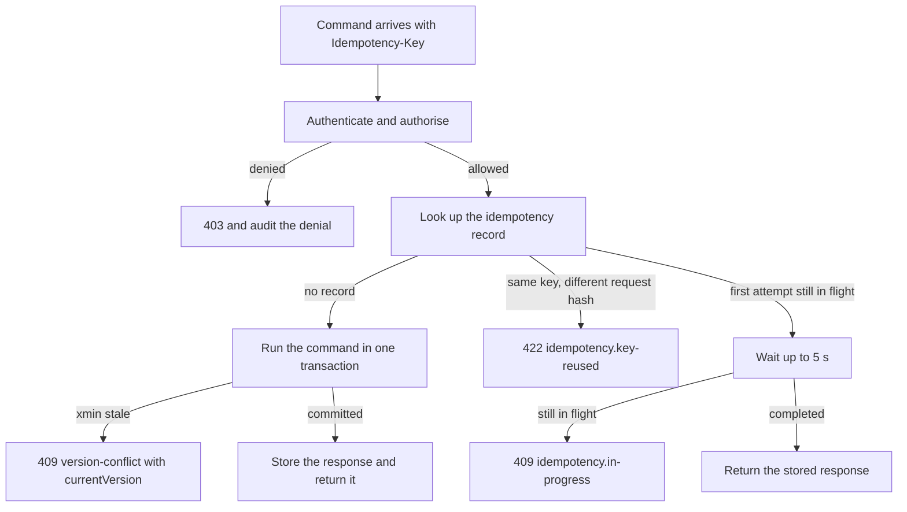
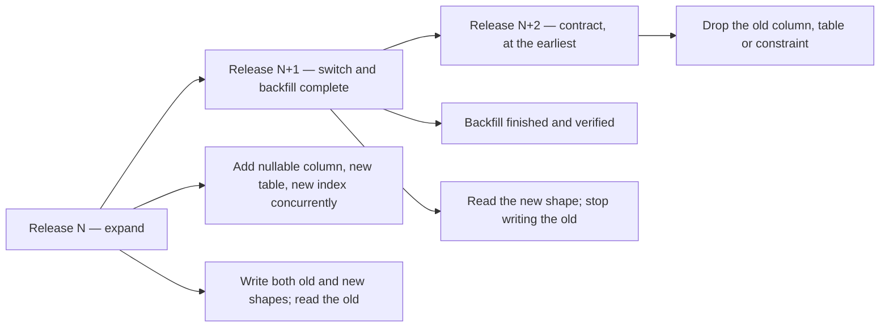

# HyFib Tailor 360 — Engineering conventions

This document fixes the conventions every module of HyFib Tailor 360 follows for money, time, identifiers,
concurrency, API versioning and migration compatibility. They are deliberately narrow: each one removes a class of
defect that is expensive to find later — a rupee lost to floating point, a due date that moves when the server is
restarted in another region, a label that leaks a customer's phone number, two devices overwriting each other in
silence, a released client that a database upgrade breaks. They expand plan decisions
[D9, D10, D11 and Section 5.2](../IMPLEMENTATION_PLAN.md) and apply to server code, the PWA, migrations, exports and
documents alike. Read with [`module-ownership.md`](module-ownership.md), [`invariants.md`](invariants.md) and
[`architecture-rules.md`](architecture-rules.md); terminology follows [`../prd/glossary.md`](../prd/glossary.md).

---

## 1. Money

### 1.1 Types and precision

The organisation is a single Indian legal entity trading in **INR only** (assumption A1). Every monetary value is a
`decimal` in code and a `numeric` in PostgreSQL. There is no exception anywhere in the system.

| Value class | Code type | Storage | Example | Notes |
| --- | --- | --- | --- | --- |
| Monetary amount — line amount, tax component, document total, payment, allocation, balance | `decimal` | `numeric(18,2)` | `1250.00` | Rounded to paise before it is stored |
| Unit rate and per-unit price, and every intermediate value inside a calculation | `decimal` | `numeric(18,4)` | `249.5000` | Four decimal places so a single rounding step happens at the end, not at each step |
| Tax rate and discount percentage | `decimal` | `numeric(6,3)` | `5.000`, `12.500` | Percentage, not a fraction |
| Stock quantity in the base unit | `decimal` | `numeric(18,4)` — **proposed, to be confirmed** by issue #38 | `2.7500` | Cloth is bought and issued in fractional metres |

Rules:

1. **Never floating point.** `float`, `double`, `real` and `double precision` are forbidden for money, quantities,
   rates and percentages, in C#, in SQL, in JavaScript and in any export. A unit test and a review checklist item
   cover this; the PWA never computes an amount that is then persisted.
2. **Money is not stored as an integer number of paise.** The type is `decimal`, so scaling tricks are unnecessary and
   would hide rounding.
3. **The client never computes an authoritative amount.** The PWA may display a provisional total for feedback, but
   the priced result always comes from Billing's `IPricingService`, and the stored snapshot is the server's.
4. Documents record the currency code `INR` explicitly, so reports, exports and accounting integrations are
   unambiguous. This is a recorded convention; issue #41 confirms it.

### 1.2 Rounding

| Step | Rule |
| --- | --- |
| Intermediate arithmetic | Keep at least four decimal places. Do not round between steps |
| Line amount and each line tax component | Round **half away from zero** to two decimal places — paise — exactly once, at the end of the line calculation |
| Document total | Sum the rounded line values. Never re-round a sum of already-rounded values |
| Document round-off | Round the document total to the nearest rupee under the configured rule, and record the difference as an explicit round-off value on the document. The round-off is shown, never absorbed silently |
| Allocation of a rounding difference across lines | Deterministic and repeatable: the same inputs always produce the same allocation |
| Reversal, credit note, refund | Recompute from the original snapshot's values, never from a re-rounded total |

The rounding mode is "half away from zero" — `MidpointRounding.AwayFromZero` — which is what "half-up" means for the
positive amounts this system handles, and is the behaviour the accountant's golden-master examples assert. The
document round-off rule and the valuation method are configuration confirmed under **OD-05**
(see [`../prd/assumptions-and-open-decisions.md`](../prd/assumptions-and-open-decisions.md)).

Every calculation stores the **price-list version and the tax configuration version** it used, in the calculation
snapshot (plan D10, `INV-INV-03`). A figure that cannot be recomputed from its snapshot is a defect.

### 1.3 GST composition

| Rule | Detail |
| --- | --- |
| Place of supply decides the scheme | Intra-state supply carries **CGST + SGST**; inter-state supply carries **IGST**. A line never carries both schemes (`INV-INV-04`) |
| Rates come from a version | The tax configuration version in force at the calculation, pinned on the snapshot; changing tax configuration never changes a posted document |
| Classification | HSN codes classify goods, SAC codes classify services such as stitching charges; both live on the tax configuration and, for goods, on the stock item |
| Cess | Configurable per tax code where it applies, as an additional component |
| Inclusive or exclusive pricing | A property of the price-list version, not of the endpoint or the screen |
| Registration | The branch GSTIN and state code come from Billing's `gst_registrations`, keyed by the branch, and appear on every document |
| Financial year | April to March, part of every document sequence key (section 3.2) |

### 1.4 Display and formatting

All user-facing money passes through the shared `formatters` module in the PWA — never through ad-hoc string
concatenation or a per-component `toLocaleString`. It renders `en-IN` grouping (lakh and crore), the rupee symbol and
two decimal places, and PDFs embed a Tamil-capable font so a document renders identically in either language.
Amounts in API payloads are unformatted decimal values; formatting is a presentation concern (see **COD-01** in
section 8 for the JSON representation).

---

## 2. Time

### 2.1 Storage

| Kind of value | Type | Rule |
| --- | --- | --- |
| Instant — `created_at`, scan time, posting time, session activity, delivery attempt | `timestamptz`, stored in **UTC** | Never `timestamp without time zone`; never a local-time string; never a formatted string |
| Business date — due date, holiday, financial-year boundary, report cut-off, stocktake date | `date`, always interpreted in the **owning branch's** timezone | The branch id travels with the date wherever it is evaluated |
| Duration — phase duration, SLA target, quiet-hours window, link expiry | Interval or integer minutes | Evaluated against the branch working calendar where the plan says so |

### 2.2 Branch timezone and working calendar

- Every branch carries an **IANA timezone identifier**, default `Asia/Kolkata` (plan D11). A fixed `+05:30` offset is
  never hard-coded, and conversions use a tz-database-backed API so a future branch outside India, or any tz-database
  amendment, needs no code change. India observes no daylight saving today; code must not assume that permanently.
- Every branch may carry a **working calendar** of working days and holidays. Due-date and SLA clocks skip
  non-working days where the calendar is configured to do so, so a Sunday does not consume a promise made to a
  customer.
- Display and report cut-offs are evaluated in the branch timezone. A "day" in a sales report is the branch's day.
- Quiet hours for notifications are evaluated in the customer's or branch's local time, never in UTC.
- Scheduled worker jobs are expressed in UTC, but any business schedule they evaluate — end of day, a scheduled
  report, a dispatch-authorisation expiry — is resolved in the branch timezone.

### 2.3 Financial year

The financial year runs **1 April to 31 March**. It is part of every document sequence key (section 3.2), of GST
reporting periods and of report period selectors. The token used inside a display number is proposed as the two-digit
start and end year, `2627` for 2026-27 — **proposed, to be confirmed** with issue #42 and the accountant
(**COD-03**).

### 2.4 Which clock is authoritative

| Timestamp | Source | Used for |
| --- | --- | --- |
| Server time via `IClock` | The web or worker host | Ordering, SLA arithmetic, sequence keys, audit, posting, custody chain |
| Client time | The device | Evidence only — recorded on scan events and offline-queue items, never used for ordering |
| Provider time | An external adapter | Evidence and reconciliation only |

An offline-queued scan records both the client time it happened and the server time it was received; the custody chain
orders by server time (`INV-CDY-08`). `IClock` is injected everywhere, so tests can control time; `DateTime.Now` and
`DateTime.UtcNow` are not called directly in module code.

### 2.5 Display formats

`dd-MM-yyyy` dates and a 12-hour clock in the branch timezone, produced by the shared `formatters` module. API
payloads carry ISO 8601 instants in UTC with the `Z` suffix, and business dates as `yyyy-MM-dd`. A screen never shows
a bare date without making the timezone unambiguous where it could matter — a due date on a cross-branch transfer, for
example, names the branch.

---

## 3. Identifiers

### 3.1 Resource ids

- **UUIDv7** (`Guid.CreateVersion7()`) is the primary key of every aggregate and the **only** identifier used in API
  paths, deep links and customer links (plan D9). Its time-ordered prefix keeps index locality good without leaking a
  count, and it is safe to generate on any host without coordination.
- Sequential integer ids are never exposed. A guessable identifier on an unauthenticated surface is a defect
  (issue #32).
- Object-storage keys are random and never derived from a business identifier (plan D4).

### 3.2 Human display numbers

Display numbers exist so people can talk to each other. They are allocated from per-branch — and, where noted, per
financial-year — sequences through Platform's `ISequenceAllocator` under a row lock, and are never reused.

| Record | Format | Sequence key | Allocated at |
| --- | --- | --- | --- |
| Customer | `C-<branch>-000001` | Branch | Creation |
| Estimate | `E-<branch>-<FY>-000001` | Branch + financial year | Issue |
| Order | `O-<branch>-<FY>-000001` | Branch + financial year | Confirmation |
| Garment job | `J-<branch>-<FY>-000001-01` | The order number plus a two-digit job index | Confirmation |
| Invoice | `INV-<branch>-<FY>-000001` — **interim, confirmed by issue #42 with the accountant** | Branch + financial year | Posting |
| Receipt | `R-<branch>-<FY>-000001` | Branch + financial year | Payment |

Rules:

1. A display number is **never a lookup key on an unauthenticated surface**. Authenticated staff may search by it;
   a customer link resolves by its own token, never by an order number.
2. Invoice numbers are allocated in order within a branch and financial year and are never reused; a cancelled
   invoice keeps its number (`INV-INV-02`).
3. A display number is allocated at the moment the record becomes real — posting, confirmation, issue — never when a
   draft is created, so drafts never burn numbers.

### 3.3 Barcode payloads

Payloads are opaque by design (plan D9, issue #35).

| Element | Rule |
| --- | --- |
| Shape | Namespace letter, hyphen, twelve characters: eleven random characters plus one check character |
| Alphabet | Crockford base32 — 32 symbols, no `I`, `L`, `O` or `U`, keyboard-wedge safe |
| Entropy | 55 bits in the random body |
| Check character | A Damm-style checksum over the 32-symbol alphabet, so the check character is itself an alphanumeric symbol |
| Namespaces | `G-` garment job, `S-` stock item, `I-` invoice, `R-` receipt |
| Example | `G-7K3M9QW2XZ4B`, where `B` is the check character |
| Decoding | Accepts lowercase and the confusable substitutions `I`/`L` → `1` and `O` → `0` before validation |
| Content | **No personal data, no display number, no meaning of any kind** (`INV-BID-04`) |
| Validation | The server re-validates namespace, check character, identity status and branch on every resolve and command. A client-side checksum pass is never trusted |

### 3.4 Request and event identifiers

| Header or field | Shape | Purpose |
| --- | --- | --- |
| `Idempotency-Key` | Client-generated UUID | Required on confirm, scan, post, pay, callback and webhook commands. Record key is `(principal_id, route template, key)` |
| `X-Correlation-Id` | UUID | Ties a request, its events, its logs and its traces together across hosts; echoed in every problem-details response |
| Causation id | UUID on an event | The event or command that caused this one |
| `client_event_uuid` | UUID on a scan | Deduplicates a replayed scan per actor (`INV-CDY-02`) |
| `X-Client-Version` | Semantic version | Checked against the minimum supported client (section 5.4) |

### 3.5 What must never be an identifier

Phone numbers, names, measurements, addresses and any other personal data are never used as a key, never embedded in
a barcode, a customer link, an object key, a filename or an export filename, and never appear in a log line or a
telemetry attribute.

---

## 4. Concurrency

### 4.1 The `xmin` optimistic concurrency token

Editable aggregates use PostgreSQL's system column `xmin` as their concurrency token, mapped by EF Core as a
concurrency property (plan D3, plan Section 4.4). Nothing needs to be maintained by hand, and any write — including
one made outside the application — changes it.

Append-only aggregates — scan events, ledger entries, payments, posted invoices, audit events — carry **no**
concurrency token, because no update path exists. Their protection is the `Idempotency-Key` record, a unique index and,
where an ordering matters, a row lock (section 4.4).

### 4.2 The `ETag` and `If-Match` contract

| Situation | Behaviour |
| --- | --- |
| `GET` of an editable aggregate | Response carries `ETag` — the aggregate's `xmin` value as a quoted string, for example `ETag: "48213"` |
| Update or command on an editable aggregate | Request must carry `If-Match` with that value |
| `If-Match` missing where it is required | `428 Precondition Required` — recorded convention, confirmed by issue #53 (**COD-05**) |
| `If-Match` present but stale | `409` with the conflict payload in section 4.3 |
| Command on an append-only aggregate | No `If-Match`; `Idempotency-Key` instead |
| Command whose subject is a **second** aggregate | That one's version travels in the request body as `<name>Version` and is checked inside the same lock. Missing or unusable → `400` with the module's `value-required` code; stale → the `409` of section 4.3 |

**A command that destroys or consumes a second aggregate needs a precondition on that one too.** `If-Match` is
defined over the resource the request URI names, and there is only one of those, so a command acting on a *pair*
can protect only half the pair with it — and the unprotected half is usually the one being consumed, which is the
half with no undo. The other version therefore goes in the body: `POST /customers/{survivor}/merge` carries
`mergedCustomerVersion`, the folded record's version as the caller read it from its own `GET`.

A body-carried version is **not** an `If-Match` value, and the difference is not cosmetic. `If-Match` has a
wildcard — `*`, meaning "any current representation" — and there is no such thing as "any version" of a record
somebody approved destroying, so `*` is refused rather than honoured. Read the field as a concrete version and
compare it with `Equals`; do not route it through `EntityTag.TryParse` or `EntityTag.Matches`, both of which exist
for the header and both of which implement the header's wildcard.

The two halves also **refuse differently**, because they send the caller to different records. A stale addressed
resource is the 409 of section 4.3: its own code, `currentVersion`, and the response's `ETag`. A stale second
aggregate needs its own code, and reports that aggregate's current version under the name of the body field it has
to be resent in — never as `currentVersion`, and never as an `ETag`, both of which describe the resource named in
the request URI. A client sent to re-read the wrong record finds the version it already holds and has nothing to
show the person.

### 4.3 The 409 contract

A conflict is answered with RFC 9457 problem details, the shared envelope defined by issue #53, carrying the module's
error code, the correlation id and the **current version** so a client can re-read and merge without a second
round trip.

```json
{
  "type": "urn:tailor360:problem:orders.version-conflict",
  "title": "This record changed since you opened it",
  "status": 409,
  "code": "orders.version-conflict",
  "detail": "The garment job was updated by another user. Reload to see the current values.",
  "instance": "/api/v1/orders/garment-jobs/0192f3c1-9b1e-7a44-9a1b-1f9a0c2e77d1",
  "correlationId": "5b2c1a9e-1f0d-4a7c-9e6f-2b8d3c4a5e6f",
  "currentVersion": "48219",
  "currentEtag": "\"48219\"",
  "retryable": false
}
```

Error codes follow `<module>.<kebab-case-reason>`, matching the codes the plan already fixes —
`idempotency.key-reused` (422), `idempotency.in-progress` (409), `custody.event-conflict` (409),
`media.unavailable` (503). The registry of problem types lives with the API documentation.

The PWA's contract for a 409 is fixed by the design system: show the current value, never discard the user's typed
input, and let the user choose. A retry after a conflict reuses the **same** `Idempotency-Key`.

### 4.4 Serialisation points

Where optimistic concurrency is not enough because the rule spans rows, the design names one explicit serialisation
point rather than relying on transaction isolation.

| Rule | Serialisation point |
| --- | --- |
| Stock is never oversubscribed | Row lock on the `(item, location)` balance row (`INV-STK-04`) |
| Invoice numbers are ordered and unique | Row lock on the document sequence row (`INV-INV-01`) |
| Two scans of one garment do not interleave | Row lock on the job's materialised custody row (section 4.8 of [`invariants.md`](invariants.md)) |
| A draft is consumed once | Conditional update on `consumed_at IS NULL` (`INV-MSR-02`) |
| A cashier session closes once | Conditional update on `closed_at IS NULL` (`INV-CSH-01`) |
| One active barcode identity per job | Partial unique index (`INV-BID-02`) |
| One outbox message per aggregate dispatched in order | `FOR UPDATE SKIP LOCKED` claim that excludes an aggregate with an older unprocessed message (plan D6) |

### 4.5 Relationship to idempotency

Optimistic concurrency answers "did someone else change this?"; idempotency answers "did I already do this?". Both are
required on retried commands, and the order of operations is fixed (plan Section 4.4):



Authentication and authorisation always run **before** the idempotency lookup, so a replay by a revoked or
unauthorised principal is refused rather than served from the store. Idempotency records are retained for seven days,
which must exceed the offline queue's maximum age plus the worker retry horizon.

### 4.6 Where this is implemented

The mechanism behind sections 4.1 to 4.5 — the record store and its lease, the `RequireIdempotency()` and
`RequireIfMatch()` endpoint declarations, the problem envelope they answer with, and the request-timeout catalogue —
is described for an operator in [`../platform/idempotency-and-concurrency.md`](../platform/idempotency-and-concurrency.md),
which also records what the mechanism does **not** close and which guard each module owes on top of it.

---

## 5. API versioning

### 5.1 Shape

- Staff and PWA surface: `/api/v1/{module}/{resource}`; commands are `POST` sub-resources such as
  `/api/v1/orders/{id}/confirm`. Cursor pagination, `filter[...]`, `sort` and `fields` parameters, problem-details
  errors, `X-Correlation-Id` on every request and response (plan Section 5.2).
- Third-party and trusted-client surface: `/api/ext/v1/**`, authenticated separately by API key or OAuth client
  credentials, never by the session cookie.
- The **major version lives in the URL**. There is no header-based or media-type-based version negotiation.

### 5.2 Additive-only within a major version

| Change | Status inside `v1` |
| --- | --- |
| New endpoint | Allowed |
| New optional request field with a safe default | Allowed |
| New response field | Allowed |
| New optional query parameter | Allowed |
| Relaxing validation | Allowed |
| New value in a response enum | **Breaking**, unless the field is documented as open-ended and the generated client tolerates unknown values |
| Removing or renaming a field, endpoint or parameter | Breaking |
| Changing a field's type, format, nullability or unit | Breaking |
| Making an optional field required, or tightening validation | Breaking |
| Changing a status code, an error code or the meaning of a value | Breaking |
| Changing default sort, default page size or default filter semantics | Breaking |

Enforcement is mechanical, on every pull request: Spectral lints the OpenAPI document, `oasdiff` fails the build on an
undocumented breaking change, the endpoint inventory test fails on an endpoint that is not in the specification, and
the PWA's generated client is regenerated so a contract change surfaces as a TypeScript error (plan Section 5.1
item 5).

### 5.3 Deprecation

1. Mark the endpoint or field `deprecated: true` in OpenAPI, naming its replacement in the description.
2. Return `Deprecation` and `Sunset` response headers on the deprecated surface.
3. Keep it working for the deprecation window: **proposed, to be confirmed** — at least two minor releases and at
   least 90 days (**COD-02**).
4. Remove it only in the next major version, `v2`, which is served alongside `v1` for the window.

Because the only client at launch is the same-origin PWA, whose version is known to the server (section 5.4),
removal can be coordinated precisely; that is a convenience, not a licence to skip the window once
`/api/ext/v1/**` has an external consumer.

### 5.4 Client version handshake

Every request from the PWA carries `X-Client-Version`. The server compares it against the configured minimum
supported client and answers `426 Upgrade Required` when it is too old; the PWA turns that into an update prompt
driven by `GET /api/version`. The minimum supported client is raised **only in the release after** the change that
requires it, so a browser holding the previous build is never bricked by a deployment (plan Section 4.7).

### 5.5 Integration event versioning

Integration events are versioned independently of the HTTP API: `<module>.<event-name>.v<major>`, for example
`orders.order-confirmed.v1`, each with a JSON Schema and an example under `docs/integration/events/`. Within a major
version only additive changes are permitted. A breaking change publishes a new major **alongside** the old one for the
deprecation window, and subscribers migrate within it. Payloads carry identifiers, codes, statuses, timestamps,
amounts and branch codes only, unless the event is classified personal and the subscriber is approved for it.

---

## 6. Migration compatibility

### 6.1 The rule

Migrations are **forward-only**, per module, and every release must run against the previous release's database and
the next release's database. Concretely:

> **Expand in release N. Switch reads in release N+1. Contract no earlier than release N+2.**

This is what makes two things possible at once: rollback to release N while the database is already at N+1, and a
deployment that applies migrations before the new containers are healthy.



### 6.2 What each phase may do

| Phase | Permitted | Forbidden |
| --- | --- | --- |
| Expand — release N | Add a nullable column; add a table; add an index with `CREATE INDEX CONCURRENTLY` outside a transaction; add a permissive check; start dual-writing | Dropping or renaming anything; making a new column `NOT NULL` without a default that old code also writes |
| Switch — release N+1 | Complete and verify the backfill; read the new shape; stop writing the old shape; add the `NOT NULL` or the tightened constraint once the data supports it | Dropping the old shape |
| Contract — release N+2 or later | Drop the old column, table, constraint or index | Contracting earlier than N+2, or in the same release as the expand |

### 6.3 Rules that hold in every phase

1. **Rename is never a rename.** It is add, dual-write, backfill, switch, drop — across three releases.
2. **A large backfill is a job, not a migration.** Migrations run at startup and must be fast; a backfill over a large
   table is an idempotent, resumable worker job with a completion check that release N+1's startup asserts.
3. **No long-blocking DDL.** Indexes are created concurrently; a lock-taking `ALTER` is checked against table size and
   split if necessary.
4. **The startup check tolerates applied-but-unknown migrations**, so release N runs against a database at N+1 and
   rollback works (plan Section 4.7).
5. **Migration ownership follows module ownership.** A migration touches only its own schema
   ([`module-ownership.md`](module-ownership.md), section 6).
6. **Append-only protection survives migration.** A migration that adds an append-only table adds its trigger in the
   same migration, owned by `t360_migrator`, with the application role granted `INSERT` only.
7. **Reference data is not a migration.** Seed and reference data are applied by `init-reference-data`; production
   refuses synthetic seeding unconditionally.

### 6.4 Pull-request checklist for a migration

Every pull request carrying a migration states, in `docs/dev/migrations.md` and in the PR evidence:

- which phase it is — expand, switch or contract — and, for a contract, which release did the expand;
- the migration output from a dry run against a restored database snapshot;
- the rollback or restore note: what happens if release N is redeployed against this database;
- confirmation that the previous release's code still runs against the new schema;
- for an index or a lock-taking statement, the expected duration on production-sized data.

Rollback is rehearsed with the database at N+1 **and** with the previous PWA build cached in a browser, because a
service worker outlives a deployment (plan Section 4.7).

---

## 7. Naming and structural conventions

Stated briefly here; the full list is plan Section 5.2, and the enforced subset is in
[`architecture-rules.md`](architecture-rules.md).

| Area | Convention |
| --- | --- |
| Schemas | `identity`, `customers`, `catalog`, `media`, `orders`, `custody`, `inventory`, `billing`, `reporting`, `notifications`, `integration`, `platform` — one per module |
| Tables and columns | `snake_case`; every table carries `id`, `organisation_id`, `branch_id` where scoped, `created_at`, `created_by`, `updated_at`, `updated_by` and `xmin` |
| Endpoints | `/api/v1/{module}/{resource}`; commands as `POST` sub-resources |
| Domain events | Past tense, inside the module |
| Integration events | `<module>.<event-name>.v<major>` with a JSON Schema and an example |
| Deletion | No soft-delete of business records; deactivate, retire or cancel. Hard deletion only for approved retention classes |
| Logging | No request bodies, tokens, measurements, image bytes, rendered message bodies, recipient addresses or card data; correlation and causation ids everywhere |
| Tabular exports | Every cell beginning with `=`, `+`, `-`, `@`, a tab or a carriage return is prefixed with `'` and quoted; UTF-8 with BOM; row caps per file |
| Frontend | TypeScript strict, no `any`; all user-facing text through `react-intl` message ids; all formatting through the shared `formatters` module |

---

## 8. Open decisions

Raised against [Section 11 of the plan](../IMPLEMENTATION_PLAN.md); each is carried into the owner decision
register in [`../prd/assumptions-and-open-decisions.md`](../prd/assumptions-and-open-decisions.md) the next time that
document is amended. Each carries an interim
position, so no convention above is undefined while the decision is open.

| ID | Question | Interim position | Resolves under | Owner | Raised |
| --- | --- | --- | --- | --- | --- |
| **COD-01** | How is money represented in JSON — a number or a string? | A JSON number serialised from `decimal` with a fixed scale — two decimal places for amounts, four for unit rates — never from a floating-point type. The generated TypeScript client maps it to a string-backed money type so the browser never does decimal arithmetic. | Issues #41 and #53 | Backend lead with the frontend lead | 2026-09-04 |
| **COD-02** | How long must a deprecated endpoint, field or event major version keep working? | At least two minor releases and at least 90 days — **proposed, to be confirmed** | Issue #19 with issue #53 | Technical reviewer | 2026-09-04 |
| **COD-03** | The invoice number series format, the financial-year token, and whether the series must be strictly gapless for GST purposes | `INV-<branch>-<FY>-000001` with `FY` as the two-digit start and end year, gapless within a branch and financial year | Plan Section 11 item 5 (**OD-05**) with issue #42, co-signed by the accountant | Business owner | 2026-09-04 |
| **COD-04** | The stored precision of stock quantities | `numeric(18,4)` — **proposed, to be confirmed** | Issue #38 | Backend lead | 2026-09-04 |
| **COD-05** | ~~Whether a missing `If-Match` on an endpoint that requires it returns `428 Precondition Required` or `400`~~ **Settled by #53**: `428 Precondition Required`, so the client can distinguish "you forgot the precondition" from "your payload is wrong". Implemented in `ConcurrencyResults.PreconditionMissing` and asserted by `ConcurrencyContractTests` | — | Issue #53 | Backend lead | 2026-09-04 |

---

## 8a. Where the HTTP surface is designed

This document owns money, time, identifiers, concurrency, versioning and migration compatibility. How an
individual endpoint is *shaped* — resource against command, the collection envelope, filtering, sorting, sparse
fields, the request limits, the headers every request carries — is [`../api/conventions.md`](../api/conventions.md),
which defers to this document wherever the two touch. The published contract those conventions produce is
[`../api/openapi.v1.json`](../api/openapi.v1.json), and the gates around it are
[`../api/openapi-gates.md`](../api/openapi-gates.md).

---

## 9. Maintenance

This document is amended by pull request, in the same pull request that changes a convention. A change here changes
every module, so it needs an architecture decision record in [`../adr/`](../adr/) when it reverses a plan decision
(D9, D10, D11 or Section 5.2), and it must be reflected the same day in
[`architecture-rules.md`](architecture-rules.md) where an assertion exists, in `CLAUDE.md`, in the affected module
READMEs and in [`../prd/glossary.md`](../prd/glossary.md) where a term changes meaning. Numbers marked **proposed, to
be confirmed** stay marked until the named owner confirms them in writing.
