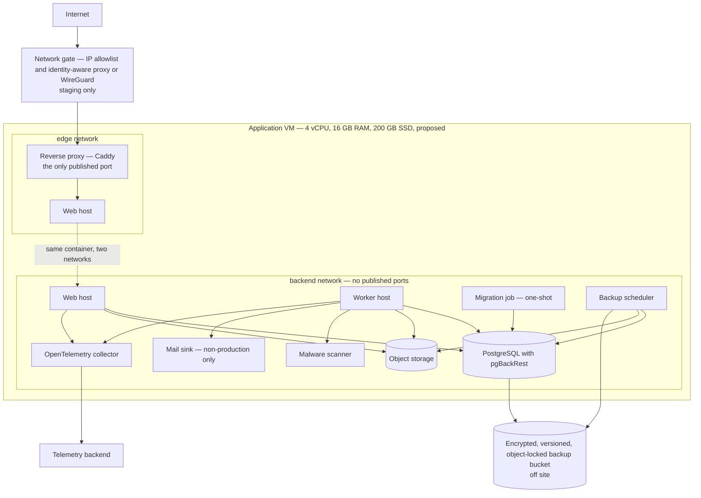

# Deployment view — HyFib Tailor 360

This document places the containers of [`container.md`](container.md) onto real infrastructure. It describes the
Docker Compose baseline for a single virtual machine, the networks and volumes it uses, which ports are published
and which are internal, how secrets reach a container as files, how backups are taken, how the interim staging
environment is gated, and what has to change — and what does not — to run the identical images under Kubernetes. It
follows [`../IMPLEMENTATION_PLAN.md`](../IMPLEMENTATION_PLAN.md) Section 4.7; the hardened environments and the
infrastructure-as-code that provisions them arrive with issue #59, and backups and disaster recovery with issue #60.

The single rule this document exists to make unmissable is in Section 8: **PostgreSQL, the object storage and the
malware scanner are never published beyond the internal network, in any environment.**

---

## 1. Baseline topology — one virtual machine

In production the gate is replaced by a public hostname with automatic TLS through ACME DNS-01, which works behind
NAT and therefore behind a shop's router. In interim staging the gate is the only way in and there is no public
hostname at all until authentication has shipped — see Section 9.

---

## 2. Images

| Image | Contains | Built by |
| --- | --- | --- |
| `tailor360-web` | The ASP.NET Core host together with the compiled PWA assets it serves | CI, once per commit |
| `tailor360-worker` | The .NET Worker Service | CI, once per commit |
| `tailor360-cli` | `migrate`, `init-reference-data`, `seed-synthetic` (never in production), `replay-outbox`, `flags set`, `rebuild-projection`, `create-owner` | CI, once per commit |

Every application image is **non-root**, runs with a **read-only root filesystem**, drops all capabilities, sets
`no-new-privileges`, pins its base image, and ships with an SBOM, a signature and provenance. The hosts write
nothing to disk: logs go to standard output and the Data Protection key ring lives in
`platform.data_protection_keys`, not on a volume. A small `tmpfs` on `/tmp` covers the framework's scratch needs.

Third-party images — PostgreSQL, MinIO, ClamAV, Caddy, the collector, Mailpit — are pinned to an exact patch
release rather than a floating major tag, so an unnoticed upgrade can never be the difference between two
environments.

---

## 3. Networks

| Network | Purpose | Members | Internet-reachable |
| --- | --- | --- | --- |
| `edge` | Carries only proxy-to-application traffic | Reverse proxy, web host | The proxy's published port only |
| `backend` | Everything else: data, storage, scanning, telemetry, background work | Web host, worker, migration job, PostgreSQL, object storage, malware scanner, collector, backup scheduler, mail sink | No |

The web host is the **only** container on both networks. That is what makes "the only route in is through the web
host" a property of the topology rather than a promise.

Neither network is declared `internal: true`, and the reason is deliberate and worth recording: the malware
scanner's `freshclam` must refresh its signature database and the collector must reach the telemetry backend.
Isolation is therefore achieved by **publishing no ports** on the backend services and by keeping the reverse proxy
off the backend network — not by cutting egress, which would break both of those jobs. Egress from the worker is
narrowed separately by the outbound HTTP policy and, in the hardened environments of issue #59, by a dedicated
proxy or NAT and a network policy.

---

## 4. Published versus internal ports

| Service | Container port | Development | Interim staging | Production |
| --- | --- | --- | --- | --- |
| Reverse proxy | 8080, later 443 | `127.0.0.1:8080` | Gated address only, `${TAILOR360_BIND_ADDRESS}` defaulting to `127.0.0.1` | Public, TLS |
| Web host | 8080 | Internal, or loopback when run from the SDK | Internal | Internal |
| Worker host health | 8081 | Internal | Internal | Internal |
| **PostgreSQL** | 5432 | `127.0.0.1:5432` for local tooling and integration tests | **Not published** | **Not published** |
| **Object storage API** | 9000 | `127.0.0.1:9000` | **Not published** | **Not published** |
| **Object storage console** | 9001 | `127.0.0.1:9001` | **Not published** | **Not published** |
| **Malware scanner** | 3310 | `127.0.0.1:3310`, behind a profile | **Not published** | **Not published** |
| Collector OTLP and health | 4317, 4318, 13133 | `127.0.0.1`, behind a profile | Internal | Internal |
| Mail sink | 1025 SMTP, 8025 interface | `127.0.0.1` | Interface on the gated address only | Not deployed |

Every development port is bound to `127.0.0.1` on purpose: a developer laptop is regularly on an untrusted shop,
home or café network, and none of these services is safe to expose there. Administrative access to a deployed
database or bucket is over the tunnel plus `docker compose exec`, which leaves an audit trail, never over a
published port.

---

## 5. Volumes

| Volume | Holds | Backed up | Notes |
| --- | --- | --- | --- |
| `postgres-data` | The cluster's data directory | Yes, by base backup plus continuous WAL to the off-site bucket | Initialised with `--data-checksums`, so silent corruption is visible rather than mysterious |
| `minio-data` | Media originals and derivatives, rendered documents, governed exports | Yes, by versioning plus an off-site copy | Non-current versions retained at or above the database backup retention |
| `clamav-data` | The signature database | No | Rebuildable by `freshclam`; losing it costs a refresh, not data |
| `caddy-data`, `caddy-config` | ACME account and certificates | No | Reissued automatically |
| `mailpit-data` | Captured non-production mail | No | Synthetic data only |

The application hosts have **no** data volume. Everything they need to survive a restart is in PostgreSQL or the
object store, which is what makes them replaceable rather than precious.

---

## 6. Secrets as files

Secrets reach a container as **files under `/run/secrets`**, read through `AddKeyPerFile` and validated at
start-up. They never appear in a compose `environment:` block, in an image, in the repository, or in logs, problem
details, health payloads or telemetry — the last of which is tested with sentinel values. `.env` files carry
non-secret settings only.

| Secret file | Consumed by | Contents |
| --- | --- | --- |
| `ConnectionStrings__Tailor360` | Web host, worker | The application role's connection string. The runtime role holds DML only; DDL belongs to the migrator |
| `ObjectStorage__AccessKey`, `ObjectStorage__SecretKey` | Web host, worker | Per-module-prefix credentials for the S3 API |
| `postgres_password` | PostgreSQL | Read by the image through `POSTGRES_PASSWORD_FILE` |
| `minio_root_user`, `minio_root_password` | Object storage, bucket bootstrap | Read through the `_FILE` variants |
| Data Protection key-encryption key | Web host, worker | The certificate or KMS key that protects the key ring. Rotated every 90 days; the ring is loaded as part of `/health/startup`, and start-up fails if it is on the local file system outside Development |
| Backup cipher key | Backup scheduler and PostgreSQL image | **Escrowed separately** in a password manager or KMS, never only on the VM, and never in the same backup set as the data it protects |
| Provider credentials | Worker | Present only once a provider is enabled by feature flag with a support-ownership document. Interim staging holds none |

Files are root-owned on the VM, readable by the container user, and placed by the deploy script from the operator's
secret store.

---

## 7. Backups

Backup design is split between two places for a reason that is easy to get wrong: PostgreSQL invokes
`archive_command` itself, so **continuous WAL archiving cannot live in a sidecar**. pgBackRest is therefore
installed **inside the PostgreSQL image**, while the **backup scheduler container** drives the periodic work.

| Concern | Where it runs | Detail |
| --- | --- | --- |
| Continuous WAL archiving | Inside the PostgreSQL container | `archive_command` streams to the off-site bucket |
| Base backups | Backup scheduler | On a schedule, using the credentials it alone holds |
| Media off-site copy | Backup scheduler | Bucket versioning plus a copy to a second location |
| Retention | **Bucket lifecycle policy**, never `pgbackrest expire` | The archiver identity has no delete right, so a compromised application or archiver cannot destroy history |
| Freshness monitoring | Worker | Reads `pg_stat_archiver` and the scheduler's metrics. **The worker holds no backup credentials** |
| Verification | Weekly automated restore on the **staging** VM | Never on production, never on a GitHub-hosted runner |
| Retention period | 35 daily plus 12 monthly, proposed | Final figures are set by issue #19 and the accountant's GST record retention answer, OD-05 and OD-08 |
| Managed-database variant | Provider PITR plus a nightly logical dump into the same object-locked bucket | Selected with the hosting decision, OD-02 |

An **external dead-man's switch** watches the backup job, and an external uptime check watches the VM, so that "the
backup stopped running" and "the machine is down" can never be silent failures of the very system that would
otherwise have to report them.

---

## 8. Rules that do not vary by environment

These are properties of the deployment, not settings a particular environment may relax.

1. **PostgreSQL, the object storage and the malware scanner publish no port outside the internal network** — not in
   staging, not in production. In development they are bound to `127.0.0.1` only, for local tooling and integration
   tests. There is no environment in which they are reachable from another machine.
2. **The reverse proxy is the only container with a published port** in a deployed environment.
3. **The PWA never receives an object-storage URL.** Media is streamed by an API endpoint that re-authorises every
   request.
4. **Health probes are internal.** The target is that only `/health/live` is reachable from outside; the interim
   baseline is stricter, answering `404` to every `/health/**` path at the proxy, with external liveness checked
   through `GET /api/version`. Issue #59 reconciles the two.
5. **Secrets are files, never environment values.**
6. **Production refuses synthetic seeding unconditionally**, and no production secret exists in the repository.
7. **The runtime database role never holds DDL.** Migrations run as the migrator role in a one-shot job that the
   application containers wait on.

---

## 9. Environments and the interim staging gate

| Environment | Runs on | Data | Access | Purpose |
| --- | --- | --- | --- | --- |
| Development | Developer machine, Compose backing services with the hosts run from the SDK | Synthetic | Loopback only | Hot reload, a debugger and readable stack traces |
| Test | Ephemeral CI containers | Synthetic | None | Integration, contract and end-to-end runs with Testcontainers |
| **Interim staging** | One VM, from the end of wave 1 | **Synthetic only** | **Gated — see below** | Real-device and real-printer rehearsal, which cannot run in CI |
| Staging | Provisioned by infrastructure as code, issue #59 | Synthetic | Gated, then named | Release rehearsal, the weekly automated restore test and disaster-recovery game days |
| Production | Provisioned by infrastructure as code | Real | Public hostname with TLS | The shop |

### 9.1 The interim staging gate

Interim staging exists because real labels, real thermal printers, real hardware scanners and real phones cannot be
tested in a continuous integration runner, and waiting for the hardened environments of issue #59 would push that
discovery to the end of the project. It is created early, and it is therefore gated hard:

- **Access is gated in front of the stack, not by it.** Reaching the reverse proxy requires both an IP allowlist for
  the shop networks and either an identity-aware proxy or WireGuard or Tailscale enrolment for phones and tablets.
  The application's own login is a second factor, never the only one.
- **There is no public hostname** until authentication has merged. The proxy is published on the VM's loopback or
  WireGuard address and reached through the tunnel; TLS is terminated by the gate, which is why the site address is
  a bare port rather than a domain until the hostname decision is taken.
- **Synthetic data only**, seeded by `seed-synthetic`. No production secrets and no provider credentials: email goes
  to the mail sink, and the payment, SMS and WhatsApp adapters stay on their fakes, so no message can reach a real
  customer and no money can move.
- **Crawler-proofed** with `X-Robots-Tag: noindex, nofollow, noarchive, nosnippet`, because synthetic customer data
  must never appear in a search result.
- **Its own Data Protection discriminator and its own database**, so a session cookie, an anti-forgery token or any
  protected payload from staging can never be decrypted by production, or the reverse, even if an image or a backup
  is copied by mistake.
- **The real malware scanner runs here**, not the fake, because staging is where the media pipeline is rehearsed
  before it reaches a shop.

The risk this gate answers is recorded in plan Section 10: a pre-baseline staging environment exposed on the
internet would be an invitation to credential theft and early compromise.

---

## 10. Release, promotion and rollback

| Step | Rule |
| --- | --- |
| Build | Once, in CI. Nothing is ever built on a VM |
| Promote | The **identical image digest** moves between environments, after signature and provenance verification |
| Deploy | **Pull-based**: a `tailor360-deploy` script on the VM verifies the cosign signature, runs the one-shot `migrate` service, then `docker compose up -d --wait --pull always`. There is no GitHub-held SSH key to production |
| Migrations | Forward-only and backward compatible with the previous release — expand, migrate, contract. The start-up check tolerates applied-but-unknown migrations, so release N runs against a database already at N+1 |
| Swap window | Compose has no rolling update, so a web container swap costs a few seconds of `502`s. This is accepted against the availability target and minimised with `--wait` and proxy retry. Blue-green arrives with the Kubernetes path |
| Rollback | Redeploy tag N. Rehearsed with the database at N+1 **and** with PWA N+1 cached in a browser. The minimum supported client version is raised only in the release *after* the change that requires it, so a rollback never strands an installed client |

---

## 11. The Kubernetes-ready path

The same three images run under Kubernetes without a code change. The table records what carries over unchanged,
what is replaced by a platform primitive, and what genuinely improves.

| Compose concept | Kubernetes equivalent | Change required |
| --- | --- | --- |
| `web` service | Deployment plus Service | None in the image. Two or more replicas require recomputing the connection budget or introducing PgBouncer in transaction mode, and revalidating the session-revocation cache per request |
| `worker` service, `--scale worker=2` | Deployment with replicas | None. Leases, `SKIP LOCKED` claims and per-instance heartbeats already make the worker horizontally safe |
| One-shot `migrate` with `service_completed_successfully` | Job plus an init container or a pre-install hook | None in the image |
| Health checks | `livenessProbe` → `/health/live`, `startupProbe` → `/health/startup`, `readinessProbe` → `/health/ready` | None. The probe semantics were designed for both from the start |
| In-process watchdog and `restart: unless-stopped` | The kubelet restarting on a failed liveness probe | The watchdog becomes redundant but harmless |
| Reverse proxy container | Ingress controller | Configuration only |
| `secrets:` files | Secret mounted as files | None: the application already reads `/run/secrets` as files, not environment values |
| Named volumes | PersistentVolumeClaims, or managed PostgreSQL and a managed bucket | The managed options remove containers C5, C6 and C10 from the cluster entirely, which is the likely production shape under OD-02 |
| Backend network isolation | NetworkPolicy | An improvement, not a substitute: no data service is published either way |
| Rolling swap with a brief `502` window | Rolling update or blue-green | The availability improvement the Compose baseline knowingly defers |
| `edge` and `backend` networks | Namespace plus NetworkPolicies | Same intent, stronger enforcement |

Provisioning is Terraform for a cloud deployment or Ansible for on-premises; both are chosen by the hosting
decision. Migration to Kubernetes is a deployment change and needs no architecture decision record of its own,
because portability was a requirement of the container design from the outset; a change of *database* or *storage*
ownership model would need one.

---

## 12. Open decisions affecting this view

| Ref | Question | Owner | Status |
| --- | --- | --- | --- |
| OD-02 | Hosting model and indicative monthly budget: cloud and which provider, or on-premises. Fixes the infrastructure-as-code tooling, the backup destination, the TLS approach, and whether PostgreSQL and the object store are self-hosted or managed | Business owner | Open, raised 2026-09-03, needed before W1 exit |
| OD-05 | The statutory retention period for GST records, which sets the lower bound on backup retention | Business owner, co-signed by the accountant | Open, raised 2026-09-03, needed before W4 |
| OD-08 | Retention periods for measurements, images, feedback free text, notification bodies, logs and backups | Business owner, co-signed by the accountant | Open, raised 2026-09-03, needed before W1 exit |
| OD-14 | Telemetry backend: a collector on the application VM shipping to a hosted backend, or the self-hosted stack on a separate VM | Business owner | Open, raised 2026-09-03, needed before W5 |
| OD-15 | Who receives priority-one pages out of hours and on which channel, from which the alert receivers are built | Business owner | Open, raised 2026-09-03, needed before W5 |
| — | The VM sizing in Section 1, the 35-daily-plus-12-monthly retention, and the RPO and RTO this topology implies | Issue #19, per candidate hosting model | **Proposed, to be confirmed**; the signed figures land in [`../nfr/slo.md`](../nfr/slo.md) |

---

## 13. Related documents

| Document | What it adds |
| --- | --- |
| [`container.md`](container.md) | What each container in Section 1 is responsible for, how it scales and how it fails |
| [`context.md`](context.md) | The trust boundary these networks implement and what crosses it |
| [`components.md`](components.md) | Inside the web host, including the configuration and secret loading described in Section 6 |
| [`architecture-rules.md`](architecture-rules.md) | The rules that are asserted by tests rather than by documents |
| [`../nfr/slo.md`](../nfr/slo.md) | Availability, RPO and RTO per candidate hosting model, with the cost band each requires |
| [`../IMPLEMENTATION_PLAN.md`](../IMPLEMENTATION_PLAN.md) | Section 4.7 for the topology, Section 10 for the risks this gating answers |
