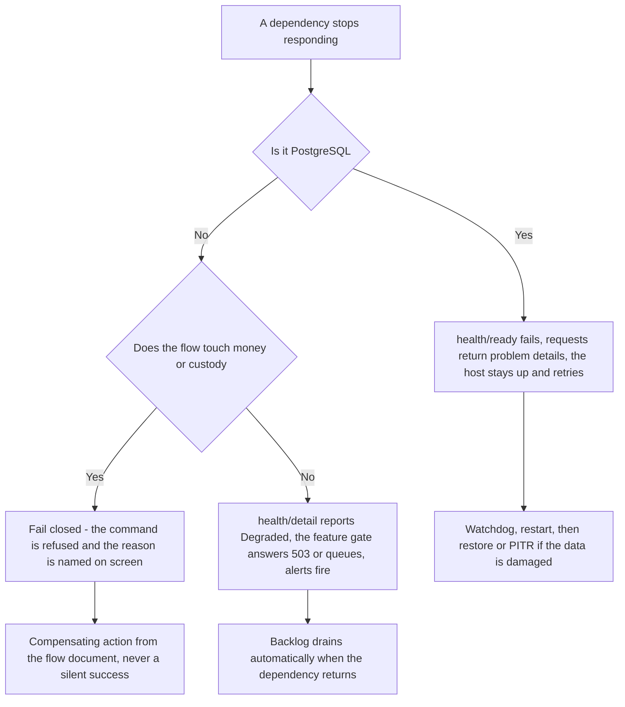

# Failure modes — what happens when a dependency is down

This document states, for each dependency HyFib Tailor 360 relies on, exactly what the system does when that
dependency fails: what a member of staff sees on the screen in front of them, what each health endpoint reports, what
happens to data that was in flight, and how the system is brought back. It is the failure-mode evidence item for issue
#18 and the counterpart to the four representative flows in [`sequences/`](sequences/), each of which names the
failures specific to its own steps. The probe semantics, the degradation rules and the recovery mechanisms are fixed by
[`../IMPLEMENTATION_PLAN.md`](../IMPLEMENTATION_PLAN.md) Sections 4.4 and 4.7; the containers are described in
[`container.md`](container.md) and their operation in [`deployment.md`](deployment.md). Numeric targets stated here as
**proposed, to be confirmed** are settled by issue #19 in `../nfr/slo.md`.

---

## 1. The five principles

| # | Principle | Consequence |
| --- | --- | --- |
| 1 | **Money and custody fail closed.** | An unknown answer blocks a dispatch, a payment or a posting. `IDispatchEligibilityQuery` returning `NotEvaluated` blocks; a provider timeout is `unknown`, never success |
| 2 | **Readiness never depends on a non-essential dependency.** | Only PostgreSQL reachability is a readiness condition. Object storage, the malware scanner, providers, outbox lag and backup age report **Degraded** on the detail endpoint, drive alerts and gate features, and never remove a host from rotation |
| 3 | **Nothing is silently lost, and nothing is silently succeeded.** | Every outbox message is at-least-once with a dead letter and an audited operator replay; every suppressed notification records its reason; a queued scan is shown as "not yet sent", never as done |
| 4 | **Degradation is explicit on the screen.** | A persistent, non-dismissable network banner, an `OfflineBlockedAction` state for anything that must not be queued, and a `RetryableError` whose Retry reuses the same `Idempotency-Key` and never discards typed input. Toasts are never used for scan results, sync state or actionable errors |
| 5 | **Recovery is rehearsed, not improvised.** | Restore, PITR, rollback and DR exercises are release gates, and an external dead-man's switch means "the machine is down" and "the backup job is dead" are never silent |

## 2. Probe semantics

| Endpoint | Asserts | Depends on the network | Exposed externally |
| --- | --- | --- | --- |
| `/health/live` | The process is responsive and the dispatcher loop is ticking, from in-process flags only | No | Yes, through the reverse proxy — and it is the only one |
| `/health/startup` | Configuration validated, no unapplied migration, the Data Protection key ring loaded. On the worker, additionally one heartbeat written | Yes, at startup | No |
| `/health/ready` | PostgreSQL reachable — `SELECT 1` with a two-second timeout — and nothing else | Yes | No |
| `/health/detail` | Every registered check as Healthy, Degraded or Unhealthy, including storage, the scanner, providers, outbox and projection lag and backup age | Yes | No — internal network, or `admin.health.read` |

Compose does not restart an `unhealthy` container, so each host runs an in-process watchdog: three consecutive
liveness failures exit with code 70 and the container's `restart: unless-stopped` policy brings it back. Under Compose
a web container swap costs a few seconds of 502 responses, which is accepted against the availability target and
minimised with `--wait` and proxy retry; blue-green arrives with Kubernetes.

## 3. The dependency matrix

| Dependency | Readiness | Detail endpoint | Commands still possible | Queued or deferred | Blocked outright |
| --- | --- | --- | --- | --- | --- |
| PostgreSQL | **Unhealthy** | Unhealthy | None | Nothing — the outbox lives in the database | Everything |
| Object storage | Healthy | **Degraded** | All except uploads and downloads | PDF rendering, derivative production, exports | Uploads answer `503 media.unavailable`; media streaming fails |
| Worker host | Healthy on the web host | **Degraded** on outbox and projection lag | All synchronous commands | Outbox dispatch, notifications, due-date and SLA evaluation, low-stock evaluation, projections, retention, exports, reconciliation | Nothing that a person does at the counter |
| Malware scanner | Healthy | **Degraded** | Uploads are accepted into quarantine | Promotion of the object to the ready bucket | Serving an unscanned object |
| Notification, payment or print provider | Healthy | **Degraded** | All | Deliveries, with backoff and a dead letter | Assuming a provider outcome; posting financial state from a callback |
| The staff member's device is offline | Not applicable | Not applicable | Reads from the service-worker allowlist only | Allowlisted scan submissions and the doorstep delivery confirmation | Billing, payments, inventory reconciliation and every non-allowlisted command |

## 4. PostgreSQL is unavailable

**User-visible behaviour.** Every state-changing command and every read that is not served from the service worker's
narrow allowlist fails with RFC 9457 problem details carrying the correlation id and no stack trace. The PWA renders
`RetryableError` with plain language and a Retry that reuses the same `Idempotency-Key`, so a retry after recovery
produces exactly one effect; typed input is never discarded. The network banner stays visible. Scan submissions that
the offline queue allows are queued and shown as "not yet sent". Billing and payment screens show
`OfflineBlockedAction` — "Needs connection, this will not be queued" — because a financial command must never be
replayed from a client-side queue.

**Health endpoint reporting.** `/health/ready` fails on the `SELECT 1` timeout of two seconds. `/health/live` keeps
succeeding while the process itself is responsive, so the watchdog does not kill a healthy process that simply has no
database; the reverse proxy therefore keeps the host in rotation and it recovers by itself when the database returns.
`/health/startup` fails on a cold start, which is the correct signal: a host must not enter service without its
migrations and its Data Protection key ring.

**Data safety.** Nothing is half-written: every flow in [`sequences/`](sequences/) commits its aggregate, its audit
event and its outbox rows in one transaction, so a failure at any point rolls the whole unit back. Because the outbox
lives in the same database, an outage cannot lose an event that a committed transaction promised. Idempotency records
make every client retry safe, and the append-only tables cannot be corrupted by a partial write because the trigger
refuses anything but INSERT.

**Recovery.** The connection budget — web transactional 30, web reporting 10, worker transactional 20, worker
reporting 10, migrator 2, tooling 5 and a reserve of 10 against `max_connections` of 100 — is validated at startup and
exported with an alert at 80 per cent, so exhaustion is visible before it is total. For data loss rather than
unavailability, self-hosted PostgreSQL runs pgBackRest inside the database image with a base backup plus continuous
WAL archiving to an encrypted, versioned, object-locked bucket whose retention is enforced by bucket lifecycle and
whose archiver identity cannot delete. Point-in-time recovery targets **RPO of 15 minutes and RTO of 4 hours —
proposed, to be confirmed** by issue #19, with retention of 35 daily and 12 monthly backups, and a weekly automated
restore on the staging machine — never on production and never on a hosted CI runner. The backup cipher key and the
Data Protection key-encryption key are escrowed separately and never live only on the machine they protect.

## 5. Object storage is unavailable

**User-visible behaviour.** Uploads are refused with `503 media.unavailable` and the capture screen says so plainly
rather than failing silently. Existing images do not render, because the PWA never holds a storage URL: media is
streamed only by an API endpoint that re-authorises every request. Invoice, estimate and receipt PDFs are shown as
"document not yet available" while the in-app print view continues to work from the persisted calculation snapshot.
Exports are queued rather than refused.

**Health endpoint reporting.** Storage reports **Degraded** on `/health/detail` and never affects `/health/ready`, so
the shop keeps taking orders and payments while images are unavailable. The degradation drives an alert and the upload
feature gate.

**Data safety.** No financial or operational record depends on storage: an invoice is posted, numbered and legally
valid before its PDF exists, and the artefact row is written only once the object is stored with its checksum. Buckets
carry server-side encryption, random object keys and versioning, with non-current versions retained for at least as
long as the database backups — **35 days, proposed, to be confirmed** — and an off-site copy for media.

**Recovery.** The backlog drains when storage returns: the worker re-renders documents from their snapshots and
re-runs the media pipeline from the quarantine bucket. Nothing needs to be re-entered by staff, because the
authoritative record was never the file.

## 6. The worker host is stopped

**User-visible behaviour.** Everything a person does at a counter or in the workshop continues to work: orders are
confirmed, scans are recorded, invoices are posted and payments are taken, because all of those are synchronous
transactions on the web host. What stops is everything the worker owns — outbox dispatch to notifications, webhooks
and cross-module handlers, due-date and SLA evaluation, low-stock evaluation, media processing, retention, export
generation, report projections and reconciliation, scheduled reports and the backup-age check. Staff see stale
reporting screens, which always show their freshness timestamp, delayed messages and images stuck in a processing
state.

**Health endpoint reporting.** The web host stays Healthy and Ready. The worker's own `/health/live` fails only if its
process is stuck. The signal that matters is the heartbeat: the "worker down" alert fires when no worker instance has
written a heartbeat younger than twice the heartbeat interval. Outbox and projection lag report **Degraded** on
`/health/detail`, against an **outbox lag target of under 30 seconds at p95 — proposed, to be confirmed**.

**Data safety.** Nothing is lost. Outbox rows accumulate in the publishing module's own schema; a claim excludes
messages whose aggregate has an older unprocessed message, so two dispatchers can never reorder one aggregate's
stream; an expired lease is redelivered, which is exactly why every handler is inbox-deduplicated. Scheduled jobs take
a row lease before running, so a second worker instance is a configuration change rather than a code change.

**Recovery.** Restart the worker and the dispatcher drains in order. Messages that exhausted their retries sit in the
dead letter with their reason and are replayed by an operator — through the command-line tool, or through the
authenticated endpoint under `admin.outbox.replay` with a mandatory reason and step-up authentication. Both go through
the same port, so the two cannot drift.
A stale ready-state custody predicate is safe by construction: the dispatch gate is re-evaluated synchronously at the
dispatch attempt, so lag can delay a dispatch but can never release a garment that should not go.

## 7. The malware scanner is down

**User-visible behaviour.** Uploads are still accepted, because the web host writes bytes to the quarantine bucket
without decoding them. The image simply stays in a "being checked" state and is never displayed, attached to a job
card or served. An order that requires a reference image in the `ready` state cannot be confirmed until the scan
passes, and the confirmation screen names the image that is waiting.

**Health endpoint reporting.** The scanner reports **Degraded** on `/health/detail` and drives an alert. It is never a
readiness condition. The scanner sits behind the `IMalwareScanner` port and a feature flag, so it can be turned off
deliberately in a development environment, and that decision is recorded rather than implied by an outage.

**Data safety.** The rule is absolute: an object is promoted from quarantine to the ready bucket only after the scan
passes, so an outage delays media and never serves an unscanned file. All decoding happens in the worker inside a
bounded bulkhead — concurrency of 2 and a 30-second timeout — with the header parsed first and anything above 40
megapixels or 12,000 pixels on a side rejected before a decoder ever sees it, so a malicious file cannot exhaust the
host even when the scanner is healthy.

**Recovery.** When `clamd` returns, the bulkhead drains the quarantine backlog in order. The signature mirror is on
the on-premises egress allowlist precisely so that a scanner cannot fall silently out of date; stale signatures are
themselves a Degraded condition.

## 8. A provider is failing

Providers are the notification channels — email, SMS, WhatsApp, push — the payment gateway, the accounting export
target and the print bridge. All are adapters behind ports, default to fakes, and are enabled per branch by feature
flag only after their contract tests pass.

**User-visible behaviour.** For notifications, the delivery record carries the failure reason and the message is
retried with backoff and jitter, then dead-lettered; where consent allows, a fallback channel is used, and the in-app
notification centre is always the staff-side fallback. For payments, a timeout is recorded as `unknown` and the screen
says "awaiting confirmation" — never "paid". For printing, the job stays queued and the phone layout offers **Send to
print station** first and **Download PDF** as the fallback.

**Health endpoint reporting.** Each configured provider reports **Degraded** on `/health/detail` and drives an alert
with a runbook. No provider is ever a readiness condition, and a failing provider never removes a host from rotation.

**Data safety.** Three rules hold. A provider call never runs inside a database transaction. The intent is recorded
first and its id is used as the provider's idempotency key, so a retry cannot double-charge or double-send. A payment
callback never posts financial state by itself: the verified outcome is applied by the system, and an unknown outcome
is resolved by status polling, never assumed successful. Every outbound call goes through one client factory that
requires HTTPS, resolves DNS once and refuses loopback, private, link-local and cloud-metadata addresses, connects to
the validated address with the original host for TLS, treats a redirect as a delivery failure, and enforces per-call
timeouts and response-size caps.

**Recovery.** Re-enable the channel by feature flag once the provider recovers, then replay the dead letter from the
operator screen under `notifications.replay` with a reason. Rendered message bodies live only in the delivery record,
are classified personal, and are never written to logs or telemetry; the logs carry counts, latencies and outcomes by
channel and provider only.

## 9. A device is offline

**User-visible behaviour.** A persistent, non-dismissable banner states the device is offline. Reads fall back to the
service worker's narrow allowlist of non-sensitive reference data — the current catalogue, template versions, workflow
definitions and feature flags — and protected responses are never cached. Allowlisted scan submissions and the
doorstep delivery confirmation are queued and shown inline as "not yet sent"; a queued delivery confirmation reads
"delivered, not yet synced" and never as delivered. Everything else — billing, payments, inventory reconciliation and
any command not on the allowlist — shows `OfflineBlockedAction`.

**Health endpoint reporting.** None. This is a client condition; the server learns of it only when the queue replays.
Client telemetry records the offline duration, the queue depth and the replay outcome, batched, sampled and redacted
through the same-origin endpoint.

**Data safety.** The queue is a bounded, encrypted IndexedDB store — **a default of 200 entries and 24 hours,
configurable** — whose operations allowlist is a single typed constant. Entries are bound to the user and the branch
rather than to the session, so after re-authentication by the same user they replay in order with their original
client event UUID and `Idempotency-Key`; entries belonging to a different user or branch move to a visible "cannot
replay" list and are never silently dropped. Replay pauses on the first `409` or `422` and shows the server's problem
details, so a conflict is resolved by a person rather than by a retry loop. The idempotency retention on the server
must exceed the queue's maximum age, and a configuration test asserts that relationship.

**Recovery.** On reconnection the queue drains in order. Browser eviction is expected rather than exceptional:
persistent storage is requested at install and at login, and a metadata mirror holding only job numbers, actions and
counts — no personal data — lets the app say "N scans from this date were not sent" with a **Re-scan** action if the
queue has vanished. Signing out with queued items is blocked until the person acknowledges the notice.

## 10. What the system never does

| Never | Because |
| --- | --- |
| Dispatches a garment on a stale or unknown eligibility answer | The gate is a synchronous contract call that fails closed, and the exception is single-use, time-bound and approved by someone other than the dispatcher |
| Treats a provider timeout as success | The outcome is `unknown` until polling verifies it |
| Serves media that has not passed the scan | Promotion from quarantine is conditional on the scan |
| Queues a financial command on a client | The offline allowlist contains scan submissions and the doorstep confirmation only |
| Restarts a container on a Degraded dependency | Only liveness drives the watchdog; degradation drives alerts and feature gates |
| Deletes a business record to recover | Corrections are compensating records: a credit note, a correcting scan event, a compensating ledger entry |
| Writes a secret, a token, a measurement, a recipient address or a rendered message body to a log | The redaction policy is tested with sentinel values |

## 11. Rehearsals and evidence

| Exercise | Cadence | Where the evidence lives |
| --- | --- | --- |
| Automated restore of a database backup on the staging machine | Weekly | Backup and disaster-recovery runbooks, issue #60 |
| Point-in-time recovery and a missing-object exercise | Per release | Issue #60 |
| Failed migration, health failure and rollback rehearsal, with the database one release ahead | Per release | Issue #59 |
| Disaster-recovery exercise run by an operator who did not build it, measuring achieved RPO and RTO | Per release | Issue #60 |
| Provider-down drill for each enabled channel | Per release | Issue #47 and issue #58 game-day records |
| Retry-safety fault injection against the outbox and the idempotency store | Per release | Issue #58 |
| Offline, reconnect, duplicate and conflict end-to-end tests including a doorstep confirmation | Every pull request that touches the journey | Issue #51 |

## 12. Open decisions

Each is registered against
[Section 11 of the plan](../IMPLEMENTATION_PLAN.md#11-decisions-required-from-the-business-owner) and mirrored into
[`../prd/assumptions-and-open-decisions.md`](../prd/assumptions-and-open-decisions.md).

| ID | Question | Interim position | Resolves under | Owner | Raised |
| --- | --- | --- | --- | --- | --- |
| **FMD-01** | The hosting model, which fixes whether PostgreSQL recovery is pgBackRest on a single machine or a managed provider's point-in-time recovery, and where backups land | Proposed, to be confirmed: single machine with Docker Compose and pgBackRest to an object-locked bucket. The probe semantics and the fail-closed rules are identical either way | Plan Section 11 item 2 (**OD-02**) with issues #19 and #60 | Business owner | 2026-09-04 |
| **FMD-02** | The availability, latency, outbox-lag, RPO and RTO targets that the alerts in this document are sized against | Proposed, to be confirmed: 99.5 per cent monthly availability, API p95 under 400 ms for reads and 800 ms for commands, scan round trip under 1 second at p95 on 4G, outbox lag under 30 seconds at p95, RPO 15 minutes and RTO 4 hours | Plan Section 11 item 2 (**OD-02**) with issue #19 | Business owner | 2026-09-04 |
| **FMD-03** | Who receives a P1 page outside business hours, on which channel, and who is the escalation contact | Proposed, to be confirmed: no receiver is assumed. The alert rules exist and are unrouted until this is answered, which is itself reported as a gap | Plan Section 11 item 15 (**OD-15**) with issue #58 | Business owner | 2026-09-04 |
| **FMD-04** | The telemetry backend, which fixes where the Degraded signals in this document are actually seen | Proposed, to be confirmed: a collector on the application machine shipping to a hosted backend, with the self-hosted stack kept as a Compose profile for development and air-gapped installs | Plan Section 11 item 14 (**OD-14**) with issue #58 | Business owner | 2026-09-04 |
| **FMD-05** | Whether the malware scanner may be disabled in production under a feature flag when it is unavailable for an extended period | Proposed, to be confirmed: it may not. An extended outage delays media indefinitely rather than serving unscanned files, and the decision to change that needs an architecture decision record | Plan Section 11 registration with issues #31 and #56a | Business owner with the technical reviewer | 2026-09-04 |

## 13. Related documents

[`sequences/order-confirmation.md`](sequences/order-confirmation.md),
[`sequences/barcode-handoff.md`](sequences/barcode-handoff.md),
[`sequences/invoice-and-payment.md`](sequences/invoice-and-payment.md) and
[`sequences/stock-reservation.md`](sequences/stock-reservation.md) name the failures specific to each flow and the
compensating action for each. [`container.md`](container.md) and [`deployment.md`](deployment.md) describe the
containers and how they are released. [`invariants.md`](invariants.md) section 5 lists what is deliberately eventually
consistent and why the lag is safe. [`../prd/exceptions.md`](../prd/exceptions.md) is the business-facing catalogue of
the same situations, written for the people on the shop floor.
[`reviews/flow-review.md`](reviews/flow-review.md) section 6 is where this analysis is reviewed with the people who
meet these failures, rather than only written down.

## 14. Maintenance

Amended in the same pull request that adds a dependency, changes a probe, changes a degradation rule or changes a
recovery mechanism. A new dependency needs a row in section 3 and a section of its own with all four headings — user
visible behaviour, health endpoint reporting, data safety and recovery — and a runbook entry. Issues #20, #21, #31,
#47, #51, #55, #58, #59 and #60 check this file before merging.
