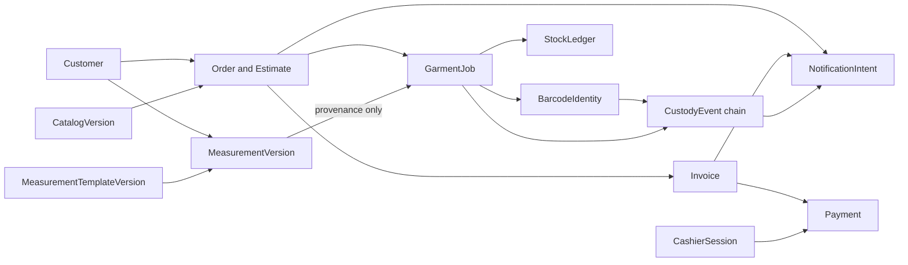

# HyFib Tailor 360 — Aggregates and invariants

This document names the aggregate roots of HyFib Tailor 360 and states, for each one, what must always be true, what
is written in a single transaction, how concurrent writers are kept apart, and what the design deliberately leaves
eventually consistent. It expands [Section 4.5 of the implementation plan](../IMPLEMENTATION_PLAN.md) and is the
reference a reviewer should quote when a pull request weakens a guarantee. Read it with
[`module-ownership.md`](module-ownership.md) (who owns what), [`conventions.md`](conventions.md) (the `xmin` and 409
mechanics referred to throughout), [`sequences/`](sequences/) (the four flows drawn end to end) and
[`../prd/state-transitions.md`](../prd/state-transitions.md) (the business transitions these invariants protect).
Terminology follows [`../prd/glossary.md`](../prd/glossary.md).

---

## 1. How to read this document

An **aggregate root** is the entity that owns a consistency boundary. A command changes exactly one aggregate; the
transaction that changes it also writes its audit event and its outbox message, and nothing outside the boundary.
Anything a command needs from another aggregate is either read through a contract before the transaction starts, or
reconciled afterwards by an event — never joined.

Each aggregate below is described under five headings.

| Heading | What it answers |
| --- | --- |
| **Identity** | The primary key, the human display number where one exists, and the scope keys `organisation_id` and `branch_id` |
| **Invariants** | Numbered statements that must hold after every committed transaction, with the mechanism that enforces each |
| **Transactional boundary** | Exactly what is written in one transaction, and what is deliberately outside it |
| **Concurrency** | How two simultaneous writers are kept apart: `xmin`, a conditional update, a unique index or a row lock |
| **Deliberately eventually consistent** | What may legitimately lag, for how long, and what stops the lag from causing harm |

Invariant identifiers (`INV-CUS-01`, `INV-JOB-04`, …) are stable and are the labels tests should carry, so that a
failing test names the rule it broke.

---

## 2. Rules that hold for every aggregate

These are stated once here rather than repeated thirteen times below.

| # | Rule | Mechanism |
| --- | --- | --- |
| G-1 | Every operational aggregate carries `organisation_id`, and `branch_id` where it is branch-scoped, plus `created_at`, `created_by`, `updated_at`, `updated_by` and the system column `xmin`. | Table convention, plan Section 5.2 |
| G-2 | The audit event for a mutation is written **in the same transaction** as the mutation: an `IAuditWriter` bound to the module's own context (`AuditWriter<TContext>`, behind a module's own port such as `IBillingAuditWriter` — the same shape as a module's own event-publisher port) stages the entry on that context's change tracker before the store call that saves the change it describes, so one `SaveChangesAsync` carries both and they commit or roll back together. A module that has not yet given itself this port falls back to the default, non-generic `IAuditWriter`, which writes through `PlatformDbContext` on its own — a second commit, not yet fixed for that module. `[Audited("module.action")]` marks the endpoint for the OpenAPI document and for ARCH-008; it performs no write itself. | `Platform.Persistence` (`AuditWriter<TContext>`, `AuditEventMapping`), `Tailor360.IntegrationTests.Billing.AuditTransactionAtomicityTests` |
| G-3 | An integration event is written to the module's own `outbox_messages` **in the same transaction** as the change it describes. Publication is at least once; every handler is inbox-deduplicated. | Transactional outbox, plan D6 |
| G-4 | Append-only tables — audit events, ledger entries, scan events, custody transfers, posted invoices, payments, receipts, QC results — reject `UPDATE` and `DELETE` from the application role by database trigger. Corrections are new rows. | Trigger owned by `t360_migrator` |
| G-5 | Business records are never soft-deleted or hard-deleted. Deactivation, retirement and cancellation exist instead. Hard deletion is limited to retention-policy jobs on approved classes: media derivatives, expired drafts, expired links, expired exports. | Plan Section 5.2, retention worker |
| G-6 | There are **no cross-schema foreign keys**. A reference to another module's aggregate is an identifier validated through that module's contract at write time; its continued validity is a business invariant reconciled by events, not a database constraint. | [`module-ownership.md`](module-ownership.md) |
| G-7 | Editable aggregates use `xmin` optimistic concurrency and answer a stale write with `409` problem details carrying the current version. Append-only aggregates use idempotency keys and unique indexes instead. | [`conventions.md`](conventions.md) section 4 |
| G-8 | A **snapshot** — measurement, design, price, customer, QC criteria — is a copy taken at a decision point. Later configuration changes never reach back into it, and a snapshot is never re-pointed by a later merge or correction. | Immutability by trigger or by absence of a write path |
| G-9 | Server timestamps are authoritative for scans, phase transitions, postings and payments. Client-supplied times are recorded for evidence and never used for ordering or for SLA arithmetic. | Plan D11 |
| G-10 | Configuration that a settled record depends on is **versioned and pinned**: catalog version, price-list version, tax configuration version, workflow version, template version, QC checklist version, notification template version, policy version. | Plan D8 |

---

## 3. Aggregate map

References between aggregates are by identifier. An arrow means "holds a reference to", not "may query".

The two arrows worth reading twice: `MeasurementVersion` reaches `GarmentJob` as **provenance only** — the job holds a
copy of the values, not a live link — and `BarcodeIdentity` sits between the job and the custody chain, so custody is
recorded against an opaque identity rather than against a customer-identifying number.

---

## 4. Aggregate reference

### 4.1 Customer

**Identity.** `customers.customers.id`, a UUIDv7. Display number `C-<branch>-000001` from the per-branch sequence.
`branch_id` records the branch that created the record and drives default visibility; serving the same customer at
another branch is a supported scenario governed by branch scope, per
[`../prd/workflows/branch-scenarios.md`](../prd/workflows/branch-scenarios.md).

**Invariants.**

| ID | Invariant | Enforced by |
| --- | --- | --- |
| INV-CUS-01 | Phone number is validated but **never unique**: two people may legitimately share a household number. | Validator; deliberate absence of a unique index |
| INV-CUS-02 | A correction keeps `id` and `customer_number` unchanged, and requires a reason recorded in the audit event. | Command validator, audit filter |
| INV-CUS-03 | Duplicate candidates are detected and scored, but a merge happens only by an authorised decision. A merge is irreversible, names exactly one surviving record, and keeps the merged number searchable as an alias. | `customer_merges` row, permission, alias row |
| INV-CUS-04 | A merge re-points measurements and orders to the surviving customer but **never rewrites a snapshot** already frozen onto a garment job, invoice or notification. | G-8; no write path to snapshots |
| INV-CUS-05 | There is no delete endpoint. Deactivation is a flag; erasure happens only through the data-subject request flow with pseudonymisation. | Endpoint inventory test, issue #57 |
| INV-CUS-06 | Consent is a versioned record per purpose with wording version, source, actor and time. Withdrawal is a new record; a consent record is never edited. | Append-only table |
| INV-CUS-07 | No message is sent for a purpose without a current consent for that purpose, checked server-side at send time. | `IConsentQuery`, Notifications suppression |

**Transactional boundary.** The customer row with its aliases, consent records and communication preferences. A merge
is one transaction over two customer aggregates plus the merge record and the re-pointing of measurements, which
Customers also owns; re-pointing in other modules is eventual, driven by `customers.customer-merged.v1`.

**Concurrency.** `xmin` with `ETag`/`If-Match` on the edit endpoints; a stale write is `409`. A merge locks both
customer rows in ascending id order so two concurrent merges cannot deadlock, and refuses if either row has already
been merged.

**Deliberately eventually consistent.** Duplicate-candidate scores; the customer timeline; search projections;
downstream display copies of the customer name in other modules. None of these is authoritative: the customer record
is.

### 4.2 MeasurementTemplateVersion

**Identity.** `customers.measurement_template_versions.id` with `(template_id, version_number)`. Lifecycle
`draft → in_review → published → retired`.

**Invariants.**

| ID | Invariant | Enforced by |
| --- | --- | --- |
| INV-MTV-01 | A published version is **immutable** — no field, range, unit, precision or diagram reference may change. | Database trigger |
| INV-MTV-02 | A version may be published only if every field carries a key unique within the version, a canonical unit of millimetres, a precision, a validation range, and a diagram reference that resolves to a Media object with alternative text. | Publish-time validator |
| INV-MTV-03 | A conditional rule may reference only field keys present in the same version. | Publish-time validator |
| INV-MTV-04 | Publishing a new version never changes what an existing service type, measurement version or garment job references. Retirement blocks new references and invalidates none. | Version pinning, G-10 |
| INV-MTV-05 | Values are captured and stored in millimetres; the display unit is presentation only, and inch fractions are converted on entry, not stored as text. | Domain type, `FractionInput` |
| INV-MTV-06 | A published catalogue version's service type points at a template that has a published version. Both directions are checked before the write: catalogue publication refuses a service type whose template has none, and retirement refuses while a published catalogue still points at the template. A breach that gets past both guards is detected and recorded by event. | `MeasurementTemplateCatalogValidator`; `ICatalogAvailabilityQuery.ReferencesMeasurementTemplateAsync`; `CatalogReconciler` |

**Transactional boundary.** The template, the version and all its fields, published in one transaction with the
publication event.

**Concurrency.** `xmin` on every version row whatever state it is in, published ones included — they are updated
once more, by the retirement that supersedes them, and that write is the one a second administrator can lose.
Version numbers are serialised by the unique index on `(template_id, version_number)`, and "at most one published
version" by a unique index filtered on the published status, so two administrators racing get a `409` rather than
a second published version. The immutability trigger is not a substitute for the row version and does not try to
be: it restricts a published row to the columns retirement writes — `status`, `retired_at`, `retired_by`,
`retired_reason`, `updated_at`, `updated_by` — and to the `published → retired` transition. It guards the
*content* of a published version; the row version guards against overwriting another *writer*.

INV-MTV-06 is the one invariant here that is **not** synchronous, and deliberately so. Its two guards sit in
different modules, each reading the other through a contract and then writing to its own schema, so a catalogue
publication and a template retirement that overlap can each observe the other's pre-write state and both commit:
the catalogue is then published against a template whose only published version has just been retired. Closing
that window would need the two writes serialised across the module boundary — a distributed lock or a shared
transaction — which is precisely what **G-6** says this codebase does not do: a cross-module reference is
validated through the contract at write time, and *continued* validity is reconciled by events rather than
enforced by a constraint. The guards are therefore best-effort by design, and the reconciliation G-6 promises is
what closes the loop. Changing this to a synchronous guarantee is an architecture decision record against G-6, not
a code change.

**The reconciliation** (issue #91) is `CatalogReconciler`, in Catalog, driven by three integration events:
`customers.measurement-template-version-retired.v1`, `customers.measurement-template-version-published.v1` and
Catalog's own `catalog.catalog-version-published.v1`. The race has two orderings and each is closed by a different
one of the first and last; the middle event is what *heals* a breach, because publishing a template version is the
fix an administrator makes and nothing else would tell the catalogue so. On any of them the currently published
catalogue is re-checked through `CatalogPublicationCheck` — the same question publication itself asks, so a version
that publishes cleanly and one that reconciles cleanly mean the same thing — and every error is opened as a row in
`catalog.reference_breaches`, or closed when a later check no longer finds it. A partial unique index over
`(catalog_version_id, code, target)` filtered on unresolved rows is what makes an at-least-once redelivery a no-op
rather than a second row with a later detection time. A validator that cannot answer fails the delivery rather
than concluding anything: "we could not check" is not "we checked and it is fine", and closing a standing breach
on a failed check would tell an administrator an outage had fixed their shop.

**The reconciliation records; it does not block.** A breach does not flip `notOrderable`, refuse an order or
retire the catalogue, so the residual window still leaves a service type a counter cannot fully serve — discovered
at capture time rather than silently mis-measured, which is a visible failure rather than a corrupting one. What
has changed is that it is no longer discovered *only* there. Whether a breach should also stop the counter
ordering is a product decision, open as **OD-18** in
[`../prd/assumptions-and-open-decisions.md`](../prd/assumptions-and-open-decisions.md).

**Deliberately eventually consistent.** Version-keyed read caches, invalidated by the publication event within the
documented propagation bound (plan D21); seed exports and printed measurement sheets already produced.

### 4.3 MeasurementDraft and MeasurementVersion

**Identity.** `customers.measurement_drafts.id` for work in progress; `customers.measurement_versions.id` for the
confirmed record, keyed by customer and template version, with `taken_by`, `taken_at`, `reason` and `reused_from`.

**Invariants.**

| ID | Invariant | Enforced by |
| --- | --- | --- |
| INV-MSR-01 | A measurement version is **never edited**. A change is a new version with a reason; the old version stays readable. | Append-only table |
| INV-MSR-02 | A draft is consumed **exactly once**. Confirming a consumed draft is a conflict, never a second version. | Conditional update on `consumed_at IS NULL` |
| INV-MSR-03 | A draft is never a source of truth for an order. Only a confirmed version may be snapshotted onto a garment job. | Command validator |
| INV-MSR-04 | Every value is validated against the template version's unit, precision and range at confirmation, not at draft time. | Confirmation validator |
| INV-MSR-05 | Storing measurements requires a current `measurement_storage` consent for the customer. | `IConsentQuery` at confirmation |
| INV-MSR-06 | Reading a measurement sheet is a sensitive read and is audited explicitly, not only as a page view. | `IAuditWriter` call in the query handler |
| INV-MSR-07 | Expired drafts are an approved class for hard deletion by the retention job; confirmed versions are not. | Retention policy, G-5 |

**Transactional boundary.** Draft consumption, version creation, its values and the
`customers.measurement-version-confirmed.v1` outbox message in one transaction.

**Concurrency.** Drafts are shared within a branch, so they use `xmin` with `If-Match` and a per-section lock rather
than last-writer-wins. Confirmation is serialised by the conditional update in INV-MSR-02.

**Deliberately eventually consistent.** The copies held by garment jobs are snapshots taken at confirmation and are
**not** updated when a newer measurement version appears — that is the point of INV-JOB-01. Timeline entries and
projections lag by the outbox.

### 4.4 CatalogVersion

**Identity.** `catalog.catalog_versions.id` with a version number and status `draft | published | retired`.

**Invariants.**

| ID | Invariant | Enforced by |
| --- | --- | --- |
| INV-CAT-01 | An order is confirmed against exactly one published catalog version, recorded on the order. | Confirmation command |
| INV-CAT-02 | A published catalog version is immutable in every part: categories, service types, option groups, options, rules and checklist links. | Database trigger |
| INV-CAT-03 | A version may be published only if every registered `ICatalogDependencyValidator` passes — for example, every service type references a published measurement template version, a published workflow version, a price-list item and a QC checklist version. | Publish-time validator chain |
| INV-CAT-04 | A design rule may reference only options present in the same version; a sub-category's parent must be in the same version. | Publish-time validator |
| INV-CAT-05 | Adding a category, service type, option or rule is configuration, never a deployment. | Plan Section 2.2, `../prd/configurable-vs-fixed.md` |
| INV-CAT-06 | Branch availability and active dates belong to the version, so what a branch may sell on a date is answerable from the version alone. | `ICatalogAvailabilityQuery` |

**Transactional boundary.** The whole version graph is published in one transaction with
`catalog.catalog-version-published.v1`.

**Concurrency.** `xmin` on the draft; publication takes a row lock on the catalogue head so two publications cannot
interleave. Published rows are never updated.

**Deliberately eventually consistent.** Version-keyed read caches and the design picker; already-confirmed orders,
which hold snapshots and are unaffected by design (INV-JOB-01).

### 4.5 Order and Estimate

**Identity.** `orders.orders.id` (UUIDv7) with display number `O-<branch>-<FY>-000001`; estimates carry
`E-<branch>-<FY>-000001` from a separate series.

**Invariants.**

| ID | Invariant | Enforced by |
| --- | --- | --- |
| INV-ORD-01 | Confirmation is **atomic across the whole order**: the order, every garment job, every snapshot, the barcode identity of every job and the outbox message commit together, or nothing does. | One transaction plus the confirmation-participant hook |
| INV-ORD-02 | A confirmed order records exactly one catalog version, one price-list version and one tax configuration version, on the price snapshot. | Confirmation command, G-10 |
| INV-ORD-03 | The display number is allocated at confirmation from the per-branch, per-financial-year sequence, is never reused and is never a lookup key on an unauthenticated surface. | `ISequenceAllocator` under a row lock; endpoint design |
| INV-ORD-04 | An estimate is never a tax document, is never posted, and never consumes an invoice number. | Separate sequence; no posting path |
| INV-ORD-05 | An order revision is permitted only while **every** garment job is still `confirmed` and none has entered production; it re-prices and supersedes the estimate. | Command precondition |
| INV-ORD-06 | Cancellation is blocked in prohibited financial, stock and custody states; the remedy is a compensating flow, never deletion. | Command precondition, G-5 |
| INV-ORD-07 | Totals held on the order are a snapshot for display and printing. The authoritative money position is Billing's `IFinancialTotalsQuery`. | Contract boundary |

**Transactional boundary.** The order, its garment jobs and their snapshots. The only cross-module work inside the
transaction is barcode allocation through `IBarcodeIdentityAllocator`; invoicing, notification and projection are
outside it.

**Concurrency.** `xmin` with `If-Match` on draft edits; `Idempotency-Key` required on confirm, so a retried
confirmation returns the first result rather than creating a second order; the sequence row lock serialises numbering.

**Deliberately eventually consistent.** Whether an invoice exists yet; notification of the customer; the delivery
queue; every reporting projection; the custody state shown on the order screen.

### 4.6 GarmentJob

**Identity.** `orders.garment_jobs.id` with display number `J-<branch>-<FY>-000001-01`, the order number plus a
two-digit job index.

**Invariants.**

| ID | Invariant | Enforced by |
| --- | --- | --- |
| INV-JOB-01 | Measurement, design and price snapshots are **immutable once the job leaves `confirmed`**. While every job of the order still stands at `confirmed`, `orders.revise` replaces all three together (INV-ORD-05) — that is the one write path, and it is the whole of it. The measurement version id is kept as provenance only. Changing the template, catalogue or price list never changes a confirmed job. | G-8; `orders.job_snapshots_are_immutable` and `orders.garment_job_price_is_immutable`; no other write path |
| INV-JOB-02 | The workflow version is resolved and **pinned** at start-production. A later published workflow version never migrates a running job, and an order revision is refused once any job has entered production. | Start-production command |
| INV-JOB-03 | Phase transitions follow the pinned version's transition graph; start, pause, resume and completion carry server timestamps. | Domain state machine, G-9 |
| INV-JOB-04 | An assignment requires a valid assignee capability for the job's category and phase. Reassignment is a new row; completions already recorded keep their original attribution. | Assignment validator, append-only assignment history |
| INV-JOB-05 | A QC result is immutable and **copies the criteria it evaluated**, so a job card renders identically after the checklist changes. | Append-only table, snapshot |
| INV-JOB-06 | A failed QC opens rework; the job returns to production without losing history and the ready gate stays closed while any rework is open. | Ready gate predicate |
| INV-JOB-07 | `ready_state` is written by the **ready-for-delivery gate alone**, never by a screen, a scan handler or an operator. The gate combines workflow complete, QC passed with no open rework, documentation complete, no open hold, dependencies met and custody reconciled, and each predicate returns a reason code. | Single writer; architecture test on the write path |
| INV-JOB-08 | A design revision is refused once the workflow marks the design frozen; before that it records reason, price delta and due-date delta, shown before approval. | Command precondition |
| INV-JOB-09 | A `finish_before` dependency blocks the dependent job's first phase; a `deliver_together` dependency binds jobs at the ready gate and in the delivery queue. | Gate predicate; the parcel asked for again at handover, because a hold closes one member's gate and not its partners' (state-transitions.md **SQ-09**); delivery queue query |
| INV-JOB-10 | A confirmed job has exactly one **active** barcode identity at all times. | Partial unique index in Custody (INV-BID-02) |

**INV-JOB-01 was amended on 2026-09-11**, in the pull request that added the `orders` schema. It read "immutable
after confirmation" unqualified, which the schema it is enforced by has never implemented and could not:
`orders.revise` exists precisely to replace all three frozen copies of every garment, and INV-ORD-05 permits it for
exactly as long as every job of the order is still `confirmed`. An append-only trigger would have made
`Order.Revise` fail at the database. The two triggers therefore allow a rewrite while the parent job is `Confirmed`
and refuse one afterwards, which is what the wording now says. Nothing about the intent changed: republishing the
catalogue, retiring a design group, renaming an option, changing the price list or capturing a newer measurement
still never changes a confirmed job, because none of those is `orders.revise`. What changed is that the sentence and
the schema now say the same thing, which CLAUDE.md section 8 requires of any rule a change implements more weakly
than its wording.

**Transactional boundary.** The job with its phases, assignments, QC results, rework tasks and holds. `ready_state` is
recomputed inside the same transaction when the trigger is local (a phase, QC, hold or dependency change) and by an
event handler when the trigger is a custody event.

**Concurrency.** `xmin` with `If-Match`; phase transitions use a conditional update on the current phase state so two
devices cannot complete the same phase twice; `Idempotency-Key` on every transition command.

**Deliberately eventually consistent.** The custody predicate of the ready gate — a custody event recomputes it
asynchronously — the workboard counts, due-soon and overdue evaluation by the worker, notifications and projections.
The lag is safe because the gate is **re-evaluated at the dispatch attempt**: a stale `ready_state` can delay a
dispatch but can never release a garment that should not go.

### 4.7 BarcodeIdentity

**Identity.** `custody.barcode_identities.id`, and the payload itself: a namespace letter, eleven random characters
from the Crockford base32 alphabet (55 bits of entropy) and one Damm-style check character, for example
`G-7K3M9QW2XZ4B`.

**Invariants.**

| ID | Invariant | Enforced by |
| --- | --- | --- |
| INV-BID-01 | A payload is **globally unique across every status** and is never re-issued, not even after invalidation. | Unique index on the payload |
| INV-BID-02 | A garment job has **exactly one active identity**. | Partial unique index on the entity reference where status is active |
| INV-BID-03 | The namespace letter matches the entity class: `G-` garment job, `S-` stock item, `I-` invoice, `R-` receipt. | Allocation validator |
| INV-BID-04 | A payload contains **no personal data and no display number**. It is opaque and carries no meaning. | Payload generator; review checklist |
| INV-BID-05 | Allocation happens inside the order confirmation transaction through the confirmation-participant hook, so a confirmed job without an identity cannot exist. | INV-ORD-01 |
| INV-BID-06 | Replacing a damaged label supersedes the old identity and allocates a new active one, with reason and audit; the superseded payload stays resolvable for history and is never reassigned. | Status transition, INV-BID-01 |
| INV-BID-07 | The server re-validates namespace, check character, identity status and branch on every resolve and every command. A client-side checksum pass is never trusted. | Resolve endpoint |

**Transactional boundary.** All identities for one order's jobs are allocated in that order's confirmation
transaction. A label print is a separate transaction and a separate audit record.

**Concurrency.** Uniqueness is the serialisation point; a generator collision is retried, and the partial unique index
of INV-BID-02 makes a double allocation impossible rather than unlikely.

**Deliberately eventually consistent.** Whether a label has actually been printed; the print queue may lag or fail, and
the identity exists regardless.

### 4.8 CustodyEvent — scans, transfers and reconciliation cases

**Identity.** `custody.scan_events.id` with `(actor_id, client_event_uuid)` as the client-side deduplication key;
`custody.custody_transfers.id`; `custody.reconciliation_cases.id`.

**Invariants.**

| ID | Invariant | Enforced by |
| --- | --- | --- |
| INV-CDY-01 | Scan events and custody transfers are **immutable and append-only**. History is never edited; a correction is a new event with action `CORRECTION` linked to the event it corrects and to its reconciliation case. | Trigger, G-4 |
| INV-CDY-02 | `(actor_id, client_event_uuid)` deduplicates a replayed scan. The same UUID seen under a **different** actor is `409 custody.event-conflict`, never treated as a replay. | Unique index plus explicit check |
| INV-CDY-03 | The server validates the expected custodian and the action's prerequisites. A scan that contradicts current custody is recorded and **opens a reconciliation case**; it never silently succeeds and never silently fails. | Scan handler |
| INV-CDY-04 | A custody transfer is two-sided — transfer out, then receive — and ends `accepted`, `rejected` or `expired`. A cross-branch transfer grants the destination branch exactly the receive, reject and resolve actions on that job, and nothing else. | State machine; `TransferScopeRequirement` |
| INV-CDY-05 | Dispatch is permitted only against a recorded dispatch authorisation, which exists only if `IDispatchEligibilityQuery` returned a passing answer. `NotEvaluated` **blocks** — the gate fails closed. | Dispatch command |
| INV-CDY-06 | A dispatch authorisation is single-use, bound to an order and job set, and expires at the branch end of day. Doorstep confirmation references it and re-validates on replay from the offline queue. | Authorisation record, replay validation |
| INV-CDY-07 | A reconciliation case above the configured threshold is resolved with the approval of a **different** user from the one who recorded the exception. | Approval requirement |
| INV-CDY-08 | Server time orders the custody chain. Client time and device identity are recorded as evidence only. | G-9 |

**Transactional boundary.** One event, plus the transfer or case row it drives, plus the materialised custody state of
the job, plus the outbox message and audit event — one transaction.

**Concurrency.** The event stream is append-only, so it carries no `xmin`. The **materialised custody row** for the
job is the serialisation point: it is locked for update inside the scan transaction, so two scans of the same garment
cannot interleave, and it carries `xmin` for API-level conflict reporting.

**Deliberately eventually consistent.** The custody predicate of the Orders ready gate; delivery-queue contents;
reconciliation dashboards and overdue-transfer alerts, which the worker evaluates on a schedule; notifications.

### 4.9 StockLedger — items, entries, balances and reservations

**Identity.** `inventory.ledger_entries.id` for a movement; `(item_id, location_id)` for a balance;
`inventory.reservations.id` for an earmark.

**Invariants.**

| ID | Invariant | Enforced by |
| --- | --- | --- |
| INV-STK-01 | The ledger is the **only authoritative source of stock**. Entries are immutable and append-only; a correction is a new entry carrying `corrects_entry_id`. | Trigger, G-4 |
| INV-STK-02 | Every entry records a signed quantity in the item's base unit. Unit conversions are invertible and acyclic, and conversion happens on entry, never in a report. | Domain type, conversion validator |
| INV-STK-03 | A balance equals the sum of its ledger entries. It is updated in the same transaction as the insert, is rebuildable from the ledger alone, and is reconciled by a scheduled job. | Same-transaction update; rebuild command; reconciliation job |
| INV-STK-04 | Stock is **never oversubscribed**: a reservation takes a row lock on the balance and fails if available is less than requested. | `SELECT … FOR UPDATE` on the balance row |
| INV-STK-05 | A reservation is always resolved — released or converted to consumption. It is never silently dropped, and an expired reservation is released by an audited job. | State machine, retention/cleanup job |
| INV-STK-06 | A stocktake variance is explained, approved by a different user above the threshold, and posted as **adjustment ledger entries** — never as a direct edit of a balance. | Approval requirement; no balance write path |
| INV-STK-07 | Customer-supplied material is recorded as custody and is **never valued**. | Separate table; valuation excludes it |
| INV-STK-08 | A valuation run is an immutable snapshot at a cut-off, recording the method it used. | Append-only table, G-10 |

**Transactional boundary.** The ledger insert, the balance update and the reservation change commit together,
serialised on the balance row, with the outbox message and audit event.

**Concurrency.** The balance row lock is the serialisation point for the whole aggregate. Balances carry `xmin` for
API conflict reporting; ledger entries carry none because they are never updated. Posting commands require an
`Idempotency-Key`.

**Deliberately eventually consistent.** Low-stock alert state, evaluated by the worker against the branch alert policy;
valuation reports; reorder suggestions; every projection. A late alert costs a purchase decision, never a wrong
balance.

### 4.10 Invoice, credit note and debit note

**Identity.** `billing.invoices.id`; the invoice number allocated at posting from the per-branch, per-financial-year
document sequence.

**Invariants.**

| ID | Invariant | Enforced by |
| --- | --- | --- |
| INV-INV-01 | An invoice is a draft until posted. **Posting allocates the number under a row lock, freezes the row, and a trigger blocks every later `UPDATE` and `DELETE` from the application role.** | Sequence row lock; trigger, G-4 |
| INV-INV-02 | Numbers are allocated in order within a branch and financial year, are never reused, and a cancelled invoice keeps its number. | `ISequenceAllocator`; cancellation as an appended record |
| INV-INV-03 | Lines and tax components are snapshots, and the calculation records the exact price-list version and tax configuration version used. | Calculation snapshot, G-10 |
| INV-INV-04 | A line carries either CGST and SGST **or** IGST, decided by place of supply — never both schemes. | Tax engine; golden-master tests |
| INV-INV-05 | Line amounts round half-up to paise; the document rounds off to the nearest rupee under the configured rule, and the round-off is allocated deterministically. Money is `decimal`, never floating point. | [`conventions.md`](conventions.md) section 1 |
| INV-INV-06 | Cancellation is an **appended record** — actor, reason, time, approval — from which the displayed status derives. The original PDF still renders and still matches its stored checksum. | Append-only; artefact checksum |
| INV-INV-07 | Value already recognised is reduced by a credit note, never by editing an invoice. Credit and debit notes are posted and immutable in the same way. | Command design |
| INV-INV-08 | Every posted document has a `document_artifact` row; the rendered PDF is produced by the worker and attached with its checksum. A missing artefact is an operational alert, never a reason to re-post. | Pending artefact row; backlog alert |

**Transactional boundary.** Header, lines, tax components, number allocation, the pending artefact row, the outbox
message and the audit event — one transaction. PDF rendering is outside it, in the worker.

**Concurrency.** The sequence row lock serialises numbering. Drafts use `xmin` and `If-Match`; posted rows carry no
concurrency token because no update is possible. Posting requires an `Idempotency-Key`, so a retried post returns the
first invoice rather than burning a second number.

**Deliberately eventually consistent.** PDF availability; the customer notification; reporting projections and the GST
summary; the accounting export; `invoice_paid_status`, which follows payment allocation events.

### 4.11 Payment, allocation, advance, refund and receipt

**Identity.** `billing.payments.id`; receipts carry `R-…` numbers and an `R-` barcode identity.

**Invariants.**

| ID | Invariant | Enforced by |
| --- | --- | --- |
| INV-PAY-01 | Payments, allocations, advances, refunds and receipts are **append-only**. A status change is a new row; a reversal or refund is a new, approved compensating record, never an edit. | Trigger, G-4 |
| INV-PAY-02 | Every payment records mode, branch, cashier, payer, the reference the mode requires and the `Idempotency-Key` it arrived with. | Validator; idempotency store |
| INV-PAY-03 | The allocations of a payment never exceed the payment amount, and the allocations against an invoice never exceed the invoice total. | Row lock on the invoice allocation state; check at write time |
| INV-PAY-04 | Default allocation is deterministic — oldest invoice first. Manual allocation is a separate, authorised, audited command. | Allocation service |
| INV-PAY-05 | An advance is held unapplied against the customer or order until it is allocated, and its application is a recorded allocation. | Advance state |
| INV-PAY-06 | The customer balance is *posted charges − allocations − credits + refunds*, and is computed **only by Billing**. Custody, Delivery and Reporting never compute it. | `IFinancialTotalsQuery`; module boundary |
| INV-PAY-07 | Card credentials are never stored. Provider interaction is intent → call with the intent id as the provider idempotency key → apply the verified outcome; a timeout is `unknown` and is resolved by polling, never assumed successful. | Plan Section 4.4; adapter contract tests |
| INV-PAY-08 | A payment callback never posts financial state itself; it records a verified outcome that Billing applies. | Integration boundary |

**Transactional boundary.** The payment, its allocations and its receipt, with the outbox message and audit event, in
one transaction, serialised on the invoice allocation state.

**Concurrency.** Append-only, so the duplicate guard is the `Idempotency-Key` record plus the row lock on the invoice
allocation state. There is no `xmin` on a payment because no update path exists.

**Deliberately eventually consistent.** `billing.invoice-paid-status-changed.v1` and everything downstream of it: the
dispatch-eligibility answer as displayed on a screen (though the answer itself is recomputed synchronously at the
dispatch attempt), receipts sent to the customer, cashier-session expected totals, provider settlement reconciliation,
projections.

### 4.12 CashierSession

**Identity.** `billing.cashier_sessions.id`, with branch, cashier, `opened_at` and `closed_at`.

**Invariants.**

| ID | Invariant | Enforced by |
| --- | --- | --- |
| INV-CSH-01 | At most one open session exists per cashier per branch. | Partial unique index where `closed_at IS NULL` |
| INV-CSH-02 | A payment in a mode that requires a session references an **open** session for that branch and cashier. | Payment validator |
| INV-CSH-03 | Closing computes expected totals by mode from the session's own payments, records counted totals and a denomination sheet, and requires a variance reason above the configured threshold. | Close command |
| INV-CSH-04 | A variance above the threshold is approved by a **different** user from the cashier who closed the session. | Approval requirement |
| INV-CSH-05 | A closed session is immutable. A later correction is a new adjusting record, and where money moved, a compensating payment record. | Trigger, G-4 |
| INV-CSH-06 | A reconciliation batch compares expected against recorded totals by mode and records variance, reason and approver; it never rewrites the payments it reconciles. | Append-only batch |

**Transactional boundary.** The close reads the session's payments and writes the counts, the variance and the close
record in one transaction. The approval is a separate, audited command with step-up where the permission requires it.

**Concurrency.** `xmin` on the open session; closing is a conditional update on `closed_at IS NULL`, so a double close
is a conflict rather than a second close record. INV-CSH-01 is an index, not a check in code.

**Deliberately eventually consistent.** Provider settlement reconciliation; the day's sales report; reporting
projections; the cash-position dashboard.

### 4.13 NotificationIntent, delivery and customer link

**Identity.** `notifications.notification_intents.id` with a de-duplication key; `notifications.deliveries.id` per
attempt; `notifications.customer_links.id`, which stores only `SHA-256(token)`.

**Invariants.**

| ID | Invariant | Enforced by |
| --- | --- | --- |
| INV-NTF-01 | An intent is recorded **before** any send, and its decision — consent, quiet hours, de-duplication, rate limit, preference — is evaluated server-side and recorded. | Intent pipeline |
| INV-NTF-02 | A refused send is recorded as a **suppression with a reason**. A message is never silently dropped. | Suppression table |
| INV-NTF-03 | No send happens without a current consent for that purpose; transactional and marketing purposes are separate consents. | `IConsentQuery`, INV-CUS-07 |
| INV-NTF-04 | The de-duplication key ensures that at-least-once delivery of a triggering event produces at most one message. | Unique index on the key |
| INV-NTF-05 | The template version is pinned on the intent. A later template change never alters an already-sent message. | G-10 |
| INV-NTF-06 | Rendering is logic-less and runs in safe mode from a declared variable allowlist. The rendered body is classified personal, is never logged, and is retained only under the retention policy. | Template engine; logging policy |
| INV-NTF-07 | A customer link is 128 random bits, stored only as its SHA-256 hash, bound to a single purpose, expiring, revocable and rate-limited. It grants exactly its purpose and nothing more. | Link table; `/c/{purpose}/{token}` handler |
| INV-NTF-08 | A delivery is one attempt with its own status. Provider outcomes update the delivery, never the intent's recorded decision. | Delivery table |

**Transactional boundary.** The intent and its decision record with the outbox message, in one transaction. Each
delivery attempt is its own transaction, so a provider failure never rolls back the decision.

**Concurrency.** The de-duplication key's unique index is the serialisation point. Deliveries carry `xmin` because the
sender updates their status; intents do not change after their decision.

**Deliberately eventually consistent.** Everything after the decision: the actual send, delivery status, feedback
receipt, service-recovery case opening, timeline entries and projections. Quiet hours deliberately delay non-urgent
messages.

---

## 5. What is deliberately eventually consistent

| Area | Lag driven by | Bound | Why it is safe |
| --- | --- | --- | --- |
| Integration events between modules | Outbox dispatcher | Outbox lag under 30 s at p95 — **proposed, to be confirmed** by issue #19 | Every consumer is idempotent; no consumer is authoritative for the fact it consumes |
| Reporting projections | Projection worker and checkpoints | Freshness shown on every screen built on one | A projection is never authoritative for financial, stock, workflow or custody state; reconciliation runs raise `reporting.report-reconciliation-mismatch.v1` |
| Ready-state custody predicate | Custody events | Same as outbox lag | The gate is re-evaluated at the dispatch attempt, so a stale value can delay but never release |
| Invoice paid status and dispatch display | Payment events | Same as outbox lag | The dispatch decision itself is a synchronous, fail-closed contract call |
| Low-stock alerts | Scheduled evaluation | Alert policy interval | A late alert affects purchasing, never a balance |
| Notifications and feedback | Notification worker, quiet hours | Policy | Suppression and de-duplication are recorded; nothing is silently lost |
| Customer timeline | Composition at read time from each `ITimelineSource` | Per source | Each source is authoritative for its own entries; the merge is presentation |
| Media derivatives | Media worker bulkhead | Processing backlog | The original is safe in quarantine or ready state; the UI shows a processing state |
| Balances versus ledger | Reconciliation job | Job schedule | Balances are updated in the same transaction; the job detects drift rather than creating correctness |
| Search and duplicate scores | Projection or index refresh | Refresh interval | Advisory only; a merge is always an authorised human decision |

---

## 6. Invariants that cross aggregates

These cannot be held by a single transaction on a single aggregate, so each names the mechanism that holds it and the
detection that catches a breach.

| ID | Cross-aggregate invariant | Held by | Detected by |
| --- | --- | --- | --- |
| CI-01 | A confirmed garment job has exactly one active barcode identity. | The confirmation-participant hook inside the order confirmation transaction (INV-ORD-01, INV-BID-05) | Reconciliation query: confirmed jobs with zero or more than one active identity |
| CI-02 | A garment leaves the branch only against a valid dispatch authorisation. | Synchronous fail-closed `IDispatchEligibilityQuery` plus the single-use exception (INV-CDY-05, INV-CDY-06) | Dispatch exception report; audit of `custody.dispatch-recorded.v1` without an authorisation |
| CI-03 | `ready_state` reflects real custody. | Recomputation on every custody event, plus re-evaluation of the gate at the dispatch attempt (INV-JOB-07) | Gate refusal at dispatch; ready-state rebuild job |
| CI-04 | Balances equal the ledger. | Same-transaction update (INV-STK-03) | Scheduled reconciliation and rebuild |
| CI-05 | Reported figures equal their sources. | Projections built from events, with checkpoints | Reconciliation runs and `reporting.report-reconciliation-mismatch.v1` |
| CI-06 | An invoice's paid status equals its payments. | Payment allocation events (INV-PAY-03) | Billing reconciliation report; cashier-session close |
| CI-07 | A merged customer's history stays readable and settled work is unchanged. | Aliases plus re-pointing, with snapshots left intact (INV-CUS-03, INV-CUS-04) | Timeline review; orphan-reference query |
| CI-08 | Every committed mutation has an audit event, and the chain is unbroken. | Same-transaction audit write (G-2), hash chain with `prev_hash` | Hourly verification job, gap detection, external anchoring of the chain head |
| CI-09 | No garment job references a catalog, template, workflow, price or tax version that was never published. | Pinning at confirmation and start-production (G-10) | Referential reconciliation query per module |

---

## 7. Open decisions

Raised against [Section 11 of the plan](../IMPLEMENTATION_PLAN.md); each is carried into the owner decision
register in [`../prd/assumptions-and-open-decisions.md`](../prd/assumptions-and-open-decisions.md) the next time that
document is amended. Each has an interim position
so no invariant above is left undefined.

| ID | Question | Interim position | Resolves under | Owner | Raised |
| --- | --- | --- | --- | --- | --- |
| **IOD-01** | Is a cashier session per cashier, or per till shared by several cashiers? INV-CSH-01 assumes per cashier per branch. | Per cashier per branch. If a branch runs a shared till, the uniqueness key becomes branch and till, and INV-CSH-02 changes with it. | Plan Section 11 item 4 (**OD-04**) with issue #44 | Business owner | 2026-09-04 |
| **IOD-02** | Which dispatch payment rule applies — full payment, a partial threshold, a per-job share, or approved exception only — and may an advance unlock dispatch? INV-CDY-05 holds whichever is chosen. | The gate fails closed and the rule is configuration, so the choice changes the policy record, not the invariant. | Plan Section 11 item 4 (**OD-04**) | Business owner | 2026-09-04 |
| **IOD-03** | Valuation method for INV-STK-08 — weighted average or FIFO — and the rounding and round-off conventions behind INV-INV-05. | Weighted average with FIFO optional; line-level half-up to paise and document round-off to the nearest rupee, both configurable. | Plan Section 11 item 5 (**OD-05**), with the accountant | Business owner | 2026-09-04 |
| **IOD-04** | The retention periods that INV-MSR-07, INV-INV-06 and INV-NTF-06 depend on, including the statutory period for GST records. | No hard deletion of any class until the periods are set; expired drafts, links and exports are the only classes the retention job touches at launch. | Plan Section 11 items 5 and 8 (**OD-05**, **OD-08**) | Business owner with the accountant | 2026-09-04 |
| **IOD-05** | The variance and reconciliation approval thresholds in INV-STK-06, INV-CDY-07 and INV-CSH-04. | Configurable per branch; the "different user" rule holds at every threshold, and a proposed default threshold is set with the permission matrix. | Plan Section 11 item 13 (**OD-13**) | Business owner | 2026-09-04 |

---

## 8. Maintenance

This document is amended by pull request, in the same pull request that adds, strengthens or weakens an invariant. A
new aggregate needs a new section; a new invariant needs an identifier and a named enforcement mechanism; a weakened
invariant needs an architecture decision record in [`../adr/`](../adr/) explaining what replaces it. Tests should
reference invariant identifiers so that a failure names the rule. When an invariant changes, check
[`module-ownership.md`](module-ownership.md), [`conventions.md`](conventions.md),
[`../prd/state-transitions.md`](../prd/state-transitions.md) and the affected module README in the same change.
