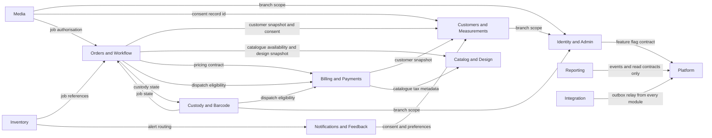

# HyFib Tailor 360 — Module ownership

This document is the authoritative reference for what each module of the HyFib Tailor 360 modular monolith owns and
what it publishes. It expands [Section 4.3 of the implementation plan](../IMPLEMENTATION_PLAN.md) into a per-module
reference covering the owned database schema and tables, the owned object-storage prefix, the integration events and
read contracts the module publishes, the contracts it consumes, and the single rule that makes the boundaries real:
**no module reads another module's tables**. Read it with [`invariants.md`](invariants.md) (what each aggregate
guarantees), [`conventions.md`](conventions.md) (money, time, identifiers, concurrency, versioning),
[`architecture-rules.md`](architecture-rules.md) (the `ARCH-…` assertions that enforce these boundaries in the test
suite) and [`components.md`](components.md) (the component view of the same modules). Terminology follows
[`../prd/glossary.md`](../prd/glossary.md).

---

## 1. The ownership rule

A **module** is a vertical slice of the monolith that owns exactly one PostgreSQL schema and exposes its data to the
rest of the system only through published contracts. The rule has four parts, and every part is testable.

| # | Rule | How it is verified |
| --- | --- | --- |
| MO-1 | A module owns exactly one schema. Its `DbContext` maps tables in that schema and no other. | Architecture test over EF Core model metadata; migration review |
| MO-2 | **No module reads or writes another module's tables** — no `SELECT`, no join, no view over another schema's base tables, no direct SQL, no shared entity type. | Architecture test; database roles; code review |
| MO-3 | Only a module's `Contracts` project and the `Platform.*` projects may be referenced from another module. `Domain` never leaves the module; `Application` never references another module's `Infrastructure`. | Architecture test over project references and type namespaces |
| MO-4 | A module owns its object-storage prefix. It never writes to, deletes from or enumerates another module's prefix. | Per-module storage credentials or bucket policy; integration test |

Two consequences follow and are worth stating explicitly, because they are the questions that come up in review:

- **A read across a boundary is a contract call, not a query.** If Billing needs the garment jobs on an order, it does
  not join `orders.garment_jobs`; it receives the identifiers and priced lines in the command that asks it to post an
  invoice, or it consumes a versioned integration event. Where a read contract is served by a database view rather
  than by in-process code, the view is **owned and published by the owning module** as part of its `Contracts`, and the
  consumer selects from the view, never from the base tables behind it.
- **A write across a boundary is a command or an event, not an `INSERT`.** Custody does not insert into `orders.*` when
  a garment job is scanned; it appends its own event and publishes `custody.scan-recorded.v1`, and Orders reacts.

Cross-module data flows are therefore limited to five sanctioned mechanisms, all defined in plan Section 4.4:

| Mechanism | Direction | Use it for | Consistency |
| --- | --- | --- | --- |
| Read contract (an interface in the owner's `Contracts`) | Synchronous, consumer pulls | A decision that must be made now against current state, for example dispatch eligibility | Strong, within the request |
| Versioned integration event via the transactional outbox | Asynchronous, owner pushes | Reacting to a fact, projections, notifications, relay | Eventual, at least once |
| Confirmation-participant hook | Synchronous, inside the owner's transaction | Work that must be atomic with a confirmation, for example barcode allocation at order confirmation | Strong, same transaction |
| BFF composition in the web host | Synchronous, host merges | Screens that need several modules, for example the customer timeline via `ITimelineSource` | Strong per source, merged in the host |
| Platform port (`Platform.Abstractions`) | Either | Shared infrastructure such as audit, sequences, print queue, outbound HTTP | As the port defines |

Anything else — a new shared table, a cross-schema view over base tables, a direct reference to another module's
`Infrastructure` — requires an architecture decision record in [`../adr/`](../adr/) before it may be merged.

---

## 2. Module map

The graph below shows the sanctioned dependencies. An arrow means "the source module consumes the target module's
published contract or events"; it never means "the source module reads the target's tables". Every module may use
`Platform.*`, so those edges are drawn only where the module owns a Platform-facing responsibility.

Notes on the graph:

- **Orders and Custody depend on each other's contracts.** This is permitted and does not create a project cycle: a
  `Contracts` project references only `Platform.Abstractions`, never another module's `Contracts`. The Orders ready
  gate calls `ICustodyStateQuery`; Custody calls `IOrderSnapshotQuery` for job state. `architecture-rules.md` carries
  the assertion that keeps the project graph acyclic.
- **Billing does not appear as a consumer of Orders.** Plan Section 4.3 lists Orders among Billing's information
  sources while the architecture rules state that *Billing never references Orders*. Both hold: Billing learns order
  facts from versioned integration-event payloads deserialised into Billing-owned types, and from the identifiers and
  priced lines supplied in the command that asks it to post an invoice. The pricing contract deliberately takes no
  order entity — that is the resolution recorded against **OD-11** in
  [`../prd/assumptions-and-open-decisions.md`](../prd/assumptions-and-open-decisions.md). See open decision
  **AOD-01** in section 8.
- **Reporting consumes, and is consumed by, nobody.** It subscribes to events and read contracts and publishes only
  its own operational events. No module reads `reporting.*`; a projection is never authoritative (plan Section 2.2).

---

## 3. Ownership at a glance

| Module | Schema | Object-storage prefix | `DbContext` | Introduced by |
| --- | --- | --- | --- | --- |
| Identity and Admin | `identity` | — | `IdentityDbContext` | #23, #25 |
| Customers and Measurements | `customers` | — | `CustomersDbContext` | #26, #27, #28 |
| Catalog and Design | `catalog` | — | `CatalogDbContext` | #29, #30, #34 |
| Media | `media` | `material/`, `reference/`, `diagram/`, `qc-evidence/`, `delivery-evidence/`, quarantine bucket | `MediaDbContext` | #31 |
| Orders and Workflow | `orders` | — | `OrdersDbContext` | #32, #33, #34 |
| Custody and Barcode | `custody` | — | `CustodyDbContext` | #35, #36, #37 |
| Inventory | `inventory` | — | `InventoryDbContext` | #38, #39, #40 |
| Billing and Payments | `billing` | `documents/` | `BillingDbContext` | #41, #42, #43 |
| Reporting | `reporting` | `exports/` | `ReportingDbContext` | #44, #45, #46 |
| Notifications and Feedback | `notifications` | — | `NotificationsDbContext` | #32a (customer-link skeleton), #47, #48, #49 |
| Integration | `integration` | — | `IntegrationDbContext` | #54, #55 |
| Platform | `platform` | — | `PlatformDbContext` | #21 |

Every business module schema additionally carries its **own** `outbox_messages` table (plan D6); it is listed once
here rather than repeated in each section below. The table set given per module in section 5 is the set implied by
plan Section 4.3 and 4.5; the exact columns and constraints of each table are fixed by the migration in the issue
that introduces it, and a table may only be added to a schema by its owning module.

**Reporting sequencing.** #44 is the first Reporting-module issue: it creates the `reporting` schema and
`ReportingDbContext` together with the projection runner and checkpoints, the freshness and reconciliation
framework, scheduled reports and the governed export service under `exports/`. #45 and #46 build on those
foundations and **must not re-create them**; each adds only its own projections, one migration and its screens
(plan Section 6.2 note 4).

---

## 4. Object-storage ownership

Object storage is private, server-side encrypted, versioned and never reachable from the browser (plan D4). The PWA
receives no storage URL; media and documents are streamed by an API endpoint that re-authorises every request. Objects
carry random keys, so a prefix is an ownership boundary and an access-policy boundary, never a guessable path.

| Prefix | Owning module | Contents | Written by | Served by |
| --- | --- | --- | --- | --- |
| `material/` | Media | Photographs of the customer's own cloth and trims taken at intake | Media worker pipeline after scan and re-encode | Authorised streaming endpoint with access log |
| `reference/` | Media | Customer reference and inspiration images attached to an order or garment job | Media worker pipeline | Authorised streaming endpoint with access log |
| `diagram/` | Media | Measurement diagrams and design-option illustrations, including the bundled static set shipped before upload exists. One namespace for two sets, so design-option illustration keys are prefixed `design_` to keep them distinct from measurement diagram keys — see [`../prd/design-options.md`](../prd/design-options.md) section 6 | Media worker pipeline; seeded at `init-reference-data` | Authorised streaming endpoint |
| `qc-evidence/` | Media | Evidence images attached to a QC result or a defect code | Media worker pipeline | Authorised streaming endpoint with access log |
| `delivery-evidence/` | Media | Doorstep handover photographs and signature strokes | Media worker pipeline | Authorised streaming endpoint with access log |
| Quarantine bucket | Media | Uploaded bytes before signature validation, malware scan, metadata strip and re-encode | Web host upload endpoint | **Never served**; promoted to the ready bucket or deleted |
| `documents/` | Billing and Payments | Rendered invoice, estimate, receipt and credit-note PDFs referenced by `billing.document_artifacts`, with version and checksum | Worker document renderer | Authorised download endpoint; print station via `IPrintQueue` |
| `exports/` | Reporting | Governed export files and scheduled report artefacts, expiring under the retention policy | Worker export generator | Authorised, expiring download endpoint |

Rules:

1. **No module writes to another module's prefix.** Enforcement is by per-module storage credentials or a bucket
   policy scoped to the prefix, so the rule holds even if application code is wrong (plan Section 4.3).
2. **Ownership of the artefact record follows the prefix, not the aggregate.** The estimate is an Orders aggregate,
   but the rendered estimate PDF is a Billing `document_artifact` under `documents/`; Orders links to it through
   Billing's contract. This is deliberate: one module owns document rendering, numbering, checksums and retention.
3. **Retention is the owning module's job.** Media enforces media retention and holds; Billing enforces the statutory
   retention of document artefacts (period pending **OD-05** and **OD-08**); Reporting expires exports. The Platform
   retention worker executes the policy but never chooses it.
4. **Non-current object versions are retained for at least as long as the database backup retention** (plan D4/D18), so
   a restore never lands on a database that references an object that no longer exists.

---

## 5. Module reference

Each section below follows the same six headings: **Purpose**, **Owned schema and tables**, **Owned object-storage
prefix**, **Publishes — integration events**, **Publishes — read contracts**, **Consumes**. Every section closes with
the same cross-module access rule, stated per module because it is the rule reviewers most often need to quote.

Integration-event names follow plan Section 5.2: `<module>.<event-in-past-tense>.v<major>`, with a JSON Schema and an
example under `docs/integration/events/`. Payloads carry identifiers, codes, statuses, timestamps, amounts and branch
codes only, unless the event is classified personal and the subscriber is approved for it.

### 5.1 Identity and Admin

**Purpose.** Owns who may use the system and where. Staff accounts, credentials, multi-factor enrolment, passkeys,
recovery, server-side sessions and their revocation, role and branch assignment, and the branch register itself —
branch code, IANA timezone and working calendar — on which every due date, SLA clock and report cut-off depends. It
also hosts the administration surface for feature flags, which it drives through the Platform contract rather than by
touching `platform.feature_flags` directly.

**Owned schema and tables — `identity`.**

| Table | Holds |
| --- | --- |
| `users` | Staff principals, status, locale, MFA enrolment state |
| `roles`, `role_permissions`, `user_roles` | Default permission bundles and their grants; the permission *catalogue* itself is code in `Platform.Security` |
| `user_branch_assignments` | The branch scope of each principal |
| `sessions` | Server-side session tickets, `last_strong_auth_at`, revocation state, device inventory |
| `user_credentials`, `mfa_secrets`, `passkey_credentials`, `recovery_codes` | Password hashes, TOTP secrets, WebAuthn credentials, one-time recovery codes |
| `trusted_devices` | Optional revocable shared-counter device cookie, subject to **OD-12** |
| `branches` | Branch code, name, IANA timezone (default `Asia/Kolkata`), status |
| `branch_calendars`, `branch_calendar_days` | Working calendar and holidays used by due-date and SLA clocks |

**Owned object-storage prefix.** None.

**Publishes — integration events.** `identity.user-deactivated.v1`, `identity.branch-created.v1`,
`identity.branch-calendar-changed.v1`.

**Publishes — read contracts.** `IUserDirectory` (display names, roles, capabilities, branch scope) — the only
sanctioned way for another module to render "who did this" or validate an assignee.

**Consumes.** Platform's feature-flag contract; Platform ports (`IAuditWriter`, `IIdempotencyStore`).

**Cross-module access.** No module reads `identity.*`. Actor names come from `IUserDirectory`; branch timezone and
working calendar come from `IUserDirectory` and the branch read contract, never from a join on `identity.branches`.

### 5.2 Customers and Measurements

**Purpose.** Owns customer identity and the measurement record: search, creation, correction, duplicate detection and
authorised merge; consent per purpose; communication preferences, language and quiet hours; the versioned measurement
templates and the confirmed, immutable measurement versions the workshop works from.

**Owned schema and tables — `customers`.**

| Table | Holds |
| --- | --- |
| `customers` | Customer record, `customer_number`, normalised and native name, status |
| `customer_aliases` | Previous names, spellings and merged customer numbers, kept searchable |
| `duplicate_candidates` | Scored, explained duplicate suspicions raised at create time |
| `customer_merges` | The irreversible authorised merge decision and its re-pointing record |
| `consent_records` | Versioned consent per purpose with wording version, source, actor and time |
| `communication_preferences` | Allowed channels, language, quiet hours |
| `measurement_templates`, `measurement_template_versions`, `measurement_template_fields` | The configurable field sets, draft to published to retired |
| `measurement_drafts`, `measurement_draft_values` | Branch-shared work in progress, consumed exactly once |
| `measurement_versions`, `measurement_values` | Confirmed, immutable millimetre values with display unit and provenance |

**Owned object-storage prefix.** None. Measurement diagrams are Media objects referenced by id.

**Publishes — integration events.** `customers.customer-created.v1`, `customers.customer-merged.v1`,
`customers.customer-corrected.v1`, `customers.customer-deactivated.v1`, `customers.consent-recorded.v1`,
`customers.consent-withdrawn.v1`, `customers.preferences-changed.v1`, `customers.measurement-version-confirmed.v1`.

**Publishes — read contracts.** `IConsentQuery`, `ICommunicationPreferenceQuery`, `ICustomerSnapshotQuery`, and an
`ITimelineSource` implementation for the customer timeline.

**Consumes.** Identity (branch scope, via `IUserDirectory`); Platform ports.

**Cross-module access.** No module reads `customers.*`. Notifications must call `IConsentQuery` and
`ICommunicationPreferenceQuery` before every send; Orders copies measurement values through
`ICustomerSnapshotQuery` and the measurement contract, and keeps the measurement version id only as provenance.

### 5.3 Catalog and Design

**Purpose.** Owns what the shop sells and how a garment may be specified: the category hierarchy, the service types
that make a category orderable, the design option groups, options and rules, and the QC checklist templates — all as
draft → published (immutable) → retired versions so that administrators change the catalogue without a deployment.

**Owned schema and tables — `catalog`.**

| Table | Holds |
| --- | --- |
| `categories` | Category and sub-category, code, parent, active dates, branch availability, feature flag |
| `service_types` | The orderable unit, with links to measurement template, workflow definition, design groups, price-list item and QC checklist |
| `catalog_versions` | The coherent published snapshot of the whole hierarchy an order is confirmed against |
| `design_option_groups`, `design_options`, `design_rules` | Groups, choices and the requires/excludes/conditional constraints between them |
| `qc_checklist_templates`, `qc_checklist_versions`, `qc_criteria`, `defect_codes` | Typed QC criteria, evidence requirements, responsible role and defect vocabulary |

**Owned object-storage prefix.** None. Option illustrations and measurement diagrams are Media objects referenced by
id, with mandatory alternative text.

**Publishes — integration events.** `catalog.catalog-version-published.v1`.

**Publishes — read contracts.** `ICatalogAvailabilityQuery` (what may be ordered, in this branch, on this date),
`IDesignSelectionValidator` (does this set of selections satisfy the rules), the `GarmentDesignSnapshot` builder that
produces the immutable snapshot Orders stores, and a registration point for `ICatalogDependencyValidator` so other
modules can block publication of an incoherent version.

**Consumes.** Nothing from other business modules; Platform ports only. Dependency validators registered by other
modules are invoked through the registration point, so Catalog never references the registering module.

**Cross-module access.** No module reads `catalog.*`. Orders receives a **snapshot** at confirmation and never
re-reads the catalogue for settled work; changing the catalogue must never change a confirmed garment job.

### 5.4 Media

**Purpose.** Owns every stored image: the upload pipeline, quarantine, malware scan, metadata strip, re-encode,
derivative generation, authorised streaming, the access log and retention. It is the only module that holds object
keys for pictures, and the only one that may serve them.

**Owned schema and tables — `media`.**

| Table | Holds |
| --- | --- |
| `media_objects` | Owning entity reference, classification, prefix, random object key, checksum, status |
| `media_derivatives` | Thumbnail and preview variants and their keys |
| `media_quarantine` | Objects awaiting signature validation and malware scan, with the scan outcome |
| `media_retention_holds` | Legal or business holds that suspend retention deletion |
| `media_access_log` | Who streamed which object, when, under which correlation id |

**Owned object-storage prefixes.** `material/`, `reference/`, `diagram/`, `qc-evidence/`, `delivery-evidence/`, plus
the quarantine bucket end to end.

**Publishes — integration events.** `media.media-ready.v1`, `media.media-quarantined.v1`, `media.media-deleted.v1`.

**Publishes — read contracts.** `IMediaReference` — the only way another module names an image: an id and its
metadata, never a URL and never an object key.

**Consumes.** Identity (branch scope); Customers (the consent record id that permits photo capture); Orders (the
garment job authorisation that decides who may see a job's images); Platform ports (`IMalwareScanner`, audit).

**Cross-module access.** No module reads `media.*` and no module holds a storage key. A screen that shows an image
requests it from the Media endpoint, which re-authorises the request, streams the bytes and logs the access.

### 5.5 Orders and Workflow

**Purpose.** Owns the commercial commitment and the production process: order drafts and estimates, confirmed orders,
garment jobs and their dependencies, the immutable measurement, design and price snapshots, the configurable workflow
definitions and the phases instantiated on each job, assignment and capability, QC results, rework, alterations, holds,
cancellation and the ready-for-delivery gate.

**Owned schema and tables — `orders`.**

| Table | Holds |
| --- | --- |
| `order_drafts` | Server-side, branch-shared, expiring work in progress, locked per garment section |
| `estimates` | Priced draft snapshots, `E-…` numbers, validity, issued/superseded/converted |
| `orders`, `order_revisions` | The confirmed commitment, `O-…` number, customer snapshot, due date, priority, totals |
| `garment_jobs`, `job_dependencies` | The tracked unit, `J-…` number, `finish_before` and `deliver_together` links |
| `measurement_snapshots`, `design_snapshots`, `price_snapshots` | Copies frozen at confirmation with provenance ids |
| `workflow_definitions`, `workflow_versions`, `workflow_version_phases` | Configurable process, published versions immutable |
| `job_phases` | Phase instances with server-timestamped start, pause, resume and completion |
| `assignments`, `assignee_capabilities` | Allotment with reason; capability and capacity used to validate it |
| `qc_results`, `qc_result_criteria`, `rework_tasks` | Immutable QC outcomes copying the criteria evaluated; rework state |
| `alterations`, `holds`, `cancellations` | Post-confirmation exceptions with reason and approval |
| `job_ready_state` | The gate's materialised outcome and its reason codes |

**Owned object-storage prefix.** None. Estimate PDFs live under Billing's `documents/` prefix (section 4, rule 2).

**Publishes — integration events.** `orders.estimate-issued.v1`, `orders.order-confirmed.v1`, `orders.order-revised.v1`,
`orders.garment-job-created.v1`, `orders.job-entered-production.v1`, `orders.job-phase-changed.v1`,
`orders.job-assigned.v1`, `orders.job-reassigned.v1`, `orders.job-unassigned.v1`, `orders.job-held.v1`,
`orders.job-resumed.v1`, `orders.job-rescheduled.v1`, `orders.qc-recorded.v1`, `orders.rework-opened.v1`,
`orders.rework-completed.v1`, `orders.alteration-requested.v1`, `orders.alteration-decided.v1`,
`orders.alteration-completed.v1`, `orders.design-revised.v1`, `orders.job-ready-for-delivery.v1`,
`orders.job-due-soon.v1`, `orders.job-overdue.v1`, `orders.phase-sla-breached.v1`, `orders.job-cancelled.v1`,
`orders.order-cancelled.v1`, `orders.job-closed.v1`.

**Publishes — read contracts.** `IOrderSnapshotQuery` (order and job state, snapshots, due dates, ready state),
`IAlterationRequests`, and an `ITimelineSource` implementation.

**Consumes.** Customers (`ICustomerSnapshotQuery`, consent); Catalog (`ICatalogAvailabilityQuery`,
`IDesignSelectionValidator`, `GarmentDesignSnapshot`); Billing (`IPricingService` for the price snapshot,
`IDispatchEligibilityQuery` where the ready gate needs it); Custody (`ICustodyStateQuery` for the custody predicate of
the ready gate, `IBarcodeIdentityAllocator` through the confirmation-participant hook); Media (`IMediaReference`).

**Cross-module access.** No module reads `orders.*`. Custody, Billing, Inventory, Notifications and Reporting learn
about jobs from the events above and from `IOrderSnapshotQuery`.

### 5.6 Custody and Barcode

**Purpose.** Owns the physical chain of custody: allocation of opaque barcode identities, label printing and reprints,
every scan event, two-sided custody transfers including cross-branch ones, reconciliation cases for exceptions, the
delivery queue, dispatch authorisations and doorstep delivery confirmation.

**Owned schema and tables — `custody`.**

| Table | Holds |
| --- | --- |
| `barcode_identities` | Namespace, opaque payload, entity reference, status active/superseded/invalidated |
| `label_prints` | Identity, template version, printer, format, actor, time, reason, batch, verification flag |
| `scan_events` | Immutable scans: job, action, from/to custodian, location, device, client and server time, source, reason |
| `custody_transfers` | Two-sided hand-off: pending, accepted, rejected, expired |
| `reconciliation_cases`, `reconciliation_evidence` | Custody exceptions, evidence, resolution and above-threshold approval |
| `delivery_queue_entries` | Jobs past the ready gate, grouped by order, with blocking reasons |
| `dispatch_authorisations` | The record created when the dispatch gate passes: policy version, amount, approver, expiry |
| `delivery_confirmations` | Recipient, one-time password or signature stroke, evidence reference, dispatch authorisation |

**Owned object-storage prefix.** None. Delivery evidence images are Media objects under `delivery-evidence/`.

**Publishes — integration events.** `custody.scan-recorded.v1`, `custody.custody-transfer-requested.v1`,
`custody.custody-transferred.v1`, `custody.custody-transfer-overdue.v1`, `custody.dispatch-recorded.v1`,
`custody.delivery-confirmed.v1`, `custody.delivery-failed.v1`, `custody.delivery-returned.v1`,
`custody.handoff-disputed.v1`.

**Publishes — read contracts.** `ICustodyStateQuery` (current custodian, location, open reconciliation cases),
`IBarcodeIdentityAllocator` (allocation inside the caller's confirmation transaction), and an `ITimelineSource`
implementation.

**Consumes.** Orders (`IOrderSnapshotQuery` for job state and ready state); Billing (`IDispatchEligibilityQuery` — the
answer that decides whether dispatch is permitted); Identity (branch scope, and the `TransferScopeRequirement` for
cross-branch receive); Media (`IMediaReference`).

**Cross-module access.** No module reads `custody.*`. Custody **never computes a customer balance**: it asks Billing
and fails closed on `NotEvaluated`.

### 5.7 Inventory

**Purpose.** Owns stock as an immutable ledger: items, units and conversions, suppliers, locations, reorder rules,
every signed movement, the derived balances, reservations that cannot be oversubscribed, purchasing and receipt,
stocktakes and variance approval, low-stock alerting and valuation. Customer-supplied material is tracked here as
custody, never as value.

**Owned schema and tables — `inventory`.**

| Table | Holds |
| --- | --- |
| `items`, `units`, `unit_conversions` | SKU, barcode or supplier EAN, base unit, purchase and issue units, tax metadata |
| `suppliers`, `locations` | Vendor and storage master data with branch scope and allowed transfer destinations |
| `reorder_rules`, `alert_policies` | Minimum, reorder point, target, lead time, responsible role, alert routing |
| `ledger_entries` | The immutable, append-only, trigger-protected record of every movement, signed, in the base unit |
| `balances` | Derived on-hand, reserved, available and in-transit per item and location, rebuildable from the ledger |
| `reservations` | Stock earmarked for a garment job, serialised by a row lock on the balance |
| `purchase_orders`, `purchase_order_lines`, `purchase_receipts`, `purchase_receipt_lines` | Intent to buy and recorded arrival |
| `stocktakes`, `stocktake_counts`, `stocktake_variances` | Counting sessions, recounts, explained and approved variances |
| `low_stock_alerts` | The de-duplicated raised/acknowledged/snoozed/escalated/cleared state machine |
| `valuation_runs`, `valuation_lines` | Immutable valuation at a cut-off using the configured method |
| `customer_material_custody` | Customer cloth received against an order or job, and its return — never valued |

**Owned object-storage prefix.** None. Purchase-receipt evidence images are Media objects.

**Publishes — integration events.** `inventory.stock-reserved.v1`, `inventory.stock-released.v1`,
`inventory.stock-consumed.v1`, `inventory.purchase-received.v1`, `inventory.low-stock-raised.v1`,
`inventory.low-stock-cleared.v1`, `inventory.stocktake-posted.v1`.

**Publishes — read contracts.** `IStockBalanceQuery`, `IValuationQuery`.

**Consumes.** Orders (job references, through `IOrderSnapshotQuery` and Orders events); Notifications (alert routing);
Platform ports.

**Cross-module access.** No module reads `inventory.*`. Reporting valuation figures come from `IValuationQuery` and
Inventory events, never from a join on `inventory.ledger_entries`.

### 5.8 Billing and Payments

**Purpose.** Owns money. The pricing and tax engine and their versioned configuration, GST registrations, invoices and
their numbering, credit and debit notes, payments, allocations, advances, refunds and reversals, receipts, the cashier
session and its reconciliation, the rendered document artefacts, and the dispatch-eligibility answer and its
single-use exception that together form the shop's cash-protection control.

**Owned schema and tables — `billing`.**

| Table | Holds |
| --- | --- |
| `price_lists`, `price_list_versions`, `price_list_items` | Effective-dated base rates, inclusive/exclusive flags, discount and surcharge rules, approval thresholds |
| `gst_registrations` | Branch GSTIN and state code — owned here even though the branch record is Identity's |
| `tax_configuration_versions`, `tax_codes`, `tax_components` | Immutable, effective-dated tax codes, HSN/SAC mappings, rates and place-of-supply rules |
| `calculation_snapshots` | The exact pricing result and the configuration versions used |
| `invoices`, `invoice_lines`, `invoice_tax_components` | Draft to posted; posted rows never updated |
| `invoice_cancellations`, `credit_notes`, `debit_notes` | Appended compensating records |
| `document_sequences` | The per-branch, per-financial-year number series, allocated through Platform's `ISequenceAllocator` |
| `document_artifacts` | Rendered PDFs under `documents/` with version and checksum |
| `payment_modes`, `payments`, `payment_allocations`, `advances`, `refunds` | Append-only money movement and its application |
| `receipts` | Numbered acknowledgements carrying an `R-…` barcode |
| `cashier_sessions`, `cashier_session_counts`, `reconciliation_batches` | Shift open to close, denomination sheets, variance and approval |
| `dispatch_exceptions` | Single-use overrides bound to order, job set, maximum outstanding amount, policy version and expiry |

**Owned object-storage prefix.** `documents/`.

**Publishes — integration events.** `billing.invoice-posted.v1`, `billing.invoice-cancelled.v1`,
`billing.credit-note-posted.v1`, `billing.debit-note-posted.v1`, `billing.payment-recorded.v1`,
`billing.payment-allocated.v1`, `billing.payment-reversed.v1`, `billing.refund-recorded.v1`,
`billing.advance-received.v1`, `billing.advance-applied.v1`, `billing.invoice-paid-status-changed.v1`,
`billing.cashier-session-closed.v1`, `billing.dispatch-exception-approved.v1`,
`billing.dispatch-exception-consumed.v1`, `billing.dispatch-exception-expired.v1`.

**Publishes — read contracts.** `IPricingService` (deterministic pricing that takes no order entity),
`IDispatchEligibilityQuery` (`Paid`, `PartialAboveThreshold`, `PartialBelowThreshold`, `Unpaid`, `ApprovedException`,
`NotEvaluated` — **fails closed**), `IFinancialTotalsQuery`, and an `ITimelineSource` implementation.

**Consumes.** Customers (`ICustomerSnapshotQuery` for the bill-to party and place of supply); Catalog (tax metadata on
service types); order facts as versioned integration-event payloads and as command input. Billing holds **no project
reference to Orders** (section 2, note 2).

**Cross-module access.** No module reads `billing.*`. A balance shown on a delivery screen is
`IFinancialTotalsQuery`; a dispatch decision is `IDispatchEligibilityQuery`; nothing else computes money.

### 5.9 Reporting

**Purpose.** Owns derived, rebuildable read models and the governed way figures leave the system: projections and their
checkpoints, the metric dictionary that defines every published figure, reconciliation runs against the authoritative
modules, scheduled reports, export jobs, costing assumptions and GST summary layouts.

**Owned schema and tables — `reporting`.**

| Table | Holds |
| --- | --- |
| `projections_*` (one per read model) | Derived rows for operational, sales, GST, stock and workflow reports |
| `projection_checkpoints` | Per-projection position, lag and freshness indicator |
| `metric_definitions` | The published metric dictionary: definition, source, filter semantics, limitations |
| `reconciliation_runs`, `reconciliation_findings` | Projection-versus-source comparisons and their mismatches |
| `report_schedules`, `report_runs` | Scheduled report definitions, recipients and run history |
| `export_jobs` | Requested exports, their governance record and their expiry |
| `costing_assumption_versions` | Versioned assumptions used by margin and costing reports |
| `gst_summary_layouts` | The layouts the accountant signs off |

**Owned object-storage prefix.** `exports/`.

**Publishes — integration events.** `reporting.report-reconciliation-mismatch.v1`,
`reporting.report-freshness-breached.v1`.

**Publishes — read contracts.** None to other modules. Reporting is a leaf: its output is screens, scheduled reports
and files, and it publishes only the two operational events above.

**Consumes.** Every module's integration events and published read contracts, and nothing else. The
`t360_reporting` database role holds `SELECT` on `reporting.*` and on published contract views only, and runs
`default_transaction_read_only`.

**Cross-module access.** Reporting reads no other module's tables, and **no module reads `reporting.*`**. A projection
is never the authoritative source of financial, stock, workflow or custody state; every screen built on one shows its
freshness.

### 5.10 Notifications and Feedback

**Purpose.** Owns everything sent to a customer or a staff member and everything they send back: templates and their
published versions, the notification intent and its consent, quiet-hours and de-duplication decisions, delivery
attempts and suppressions, the in-app notification centre, purpose-bound customer links, feedback capture and
service-recovery cases.

**Owned schema and tables — `notifications`.**

| Table | Holds |
| --- | --- |
| `templates`, `template_versions` | Published, immutable bodies per channel and language, rendered in safe mode from a declared variable allowlist |
| `notification_intents` | Event, audience, priority, template version, locale, channel, consent requirement, quiet hours, fallback, de-duplication key |
| `deliveries` | One attempt: queued, accepted, delivered, failed, bounced, suppressed, acknowledged |
| `suppressions` | Sends refused for consent, quiet hours, de-duplication, rate limit or preference, with the reason |
| `in_app_notifications` | The staff notification-centre entries and their read state |
| `customer_links` | `SHA-256(token)`, purpose, subject ids, expiry, revocation, use count, rate-limit counters |
| `feedback_tokens`, `feedback_responses` | One-time feedback capture with a single edit window |
| `service_recovery_cases`, `service_recovery_policies` | Owned, due-dated, escalated follow-up and the policy that opens it |

**Owned object-storage prefix.** None.

**Publishes — integration events.** `notifications.notification-delivered.v1`, `notifications.notification-failed.v1`,
`notifications.feedback-received.v1`, `notifications.service-recovery-opened.v1`,
`notifications.service-recovery-closed.v1`.

**Publishes — read contracts.** An `ITimelineSource` implementation, and the in-app notification query used by the
notification centre.

**Consumes.** Customers (`IConsentQuery`, `ICommunicationPreferenceQuery` — checked server-side before every send);
Orders, Billing, Custody and Inventory integration events as triggers; Platform ports; Integration for the actual
channel adapters.

**Cross-module access.** No module reads `notifications.*`. Rendered message bodies are classified personal, never
logged, and retained only under the policy set by **OD-08**.

### 5.11 Integration

**Purpose.** Owns the edge of the system: the relay copy of integration events, outbound webhook subscriptions and
their signed, replay-protected deliveries, provider configuration, payment intents and callbacks, accounting export
batches and the print-bridge adapter. It is the only module allowed to reference a provider SDK package.

**Owned schema and tables — `integration`.**

| Table | Holds |
| --- | --- |
| `integration_events` | The relay copy of published events, with their schema version |
| `webhook_subscriptions`, `webhook_deliveries` | Subscriptions, signing secrets, attempts, dead letters |
| `provider_configurations` | Per-branch, feature-flagged adapter configuration and its support owner |
| `payment_intents`, `payment_callbacks` | Recorded intent, provider idempotency key, verified outcome, reconciliation state |
| `accounting_export_batches` | Batched accounting output and its acknowledgement |
| `print_bridge_adapters` | Optional network or local bridge configuration per branch |

**Owned object-storage prefix.** None; accounting export files are written under Reporting's `exports/` through
Reporting's contract, or delivered directly to the accounting target.

**Publishes — integration events.** `integration.webhook-delivered.v1`, `integration.webhook-dead-lettered.v1`,
`integration.payment-callback-reconciled.v1`.

**Publishes — read contracts.** Provider adapter status for the administration screens; the outbound-delivery query.

**Consumes.** The outbox stream of every module through the Platform relay — **never another module's tables** — and
the Platform ports, in particular `IOutboundHttp`, which every outbound call must go through.

**Cross-module access.** No module reads `integration.*`. A payment callback never posts financial state itself: it
records a verified outcome and Billing applies it.

### 5.12 Platform

**Purpose.** The shared kernel. It holds no business rules. It owns the mechanisms every module needs — outbox and
inbox, idempotency, sequences, the hash-chained audit trail, configuration, feature flags, retention policies, the
print queue, the Data Protection key ring, job leases, worker heartbeats and correlation — and publishes them as ports
in `Platform.Abstractions`.

**Owned schema and tables — `platform`.**

| Table | Holds |
| --- | --- |
| `idempotency_keys` | `(principal_id, route template, key)`, request hash, status, stored response, `in_flight_until` |
| `inbox_messages` | Handler de-duplication for at-least-once delivery |
| `sequences`, `sequence_values` | Per-branch, per-financial-year number series behind `ISequenceAllocator` |
| `audit_events` | Append-only, hash-chained (`seq`, `prev_hash`, `row_hash`), month-partitioned, trigger-owned |
| `configuration` | Runtime configuration records that are data rather than deployment settings |
| `feature_flags`, `feature_flag_evaluations` | Organisation- and branch-scoped flags, mandatory change reason, evaluation audit |
| `retention_policies` | The configured lifetime of each data class, executed by the retention worker |
| `print_jobs` | Document type, format, artefact key, branch, requester, target station, status |
| `data_protection_keys` | The ASP.NET Core Data Protection key ring, protected by a certificate or KMS key |
| `job_leases`, `worker_heartbeats` | Scheduled-job leases and per-instance liveness |

Per-module `outbox_messages` tables live in each module's own schema; Platform owns the dispatcher, the claim
semantics and the dead-letter handling, not the rows.

**Owned object-storage prefix.** None.

**Publishes — integration events.** `platform.feature-flag-changed.v1`, `platform.print-job-queued.v1`.

**Publishes — read contracts and ports.** `IAuditWriter`, `IIdempotencyStore`, `ISequenceAllocator`, `IPrintQueue`,
`IOutboundHttp`, `IClock`, `IIdGenerator`, `ITimelineSource` (the interface itself; implementations belong to the
business modules), `IPdfRenderer`, `IBarcodeRenderer`, `IMalwareScanner`, `IWorkerScopeFactory`, and the feature-flag
evaluation contract.

**Consumes.** Nothing from business modules. Platform must never take a dependency on a module, in either direction of
the type graph.

**Cross-module access.** Modules use Platform through its ports. Direct writes to `platform.audit_events` are
impossible for the application role by design: the row hash is computed by a trigger owned by `t360_migrator` and the
application role holds `INSERT` only.

---

## 6. How the boundaries are enforced

Ownership that is only written down is not ownership. Five independent mechanisms hold the rule, so a mistake in one
is caught by another.

| Layer | Mechanism | Fails at |
| --- | --- | --- |
| Compilation | Project references: a module may reference only its own projects, other modules' `Contracts` and `Platform.*`. A `Contracts` project references only `Platform.Abstractions`, which keeps the project graph acyclic. | Build |
| Architecture tests | `ARCH-…` rules in [`architecture-rules.md`](architecture-rules.md), implemented in `tests/Tailor360.ArchitectureTests` (#20): `Domain` references only `Platform.Abstractions`; `Application` never references another module's `Infrastructure`; no `DbContext` maps a table outside its own schema; hosts reference modules only through registration extensions; provider SDK packages only in `Integration.Infrastructure` and test projects; Billing never references Orders; Reporting references only `Contracts` projects. | Every pull request |
| Database | Schema-per-module with one `DbContext` each; append-only tables protected by triggers that reject `UPDATE`/`DELETE` from the application role; roles `t360_migrator`, `t360_app`, `t360_reporting`, `t360_retention`, `t360_backup` with least privilege; the runtime connection holds no DDL. | Runtime and migration |
| Object storage | Per-module credentials or prefix-scoped bucket policies, so a module physically cannot write another module's prefix. | Runtime |
| Review | Any new cross-module coupling needs an ADR in [`../adr/`](../adr/); the pull-request checklist asks for it (plan Section 5.1). | Review |

**Migration ownership.** Migrations are per module and forward-only. A migration may create, alter or drop objects
only inside its own schema; a change that needs a table in another schema is a change to that module, delivered by
that module's issue. Cross-schema foreign keys are not used — references between modules are by identifier, validated
by contract, and their integrity is a business invariant rather than a database constraint (see
[`invariants.md`](invariants.md)).

---

## 7. Sanctioned cross-module patterns in practice

| Pattern | Worked example | Where it is specified |
| --- | --- | --- |
| Confirmation-participant hook | Order confirmation allocates the garment job's barcode identity inside the same transaction through `IBarcodeIdentityAllocator`, so a confirmed job can never exist without exactly one active identity | [`sequences/`](sequences/), [`invariants.md`](invariants.md) |
| Read contract, fail closed | Custody asks `IDispatchEligibilityQuery` before dispatch; `NotEvaluated` blocks | [`invariants.md`](invariants.md), [`../prd/state-transitions.md`](../prd/state-transitions.md) |
| Event then local projection | Reporting builds sales and GST read models from `billing.invoice-posted.v1` and reconciles them against `IFinancialTotalsQuery` | [`components.md`](components.md) |
| BFF composition | The customer timeline merges `ITimelineSource` entries from Customers, Orders, Billing, Custody and Notifications in the web host and filters them by the caller's permissions and branch scope; Customers never references the other modules | Plan Section 4.4 |
| Port with adapter | Every outbound call — webhook, payment provider, SMS, print bridge — goes through `IOutboundHttp`; only `Integration.Infrastructure` holds the vendor SDK | Plan Section 4.4, ADR-0012 |

---

## 8. Open decisions

Raised against [Section 11 of the plan](../IMPLEMENTATION_PLAN.md); each is carried into the owner decision
register in [`../prd/assumptions-and-open-decisions.md`](../prd/assumptions-and-open-decisions.md) the next time that
document is amended. Nothing below is settled; none
of it blocks the boundaries above.

| ID | Question | Interim position | Resolves under | Owner | Raised |
| --- | --- | --- | --- | --- | --- |
| **AOD-01** | Plan Section 4.3 lists Orders among Billing's information sources, while the architecture rules state that Billing never references Orders. Which is the enforced form? | This document fixes the stricter reading: Billing holds no project reference to Orders and consumes order facts as versioned event payloads and command input. If the reviewer prefers a project-level reference, the architecture rule must be amended in the same pull request. | Plan Section 11 item 11 (**OD-11**, pricing contract) and [`architecture-rules.md`](architecture-rules.md) | Technical reviewer | 2026-09-04 |
| **AOD-02** | Which module owns the `DataSubjectRequest` aggregate — Platform as a governance record, or Customers as the subject's module? | Documented as a Platform governance record alongside `retention_policies`, because it spans Customers, Media, Billing and Notifications. | Issue #57 (privacy, audit, retention) | Technical reviewer with the business owner | 2026-09-04 |
| **AOD-03** | The catalogue of published **contract views** — which read contracts are served by a database view rather than in-process code, and which roles may select from them. | No contract views exist until one is proposed; every read contract is in-process code. The `t360_reporting` grant covers `reporting.*` only until the catalogue exists. | Issues #21 and #45 | Backend lead | 2026-09-04 |
| **AOD-04** | Which prefix holds job-card and measurement-sheet artefacts queued through `IPrintQueue`, given that neither is a Billing document. | Rendered on demand and streamed, with no stored artefact, until a print-station requirement forces storage. | Issues #28 and #35 | Backend lead | 2026-09-04 |

---

## 9. Maintenance

This document is amended by pull request, in the same pull request that changes an ownership fact. A change here is a
change to the architecture: adding a table to a schema, publishing a new integration event or read contract,
taking a new prefix, or granting a module access it did not have. Every such pull request must also update
[`architecture-rules.md`](architecture-rules.md) where the assertion changes, the module README, the JSON Schema under
`docs/integration/events/` for a new or changed event, and [`../prd/glossary.md`](../prd/glossary.md) where a term
changes meaning. A cross-module coupling that this document does not sanction may not be merged without an ADR.
