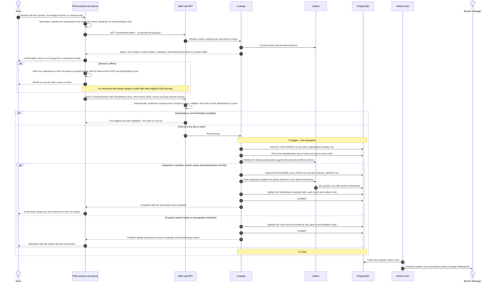

# Sequence — barcode handoff at a phase boundary

This is the second of the four representative flows of issue #18. It follows a single scan from the moment a Tailor
points a phone at a garment job's label to the moment the custody chain and the job's phase both reflect the handoff:
the payload is decoded and may be queued while the device is offline, the check character and namespace are validated
on the server, the custody transfer is authorised against the **current holder** and the actor's branch scope,
idempotency makes a repeated scan a no-op, an immutable custody event is appended, the job's phase advances, and a
reconciliation case is opened when the scan contradicts what the system believes. Terms are defined in
[`../../prd/glossary.md`](../../prd/glossary.md); the transition table is
[`../../prd/state-transitions.md`](../../prd/state-transitions.md); the exception paths are EX-07 and EX-13 in
[`../../prd/exceptions.md`](../../prd/exceptions.md). Everything here is derived from
[`../../IMPLEMENTATION_PLAN.md`](../../IMPLEMENTATION_PLAN.md) Sections 3, 4 and 8 (issues #33, #35, #36, #37, #51).

---

## 1. What this flow covers

| In scope | Out of scope, and where it lives |
| --- | --- |
| Camera, keyboard-wedge and manual-entry scan sources producing one normalised payload | Label design, print and reprint — issue #35 and [`order-confirmation.md`](order-confirmation.md) |
| Resolving a payload to a garment job and its permitted actions | Resolving `S-` stock, `I-` invoice and `R-` receipt payloads, which their owning modules serve |
| Authorising a custody transfer against the current holder and the actor's branch scope | The dispatch gate, which is the payment rule of [`invoice-and-payment.md`](invoice-and-payment.md) |
| Replay of a scan queued while the device was offline | The offline queue's storage, eviction and re-login rules — issue #51 |
| Appending the custody event and advancing the job phase | Pinning the workflow version at start-production — issue #33 |
| Opening a reconciliation case on mismatch, duplicate, stale or unknown location | Resolving the case and its second-approver rule — issue #37, EX-13 |

## 2. Participating modules

| Module | Part in this flow | Mechanism it is reached by |
| --- | --- | --- |
| Custody and Barcode | Owns `barcode_identities`, `scan_events`, `custody_transfers`, `reconciliation_cases` and the job's materialised custody state; serves the resolve endpoint and the scan command | `GET /api/v1/custody/barcodes/{payload}`, `POST /api/v1/custody/scans` |
| Orders and Workflow | Owns `job_phases`, the pinned workflow version, the QC results and the ready gate; validates the phase prerequisites and applies the phase advance | `Orders.Contracts` read contract, plus the scan participant of **FBH-01** |
| Identity and Admin | Branch assignments and the actor's active session | Authorisation policies |
| Platform | Idempotency store, audit writer, outbox, correlation | `IIdempotencyStore`, `IAuditWriter` |
| Notifications and Feedback | Routes overdue-transfer and reconciliation alerts to the Branch Manager | Outbox consumer |
| Reporting | Custody and turnaround projections, never authoritative for custody | Outbox consumer |

The PWA is not a module. It classifies the namespace and check character locally **for immediate feedback only**; the
server re-validates namespace, check character, identity status and branch on every resolve and every command, and a
client-side checksum pass is never trusted (INV-BID-07).

## 3. Sequence

## 4. Transaction boundaries

| Id | Boundary | Contains | Serialisation point | If it fails |
| --- | --- | --- | --- | --- |
| — | Resolve | Nothing written except the audit row for a manual lookup | None | The card is not shown; the Tailor retries or falls back to the job number |
| **T1** | **Record scan** | One `scan_events` row, the `custody_transfers` or `reconciliation_cases` row it drives, the job's materialised custody state, the phase advance, the audit event and the outbox rows | `SELECT … FOR UPDATE` on the job's materialised custody row | The whole scan rolls back; no event, no phase change, no case. The client retries with the same key |
| T2 | Outbox dispatch | The claim transaction and each handler's own transaction with its inbox record | `locked_by` and `locked_until` | The lease expires and the message is redelivered; handlers are inbox-deduplicated |

The materialised custody row is the serialisation point precisely because the event stream is append-only and carries
no concurrency token. Two devices scanning the same garment cannot interleave: one wins, the other sees the current
state (INV-CDY-01, INV-CDY-08).

**Repeated scans are a no-op, not an error.** Three mechanisms overlap:

| Mechanism | Key | Result on repeat |
| --- | --- | --- |
| `Idempotency-Key` | Principal, route template and key | The original response is replayed byte for byte; a different body under the same key is `422 idempotency.key-reused`; a duplicate in flight waits up to five seconds then `409 idempotency.in-progress` |
| Client event UUID | `(actor_id, client_event_uuid)` | Unique index rejects the second insert and the original outcome is returned. The **same** UUID under a different actor is `409 custody.event-conflict`, never a replay |
| Domain guard | Current phase and custodian | A scan that would repeat a completed transition is refused against the pinned workflow version's transition graph |

Authentication and authorisation run before the idempotency lookup, so a replay by a revoked or reassigned principal is
refused rather than served from the store. The idempotency record is retained seven days, which must exceed the
offline queue's maximum age; a configuration test asserts that relationship.

## 5. What is published to the outbox

| Event | Written by | Written in | Carries | Consumed by |
| --- | --- | --- | --- | --- |
| `custody.scan-recorded.v1` | Custody | T1 | Event id, job id and number, action, from and to custodian, location, branch code, source, server timestamp, correlation | Orders (ready-state custody predicate), Reporting, Integration relay |
| `custody.custody-transfer-requested.v1` | Custody | T1 on transfer out | Transfer id, job id, from and to custodian and branch, expiry | Notifications (pending transfer), Reporting |
| `custody.custody-transferred.v1` | Custody | T1 on receive | Transfer id, job id, accepting custodian and branch, server timestamp | Orders, Reporting, Integration relay |
| `custody.handoff-disputed.v1` | Custody | T1 on mismatch | Case id, type, job id, recorded and expected custodian, branch code | Notifications (Branch Manager), Reporting |
| `orders.job-phase-changed.v1` | Orders | T1 through the scan participant | Job id, previous state, phase code, actor role, workflow version, server timestamp | Reporting, Notifications (due-soon evaluation), Integration relay |
| `custody.custody-transfer-overdue.v1` | Custody | Worker, on the transfer SLA | Transfer id, job id, age, branch code | Notifications, Reporting |

Nothing in this flow publishes customer contact details. The resolve endpoint returns no contact fields at all, which
is covered by a contract test.

## 6. Failure modes and compensating actions

| Failure | Where | What the system does | What the Tailor sees | Compensating action |
| --- | --- | --- | --- | --- |
| Check character fails, or the symbology is unrecognised | Client, then server | Rejected as `barcode.malformed`; the server rejects it again even if the client passed it | Red flash naming the fault | Rescan; if the label is damaged, resolve by job number instead — EX-07 |
| `S-`, `I-` or `R-` payload presented to the garment resolve endpoint | Server | `barcode.wrong-namespace` | The namespace is named | Scan the garment label; a stock label belongs to the material flow |
| Identity is `superseded` or `invalidated` | Server | Resolves with the job number and a **Reprint label** action for holders of `custody.reprint_label` | The card shows why | Reprint; the old payload stays resolvable for history and is never reassigned |
| Label unreadable or missing | Client | Manual entry offers, in order, pick from my queue, job number, then raw payload | The fallback is offered without leaving the flow | Each fallback requires `custody.manual_lookup` and a reason, and writes `source = manual` on the event — EX-07 |
| Camera permission denied, or no camera | Client | Platform-specific re-enable instructions, then wedge or manual entry | The action still completes | None |
| Device offline | Client | Only allowlisted scan submissions are queued, bounded by entries and age; billing and payment stay online-only with an explicit blocked-action state | "Not yet sent", with the pending count and the job numbers | Replay on reconnect; replay pauses on the first `409` or `422` and shows the server's problem details |
| Queue evicted by the browser | Client | The metadata mirror carries job numbers and counts but no personal data | "N scans from this date were not sent", with a **Re-scan** action | Rescan the listed garments; sign-out is blocked until the notice is acknowledged |
| The same client event UUID arrives under a different actor | T1 | `409 custody.event-conflict` | The conflict is named | Rescan under the correct actor; this is never treated as a replay |
| The scan contradicts the recorded custodian | T1 | The event is still **recorded as evidence** and a reconciliation case is opened; the transition does not happen | The current custodian and the blocking reason | A `CORRECTION` event under `custody.reconcile`, needing a second approver with `custody.approve_reconciliation` and step-up above the configured threshold — EX-13 |
| Stale or out-of-order event, for example a queued scan replayed after a later one | T1 | Rejected with problem details against the transition graph; the case type is `stale` | The current state | Resolve the case; history is never edited |
| Actor is outside the job's branch scope | Authorisation | `403`, audited as `authz.denied` | "Not permitted for this branch" | A cross-branch transfer grants the destination branch exactly receive, reject and resolve while the transfer is pending, and nothing else |
| Database unavailable | T1 | The command fails; nothing is half-written | A retryable error that keeps the pending scan | Retry with the same key. See [`../failure-modes.md`](../failure-modes.md) |
| Worker stopped | T2 | Custody stays correct and current; the ready-state predicate, alerts and projections lag | Scanning is unaffected | Restart; the gate is re-evaluated at the dispatch attempt, so a stale value can delay but never release a garment |

## 7. Authorisation and evidence

| Property | Rule |
| --- | --- |
| Permission | `custody.scan` for the scan and the resolve; `custody.manual_lookup` with a reason for every manual route; `custody.reconcile` and, above the threshold, `custody.approve_reconciliation` with step-up for a correction |
| Branch scope | Evaluated on the job's current custody branch. While a cross-branch transfer is pending, `TransferScopeRequirement` grants the destination branch receive, reject and resolve on exactly the listed jobs |
| Clock | The server timestamp orders the custody chain; the client time and device are recorded as evidence only |
| Audit | Every scan command carries `[Audited("custody.scan")]`; every denied attempt at a state-changing endpoint is audited as `authz.denied`, coalesced per actor, endpoint and minute and never sampled |
| Immutability | `scan_events` and `custody_transfers` are append-only and trigger-protected; the application role holds INSERT only |

## 8. Open decisions

| ID | Question | Interim position | Resolves under | Owner | Raised |
| --- | --- | --- | --- | --- | --- |
| **FBH-01** | Is the phase advance applied inside the custody transaction through a scan participant, or asynchronously by an Orders handler on `custody.scan-recorded.v1`? | Proposed, to be confirmed: inside the same transaction through the participant hook already sanctioned for order confirmation, so the confirmation card is truthful the moment it turns green and the next scan cannot see a stale phase. The asynchronous alternative would make the phase eventually consistent | Plan Section 11 registration with issues #33 and #37 | Technical reviewer | 2026-09-04 |
| **FBH-02** | Which transitions require the confirmation card before committing, per branch? | Proposed, to be confirmed: the `Scanning:ConfirmBeforeCommit` default of dispatch, delivery confirmed, QC result, cross-branch transfer out and correction, with receive, phase start and complete, transfer accept, stocktake count and material issue in continuous mode | Plan Section 11 item 7 (**OD-07**, device matrix) with issue #36 | Business owner with the Tailor Master | 2026-09-04 |
| **FBH-03** | The transfer acceptance SLA per transfer type, after which `custody.custody-transfer-overdue.v1` is raised | Proposed, to be confirmed: configurable per branch and transfer type, evaluated in the branch timezone against the working calendar. No numeric default is asserted here | Plan Section 11 item 6 (**OD-06**, branches and calendars) with issue #37 | Business owner | 2026-09-04 |
| **FBH-04** | The offline queue's bound and maximum age, and therefore the required idempotency retention | Proposed, to be confirmed: a default of 200 entries and 24 hours against an idempotency retention of seven days. The relationship, not the numbers, is fixed by a configuration test | Plan Section 11 item 7 (**OD-07**) with issues #19 and #51 | Business owner | 2026-09-04 |
| **FBH-05** | The reconciliation threshold above which a second approver is required | Proposed, to be confirmed: branch change, phase skip and dispatch reversal always exceed it; the remaining threshold is set with the permission matrix | Plan Section 11 item 13 (**OD-13**) with issue #37 | Business owner | 2026-09-04 |

## 9. Related documents

[`order-confirmation.md`](order-confirmation.md) allocated the identity this flow scans.
[`invoice-and-payment.md`](invoice-and-payment.md) supplies the fail-closed dispatch gate that the dispatch scan calls.
[`stock-reservation.md`](stock-reservation.md) is the material side of the same phase boundary.
[`../failure-modes.md`](../failure-modes.md) covers the offline device, the stopped worker and the unreachable
database in full. [`../invariants.md`](../invariants.md) sections 4.7 and 4.8 hold the invariants named above.

## 10. Maintenance

Amended in the same pull request that changes a scan action, an authorisation rule or a case type. A new scan action
needs a row in the transition table of [`../../prd/state-transitions.md`](../../prd/state-transitions.md) first, then a
message here. Issues #33, #35, #36, #37, #48 and #51 check this file before merging.
