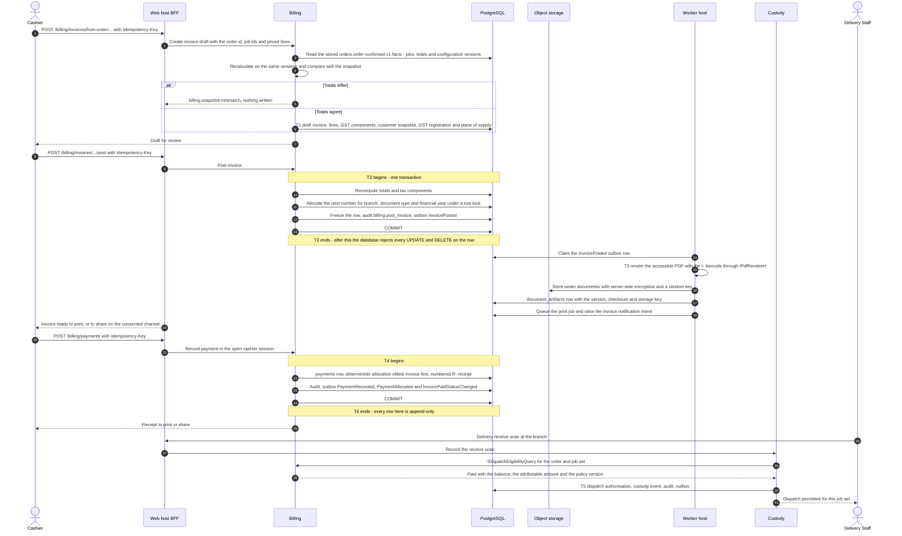

# Sequence — invoice posting, payment and the dispatch gate

This is the third of the four representative flows of issue #18. It follows the money from the frozen order snapshot
to the moment a garment may legally leave the branch: the invoice draft is built from the order snapshot and
recalculated on the same pricing and tax configuration versions, posting allocates the next document number from the
per-branch and financial-year sequence and freezes the row, the PDF is rendered and stored under the Billing-owned
`documents/` prefix, a payment is recorded and allocated, a numbered receipt is issued, and
`IDispatchEligibilityQuery` starts answering `Paid` so that the dispatch scan of
[`barcode-handoff.md`](barcode-handoff.md) stops refusing. Money, rounding, GST composition and financial-year rules
are in [`../conventions.md`](../conventions.md) sections 1 and 2; the invariants are INV-INV and INV-PAY in
[`../invariants.md`](../invariants.md); the transition table is
[`../../prd/state-transitions.md`](../../prd/state-transitions.md). Everything here is derived from
[`../../IMPLEMENTATION_PLAN.md`](../../IMPLEMENTATION_PLAN.md) Sections 3, 4 and 9 (issues #41, #42, #43, #48).

---

## 1. What this flow covers

| In scope | Out of scope, and where it lives |
| --- | --- |
| Converting a confirmed order into an invoice draft on its own snapshot | Pricing configuration and the calculation engine itself — issue #41 |
| Posting with an atomic per-branch and per-financial-year number | Credit and debit notes, and invoice cancellation — issue #42, EX-08 and EX-09 |
| Rendering and storing the accessible PDF under `documents/` | The print station and the printer matrix — issue #35 |
| Recording a payment, allocating it and issuing the receipt | Provider payment intents and callbacks — issue #55 |
| Turning dispatch eligibility from blocked to `Paid` | The dispatch scan and the doorstep confirmation — [`barcode-handoff.md`](barcode-handoff.md), issue #48 |
| The single-use dispatch exception when the rule blocks | Who may approve one, which is an owner decision |

## 2. Participating modules

| Module | Part in this flow | Mechanism it is reached by |
| --- | --- | --- |
| Billing and Payments | Owns price list and tax configuration versions, invoices, tax components, document sequences, document artefacts, payments, allocations, advances, receipts, cashier sessions and dispatch exceptions | `POST /api/v1/billing/invoices/from-order/{orderId}`, then the post, payment and allocation endpoints |
| Orders and Workflow | Supplies the order's status, garment jobs, price snapshot and the configuration versions used at confirmation. Billing never references Orders entities, and makes no call into Orders in this flow | `orders.order-confirmed.v1`, stored by Billing in its own types when the order was confirmed, together with the order id, job ids and priced lines carried on the create-invoice command |
| Customers and Measurements | Supplies the customer snapshot stored on the draft | `ICustomerSnapshotQuery` |
| Custody and Barcode | Calls the eligibility contract at the delivery receive scan and records the dispatch authorisation. Custody never computes a balance and never reads `dispatch_exceptions` | `Billing.Contracts.IDispatchEligibilityQuery` |
| Platform | Sequence allocator, idempotency store, audit writer, outbox, print queue, PDF port | `ISequenceAllocator`, `IPdfRenderer`, `IPrintQueue` |
| Media and object storage | The `documents/` prefix is Billing's alone; no other module writes to it | Storage adapter under the per-module credential |
| Notifications and Feedback | Invoice-issued and receipt messages, on the consented channel | Outbox consumer |
| Reporting | Sales, GST, payment and receivables projections, never authoritative | Outbox consumer |

Billing calls nothing in Orders here. **ARCH-010** in [`../architecture-rules.md`](../architecture-rules.md) admits no
exception, and section 5.8 of [`../module-ownership.md`](../module-ownership.md) fixes the same reading, so the draft
is built from the `orders.order-confirmed.v1` payload Billing already holds and from the identifiers and priced lines
supplied on the command. Plan Section 6.2 note 13 and the issue #42 blueprint still name
`Orders.Contracts.IOrderSnapshotQuery` among Billing's inputs; that wording is corrected with issue #42, and the rule
stands meanwhile.

## 3. Sequence

## 4. Transaction boundaries

| Id | Boundary | Contains | Serialisation point | If it fails |
| --- | --- | --- | --- | --- |
| T1 | Create draft | Draft invoice, lines, tax components, customer snapshot, GST registration, place of supply, audit | None; a draft holds no number | Nothing is written. No number has been allocated, so nothing is lost |
| **T2** | **Post invoice** | Recomputed totals, the allocated number, the frozen row, audit, outbox | The `document_sequences` row for branch, document type and financial year, locked for update | The whole posting rolls back and the number is released with it, so numbers are never skipped and never reused |
| T3 | Render and store the artefact | PDF bytes in object storage, then the `document_artifacts` row with its checksum | None | The invoice stays posted and legally valid; only the file is missing. Re-render from the persisted calculation snapshot, which is the source, not the file |
| T4 | Record payment and allocate | `payments`, `payment_allocations`, advances applied, `receipts`, audit, outbox | The invoice row for the allocation, and the cashier session row | No money is recorded. The Cashier retries with the same key |
| T5 | Dispatch authorisation | The eligibility answer, the authorisation record, the custody event, audit, outbox | The job's materialised custody row | No authorisation exists, so the gate stays closed. The gate fails closed by construction |

Posting is deliberately **not** dependent on object storage. Rendering happens outside T2 so that a storage outage can
never block a sale, and so that no external I/O runs inside a database transaction — the same rule that keeps provider
calls out of transactions. The consequence is stated as open decision **FIP-01**.

Immutability is enforced by the database, not by the application: a trigger rejects every UPDATE and DELETE on posted
invoices, payments, allocations, receipts and refunds, and the application role holds INSERT only. A correction is
always a new document — an appended cancellation record plus a credit note where value has been recognised, or a
reversal or refund row — and the original PDF still renders with its original hash.

## 5. GST, rounding and numbering

| Rule | Statement |
| --- | --- |
| Amounts and rates | `decimal(18,2)` amounts, `decimal(18,4)` unit rates, `decimal(6,3)` tax rates. No floating point anywhere in the path |
| Rounding | Line-level half-up to paise, then a document round-off to the nearest rupee, configurable per branch |
| Composition | CGST and SGST for an intra-state supply, IGST for an inter-state one, decided by the place of supply recorded on the draft against the branch's GST registration |
| Reproducibility | Every calculation stores the pricing and tax configuration versions used, so a historical invoice reproduces exactly after a later publication |
| Numbering | `document_sequences` per branch, document type and financial year, April to March, allocated under a row lock inside T2 |
| Currency and locale | INR only, formatted with lakh and crore grouping; the PDF embeds a Tamil-capable font |
| Cards | PAN, CVV and track data are never stored or logged; only the masked last four digits, the network, the provider reference and the authorisation code |

## 6. What is published to the outbox

| Event | Written by | Written in | Carries | Consumed by |
| --- | --- | --- | --- | --- |
| `billing.invoice-posted.v1` | Billing | T2 | Invoice id and number, order id, customer id, branch code, financial year, totals, persisted tax components, configuration versions, posted-at | Worker (render and print), Notifications, Reporting, Integration relay and accounting export |
| `billing.payment-recorded.v1` | Billing | T4 | Payment id, mode, amount, branch code, cashier session id, provider reference where present | Notifications, Reporting, Integration relay |
| `billing.payment-allocated.v1` | Billing | T4 | Payment id, invoice ids and allocated amounts | Reporting |
| `billing.invoice-paid-status-changed.v1` | Billing | T4 | Invoice id, derived status, outstanding balance | Orders and Custody displays, Reporting |
| `billing.advance-applied.v1` | Billing | T4 when an advance is applied | Advance id, invoice id, amount | Reporting |
| `billing.dispatch-exception-approved.v1` | Billing | The approval transaction | Exception id, order id, job ids, maximum outstanding amount, policy version, expiry, approver | Notifications, the Owner dashboard, Reporting |
| `custody.dispatch-recorded.v1` | Custody | T5 | Authorisation id, order id, job ids, eligibility reason, policy version, branch code | Notifications, Reporting |

Consumers never recalculate: the events carry the persisted tax components and the configuration versions, and a
reporting projection is never the authoritative source of a financial figure.

## 7. The dispatch gate

The gate is a **synchronous, fail-closed contract call**, not a projection.
`IDispatchEligibilityQuery.GetDispatchEligibility(orderId, jobIds[])` returns `Eligible`, a `Reason`, the order
balance, the attributable amount, the exception id where one applies, the evaluation time and the policy version. The
balance is computed by Billing alone as posted charges minus allocations minus credits plus refunds, plus unapplied
advances linked to the order.

| Reason | Meaning | Dispatch |
| --- | --- | --- |
| `NotEvaluated` | No posted invoice, or the query has no real implementation registered | **Blocked**. This is the default implementation's answer, so an unfinished deployment cannot release a garment |
| `Unpaid` | Balance greater than zero under the `full` rule | Blocked |
| `PartialBelowThreshold` | Paid share below the configured threshold under `partial_threshold` | Blocked |
| `Paid` | Balance zero under `full`, or the threshold met | Permitted |
| `ApprovedException` | A valid single-use `dispatch_exceptions` record covers this order and job set | Permitted once |

A dispatch exception is the single mechanism, owned by Billing. It is approved under
`billing.approve_dispatch_exception` with step-up and a reason, bound to the order, the job set, a maximum outstanding
amount, the policy version and an expiry of at most 72 hours; it is consumed exactly once; the approver must differ
from the person performing the dispatch, checked at scan time. Failed-QC, held and wrong-custody jobs have no
exception path at all.

## 8. Failure modes and compensating actions

| Failure | Where | What the system does | What the Cashier or Delivery Staff sees | Compensating action |
| --- | --- | --- | --- | --- |
| Recalculated totals differ from the order snapshot | T1 | `billing.snapshot-mismatch`; nothing is written | The differing figures | Investigate the configuration version drift; revise the order before production, or price the difference as a separate document |
| A second invoice is attempted for the same garment jobs | T1 | Refused; partial invoicing per job set only where policy permits | The existing invoice is named | Use the existing invoice, or a debit note |
| Two Cashiers post at the same instant | T2 | The sequence row lock serialises them; no duplicate and no skipped number | Both see their own invoice | None |
| A duplicate post with the same key | T2 | The original invoice is returned | The same invoice | None |
| Someone attempts to edit a posted invoice | After T2 | The database rejects the UPDATE, even for the application role | An error, and an audit row | Cancellation record plus a credit note; the number is never reused |
| The PDF renderer fails, or object storage is unavailable | T3 | The invoice stays posted; the artefact row is not written; storage reports **Degraded** on the detail health endpoint | "Invoice document not yet available"; the in-app print view still works | Re-render when storage returns. The calculation snapshot is authoritative, the file is not |
| The worker is stopped | T3 and the outbox | Rendering, printing, notification and projections lag; nothing is lost | Posting and payment are unaffected | Restart the worker. See [`../failure-modes.md`](../failure-modes.md) |
| A payment is recorded twice, or a provider callback repeats | T4 | Idempotent on the key and on the provider reference | One payment | None |
| A provider call times out | Outside any transaction | The outcome is `unknown` and is resolved by status polling, never assumed successful. Callbacks never post financial state themselves | "Awaiting confirmation" | Poll, then record the verified outcome |
| The payment was wrong | After T4 | Rows are append-only | — | A reversal or refund row with reason, approval and step-up, plus a credit note where the charge is relieved — EX-09 |
| The cashier session does not balance at close | Session close | The variance must be explained and approved by a different user, never absorbed | The denomination count sheet against the expected total | Reconciliation batch with reason and approver |
| Dispatch attempted while the rule is unsatisfied | T5 | `custody.dispatch-blocked`; the attempt is audited | The blocking reason per job | Take the balance at the counter, or obtain a single-use exception approved by someone other than the dispatcher — EX-10 |
| An exception is presented after expiry, or the balance grew since approval | T5 | Rejected and `DispatchExceptionExpired` is published | Treated as a fresh unpaid dispatch attempt | A new approval, or a payment — EX-15 |
| The delivery fails or the parcel returns | After dispatch | The spent authorisation cannot be reused | The queue entry reopens | A compensating custody transfer back to the branch and a fresh eligibility evaluation — EX-12 |

## 9. Open decisions

| ID | Question | Interim position | Resolves under | Owner | Raised |
| --- | --- | --- | --- | --- | --- |
| **FIP-01** | Is the invoice PDF rendered synchronously at the counter, or by the worker from the outbox? | Proposed, to be confirmed: by the worker, so that posting never depends on object storage and no external I/O runs inside a transaction. The counter keeps an in-app print view meanwhile | Plan Section 11 registration with issue #42 | Technical reviewer with the business owner | 2026-09-04 |
| **FIP-02** | Which dispatch payment rule applies — full payment, a partial threshold, a per-job share, or approved exception only — and may an unapplied advance unlock dispatch? | Proposed, to be confirmed: `full` as the default rule with `dispatch.allow_on_advance` off. The gate fails closed whichever is chosen, so the choice changes the policy record, not the mechanism | Plan Section 11 item 4 (**OD-04**) with issues #43 and #48 | Business owner | 2026-09-04 |
| **FIP-03** | Who may approve a dispatch exception — the Owner only, or the Admin as well — and may Delivery Staff collect the balance at the doorstep? | Proposed, to be confirmed: Owner only, with step-up, and no doorstep collection. If doorstep collection is allowed, the take-payment screen is granted to Delivery Staff for their own stops, online only, and the policy gains `collect_on_delivery` | Plan Section 11 item 4 (**OD-04**) with issue #43 | Business owner | 2026-09-04 |
| **FIP-04** | The rounding and round-off conventions, and the statutory retention period for GST records | Proposed, to be confirmed: line-level half-up to paise and document round-off to the nearest rupee, both configurable; no financial record is hard-deleted until the retention period is set | Plan Section 11 items 5 and 8 (**OD-05**, **OD-08**) | Business owner with the accountant | 2026-09-04 |
| **FIP-05** | Whether a draft invoice may be discarded, and whether that is a deletion or a status | Proposed, to be confirmed: abandoned rather than deleted, leaving an audit row. No number has been allocated, so nothing is lost. This mirrors **SQ-06** in [`../../prd/state-transitions.md`](../../prd/state-transitions.md) | Plan Section 11 registration with issue #42 | Business owner with the accountant | 2026-09-04 |

## 10. Related documents

[`order-confirmation.md`](order-confirmation.md) froze the price snapshot this flow invoices.
[`barcode-handoff.md`](barcode-handoff.md) performs the dispatch scan that calls the gate.
[`stock-reservation.md`](stock-reservation.md) carries the cost side of the same order.
[`../conventions.md`](../conventions.md) fixes money, rounding, financial year and numbering.
[`../invariants.md`](../invariants.md) sections 4.10 to 4.12 hold the immutability invariants.
[`../failure-modes.md`](../failure-modes.md) covers the storage, worker and provider outages named above.

## 11. Maintenance

Amended in the same pull request that changes a financial rule, a document type or the eligibility contract. A change
to the tax composition, the rounding or the numbering also amends [`../conventions.md`](../conventions.md) and needs
the accountant's review. Issues #41, #42, #43, #44 and #48 check this file before merging.
