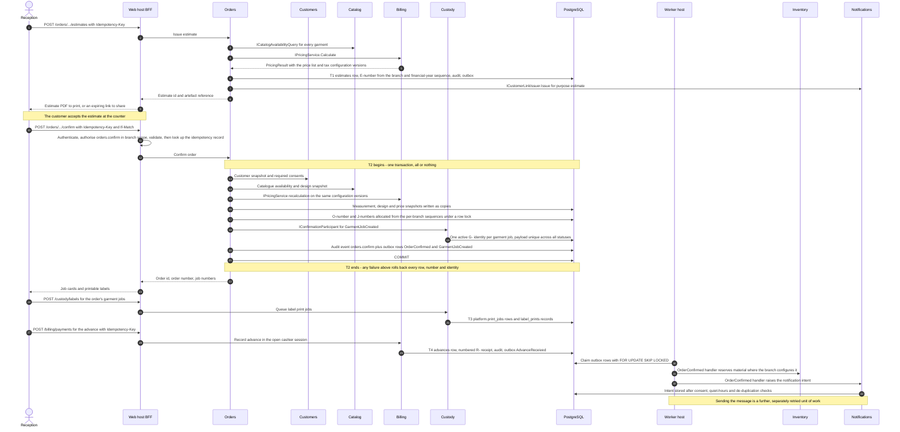

# Sequence — order confirmation and barcode allocation

This is the first of the four representative flows that issue #18 uses to test the architecture against reality. It
records what happens between the moment a customer accepts an estimate at the counter and the moment Reception holds a
printable job card: the price, measurement and design snapshots are frozen, the order and garment job numbers are
allocated, one opaque barcode identity is allocated per garment job, labels are queued for print, an advance is
recorded, and a notification intent is raised. It states which module does each step, where each database transaction
begins and ends, what is written to the outbox, what happens when each step fails and what compensates for it. Terms
are defined in [`../../prd/glossary.md`](../../prd/glossary.md); the authoritative transition table is
[`../../prd/state-transitions.md`](../../prd/state-transitions.md); the rules the transaction must not break are in
[`../invariants.md`](../invariants.md). Everything here is derived from
[`../../IMPLEMENTATION_PLAN.md`](../../IMPLEMENTATION_PLAN.md) Sections 3, 4 and 8 (issues #32a, #35, #41, #43, #47);
anything the plan has not settled is registered in section 8 below.

---

## 1. What this flow covers, and what it does not

| In scope | Out of scope, and where it lives |
| --- | --- |
| Issuing a priced estimate from a shared order draft | Building the draft itself and capturing measurements — issues #28 and #32b |
| Confirming the order in one all-or-nothing transaction | Starting production and pinning the workflow version — [`barcode-handoff.md`](barcode-handoff.md) and issue #33 |
| Freezing the measurement, design and price snapshots | Revising an order after production has started — alteration requests, issue #34 |
| Allocating display numbers and one active barcode identity per garment job | Reprinting a damaged label — EX-07 in [`../../prd/exceptions.md`](../../prd/exceptions.md) |
| Queueing labels to the branch print station | Printing itself, which is a separate transaction and may lag or fail |
| Recording an advance and issuing its receipt | Posting the tax invoice — [`invoice-and-payment.md`](invoice-and-payment.md) |
| Raising a notification intent for the confirmation message | Reserving material against the confirmed order — [`stock-reservation.md`](stock-reservation.md) |

## 2. Participating modules

Every cross-module call below is either a `Contracts` read contract, a `Platform.Abstractions` port or an integration
event. No module reads another module's tables; the ownership rule and its enforcement are in
[`../module-ownership.md`](../module-ownership.md).

| Module | Part in this flow | Mechanism it is reached by |
| --- | --- | --- |
| Orders and Workflow | Owns the draft, estimate, order, garment jobs and all three snapshots; orchestrates the confirmation transaction | The `POST /api/v1/orders/{draftId}/confirm` endpoint |
| Customers and Measurements | Supplies the customer snapshot and confirms that the required consents are recorded | `ICustomerSnapshotQuery`, `IConsentQuery` |
| Catalog and Design | Confirms that the category, service type, measurement template, workflow definition and QC checklist versions are available, and builds the design snapshot | `ICatalogAvailabilityQuery`, `GarmentDesignSnapshot` builder |
| Billing and Payments | Prices the estimate and recalculates at confirmation; records the advance and its receipt in a separate transaction | `IPricingService`, then the payments endpoint |
| Custody and Barcode | Allocates exactly one active `G-…` identity per garment job **inside** the confirmation transaction; queues the label print jobs afterwards | `IBarcodeIdentityAllocator` registered as a confirmation participant |
| Media | Confirms that the referenced material and reference images are in the `ready` state | `IMediaReference` |
| Platform | Sequence allocation, idempotency store, audit writer, outbox, print queue | `ISequenceAllocator`, `IIdempotencyStore`, `IAuditWriter`, `IPrintQueue` |
| Inventory | Reserves material against the confirmed order where the branch configures it | Outbox consumer of `orders.order-confirmed.v1` |
| Notifications and Feedback | Issues the estimate customer link, then raises the order-confirmed notification intent | `ICustomerLinkIssuer`, outbox consumer |

## 3. Sequence

## 4. Transaction boundaries

| Id | Boundary | Contains | Serialisation point | If it fails |
| --- | --- | --- | --- | --- |
| T1 | Issue estimate | Estimate row, `E-…` number, calculation snapshot, audit, outbox | The branch and financial-year sequence row | Nothing is issued; the draft is untouched and the counter retries with the same key |
| **T2** | **Confirm order** | Order, garment jobs, measurement, design and price snapshots, `O-…` and `J-…` numbers, every barcode identity, audit event, outbox rows | The sequence rows, then the partial unique index on the active barcode identity | The whole confirmation rolls back. There is no partly confirmed order, no orphan display number and no orphan identity |
| T3 | Queue label prints | `platform.print_jobs` rows and `label_prints` records | None | The order stands; labels are queued again from the job card. INV-BID-05 does not depend on printing |
| T4 | Record advance | `advances` row, allocation where an invoice already exists, receipt, audit, outbox | The cashier session row | No money is recorded; the counter retries. An advance is never implied by a confirmation |
| T5 | Outbox dispatch, per message | One claim transaction, then the handler's own transaction with its inbox record | `locked_by` and `locked_until` on the outbox row | The lease expires and the message is redelivered; every handler is inbox-deduplicated |

Three properties make T2 safe to retry. Authentication and authorisation run **before** the idempotency lookup, so a
replay by a revoked principal is refused rather than served from the store. The same key with a different request body
is `422 idempotency.key-reused`. A duplicate arriving while the first is in flight waits up to five seconds and then
returns `409 idempotency.in-progress`.

The PDF for the estimate is rendered through `IPdfRenderer` and stored under the Billing-owned `documents/` prefix
**outside** T1 and T2. Neither the estimate nor the confirmation depends on object storage being reachable; see
[`../failure-modes.md`](../failure-modes.md).

## 5. What is published to the outbox

Each row is written to the publishing module's own `outbox_messages` table in the same transaction as the change, and
dispatched at least once by the worker. Payloads carry identifiers, codes, statuses, timestamps, amounts and branch
codes only.

| Event | Written by | Written in | Carries | Consumed by |
| --- | --- | --- | --- | --- |
| `orders.estimate-issued.v1` | Orders | T1 | Estimate id and number, order draft id, customer id, totals, configuration versions, validity date, branch code | Billing, to prefill an invoice draft only; Reporting |
| `orders.order-confirmed.v1` | Orders | T2 | Order id and number, revision number, customer id, branch code, garment job ids and numbers, category and service version references, due dates, totals, configuration versions, confirmed-at | Inventory (reservation), Billing, Notifications, Reporting, Integration relay |
| `orders.garment-job-created.v1` | Orders | T2 | Job id and number, order id, category and service version, due date, priority, branch code | Custody, Reporting, Integration relay |
| `platform.print-job-queued.v1` | Platform | T3 | Print job id, document type `label`, format, artefact key, branch code, target station | The print station screen; Reporting for print volumes |
| `billing.advance-received.v1` | Billing | T4 | Advance id, customer id, order id, amount, payment mode, receipt number, cashier session id, branch code | Notifications (receipt message), Reporting, Integration relay |

Barcode allocation publishes no event of its own. It is a consequence of `orders.garment-job-created.v1` and is proved
by the partial unique index of INV-BID-02, not by a message.

The notification intent is created by Notifications from `orders.order-confirmed.v1` after the consent, communication
preference, quiet-hours and de-duplication checks. Until issue #47 merges, the Notifications module carries only the
customer-link skeleton, so the intent is recorded and no message is sent; that sequencing is note 9 of plan Section 6.2.

## 6. Failure modes and compensating actions

| Failure | Where | What the system does | What Reception sees | Compensating action |
| --- | --- | --- | --- | --- |
| A garment has neither a confirmed measurement version nor an explicit reuse | T2 precondition | Refuses the confirmation | A field error naming each incomplete garment | Capture the measurement from the **Measurements needed** queue, then confirm again |
| A required consent is missing, or a referenced image is still in quarantine | T2 precondition | Refuses the confirmation | A field error naming the consent or the image | Record the consent, or wait for the media pipeline to promote the object |
| The catalogue, template or workflow version was retired while the draft was open | T2 precondition | Refuses the confirmation | The unavailable version is named | Re-select on the current published version; the draft is re-priced |
| Recalculated totals differ from the estimate | T2 | Refuses with a pricing mismatch | The estimate is shown as superseded with the new total | Reissue the estimate at current prices; an expired estimate is never silently honoured |
| Two counter devices confirm the same draft | T2 | The `If-Match` loser gets `409` with the current version; a genuine replay of the same `Idempotency-Key` returns the original order | The confirmed order, once | None. The idempotency record is the compensation |
| A barcode payload collides | T2, inside the participant | The allocator retries with a fresh payload; the unique index makes a duplicate impossible rather than unlikely | Nothing | None |
| Any confirmation participant throws | T2 | The whole transaction rolls back | A retryable error that keeps the typed input | Retry with the same `Idempotency-Key` |
| The sequence row is contended | T2 | The row lock serialises allocation; numbers are never skipped or reused | A short wait | None |
| The PDF renderer or object storage is unavailable | Outside T1 and T2 | Confirmation still succeeds; the artefact is rendered when storage returns | "Estimate not yet available"; the in-app print view still works | Re-render from the estimate; the calculation snapshot is the source, not the file |
| The print station is offline or the label prints badly | T3 | The print job stays queued or is marked failed | The job card offers **Send to print station** and **Download PDF** | Requeue; the print station's Verify step scans the fresh label before it is attached. A damaged label follows EX-07 |
| The worker is stopped | T5 | Outbox rows accumulate in order per aggregate; nothing is lost | Confirmation is unaffected; reservations, notifications and reports lag | Restart the worker; the dispatcher drains in order. See [`../failure-modes.md`](../failure-modes.md) |
| The confirmation was wrong | After T2 | Confirmation is **irreversible** | — | Revise the order while every job is still `confirmed`, or cancel and place a new order. After production starts the only route is an alteration request |

## 7. Authorisation, idempotency and audit

| Property | Rule |
| --- | --- |
| Authorisation | `orders.confirm` evaluated with branch scope on the draft's branch; label printing needs `custody.print_label`, a batch above the configured cap needs `custody.bulk_print_label`; recording the advance needs `payments.record` in an open cashier session |
| Idempotency | `Idempotency-Key` is mandatory on the estimate, confirm, print and payment endpoints; the record key is principal, route template and key, retained seven days |
| Concurrency | The draft is edited under `ETag`/`If-Match` per garment section; a lost race is `409` with the current version |
| Audit | `orders.confirm` is appended by the `SaveChanges` interceptor inside T2 and hash-chained by a database trigger; label printing and the advance write their own audit events in T3 and T4 |
| Personal data | Barcode payloads contain no personal data and no display number; the generator's signature accepts no customer, order, phone or name input |

## 8. Open decisions

Each carries an interim position so that no step above is left undefined, and each is registered against
[Section 11 of the plan](../../IMPLEMENTATION_PLAN.md#11-decisions-required-from-the-business-owner) and mirrored into
[`../../prd/assumptions-and-open-decisions.md`](../../prd/assumptions-and-open-decisions.md).

| ID | Question | Interim position | Resolves under | Owner | Raised |
| --- | --- | --- | --- | --- | --- |
| **FOC-01** | Does confirmation itself enqueue a label print job per garment job, or is printing always an explicit action? | Proposed, to be confirmed: printing stays an explicit, separately audited action under `custody.print_label`, so that a confirmation never consumes label stock and a reprint is never implicit. Confirmation only makes the labels printable | Plan Section 11 item 9 (**OD-09**, label format) with issue #35 | Business owner | 2026-09-04 |
| **FOC-02** | May an advance be taken before any invoice exists, and does it unlock dispatch on its own? | Proposed, to be confirmed: yes to the first — an advance is recorded against the customer and order and is later applied. Dispatch unlocking depends on `dispatch.allow_on_advance`, which is a branch configuration, not a rule of this flow | Plan Section 11 item 4 (**OD-04**) with issue #43 | Business owner | 2026-09-04 |
| **FOC-03** | Which message is sent on confirmation, on which channel, and within what quiet hours? | Proposed, to be confirmed: one confirmation message carrying the order number, the promised date and the balance, on the customer's consented preferred channel, suppressed and audited where no consented channel exists | Plan Section 11 item 3 (**OD-03**, providers) with issue #47 | Business owner | 2026-09-04 |
| **FOC-04** | Whether a second confirmation attempt after a rolled-back transaction should reuse the display numbers reserved by the failed attempt | Proposed, to be confirmed: it must not. Numbers are allocated inside the transaction and released with it, so a rolled-back attempt leaves no gap and no orphan | Plan Section 11 registration with issue #32a | Business owner with the accountant | 2026-09-04 |

## 9. Related documents

[`barcode-handoff.md`](barcode-handoff.md) picks the garment job up at its first phase boundary.
[`invoice-and-payment.md`](invoice-and-payment.md) turns the frozen price snapshot into a posted invoice.
[`stock-reservation.md`](stock-reservation.md) follows the material this confirmation reserves.
[`../failure-modes.md`](../failure-modes.md) states what each step does when a dependency is down.
[`../module-ownership.md`](../module-ownership.md), [`../invariants.md`](../invariants.md) and
[`../conventions.md`](../conventions.md) fix the ownership, the invariants and the money, time and identifier rules
this flow relies on.
[`../reviews/flow-review.md`](../reviews/flow-review.md) is the agenda and record of the session that walks this flow
against the diagram above with Reception and the module owners.

## 10. Maintenance

This document is amended in the same pull request that changes the flow. A new participant in T2 needs a row in
section 2 and a message in the diagram; a new event needs a row in section 5 with its consumers; a new refusal needs a
row in section 6 with its compensating action. Issues #32a, #32b, #35, #41, #43 and #47 each check this file before
merging, and [`../reviews/flow-review.md`](../reviews/flow-review.md), the review record of the four flows against
the diagrams, is the evidence item for issue #18.
