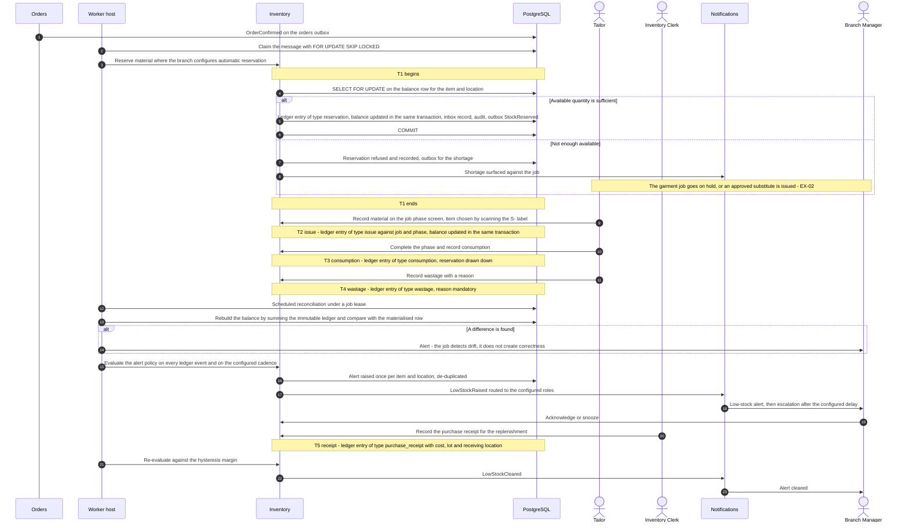
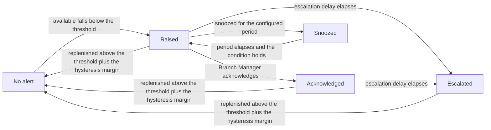

# Sequence — stock reservation, issue, consumption and the low-stock alert

This is the fourth of the four representative flows of issue #18. It follows a length of cloth from the moment an
order is confirmed to the moment the shelf is refilled: material is reserved against the confirmed order, issued to a
Tailor at a phase, consumed when the phase completes, wastage is recorded with its reason, the balance is recomputed
from the immutable ledger and reconciled against the materialised figure, a low-stock alert is raised on the branch's
alert policy and is later cleared by a purchase receipt. Every quantity in this flow is a signed quantity in the item's
base unit on an append-only ledger; the balance is a derived cache that must always be rebuildable from it. Terms are
in [`../../prd/glossary.md`](../../prd/glossary.md); the invariants are INV-STK in
[`../invariants.md`](../invariants.md); the exception paths are EX-02 and EX-08 in
[`../../prd/exceptions.md`](../../prd/exceptions.md). Everything here is derived from
[`../../IMPLEMENTATION_PLAN.md`](../../IMPLEMENTATION_PLAN.md) Sections 3, 4 and 9 (issues #38, #39, #40, #47).

---

## 1. What this flow covers

| In scope | Out of scope, and where it lives |
| --- | --- |
| Reserving material against a confirmed order | Order confirmation itself — [`order-confirmation.md`](order-confirmation.md) |
| Issuing to a Tailor against a job and a phase | The phase transition itself — [`barcode-handoff.md`](barcode-handoff.md) |
| Consumption at phase completion, and wastage with a reason | Purchase order approval and supplier management — issue #38 |
| Recomputing the balance from the ledger and reconciling drift | Valuation and the costing method — issue #40 and **OD-05** |
| Raising, escalating and clearing a low-stock alert | Notification templates, channels and providers — issue #47 |
| Releasing a reservation when a job or order is cancelled | The cancellation decision and its financial side — EX-08 |

## 2. Participating modules

| Module | Part in this flow | Mechanism it is reached by |
| --- | --- | --- |
| Inventory | Owns items, units and conversions, suppliers, locations, reorder rules, alert policies, the immutable `ledger_entries`, the derived `balances`, reservations, purchase receipts, stocktakes and customer-material custody records | The movement, reservation and purchase-receipt endpoints |
| Orders and Workflow | Supplies the garment job and phase references that a job-linked movement must carry; publishes the confirmation and cancellation that drive reservation and release | `orders.order-confirmed.v1`, `orders.job-cancelled.v1`, job references on the movement |
| Custody and Barcode | Resolves the `S-` stock label scanned when selecting an item on the shop floor | The resolve endpoint of the owning module |
| Platform | Idempotency store, audit writer, outbox, job leases for the scheduled evaluations | `IIdempotencyStore`, `IAuditWriter`, `platform.job_leases` |
| Notifications and Feedback | Routes the low-stock alert to the configured roles, with de-duplication, quiet hours and escalation | Outbox consumer of the inventory alert events |
| Reporting | Wastage and estimated-profitability analytics across branches, never authoritative for a balance | Outbox consumer |

Inventory serves its own operational stock reports from its own ledger and never writes to the `reporting` schema.
`Inventory.Contracts.IStockBalanceQuery` and `IValuationQuery` are the only ways another module reads stock.

## 3. Sequence

## 4. Transaction boundaries

| Id | Boundary | Contains | Serialisation point | If it fails |
| --- | --- | --- | --- | --- |
| **T1** | Reserve | One `reservation` ledger entry, the updated balance, the inbox record, audit and outbox | `SELECT … FOR UPDATE` on the balance row for the item and location | Nothing is reserved; the outbox message is redelivered and the inbox record makes the retry safe |
| T2 | Issue to a Tailor | One `issue` ledger entry carrying the job and phase, the updated balance, audit and outbox | The same balance row | Nothing is issued; the movement is retried with the same key |
| T3 | Consume at completion | One `consumption` ledger entry, the reservation drawn down, the updated balance, audit and outbox | The same balance row | The phase completion and the consumption are separate commands, so one may be repeated safely |
| T4 | Record wastage | One `wastage` ledger entry with a mandatory reason, the updated balance, audit | The same balance row | Nothing is recorded |
| T5 | Purchase receipt | Receipt header and lines, one `purchase_receipt` ledger entry per line with unit cost and lot, the updated balances, audit and outbox | The balance rows, in a fixed order | The whole receipt rolls back: a receipt failing mid-post leaves no ledger entry and no balance change |
| T6 | Transfer between locations | A balanced pair of `transfer_out` and `transfer_in` entries in one transaction | Both balance rows | Neither leg is posted; a half transfer cannot exist |
| T7 | Reconciliation and alert evaluation | Read-only rebuild, then the alert state transition and its outbox row | `platform.job_leases` | The lease expires and another worker instance repeats the evaluation |

Two rules make the numbers trustworthy. First, **the balance is updated in the same database transaction as the ledger
insert, never through the outbox**, so a reader never sees a ledger entry without its effect. Second, **the balance is
a derived cache**: the scheduled job rebuilds it by summing the ledger and alerts on any difference, so the job detects
drift rather than creating correctness. A property test asserts that the rebuild equals the materialised balances.

Corrections are compensating entries only. A correcting entry carries `corrects_entry_id`; an adjustment with reason
`correction` and no link is rejected. No ledger entry is ever updated or deleted — the trigger refuses, and the
application role holds INSERT only.

## 5. What is published to the outbox

| Event | Written by | Written in | Carries | Consumed by |
| --- | --- | --- | --- | --- |
| `inventory.stock-reserved.v1` | Inventory | T1 | Reservation id, item id, location id, quantity in base unit, order id, job id, branch code | Orders display, Reporting, Integration relay |
| `inventory.stock-released.v1` | Inventory | Release on cancellation or expiry | Reservation id, quantity, reason code, job id | Orders display, Reporting |
| `inventory.stock-consumed.v1` | Inventory | T3 | Ledger entry id, item id, location id, quantity, job id, phase code, branch code | Reporting, Integration relay |
| `inventory.purchase-received.v1` | Inventory | T5 | Receipt id, supplier id, item ids, quantities, unit costs, lot references, location, branch code | Reporting, accounting export |
| `inventory.low-stock-raised.v1` | Inventory | T7 | Item id, location id, available and on-hand quantities, threshold, policy version, branch code | Notifications, Reporting |
| `inventory.low-stock-cleared.v1` | Inventory | T7 | Item id, location id, quantity after replenishment, branch code | Notifications, Reporting |
| `inventory.stocktake-posted.v1` | Inventory | Stocktake posting | Session id, variance lines, approver, branch code | Reporting |

Wastage is carried on the ledger and reported by Inventory and Reporting; it has no separate integration event in the
plan's published list, and none is invented here.

## 6. The low-stock alert state machine

The alert is branch configuration, audited when changed, not code. The policy fixes the evaluation basis (available
against on hand), whether open purchase quantity counts, the hysteresis margin used for clearing, the evaluation
cadence, the escalation delay and the target roles.

Alerts are de-duplicated per item and location, so a burst of ledger events cannot produce a burst of messages. An
alert cleared without a replenishment is counted as a false positive and is one of the metrics the alert policy is
tuned against.

## 7. Failure modes and compensating actions

| Failure | Where | What the system does | What staff see | Compensating action |
| --- | --- | --- | --- | --- |
| Not enough available stock to reserve | T1 | The reservation is refused; the row lock means stock is never oversubscribed | The shortage against the job | Put the garment job on hold with a reason, or issue an approved substitute, and raise a purchase order — EX-02 |
| Negative stock would result from an issue | T2 | The configurable negative-stock policy either blocks or allows with approval | The blocking reason, or the approval prompt | `inventory.approve_negative_stock` with reason and step-up where the policy allows it |
| Two devices reserve the same last piece | T1 | The balance row lock serialises them; one succeeds, the other is refused | One reservation | None |
| A movement request is repeated | T2 to T5 | Idempotent on the `Idempotency-Key`; the original outcome is returned | One entry | None |
| A purchase receipt fails part way | T5 | The whole receipt rolls back, leaving no ledger entry and no balance change | Nothing posted | Re-enter the receipt |
| The wrong quantity was posted | After any commit | Ledger entries are immutable | — | A compensating entry carrying `corrects_entry_id`; an adjustment with reason `correction` and no link is rejected |
| The balance differs from the ledger | T7 | The reconciliation job reports the difference and alerts; the ledger is authoritative | A reconciliation alert with the item and location | Rebuild the balance from the ledger, then investigate the write path. The drift is a defect, not a correction |
| The garment job or order is cancelled | Outbox consumer | The reservation is released as a `release` ledger entry | The released quantity on the item card | Customer material is returned and recorded against the customer-material custody record — EX-08 |
| The worker is stopped | T1 and T7 | Reservations driven by the outbox, the reconciliation job and the alert evaluation all pause; nothing is lost | Manual movements still post normally; alerts lag | Restart the worker; leases expire and messages are redelivered. See [`../failure-modes.md`](../failure-modes.md) |
| The notification provider fails | After T7 | The delivery record carries the failure reason and is retried with backoff, then dead-lettered | The alert stays visible in the in-app centre, which is the staff-side fallback | Operator replay under `notifications.replay` with reason and step-up — EX-14 |
| An alert is raised repeatedly for the same item | T7 | De-duplicated per item and location; clearing uses the hysteresis margin so a balance hovering on the threshold does not flap | One alert | Tune the margin and the cadence in the branch alert policy |
| A stocktake finds a variance | Stocktake posting | Above the configured threshold, approval by a different user is required; the variance posts as ledger adjustments linked to the session evidence | The variance sheet | The adjustment entries, never an edit of history |

## 8. Open decisions

| ID | Question | Interim position | Resolves under | Owner | Raised |
| --- | --- | --- | --- | --- | --- |
| **FSR-01** | What determines the reserved quantity when an order is confirmed — a per-service-type material list held in the catalogue, or an explicit reservation entered by the Inventory Clerk? | Proposed, to be confirmed: explicit reservation is the default, and automatic reservation from a material list is enabled per branch only where the list exists. The plan reserves "when configured" and fixes no list | Plan Section 11 item 10 (**OD-10**, initial catalogue) with issues #38 and #39 | Business owner with the Tailor Master | 2026-09-04 |
| **FSR-02** | Is consumption recorded automatically at phase completion, or as a separate deliberate movement? | Proposed, to be confirmed: a separate movement, so that a phase completion is never blocked by a stock error and a consumption is never implied by a scan | Plan Section 11 registration with issue #39 | Business owner with the Tailor Master | 2026-09-04 |
| **FSR-03** | The valuation method, and the treatment of returns, wastage and adjustments in it | Proposed, to be confirmed: weighted average by default with FIFO optional, both from immutable source costs, documented for the accountant's sign-off | Plan Section 11 item 5 (**OD-05**) with issue #40 | Business owner with the accountant | 2026-09-04 |
| **FSR-04** | The alert thresholds, evaluation cadence, escalation delay, hysteresis margin and target roles per branch | Proposed, to be confirmed: all five are branch configuration and audited when changed. No numeric default is asserted here; the initial values are set with the reorder rules | Plan Section 11 item 10 (**OD-10**) with issue #40 | Business owner with the Inventory Clerk | 2026-09-04 |
| **FSR-05** | Whether negative stock is blocked outright or allowed with approval, per branch | Proposed, to be confirmed: blocked by default, with `inventory.approve_negative_stock` available where a branch chooses to allow it | Plan Section 11 item 13 (**OD-13**) with issue #39 | Business owner | 2026-09-04 |

## 9. Related documents

[`order-confirmation.md`](order-confirmation.md) raises the confirmation this flow reacts to.
[`barcode-handoff.md`](barcode-handoff.md) is the phase boundary at which material is issued and consumed.
[`invoice-and-payment.md`](invoice-and-payment.md) is the revenue side of the same order.
[`../failure-modes.md`](../failure-modes.md) covers the stopped worker and the failing provider in full.
[`../invariants.md`](../invariants.md) section 4.9 and [`../module-ownership.md`](../module-ownership.md) section 5.7
hold the ledger invariants and the ownership rules named above.

## 10. Maintenance

Amended in the same pull request that adds a ledger entry type, an alert transition or a reservation rule. A new entry
type needs a row in section 5 where it publishes an event, a row in section 7 where it can fail, and a compensating
route. Issues #38, #39, #40 and #47 check this file before merging.
