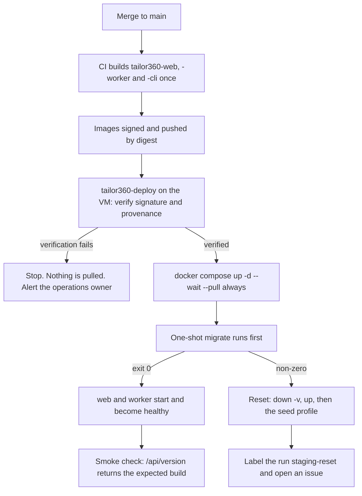

# Interim staging

The operating manual for the interim staging environment: what it is for, how it is reached, what it holds, how a
release gets onto it, and how it is reset when a deploy goes wrong. The stack itself is
[`../../infra/compose/docker-compose.staging.yml`](../../infra/compose/docker-compose.staging.yml) with
[`../../infra/caddy/Caddyfile`](../../infra/caddy/Caddyfile); the rules those files obey are
[`../../infra/README.md`](../../infra/README.md) and Section 4.7 of
[`../IMPLEMENTATION_PLAN.md`](../IMPLEMENTATION_PLAN.md). This document is the environment's own manual and is
where anything not visible in the compose file is written down.

---

## 1. Status

| Field | Value |
| --- | --- |
| Status | **Defined, not yet running.** The stack is complete enough to bring up, but no virtual machine has been provisioned, because the machine's location is owner decision **OD-02** (section 10) |
| Written | Issue #22, wave W1 |
| Superseded by | Issue #59, which replaces this with infrastructure-as-code-managed staging and production. #22 builds the shape #59 hardens; it does not build something #59 throws away |
| Owner of the document | Technical reviewer, with the operations owner once that role is filled (**RG-OD-02** in [`../process/release-gates.md`](../process/release-gates.md)) |
| What is still owed before it can run | Section 12 |

Nothing in this document may be read as a claim that the environment exists today. Where a control is designed but
not yet effective, the row says so.

---

## 2. What the environment is for

It exists to answer four questions that a laptop cannot answer, and it is deliberately not asked to answer
anything else.

| Purpose | Why a development machine cannot do it |
| --- | --- |
| **Does the built image work?** | Development runs the hosts from the .NET SDK and the client from Vite. Staging runs the same image digest a shop would run, as a non-root user on a read-only filesystem behind the same proxy |
| **Does the deployment work?** | Migration ordering, secret files, health gating and the container swap are properties of the deployment, not of the code, and they are only exercised by deploying |
| **Do the shop's devices work?** | Printers, label stock, hardware scanners and phone cameras are physical. The device matrix of [`../nfr/support-matrix.md`](../nfr/support-matrix.md) is rehearsed against a real server on a real network, not against `localhost` |
| **Can somebody who is not the author use it?** | A counter walkthrough with a member of staff needs a stable address, seeded data and no developer sitting next to the machine |

It is **not** a performance environment, not a data-migration rehearsal environment and not a place to reproduce a
production incident. Those need production-like data, and staging is never allowed to hold any (section 5).

---

## 3. How it is reached

Access is gated **in front of** the stack, never by it. The application login is the second factor and never the
only one: a login page reachable from the internet is a login page under attack, and until the authentication
issue (#23) merges there is no login page worth the name at all.

Three layers, all of which must pass:

| Layer | What it is | What it stops | Where it is configured |
| --- | --- | --- | --- |
| **1. Network allowlist** | An IP allowlist for the branch networks' egress addresses, applied by the host firewall or the cloud security group | Anything from an address the business does not use | The virtual machine, not this repository. It depends on OD-02 |
| **2. Identity-aware enrolment** | Either an identity-aware proxy in front of Caddy, or WireGuard/Tailscale enrolment on each phone, tablet and laptop that needs in | A device nobody enrolled, and an address that is allowlisted but not the shop's | The virtual machine. Enrolment is per device and is revoked when a device is lost |
| **3. The application login** | The ordinary sign-in, with the roles and permissions of #23 and #24 | A person on an enrolled device who is not entitled to what they asked for | The application |

**There is no public hostname until #23 merges.** This is why
[`../../infra/compose/.env.example`](../../infra/compose/.env.example) defaults `TAILOR360_BIND_ADDRESS` to
`127.0.0.1` and why the Caddy site address is a bare port rather than a name: the proxy is published on the
machine's loopback or its tunnel address, and everything reaches it through layer 2. Setting
`TAILOR360_BIND_ADDRESS=0.0.0.0` is a security change, not a convenience, and needs the same review as a change to
an authorisation rule.

A consequence worth stating plainly: because layer 2 terminates TLS, the traffic between the gate and Caddy is
plain HTTP on the machine's own loopback interface. That is acceptable only while both ends are on the same host.
The moment the gate moves off the machine, the site address gains a name, ACME DNS-01 is switched on (section 9)
and Caddy terminates TLS itself.

### 3.1 Getting access

1. The business owner approves the person and the device.
2. The operations owner adds the device to the enrolment (layer 2) and, where the branch has a fixed egress
   address, that address to the allowlist (layer 1).
3. The person is given an application account with the role they actually need, seeded like any other synthetic
   account. No shared accounts: an audit trail with one login in it teaches nothing.
4. Removal is the same list in reverse, and is done the day a device or a person leaves, not at the next review.

---

## 4. What runs there

| Service | Image | Published? | Notes |
| --- | --- | --- | --- |
| `caddy` | `TAILOR360_CADDY_IMAGE`, default the pinned stock image | **Yes** — `TAILOR360_BIND_ADDRESS:8080` | The only entry point. Adds `X-Robots-Tag`, answers `/health` and `/health/*` with 404, strips `Server` |
| `web` | `TAILOR360_WEB_IMAGE` (promoted digest) | No | Reached only through Caddy. Non-root, read-only root filesystem, all capabilities dropped |
| `worker` | `TAILOR360_WORKER_IMAGE` (promoted digest) | No | Its health port 8081 answers on the backend network only |
| `migrate` | `TAILOR360_CLI_IMAGE` (promoted digest) | No | One-shot. Runs on every `up`; web and worker wait for it with `condition: service_completed_successfully` |
| `init-reference-data` | `TAILOR360_CLI_IMAGE` | No | One-shot, `seed` profile. Idempotent and production-safe |
| `seed-synthetic` | `TAILOR360_CLI_IMAGE` | No | One-shot, `seed` profile. Refuses to run when the environment resolves to Production, with no override |
| `postgres` | `postgres:16.13-alpine` | **No ports at all** | Administrative access is over the tunnel plus `docker compose exec`, which leaves an audit trail on the machine |
| `minio` | pinned MinIO release | **No ports at all** | Neither the S3 API nor the console is published |
| `createbuckets` | pinned `mc` release | No | One-shot; creates the three buckets and sets them non-anonymous |
| `clamav` | `clamav/clamav:1.4.6` | **No ports at all** | Not behind a profile here: staging is where the media pipeline of #31 is rehearsed with the real scanner |
| `mailpit` | pinned Mailpit release | **Yes** — `TAILOR360_BIND_ADDRESS:8025` | Every notification lands here. Published on the gated address only, so a rehearsal can be inspected |
| `otel-collector` | pinned collector release | No | `observability` profile. Exports nothing until the telemetry backend is decided (**OD-14**) |

The two published ports are the whole external surface. Everything else is reachable only from the compose
network. Adding a `ports:` key to `postgres`, `minio` or `clamav` is a security change; see rule 2 of
[`../../infra/CLAUDE.md`](../../infra/CLAUDE.md).

---

## 5. What it holds, and what it never holds

**It holds synthetic data only.** The dataset is the deterministic one `seed-synthetic` creates: fixed
identifiers, two branches so that branch-scope rules can actually be exercised, and per-module fixtures as those
modules arrive. Anything a tester types into it during a rehearsal is theirs to type, and is treated as disposable
because a reset destroys it.

**It never holds:**

| Never | Why, and what to do instead |
| --- | --- |
| Production or customer-derived data of any kind, including a "small extract" or an anonymised copy | Anonymisation of measurements, photographs and phone numbers is not reliable, and staging is reachable by more people than production. A restore rehearsal is the one exception, and it is defined by the backup and disaster-recovery issue (#60), runs into a throwaway environment, and is not this one |
| Production secrets | Every secret here is generated for this environment and used nowhere else (section 8) |
| Provider credentials — payment gateway, SMS, WhatsApp, e-mail | Mail goes to Mailpit; the payment, SMS and messaging adapters stay on their fakes. A staging environment that can send a real message to a real customer will eventually send one |
| A search-engine-visible page | `X-Robots-Tag: noindex, nofollow, noarchive, nosnippet` is set at the proxy for this environment. See the gap in section 12 |

The data classification the environment must respect is
[`../nfr/data-classification.md`](../nfr/data-classification.md); the secret classes and their handling are
[`../platform/secrets.md`](../platform/secrets.md).

---

## 6. Deploying to it

Deployment is **pull-based**: the machine fetches and verifies, and no build system holds a key into it. The same
script, `tailor360-deploy`, is what production will use, so the deployment path is exercised long before there is
a production to exercise it on (ADR-0010,
[`../adr/0010-deployment-portability.md`](../adr/0010-deployment-portability.md)).

Every merge to `main` **will produce** images — no job builds them yet, which is item 2 of section 12 — and the
deploy that follows then does this and only this:



The rules behind that diagram, which are the ones to argue with rather than the boxes:

1. **Build once, promote the digest.** Nothing is built on the machine. A tag can move; a digest cannot.
2. **Verify before pulling.** An unverified image is not deployed, and the failure is loud.
3. **The application never migrates itself.** During a swap two versions run at once and would race for the
   schema. `migrate` is a separate one-shot that both hosts wait on, and it can hold a database role the
   application does not have once the per-role grants of Section 4.4 exist.
4. **A failed migration resets the environment; it is never repaired in place.** A half-migrated staging database
   is worse than an empty one: every subsequent test result is suspect, and the person who inherits it cannot tell
   which failures are real. The reset is section 7.2.
5. **A reset is always visible.** The run is labelled `staging-reset` and an issue is opened describing the
   migration that failed, with the migration log attached. A reset that nobody notices is how a broken migration
   reaches production.
6. **Rollback is redeploying the previous digest.** It works because migrations are expand–migrate–contract and
   the start-up check tolerates a database one release ahead — see [`migrations.md`](migrations.md).
7. **Compose has no rolling update.** Swapping the web container costs a few seconds of proxy errors. That is
   accepted against the availability target and minimised with `--wait`; blue-green arrives with the orchestrated
   environments of #59.

---

## 7. Provisioning, and resetting

Both sequences run on the machine, from the repository checkout, with `TAILOR360_WEB_IMAGE`,
`TAILOR360_WORKER_IMAGE`, `TAILOR360_CLI_IMAGE` and `TAILOR360_STAGING_SECRETS_DIR` set. The stack refuses to
start without them rather than falling back to a local default.

### 7.1 First provisioning

```bash
cd infra/compose

# 1. Backing services, the one-shot migration, then web, worker and the proxy.
docker compose -f docker-compose.staging.yml up -d --wait --pull always

# 2. Reference data: audit partitions and the rows every installation needs. Idempotent.
docker compose -f docker-compose.staging.yml --profile seed run --rm init-reference-data

# 3. The synthetic dataset. Refuses to run if the environment resolves to Production.
docker compose -f docker-compose.staging.yml --profile seed run --rm seed-synthetic
```

Steps 2 and 3 sit behind the `seed` profile deliberately. Reference data is idempotent, but re-seeding on every
deploy would silently undo a change a tester made on purpose during a rehearsal, and the person whose test data
vanished would have no way to tell that a deploy did it.

### 7.2 Reset, after a failed migration

```bash
cd infra/compose

# Destroy the containers *and the volumes*. The database, the buckets and the mailbox all go.
docker compose -f docker-compose.staging.yml down --volumes

# Rebuild from nothing: `up` runs the one-shot migration against an empty database.
docker compose -f docker-compose.staging.yml up -d --wait --pull always
docker compose -f docker-compose.staging.yml --profile seed run --rm init-reference-data
docker compose -f docker-compose.staging.yml --profile seed run --rm seed-synthetic
```

Then, without exception: label the deploy run `staging-reset`, and open an issue that names the migration which
failed, attaches its log, and links the pull request that introduced it. The issue is not closed by the reset; it
is closed by the fix.

### 7.3 Reading what happened

```bash
docker compose -f docker-compose.staging.yml logs migrate          # the migration output
docker compose -f docker-compose.staging.yml ps                    # health of every service
docker compose -f docker-compose.staging.yml exec postgres psql \
  --username tailor360 --dbname tailor360 --command '\dn'          # schemas actually present
```

`/health/live`, `/health/ready` and `/health/startup` answer on the container port and are refused by the proxy
with 404, so they are read with `docker compose exec` or from the machine itself, never from a browser on a phone.

---

## 8. Secrets on the machine

Every secret this environment uses is generated **for this environment** and used nowhere else. A staging secret
that also opens something in production is not a staging secret.

| Secret file | Read by | Notes |
| --- | --- | --- |
| `Database__ConnectionString` | `web`, `worker`, `migrate` and the two seeding services | The file name is the configuration key: the hosts read the directory with the key-per-file provider, where `__` is the section separator, so the file lands at `Database:ConnectionString` |
| `ObjectStorage__AccessKey`, `ObjectStorage__SecretKey` | `web`, `worker` | Bound when the object-storage work of #31 lands; declared now so the deployment shape does not change then |
| `postgres_password` | `postgres` | Read through `POSTGRES_PASSWORD_FILE`. A password never belongs in an `environment:` block |
| `minio_root_user`, `minio_root_password` | `minio`, `createbuckets` | Read through the `_FILE` variants for the same reason |

They live in the directory named by `TAILOR360_STAGING_SECRETS_DIR` — `/etc/tailor360/secrets` by convention —
placed there by the deploy script from the operator's secret store, mode `0440`, owned so that only the container
user can read them. They are never committed, never passed as a build argument and never put in an `environment:`
block, because build arguments survive in the image history and environment values are visible to anyone who can
run `docker inspect`. Write them with `printf`, not `echo`: a trailing newline becomes part of the configuration
value. Rotation and the secret classes are [`../platform/secrets.md`](../platform/secrets.md).

---

## 9. TLS and the hostname

The environment has no name yet, so it has no certificate yet, and that is the intended state rather than an
oversight.

When it gets one, the challenge must be **DNS-01**: the machine sits behind NAT or a firewall that does not
publish port 80, so HTTP-01 cannot complete. Switching it on needs three things, in this order:

1. **The hostname and the DNS provider**, which come with OD-02 (section 10). `TAILOR360_SITE_ADDRESS` then
   carries a name instead of a bare port.
2. **A Caddy image built with that provider's DNS module.** The official image contains none, so `acme_dns` fails
   at start-up. It is built with the `caddy:*-builder-alpine` image and `xcaddy`, then promoted by digest through
   `TAILOR360_CADDY_IMAGE` — which the compose file already reads — rather than by editing a file on the machine.
3. **The provider API token**, mounted as a file and read with `{file./run/secrets/acme_dns_token}`, never baked
   into an image and never placed in a compose environment block.

The block is written out, commented, in [`../../infra/caddy/Caddyfile`](../../infra/caddy/Caddyfile) so that
enabling it is an edit of four lines rather than a research exercise under time pressure.

---

## 10. Where the virtual machine lives — **undecided**

**This is owner decision OD-02 and it is open.** It is recorded in
[`../prd/assumptions-and-open-decisions.md`](../prd/assumptions-and-open-decisions.md) as "Hosting model and
indicative monthly budget", is plan Section 11 item 2, and is needed before the W0 exit gate. Nothing in this
document picks an option, and no work should assume one: the choice changes the network gate, the backup
destination, the TLS approach and the availability figures that #19 must state per hosting model.

What each option would mean for **this** environment, so that the decision can be taken on evidence rather than
on preference:

| | Cloud virtual machine | Machine at the shop |
| --- | --- | --- |
| Layer 1 of the gate | Cloud security group, allowlisting each branch's egress address | Host firewall on the local network; the branch is already inside it |
| Layer 2 of the gate | Identity-aware proxy or a tunnel; devices enrol from anywhere | A tunnel is still needed for anyone off the shop network |
| Reaching it from a branch | Over the internet, so branch broadband is in the path of every rehearsal | On the local network, so a printer or scanner test is a local hop |
| Printer and scanner rehearsals | The device is at the shop and the server is not: the browser is at the shop, so it works, but a network fault at the shop looks like an application fault | The realistic case for the shop-server deployment, and the only way to rehearse it honestly |
| Cost shape | Monthly, predictable, stops when the machine stops | One-off hardware, plus the electricity and the person who reboots it |
| Failure while nobody is there | Provider console, from anywhere | Somebody drives to the shop |
| What it rehearses | The cloud production option | The on-premises production option |

The sizing assumption on the table either way is 2 vCPU and 8 GB, from assumption **A5** in the same register.
That is enough for the stack in section 4 with ClamAV, which is the memory-hungry part.

### 10.1 How the shop network reaches it for printer and scanner rehearsals

This is the part of OD-02 that is specific to this project, and it is why the decision cannot be deferred
indefinitely: the label printers and hardware scanners are at the counter, and #35 and #36 must be rehearsed
against them.

The rehearsal always runs **from a device on the shop network** — the counter tablet or the counter workstation —
because that is where the printer and the scanner are. What changes with the decision is what sits between that
device and the application:

- **Machine at the shop.** The device reaches the proxy over the local network, through layer 1 only. Printing and
  scanning are then a true rehearsal of the on-premises deployment, including its failure modes.
- **Cloud machine.** The device reaches the proxy through the tunnel over branch broadband. Printing and scanning
  still work, because both are local to the browser, but a slow or dropped branch link during a rehearsal must be
  recorded as a network observation and not as an application defect. Record the link's latency alongside the
  result, or the rehearsal proves less than it appears to.

Either way the rehearsal needs: the device matrix of [`../nfr/support-matrix.md`](../nfr/support-matrix.md)
confirmed (**OD-07**), the label format confirmed (**OD-09**), real label stock, and a member of counter staff
doing the scanning rather than the engineer who wrote it.

---

## 11. Its relationship to the release gates

The environment is where several release gates get their evidence, so a change that breaks it stops a release even
though nothing in it ships:

| Gate | What staging provides | Where the gate is defined |
| --- | --- | --- |
| The built image runs as it will be run | A deploy of the promoted digest, with the smoke check | [`../process/release-gates.md`](../process/release-gates.md) |
| Migration applies to a real database | The `migrate` service's log on every deploy | [`migrations.md`](migrations.md), DoD 4 |
| Physical rehearsals | Printer, scanner and device evidence | Section 10.1; #35, #36, #52 |
| Rollback works | A redeploy of the previous digest, rehearsed with the database one release ahead | Section 6 rule 6 |

The evidence itself is recorded per release in [`../process/release-evidence.md`](../process/release-evidence.md).

---

## 12. Still owed

Written plainly, because a gap that is documented can be planned around and a gap that is implied cannot.

| # | What is missing | Effect today | Owed by |
| --- | --- | --- | --- |
| 1 | **The virtual machine itself.** No host has been provisioned | The environment is defined and not running. Nothing below can be observed yet | OD-02, then #22 or #59 |
| 2 | **`infra/docker/Dockerfile.cli` and the job that builds, signs and promotes `tailor360-cli`** | `TAILOR360_CLI_IMAGE` has nothing to point at, so `migrate` and the `seed` profile cannot run. The same is true of the web and worker images: no job builds them either | #22 continuation, or #59 |
| 3 | **`scripts/tailor360-deploy`** | The deploy policy of section 6 is a written procedure an operator follows by hand; signature verification, the reset branch, the `staging-reset` label and the issue are not automated | #22 continuation, or #59 |
| 4 | **The persisted Data Protection key ring** (`platform.data_protection_keys`) | `DataProtection__ApplicationDiscriminator` is declared on both hosts but nothing binds it yet, and with a read-only root filesystem each container holds an ephemeral ring. Staging users are therefore signed out whenever the web container restarts, and the isolation from production rests today on staging having its own database | #23, with the session work |
| 5 | **`X-Robots-Tag` from the application** | The header is set by the proxy only. Everything reaches the environment through the proxy, so nothing is indexable today, but the guard-rail is one hop deep rather than two | A one-line addition to the web host's security-headers middleware |
| 6 | **The per-role database grants** (`t360_migrator`, `t360_app`, and the rest of Section 4.4) | Every process — web, worker, migrator and seeder — connects with the same connection string, so the migrator's rights are the application's rights | #21 continuation |
| 7 | **Backups of the environment** | There are none, by design: a reset is the recovery procedure, because the environment holds nothing that cannot be regenerated. When that stops being true, it is the wrong environment for whatever made it untrue | — |
| 8 | **ACME DNS-01** | Section 9. Blocked on OD-02 and on #23 | OD-02, #23 |
| 9 | **Digests for the two MinIO images** (`quay.io/minio/minio`, `quay.io/minio/mc`) | Every other third-party image in the staging stack is pinned `tag@sha256:...`; these two are pinned by tag alone, because quay.io was not reachable from the environment the file was written in and a guessed digest would have looked pinned without being it. A moved tag would change what staging runs without a commit | Resolve with `docker buildx imagetools inspect` and commit, before the first deployment |

---

## 13. Related documents

| Document | What it covers that this one does not |
| --- | --- |
| [`../../infra/README.md`](../../infra/README.md) | What every compose file and Dockerfile is, and how to run the development stacks |
| [`../../infra/CLAUDE.md`](../../infra/CLAUDE.md) | The rules a change to the infrastructure files must obey |
| [`ports.md`](ports.md) | Every port in every stack, what binds it and on which interface |
| [`migrations.md`](migrations.md) | How a migration is written, reviewed and rolled back |
| [`commands.md`](commands.md) | The development script's verbs |
| [`setup.md`](setup.md), [`troubleshooting.md`](troubleshooting.md) | Getting a development machine working, and what to do when it is not |
| [`../architecture/deployment.md`](../architecture/deployment.md) | The deployment view of the architecture, of which this environment is one instance |
| [`../adr/0010-deployment-portability.md`](../adr/0010-deployment-portability.md) | Why the deployment is compose-and-digest rather than provider-specific |
| [`../platform/secrets.md`](../platform/secrets.md) | Secret classes, rotation and what to do after a leak |
| [`../nfr/data-classification.md`](../nfr/data-classification.md) | What each class of data is, and what may hold it |
| [`../process/workflow-demo.md`](../process/workflow-demo.md) | The end-to-end demonstration that a change reaches a tagged build and can be reverted |
