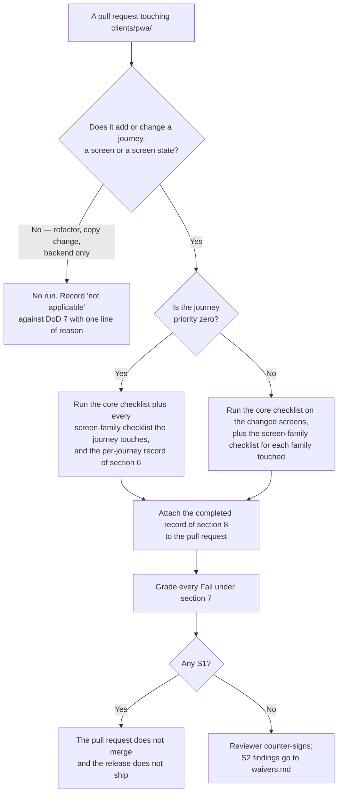

# HyFib Tailor 360 — Manual accessibility checklist

This is the worksheet a person fills in while walking a journey through HyFib Tailor 360 with a screen reader and a
keyboard. It exists because the automated gate cannot answer the questions that matter most: axe-core can prove that
a button has a name, but not that the name is the right one; it can prove a live region exists, but not that a
Tailor holding a garment ever hears the scan result. Everything here is therefore a **human judgement recorded on a
dated, signed, attachable record** — the evidence behind **NFR-AC-03** in [`traceability.md`](traceability.md) and
the screen-reader half of gate **RG-06** in [`../process/release-gates.md`](../process/release-gates.md). Read it
with [`accessibility-localisation.md`](accessibility-localisation.md), which fixes the WCAG 2.2 AA commitment and
the shop-floor sizing rules this checklist tests against, and with
[`support-matrix.md`](support-matrix.md) section 8, which fixes the assistive-technology pairings a run is valid on.
Numbers this document invents rather than takes from WCAG or from a sibling document are marked **proposed, to be
confirmed** and are collected in section 9.

---

## 1. Status and scope

| Field | Value |
| --- | --- |
| Status | **Draft — proposed**; binding once the stakeholder review in [`reviews/stakeholder-review.md`](reviews/stakeholder-review.md) is signed |
| Drafted | 2026-09-04, issue #19, wave W0 |
| Supersedes | The interim arrangement in [`accessibility-localisation.md`](accessibility-localisation.md) section 15, which expected this checklist to arrive with #50 and treated its own section 4 as the checklist until then. That clause is spent from this document's merge and is corrected in the same pull request |
| Owner of the document | Technical reviewer, with the Owner as approver |
| What it is | The **manual** accessibility checklist. Automated coverage — axe-core on every screen and state, the overflow and obscured-focus helper, the target-size and text-spacing checks — is defined in [`accessibility-localisation.md`](accessibility-localisation.md) section 14 and is not repeated here. This document holds only what a machine cannot decide |
| Gate that consumes it | **RG-06 — Accessibility scan**. Its "What it checks" row names "the screen-reader items of `a11y-checklist.md` for any journey changed since the previous release", and its "Evidence produced" row names "the completed screen-reader checklist" |
| Traceability row it proves | **NFR-AC-03** — *every priority-zero journey is completable with a keyboard alone and with a screen reader* — whose proof type is **Evidence only**, at a cadence of *per release for changed journeys*. It also supplies the evidence half of **NFR-AC-01** and the reviewer check behind **NFR-AC-05** |
| Also required by | **DoD 7** in [`../process/definition-of-done.md`](../process/definition-of-done.md) — *"the screen-reader items in `a11y-checklist.md` are worked through for any new journey"*, verified by *"the completed checklist attached as evidence"*, enforced by *"Human — author, spot-checked by the reviewer"*; and **DOR-14** in [`../process/definition-of-ready.md`](../process/definition-of-ready.md), which requires the screens and states to be listed before the work starts, so the runner knows what to walk |
| Who runs it | The author of the change, on the pairing chosen under section 2.3. The reviewer spot-checks at least two failed or not-applicable answers before approving — **proposed, to be confirmed** (A11Y-OD-07) |
| Who signs it | The runner signs the record; the reviewer counter-signs at the pull request. At a release, the **Owner** confirms the accessibility evidence, as release-evidence item 7 of [`../process/release-gates.md`](../process/release-gates.md) requires |
| Where a completed record lives | Attached to the pull request, and carried into the release evidence index. The proposed file location is `docs/nfr/a11y-records/<yyyy-mm-dd>-<journey>-<pairing>.md` — **proposed, to be confirmed** (A11Y-OD-06) |
| Standard tested against | **WCAG 2.2, Level AA**, plus the four AAA criteria [`accessibility-localisation.md`](accessibility-localisation.md) section 2 adopts — 2.3.3, 2.4.13, 3.3.9 and 1.4.6 |
| Invented numbers | Every number this document introduces — the time-box, the validity period, the sample size, the pairing rotation, the record location, the barrier definition — is **proposed, to be confirmed** and is listed in section 9 |
| Review cadence | Every release train; and in the same pull request whenever a new screen family or a new journey is added |

**In scope**: the staff progressive web application on phone, tablet and desktop; the customer-facing estimate,
status and feedback pages; and the on-screen previews of rendered documents. **Out of scope**: the printed artefact
itself, which is covered by the rendered-document requirements of
[`accessibility-localisation.md`](accessibility-localisation.md) section 12.4 and the print evidence of
[`support-matrix.md`](support-matrix.md) section 9; and any configuration outside the pairings of
[`support-matrix.md`](support-matrix.md) section 8, which is unsupported rather than silently degraded.

---

## 2. How to use this checklist

### 2.1 When a run is required



| Trigger | What must be run | Source of the rule |
| --- | --- | --- |
| A pull request adds a **new journey** | The core checklist on every screen of the journey, every screen-family checklist that applies, and the section 6 record for that journey | DoD 7 |
| A pull request changes an **existing screen or state** | The core checklist on the changed screens and states, and the screen-family checklist for each family touched | DoD 7, RG-06 |
| A release | The section 6 record for **every journey changed since the previous release**; and for the priority-zero journeys, a record from this release train whether or not they changed | RG-06 |
| A release, per Tier 1 device class | One walkthrough in a **browser tab** and one in **installed mode**, because the two differ where it matters most — no address bar to escape to, and a different route back out of the camera overlay | Support matrix section 9 |
| A milestone | A manual walkthrough on the **NVDA with Chrome or Edge** pairing, which [`support-matrix.md`](support-matrix.md) section 8 evidences per milestone. Phone-only items are recorded `N/A — desktop pairing`, per section 2.3 | Support matrix section 8 |
| The design system changes a shared primitive — field, dialog, live region, focus ring, target token | The core checklist sections 4.2, 4.3, 4.5 and 4.8 on two journeys, because a shared primitive fails everywhere at once — **proposed, to be confirmed** (A11Y-OD-03) | This document |

**Which screens, and how often the core checklist is answered.** The core checklist is answered **once per screen**,
not once per journey: on a new journey that means every screen of it, and on a change it means every changed screen.
The screen list is the one **DOR-14** already produced before the work started, and each screen is walked in all five
of the states DoD 7 requires a story for — **loading, empty, error, offline and forbidden**. That state list is the
runner's worklist, and section 4.12 is where the empty and forbidden states are answered.

A pull request that genuinely changes no screen deletes the item from its description and says why in one line, as
[`../process/definition-of-done.md`](../process/definition-of-done.md) section 5 requires. "No time" is not a
reason.

### 2.2 Who runs it, and how long it takes

| Question | Answer |
| --- | --- |
| Who | The author of the change. Accessibility is not delegated to a specialist the project does not employ — [`accessibility-localisation.md`](accessibility-localisation.md) states plainly that no external audit is claimed (**AL-01**) |
| Who checks the check | The reviewer, who re-runs at least two items the record marks **Fail** or **Not applicable** before approving. A record with no Fail and no Not applicable across a whole journey is itself suspicious and is re-run. An answer of `N/A — desktop pairing` or `N/A — kit unavailable: <item>` is expected rather than suspicious, and is counted as a gap in coverage instead |
| Does the runner need to be an accessibility specialist | No. Every item below is a yes-or-no question about something the runner can hear or see. Section 3 gives the gestures and keys, the environment settings, the fixtures and the transcript method, so nothing has to be looked up |
| How long | Budget by the work, not by the journey — **proposed, to be confirmed** (A11Y-OD-02). The proposal is **10 minutes per screen** for the core checklist, **10 minutes per screen-family checklist**, and **20 minutes for the section 6 journey record**, with the keyboard pass and the screen-reader pass budgeted **separately**. A priority-zero journey of ten screens touching six families is therefore a day's work, not an hour's, and is planned as one. A run that overruns is not abandoned — it is a finding that the journey is long, and the overrun is recorded on the record |
| What the runner needs | A kit, not a laptop. The device and pairing of section 2.3; a paired Bluetooth keyboard for the keyboard pass; a configured **keyboard-wedge scanner**; a **printed synthetic label sheet**, including the deliberately invalid payloads of section 3.7; access to a branch **print-station queue**; the fixtures and forced states of section 3.7; a second device where a family checklist names a different device class — A11Y-BI-13 asks about phone layouts and cannot be answered on the NVDA desktop pairing alone; and synthetic data only, per plan Section 2.2. A second person is **not** required, but is useful for the priority-zero journeys because one can read the checklist aloud while the other drives |
| When a piece of kit is missing | The affected items are recorded `N/A — kit unavailable: <item>` and the run **does not** count as covering them. The gap is then visible on the record and in the release evidence, rather than absorbed into a silent Pass |
| Eyes open or closed | Eyes open. This is not an empathy exercise. The rule is stricter and easier to apply, and it is about **completing a step**: a step is Pass only if the information needed **to know what to do next** came through the assistive technology. If the runner used the screen to decide the next move during the screen-reader pass, or the mouse during the keyboard pass, the step is a Fail. The rule does **not** apply to the observation items, which deliberately ask the runner to compare what is announced with what is on the screen — every item marked `Env` in the **Pass** column of sections 4 and 5, and A11Y-09, which exists precisely to compare the two orders |

### 2.3 Which pairing a run uses

The pairings and their tiers are fixed by [`support-matrix.md`](support-matrix.md) section 8 and are restated here
so the runner does not have to open it. Nothing in this table is new.

| Platform | Screen reader and browser | Tier | Evidence cadence the matrix requires |
| --- | --- | --- | --- |
| Android | **TalkBack with Chrome** | Tier 1 | Manual walkthrough of one new journey per release, plus axe on every touched screen |
| iOS / iPadOS | **VoiceOver with Safari** | Tier 1 | Manual walkthrough per release |
| Windows | **NVDA with Chrome or Edge** | Tier 1 | Manual walkthrough per milestone |
| Windows | Narrator | Tier 2 | Spot check |
| macOS | VoiceOver with Safari | Tier 2 | Spot check |

Keyboard-only operation, 200% zoom, reduced motion and high contrast are Tier 1 on **every** platform and are not
tied to a pairing; the automated helpers cover them, and the items in this checklist that mention them exist to
catch what the helpers cannot see.

Which single pairing a given pull request uses is **proposed, to be confirmed** (A11Y-OD-01): the proposal is that
a phone-first journey — intake, measurement capture, scan, phase, delivery — is run on **TalkBack with Chrome**;
a counter or back-office journey — billing, payment, invoice posting, reports, administration — is run on **NVDA
with Chrome or Edge**; and **VoiceOver with Safari** is run at least once per release train on whichever journey
changed most, because WebKit is the engine most likely to differ. A journey that behaves differently on iOS from
Android is a finding, not a variation.

Until **#52** stands up the Windows pairing, the rotation cannot start on it. Plan Section 9, issue **#50**, walks its
journeys with VoiceOver on iOS and TalkBack on Android only, and states that #52 remains the full audit and is where
NVDA arrives. Counter and back-office journeys therefore run on **VoiceOver with Safari** in the interim, and the NVDA
leg of the rotation begins at #52.

Some items cannot be answered on a desktop pairing at all, because they are about a phone: **A11Y-16**, the shop-floor
rows of **A11Y-65**, **A11Y-67**, **A11Y-LF-09** and **A11Y-BI-13**. On NVDA they are recorded `N/A — desktop pairing`
and stay with the TalkBack and VoiceOver runs. That is a legitimate Not applicable under section 2.2, and it does not
trigger the re-run rule.

### 2.4 How long a pass is valid

**Proposed, to be confirmed** (A11Y-OD-04). A completed record is valid for:

1. **The release train it was produced in**, always; and
2. **One further release train**, if and only if the journey's screens, the design system primitives they use and
   the pairing's operating-system and screen-reader versions have all stayed the same. Any one of those changing
   ends the validity early.

A record older than that is history, not evidence. Priority-zero journeys are re-run every release train
regardless, because RG-06 makes a barrier on one of them unshippable and a stale record cannot carry that weight.

A record made in a **browser tab** does not carry to **installed mode**, and a record made in installed mode does not
carry to a tab. They are separate runs on the same journey, because the shell differs: there is no address bar to
escape to, no browser back button, and a different route out of the camera overlay.

### 2.5 How the completed record becomes evidence

1. The runner fills in the template of **section 8** — one record per journey per pairing — during the run, not
   afterwards. A record written from memory is not evidence; the same rule
   [`../process/waivers.md`](../process/waivers.md) applies to waivers applies here.
2. Every **Fail** is graded under section 7 and raises a defect **with an identifier**, before the record is
   signed. A Fail with no defect identifier is an incomplete record.
3. The record is attached to the pull request in the evidence section, which **DoD 9** in
   [`../process/definition-of-done.md`](../process/definition-of-done.md) requires to contain *"the actual outputs,
   not descriptions of them"*.
4. The reviewer spot-checks, counter-signs and merges — or refuses, if an S1 stands.
5. At the release, the records for every changed journey are gathered into the accessibility report of
   release-evidence item 7, alongside the axe reports, the keyboard walkthrough record and the accepted-violation
   list with their waiver identifiers. The **Owner** confirms that item.

### 2.6 The order of a run

This decides how the whole run is sequenced, so it is settled before the first table is opened rather than after.

For every record in this document, run the **keyboard pass first** with the screen reader **off**, then the
**screen-reader pass**. Doing it the other way round hides keyboard defects behind the screen reader's own
navigation, which is the commonest way a run produces a false Pass. Record both columns even where they agree; the
case where they disagree is the case this ordering exists to expose.

The environment items — greyscale, zoom, text spacing, reduced motion, the themes — are answered in a third
**environment pass**, after both, using the settings of section 3.6. Every item in sections 4 and 5 says which pass
answers it in its **Pass** column:

| Marker | Pass it belongs to |
| --- | --- |
| `K` | The keyboard pass, screen reader off |
| `SR` | The screen-reader pass |
| `K+SR` | Both, separately — the two answers can differ, and both are recorded |
| `Env` | The environment pass: a display, zoom, theme, spacing or motion setting is changed and the screen is looked at |

Grade every Fail as it happens, using the severity table of section 7.1, which is reprinted inside the section 8
record so the runner grades without leaving the sheet they are filling in.

---

## 3. Setting up the three Tier 1 pairings

Enough to do a walkthrough, and no more. Gesture and key defaults change between versions, so **record the screen
reader version on the record** and, where a gesture below does not do what it says, check the gesture list in the
screen reader's own settings rather than assuming the software is at fault.

Three rules apply to all three pairings:

- **Turn the screen reader off between runs.** A half-enabled screen reader produces answers that are about the
  screen reader, not about the product.
- **Do the keyboard pass separately from the screen-reader pass.** They fail differently. On a phone or tablet,
  pair a Bluetooth keyboard for the keyboard pass — this is not artificial, because the shop's **keyboard-wedge
  scanner is a keyboard** ([`support-matrix.md`](support-matrix.md) section 7.1) and every scan screen is
  therefore a keyboard screen.
- **Use synthetic data.** No real customer, phone number or photograph appears in a run or on a record.

### 3.1 TalkBack with Chrome, on Android

| Task | How |
| --- | --- |
| Turn on and off | Settings → Accessibility → TalkBack. Set the shortcut — hold both volume keys for three seconds — before starting, so it can be turned off while it is talking |
| Move to the next / previous element | Swipe right / swipe left with one finger |
| Activate the focused element | Double tap anywhere on the screen |
| Explore by touch | Drag one finger over the screen; what is under the finger is spoken |
| Scroll | Swipe with two fingers |
| Choose what to navigate by | Swipe **up then down** (or **down then up**) to step through the reading controls — Headings, Links, Controls, Landmarks, Characters, Words |
| Move by the chosen control | Swipe up or swipe down with one finger |
| Read from here | TalkBack menu → *Read from next item* |
| Stop speech | Tap once with two fingers |
| Back | Swipe **down then left** |
| Open the TalkBack menu | Swipe **down then right**, or tap with three fingers, depending on the version |
| Type into a field | Focus the field, double tap to open the keyboard, then type; the keyboard echo reads each character |

### 3.2 VoiceOver with Safari, on iOS and iPadOS

| Task | How |
| --- | --- |
| Turn on and off | Settings → Accessibility → VoiceOver. Set it as the Accessibility Shortcut — triple-click the side or home button — before starting |
| Move to the next / previous element | Swipe right / swipe left with one finger |
| Activate the focused element | Double tap anywhere on the screen |
| Scroll | Swipe with three fingers |
| The rotor — choose what to navigate by | Place two fingers on the screen and rotate them as if turning a dial. Choose Headings, Links, Form Controls, Landmarks or Containers |
| Move by the chosen rotor setting | Swipe up or swipe down with one finger |
| Read from the top / from here | Two-finger swipe **up** / two-finger swipe **down** |
| Stop speech | Tap once with two fingers |
| Back, or dismiss | Two-finger **scrub**: draw a "Z" with two fingers |
| List everything on the screen | Item chooser: triple tap with two fingers |
| Primary action | Double tap with two fingers — the "magic tap" |

### 3.3 NVDA with Chrome or Edge, on Windows

| Task | How |
| --- | --- |
| Start and stop | `Ctrl+Alt+N` starts it; `NVDA+Q` quits. The **NVDA key** is `Insert` in the desktop layout and `Caps Lock` in the laptop layout — know which one is set before starting |
| Browse mode and focus mode | `NVDA+Space` toggles. Browse mode is for reading and single-key navigation; focus mode is for typing. `Escape` leaves focus mode |
| Read from here | `NVDA+Down arrow` in the desktop layout; `NVDA+A` in the laptop layout |
| Stop speech | `Ctrl` |
| Report the window title | `NVDA+T` |
| Report the focused element | `NVDA+Tab` |
| Elements list — headings, links, form fields, buttons, landmarks | `NVDA+F7` |
| Move through a table's cells | `Ctrl+Alt+` the arrow keys |

### 3.4 The three navigation moves this checklist keeps asking for

Almost every structural item below is answered by moving **by heading**, **by form control** or **by landmark** and
listening to what comes out. This is that table.

| Move | TalkBack with Chrome | VoiceOver with Safari | NVDA with Chrome or Edge |
| --- | --- | --- | --- |
| **By heading** | Reading control → *Headings*, then swipe up or down | Rotor → *Headings*, then swipe up or down | `H` / `Shift+H`; `1`–`6` for a specific level |
| **By form control** | Reading control → *Controls*, then swipe up or down | Rotor → *Form Controls*, then swipe up or down | `F` / `Shift+F`; `E` edit field, `B` button, `X` checkbox, `R` radio, `C` combo box |
| **By landmark** | Reading control → *Landmarks*, then swipe up or down | Rotor → *Landmarks* (or *Containers*), then swipe up or down | `D` / `Shift+D` |
| **By link** | Reading control → *Links* | Rotor → *Links* | `K` / `Shift+K` |
| **By table** | Reading control → *Controls* reaches the table; explore by touch inside it | Rotor → *Tables* | `T` / `Shift+T`, then `Ctrl+Alt+` arrows inside |
| **See the whole structure at once** | TalkBack menu → reading controls | Item chooser: two-finger triple tap | `NVDA+F7` |

Three caveats that decide whether these moves work at all, and each of which otherwise produces a false Fail:

- **On NVDA every single-key move works only in browse mode.** NVDA switches to focus mode by itself the moment
  focus enters a text field — which is most of the time on the intake, measurement and billing screens this
  checklist is about. Press `Escape` or `NVDA+Space` to return to browse mode before using these keys, and listen
  for the mode-change sound if you are unsure. If a single-key press types a letter into a field, you were in focus
  mode: undo it and try again. **That is not a product defect** and is not recorded as one.
- **On TalkBack the reading control is per-application and resets.** Re-select *Headings*, *Controls* or
  *Landmarks* after each screen change before concluding that a screen has none.
- **On VoiceOver the rotor is per-application and per-page.** Re-select the rotor setting after each navigation for
  the same reason. A rotor with no *Headings* entry means the page has no headings; a rotor still set to
  *Characters* means nothing has been proved either way.

### 3.5 The keyboard-only pass

Same on every platform, with a physical or paired keyboard and the screen reader **off**:

| Key | What it must do |
| --- | --- |
| `Tab` / `Shift+Tab` | Move forward and backward through every interactive control, in the visual order |
| `Enter` | Activate a link or a button; submit where the design says a form submits on Enter |
| `Space` | Activate a button; toggle a checkbox; page down when nothing interactive has focus |
| Arrow keys | Move within a composite control — tabs, radio group, menu, the inch-fraction control, a date picker, a table grid |
| `Escape` | Close the dialog, sheet, menu or overlay that is open, and return focus to what opened it |
| `Home` / `End` | Move to the first and last item of a list or a composite control, where the design offers it |

### 3.6 Environment settings this checklist asks you to change

The items marked `Env` in sections 4 and 5 need a display, zoom, theme, spacing or motion setting changed. A
developer who has never set an Android display to greyscale with TalkBack running should not have to find out how
mid-run, so the routes are here. Menu names move between versions; where one does, search the platform's own
accessibility settings rather than concluding the setting is gone.

| Setting the item needs | Android | iOS / iPadOS | Windows |
| --- | --- | --- | --- |
| **Greyscale display** (A11Y-47) | Settings → Accessibility → Colour and motion → Colour correction → Greyscale | Settings → Accessibility → Display & Text Size → Colour Filters → on → Greyscale | `Ctrl+Win+C` toggles the greyscale colour filter, once it is enabled in Settings → Accessibility → Colour filters |
| **Reduce motion** (A11Y-70) | Settings → Accessibility → Colour and motion → Remove animations | Settings → Accessibility → Motion → Reduce Motion | Settings → Accessibility → Visual effects → Animation effects off |
| **200% zoom** (A11Y-68) | Chrome → ⋮ → Settings → Accessibility → Text scaling to 200%, plus Desktop site where the layout is being checked at desktop width | Safari → the `ᴀA` menu in the address bar → 200% | `Ctrl` and `+` in the browser, to 200% |
| **The three themes** (A11Y-14) | **The product's own theme switch**, on the display-preferences screen — theme is a stored user preference (system, light, dark, high contrast), not an operating-system setting. Set it there, then confirm the operating-system dark mode and `prefers-contrast` do not override it | Same | Same |
| **Product text size** (A11Y-69) | The product's own display preferences — 100%, 125%, 150% — set alongside the device font size at its largest | Same | Same |

Two of these are worth stating plainly, because they are the ones a runner most often gets wrong. **"High contrast"
in this document means the product's own high-contrast theme**, the one that exists for sunlight at the counter, not
a Windows contrast theme and not `prefers-contrast` alone; the operating-system preference is what the product
*honours*, and the item is about what the product *renders*. And **200% zoom on a phone browser is a text-scaling
setting, not `Ctrl` and `+`** — the two produce different layouts, and only the first is what a person with
presbyopia actually has switched on.

Where an item names a **CSS pixel measurement** — A11Y-15's 2 px indicator and 3:1 contrast, A11Y-65's 56, 44 and
32 px, A11Y-67's bottom 8 px — it cannot be eyeballed. Measure it: connect the device to a desktop with remote
debugging (Chrome DevTools for Android at `chrome://inspect`, Safari's Develop menu for iOS) and read the computed
box on the focused element; for contrast, take a screenshot of the focused control and sample the two colours with
a contrast tool. Record the measured number on the record, not the verdict alone.

### 3.7 Fixtures and forced states the run needs

Several items can only be answered with the system in a state that does not occur by waiting. Nobody invents these
mid-run: they are prepared before it, and the table says who owns preparing them. The whole table is **proposed, to
be confirmed** (A11Y-OD-11).

| State the run needs | Items | How it is reached | Who owns providing it |
| --- | --- | --- | --- |
| **Offline, repeatably, mid-journey** | All of 5.8, plus the offline step of every section 6 record | Airplane mode on the device is the primary route, because it is the one the shop floor actually meets. Where a journey must stay mid-form, use the remote-debug route instead — DevTools → Network → Offline over `chrome://inspect` for Android, the Network Link Conditioner profile for iOS | Technical reviewer, as a documented route per platform |
| **A session about to expire** | A11Y-76, A11Y-77, and step 9 of `A11Y-PZ-05` | A short-timeout environment flag on the test environment, or an administration action that expires the runner's own session on demand. Waiting out a production timeout is not a fixture | Technical reviewer, with #23 |
| **An offline queue at its bound** | A11Y-OF-04 | A lowered queue bound on the test environment. The real bound is 200 queued scans per device ([`support-matrix.md`](support-matrix.md) section 7.4) and is not reachable by hand inside any budget | Technical reviewer, with #51 |
| **A client the server refuses as too old** | A11Y-OF-08 | A pinned old client build, or an `X-Client-Version` override that provokes the 426 response | Technical reviewer, with #53 |
| **Five distinct scan rejections** | A11Y-SC-05, step 9 of `A11Y-PZ-02` | A printed synthetic label sheet carrying one pre-made payload per rule — wrong namespace, bad check character, unknown identity, wrong branch, wrong custodian. The check-character payload is generated by the seed tool, never hand-crafted: the checksum is a Damm-style check character over the Crockford base32 alphabet and cannot be guessed at a desk | Technical reviewer, with #35 and #36 |
| **A named synthetic seed set** | A11Y-08, A11Y-BI-02, A11Y-ME-08, A11Y-TL-05 | One seeded organisation containing at least: a customer whose name is in **Tamil script**; an invoice at **lakh scale** (`₹12,34,567.89`); a customer with **two confirmed measurement versions**; and a custody timeline carrying a **correction event** | Technical reviewer, as part of the synthetic seed data |
| **A print-station queue** | A11Y-DP-07, step 9 of `A11Y-PZ-01` | A branch print station draining the queue on the test environment, or the queue screen itself where no hardware is present | Technical reviewer, with #35 |
| **A forbidden state** | The forbidden-state item of section 4.12 | A second synthetic account in a role that may not see the screen — a Tailor against a billing screen is the standard pair | Technical reviewer |

Where a state genuinely cannot be forced on the environment the runner has, the affected items are recorded
`N/A — fixture unavailable: <state>` with the reason, exactly as for missing kit. They are then a known gap in the
release evidence rather than an answer nobody can trust.

### 3.8 Capturing what the screen reader actually said

A few items are answered by a **transcript**, not by a verdict: A11Y-BI-02 (an Indian-grouped amount), A11Y-42
(announced once, not doubled), A11Y-51 (a double-labelled control), A11Y-57 (row identity in an action name) and
A11Y-DP-08 (an amount in words). For these, the words themselves are the evidence, and "sounded right" is not a
record.

| Pairing | How to capture the words |
| --- | --- |
| **NVDA with Chrome or Edge** | Turn on the **Speech Viewer** — NVDA menu → Tools → Speech Viewer — and copy its buffer into the record. Where more detail is needed, set the log level to debug in NVDA's general settings and take the speech from the log |
| **TalkBack with Chrome** | Screen-record with **audio** and transcribe the phrases the items ask for. Where the installed TalkBack version offers speech output logging in its developer settings, use it and attach the log instead |
| **VoiceOver with Safari** | Screen-record with audio and transcribe, or open the VoiceOver **caption panel** — VoiceOver Utility on a paired Mac, or the on-screen caption where the device offers it — and copy the text |

The transcript or the recording is attached to the record and named in the **Verbatim announcements captured** row
of the section 8 run table. A record that answers one of those five items without a transcript is incomplete.

---

## 4. The core checklist — items that apply to every screen

Every item is written so that **yes means Pass**. Answer each one **Pass**, **Fail** or **Not applicable**; "Not
applicable" needs a one-line reason on the record, and "Fail" needs a defect identifier. The **Pass** column says
which of the three passes of section 2.6 answers the item — `K`, `SR`, `K+SR` or `Env` — so the runner can work one
pass from end to end instead of filtering the list three times. The **WCAG** column names the success criterion where
one exists; where it says *product rule*, the requirement comes from
[`accessibility-localisation.md`](accessibility-localisation.md) rather than from the standard, and the identifier
in brackets is that document's open decision.

Two standing rules for the whole of sections 4 and 5:

- **Where an item asks more than one thing, any failing part fails the item**, and the Note column must name which
  part failed. The defect is raised against that part, not against the item as a whole — a bare `A11Y-19` on a
  journey record tells the developer nothing about which of its three conditions is broken.
- **The automated checks are not repeated here.** axe-core on every screen and state, the overflow and
  obscured-focus helper, the target-size check and the text-spacing injection test belong to
  [`accessibility-localisation.md`](accessibility-localisation.md) section 14 and to **NFR-AC-02** and **NFR-AC-04**.
  Their report is attached to the same record — the section 8 run table has a row for it — and where an item below
  sits next to one of those checks, it asks only the half a machine cannot answer: whether the words are the right
  words, whether the order is the order a person reads, whether the thing can actually be done.

### 4.1 Page identity, structure and language

| ID | Question — Pass / Fail / Not applicable | Why it matters here | WCAG 2.2 |
| --- | --- | --- | --- |
| **A11Y-01** | On arriving, does the screen reader announce a title that names **this** screen and tells it apart from every other screen in the journey? | A shared device is picked up mid-task. "HyFib Tailor 360" on nine screens tells nobody where they are | 2.4.2 Page Titled (A) |
| **A11Y-02** | When moving to another screen without a full page reload, does the announced title change to the new screen's title? | A single-page application that never changes its title leaves a screen-reader user navigating blind | 2.4.2 (A) |
| **A11Y-03** | Moving by heading from the top, do the levels describe the **actual nesting** of this screen's content — is what sounds like a sub-section really inside the section above it? | The machine checks that no level is skipped; only a person can say whether the nesting matches the content. A correctly ordered set of headings that groups the wrong things is still a wrong map | 1.3.1 Info and Relationships (A) |
| **A11Y-04** | Moving by heading alone and reading nothing else, can the runner say what each section contains? | A heading that says "Details" three times is a heading that does not work | 2.4.6 Headings and Labels (AA) |
| **A11Y-05** | Moving by landmark alone, can the runner reach the working part of the screen without stepping through the shell — and does `main` begin where the **work** begins rather than at the top of the page? | Landmarks are how a returning user skips the shell they already know. A `main` that starts above the navigation is present, valid and useless | 1.3.1 (A) |
| **A11Y-06** | Where a landmark type appears more than once, does each name say **what is inside it**, so a returning user can choose which one to skip to? | "Navigation, navigation, navigation" is the same as no landmarks — and so is "Region 1, Region 2", which is distinct and still says nothing | 1.3.1 (A) |
| **A11Y-07** | Listening to a paragraph of the screen's own text, is it read with **English phonetics** rather than through another language's voice? | Wrong language means wrong pronunciation for every word on the screen. The markup is machine-checked; whether the voice actually changed is not | 3.1.1 Language of Page (A) |
| **A11Y-08** | Is a Tamil name, note or configuration label read with Tamil phonetics rather than spelled out as English? | User-generated content is never translated ([`accessibility-localisation.md`](accessibility-localisation.md) section 11.4); tagging its language is what makes it readable | 3.1.2 Language of Parts (AA) |
| **A11Y-09** | Moving element by element, does the order match what a sighted person reads — including sticky headers, bottom bars and anything positioned by CSS? | Visual order and reading order drift apart silently, and only a human notices | 1.3.2 Meaningful Sequence (A) |
| **A11Y-10** | Are the navigation, the help entry point and the support contact in the same place, with the same names, as on the previous screen in this journey? | [`accessibility-localisation.md`](accessibility-localisation.md) section 4.5 fixes consistent help as a product rule | 3.2.3, 3.2.4, 3.2.6 (A/AA) |
| **A11Y-T01** | Is this screen reachable by at least **two routes** — a search and a queue, a scan and a link, a dashboard tile and a menu — unless it is a step inside a process? | Nothing machine-checkable answers this, and it is the difference between a Tailor who can find a job and one who can only find it the way they were shown once | 2.4.5 Multiple Ways (AA) |

### 4.2 Keyboard and focus

| ID | Question — Pass / Fail / Not applicable | Why it matters here | WCAG 2.2 |
| --- | --- | --- | --- |
| **A11Y-11** | With the keyboard alone, can every control be **reached** — icon-only buttons, table row actions, the scanner trigger, anything that appears on hover? | The counter and print-station desktops are keyboard-driven, and a wedge scanner is a keyboard | 2.1.1 Keyboard (A) |
| **A11Y-12** | Does every reached control **work** from the keyboard — `Enter` or `Space`, and arrow keys inside tabs, menus, the fraction control and date pickers? | Reachable but inert is the commonest keyboard defect | 2.1.1 (A) |
| **A11Y-13** | Does `Tab` move through the screen in the visual order, without jumping backwards or into content that is not visible? | Focus order is the keyboard user's reading order | 2.4.3 Focus Order (A) |
| **A11Y-14** | Is there a visible focus indicator on **every** focusable element, in the light theme, the dark theme and the high-contrast theme? | The high-contrast theme exists for sunlight at the counter and is where indicators usually vanish | 2.4.7 Focus Visible (AA) |
| **A11Y-15** | Is the indicator at least **2 px** thick and does it contrast at least **3:1** with both the focused control and the background behind it? Measure it by the method of section 3.6 — the computed outline width in remote DevTools, and a colour sample from a screenshot — and record the two numbers, not the verdict alone | The source states both numbers; "clearly distinguishable" would be a matter of opinion and could not be adjudicated by a spot-check. Adopted AAA criterion — [`accessibility-localisation.md`](accessibility-localisation.md) section 4.4 assigns it to design-system review, and this item is where it is checked on a real screen | 2.4.13 Focus Appearance (AAA, adopted) |
| **A11Y-16** | On a **real phone with the real virtual keyboard open**, tabbing through the whole screen, is the focused control ever **wholly** hidden behind the bottom navigation, a sticky action bar, a banner, a toast, a sticky table header or the keyboard itself? Pass = never | The obscured-focus helper of **NFR-AC-04** runs at fixed breakpoints in a headless browser and never sees a real on-screen keyboard resize a real viewport. This item is that gap, not a repeat of the helper — attach the helper's report as well | 2.4.11 Focus Not Obscured (Minimum) (AA) |
| **A11Y-17** | Is the focused control **fully** visible, with no part of it covered? Record partial obscuring even where A11Y-16 passes | The aspiration, not the floor. A half-covered field is still hard to use one-handed | 2.4.12 Focus Not Obscured (Enhanced) (AAA) |
| **A11Y-18** | From every dialog, bottom sheet, camera overlay, date picker and embedded frame, can the keyboard get **out** using `Tab` or `Escape` alone? | 2.1.2 is absolute: an overlay that cannot be dismissed from the keyboard is a trap, camera or not | 2.1.2 No Keyboard Trap (A) |
| **A11Y-19** | Is a skip-to-content control the first thing `Tab` reaches, does it become visible when focused, and does it move focus into `main`? | Without it every keyboard user re-tabs the shell on every screen | 2.4.1 Bypass Blocks (A) |
| **A11Y-20** | Does focus stay where the user put it — never moved by a background refresh, a queue update, a sync completion or a wedge-scanner keystroke? | The wedge source must buffer and be ignored while the user is typing elsewhere ([`accessibility-localisation.md`](accessibility-localisation.md) section 7) | 3.2.1 On Focus (A), 2.1.1 (A) |
| **A11Y-21** | Does changing a select, radio or toggle avoid navigating, submitting or reordering the screen until an explicit action is taken? | A change-on-select that submits a form is how a mis-tap becomes a confirmed order | 3.2.2 On Input (A) |
| **A11Y-22** | If single-character shortcuts exist, can they be turned off or remapped, and do they stay silent while a text field has focus? | A wedge scan is a burst of characters. A single-character shortcut turns it into a burst of commands | 2.1.4 Character Key Shortcuts (A) |

### 4.3 Names, labels and instructions

| ID | Question — Pass / Fail / Not applicable | Why it matters here | WCAG 2.2 |
| --- | --- | --- | --- |
| **A11Y-23** | Does the screen reader announce a meaningful name for every control, including icon-only buttons? Pass requires the name to say what the control **does**, not what it looks like | "Button" and "graphic" are the two most common things a screen reader says on an unfinished screen | 4.1.2 Name, Role, Value (A) |
| **A11Y-24** | With voice control switched on, **say the visible label aloud as a command** — does the control activate? | Voice control is used one-handed with a garment in the other. That the name contains the label is machine-checked ([`accessibility-localisation.md`](accessibility-localisation.md) section 4.3 marks 2.5.3 automated); that saying it actually works is not | 2.5.3 Label in Name (A) |
| **A11Y-25** | Is each control announced with the right **role** — button, link, checkbox, tab, dialog, alert? | A link announced as a button teaches the wrong key to press | 4.1.2 (A) |
| **A11Y-26** | Are expanded, collapsed, selected, checked, pressed and current **states** announced, and re-announced when they change? | A filter chip that never says "selected" cannot be used without sight | 4.1.2 (A) |
| **A11Y-27** | Does every field have a **visible label that stays visible** while the field holds a value, with no field labelled only by its placeholder? | The one form contract of [`accessibility-localisation.md`](accessibility-localisation.md) section 8.1 leaves nowhere to put a placeholder-only label; this item catches a screen that bypasses it | 3.3.2 Labels or Instructions (A) |
| **A11Y-28** | Does every numeric field announce its **unit**, and where a range is enforced, the expected range — and is the hint reachable by the screen reader, not merely printed beside the field? | A centimetre value typed into an inch field is the defect the confirmation band exists to catch ([`../prd/measurement-templates.md`](../prd/measurement-templates.md)) | 3.3.2 (A) |
| **A11Y-29** | Is any instruction needed to complete a field announced **with or before** the field, rather than only after a failed save? | Learning the rule by breaking it is expensive when the customer is standing at the counter | 3.3.2 (A) |
| **A11Y-30** | Does each link's name, **together with the row, sentence or list item it sits in**, say where it goes — and is it still distinctive when the links are listed on their own? | 2.4.4 allows the enclosing row or sentence to supply the context, which is exactly the pattern A11Y-57 and A11Y-LF-08 rely on. But screen-reader users also list the links, and a list of nine "view"s is a list of nothing | 2.4.4 Link Purpose (In Context) (A) |
| **A11Y-31** | With a saved contact card on the device, does the keyboard actually **offer to fill** name, phone and address — and does an incoming one-time code appear as a suggestion above the keyboard? | That the attribute is present and valid is machine-checked; that the device honours it is not. Less typing on a phone at a busy counter, and 3.3.8 depends on the one-time-code field accepting help | 1.3.5 Identify Input Purpose (AA) |

### 4.4 Required, invalid and error handling

| ID | Question — Pass / Fail / Not applicable | Why it matters here | WCAG 2.2 |
| --- | --- | --- | --- |
| **A11Y-32** | Is a required field announced as **required** when it takes focus, rather than marked only by an asterisk or a colour? | An asterisk is a visual convention, not information | 3.3.2 (A) |
| **A11Y-33** | After a failed validation, is the field announced as **invalid** when it takes focus? | Otherwise the only way to find the bad field is to guess | 3.3.1 Error Identification (A), 4.1.2 (A) |
| **A11Y-34** | Is the error message read **as part of the field**, and can it be heard again by returning to the field? | An error that can only be heard once, at the moment it appeared, is an error that was missed | 3.3.1 (A) |
| **A11Y-35** | On a failed save, does focus move to the error summary, is the summary announced, and does each entry move focus to its field? | The shared step-aware summary is a design-system component; this is the item that proves it is wired up on this screen | 3.3.1 (A) |
| **A11Y-36** | Is every error a sentence a person can act on — no code, no field key, no stack, no "validation failed"? | Server problem details are mapped to plain language by rule ([`accessibility-localisation.md`](accessibility-localisation.md) section 8.2) | 3.3.1 (A) |
| **A11Y-37** | Where the correct value is knowable — an out-of-range measurement, a badly formed phone number, a duplicate customer — is the suggestion **in the announced error text**? | "Waist must be between 45.0 cm and 150.0 cm" is a fix; "invalid" is a dead end | 3.3.3 Error Suggestion (AA) |
| **A11Y-38** | Before an irreversible action, is the confirmation announced with **what will happen** and **what cannot be undone**, and does the confirming control's name say what it does? | [`accessibility-localisation.md`](accessibility-localisation.md) section 4.5 names five actions under 3.3.4: **posting an invoice, recording a payment, approving a dispatch exception, posting a stocktake and cancelling an order**. Order confirmation joins them as irreversible in its own right ([`../prd/state-transitions.md`](../prd/state-transitions.md) section 7) | 3.3.4 Error Prevention (AA) |

### 4.5 Announcements, live regions and status

| ID | Question — Pass / Fail / Not applicable | Why it matters here | WCAG 2.2 |
| --- | --- | --- | --- |
| **A11Y-39** | Are save confirmations, queue counts, filter result counts, sync state and scan acceptance announced **politely**, without the runner having to go looking? | 4.1.3 is the criterion the shop floor depends on most: the runner is looking at a garment | 4.1.3 Status Messages (AA) |
| **A11Y-40** | Is a rejected scan, a blocked action or a failed save announced **assertively**, interrupting whatever is being read? | A rejected scan that waits its turn is heard after the garment has moved | 4.1.3 (AA) |
| **A11Y-41** | Are scan results, sync state and actionable errors delivered by something **persistent** — a region that stays on the screen — rather than a toast that disappears? | Forbidden outright by [`accessibility-localisation.md`](accessibility-localisation.md) section 6: a toast disappears before a person holding a garment can read it | 4.1.3 (AA) |
| **A11Y-42** | Is each change announced **once** — not repeated on every re-render, and not doubled by both a live region and a focus move? | Chatter is as disabling as silence; the runner starts ignoring the voice | 4.1.3 (AA) |
| **A11Y-43** | Is a busy state announced when it starts **and** its outcome announced when it ends, so silence never has to be interpreted? | On the shop's 4G, "nothing is happening" and "it failed" sound identical | 4.1.3 (AA) |
| **A11Y-44** | After navigating, does the screen reader say where it now is — a changed title, or a heading that takes focus? | Complements A11Y-02: the title may change without anything being said | 2.4.2 (A), 4.1.3 (AA) |
| **A11Y-45** | Where a **count outside a list** changes — the offline queue depth, an alert badge, a selected-item count, a pending-upload count — is the new figure announced rather than changing silently? | The list case belongs to **A11Y-LF-01** and is not asked twice, so that a recurring S3 can be counted against one identifier across releases. This item covers the counts that have no list under them | 4.1.3 (AA) |

### 4.6 Colour, contrast and non-text content

| ID | Question — Pass / Fail / Not applicable | Why it matters here | WCAG 2.2 |
| --- | --- | --- | --- |
| **A11Y-46** | For every status, badge, chart series, required marker, row highlight and validation state, is the meaning also carried by a **word, an icon or a pattern**? | The commitment is explicit: overdue, held, ready, unpaid, rework each carry an icon and a word | 1.4.1 Use of Colour (A) |
| **A11Y-47** | With the display set to greyscale, can every status on the screen still be told apart? | The two-minute version of A11Y-46, and it catches what a code review does not | 1.4.1 (A) |
| **A11Y-48** | Does every photograph, diagram, illustration and chart carry a name that says what a reader needs **from it**, not what it is a picture of? | Alternative text is a required field on a design option and an illustration; this item checks the text is useful | 1.1.1 Non-text Content (A) |
| **A11Y-49** | Are purely decorative icons hidden from the screen reader, rather than announced as "image" or by file name? | Decoration announced as content is noise that hides the content | 1.1.1 (A) |
| **A11Y-50** | Does each measurement diagram carry, in text, **where on the body the measurement is taken**? | The diagram is instruction, not decoration. A mistaken measurement produces a garment that does not fit | 1.1.1 (A) |
| **A11Y-51** | Is an icon inside a labelled button silent, so the button is announced **once**? | "Print print label button label" is what a double-labelled control sounds like | 1.1.1 (A), 4.1.2 (A) |
| **A11Y-52** | Is anything that appears on hover or focus dismissible without moving the pointer, hoverable, and persistent until dismissed? | Tooltips carrying the only copy of a unit or a rule fail this and A11Y-28 together | 1.4.13 Content on Hover or Focus (AA) |
| **A11Y-T02** | In the **high-contrast theme at full screen brightness**, can the job number, due date, phase name, scan result and amount due be read **at arm's length** — outdoors or by a window, not at a desk? | The fourth adopted AAA criterion, and the only one with no other home: [`accessibility-localisation.md`](accessibility-localisation.md) section 4.1 targets 7:1 for exactly this text and assigns it to design-system review, which is neither the axe gate nor a real screen in sunlight. "Readable at arm's length in sunlight" is the human judgement this document exists to hold | 1.4.6 Contrast (Enhanced) (AAA, adopted) |
| **A11Y-T03** | Is every instruction, label and error free of shape, size, position, colour or sound as its **only** cue — no "the green badge", no "the button on the right", no "the total at the bottom", no "listen for the beep"? | Position and colour are precisely what a screen reader does not convey, and nothing automated finds a sentence that depends on them. A11Y-BI-05 catches the single case of the invoice total; this catches the rest | 1.3.3 Sensory Characteristics (A) |

### 4.7 Tables, lists and grouped controls

| ID | Question — Pass / Fail / Not applicable | Why it matters here | WCAG 2.2 |
| --- | --- | --- | --- |
| **A11Y-53** | Is each data table a real table with **header cells**, so the column name is read with the cell value? | A workboard or an invoice read as a stream of unlabelled numbers is unusable | 1.3.1 (A) |
| **A11Y-54** | Does each table carry a caption or accessible name saying what it lists? | Two tables on one screen are otherwise indistinguishable when listed | 1.3.1 (A) |
| **A11Y-55** | Are layout-only grids free of table semantics, so nothing that is not data is announced as a table? | A layout table sends the reader into cell-by-cell navigation for no reason | 1.3.1 (A) |
| **A11Y-56** | Are radio groups, checkbox groups, the inch-fraction control and each measurement group announced with their **group name** before the first option? | Sixteen fields in four groups are navigable; sixteen ungrouped fields are not | 1.3.1 (A) |
| **A11Y-57** | Does a row action announce **which row** it belongs to — "Print label, job J-CBE01-2627-000512-01" rather than "Print"? | Eleven identical "Print" buttons in a queue is a custody error waiting to happen | 2.4.4 (A), 4.1.2 (A) |

### 4.8 Dialogs, sheets and dynamic content

| ID | Question — Pass / Fail / Not applicable | Why it matters here | WCAG 2.2 |
| --- | --- | --- | --- |
| **A11Y-58** | On opening a dialog or bottom sheet, is focus moved **into** it and is its name announced? | Otherwise the dialog is invisible and the screen behind it appears to have stopped working | 4.1.2 (A) |
| **A11Y-59** | While it is open, does `Tab` cycle **only within** it, and is the content behind it hidden from the screen reader? | Reading the page behind a modal is how a confirmation gets answered for the wrong record | 2.4.3 (A) |
| **A11Y-60** | Does `Escape` close every dialog, bottom sheet and overlay, **including the camera scanner overlay**? | Stated as a rule in [`accessibility-localisation.md`](accessibility-localisation.md) section 7 | 2.1.2 (A) |
| **A11Y-61** | On close, does focus return to the control that opened it? | Focus dumped on the document body means re-tabbing the whole screen, one-handed | 2.4.3 (A) |
| **A11Y-62** | When content appears in place — a new line, an expanded panel, a conditional measurement field — is it announced, or is focus placed so the next `Tab` reaches it? | Conditional fields are ordinary in the measurement wizard; silent insertion is a lost field | 4.1.3 (AA), 2.4.3 (A) |
| **A11Y-63** | When the focused element is removed — a deleted line, a dismissed banner — does focus land somewhere sensible rather than on the document body? | Losing focus mid-task on a phone is a restart | 2.4.3 (A) |

### 4.9 Size, spacing, zoom and motion

| ID | Question — Pass / Fail / Not applicable | Why it matters here | WCAG 2.2 |
| --- | --- | --- | --- |
| **A11Y-64** | Wearing a **thin glove or a finger guard**, does every primary shop-floor action on this screen activate on the first tap, without a neighbour firing instead? | The 24 × 24 px floor is measured by the automated target-size check and is not re-measured here. What no machine can measure is whether a tap aimed with a finger guard lands where it was aimed — which is the reason the product sets sizes above the floor at all. This is the walkthrough **AL-04** asks for, recorded on this record per A11Y-OD-09 | 2.5.8 Target Size (Minimum) (AA); product rule, section 5 (**AL-04**) |
| **A11Y-65** | Do the product sizes hold — **56 × 56** with 12 px spacing for primary shop-floor actions, **44 × 44** with 8 px for standard controls, and **32 × 32** for dense controls **on desktop only**? Measure the computed box by the remote-debug method of section 3.6 and record the numbers | 24 px is not usable with a needle, chalk or a finger guard in the hand. The design-system token is what enforces the size; this item is what proves the rendered screen kept it | Product rule, section 5 (**AL-03**) |
| **A11Y-66** | Is every destructive or irreversible action separated from the frequent action beside it by at least 24 px, different in weight and colour, and confirmed? | Dispatch does not sit beside Cancel order; Delete evidence does not sit beside Add evidence | Product rule, section 5 |
| **A11Y-67** | Is every control clear of the **bottom 8 px** of a phone viewport, where the system gesture bar takes the touch? Measure it by the same remote-debug method, with the device in its normal gesture-navigation mode | A control there is not merely small; it is unreachable | Product rule, section 5 |
| **A11Y-68** | At **200% zoom**, is everything still reachable and operable — bottom navigation, dialogs, the scanner overlay — with no horizontal scrolling of the page? | Reading glasses left at home is the normal case after forty | 1.4.4 Resize Text (AA), 1.4.10 Reflow (AA) |
| **A11Y-69** | With the product's own **text-size preference at 150%** and the device font size at its largest, does any label, amount, unit or error message become clipped, overlapped or unreachable? Pass = none | The 1.4.12 overrides are applied by an automated injection test and are not repeated here. The product additionally offers 100 / 125 / 150% as a stored preference, which is what a person with presbyopia actually switches on, and nothing else tests it | 1.4.4 Resize Text (AA); product rule, section 4.2 |
| **A11Y-70** | With reduce-motion on, do transitions, parallax and the scanner sweep stop — and is **nothing lost**, with every state change still signalled some other way? | Motion is never the only channel ([`accessibility-localisation.md`](accessibility-localisation.md) section 6) | 2.3.3 Animation from Interactions (AAA, adopted) |
| **A11Y-71** | Does the screen hold still — nothing auto-advancing, auto-rotating, auto-refreshing or reordering under the reader — or is there a control that holds it? | A queue that reorders while being read loses the row the runner was on | 2.2.2 Pause, Stop, Hide (A) |

### 4.10 Pointer, gestures and drag alternatives

| ID | Question — Pass / Fail / Not applicable | Why it matters here | WCAG 2.2 |
| --- | --- | --- | --- |
| **A11Y-72** | Does every drag — reordering a workboard column, adjusting a crop, signing at the doorstep — have a **button or keyboard alternative** that reaches the same result? | Required outright; the alternative is not a lesser path but the equal one | 2.5.7 Dragging Movements (AA) |
| **A11Y-73** | Is every action available **without** a path-based or multi-point gesture — is pinch-zoom on an image always accompanied by buttons? | One hand is holding a garment; the other is holding the phone | 2.5.1 Pointer Gestures (A) |
| **A11Y-74** | Does an action fire on **release**, and can it be abandoned by moving off the control before releasing? | A mis-touch while holding a garment must not confirm a dispatch | 2.5.2 Pointer Cancellation (A) |
| **A11Y-75** | At the doorstep, is a typed **recipient name plus one-time password** always offered instead of a signature stroke? | Outdoors, one-handed, sometimes in rain — and the OTP path is already the policy in [`../prd/state-transitions.md`](../prd/state-transitions.md) section 4.1 | 2.5.7 (AA) |

### 4.11 Time, interruption and re-entry

| ID | Question — Pass / Fail / Not applicable | Why it matters here | WCAG 2.2 |
| --- | --- | --- | --- |
| **A11Y-76** | Does the session-inactivity warning appear at least **two minutes** before expiry, is it announced, and can it be dismissed from the keyboard to continue? | Shared counter and workshop devices time out while a form is half-filled | 2.2.1 Timing Adjustable (A) |
| **A11Y-77** | After re-authenticating in place, is **every typed value still there**, and does the pending action complete exactly once? | The rule is that the pending request is retried with the same `Idempotency-Key`; this item is how a human proves it | 2.2.1 (A), 3.3.7 (A) |
| **A11Y-78** | Is nothing already given in this journey asked for a second time, except where re-entry is genuinely essential? | Re-typing a phone number or a measurement on a phone at a counter is where journeys are abandoned | 3.3.7 Redundant Entry (A) |
| **A11Y-79** | Is the sign-in free of any puzzle, memory test or transcription task, and does the one-time-code field accept **paste**? | No CAPTCHA and no "third character of your memorable word" — brute force is handled by the rate-limit policy instead | 3.3.8 Accessible Authentication (Minimum) (AA) |
| **A11Y-80** | Where the device supports it, is a **passkey** offered as a primary factor? | Adopted AAA criterion; it removes the memory task entirely | 3.3.9 (AAA, adopted) |
| **A11Y-81** | If the browser is closed mid-journey and reopened, does the journey resume where it was without retyping? | The order draft is server-side and resumable by design; this proves it on this screen | 3.3.7 (A) |
| **A11Y-82** | Is the help entry point present on this screen, in the same place and with the same name as elsewhere? | Consistent help is a product rule as well as a criterion | 3.2.6 Consistent Help (A) |
| **A11Y-T04** | When an action demands **step-up re-authentication** mid-journey, is the prompt announced with **what is being authorised**, is it free of any puzzle or transcription task, does the one-time-code field accept paste, and afterwards does the action complete **once** with every typed value intact? | 3.3.8 applies to every authentication step, not only the first. Twenty-two transitions demand step-up ([`../prd/state-transitions.md`](../prd/state-transitions.md) section 8) — label reprint, dispatch-exception approval, price override, manual allocation, refund, stocktake variance, every `admin.*` action — and step-up is the one that interrupts a half-finished form | 3.3.8 (AA), 3.3.7 (A) |
| **A11Y-T05** | Where a transition requires a **reason**, is the reason field labelled, announced as **required**, and announced with **what the reason will be attached to** — rather than an unlabelled box inside a confirmation dialog? | The reason is stored on the audit event, is never optional and is never defaulted by the client. This is the *confirm with a reason* tier of the three-tier `ConfirmDialog` ([`accessibility-localisation.md`](accessibility-localisation.md) section 8.4); A11Y-BI-13 covers only the typed-confirmation tier | 3.3.2 (A) |

### 4.12 The five screen states

**DoD 7** requires a Storybook story for the **loading, empty, error, offline and forbidden** state of every new
screen, and **DOR-14** requires that list before the work starts. This checklist is the manual instrument DoD 7
names in the same block, so it asks about all five. Three of them already have their items; the other two had none,
and a journey that touches neither section 5.4 nor section 5.9 was never asked about either.

| State | Where it is answered |
| --- | --- |
| Loading | **A11Y-43** — the busy state announced when it starts and its outcome when it ends |
| Error | The whole of section 4.4 |
| Offline | Section 5.8, and the offline step of every section 6 record |
| Empty | **A11Y-T06** below, and **A11Y-LF-03** for a list's empty result |
| Forbidden | **A11Y-T07** below, and **A11Y-DB-09** for a dashboard tile |

| ID | Question — Pass / Fail / Not applicable | Why it matters here | WCAG 2.2 |
| --- | --- | --- | --- |
| **A11Y-T06** | Does the **empty** state announce **what** is empty and **what to do next**, rather than reading as a screen that has not finished loading? | Silence and emptiness sound identical, and an empty state is where a screen-reader journey usually stops. This is the general case; A11Y-LF-03 is the list case | 4.1.3 (AA), 3.3.2 (A) |
| **A11Y-T07** | Does the **forbidden** state announce that this role may not see or do this, **name who can**, and leave a keyboard-reachable way back — rather than a blank region, a silently missing control or a dimmed button that says only "dimmed"? | Deny-by-default makes the forbidden state a normal state that a Tailor or a Delivery Staff member meets daily, not an error case. A control that is simply absent cannot be asked about, and a control that is present and dimmed explains nothing | 4.1.3 (AA), 1.3.1 (A) |

---

## 5. Screen-family checklists

These are additional to section 4, never instead of it. Run the family checklist for **every family the journey
touches**. Each family carries its own identifier prefix so a defect can name exactly what failed.

### 5.1 Measurement entry — `A11Y-ME-nn`

Many numeric fields, two display units, fractions, conditional rules and two validation bands. The highest
consequence of a defect on this family is a garment that does not fit.

| ID | Question — Pass / Fail / Not applicable | Why it matters here |
| --- | --- | --- |
| **A11Y-ME-01** | Does the screen announce which **template and version** is open, and for which garment and customer? | A measurement version always renders through the template version it was captured under |
| **A11Y-ME-02** | Is each field announced with its **position in its group** — "Shoulder, 2 of 16, upper body" — so the runner knows how far through they are? | Sixteen fields with no position is sixteen chances to lose the place |
| **A11Y-ME-03** | Does each field announce its **display unit**, and does switching between inches and centimetres announce the change and re-announce the values? | Millimetres are never shown; inches and centimetres are both in daily use |
| **A11Y-ME-04** | Can the segmented **inch-fraction control** be reached, its options read and one chosen from the keyboard alone — and is the chosen fraction part of the field's announced value? | `36 1/2 in` must be heard as one value, not as a number and an orphan fraction |
| **A11Y-ME-05** | Does the **numeric stepper** announce the value after each step, and can the same value also be typed? | Repetitive numeric entry one-handed; stepping and typing are both needed |
| **A11Y-ME-06** | Does an out-of-bounds value produce a spoken message naming the **expected range in the unit on screen**? | The hard bounds exist to catch a centimetre value typed into an inch field |
| **A11Y-ME-07** | Is the **confirmation-band** warning — "outside the usual range, check the tape and the unit" — announced, and can it be acknowledged from the keyboard with the acknowledgement then announced as recorded? | A warning never blocks a save; it must therefore be heard, or it does nothing at all |
| **A11Y-ME-08** | When previous values are offered for **reuse**, is it announced which version they come from and what accepting them does? | Reusing the wrong version silently is worse than typing them again |
| **A11Y-ME-09** | Does the **review step** read back every acknowledged out-of-range value before the version is confirmed? | Confirmation is irreversible: the version becomes immutable |
| **A11Y-ME-10** | Is the "where the measurement is taken" description reachable **from the field**, not only from the diagram beside it? | A screen-reader user never reaches the diagram by accident |
| **A11Y-ME-11** | When a field appears or disappears because of a **conditional rule**, is that announced? | A field that silently appears is a field that is silently left empty |

### 5.2 Camera capture and image upload — `A11Y-IM-nn`

Customer material and reference images. The test is blunt: **can a screen-reader user complete an upload at all?**

| ID | Question — Pass / Fail / Not applicable | Why it matters here |
| --- | --- | --- |
| **A11Y-IM-01** | Can an upload be completed **from the file picker alone**, without using the camera? | If the only route is a camera viewfinder, the journey is closed to a blind member of staff |
| **A11Y-IM-02** | Is a denied or unavailable camera permission explained in text, announced, and followed by the next rung of the ladder? | The fallback ladder is a support-matrix rule; it must be audible, not merely present |
| **A11Y-IM-03** | Is the capture control reachable and named, and is a successful capture confirmed by an **announcement**, not only by a shutter sound or a flash? | The workshop is loud and phones are muted |
| **A11Y-IM-04** | After capture, is the image announced as a new item in a list, with a named way to review or delete it? | "Did that photo save?" is otherwise unanswerable |
| **A11Y-IM-05** | Does each captured or uploaded image have a **labelled description field**, announced as required where the design makes it required? | Alternative text is a required field on an illustration and a design option; the same discipline applies to captures |
| **A11Y-IM-06** | Is upload **progress** announced at start and at completion, and is a failure announced assertively with a named retry? | Bytes are large and the shop's uplink is not |
| **A11Y-IM-07** | Offline, is "captured, upload pending" announced and left visible rather than silently queued? | Capture is permitted offline; the upload is retried while the file is held |
| **A11Y-IM-08** | Do crop and rotate have keyboard-operable controls, not only drag handles? | 2.5.7 again, on the screen where drag is most tempting |
| **A11Y-IM-09** | Is deleting an image confirmed, and is the deletion announced? | Evidence media are part of the custody and QC record |
| **A11Y-IM-10** | Are the images already on the record announced as a **list with a count**, each named by its description? | Five images per garment is the design assumption; an unlabelled set of five is unusable |

### 5.3 Barcode scanning — `A11Y-SC-nn`

A hardware wedge scanner types into whatever has focus. That makes this family simultaneously the most important
keyboard surface and the most important announcement surface in the product.

| ID | Question — Pass / Fail / Not applicable | Why it matters here |
| --- | --- | --- |
| **A11Y-SC-01** | Is **manual entry** reachable from the keyboard on this screen without opening the camera? | Manual entry is always available and is the third rung of the ladder; it is also the only rung that needs no sight |
| **A11Y-SC-02** | Is the manual-entry field labelled with the **expected form** — the namespace letter and twelve characters — and is the mandatory **reason** field labelled and announced as required? | The reason is audited on the scan event; an unlabelled reason field produces useless audit text |
| **A11Y-SC-03** | With focus in an **unrelated text field**, does a wedge scan leave the typing alone? | The wedge source buffers and is ignored while the user types elsewhere. This is the item that proves it |
| **A11Y-SC-04** | After a wedge scan, is the result — the job number and the **next expected action** — announced without the runner going to look for it? | The runner is looking at a garment, not at the screen |
| **A11Y-SC-05** | Is a **rejected** scan announced assertively, naming which rule failed — wrong namespace, bad check character, unknown identity, wrong branch, wrong custodian — and what to do next? | Five rejection reasons with five different remedies; "scan failed" is not one of them |
| **A11Y-SC-06** | Is the camera overlay announced as a **dialog**, does `Escape` close it, and does focus return to the control that opened it? | A camera overlay that cannot be dismissed from the keyboard is a 2.1.2 trap |
| **A11Y-SC-07** | Does the overlay announce **what to do** — hold the label within reach, or switch to manual entry? | An unnarrated viewfinder is a blank screen |
| **A11Y-SC-08** | Does a **second scan supersede** the first result rather than stacking a second persistent region beside it — and is the superseding announced, so the runner knows which job they are now holding? | That the result is persistent rather than a toast is **A11Y-41** and is not asked twice. What A11Y-41 cannot catch is two persistent results on the screen at once, which is how the wrong garment gets transferred |
| **A11Y-SC-09** | Is the result conveyed **visually as well as** by sound or vibration, so both a person in a loud workshop and a person who cannot hear receive it? | Sound is never the only channel |
| **A11Y-SC-10** | Can the scan be completed **without** the torch or zoom controls — and where those controls do exist, are they named and keyboard-reachable? | Torch is best effort where the browser exposes it and its absence is never a blocker ([`support-matrix.md`](support-matrix.md) section 7.1). Asked this way round there is one answer, not two: completing without them is the requirement, naming them is the addition |
| **A11Y-SC-11** | Can the last announced result be **re-read on demand** without rescanning? | Heard once, over a machine, is not heard |

### 5.4 Lists, queues and filters with large result sets — `A11Y-LF-nn`

| ID | Question — Pass / Fail / Not applicable | Why it matters here |
| --- | --- | --- |
| **A11Y-LF-01** | Is the **result count** announced when the list loads and when it changes? | The difference between "none" and "not yet" |
| **A11Y-LF-02** | Is the **applied filter set** announced, and is there a named control to clear it? | A filter left on from yesterday is why a job "disappeared" |
| **A11Y-LF-03** | Is an **empty** result announced with what to do next, rather than by silence? | Empty states are where screen-reader journeys usually stop |
| **A11Y-LF-04** | Does changing the **sort** announce the new order and leave focus on the sort control? | Otherwise the runner is thrown back to the top of a long list |
| **A11Y-LF-05** | Can the runner move from row to row **without** stepping through every cell of every row? | A hundred-row queue at six stops per row is not navigable |
| **A11Y-LF-06** | Does "load more" or infinite scroll keep focus, announce how many items were added, and offer a keyboard route to the end of the list? | Infinite scroll with no announcement is an infinite silence |
| **A11Y-LF-07** | Is a multi-select **count** announced, and is "select all" clearly scoped — this page, or the whole result? | Bulk label printing above the configured cap needs its own permission; selecting the wrong set is expensive |
| **A11Y-LF-08** | Does each row announce enough to **identify** it — job number, customer, due cue — before its actions? | Row actions without row identity are the defect A11Y-57 describes, seen from the list side |
| **A11Y-LF-09** | In a **virtualised** list, does the focused row survive being scrolled out of the rendered window — does focus stay on it, or land somewhere sensible, rather than being dropped on the document body when the row is recycled? | Obscured focus on a list row is **A11Y-16** and is not asked twice. Row recycling is the list-specific failure neither A11Y-16 nor the automated helper can see, because the row simply stops existing |
| **A11Y-LF-10** | Is an overdue or due-soon cue carried in **text**, not by row colour alone? | Overdue is the single most consequential status on a workboard |

### 5.5 Billing, invoice and payment — `A11Y-BI-nn`

Money read aloud at a counter with the customer listening. Ambiguity here is not an inconvenience; it is a dispute.

| ID | Question — Pass / Fail / Not applicable | Why it matters here |
| --- | --- | --- |
| **A11Y-BI-01** | Is every amount announced **with its currency**, not as a bare number? | "Six hundred and nine" is not an amount |
| **A11Y-BI-02** | Is an Indian-grouped amount such as `₹12,34,567.89` read as a single amount? Record verbatim what the screen reader actually says | Lakh and crore grouping is not what every reader expects; the record is the evidence |
| **A11Y-BI-03** | Is each amount announced **with the line it belongs to**, so a line description and its amount are never separated? | An invoice read as a column of numbers cannot be checked |
| **A11Y-BI-04** | Are **CGST and SGST** announced separately, each with its rate and amount? | The accountant's requirement and the customer's question are the same question |
| **A11Y-BI-05** | Is the **total** announced with the word "Total" — never identifiable only by being last, bold, larger or a different colour? | Position and colour are exactly what a screen reader does not convey |
| **A11Y-BI-06** | Is any **round-off** line announced with its label and its sign? | Round-off to the nearest rupee is a document convention, and an unexplained rupee is a dispute |
| **A11Y-BI-07** | Is the allocation of an **advance** announced — which receipt it came from, and what remains? | Advances are allocated oldest first and are held unapplied until an invoice exists |
| **A11Y-BI-08** | Is the **balance due** announced as a labelled amount **before** the confirmation to take payment? | The confirmation must not be the first time the number is heard |
| **A11Y-BI-09** | Is each **payment mode** a named, keyboard-reachable option, and is the chosen mode announced? | Cash and UPI have different consequences at the cashier session close |
| **A11Y-BI-10** | Does the invoice-posting confirmation announce the **amount** and the fact that a posted invoice is **immutable**? | Posting is irreversible; only a credit note reverses it |
| **A11Y-BI-11** | After posting, is the **invoice number** announced and reachable, not only displayed? | It is the reference the customer and the accountant will use |
| **A11Y-BI-12** | Is a refund, reversal or credit announced with a **word**, not only a minus sign or a colour? | The rule already forbids the bare parenthesis convention; the spoken form must match |
| **A11Y-BI-13** | Is typed confirmation absent from every **phone** layout, appearing only on desktop and tablet administration screens? | Typed confirmation is reserved for administration and is never asked of somebody on a phone in a workshop |
| **A11Y-BI-14** | Where a cancellation is **blocked**, is the blocking reason announced in words — the posted invoice, the issued material, the garment in another custodian's hands — rather than conveyed by a disabled button? | Cancellation is blocked in prohibited financial, stock and custody states with the reason named (**EX-08**). A disabled control announces "dimmed" and nothing else, which is indistinguishable from a broken screen |
| **A11Y-BI-15** | Is a **credit note** announced with its number, the invoice it relieves and the amount — and is the three-tier confirmation for it a *confirm with a reason*, with the reason field labelled and announced as required? | A credit note is the only thing that reverses a posted invoice. "Credit note created" without the invoice it relieves cannot be checked by the customer standing there |

### 5.6 Rendered and printed document previews — `A11Y-DP-nn`

Estimates, invoices, receipts, measurement sheets and job cards, as previewed on screen.

| ID | Question — Pass / Fail / Not applicable | Why it matters here |
| --- | --- | --- |
| **A11Y-DP-01** | Is the document's content readable **as text on the screen**, rather than only inside an embedded rendering the screen reader cannot enter? | A preview that is a picture of a document is a picture, not a document |
| **A11Y-DP-02** | Is the rendered document read with the **right phonetics** — English labels in English, a Tamil customer name or note in Tamil rather than spelled out? | That the language is declared is machine-checked. Whether the customer's own name is pronounced is what a customer standing at the counter actually hears |
| **A11Y-DP-03** | Is the document's text **real text**, never an image of text? | Stated as a requirement for every rendered document |
| **A11Y-DP-04** | Does the reading order of the rendered document match its visual order? | Two-column layouts are where this fails |
| **A11Y-DP-05** | Do tables inside the document carry **header cells**? | Required of every rendered document |
| **A11Y-DP-06** | Are "Print", "Send to print station" and "Download PDF" **distinct, named controls**, and is the outcome of each announced? | Three different things happen; three different names are needed |
| **A11Y-DP-07** | Is "queued to the print station" announced with the branch and the job, and is a queue failure announced assertively? | A phone never drives a thermal printer directly; the queue is the normal path |
| **A11Y-DP-08** | Where an amount in words appears, is it read as **words**? | It exists precisely to remove ambiguity, and must not add some |
| **A11Y-DP-09** | Does the measurement sheet render in the reader's chosen display unit, with the **unit announced** on every value? | An unlabelled `14 1/2` is not a measurement |

### 5.7 Order-status and custody timeline — `A11Y-TL-nn`

| ID | Question — Pass / Fail / Not applicable | Why it matters here |
| --- | --- | --- |
| **A11Y-TL-01** | Is the timeline announced as a **list with a count**, in an order that is stated somewhere — newest first or oldest first? | Otherwise the runner cannot tell which end they are at |
| **A11Y-TL-02** | Does each entry announce **what happened, who did it and when**, in words? | Custody history is audit evidence and is read under time pressure |
| **A11Y-TL-03** | Is a relative time — "3 hours ago" — always accompanied by the **absolute** date and time? | The relative form is a convenience, never the only value |
| **A11Y-TL-04** | Can the runner find the **current** status without reading the whole history? | The current custodian is the one question the timeline exists to answer |
| **A11Y-TL-05** | Where a **correction event** exists, is its relationship to the corrected event announced, rather than shown only by indentation or a connecting line? | History is never edited; the correction and the original stand side by side, and both must be heard as a pair |
| **A11Y-TL-06** | Does a blocked ready-for-delivery or dispatch state announce the **blocking reason** in words — the incomplete phase, the failed criteria, the hold, the sibling job, the open reconciliation case? | Each predicate of the ready gate returns its own reason code; "blocked" alone is unusable |
| **A11Y-TL-07** | Is each phase or state icon accompanied by its **word**? | 1.4.1 on the screen with the most icons |

### 5.8 Offline, queue and sync-conflict states — `A11Y-OF-nn`

| ID | Question — Pass / Fail / Not applicable | Why it matters here |
| --- | --- | --- |
| **A11Y-OF-01** | Is the network banner **persistent and announced**, and does it stay until the connection returns? | It is non-dismissible by rule, and never a toast |
| **A11Y-OF-02** | Does a **blocked** action announce that it needs a connection and that it will **not** be queued — and does the typed input stay on the screen? | Money is never accepted into a queue, and the person must know that immediately |
| **A11Y-OF-03** | Is a **queued** action announced with the queue count, and is the count kept visible? | The queue is bounded; the count is what tells a person to stop |
| **A11Y-OF-04** | When the queue reaches its bound, is the refusal announced and explained rather than silently swallowing the action? | A queue at its bound refuses rather than discarding the oldest entry |
| **A11Y-OF-05** | Is **stale** reference data announced as stale when the screen is read, rather than marked only by a faded colour? | Staleness marked only visually is 1.4.1 all over again |
| **A11Y-OF-06** | On reconnect, is the outcome announced — how many actions replayed, how many conflicted? | Otherwise the person cannot know whether their morning's scans landed |
| **A11Y-OF-07** | Is the **conflict list** reachable and actionable from the keyboard, with each conflict named by what it was and which job it belongs to? | A conflict named "error 409" is not resolvable at a counter |
| **A11Y-OF-08** | Is the "client too old" update prompt announced with plain-language instructions and a keyboard-reachable action? | The 426 response drives it; a silent failure is the alternative |

### 5.9 Dashboard, reports and low-stock alerts — `A11Y-DB-nn`

| ID | Question — Pass / Fail / Not applicable | Why it matters here |
| --- | --- | --- |
| **A11Y-DB-01** | Does every chart have a **table or text alternative** reachable from the keyboard? | Charts carry a table alternative by rule |
| **A11Y-DB-02** | Are chart series distinguishable **without colour** — by pattern, label or direct annotation? | 1.4.1 on the screen with the most colour |
| **A11Y-DB-03** | Is each figure announced with **its label and its period** — "orders confirmed, this week, 42" rather than "42"? | A tile read as a bare number is a number without a question |
| **A11Y-DB-04** | Does each **low-stock alert** announce the item, the location and the shortfall **in words and units**, rather than being a red row? | Reorder rules drive low-stock evaluation; the alert is the action, and it must be heard |
| **A11Y-DB-05** | Is the number of open alerts announced when the dashboard loads? | The dashboard's job is to say what needs attention today |
| **A11Y-DB-06** | Is the action from an alert — reorder, view item, open the queue — a **named control**, not an unlabelled chevron? | An alert with no reachable action is a notification, not a dashboard |
| **A11Y-DB-07** | Does the dashboard hold still until the reader asks for new data, rather than refreshing under them? | 2.2.2, on the screen most likely to poll |
| **A11Y-DB-08** | Does opening and closing a drill-down return focus to the tile that opened it? | Otherwise every drill-down costs a full re-tab |
| **A11Y-DB-09** | Are the **empty** and **permission-denied** states announced — for example a tile a Tailor may not read? | Deny-by-default means the forbidden state is a normal state, and DoD 7 requires a story for it |

### 5.10 Stock receipt, material issue and stocktake — `A11Y-IN-nn`

The surface with the highest density of repetitive numeric entry after measurement capture, and the one whose
posting step is one of the five actions [`accessibility-localisation.md`](accessibility-localisation.md) section 4.5
places under 3.3.4. **RG-05** names stock reservation and consumption among the journeys it checks, so RG-06 asks
for these items whenever the surface changes.

| ID | Question — Pass / Fail / Not applicable | Why it matters here |
| --- | --- | --- |
| **A11Y-IN-01** | On stock entry, is each quantity announced **with its unit** — and where a purchase unit is converted to the base unit, is the converted figure announced as well as the typed one? | A metre typed where centimetres are stored is the inventory equivalent of the centimetre-into-inches defect the measurement bands exist to catch |
| **A11Y-IN-02** | Is the **item** being received or issued announced by name, not only by code — and when it is chosen by scanning an `S-` barcode, is the resolved item announced before anything is entered against it? | Scanner-first item selection means the runner never sees the picker; the announcement is the only confirmation the right item was resolved |
| **A11Y-IN-03** | On issue against a job, is the **job and phase** the material is being issued to announced with the item, before the quantity is committed? | Material issued against the wrong job is a ledger correction and a garment without cloth |
| **A11Y-IN-04** | Does the **numeric stepper** announce the value after each step, can the same value be typed, and is the unit announced with it? | The same control and the same one-handed use as A11Y-ME-05, on a different screen |
| **A11Y-IN-05** | On a stocktake, are the **count** and **recount** fields distinguishable by their announced names, so the second count is never typed into the first? | A recount typed over a count destroys the only evidence that a variance existed |
| **A11Y-IN-06** | Is the **variance** announced with its **sign** and with the pair it came from — "counted 18, expected 20, short by 2" rather than "−2"? | A bare minus sign is A11Y-BI-12 again, on the screen where it decides whether stock is written off |
| **A11Y-IN-07** | Does the **variance or negative-stock approval** announce what is being approved, that it needs a second person, and that posting is **irreversible** except by a compensating entry? | Approval is by a different user with step-up above the threshold, and ledger entries are append-only: there is no edit afterwards |
| **A11Y-IN-08** | Is a **shortage** recorded against the job and phase announced with the hold it produces and the reason the hold carries? | **EX-02**: the shortage path ends in a hold on the Branch Manager's dashboard, and a hold nobody heard about is a job that stops silently |
| **A11Y-IN-09** | Offline, is a blocked stock movement announced as **blocked and not queued**, with the typed quantity left on the screen? | Stock issue, return, wastage and stocktake posting are blocked offline because balances must not be reconciled against a stale view |
| **A11Y-IN-10** | Is the **ledger browser** navigable row by row with each entry announcing its type, quantity, sign and reference, rather than as a stream of numbers? | It is the audit surface for everything above, and section 4.7's table items are the floor, not the whole answer |

### 5.11 Workboard, phase completion and QC — `A11Y-PH-nn`

Assignment, production and quality. [`accessibility-localisation.md`](accessibility-localisation.md) section 9 names
dense tables and drag-to-assign as the risk that fails first for the Tailor Master, and sunlight, thread on fingers
and machine noise as the risk for the Tailor.

| ID | Question — Pass / Fail / Not applicable | Why it matters here |
| --- | --- | --- |
| **A11Y-PH-01** | Can a job be **assigned without a drag** — by a named button or menu on the row — and does the assignment announce the job, the phase and the assignee? | 2.5.7 requires the alternative; A11Y-72 asks whether one exists, and this asks whether it does the same job |
| **A11Y-PH-02** | When an assignment is **refused** — wrong branch, inactive user, no capability row for this category and phase — is the reason announced in words rather than the row simply not changing? | An assignment that silently does not happen is how a job sits unstarted for a day |
| **A11Y-PH-03** | Does **start production** announce that the workflow version is now **pinned** and that revising the order is refused from this point? | The pinned version never changes and `orders.revise` is refused afterwards; this is the last moment the announcement can help |
| **A11Y-PH-04** | On completing a phase, is the **next phase** announced — or, where the workflow ends, that the job is now awaiting QC? | The runner is holding a garment and needs to know where it goes next, not that a save succeeded |
| **A11Y-PH-05** | Is the QC checklist announced with the **checklist version** it is being evaluated against, and is each criterion announced as a labelled member of a named group? | The result stores a copy of the criteria evaluated so it renders identically later; the version is part of the answer, not decoration |
| **A11Y-PH-06** | Are **defect codes** announced by their **name**, not by their code — and is more than one selectable and re-readable before the result is submitted? | "Defect D-07" is not a defect anybody can act on, and a QC result is immutable once written |
| **A11Y-PH-07** | Where the checklist requires **evidence media**, is that requirement announced as required **before** the submit is attempted, and is the attached evidence announced as a named list? | Learning the rule by failing the save is expensive when the garment is already off the machine |
| **A11Y-PH-08** | Does opening a **rework** announce which phase the job returns to, and does the job's timeline then announce the rework as a new entry rather than as a changed one? | History is never edited; a rework that appears as a mutation of the old phase misreports who did what |

### 5.12 Customer-facing estimate, status and feedback pages — `A11Y-CU-nn`

These are in scope under section 1, they are inside the WCAG 2.2 AA claim of
[`accessibility-localisation.md`](accessibility-localisation.md) section 2, and they are the only pages a member of
the public with a disability actually meets. They are server-rendered outside the application shell, so nothing the
staff shell provides can be assumed here.

| ID | Question — Pass / Fail / Not applicable | Why it matters here |
| --- | --- | --- |
| **A11Y-CU-01** | Does the page render and read in the **customer's** language, not the operator's — and where a language switch is offered, is it named and reachable? | **NFR-LO-06** in [`traceability.md`](traceability.md), and the status page is explicitly rendered in the customer's language with an English/Tamil switch |
| **A11Y-CU-02** | Is an **expired or already-consumed** link answered with a page that says the link has expired and **how to get a new one** — announced, keyboard-reachable, and not a bare error code? | The link is one-time and time-bounded. A customer who meets this page has no other route in, and "410" is not a route |
| **A11Y-CU-03** | Is the **estimate** readable as text, with each line announced with its description and its amount, and the total announced with the word "Total"? | The customer-facing half of A11Y-BI-03 and A11Y-BI-05, on a page the staff checklist would otherwise never reach |
| **A11Y-CU-04** | Are **CGST and SGST**, any round-off and the amount payable each announced with their label and currency? | Same reason as A11Y-BI-04 and A11Y-BI-06: this is the copy the customer checks against the one at the counter |
| **A11Y-CU-05** | On the **status** page, is the current state announced in words, with the promised date — and where the order is blocked or held, is the blocking reason announced rather than shown as a stalled progress bar? | A progress bar with no text is the customer-facing version of A11Y-TL-06 |
| **A11Y-CU-06** | Is the feedback **rating control** a named group whose options are individually announced with their values, and is the chosen value announced when it changes? | A star row is the classic unlabelled radio group, and the rating is what opens a service-recovery case (**EX-11**) |
| **A11Y-CU-07** | Is the free-text comment field labelled and announced with any limit that applies, and is the **alteration request** control named as what it does rather than as a bare checkbox? | An accepted alteration request opens a garment job; it is not a comment |
| **A11Y-CU-08** | Is a successful submission announced with **what happens next**, and is the one-time **edit window** announced with the fact that it closes? | Feedback is read-only after the edit window; a customer who did not hear that cannot use it |
| **A11Y-CU-09** | Do the page's targets, contrast, zoom behaviour and focus indicator hold on a phone, given that none of the staff design system's shell is present here? | It is a separate, deliberately light bundle. Nothing it inherits is guaranteed, so section 4 is answered here in full rather than assumed |

---

## 6. Per-journey walkthrough records

This is the part **NFR-AC-03** consumes. Section 4 and section 5 say whether a screen is sound; this section says
whether a **person can get from one end of a journey to the other**, which is a different question and the only one
the traceability row asks.

### 6.1 Which journeys, and which of them are priority zero

| Group | Journeys | Why they are in the list |
| --- | --- | --- |
| **Priority zero** | Order confirmation; custody transfer; the dispatch gate; invoice posting; payment recording | Named as the priority-zero journeys by **RG-05** in [`../process/release-gates.md`](../process/release-gates.md), and treated the same way by **RG-06**. The set itself is **proposed, to be confirmed** under **TRC-OD-02** in [`traceability.md`](traceability.md) |
| **Per-role W1 journeys**, `A11Y-RJ-01` to `A11Y-RJ-08` | The **eight reference journeys** of plan Section 9, issue **#50**: Reception intake, Measurement Staff wizard, Tailor scan-to-queue, Tailor Master workboard, Inventory Clerk stock entry, Cashier payment, Delivery Staff queue-to-dispatch, Owner dashboard | Named "the eight reference journeys" by the plan, whose W1 evidence walks them against this document. They are organised **by role**, which is what makes them the set that proves each role can work — section 6.8 |
| **Walkthrough journeys**, `A11Y-WT-01` to `A11Y-WT-06` | The six worked examples of [`../prd/walkthroughs.md`](../prd/walkthroughs.md) | They instantiate the whole spine, including the exceptions, and are the source of the business-scenario regression suite — section 6.10 |

**Two different sets carry the words "reference journey", and this document keeps them apart.** Plan #50 means the
eight **per-role** journeys; [`../prd/walkthroughs.md`](../prd/walkthroughs.md) means the six **per-garment**
walkthroughs. A runner sent here by the plan wants section 6.8; a runner sent here by the walkthroughs wants section
6.10. Neither set is a subset of the other, and neither replaces the priority-zero records.

**What is deliberately not covered yet.** No record here walks a **cancellation**, a **refund** or a **credit note**:
[`../prd/walkthroughs.md`](../prd/walkthroughs.md) section 8 states plainly that no walkthrough ends in one, and
those paths are **EX-08**, **EX-09** and **EX-11** rather than journeys the product has built. They are new journeys
when #34 and #43 land, and **DoD 7** will require a record for each of them at that point; **A11Y-BI-14** and
**A11Y-BI-15** are already written so the family checklist is ready. This is a deferral with a date, not a gap.

> **A barrier on a priority-zero journey is S1 under RG-06 and cannot be waived.** There is no signature that ships
> it. This is the single most important sentence in this document, and it is why the priority-zero records are
> filled in separately from the reference-journey records even though the steps overlap.

### 6.2 The columns a runner fills in

Every record table below carries the same seven columns.

| Column | What goes in it |
| --- | --- |
| **Step** | Pre-filled below. Do not renumber; a defect refers to the journey identifier and the step number |
| **Screens and families** | Pre-filled: which section 5 checklists apply at this step |
| **Keyboard** | `Pass` / `Fail` / `N/A` — completed with the keyboard alone, screen reader off, mouse and touch untouched |
| **Screen reader** | `Pass` / `Fail` / `N/A` — completed with the screen reader, using only what it announced |
| **Items failed** | The identifiers from sections 4 and 5 that failed at this step, comma-separated |
| **Severity** | From section 7 |
| **Defect** | The defect or issue identifier raised. A Fail with no identifier is an incomplete record |

Two rules for filling it in: **a step is Pass only if it was completed**, not if it was nearly completed; and **a
workaround discovered by the runner is not a Pass** — it is a Fail with a note saying what the workaround was, so
the reviewer can decide under section 7 whether it counts as a documented workaround.

### 6.3 `A11Y-PZ-01` — Order confirmation (**priority zero**)

Reception is accountable for this journey ([`../prd/raci.md`](../prd/raci.md) row 4). It ends in an irreversible
transaction that freezes the measurement, design and price snapshots and allocates the numbers.

| Step | Screens and families | Keyboard | Screen reader | Items failed | Severity | Defect |
| --- | --- | --- | --- | --- | --- | --- |
| 1. Find the customer by phone, or create a new one | Core, 5.4 | | | | | |
| 2. Read and record consent for the purposes needed | Core | | | | | |
| 3. Capture or reuse a measurement version, and confirm it | Core, 5.1 | | | | | |
| 4. Add the garment: category, service type, design options | Core | | | | | |
| 5. Capture or upload the customer-material and reference images | Core, 5.2 | | | | | |
| 6. Issue the estimate and share the customer link | Core, 5.5, 5.6 | | | | | |
| 7. Review the draft order — every value read back before confirming | Core, 5.5 | | | | | |
| 8. Confirm the order and hear the outcome: order number, job number, due date | Core | | | | | |
| 9. Print or queue the label, and verify the printed label by scan | Core, 5.3, 5.6 | | | | | |
| 10. Recover from a validation failure introduced deliberately at step 7 | Core | | | | | |

### 6.4 `A11Y-PZ-02` — Custody transfer (**priority zero**)

The two-sided transfer: a transfer out, then a receive by the destination custodian. Both sides are walked, because
a transfer that can be sent but not received is not a transfer.

| Step | Screens and families | Keyboard | Screen reader | Items failed | Severity | Defect |
| --- | --- | --- | --- | --- | --- | --- |
| 1. Open the job by scanning the label with the wedge scanner | Core, 5.3 | | | | | |
| 2. Open the same job by camera scan | Core, 5.3 | | | | | |
| 3. Open the same job by **manual entry**, with the mandatory reason | Core, 5.3 | | | | | |
| 4. Read the current custodian and state from the timeline | Core, 5.7 | | | | | |
| 5. Transfer out: choose the destination custodian or location and confirm | Core | | | | | |
| 6. As the destination, find the pending transfer in the queue | Core, 5.4 | | | | | |
| 7. Receive the transfer and hear the new custodian confirmed | Core, 5.3, 5.7 | | | | | |
| 8. Reject a transfer with a reason, and hear the reconciliation case open | Core, 5.7 | | | | | |
| 9. Attempt a scan that must be rejected — wrong custodian or wrong branch — and hear which rule failed | Core, 5.3 | | | | | |
| 10. Repeat step 7 **offline**: queue it, reconnect, hear the replay outcome | Core, 5.8 | | | | | |

### 6.5 `A11Y-PZ-03` — The dispatch gate (**priority zero**)

The business's cash-protection control. The screen-reader question is whether a **blocked** dispatch is
understandable, because a blocked dispatch that sounds like a broken screen is how the control gets worked around.

| Step | Screens and families | Keyboard | Screen reader | Items failed | Severity | Defect |
| --- | --- | --- | --- | --- | --- | --- |
| 1. Open the branch delivery queue and identify a job by its row | Core, 5.4 | | | | | |
| 2. Read the job's ready state, and any blocking reason, from the timeline | Core, 5.7 | | | | | |
| 3. Delivery team receive scan on a **paid** job: hear the authorisation recorded | Core, 5.3 | | | | | |
| 4. Delivery team receive scan on an **unpaid** job: hear the refusal, the reason and what to do next | Core, 5.3, 5.7 | | | | | |
| 5. Follow the remedy the refusal named — take the balance, or request an exception approval | Core, 5.5 | | | | | |
| 6. Dispatch scan, and hear that dispatch is irreversible before confirming | Core, 5.3 | | | | | |
| 7. Doorstep confirmation by **typed recipient name plus one-time password** | Core | | | | | |
| 8. Record a failed delivery with a reason, and hear the job return to the branch | Core, 5.7 | | | | | |
| 9. Confirm delivery **offline** and hear that it is queued, with what that means | Core, 5.8 | | | | | |

### 6.6 `A11Y-PZ-04` — Invoice posting (**priority zero**)

| Step | Screens and families | Keyboard | Screen reader | Items failed | Severity | Defect |
| --- | --- | --- | --- | --- | --- | --- |
| 1. Open the job or order to be invoiced from the counter queue | Core, 5.4 | | | | | |
| 2. Read every invoice line with its description and amount | Core, 5.5 | | | | | |
| 3. Read the taxable value, CGST, SGST and round-off, each labelled | Core, 5.5 | | | | | |
| 4. Read the total, and confirm it is announced as the total rather than found by position | Core, 5.5 | | | | | |
| 5. Read how any advance is allocated, and what balance remains | Core, 5.5 | | | | | |
| 6. Post the invoice through the confirmation, hearing amount and immutability | Core, 5.5 | | | | | |
| 7. Hear the posted invoice number, and reach it again from the screen | Core, 5.5 | | | | | |
| 8. Preview the invoice document and read it as text | Core, 5.6 | | | | | |
| 9. Send it to the print station, and hear the queue result | Core, 5.6 | | | | | |
| 10. Attempt to post while **offline** and hear that the action is blocked, not queued | Core, 5.8 | | | | | |

### 6.7 `A11Y-PZ-05` — Payment recording (**priority zero**)

| Step | Screens and families | Keyboard | Screen reader | Items failed | Severity | Defect |
| --- | --- | --- | --- | --- | --- | --- |
| 1. Open the payment screen from the invoice or the order | Core, 5.5 | | | | | |
| 2. Hear the balance due, labelled, before entering anything | Core, 5.5 | | | | | |
| 3. Choose the payment mode from the keyboard, and hear the choice confirmed | Core, 5.5 | | | | | |
| 4. Enter the amount; hear the unit, the currency and any validation | Core, 5.5 | | | | | |
| 5. Record an **advance** before an invoice exists, and hear that it is held unapplied | Core, 5.5 | | | | | |
| 6. Confirm the payment through the confirmation dialog | Core, 5.5 | | | | | |
| 7. Hear the receipt number, and reach the receipt document | Core, 5.5, 5.6 | | | | | |
| 8. Recover from a deliberate error — an amount above the balance — and hear the suggestion | Core, 5.5 | | | | | |
| 9. Let the session expire mid-entry; re-authenticate in place; confirm nothing typed was lost and the payment is recorded exactly once | Core | | | | | |
| 10. Attempt to record a payment **offline** and hear that it is blocked, not queued | Core, 5.8 | | | | | |

### 6.8 `A11Y-RJ-01` to `A11Y-RJ-08` — the eight per-role reference journeys of plan #50

These are the set plan Section 9, issue **#50**, calls "the eight reference journeys" and walks against this
document at W1, with VoiceOver on iOS and TalkBack on Android. Three of them are already covered end to end by a
priority-zero record and are **not walked twice**: the mapping column says so, and the runner completes the named
record instead of a second one. The remaining five have no record anywhere else in this document and are written
out below.

| ID | Role and journey | Which record covers it |
| --- | --- | --- |
| **A11Y-RJ-01** | Reception — find customer → intake | Covered by **`A11Y-PZ-01`** (order confirmation), whose steps 1 to 8 are this journey. Do not walk it twice |
| **A11Y-RJ-02** | Measurement Staff — the measurement wizard | **Its own record below.** Family 5.1 covers the screens; nothing covered the journey |
| **A11Y-RJ-03** | Tailor — scan → queue | **Its own record below.** Overlaps `A11Y-PZ-02` at the scan, and adds the personal queue and the phase |
| **A11Y-RJ-04** | Tailor Master — workboard | **Its own record below.** The workboard, assignment, start production and QC had no record at all |
| **A11Y-RJ-05** | Inventory Clerk — stock entry | **Its own record below.** Receive, issue against a job, and stocktake |
| **A11Y-RJ-06** | Cashier — payment | Covered by **`A11Y-PZ-05`** (payment recording). Do not walk it twice |
| **A11Y-RJ-07** | Delivery Staff — queue → dispatch | Covered by **`A11Y-PZ-03`** (the dispatch gate). Do not walk it twice |
| **A11Y-RJ-08** | Owner — dashboard | **Its own record below.** Reports and alerts, which no other record opens |

#### `A11Y-RJ-02` — Measurement Staff: the measurement wizard

| Step | Screens and families | Keyboard | Screen reader | Items failed | Severity | Defect |
| --- | --- | --- | --- | --- | --- | --- |
| 1. Open the wizard for a customer and hear which template and version is open | Core, 5.1 | | | | | |
| 2. Move through one group of fields, hearing position, unit and range on each | Core, 5.1 | | | | | |
| 3. Enter an inch value with a fraction, and hear it read back as one value | Core, 5.1 | | | | | |
| 4. Switch the display unit, and hear the change and the re-announced values | Core, 5.1 | | | | | |
| 5. Trigger a conditional field, and hear that it appeared | Core, 5.1 | | | | | |
| 6. Enter an out-of-bounds value; hear the range in the unit on screen and correct it | Core, 5.1 | | | | | |
| 7. Enter a confirmation-band value; hear the warning and acknowledge it from the keyboard | Core, 5.1 | | | | | |
| 8. Reach the measurement diagram description **from the field**, not from the diagram | Core, 5.1 | | | | | |
| 9. Accept previous values offered for reuse, and hear which version they came from | Core, 5.1 | | | | | |
| 10. Read back the review step, then confirm the version and hear that it is now immutable | Core, 5.1 | | | | | |

#### `A11Y-RJ-03` — Tailor: scan to queue and a phase of work

| Step | Screens and families | Keyboard | Screen reader | Items failed | Severity | Defect |
| --- | --- | --- | --- | --- | --- | --- |
| 1. Open the personal work queue and identify a job by its row | Core, 5.4 | | | | | |
| 2. Scan in on a job with the wedge scanner; hear the job and the next expected action | Core, 5.3 | | | | | |
| 3. Start the phase, and hear the phase name and the assignee confirmed | Core, 5.11 | | | | | |
| 4. Record material against the job and phase; hear item, unit and quantity | Core, 5.10 | | | | | |
| 5. Record a shortage instead, and hear the hold and its reason | Core, 5.10, 5.7 | | | | | |
| 6. Complete the phase, and hear which phase comes next | Core, 5.11 | | | | | |
| 7. Scan out, and hear the new custodian | Core, 5.3, 5.7 | | | | | |
| 8. Attempt a scan that must be rejected, and hear which rule failed | Core, 5.3 | | | | | |
| 9. Repeat step 6 **offline**: hear it queued, reconnect, hear the replay outcome | Core, 5.8 | | | | | |

#### `A11Y-RJ-04` — Tailor Master: workboard, assignment and QC

| Step | Screens and families | Keyboard | Screen reader | Items failed | Severity | Defect |
| --- | --- | --- | --- | --- | --- | --- |
| 1. Open the workboard and identify a job by its row, with its due cue in text | Core, 5.4 | | | | | |
| 2. Filter to unassigned and overdue, and hear the filter set and the result count | Core, 5.4 | | | | | |
| 3. Assign a job **without a drag**, using the row's own control | Core, 5.11 | | | | | |
| 4. Attempt an assignment that must be refused, and hear the reason | Core, 5.11 | | | | | |
| 5. Start production, and hear that the workflow version is pinned and revision refused | Core, 5.11 | | | | | |
| 6. Open a QC result, and hear the checklist version and each criterion as a named group | Core, 5.11 | | | | | |
| 7. Fail a criterion with a defect code and an evidence photograph | Core, 5.11, 5.2 | | | | | |
| 8. Open the rework, and hear which phase the job returns to | Core, 5.11, 5.7 | | | | | |
| 9. Read the job's timeline and hear the rework as a new entry beside the old one | Core, 5.7 | | | | | |

#### `A11Y-RJ-05` — Inventory Clerk: receive, issue and stocktake

| Step | Screens and families | Keyboard | Screen reader | Items failed | Severity | Defect |
| --- | --- | --- | --- | --- | --- | --- |
| 1. Receive a purchase, hearing supplier, item, quantity, unit and any conversion | Core, 5.10 | | | | | |
| 2. Select an item by scanning its `S-` barcode, and hear the resolved item | Core, 5.3, 5.10 | | | | | |
| 3. Issue material against a job and phase, hearing all three before committing | Core, 5.10 | | | | | |
| 4. Open a stocktake session, and hear which location is frozen | Core, 5.10 | | | | | |
| 5. Count, then recount, hearing the two fields apart | Core, 5.10 | | | | | |
| 6. Hear the variance with its sign and its counted-versus-expected pair | Core, 5.10 | | | | | |
| 7. Post the stocktake through its approval, hearing what is approved and that it is irreversible | Core, 5.10 | | | | | |
| 8. Read the ledger browser row by row | Core, 5.10, 5.4 | | | | | |
| 9. Attempt a posting **offline** and hear that it is blocked, not queued | Core, 5.8 | | | | | |

#### `A11Y-RJ-08` — Owner: dashboard, alerts and reports

| Step | Screens and families | Keyboard | Screen reader | Items failed | Severity | Defect |
| --- | --- | --- | --- | --- | --- | --- |
| 1. Open the dashboard and hear the number of open alerts | Core, 5.9 | | | | | |
| 2. Read each tile with its label and its period | Core, 5.9 | | | | | |
| 3. Reach a chart's table or text alternative from the keyboard | Core, 5.9 | | | | | |
| 4. Open a low-stock alert and hear item, location and shortfall in words and units | Core, 5.9, 5.10 | | | | | |
| 5. Take the alert's action, and return focus to the tile it came from | Core, 5.9 | | | | | |
| 6. Open a tile this role may **not** read, and hear the permission-denied state | Core, 5.9 | | | | | |
| 7. Read a report with its reconciliation footer, and hear the totals labelled | Core, 5.9 | | | | | |
| 8. Leave the dashboard open for one refresh interval and confirm it holds still | Core, 5.9 | | | | | |

### 6.9 `A11Y-CX-01` — the customer's own journey, from link to feedback

Section 1 puts the customer-facing estimate, status and feedback pages in scope, and every reference journey ends in
a feedback response — so the surface is exercised six times over and, without this record, tested nowhere. It is
walked from the **customer's** side: a phone, a link received as a message, and none of the staff shell.

| Step | Screens and families | Keyboard | Screen reader | Items failed | Severity | Defect |
| --- | --- | --- | --- | --- | --- | --- |
| 1. Open the estimate link and hear what the page is and whose order it is | Core, 5.12 | | | | | |
| 2. Read the estimate lines, taxes, round-off and total | Core, 5.12, 5.6 | | | | | |
| 3. Open the status link and hear the current state and the promised date | Core, 5.12, 5.7 | | | | | |
| 4. Read a **blocked or held** order's blocking reason on the status page | Core, 5.12 | | | | | |
| 5. Switch the page language, and confirm it follows the customer, not the operator | Core, 5.12 | | | | | |
| 6. Open the feedback link and complete the rating control from the keyboard | Core, 5.12 | | | | | |
| 7. Enter a comment and request an alteration, hearing what each control does | Core, 5.12 | | | | | |
| 8. Submit, and hear what happens next and that the edit window closes | Core, 5.12 | | | | | |
| 9. Open an **expired** link and hear that it expired and how to get a new one | Core, 5.12 | | | | | |

### 6.10 `A11Y-WT-01` to `A11Y-WT-06` — the six walkthrough journeys

The six walkthroughs of [`../prd/walkthroughs.md`](../prd/walkthroughs.md) run the same spine, so the runner does
**not** repeat the priority-zero records for each. Instead, for each walkthrough, run the priority-zero segments it
contains **once** and then record only the segments that walkthrough adds. Severity for these follows the
non-priority-zero rules of section 7 unless the failing step is itself one of the five priority-zero journeys.

| ID | Reference journey | The segments this journey adds, which are what its record covers | Keyboard | Screen reader | Items failed | Severity | Defect |
| --- | --- | --- | --- | --- | --- | --- | --- |
| **A11Y-WT-01** | Walkthrough 1 — Blouse, Pattern | Measurement reuse offered and declined; label damaged and reprinted with step-up approval (**EX-07**); counter collection; feedback response | | | | | |
| **A11Y-WT-02** | Walkthrough 2 — Blouse, Aari work | New customer at intake; specialist custody transfer out of the shop and back; QC failure, defect codes and rework; reschedule with a customer message | | | | | |
| **A11Y-WT-03** | Walkthrough 3 — Salwar | Two garment jobs on one order; an unpaid dispatch attempt and its refusal; doorstep delivery | | | | | |
| **A11Y-WT-04** | Walkthrough 4 — Lehenga | Three jobs with `finish_before` and `deliver_together` dependencies; trial-fit alteration decision; two advances; doorstep delivery | | | | | |
| **A11Y-WT-05** | Walkthrough 5 — Gown | Measurements changed and the order revised **before** production starts; counter collection | | | | | |
| **A11Y-WT-06** | Walkthrough 6 — Kids | Two jobs; material shortage; design revision after confirmation; hold and resume | | | | | |

### 6.11 The order of a run

Moved to **section 2.6**, because it decides how the whole run is sequenced and a runner working top-down needs it
before opening the first table rather than after finishing them: the **keyboard pass first** with the screen reader
off, then the **screen-reader pass**, then the environment pass.

---

## 7. How a finding is graded

The severities are **RG-06's**, quoted from the RG-06 detail table of
[`../process/release-gates.md`](../process/release-gates.md) section 5, not invented here. This section only maps a
checklist outcome onto them. One caution for a reviewer checking the source: that document carries RG-06's severity
twice and the two statements disagree — the section 5 detail row reads *"S3 for moderate and minor"* while the
section 4 summary row compresses the same ground to *"S2 otherwise"*. **The detail row governs here**, and the
discrepancy is raised as an issue against release-gates.md rather than settled by this document.

### 7.1 The mapping

| Outcome of a checklist item | Severity | Waivable? | Who may waive |
| --- | --- | --- | --- |
| A **barrier** that stops a member of staff completing a **priority-zero journey** with a keyboard or a screen reader | **S1** | **No.** "There is no signature that makes it ship" | — |
| A **critical** violation on any screen | **S1** | **No** | — |
| A **serious** violation **with a documented workaround** | **S2** | Yes, recorded in [`../process/waivers.md`](../process/waivers.md) | **Owner**, on the technical reviewer's recommendation. Maximum 30 days — **proposed, to be confirmed** in the source document |
| A **moderate** or **minor** violation | **S3** | Advisory: recorded in the release evidence and reviewed at the release train | — |

The S1 barrier row is quoted from RG-06 verbatim and therefore says *a member of staff*. It is not thereby a licence
to ship a barrier on a **customer-facing** page: the conformance claim of
[`accessibility-localisation.md`](accessibility-localisation.md) section 2 covers "all customer-facing pages", so a
barrier that stops a customer reading their estimate, seeing their order's status or leaving feedback is a
**critical violation on a screen inside the claim** and reaches **S1** through the second row instead. Grade it
there, and say so on the record.

Two rules from [`../process/release-gates.md`](../process/release-gates.md) section 2.1 and 2.2 apply without
modification: an **S3 finding that recurs in three consecutive releases is escalated to S2**; and **nobody waives
their own work**, nor is a gate waived twice in a row for the same reason without escalation to the Owner. The
waiver owner for RG-06 is the Owner rather than the technical reviewer *"because an accessibility waiver is a
decision about who can use the system, not about engineering convenience"*.

### 7.2 Deciding whether a Fail is a barrier

This is the judgement that decides S1, so it is written down rather than left to the moment. **Proposed, to be
confirmed** (A11Y-OD-05).

| The finding is a **barrier** when | The finding is **not** a barrier when |
| --- | --- |
| The runner **could not complete the step** with the assistive technology alone | The runner completed the step, but slowly, or by an indirect route |
| The runner completed it only by using information the assistive technology did not provide — looking at the screen during the screen-reader pass, or using the pointer during the keyboard pass | The runner completed it using a documented alternative the product deliberately offers, such as manual entry instead of a camera scan |
| The runner completed it, but **could not tell whether it had worked** — no announcement, no reachable confirmation | The confirmation was announced but was unnecessarily terse |
| Completing it required knowledge no member of staff would have — a keyboard shortcut nothing announces, a control reachable only by an undocumented gesture | The control was reachable and named, but the name could be better |
| The step **destroyed typed input** or performed the action **twice** | The step preserved the input and performed the action once |

A **workaround** counts as "documented" for the S2 row only if it is written in the product — in the interface, or
in the help the runner can reach from the screen under A11Y-82 — not merely known to the runner. A workaround
invented during the run is not a documented workaround, and the finding stays at its original severity.

### 7.3 What is recorded even when nothing blocks

Every **Not applicable** answer carries a one-line reason, and every **S3** observation is recorded on the record
even though it does not block. Both feed the release-evidence accepted-violation list of RG-06, and the S3 register
is what makes the three-releases escalation rule enforceable.

---

## 8. The evidence record — copy this

Copy this block into the pull request, or into a file under the location proposed in section 1, and fill it in
during the run. Nothing in it is optional; a field that does not apply is filled in with `n/a` and a reason.

```markdown
# Manual accessibility record

## Run

| Field | Value |
| --- | --- |
| Journey identifier | e.g. A11Y-PZ-01 order confirmation / A11Y-WT-03 Salwar |
| Priority zero? | Yes / No  (Yes means a barrier here is S1 and cannot be waived) |
| Reason for the run | New journey (DoD 7) / changed screens / release (RG-06) / milestone / design-system primitive |
| Pull request or release | #___ , or the release tag |
| Runner | Name and role |
| Reviewer who spot-checked | Name; which two items were re-run |
| Date and time started / finished | yyyy-mm-dd hh:mm – hh:mm (Asia/Kolkata) |
| Build under test | Commit or image digest, and the environment |
| Data | Synthetic only — confirm: yes / no |

## Pairing and environment

| Field | Value |
| --- | --- |
| Device make and model | |
| Device class | Phone / tablet / desktop |
| Operating system and version | |
| Browser and version | |
| Screen reader and version | TalkBack __ / VoiceOver __ / NVDA __ |
| Tier of this pairing | Tier 1 / Tier 2, per support-matrix.md section 8 |
| Installed mode or browser tab | |
| Keyboard used for the keyboard pass | Built-in / paired Bluetooth / wedge scanner acting as a keyboard |
| Zoom, text size and theme | 100% / 200%; text size __%; light / dark / high contrast |
| Reduced motion | On / off |
| Orientation | Portrait / landscape |

## Core checklist (section 4)

| ID | Pass / Fail / N/A | Screen where observed | Note, or reason for N/A | Severity | Defect |
| --- | --- | --- | --- | --- | --- |
| A11Y-01 | | | | | |
| A11Y-02 | | | | | |
| …  one row per item through A11Y-82 … | | | | | |

## Screen-family checklists (section 5) — only the families this journey touches

| ID | Pass / Fail / N/A | Screen where observed | Note, or reason for N/A | Severity | Defect |
| --- | --- | --- | --- | --- | --- |
| A11Y-ME-01 | | | | | |
| …  | | | | | |

## Journey record (section 6)

| Step | Keyboard | Screen reader | Items failed | Severity | Defect |
| --- | --- | --- | --- | --- | --- |
| 1 | | | | | |
| 2 | | | | | |
| …  | | | | | |

## Result

| Field | Value |
| --- | --- |
| Journey completed with the keyboard alone | Yes / No |
| Journey completed with the screen reader alone | Yes / No |
| Highest severity found | S1 / S2 / S3 / none |
| S1 findings | Identifiers and defect numbers, or "none" |
| S2 findings and their waiver identifiers | Or "none" |
| S3 observations | Or "none" |
| Time taken, and whether the time-box was exceeded | |
| Anything the checklist did not cover | A gap here is a change to a11y-checklist.md, raised as an issue |

## Defects raised

| Defect | Item id | Severity | Screen | One-line description | Assignee |
| --- | --- | --- | --- | --- | --- |
| | | | | | |

## Signatures

| Role | Name | Date | Statement |
| --- | --- | --- | --- |
| Runner | | | I ran every item recorded above on the build and pairing named, and recorded what happened rather than what was expected |
| Reviewer | | | I re-ran at least two Fail or N/A items and agree with the grading |
| Owner (release only) | | | I accept the accessibility evidence for this release, including every S2 waiver listed |
```

---

## 9. Open decisions recorded by this document

Raised 2026-09-04 by issue #19 and mirrored into
[`../prd/assumptions-and-open-decisions.md`](../prd/assumptions-and-open-decisions.md) in the pull request that
closes it. Identifiers `A11Y-OD-nn` are local to this document. Everything below is a number or a rule this
document **invented**; nothing taken from WCAG, from [`accessibility-localisation.md`](accessibility-localisation.md),
from [`support-matrix.md`](support-matrix.md) or from [`../process/release-gates.md`](../process/release-gates.md)
appears here, because those are settled elsewhere.

| ID | Open decision | Proposed position, to be confirmed | Owner | Needed by |
| --- | --- | --- | --- | --- |
| **A11Y-OD-01** | Which single pairing a given pull request runs on (section 2.3) | Phone-first journeys on TalkBack with Chrome; counter and back-office journeys on NVDA with Chrome or Edge; VoiceOver with Safari at least once per release train on the journey that changed most. **Constrained by the plan**: #50 stands up VoiceOver and TalkBack only and #52 is where NVDA arrives, so counter and back-office journeys run on VoiceOver with Safari until then and the NVDA leg of the rotation begins at #52 | Technical reviewer | Before #52 |
| **A11Y-OD-02** | The time budget for a run (section 2.2) | Budget by the work rather than by the journey: 10 minutes per screen for the core checklist, 10 minutes per screen-family checklist and 20 minutes for the journey record, with the keyboard and screen-reader passes counted separately. These are first estimates: the **first full priority-zero run is measured**, and the budget is then set from the measurement rather than defended against it. An overrun is recorded on the record, never used to abandon the run | Technical reviewer | Measured at the first priority-zero run under #50 |
| **A11Y-OD-03** | Whether a design-system primitive change triggers a partial re-run on two journeys (section 2.1) | Yes — sections 4.2, 4.3, 4.5 and 4.8 on two journeys, because a shared primitive fails everywhere at once | Technical reviewer | Before #50 freezes the design system |
| **A11Y-OD-04** | How long a completed record stays valid (section 2.4) | The release train it was produced in, plus one further train if the screens, the primitives and the pairing versions are all unchanged; priority-zero journeys re-run every train regardless | Owner with the technical reviewer | Before the first release train |
| **A11Y-OD-05** | The barrier-versus-friction test that decides S1 (section 7.2) | The table as written, with "could not complete with the assistive technology alone" as the deciding question | Owner, on the technical reviewer's recommendation | Before #52 |
| **A11Y-OD-06** | Where completed records are stored, and for how long | `docs/nfr/a11y-records/<yyyy-mm-dd>-<journey>-<pairing>.md`, kept for the life of the release evidence index | Technical reviewer | Before #52 |
| **A11Y-OD-07** | Whether the reviewer's spot-check of two items is enough, or whether a full independent re-run is required for priority-zero journeys | Two items for an ordinary journey; a full independent re-run for a priority-zero journey **only** when the first run reported no Fail at all | Owner | Before the first priority-zero run |
| **A11Y-OD-08** | Whether a member of staff who uses assistive technology daily is invited to run one journey per release | Invited where one is employed; the absence of one is recorded honestly rather than papered over. This is the practical answer to **AL-01**, which declines an external audit | Business owner | Before go-live |
| **A11Y-OD-09** | Whether the glove or finger-guard walkthrough of **AL-04** is recorded on this record or separately | On this record, as an extra row in the environment table, since it is the same run on the same journey | Business owner with the Tailor Master | With **AL-04** |
| **A11Y-OD-10** | Whether a Tamil screen-reader pass — criterion 8 of the Tamil enablement gate — uses this checklist or a shorter pronunciation-only list | This checklist, with A11Y-08 and the wording items answered in Tamil; a shorter list would not prove the journey is completable | Business owner with the technical reviewer | Before the `ta-IN` catalogue approaches 95% |
| **A11Y-OD-11** | The fixtures, forced states and kit a run needs, and who owns providing each (sections 2.2 and 3.7) | The table of section 3.7 as written, owned by the technical reviewer and built alongside the synthetic seed data; a state that cannot be forced is recorded `N/A — fixture unavailable` rather than guessed | Technical reviewer | Before the first run under #50 |
| **A11Y-OD-12** | Whether the customer-page record `A11Y-CX-01` is re-run every release train, as a priority-zero journey is | Every release train while the customer pages are changing, then per changed journey once they settle. They are the only pages a member of the public meets, and nobody in the shop will notice a regression on them | Owner with the technical reviewer | Before #47 and #48 ship the customer pages |
| **A11Y-OD-13** | Whether the eight per-role records of section 6.8 are all walked at #50, or only the five that are not already covered by a priority-zero record | The five, plus the three mappings recorded on the same evidence, because walking `A11Y-PZ-01` twice under a second name proves nothing and costs a day | Technical reviewer | Before #50's W1 evidence |

Two decisions this document **does not** own, and defers to their sources: **TRC-OD-02** in
[`traceability.md`](traceability.md), which confirms the priority-zero journey list this checklist grades against;
and **AL-03** in [`accessibility-localisation.md`](accessibility-localisation.md), which confirms the 56, 44 and
32 px target sizes that A11Y-65 tests. If either changes, this document changes in the same pull request.

---

## 10. Related documents

| Document | Why it matters here |
| --- | --- |
| [`accessibility-localisation.md`](accessibility-localisation.md) | The WCAG 2.2 AA commitment, the adopted AAA criteria, the shop-floor sizing rules and the feedback, form and timeout rules every item here tests against; its section 15 row, which expected this checklist with #50 and stood in for it meanwhile, is corrected in the same pull request that merges this document |
| [`support-matrix.md`](support-matrix.md) | Section 8's assistive-technology pairings and their tiers, which decide what a valid run is; section 7.1's scanning fallback ladder, which section 5.3 tests |
| [`traceability.md`](traceability.md) | **NFR-AC-01** to **NFR-AC-06**; this document is the evidence behind **NFR-AC-03**, and **TRC-OD-02** confirms the priority-zero list |
| [`../process/release-gates.md`](../process/release-gates.md) | **RG-05** and **RG-06**, their severities, their waiver owners and the release-evidence checklist this record joins |
| [`../process/definition-of-done.md`](../process/definition-of-done.md) | **DoD 7**, which requires this checklist for any new journey and the completed record as evidence |
| [`../process/definition-of-ready.md`](../process/definition-of-ready.md) | **DOR-14**, which lists the screens and states before the work starts, so the runner knows what to walk |
| [`../process/waivers.md`](../process/waivers.md) | Where an S2 finding is recorded, with its reason, risk, owner, expiry and corrective issue — and the rule that an expired waiver blocks the next release |
| [`../prd/walkthroughs.md`](../prd/walkthroughs.md) | The six walkthrough journeys of section 6.10 and the segments each adds |
| [`../prd/state-transitions.md`](../prd/state-transitions.md) | The custody lifecycle, the ready-for-delivery gate, the dispatch gate that sections 5.7 and 6.4 to 6.5 walk, and section 8's reason and step-up transitions |
| [`../prd/raci.md`](../prd/raci.md) | Which role is accountable for each journey, and therefore who a barrier actually stops |
| [`../prd/measurement-templates.md`](../prd/measurement-templates.md) | The units, precision, hard bounds and confirmation bands that section 5.1 tests |
| [`../prd/glossary.md`](../prd/glossary.md) | Every term used here, and the Tamil column A11Y-08 depends on |
| [`../prd/exceptions.md`](../prd/exceptions.md) | The exception paths the reference journeys exercise, each of which is a screen state that needs its own answers |
| [`../prd/assumptions-and-open-decisions.md`](../prd/assumptions-and-open-decisions.md) | Where the `A11Y-OD-nn` decisions of section 9 are mirrored |
| [`../IMPLEMENTATION_PLAN.md`](../IMPLEMENTATION_PLAN.md) | Section 5.1 item 7, which makes this checklist part of the Definition of Done; issues #50 and #52, which build the design system and the accessibility gate |
