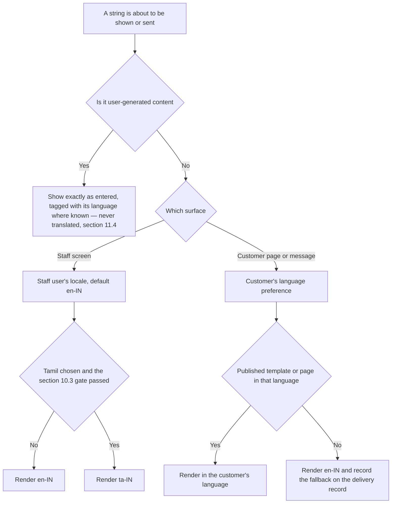
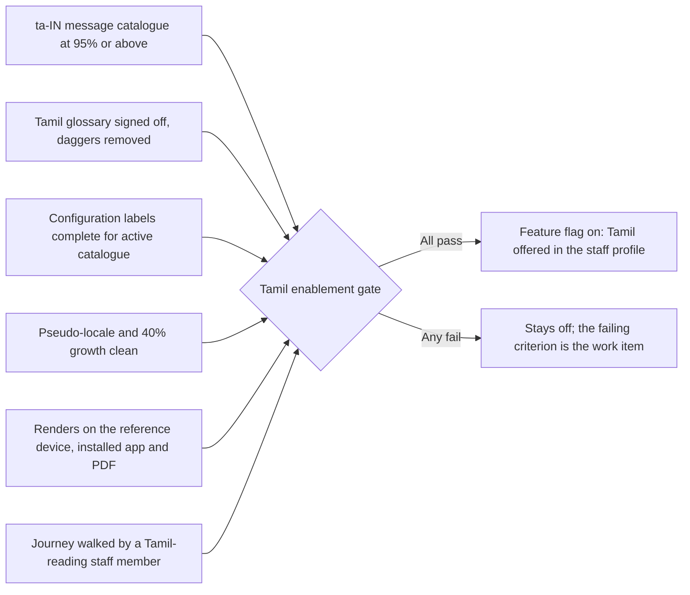

# HyFib Tailor 360 — Accessibility and localisation

This document states what HyFib Tailor 360 promises about being usable — by a Tailor with thread on their fingers
in a workshop at four in the afternoon, by a Cashier working one-handed at a busy counter, by a member of staff who
uses a screen reader, and by a customer who reads Tamil and receives a link on a phone. It fixes **WCAG 2.2 AA** as
the conformance target and names the success criteria that decide whether the shop floor can actually use the
software; it fixes the touch-target and sizing rules that the criteria alone do not go far enough to settle; and it
fixes the language rules — English at launch, Tamil when the message catalogue is at least 95% translated,
customer-facing pages in the customer's language — together with the formatting, glossary and translation rules
that make those promises real. Numbers introduced here rather than taken from the standard are **proposed, to be
confirmed** and are listed in section 13. Read it with
[`support-matrix.md`](support-matrix.md) (the devices and assistive-technology pairings these rules are tested on)
and [`../prd/glossary.md`](../prd/glossary.md) (the source of every term that must be translated).

---

## 1. Status and scope

| Field | Value |
| --- | --- |
| Status | **Draft — proposed**; binding when the stakeholder review of issue #19 is signed |
| Owner of the document | Technical reviewer, with the Owner as approver and a native Tamil speaker as co-signer for section 11 |
| Drafted | 2026-09-04 (issue #19, wave W0) |
| Depends on | **OD-07** device, browser and printer matrix; **OD-03** messaging providers for Tamil templates; the Tamil glossary review owed by [`../prd/glossary.md`](../prd/glossary.md), and open decisions `OD-CAT-07` and `OD-MEA-10` raised by [`../prd/category-hierarchy.md`](../prd/category-hierarchy.md) and [`../prd/measurement-templates.md`](../prd/measurement-templates.md) |
| Implemented by | #50 design system, layouts and internationalisation foundation; #51 installability and offline states; #52 WCAG, cross-browser and performance gates; #47 and #48 customer-facing messages and pages; #42 and #43 rendered documents |
| Review cadence | Every release train, and whenever a new journey or a new language is added |

**In scope**: the staff progressive web application on phone, tablet and desktop; the customer-facing link pages
for estimate, status and feedback; rendered documents — estimate, invoice, receipt, measurement sheet, job card;
notification message bodies; and printed labels.

**Out of scope**: the customers' own devices and messaging applications; the accessibility of the provider portals
used by the SMS, WhatsApp and payment vendors; and any language beyond English and Tamil, which would be a new
decision, not an extension of this one.

---

## 2. The conformance commitment

| Commitment | Detail |
| --- | --- |
| Standard | **WCAG 2.2, Level AA**, for every screen and every rendered customer-facing document |
| Scope of the claim | All staff screens, all customer-facing pages, and the HTML of notification bodies. Rendered PDFs are covered by section 12.4 rather than by a full PDF/UA claim |
| Release gate | **RG-06** in [`../process/release-gates.md`](../process/release-gates.md): axe-core across every screen and state at the phone, tablet and desktop profiles and at 200% zoom and 320 px, the overflow and obscured-focus helper, keyboard-only completion of every priority-zero journey, and the screen-reader items of [`a11y-checklist.md`](a11y-checklist.md) for any journey changed since the previous release. A critical violation, or any barrier that stops a member of staff finishing a priority-zero journey, is severity S1 |
| Selected AAA criteria adopted | 2.3.3 Animation from Interactions (reduced motion), 2.4.13 Focus Appearance, 3.3.9 Accessible Authentication (Enhanced) through passkeys, and 1.4.6 Contrast (Enhanced) for primary shop-floor text where practical — section 4.3 |
| Known limitation stated honestly | Conformance is verified on the pairings of [`support-matrix.md`](support-matrix.md) section 8. A configuration outside the matrix is unsupported rather than silently degraded |
| What is not claimed | That the software has been audited by an external accessibility specialist. Whether such an audit is commissioned before launch is open decision **AL-01** |

Note for reviewers migrating checklists from WCAG 2.1: success criterion 4.1.1 Parsing was **removed** in WCAG 2.2,
and six criteria were added — 2.4.11, 2.5.7, 2.5.8, 3.2.6, 3.3.7 and 3.3.8 at A or AA. All six matter here, and
three of them (target size, dragging, focus not obscured) are the ones a shop floor notices first.

---

## 3. The shop floor is the design constraint

Accessibility on this product is not mainly about a screen reader; it is about hands, light, noise and hurry. Each
row below produces a concrete rule later in this document.

| Condition | What it does to the interface | Rule it produces |
| --- | --- | --- |
| Fingers with thread, chalk, oil or a needle; occasionally a glove or a finger guard | Taps land 2–3 mm from where they were aimed | Large targets and generous spacing — section 5 |
| A garment in one hand | The device is used one-handed, often with a thumb | Primary actions within thumb reach at the bottom of phone layouts, and never obscured by them — sections 5 and 7 |
| Afternoon sunlight at the counter and near a window | Low-contrast greys disappear entirely | Contrast floors, a high-contrast theme, status never by colour alone — section 4.1 |
| A workshop with machines running | Audio-only feedback is not heard | Scan and save feedback is visual **and** haptic, with sound as an addition, never the only channel — section 6 |
| A hardware scanner that types into whatever has focus | Keystrokes arrive in the wrong field; focus is stolen mid-typing | The wedge source buffers and is ignored while a user is typing in an unrelated field, and never traps the keyboard — section 7 |
| Everybody is in a hurry, especially before a festival | Errors are made and must be recoverable | Errors identified in words, suggestions offered, destructive actions confirmed in tiers, non-sensitive actions undoable — section 8 |
| Shared counter and workshop devices | Sessions end while a form is half-filled | Timeout warning, in-place re-authentication, and typed input never discarded — section 8.3 |
| Reading glasses left at home; presbyopia is universal after forty | Text is enlarged, or the browser zoom is at 200% | Reflow at 320 CSS px, 200% zoom, and text spacing overrides without loss — section 4.2 |

---

## 4. The success criteria that matter most here

Everything in WCAG 2.2 AA applies. This section names the criteria that fail first in a tailoring shop, states what
each one means on this product, and says how it is verified. "Automated" means axe-core plus the Playwright helpers
of plan Section 4.6; "manual" means an item in [`a11y-checklist.md`](a11y-checklist.md).

### 4.1 Contrast and colour

| Criterion | Level | What it means here | Verified by |
| --- | --- | --- | --- |
| 1.4.3 Contrast (Minimum) | AA | Body text at least **4.5:1**, large text (18.66 px bold or 24 px) at least **3:1**, against the token background it actually sits on — including status badges, table rows and disabled-looking text that is in fact readable content | Automated on every screen; token-pair contrast test in the design system |
| 1.4.11 Non-text Contrast | AA | At least **3:1** for input borders, focus rings, icon glyphs that carry meaning, the scanner viewfinder frame, chart series boundaries and the barcode preview outline | Automated plus design-system review |
| 1.4.1 Use of Colour | A | **No status is conveyed by colour alone.** Every status badge carries an icon and a word — overdue, held, ready, unpaid, rework — which the plan already fixes for the design system | Manual, plus a Storybook story per status |
| 1.4.6 Contrast (Enhanced) — adopted, AAA | AAA | Primary shop-floor text — job number, due date, phase name, scan result, amount due — targets **7:1** where the palette allows, because these are read in sunlight at arm's length | Design-system review; **proposed, to be confirmed** (AL-02) |
| High-contrast theme | — | A high-contrast token set for sunlight, selectable per user and honoured by `prefers-contrast` where the browser reports it (plan Section 4.6) | Storybook theme story and a Playwright pass in the high-contrast theme |

### 4.2 Reflow, zoom and text growth

| Criterion | Level | What it means here | Verified by |
| --- | --- | --- | --- |
| 1.4.10 Reflow | AA | No horizontal scrolling of the page at **320 CSS px**; wide tables scroll inside their own container, never the body | The overflow helper at 320, 360, 768, 1024 and 1280 px |
| 1.4.4 Resize Text | AA | Everything usable at **200% zoom**, including bottom navigation, dialogs and the scanner overlay | The same helper, at 200% zoom |
| 1.4.12 Text Spacing | AA | Line height 1.5, paragraph spacing 2×, letter spacing 0.12em and word spacing 0.16em applied by a user stylesheet without clipping or overlap | Automated text-spacing injection test |
| 1.3.4 Orientation | AA | Both orientations work; nothing is locked to portrait — the tablet workboard is used in landscape and the scanner in portrait ([`support-matrix.md`](support-matrix.md) section 5) | Playwright projects in both orientations |
| 1.4.5 Images of Text | AA | No text baked into images — including category illustrations, which carry labels as text beside the drawing, which is also what makes them translatable | Design-system review |
| Layout tolerance | — | Layouts tolerate **40% text growth** (plan Section 4.6), which is what makes the Tamil catalogue safe to switch on | Pseudo-locale story for every component and screen |

### 4.3 Target size, pointers and motion

| Criterion | Level | What it means here | Verified by |
| --- | --- | --- | --- |
| 2.5.8 Target Size (Minimum) | AA | The standard's floor is **24 × 24 CSS px**. This product sets a higher product rule in section 5 because 24 px is not usable with a needle in the hand | Automated target-size check plus the design-system token |
| 2.5.7 Dragging Movements | AA | **Every drag has a button alternative** — reordering a workboard column, adjusting a crop, signing at the doorstep (a typed recipient name plus one-time password is always available instead of a signature stroke) | Manual per journey; the plan already requires the button alternative |
| 2.5.1 Pointer Gestures | A | No multi-point or path-based gesture is required; pinch-zoom on an image always has button controls | Manual |
| 2.5.2 Pointer Cancellation | A | Actions fire on pointer-up and can be aborted by moving away — a mis-touch while holding a garment must not confirm a dispatch | Manual |
| 2.5.3 Label in Name | A | The visible label is contained in the accessible name, so voice control ("tap Confirm order") works | Automated |
| 2.3.3 Animation from Interactions — adopted, AAA | AAA | `prefers-reduced-motion: reduce` removes transitions, parallax and the scanner's animated sweep, leaving instant state changes; motion is never the only signal that something happened | Automated media-query test plus a reduced-motion Playwright pass |
| 2.2.2 Pause, Stop, Hide | A | Nothing auto-advances, auto-rotates or auto-refreshes under the user's hands; a queue that updates does so with a "new items" control, not by re-ordering while being read | Manual |

### 4.4 Keyboard and focus

| Criterion | Level | What it means here | Verified by |
| --- | --- | --- | --- |
| 2.1.1 Keyboard | A | Every action is reachable from the keyboard — the counter and print-station desktops are keyboard-driven, and a wedge scanner is a keyboard | Manual per journey |
| 2.1.2 No Keyboard Trap | A | **Nothing traps the keyboard**: not dialogs, not bottom sheets, not the camera scanner overlay, and not the wedge-scanner buffer, which listens without capturing focus and releases on its terminator character or timeout | Automated trap test in the dialog and scanner components; manual per journey |
| 2.4.3 Focus Order | A | Focus follows the visual order, and moving into and out of a dialog or bottom sheet returns focus to the control that opened it | Manual |
| 2.4.7 Focus Visible | AA | A visible focus indicator on every focusable element in every theme, including the high-contrast one | Automated |
| 2.4.11 Focus Not Obscured (Minimum) | AA | **The focused control is never hidden behind the bottom navigation bar, a sticky action bar, a toast or the virtual keyboard** — the single most common failure on a phone form, and the reason the plan requires an obscured-focus helper | The obscured-focus helper at every breakpoint |
| 2.4.13 Focus Appearance — adopted, AAA | AAA | The indicator is at least 2 px thick and contrasts at least 3:1 with both the focused component and its background | Design-system review |

### 4.5 Errors, forms and authentication

| Criterion | Level | What it means here | Verified by |
| --- | --- | --- | --- |
| 3.3.1 Error Identification | A | Errors are identified **in text**, programmatically associated with their field, and summarised at the top of the step by the shared step-aware `FormErrorSummary`; server problem details are rendered in plain language, never as a code or a stack | Automated association test plus manual |
| 3.3.2 Labels or Instructions | A | Every field has a persistent visible label — never a placeholder as the only label — plus units and range hints for measurement fields | Automated |
| 3.3.3 Error Suggestion | AA | Where the fix is knowable it is offered: an out-of-range measurement says the expected range in the unit on screen; a phone number says the expected form; a duplicate customer offers the existing record | Manual per journey |
| 3.3.4 Error Prevention (Legal, Financial, Data) | AA | Posting an invoice, recording a payment, approving a dispatch exception, posting a stocktake and cancelling an order are **reviewable, confirmable and reversible by a compensating action** — never by a silent edit; the three-tier `ConfirmDialog` supplies the confirmation and the typed confirmation is reserved for desktop and tablet administration, never a phone | Manual, plus the confirm-tier component tests |
| 3.3.7 Redundant Entry | A | Information already given in a journey is not asked for again — the order draft is server-side and resumable, and re-authentication after a timeout **retries the pending request with the same `Idempotency-Key`** rather than discarding what was typed | Manual per journey |
| 3.3.8 Accessible Authentication (Minimum) | AA | **No cognitive puzzle is required to log in.** No CAPTCHA, no "type the third character of your memorable word"; brute force is handled by the rate-limit policy catalogue instead. The one-time-code field accepts paste and carries `autocomplete="one-time-code"` | Manual, plus an authentication journey test |
| 3.3.9 Accessible Authentication (Enhanced) — adopted, AAA | AAA | Passkeys are offered as the primary factor wherever the device supports them, which removes the memory task entirely | Manual |
| 3.2.6 Consistent Help | A | Help, the support contact and the "how do I…" link sit in the same place on every screen (plan Section 4.6) | Manual |
| 4.1.3 Status Messages | AA | Scan results, save confirmations, queue updates and sync state are announced through a polite live region — **and are never delivered by a toast**, which the plan forbids for scan results, sync state and actionable errors | Automated live-region test; manual with TalkBack and VoiceOver |
| 1.1.1 Non-text Content | A | Every design illustration and measurement diagram carries alternative text, and every measurement diagram additionally carries a **text description of where the measurement is taken**, because the diagram is instruction, not decoration | Manual; alternative text is a required field on a design option and an illustration |

---

## 5. Touch targets and glove-friendly sizing

WCAG's 24 × 24 CSS px floor is a legal minimum, not a usable size for a person holding a garment. This product sets
its own rule, and the design-system token is what enforces it.

| Control class | Minimum size | Minimum spacing | Examples | Status |
| --- | --- | --- | --- | --- |
| **Primary shop-floor action** | **56 × 56 CSS px** | 12 px | Scan, Capture photo, Confirm order, Take payment, Dispatch, Complete phase | **Proposed, to be confirmed** (AL-03) |
| **Standard interactive control** | **44 × 44 CSS px** | 8 px | Buttons, list rows, tabs, checkboxes and radios including their labels, table row actions | **Proposed, to be confirmed** (AL-03) |
| **Dense desktop control** | **32 × 32 CSS px** | 8 px | Toolbar icons and table controls on desktop only, where a mouse is used and no garment is being held | **Proposed, to be confirmed** (AL-03) |
| **Inline text link** | Exempt by 2.5.8, but the line height gives at least 24 px | — | Links inside a paragraph | Standard |
| **Absolute floor, anywhere** | **24 × 24 CSS px** | Undersized targets need 24 px clear spacing | Nothing on a phone or tablet layout should reach this floor | WCAG 2.2 AA |

Rules that go with the sizes:

1. **The target is the hit area, not the ink.** A 24 px icon inside a 44 px padded button is compliant; a 44 px
   icon with no padding beside another one is not.
2. **Destructive and irreversible actions are not placed next to frequent ones.** Dispatch does not sit beside
   Cancel order; Delete evidence does not sit beside Add evidence. Where they must share a screen they are
   separated by at least 24 px and differ in weight and colour, and the destructive one carries a confirmation.
3. **Nothing is placed in the bottom 8 px of a phone viewport**, where the system gesture bar takes the touch.
4. **Numeric measurement entry uses steppers and a fraction control**, not a slider: `FractionInput` for inch
   fractions and `NumericStepper` for whole units (plan Section 4.6), each with `inputmode="decimal"` and a target
   that meets the standard control size.
5. **Glove testing is an acceptance activity, not a hope.** One walkthrough of the scan, capture and phase-complete
   journeys is performed wearing a finger guard or a thin glove on the reference device, recorded with the release
   evidence — **proposed, to be confirmed** (AL-04).

---

## 6. Feedback in a noisy room

A scan either worked or it did not, and the person scanning is looking at a garment, not at the screen. Feedback is
therefore multi-channel by rule.

| Event | Visual | Haptic | Audible | Announced |
| --- | --- | --- | --- | --- |
| Scan accepted | Full-width success state with the job number and the next expected action; persistent until dismissed or superseded | Short vibration where the device supports it | Optional short tone, off by default | Polite live region |
| Scan rejected — wrong namespace, bad check character, unknown identity, wrong branch, wrong custodian | Full-width error state naming **which** rule failed and what to do | Distinct double vibration | Optional distinct tone | Assertive live region |
| Saved while offline and queued | Persistent queued state with the count, never a toast | — | — | Polite live region |
| Action blocked because it needs a connection | `OfflineBlockedAction` — "Needs connection — this will not be queued" — with the input preserved | — | — | Polite live region |

Three rules: **sound is never the only channel** (the workshop is loud and phones are muted); **motion is never the
only channel** (reduced motion must lose nothing); and **a toast is never used for a scan result, sync state or an
actionable error** (plan Section 4.6) — it disappears before a person holding a garment can read it, and a screen
reader user may never hear it at all.

---

## 7. Keyboard, scanner and focus interaction

The hardware scanner is a keyboard, which makes accessibility and scanning the same problem.

| Rule | Why |
| --- | --- |
| The wedge source listens globally, buffers keystrokes, detects the terminator character and a timing threshold, and **is ignored while the user is typing in an unrelated field** (plan Section 4.4) | Otherwise a scan lands in the customer's name field, and a keyboard user is interrupted mid-word |
| The scanner overlay is a dialog: focus is trapped **within** it while open in the ordinary dialog sense, released on Escape, and returned to the opening control | 2.1.2 requires that Escape always works; a camera overlay that cannot be dismissed from the keyboard is a trap |
| Manual entry is always reachable from the keyboard and always available as the third rung of the scanning ladder, with a mandatory reason | 2.1.1, and the fallback ladder of [`support-matrix.md`](support-matrix.md) section 7.1 |
| Skip-to-content, a single visible focus style and a documented focus order per shell — phone, tablet, desktop | 2.4.3, 2.4.7 |
| Bottom navigation and sticky action bars use `scroll-padding` so the focused field is never behind them | 2.4.11 |
| No positive `tabindex` anywhere; no `outline: none` without a replacement indicator | Enforced by lint rule and design-system review |

---

## 8. Forms, errors and interruptions

### 8.1 One form contract

Every field in the design system implements one `FieldProps` contract carrying label, description, error,
`aria-describedby` wiring, required state, `autocomplete` and `inputmode` (plan Section 4.6). A screen cannot
accidentally ship a field without a label, because the component has nowhere to put the text.

### 8.2 Errors

Field errors are text, associated programmatically, repeated in a step-aware summary that moves focus to itself,
and phrased as instructions rather than as codes: "Waist must be between 45.0 cm and 150.0 cm" rather than
"validation failed". Server problem details (RFC 9457) are mapped to the same presentation, carry the correlation
identifier for support, and never expose a stack trace.

### 8.3 Interruptions and timeouts

| Situation | Behaviour |
| --- | --- |
| Session inactivity approaching the timeout | A **two-minute warning dialog** (2.2.1) that can be dismissed to continue, announced to assistive technology |
| Session expired mid-command | In-place re-authentication, then the pending request is retried with the **same `Idempotency-Key`**; typed input is never discarded |
| Connection lost | A persistent, non-dismissible network banner — never a toast — and blocked actions state plainly that they will not be queued |
| Client too old for the server | The 426 response drives an update prompt with a plain-language explanation, not a silent failure |

### 8.4 Undo and confirmation

Non-sensitive field actions offer a three-second undo. Sensitive actions use the three-tier `ConfirmDialog`:
confirm; confirm with a reason; typed confirmation, which is **reserved for desktop and tablet administration** and
never asked of somebody on a phone in a workshop.

---

## 9. Roles, journeys and the risk each carries

| Role | Journey | The accessibility risk that fails first | The rule that answers it |
| --- | --- | --- | --- |
| Reception | Intake, measurement capture, estimate, order confirmation | Long forms on a phone with the focused field behind the keyboard | 2.4.11 and the obscured-focus helper; server-side resumable drafts |
| Tailor Master | Workboard, assignment, start production | Dense tables and drag-to-assign | Button alternative to every drag (2.5.7); table containers scroll, not the page |
| Tailor | Scan in, work a phase, scan out | Sunlight, thread on fingers, machine noise | Contrast floors, 56 px primary targets, multi-channel feedback |
| Inventory Clerk | Receive stock, issue material, stocktake | Repetitive numeric entry and variance approval | `NumericStepper`, redundant entry avoided, error prevention on posting |
| Cashier | Take payment, issue receipt, close session | Irreversible financial action taken in a hurry | 3.3.4 with confirm-and-reason, no typed confirmation on a phone |
| Delivery Staff | Delivery queue, dispatch scan, doorstep confirmation | Signature capture outdoors, one-handed, sometimes in rain | Typed recipient name plus one-time password is always an alternative to the signature stroke (2.5.7) |
| Branch Manager, Owner | Exceptions, reports, approvals | Charts and colour-coded status | Status by icon and word; charts carry a table alternative |
| Any role using a screen reader | Any | Status changes announced by toast, and unlabelled icon buttons | 4.1.3 live regions; no toasts for scan, sync or errors; accessible names asserted by axe |

---

## 10. Localisation: the language rules

### 10.1 The rules at launch

| Surface | Language at launch | Rule |
| --- | --- | --- |
| Staff application | **English (`en-IN`)** | Every string comes from the `en-IN` message catalogue; a `ta-IN` catalogue exists from wave 1 as a skeleton and is filled in progressively (plan Section 4.6) |
| Staff application, Tamil | **Enabled when the message catalogue is at least 95% translated** and the gate of section 10.3 passes | The plan's rule, restated. Until then the Tamil option is behind a feature flag, off by default, and is not offered to staff |
| Customer-facing pages — estimate, status, feedback | **The customer's language preference** | Held in the customer's communication preferences; `<html lang>` is set accordingly; the page is server-rendered outside the application shell and its own strict policy applies |
| Notification messages | **The customer's language preference**, if a published template version exists in that language | Otherwise `en-IN`, and the fallback is recorded on the delivery record so the gap is visible rather than invisible |
| Rendered documents — estimate, invoice, receipt | Follows the customer's language for customer-facing labels; statutory content follows the accountant's requirement | The document embeds a Tamil-capable font either way (plan D15) |
| Job cards, workboards and labels | **Language-neutral or the staff user's language.** A label carries codes, numbers and cues, never prose | Labels stay printable on any thermal printer, including ones with no Tamil font (section 12.3) |

The staff user's locale is stored on the user record and is editable on the profile and administration screens; the
document language attribute follows it, and so do all formats. A member of staff choosing Tamil never changes what
a customer receives, and a customer's preference never changes a staff screen.

### 10.2 Why the catalogue is not switched on early

A half-translated interface is worse than an English one: a Tailor sees Tamil headings above English buttons and
stops trusting either. The threshold is therefore a gate, not a preference, and the missing 5% is defined as
strings that never reach the shop floor — administration screens, developer diagnostics and rarely-seen error
states — rather than "whatever is left".

### 10.3 The Tamil enablement gate

Every criterion must pass before the Tamil interface is offered to staff. The 95% threshold is the plan's; the
other criteria are **proposed, to be confirmed** (AL-05).

| # | Criterion | Measured how |
| --- | --- | --- |
| 1 | **At least 95% of `en-IN` message identifiers have a `ta-IN` translation** | A build report counting identifiers, published with the release evidence |
| 2 | **100% of the strings on the shop-floor journeys** — intake, measurement capture, scan, phase, QC, delivery queue, take payment | The same report, filtered by journey namespace |
| 3 | **The Tamil glossary of section 11 is signed off** by a native speaker and every `†` mark is removed | The glossary review record |
| 4 | **Configuration labels are complete** for every active category, service type, workflow phase, measurement field, design option group, QC criterion and defect code | A catalogue completeness check before publication |
| 5 | **No layout breaks in the pseudo-locale and at 40% text growth** | Pseudo-locale Storybook stories and the overflow helper |
| 6 | **Tamil renders correctly on the reference device, in the installed application and in a rendered PDF** | Device evidence and a stored print artefact |
| 7 | **A Tamil-reading member of staff has walked one full journey** and reported no misleading wording | A recorded walkthrough with the release evidence |
| 8 | **Screen-reader pronunciation checked with TalkBack in Tamil** on one journey, or the limitation is recorded honestly | Manual check on the reference device |

### 10.4 What is translated where

Translation lives in two different places, and confusing them is the commonest localisation defect.

| Kind of string | Lives in | Translated by | Example |
| --- | --- | --- | --- |
| Interface text | The `en-IN` and `ta-IN` message catalogues, by identifier, with ICU MessageFormat | The translation workflow, reviewed by a native speaker | "Confirm order", "Needs connection" |
| **Configuration labels** | The catalogue data itself — categories, service types, phases, measurement fields, design options, QC criteria, defect codes, payment modes, alert policies — each carrying a label per language | Administrators, from the glossary; presentation-only fields may be corrected in place on a published version with a reason ([`../prd/category-hierarchy.md`](../prd/category-hierarchy.md)) | "Aari work", "Cutting", "Shoulder" |
| Message templates | Notification template versions, published per channel **and per language** | The template author, reviewed | The ready-for-delivery message |
| **User-generated content** | The operational tables | **Nobody — see section 11.4** | A customer's name, a defect note, feedback |

This split is why the design already stores defect **codes** and design **option** identifiers rather than free
text: the part a Tamil-speaking Tailor needs to read is configuration and therefore translatable, while the part a
person types stays exactly as typed.

---

## 11. The Tamil glossary, and the rule about translating content

### 11.1 The glossary is a prerequisite, not a by-product

Tamil cannot be switched on from a translation file alone, because the words that matter most are shop-floor words
that a general translator will get wrong. [`../prd/glossary.md`](../prd/glossary.md) already carries a Tamil column
in which **every entry is marked `†`, meaning drafted by the authors and not yet reviewed by a native speaker**,
and it states that no `†` string may be copied into a customer-facing message. Removing those marks is the work
this document owns.

### 11.2 What must be signed off

| Group | Source of the entries | Why it is non-negotiable |
| --- | --- | --- |
| **Workflow phase names** | The seed phases of [`../prd/glossary.md`](../prd/glossary.md) section 5 — Intake, Cutting, Specialist work, Stitching, Finishing, QC, Ready for delivery — plus any phase an administrator adds | A Tailor reads the phase name to know what to do next; a wrong word sends a garment to the wrong bench |
| **Measurement field labels** | Every field key in [`../prd/measurement-templates.md`](../prd/measurement-templates.md) — for the Blouse template alone `shoulder`, `upper_chest`, `chest_bust`, `waist`, `hip`, `armhole`, `sleeve_length`, `sleeve_round`, `sleeve_upper_round`, `front_neck_depth`, `back_neck_depth`, `cross_front`, `cross_back`, `dart_point`, `apex_to_apex`, `blouse_full_length` — and the equivalents for Salwar, Lehenga, Gown and Kids | A mistranslated measurement label produces a garment that does not fit. This is the highest-consequence translation in the product, and it is why `OD-MEA-10` exists |
| **Category and service-type labels** | [`../prd/category-hierarchy.md`](../prd/category-hierarchy.md), whose Tamil label column is explicitly a draft pending this review (`OD-CAT-07`) | Categories are what a customer is asked to choose between |
| **Role names** | Reception, Tailor Master, Tailor, Inventory Clerk, Cashier, Delivery Staff, Branch Manager, Owner | Used in assignment, handover and training |
| **Custody and status words** | Scan, custody transfer, dispatch, hold, rework, alteration, ready state, overdue, QC pass and fail | Read under time pressure at a handover |
| **Money words** | Advance, balance, receipt, invoice, refund, round-off, GST components | Read at the counter with a customer watching |
| **Design option and QC criterion labels** | The published catalogue version's option and criterion labels, and defect codes | Shown to both staff and customers in the design picker |

### 11.3 How it is signed off, and where the wording goes

1. The drafts already in the glossary are the agenda; the review is a working session with **Reception staff and
   the Tailor Master**, not a desk exercise, because the words wanted are the ones already spoken in the shop.
2. A **native Tamil speaker** confirms spelling and script; only then is the `†` removed, entry by entry.
3. The reviewed wording flows to exactly two destinations: the **`ta-IN` message catalogue** for interface text,
   and the **configuration labels** of the catalogue, measurement templates, workflow definitions and QC
   checklists for everything an administrator owns (section 10.4).
4. A term that has no genuine Tamil shop-floor equivalent keeps the English word — `order`, `delivery`, `stock`
   and `bill` are used in Tamil speech as they are, and inventing a translation for them makes the interface less
   usable, not more.
5. The glossary is amended by pull request in the same change that alters a term, and the measurement sheet
   question — English labels with Tamil beneath, Tamil alone, or English alone (`OD-MEA-10`) — is answered in the
   same review.

### 11.4 User-generated content is never machine-translated

**Rule.** Content typed or captured by a person — customer or member of staff — is stored and displayed exactly as
entered. It is never machine-translated, never machine-transliterated, and never auto-corrected for display.

| What counts as user-generated content here | Why the rule matters |
| --- | --- |
| Customer name, native-script name, aliases, address | A machine transliteration of a person's name is a different person's name. The data model already carries a normalised Latin name **and** an optional native-script name precisely so that a human, not an algorithm, decides |
| Feedback free text and service-recovery notes | Translating a complaint changes it; acting on a mistranslated complaint makes it worse |
| Reason strings — corrections, manual scan entry, holds, variance explanations, dispatch exceptions, cancellations | These are audit evidence. Evidence is quoted, never paraphrased by software |
| QC defect notes, alteration descriptions, measurement notes, growth-allowance notes | The consequence of a mistranslation is a ruined garment |
| Supplier names and terms, purchase notes | Commercial record |

**What is done instead.** The interface around the content is translated; the content is not. Where a reader may
need help, the product offers structure rather than translation: defect **codes**, design **options** and phase
**names** are configuration with a label per language, so the meaningful part of a note is usually a code that is
already translated. Where a genuine translation is needed — a complaint that must be understood by an
English-reading Owner — a **person** translates it and the translation is stored as a new, attributed note beside
the original, never replacing it.

**Two corollaries.** Machine translation may be used to **draft** an interface string or a message template, but a
native speaker reviews and signs off every string before it ships — a machine-drafted catalogue is not a
translated catalogue. And user-generated content is tagged with its language where it is known (`lang` on the
element), so a screen reader pronounces a Tamil name with Tamil phonetics instead of reading it as English.

---

## 12. Formats: `en-IN` and `ta-IN`

All formatting goes through one shared `formatters` module (plan Section 4.6) built on ICU and the platform `Intl`
implementation, and through the equivalent server-side culture for rendered documents. No component formats a
number, a date or an amount by hand, and no message string concatenates a formatted value — values are ICU
arguments inside the message, so word order can differ between languages.

### 12.1 Numbers, currency and quantities

| Item | `en-IN` | `ta-IN` | Note |
| --- | --- | --- | --- |
| Digits | Latin (`0-9`) | **Latin (`0-9`)** | Tamil digits are not used in daily commerce; the `latn` numbering system is requested explicitly rather than left to defaults — **proposed, to be confirmed** in the glossary review (AL-06) |
| Grouping | Indian grouping — `12,34,567.89` | Indian grouping — identical | Lakh and crore grouping, never the 3-digit western grouping |
| Currency | `₹12,34,567.89` | `₹12,34,567.89` | Symbol `₹`, ISO code `INR`; the symbol is used on screens and documents, the code in exports and integration payloads |
| Negative amounts | `-₹1,200.00`, and refunds and reversals are additionally labelled in words | Same | Never a bare parenthesis convention, which staff read as a footnote |
| Decimal places | Amounts 2, unit rates 4, tax rates 3 (plan D10) | Same | Money is `decimal`, never floating point |
| Percentages | `2.5%` | `2.5%` | GST component rates |
| Quantities and units | Stock in the item's base unit with its symbol; measurements in the display unit — inches with fractions such as `36 1/2 in`, or centimetres to one decimal | Same numerals; the **unit words** come from the glossary | Canonical storage is always millimetres (plan D9, `measurement-templates.md`) |
| Amount in words | On documents where the accountant requires it | Language of the words is part of `OD-05` with the accountant | Not generated by a machine translation of the English words |

### 12.2 Dates, times and calendars

| Item | `en-IN` | `ta-IN` | Note |
| --- | --- | --- | --- |
| Short date | `dd-MM-yyyy` | `dd-MM-yyyy` | Identical numeric form in both locales, so a date on a screen is never ambiguous between staff |
| Long date | `04 September 2026` | The same date with Tamil month and weekday names from the locale data | Used on documents and in messages, not on dense screens |
| Time | 12-hour with a day-period marker, `04:30 PM` | 12-hour with the Tamil day-period markers supplied by the locale data | Never a bare 24-hour clock on shop-floor screens |
| Time zone | The **branch** IANA timezone, `Asia/Kolkata` by default | Same | Storage is `timestamptz` in UTC; display, due dates, SLA clocks and report cut-offs are branch-local (plan D11) |
| Relative time | "in 2 days", "3 hours ago" via ICU, always with the absolute value available | Same | A due cue is never relative alone |
| Financial year | April to March, shown as `2026-27` | Same | Part of every document sequence |
| Working calendar | Branch holidays skip SLA and due-date clocks where configured | Same | Festival closures are configuration, not code |

### 12.3 Units, labels and printed artefacts

Barcode labels are deliberately **language-neutral**: an opaque payload, a job number, a category cue, a due cue
and a branch code. This is a privacy rule first (a label carries no personal data at all) and a localisation
benefit second — a thermal printer with no Tamil font can still print every label in the shop. Where a label
carries a word, the word comes from the configuration label of the current catalogue version and the label
template's font must contain it; if it does not, the template falls back to the code, and the print job records
that it did.

### 12.4 Rendered documents

Estimates, invoices, receipts, measurement sheets and job cards are rendered server-side through `IPdfRenderer`
with a **Tamil-capable font embedded** (plan D15). Requirements for every rendered document: text is real text and
never an image of text; the document declares its language; the reading order matches the visual order; tables
carry header cells; and a stored print-to-PDF artefact per document type is part of the release evidence
([`support-matrix.md`](support-matrix.md) section 9). A full PDF/UA conformance claim is **not** made — whether it
is required is open decision **AL-07**.

### 12.5 Messaging channels

| Channel | Constraint the language choice creates |
| --- | --- |
| SMS | A message containing Tamil script is sent as UCS-2, which reduces the segment length from 160 characters to **70**, so a Tamil message costs more and truncates sooner. Templates are authored and length-tested per language, and the cost implication is part of the provider decision **OD-03** |
| WhatsApp | Message templates are submitted and approved **per language** with the provider; a Tamil template is a separate approval and a separate lead time (**OD-03**) |
| E-mail | No constraint beyond UTF-8 and a font-safe body |
| Customer link pages | Server-rendered in the customer's language outside the application shell, with the Tamil font subset available to that page independently of the main bundle |
| In-app notifications | The staff user's locale |

Fonts are shipped as **subsets alongside the Latin subsets** (plan Section 4.6) so that enabling Tamil does not
inflate the bundle for everybody; the performance budgets of
[`capacity-and-performance.md`](capacity-and-performance.md) apply to the Tamil interface exactly as they do to the
English one, and the enablement gate re-measures them on the reference device.

---

## 13. Open decisions recorded by this document

Raised 2026-09-04 by issue #19 and mirrored into
[`../prd/assumptions-and-open-decisions.md`](../prd/assumptions-and-open-decisions.md) in the pull request that
closes the issue. Identifiers `AL-01` upwards are local to this document and are referenced from
[`traceability.md`](traceability.md).

| ID | Open decision | Proposed position, to be confirmed | Owner | Needed by |
| --- | --- | --- | --- | --- |
| **AL-01** | Whether an external accessibility audit is commissioned before go-live, in addition to the automated and manual gates | Not commissioned at launch; the gates plus the manual screen-reader walkthroughs stand, and the decision is revisited if a member of staff needs assistive technology daily | Business owner | Before #52 |
| **AL-02** | The enhanced 7:1 contrast target for primary shop-floor text | Adopted where the palette allows, with 4.5:1 as the hard floor everywhere | Technical reviewer with the Owner | Before #50 tokens are frozen |
| **AL-03** | The touch-target minimums of section 5 — 56 px primary, 44 px standard, 32 px dense desktop | As stated; they exceed the WCAG floor deliberately | Technical reviewer, validated by staff trial | Before #50 |
| **AL-04** | Whether a glove or finger-guard walkthrough is a release activity | One walkthrough of the scan, capture and phase journeys per release on the reference device | Business owner with the Tailor Master | Before W2 device evidence |
| **AL-05** | The Tamil enablement gate criteria beyond the plan's 95% threshold (section 10.3) | The eight criteria as listed | Business owner with the technical reviewer | Before the `ta-IN` catalogue approaches 95% |
| **AL-06** | Whether Tamil digits are ever used, or Latin digits everywhere | Latin digits everywhere, including in the Tamil interface | Business owner, in the glossary review | With the glossary sign-off |
| **AL-07** | Whether rendered documents need a PDF/UA conformance claim | No formal claim; the requirements of section 12.4 are met and evidenced | Business owner, with legal advice if a claim is ever required | Before #42 documents are finalised |
| **AL-08** | `OD-MEA-10` — whether the measurement sheet prints English labels with Tamil beneath, Tamil alone, or English alone | English labels with Tamil beneath, as proposed by [`../prd/measurement-templates.md`](../prd/measurement-templates.md) | Business owner with Reception staff | With the glossary sign-off |
| **AL-09** | `OD-CAT-07` — the correct Tamil labels for every category and service type | The drafts in [`../prd/category-hierarchy.md`](../prd/category-hierarchy.md), corrected in the glossary review | Business owner with Reception staff | Before the `ta-IN` catalogue reaches 95% |
| **AL-10** | Who owns the translation workflow — an internal bilingual member of staff, or a paid translator with a native-speaker reviewer | An internal bilingual member of staff drafts, a native speaker reviews; a paid translator is priced if the internal route stalls | Business owner | Before the `ta-IN` catalogue work starts in earnest |
| **AL-11** | Whether a third language is ever in scope | Out of scope; English and Tamil only. A third language would be a new decision with its own glossary and gate | Business owner | Not blocking |

---

## 14. How these commitments are enforced

| Commitment | Enforced by | Fails what |
| --- | --- | --- |
| WCAG 2.2 AA on every touched screen | axe-core in the pull-request pipeline and in Storybook; the manual items of [`a11y-checklist.md`](a11y-checklist.md) for a new journey | The pull request |
| No horizontal overflow, no obscured focus | The Playwright helper at 320, 360, 768, 1024 and 1280 px and 200% zoom | The pull request |
| Target sizes and focus appearance | Design-system tokens plus the automated target-size check | The pull request |
| Keyboard operability and no traps | Dialog and scanner component tests; keyboard walkthrough per journey | The pull request |
| Screen-reader behaviour | Manual walkthrough with TalkBack, VoiceOver and NVDA per the pairings of [`support-matrix.md`](support-matrix.md) section 8 | The release |
| Reduced motion and high contrast | Media-query tests and a Playwright pass in each preference | The pull request |
| Every string is a message identifier | Lint rule forbidding literal user-facing text in components; the pseudo-locale story reveals anything hard-coded | The pull request |
| 40% text growth tolerated | Pseudo-locale Storybook story for every component and screen | The pull request |
| Formats go through `formatters` | Lint rule and code review; a unit test per format against `en-IN` and `ta-IN` | The pull request |
| User-generated content is never machine-translated | Code review and the absence of any translation adapter in the codebase; an architecture test asserts no module references a translation service | The pull request |
| Tamil enablement gate | The eight criteria of section 10.3, evidenced before the feature flag is turned on | The flag stays off |
| Documents render Tamil | Stored print-to-PDF artefact per document type, per release | The release |

The complete requirement-to-evidence mapping is [`traceability.md`](traceability.md); the release gates and their
waiver owners are [`../process/release-gates.md`](../process/release-gates.md).

---

## 15. Related documents

| Document | Why it matters here |
| --- | --- |
| [`support-matrix.md`](support-matrix.md) | The reference device, the browser and orientation matrix, and the assistive-technology pairings these rules are tested on |
| [`a11y-checklist.md`](a11y-checklist.md) | The per-screen manual screen-reader items the Definition of Done and RG-06 require. It exists: this document fixes what it must contain, and it holds the items themselves. The earlier arrangement — that it would arrive with the design system (#50) and that section 4 stood in for it meanwhile — no longer applies |
| [`capacity-and-performance.md`](capacity-and-performance.md) | The budgets the Tamil bundle and font subsets must still meet |
| [`data-classification.md`](data-classification.md) | Why labels carry no personal data, and why user-generated content is handled rather than transformed |
| [`traceability.md`](traceability.md) | Maps each commitment here to its test, monitor, evidence and owner |
| [`../process/release-gates.md`](../process/release-gates.md) | The accessibility and cross-browser gates and their waiver owners |
| [`../prd/glossary.md`](../prd/glossary.md) | The Tamil column, the `†` convention and every term that must be signed off |
| [`../prd/measurement-templates.md`](../prd/measurement-templates.md) | The measurement field labels of section 11.2 and `OD-MEA-10` |
| [`../prd/category-hierarchy.md`](../prd/category-hierarchy.md) | The category and service-type labels and `OD-CAT-07` |
| [`../prd/00-overview.md`](../prd/00-overview.md) | The launch language statement this document expands |
| [`../adr/0003-react-typescript-pwa.md`](../adr/0003-react-typescript-pwa.md) | The client decision that carries the design system, internationalisation and installability |
