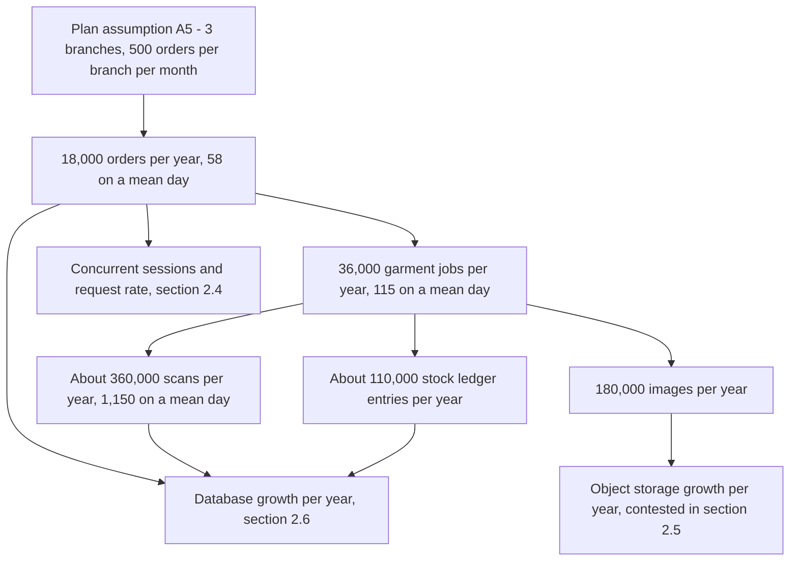
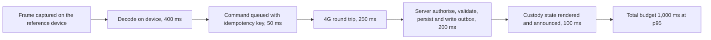

# HyFib Tailor 360 — Capacity assumptions and performance budgets

This document states how much work HyFib Tailor 360 must absorb — users, branches, concurrent sessions, orders,
garment jobs, scans, stock transactions, images, report runs and concurrent billing sessions — and the performance
budgets the product must hold while absorbing it. Every capacity figure is derived transparently from plan
assumption **A5** so that a reviewer can see the arithmetic and change one input rather than argue with a
conclusion. Every budget is expressed as a target on the reference device named in
[`support-matrix.md`](support-matrix.md) section 2, together with **where it is measured** and **which gate
enforces it**, because a budget nobody measures is a wish.

Read it with [`support-matrix.md`](support-matrix.md), which fixes the reference device and the 4G profile, and
with [`slo.md`](slo.md), which turns the latency and freshness numbers here into service-level objectives per
hosting model.

> **Every numeric target in this document is proposed, to be confirmed.** The capacity inputs come from plan
> assumptions A3 and A5, which the plan itself marks as a starting point for issue #19; the budgets are drafted
> engineering defaults. Section 11 is the open-decisions register for this document and feeds owner decisions
> **OD-02** (hosting model and budget), **OD-07** (device matrix) and **OD-08** (retention) in plan
> [Section 11](../IMPLEMENTATION_PLAN.md). Nothing here is settled until
> [`reviews/stakeholder-review.md`](reviews/stakeholder-review.md) is signed and
> [`risk-review.md`](risk-review.md) records that no target is infeasible or unaffordable.

---

## 1. How to read this document

| Convention | Meaning |
| --- | --- |
| **Mean day** | The average working day. A working month is taken as **26 working days**, a working year as **312 days** — proposed, to be confirmed against the shop's registers gathered by issue #17 |
| **Peak day** | A day in the wedding and festival season. The proposed peak-day factor is **3×** the mean day, and the proposed peak-month factor is **2×** the mean month |
| **Peak hour** | The counter peaks are proposed as 11:00–13:00 and 18:00–20:30 Asia/Kolkata; the proposed peak-hour share is **25%** of the day's transactions |
| **p75, p95, p99** | Percentiles. Web vitals use p75 as the web platform defines them; server latency uses p95 with p99 stated as a secondary target |
| **Field** | Measured from real users through the client telemetry endpoint, aggregated per route and per device class over a rolling 28 days |
| **Lab** | Measured in continuous integration on the reference device profile with the 4G network profile and a cold cache |
| **GB** | 1 GB = 1,000 MB throughout, matching how object-storage bills are read |

Sizes, currency and dates follow the product conventions: INR, financial year April to March, Asia/Kolkata for
display and report cut-offs (plan D10, D11).

---

## 2. Capacity assumptions

### 2.1 Inputs taken from the plan

| Input | Value | Source | Status |
| --- | --- | --- | --- |
| Branches at launch | 3 | A5 | Proposed, to be confirmed — **OD-06** fixes the actual branch list |
| Orders per branch per month | 500 | A5 upper bound; A3 gives a range of 100 to 500 | Proposed, to be confirmed |
| Garment jobs per order | 2 | A5 | Proposed, to be confirmed |
| Images per garment job | 5 | A5 and A3 | Proposed, to be confirmed |
| Image size after re-encode | about 1.5 MB | A5 | Proposed, to be confirmed |
| Concurrent users per branch | 20 to 50 | A3 | Proposed, to be confirmed |
| Scans per day | fewer than 5,000 | A5, stated as a ceiling | Proposed, to be confirmed |
| Database growth per year | under 5 GB | A5 | Proposed, to be confirmed |
| Object storage at launch | 100 GB with growth alerts | A5 | **Contested — see section 2.5 and CP-05** |

### 2.2 Derivation

### 2.3 Volume table

All figures are **proposed, to be confirmed**.

| Dimension | Mean day | Peak day, 3× | Per month | Per year | Derivation |
| --- | --- | --- | --- | --- | --- |
| **Orders — organisation** | 58 | 173 | 1,500 | **18,000** | 3 branches × 500 per month; 1,500 ÷ 26 working days |
| **Orders — per branch** | 19 | 58 | 500 | 6,000 | A5 input |
| **Garment jobs** | 115 | 346 | 3,000 | **36,000** | 2 jobs per order |
| **Estimates issued** | 29 | 87 | 750 | 9,000 | Proposed: half of orders begin as an estimate |
| **Scans and custody events** | 1,150 | 3,450 | 30,000 | **360,000** | 10 scans per garment job: intake label, handover to Tailor Master, assignment, three phase transitions, QC in and out, dispatch, delivery confirmation. Stays inside the A5 ceiling of 5,000 per day even on a peak day |
| **Stock ledger entries** | 350 | 1,050 | 9,100 | **110,000** | 3 per garment job for issue, remnant return and wastage, plus about 14 purchase-receipt lines per day and a monthly stocktake of about 500 lines per branch |
| **Invoices posted** | 58 | 173 | 1,500 | 18,000 | One per order; credit notes proposed at 1% of invoices |
| **Payments recorded** | 87 | 260 | 2,250 | 27,000 | Proposed 1.5 payments per order: an advance and a balance |
| **Images uploaded** | 575 | 1,725 | 15,000 | **180,000** | 5 per garment job |
| **Image bytes uploaded** | 0.86 GB | 2.6 GB | 22.5 GB | 270 GB | 1.5 MB per image after re-encode — see section 2.5 |
| **Notification messages** | 230 | 690 | 6,000 | 72,000 | Proposed 4 per order: confirmation, ready, dispatched, feedback request, subject to consent |
| **Report views, ad hoc** | 30 | 60 | 780 | 9,400 | Proposed; dashboards excluded, they are counted as reads |
| **Scheduled report runs** | 5 | 5 | 130 + 3 monthly | 1,600 | Daily branch summary per branch, daily organisation summary, weekly summary, monthly GST summary and monthly valuation run |
| **Governed exports** | 5 | 10 | 130 | 1,560 | Capped at 50,000 rows per file, larger exports paginate into a zip |

### 2.4 Users, sessions and request rate

| Dimension | Launch — proposed | Year 3 — proposed | Notes |
| --- | --- | --- | --- |
| Named staff accounts | 60 to 80 | 150 | Per branch: Reception 2, Measurement Staff 1, Tailor Master 1, Tailors 5 to 8, Inventory Clerk 1, Cashier 1, Delivery Staff 1 to 2, Branch Manager 1, plus Owner, Admin and Auditor at the organisation |
| Concurrent sessions per branch | 20 to 50 | 60 | Plan A3 |
| Concurrent sessions, organisation | 60 to 150 | 180 | 3 branches at the A3 upper bound |
| Active request rate, mean hour | about 3 requests per second | 6 | 60 active sessions issuing one request every 20 seconds |
| Active request rate, peak hour | about 12 requests per second | 25 | 150 sessions in the peak hour with a 1.6× burst allowance |
| **Load-test design point** | **20 requests per second sustained, 50 requests per second burst for 60 seconds** | 40 sustained | The k6 mixed-load scenario in section 6; deliberately above the derived peak so that the budgets have headroom |
| Concurrent **billing** sessions | 1 to 2 cashier sessions open per branch, 3 to 6 organisation-wide | 8 | A cashier session is a shift, not a request |
| Concurrent invoice posts in the same branch and financial year | p95 of 2; designed for 5; load-tested at 20 | 20 | Exercises the per-branch document sequence and its allocation latency |
| Concurrent image uploads | 6 | 15 | Bounded further by the worker `MediaProcessing` bulkhead of 2 concurrent decodes |

### 2.5 Images, sizes and the object-storage discrepancy

Image policy as designed (plan Section 4.4, issue #31):

| Stage | Proposed value | Note |
| --- | --- | --- |
| Upload size cap | 15 MB per file | Rejected above this before any decoding |
| Dimension cap | 40 megapixels, or 12,000 px on a side | Rejected from the header, in the worker |
| Original after re-encode | about 1.5 MB, long edge proposed at 2,400 px | A5 input; the actual size depends on the encoder settings confirmed by #31 |
| Preview derivative | about 120 KB, long edge 1,024 px | — |
| Thumbnail derivative | about 20 KB, long edge 256 px | — |
| Derivative overhead | about 30% of originals | A5 input |
| Images per order | 10 — 5 per garment job × 2 jobs | Material images, reference images, QC evidence and delivery evidence share this budget |

**The discrepancy that must be resolved before the hosting model is priced.** Plan assumption A5 states both a set
of multiplicands and a result of "about 22 GB per year of originals". Those two do not reconcile:

| Scenario | Orders per branch per month | Images | Images per year | Originals per year | Plus 30% derivatives |
| --- | --- | --- | --- | --- | --- |
| **A5 read literally** | 500 | 5 per garment job | 180,000 | **270 GB** | **351 GB** |
| A5's stated result | — | — | about 14,700 | **22 GB** | 29 GB |
| **Reconciliation: A3 lower bound** | 100 | 4 to 5 per **order** | about 16,000 | 24 GB | 31 GB |

The stated 22 GB corresponds to the **lower** end of plan assumption A3 with images counted per order rather than
per garment job. The A5 object-storage provision of 100 GB supports that reconciliation with headroom and does
**not** support the literal reading, which fills 100 GB in under five months and needs roughly 1.1 TB by the end of
year three before retention deletes anything. This is recorded as open decision **CP-05** and must be answered
before **OD-02** (hosting model and budget) can be priced. Until it is answered, no document in this set may state
an object-storage growth figure as settled.

The three levers available to the owner, none of them chosen here:

1. Confirm the real image count per garment job from the shop's practice — the workshop for issue #17 is the place
   to count it.
2. Lower the re-encode target — a long edge of 1,600 px at about 0.5 MB reduces the literal scenario to 90 GB of
   originals per year and remains adequate for a reference photograph viewed on a tablet.
3. Set a shorter retention period for material and reference images than for the order record itself — retention
   is owner decision **OD-08** and is specified in [`data-classification.md`](data-classification.md).

### 2.6 Database growth

Proposed, to be confirmed. Row counts follow section 2.3; byte figures include indexes and are rounded up.

| Table family | Rows per year | Bytes per year | Notes |
| --- | --- | --- | --- |
| `platform.audit_events` | about 1,000,000 | 1.1 GB | About 49 audited actions per order plus authentication and administration. Hash-chained and range-partitioned by month, so retention is a partition detach |
| `custody.scan_events` and custody transfers | 360,000 | 0.2 GB | Append-only |
| `orders` — orders, garment jobs, snapshots, phases, assignments, QC results | about 400,000 | 0.3 GB | Measurement, design and price snapshots dominate the bytes |
| `platform.outbox_messages` and inbox records | about 1,500,000 written | 0.2 GB steady state | Pruned after processing; the proposed retention of processed rows is 30 days |
| `billing` — invoices, lines, tax components, payments, allocations, receipts | about 120,000 | 0.1 GB | Immutable once posted |
| `inventory.ledger_entries` and balances | 110,000 | under 0.1 GB | Balances are derived and rebuildable |
| `media` object and derivative metadata | 400,000 | 0.2 GB | Bytes live in object storage, not the database |
| `notifications` — intents, deliveries, links, feedback | about 200,000 | 0.1 GB | Rendered message bodies are retained only as long as **OD-08** allows |
| `reporting` projections and checkpoints | — | 0.5 GB | Rebuildable; never the authoritative source |
| Identity, customers, catalogue, configuration | about 60,000 | under 0.1 GB | Small and slow-growing |
| **Total** | — | **about 2.8 GB per year, budgeted at 5 GB** | Consistent with A5. Unlike the object-storage figure, this one reconciles |

The proposed alerting rule: warn when the database exceeds **70%** of the provisioned volume, and page when it
exceeds 85% — proposed, to be confirmed with [`slo.md`](slo.md).

---

## 3. Performance budgets

### 3.1 The measurement contract

- Every client budget is a target **on the reference device over the emulated 4G profile** defined in
  [`support-matrix.md`](support-matrix.md) section 2 — not on a laptop, not on Wi-Fi.
- Client budgets are tracked twice: in the **lab** by Lighthouse CI on every release, and in the **field** by the
  client telemetry module, aggregated per route and per device class. Where the two disagree the field wins, and
  the lab profile is corrected.
- Server budgets are measured from **server-side histograms** exported by OpenTelemetry, at the load stated in
  section 2.4. A latency number without a stated load is meaningless and is not accepted in review.
- Budgets apply per route, not as a site average. A single slow route fails the budget.

### 3.2 Scan round-trip decomposition

The plan's headline target is a scan round-trip p95 under 1 second on 4G. That second is allocated so that each
component has an owner:

On WebKit the decode allowance rises to 900 ms because no native `BarcodeDetector` exists
([`support-matrix.md`](support-matrix.md) section 4.1); the proposed iOS scan round-trip target is therefore
**p95 under 1.5 s**, stated separately rather than hidden inside a blended number. A hardware keyboard-wedge scan
replaces the decode allowance with about 30 ms, so its proposed target is **p95 under 700 ms**.

### 3.3 Budget table

Columns are exactly: the budget, its proposed target, where it is measured, and the gate that enforces it. **Every
target below is proposed, to be confirmed.**

| Budget | Target | Measured where | Gate |
| --- | --- | --- | --- |
| **Largest Contentful Paint** — scan, workboard, order-intake, billing routes | p75 ≤ 2.5 s, cold cache | Lab: Lighthouse CI on the reference profile. Field: `web-vitals` through the telemetry endpoint, per route, 28-day p75 | Performance release gate; Lighthouse CI budget file fails the release build |
| **Interaction to Next Paint** | p75 ≤ 200 ms | Field per route and device class; lab through the Lighthouse user flow for the scan and measurement journeys | Performance release gate |
| **Cumulative Layout Shift** | p75 ≤ 0.10 | Lab and field, per route | Performance release gate |
| **Time to First Byte** — application shell | p75 ≤ 800 ms | Lab and field | Performance release gate, advisory |
| **Scan screen cold start** — application launch to viewfinder ready | ≤ 3.0 s on the reference device | Playwright trace with the 4G profile, nightly | Nightly performance job; regression above 10% blocks the release |
| **Camera decode**, Blink | p50 ≤ 400 ms, p95 ≤ 900 ms | Client telemetry scanner metrics, per engine | Performance release gate |
| **Camera decode**, WebKit | p50 ≤ 700 ms, p95 ≤ 1.5 s | Client telemetry scanner metrics | Performance release gate |
| **Scan round trip**, camera on 4G | **p95 < 1 s** on Blink, < 1.5 s on WebKit | Client telemetry, from frame decode to rendered custody state | Performance release gate and a continuous SLO alert |
| **Scan round trip**, keyboard wedge | p95 < 700 ms | Client telemetry | Performance release gate |
| **API p95, reads** | **< 400 ms** at the section 2.4 load | Server histograms per route template; k6 mixed-load run | Load test per release; continuous SLO alert in [`slo.md`](slo.md) |
| **API p95, commands** | **< 800 ms** at the section 2.4 load | Server histograms per route template | Load test per release; continuous SLO alert |
| **API p99** | Reads < 900 ms, commands < 1.5 s | Server histograms | Advisory; investigated, does not block |
| **Document sequence allocation** — invoice number in a branch and financial year | p95 < 50 ms with 5 concurrent posts; no deadlock at 20 | k6 scenario S5 and an integration test | Load test per release |
| **Authorised media streaming** — first byte | p95 < 500 ms for a preview, < 200 ms for a thumbnail | Server histograms | Load test per release |
| **Report and read-model queries** | p95 < 1.5 s | Server histograms per report | Load test per release |
| **Export generation** — 50,000 rows | p95 < 60 s from job start to available file | Worker job metrics | Load test per release |
| **Outbox dispatch lag** | p95 < 30 s | Worker metric, oldest unprocessed message age | Continuous SLO alert |
| **Projection freshness** for reporting read models | p95 < 5 minutes | Reporting checkpoint age metric | Continuous SLO alert; `ReportFreshnessBreached` |
| **In-app notification poll interval** | 60 s, with no poll while the tab is hidden | Client telemetry | Code review and the nightly performance job |
| **Initial JavaScript bundle** — parsed and executed before the first route renders | **≤ 180 KB gzip**, ≤ 550 KB uncompressed | `size-limit` over the Vite build output | Bundle-size check; proposed on **every pull request** as a fast subset of the performance gate that plan Section 5.3 places at release — proposed, to be confirmed |
| **Per-route JavaScript chunk** | ≤ 60 KB gzip | `size-limit` per entry point | Bundle-size check |
| **Barcode decoder chunk** — the ZXing decoder | ≤ 120 KB gzip, loaded on demand by the scan route only | `size-limit`, declared exception | Bundle-size check |
| **CSS** | ≤ 40 KB gzip total | `size-limit` | Bundle-size check |
| **First-load transfer** — HTML, CSS, JavaScript, fonts, icons | ≤ 350 KB over the wire | Lighthouse CI resource-summary budget | Performance release gate |
| **Tamil and Latin font subsets** | ≤ 120 KB total, `font-display: swap` | Lighthouse CI resource-summary budget | Performance release gate |
| **Memory — scan screen** | JavaScript heap ≤ 180 MB steady state over a 200-scan session; no upward trend across 200 scans | Playwright with Chrome DevTools Protocol `Performance.getMetrics`; on device by Chrome remote debugging and Safari Web Inspector for release evidence | Nightly memory probe; release evidence on a real device |
| **Memory — capture screen** | Peak ≤ 250 MB while selecting and queuing 5 images; released within 5 s of leaving the route | Same as above | Nightly memory probe |
| **Memory — whole tab on the reference device** | ≤ 400 MB private memory | Device measurement during the release walkthrough | Release evidence |
| **Database growth** | ≤ 5 GB per year at the section 2.3 volumes | `pg_database_size` trend, exported as a metric | Capacity review, quarterly; alert at 70% of the volume |
| **Object-storage growth** | **Open — CP-05.** The literal reading of A5 gives 351 GB per year including derivatives; the reconciled reading gives about 31 GB | Bucket size metric and growth alert | Capacity review; blocked until CP-05 is decided |

### 3.4 Budgets that are deliberately **not** set here

| Item | Where it belongs |
| --- | --- |
| Availability, error rate, RPO, RTO, backup retention and restore cadence | [`slo.md`](slo.md), per hosting model |
| Notification delivery latency and provider timeouts | [`slo.md`](slo.md) and issue #47 |
| Patching and vulnerability response times | [`security-operations-targets.md`](security-operations-targets.md) |
| Accessibility conformance and language coverage | [`accessibility-localisation.md`](accessibility-localisation.md) |
| Rate-limit policy numbers for `auth-anon`, `scan-burst`, `export-heavy` and the rest | The rate-limit catalogue in issue #53, sized from the section 2.4 rates and the scenario S3 replay shape |

---

## 4. Server resource envelope

From plan assumption A5, restated so that a capacity conversation and a hosting quotation start from the same
numbers. Proposed, to be confirmed with **OD-02**.

| Component | Resident memory | Notes |
| --- | --- | --- |
| PostgreSQL | 2 GB | Plus the connection budget below |
| Web host | 0.5 GB | One replica in the Compose baseline |
| Worker host | 0.5 GB | Scales to two replicas without a code change, using database leases |
| Object storage, self-hosted | 0.5 to 1 GB | Not required with a managed bucket |
| ClamAV | 1.5 to 2 GB | Signature database resident |
| Reverse proxy | 0.1 GB | — |
| Telemetry collector | 0.3 GB | A self-hosted observability stack adds 3 to 4 GB and is a separate decision, **OD-14** |
| **Baseline production virtual machine** | **4 vCPU, 16 GB RAM, 200 GB SSD** | Staging 2 vCPU, 8 GB |

Connection budget against `max_connections = 100`, validated at startup and exported with an alert at 80%
(plan Section 4.4):

| Pool | Connections |
| --- | --- |
| Web, transactional | 30 |
| Web, reporting | 10 |
| Worker, transactional | 20 |
| Worker, reporting | 10 |
| Migrator | 2 |
| Tooling | 5 |
| Reserve | 10 |

A second web replica or a read replica requires recomputing this budget or introducing PgBouncer in transaction
mode; that is a capacity decision, not a deployment detail.

---

## 5. Growth and re-baselining

| Horizon | Orders per year | Garment jobs | Scans per year | Database | Object storage |
| --- | --- | --- | --- | --- | --- |
| Launch, year 1 | 18,000 | 36,000 | 360,000 | about 3 GB | Blocked on CP-05 |
| Year 2, proposed 25% growth | 22,500 | 45,000 | 450,000 | about 7 GB cumulative | Blocked on CP-05 |
| Year 3, proposed 25% growth and a fourth branch | 30,000 | 60,000 | 600,000 | about 13 GB cumulative | Blocked on CP-05 |

Rules, proposed to be confirmed:

- The capacity assumptions are **re-derived from production telemetry after the first three months** of live
  operation, and this document is updated in a pull request that records the measured values beside the proposed
  ones. Plan assumption A3 explicitly expects issue #19 to replace guesses with measured targets; the first
  measurement opportunity is production, not the plan.
- Capacity is reviewed **quarterly** and whenever a branch is added, an image policy changes or a retention period
  changes.
- Any single dimension exceeding **70%** of its provisioned headroom opens a capacity item before the next release.

---

## 6. Load and soak scenarios

Implemented with k6 under `tests/load/`, run in full for every release and as a smoke subset per the release gate
in plan Section 5.3. Proposed, to be confirmed.

| ID | Scenario | Shape | Pass criteria |
| --- | --- | --- | --- |
| **S1** | Counter peak, mixed load | 20 requests per second for 15 minutes across order intake, workboard, scans, media reads and billing reads in the section 2.3 proportions | All section 3.3 API budgets held; HTTP 5xx rate = 0; error rate under 0.1%; connections within budget |
| **S2** | Seasonal burst | 50 requests per second for 60 seconds on top of S1 | Reads p95 under 600 ms, commands p95 under 1.2 s; no rate-limit rejections for authenticated staff traffic |
| **S3** | Offline queue replay | 20 devices each replaying 200 queued scans within 60 seconds, all with idempotency keys and client event UUIDs | No duplicate custody events; the `scan-burst` rate-limit policy admits the replay; outbox lag returns under 30 s within 2 minutes |
| **S4** | Month-end reporting | The monthly GST summary, the valuation run and 5 concurrent 50,000-row exports while S1 runs | Interactive budgets in section 3.3 unaffected; export completes inside 60 s p95; reporting queries never block writes |
| **S5** | Billing contention | 20 concurrent invoice posts in one branch and financial year, plus 20 payment recordings | No deadlock; no sequence gap other than a documented cancellation; sequence allocation p95 under 50 ms |
| **S6** | Media storm | 30 concurrent uploads of 5 MB with the worker bulkhead at 2 | Upload acceptance p95 under 2 s; the queue drains inside 10 minutes; the web host memory stays inside its envelope |
| **S7** | Soak | S1 at 50% for 8 hours | No memory growth trend in web or worker; no connection leak; no unbounded table growth outside section 2.6 |

---

## 7. Client performance practices that the budgets assume

These are the design choices the budgets in section 3.3 are only achievable with, recorded so that a future change
that breaks one is recognised as a budget change rather than a refactor:

| Practice | Why the budget depends on it |
| --- | --- |
| Route-level code splitting, with the barcode decoder and the PDF preview loaded on demand | Keeps the initial bundle inside 180 KB gzip |
| Server-driven pagination with cursors, never client-side filtering of a whole table | Keeps memory and Interaction to Next Paint inside budget on dense back-office tables |
| List virtualisation on the workboard, the delivery queue and the stock ledger | The same |
| No image decoding, resizing or EXIF handling in the browser | Keeps the capture screen inside 250 MB on a 4 GB device |
| One camera stream at a time, released on route change and re-acquired on `visibilitychange` | Prevents the camera pipeline from dominating memory on the reference device |
| Font subsetting for Latin and Tamil with `font-display: swap` | Keeps first-load transfer inside 350 KB and avoids invisible text |
| Network-first API caching with a strict stale-while-revalidate allowlist | Protects correctness while keeping the shell instant |
| No cross-module client bundles: a route imports its module's generated client slice only | Keeps per-route chunks inside 60 KB gzip |

---

## 8. Traceability

Every budget in section 3.3 has a row in [`traceability.md`](traceability.md) with its test or monitor, its
evidence artefact and its owner. A budget without a monitor is a defect in this document, not an accepted risk.

| Budget family | Monitor | Evidence artefact |
| --- | --- | --- |
| Core Web Vitals | Field telemetry dashboard per route and device class | Lighthouse CI report stored with the release |
| Scan round trip and decode | Scanner metrics dashboard, per source and engine | Real-device walkthrough recording |
| API latency | OpenTelemetry histograms and SLO burn alerts | k6 summary stored with the release |
| Bundle size | `size-limit` output in the pull-request check | The check's stored output |
| Memory | Nightly Playwright memory probe | Trend chart plus the on-device measurement in the release evidence |
| Capacity growth | Database size, bucket size, row-count metrics | Quarterly capacity review note |

---

## 9. Assumptions this document makes explicit

| ID | Assumption | If it is wrong |
| --- | --- | --- |
| CP-A1 | The shop works 26 days a month, 312 days a year | Mean-day figures scale inversely; peak factors are unaffected |
| CP-A2 | A garment job produces about 10 scans across its lifecycle | Scan volume, audit rows and the `scan-burst` rate-limit sizing all move proportionally |
| CP-A3 | About 49 audited actions occur per order including its garment jobs | Database growth moves; audit remains partitioned monthly either way |
| CP-A4 | Peak season is 3× a mean day and 2× a mean month | The load-test design point of 20 requests per second sustained already carries headroom above the derived peak of 12 |
| CP-A5 | Reporting runs on projections, never on the transactional tables | Otherwise the S4 scenario would contend with counter traffic and the read budgets would not hold |
| CP-A6 | Media bytes never transit the database | Otherwise the database growth budget of 5 GB per year is wrong by two orders of magnitude |

---

## 10. Open decisions

Local identifiers `CP-01` and upwards, referenced from [`traceability.md`](traceability.md) and to be transcribed
into [`../prd/assumptions-and-open-decisions.md`](../prd/assumptions-and-open-decisions.md) in the pull request
that closes issue #19. All of them are **open**; none may be quoted elsewhere as settled.

| ID | Open decision | Proposed position, to be confirmed | Owner | Raised | Needed by |
| --- | --- | --- | --- | --- | --- |
| **CP-01** | Order volume per branch per month at launch | 500, the A5 upper bound; A3 allows 100 | Business owner, from the shop's registers gathered by #17 | 2026-09-04 | Before W1 exit — feeds **OD-02** |
| **CP-02** | Working days per month and the peak-season factors | 26 working days; peak day 3×, peak month 2× | Business owner with the Branch Manager | 2026-09-04 | Before W1 exit |
| **CP-03** | Concurrent sessions to design for | 150 organisation-wide; load-test design point 20 requests per second sustained | Technical reviewer | 2026-09-04 | Before the first load test in W5 |
| **CP-04** | Scans per garment job | 10, giving 1,150 on a mean day against the A5 ceiling of 5,000 | Business owner with the Tailor Master | 2026-09-04 | Before W3 — sizes the `scan-burst` policy |
| **CP-05** | **Object-storage growth.** A5's stated 22 GB per year does not reconcile with its own multiplicands, which give 270 GB of originals and 351 GB with derivatives | Not proposed. Requires a decision among counting images per order, lowering the re-encode target, or shortening image retention — section 2.5 | Business owner with the technical reviewer | 2026-09-04 | **Before OD-02 can be priced** |
| **CP-06** | Re-encode target for stored originals | Long edge 2,400 px at about 1.5 MB; the 1,600 px and 0.5 MB alternative is on the table | Business owner with the Tailor Master, on image quality | 2026-09-04 | Before W2 — feeds #31 |
| **CP-07** | Core Web Vitals targets on the reference device | LCP p75 ≤ 2.5 s, INP p75 ≤ 200 ms, CLS p75 ≤ 0.10 | Technical reviewer | 2026-09-04 | Before W1 exit — gates every user-interface issue |
| **CP-08** | API latency targets and the load they are stated at | Reads p95 < 400 ms, commands p95 < 800 ms at 20 requests per second | Technical reviewer | 2026-09-04 | Before W1 exit — restated in [`slo.md`](slo.md) |
| **CP-09** | Separate WebKit scan budget | Scan round trip p95 < 1.5 s on iOS against < 1 s on Blink | Technical reviewer | 2026-09-04 | Before W3 — feeds #36 |
| **CP-10** | JavaScript bundle budgets | Initial ≤ 180 KB gzip, per route ≤ 60 KB gzip, decoder chunk ≤ 120 KB gzip | Technical reviewer | 2026-09-04 | Before W1 — the design-system issue #50 must build inside it |
| **CP-11** | Whether the bundle-size check runs on every pull request or only at the release gate | Every pull request, as a fast subset of the performance gate that plan Section 5.3 places at release | Technical reviewer | 2026-09-04 | Before W1 — changes the CI definition in #22 |
| **CP-12** | Memory ceilings on the scan and capture screens | 180 MB and 250 MB JavaScript heap; 400 MB private memory for the whole tab | Technical reviewer | 2026-09-04 | Before W3 |
| **CP-13** | Database growth budget and its alert thresholds | 5 GB per year; warn at 70% of the volume, page at 85% | Technical reviewer with the business owner on the volume size | 2026-09-04 | Before W5 — feeds #58 |
| **CP-14** | Growth horizon to provision for | 25% per year and a fourth branch by year three | Business owner | 2026-09-04 | Before **OD-02** |
| **CP-15** | The re-baselining commitment | Re-derive from production telemetry after three months, review quarterly | Business owner with the technical reviewer | 2026-09-04 | Before go-live |

---

## 11. Related documents

| Document | Why it matters here |
| --- | --- |
| [`support-matrix.md`](support-matrix.md) | The reference device, the 4G profile and the engine constraints every client budget is measured against |
| [`slo.md`](slo.md) | Availability, error rate, RPO, RTO and the alerting that consumes the latency budgets here |
| [`data-classification.md`](data-classification.md) | Retention periods, which change every storage figure in section 2 |
| [`security-operations-targets.md`](security-operations-targets.md) | Patching and incident targets, deliberately out of scope here |
| [`traceability.md`](traceability.md) | Budget to test, monitor, evidence and owner |
| [`risk-review.md`](risk-review.md) | Where an infeasible or unaffordable target is recorded with its mitigation or waiver |
| [`../process/release-gates.md`](../process/release-gates.md) | The performance and load gates named in the budget table |
| [`../process/definition-of-done.md`](../process/definition-of-done.md) | The per-pull-request obligations, including the bundle-size check under CP-11 |
| [`../architecture/deployment.md`](../architecture/deployment.md) | The Compose baseline the resource envelope in section 4 describes |
| [`../architecture/failure-modes.md`](../architecture/failure-modes.md) | Behaviour when a dependency is degraded rather than slow |
| [`../prd/assumptions-and-open-decisions.md`](../prd/assumptions-and-open-decisions.md) | The owner decision register that CP-01 to CP-15 are transcribed into |
| [`../IMPLEMENTATION_PLAN.md`](../IMPLEMENTATION_PLAN.md) | Assumptions A3 and A5, Section 4.4, Section 4.6, Section 5.3 and Section 11 |
