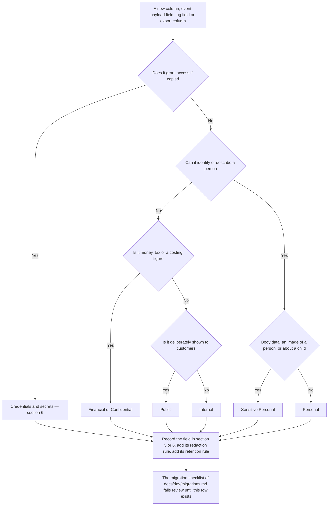
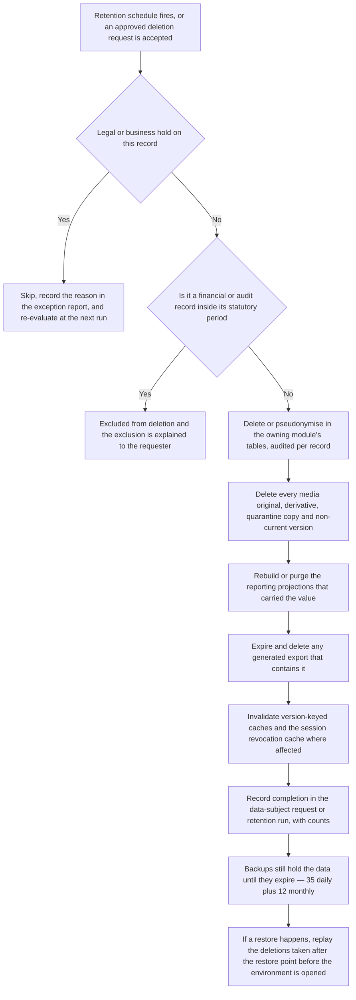

# HyFib Tailor 360 — Data classification and handling

This document names every kind of data HyFib Tailor 360 holds, puts each one in a class, and fixes what may be done
with that class: who may read it, how long it is kept, whether it may enter a log, a trace, an export or a backup,
and what happens to it when it must go. It exists because access rules, retention jobs, redaction policies and
export governance are only as good as the inventory they are configured from — the retention job of #57, the
logging redaction policy of plan Section 5.2, the governed exports of Reporting and the incident procedure of
[`security-operations-targets.md`](security-operations-targets.md) all read their inputs from here. Two warnings
before the tables: every **retention period** below is **proposed, to be confirmed** under owner decision
**OD-08**, and every row marked **Legal review** is a question for a qualified adviser, not for this document —
India's data-protection obligations are recorded in section 4 as an explicit open decision and must not be
presented as settled anywhere in this documentation set.

---

## 1. Status and scope

| Field | Value |
| --- | --- |
| Status | **Draft — proposed classification**; binding when the stakeholder review of issue #19 is signed and OD-08 is decided |
| Owner of the document | Technical reviewer, with the Owner as approver, the accountant as co-signer for financial classes and a legal adviser for section 12 |
| Drafted | 2026-09-04 (issue #19, wave W0) |
| Blocking decisions | **OD-08** retention periods, **OD-05** statutory GST record retention, **OD-02** hosting model (where the data physically rests), **OD-03** providers (who else processes it), **OD-13** permission matrix (who may read it), **OD-14** telemetry backend — see [`../prd/assumptions-and-open-decisions.md`](../prd/assumptions-and-open-decisions.md) |
| Implemented by | #24 authorisation and field minimisation, #31 media pipeline and retention, #47 notification body retention, #57 privacy, audit, retention and data-subject requests, #58 telemetry redaction, #60 backups |
| Review cadence | Every release train, on any new personal-data field (the migration checklist of [`../dev/migrations.md`](../dev/migrations.md) requires it), and immediately after any suspected data exposure |

**In scope**: everything the platform stores or emits — the PostgreSQL database, the private object storage, audit
events, application logs, traces and metrics, client telemetry, generated exports and documents, printed artefacts,
backups, and the credentials and keys that protect all of it.

**Out of scope**: paper registers and WhatsApp threads the branches keep outside the system (the migration of those
is a business process, not a platform one); the internal handling of data by the SMS, WhatsApp, payment and
accounting providers beyond the contractual position recorded under **OD-03**; and any statement of what Indian law
requires — see section 12.

**Where an earlier document calls a category simply "personal data"** — for example
[`../prd/measurement-templates.md`](../prd/measurement-templates.md) — this document's class is the authoritative
refinement of that statement, not a contradiction of it.

---

## 2. The seven classes

Classification answers one question: *what does the system have to do differently because of what this data is?*
The scheme therefore has as few classes as will produce different handling, and each class has exactly one set of
rules in section 3.

| Class | What it means here | Examples in this system | If it leaks |
| --- | --- | --- | --- |
| **Public** | Deliberately published to anyone who holds a link or an invoice; no access control is claimed for it | Category, service-type and design labels and illustrations shown on a customer-facing estimate or status page; the branch name, address and GSTIN printed on an invoice; the `en-IN` and `ta-IN` message catalogues; the application shell assets | No impact |
| **Internal** | Business information with no personal or financial content; restricted to staff because it describes how the shop runs, not because disclosure harms a person | Catalogue and workflow definitions, QC checklist templates, price-list **structure**, phase names and SLAs, reorder rules, branch working calendars, metric dictionary, feature-flag names | Competitive nuisance |
| **Confidential** | Commercially sensitive business data whose disclosure damages the business or a supplier | Price-list rates and discounts, supplier terms and purchase costs, stock valuation, margin and profitability reports, cost assumptions, aggregate sales figures | Commercial harm, supplier relationships |
| **Personal** | Data about an identified or identifiable individual — customer, guardian, supplier contact or member of staff | Customer name, native-script name, phone number, address, guardian link, order history, delivery recipient name, staff name and contact, feedback free text, notification recipient addresses and rendered message bodies | Privacy harm, loss of trust, statutory exposure |
| **Sensitive Personal** | Personal data whose disclosure would cause disproportionate distress or embarrassment, or which concerns a child. Treated more strictly than Personal by this scheme; the class is **ours**, not a statutory category, and the statutory position is section 12 | Body measurements (drafts, versions, snapshots, measurement sheets), images of a person or of a garment on a person, any image of a child, the guardian-to-child link, feedback free text where it names a person, health-adjacent notes a customer volunteers | Serious privacy harm; the failure a tailoring customer would find hardest to forgive |
| **Financial** | Money and tax records, which are simultaneously personal (they name a customer) and statutory (they must be kept, and kept correct) | Invoices, credit and debit notes, tax components, payments, advances, refunds, allocations, receipts, cashier sessions, reconciliation batches, payment-provider references, accounting exports | Fraud, tax exposure, disputes that cannot be settled |
| **Credentials and secrets** | Anything that grants access if copied. Never business data — the class exists because its handling has nothing in common with the others | Password hashes, TOTP secrets, passkey records, recovery codes, session tickets and the session cookie value, anti-forgery tokens, customer-link tokens, delivery one-time passwords, provider API keys, webhook signing secrets, database role passwords, object-storage credentials, backup encryption keys, the Data Protection key ring and its key-encryption key | Everything above, at once |

### 2.1 A record usually carries more than one class, and the strictest wins

An invoice is **Financial** and **Personal**. A garment job is **Internal** in its workflow fields, **Sensitive
Personal** in its measurement snapshot and **Confidential** in its price snapshot. Classification is therefore
applied **per field or per column**, and every rule that follows applies to a record at the strictest class any
field in it carries — unless the field is projected away first, which is exactly what the field-level minimisation
policies of #24 are for. "Project it away" is always preferred to "restrict the whole screen": a job card shows the
customer's name and job number and never their phone number, which is why a Tailor can be shown a job card at all.

### 2.2 Classifying a new field

---

## 3. Handling rules per class

This is the table the code is written against. Where a cell says **never**, it means a test asserts it, not that
somebody promises to be careful.

| Treatment | Public | Internal | Confidential | Personal | Sensitive Personal | Financial | Credentials and secrets |
| --- | --- | --- | --- | --- | --- | --- | --- |
| Access control | None claimed | Authenticated staff, branch-scoped | Named permission, branch-scoped | Named permission, branch-scoped, field-minimised | Named permission, branch-scoped, field-minimised, **read is audited** | Named permission, branch-scoped; the actions flagged `RequiresStepUp` in the permission catalogue additionally require step-up | Never read by a human in normal operation; break-glass only, audited, followed by rotation |
| Appears in application logs | Yes | Identifiers and codes only | Identifiers and codes only | **Identifiers only, never values** | **Never, in any form** | Document identifiers and amounts-free status only | **Never** |
| Appears in traces and metrics | Yes | As attribute values | As low-cardinality labels only | **Identifiers only** | **Never** | **Never as amounts**; counts and statuses only | **Never** |
| Appears in client telemetry | Yes | Route names and component names | **Never** | **Never** | **Never** | **Never** | **Never** |
| Appears in integration events and webhooks | Yes | Yes | Only to a subscriber approved for it | Only identifiers, unless the event is classified personal **and** the subscriber is approved (plan Section 5.2) | **Never** | Amounts, codes and statuses; no line-level personal content unless approved | **Never** |
| In database backups | Yes | Yes | Yes | Yes, encrypted at rest, in an object-locked bucket | Yes, encrypted at rest, in an object-locked bucket | Yes, encrypted at rest, in an object-locked bucket | The Data Protection ring travels encrypted; the backup cipher key and the key-encryption key are **never in the same backup set** as the data |
| In object-storage backups | n/a | n/a | n/a | Non-current versions retained at least as long as the database backups | Same, and the retention job must purge **all** versions, not only the current one | Document artefacts retained with the financial record | **Never stored in a bucket the application can read** |
| In exports (CSV, XLSX, PDF, accounting) | Yes | Yes | `reports.export` and a business reason | Only in an export whose purpose covers it; every export audited, expiring and access-controlled | Only in a measurement sheet or a data-subject export, both audited; **never** in a bulk report export | Yes, in financial and accounting exports; totals must reconcile to the source | **Never** |
| Retention | Life of the catalogue version | Life of the configuration version | Per policy | Per policy, OD-08 | Per policy, OD-08, shortest defensible | Statutory, OD-05 | Life of the credential, then rotated; hashes deleted with their subject |
| Deletion behaviour | Superseded, not deleted | Retired, not deleted | Retired, not deleted | Deleted or pseudonymised by the retention job, each deletion audited | Deleted by the retention job; images deleted with every derivative and every non-current version | **Never deleted while the statutory period runs**; corrections are compensating entries | Rotated and revoked; a compromised credential is rotated first and investigated second |

### 3.1 The rules that hold whatever the class

1. **Nothing is authoritative except the owning module's tables.** Reporting projections, caches and exports are
   derived and rebuildable (plan Section 2.2, ADR-0011); a deletion that changes the source is not complete until
   the projections that carry the value have been rebuilt or purged.
2. **Deny by default.** A new endpoint has no access to any class until it declares a permission (#24), and the
   authorisation-matrix fixtures fail the build if it does not.
3. **Media is never given a URL.** Every object is streamed by an endpoint that re-authorises the request and
   writes an access-log entry (plan D4); there is no presigned-URL mode without an architecture decision record.
4. **Personal data never becomes a lookup key on an unauthenticated surface.** Customer-facing pages are reached
   through 128-bit purpose-bound links of which only the SHA-256 hash is stored, and `/c/**` paths are redacted
   from the reverse proxy log, the application log and traces (plan Section 4.4).
5. **Barcodes carry no personal data and no display number** — a namespaced opaque payload only (plan D9). A
   barcode is therefore Internal, even though the garment it is stuck to belongs to a named person.
6. **Synthetic data only outside production.** Production refuses synthetic seeding unconditionally, and no
   production data is ever copied into development, staging or a test fixture (plan Section 2.2). A restore
   rehearsal on the staging virtual machine is the single exception and runs under the same access controls as
   production, with the restored environment torn down afterwards (#60).
7. **A class is not a permission.** These rules say what handling is required; the actual role-to-permission grants
   are `docs/security/permission-matrix.md` (#24) and are open decision **OD-13**. Permission names used below are
   the plan's catalogue examples, not an approved grant.

---

## 4. Lawful basis, consent and notice

### 4.1 The position this document takes

HyFib Tailor 360 processes personal data of customers, guardians, children, supplier contacts and staff. The Indian
statute that governs this is the **Digital Personal Data Protection Act 2023** together with the rules made under
it. **What that Act and those rules require of a tailoring business of this size — the notice wording, whether a
particular purpose may rest on consent or on a legitimate use, the treatment of children's data, the grievance and
consent-manager machinery, breach notification, and any obligation about where the data may be stored — is not
settled by this document and must not be presented as settled anywhere else.** It is recorded as open decision
**DC-01** and needs a qualified adviser before launch. The table below is the **proposed** basis the system is
built to support; the machinery (versioned consent records per purpose, withdrawal, audited access, retention jobs,
data-subject requests) is deliberately built so that whichever answer the adviser gives can be configured rather
than re-engineered.

### 4.2 Consent purposes the system records

Consent is a versioned record per purpose carrying the wording version, source, actor and time
([`../prd/glossary.md`](../prd/glossary.md)), and it is queried server-side before the action it governs — never
assumed from the presence of the data.

| Purpose | Governs | Refused or withdrawn means | Proposed basis |
| --- | --- | --- | --- |
| `measurement_storage` | Keeping a confirmed measurement version for reuse after the order is delivered | Measurements are used for the order in hand and deleted at the end of the shortened retention window | Consent — **legal review, DC-01** |
| `photo_capture` | Capturing and storing material, reference or garment images that show a person | No image of a person is captured; reference images of the garment alone are used instead | Consent, and for a child the guardian's consent — **legal review, DC-01** |
| `transactional_messages` | Order confirmations, ready-for-delivery, dispatch and delivery messages | The customer is told at the counter and collects without messages; the order still proceeds | Necessary to perform the service — **legal review, DC-01** |
| `marketing_messages` | Anything that is not about an order in hand | Never sent. There is no legitimate-interest override in this system | Consent, always |
| `feedback_requests` | The post-delivery feedback invitation and any service-recovery follow-up | No invitation is sent; feedback given voluntarily at the counter is still recorded | Consent — **legal review, DC-01** |

Three rules hold whatever the adviser says. Consent is **recorded against a wording version**, so a change of
wording is a new consent, not a silent re-interpretation of an old one. Withdrawal is **recorded, never deleted** —
the evidence that a customer withdrew is itself needed. And a **suppression is audited**: a message not sent for
consent, quiet-hours, de-duplication or preference reasons leaves a record saying so (#47).

### 4.3 Children's data

The Kids category exists ([`../prd/workflows/kids.md`](../prd/workflows/kids.md)) and with it a child's name, age
band, measurements and possibly an image, linked to a guardian who is the contact. The child never holds an
account, is never contacted and never receives a link. Whether anything further is required — verifiable parental
consent, a prohibition on certain processing, a shorter retention period — is **DC-02**, a legal-review item, and
until it is answered the working default recorded in the Kids workflow stands: **no image of a child is captured
unless the guardian has given photo consent, and an image of the garment is preferred to an image of the child.**

### 4.4 Notice, grievances and third parties

| Item | Proposed position | Status |
| --- | --- | --- |
| Counter notice | A short printed notice at the counter and on the estimate, in English and Tamil, saying what is collected, why, for how long, and how to ask for deletion | **Proposed** — wording needs legal review (**DC-01**) |
| Grievance contact | A named person at the business, printed on the notice and shown on customer-facing pages | **Open** — the name is the Owner's to give, the obligation is **DC-01** |
| Data-subject requests | Access, correction and deletion requests are handled through the flow built by #57, with identity verification at the counter, an audited decision and a stated response time | **Proposed** — the statutory response time is **DC-01** |
| Processors | SMS, WhatsApp, payment, accounting and telemetry providers process personal data on the business's behalf and need a contract that says so, plus a support-ownership document before the adapter is enabled (plan D20) | **Open** — depends on **OD-03**, **OD-14** |
| Where the data rests | The hosting model decides whether the database, the object storage, the telemetry backend and the backups are in India or elsewhere. Any cross-border question is legal, not architectural | **Open** — **OD-02**, **OD-14**, and **DC-03** below |

---

## 5. The data inventory

### 5.1 Index

Every category below is stated with the same ten attributes, in the same order, so that a reviewer can compare them
and an auditor can find the gap. "Owning module" uses the module names of plan Section 4.3.

| # | Category | Class or classes | Owning module | Legal review |
| --- | --- | --- | --- | --- |
| 5.2 | Customer identity and contact details | Personal | Customers/Measurements | Yes |
| 5.3 | Consent records and communication preferences | Personal | Customers/Measurements | Yes |
| 5.4 | Measurements — drafts, versions, snapshots, sheets | **Sensitive Personal** | Customers/Measurements, Orders/Workflow | Yes |
| 5.5 | Customer material and reference images | **Sensitive Personal** where a person appears, otherwise Personal | Media | Yes |
| 5.6 | QC, custody and delivery evidence | **Sensitive Personal** (images), Personal (recipient name) | Media, Custody/Barcode | Yes |
| 5.7 | Estimates, orders and garment job data | Internal, with Personal and Confidential fields | Orders/Workflow | No |
| 5.8 | Barcode identities, scans, labels and custody events | Internal | Custody/Barcode | No |
| 5.9 | Inventory, suppliers and the stock ledger | Confidential, with Personal supplier contacts | Inventory | No |
| 5.10 | Invoices, credit notes and debit notes | **Financial** and Personal | Billing/Payments | Yes — retention |
| 5.11 | Payments, advances, refunds and allocations | **Financial** and Personal | Billing/Payments | Yes — retention |
| 5.12 | Receipts, cashier sessions and reconciliation | **Financial** | Billing/Payments | Yes — retention |
| 5.13 | Notification intents, deliveries and rendered bodies | Personal | Notifications/Feedback | Yes |
| 5.14 | Customer links and feedback | Credentials (the token), Personal to Sensitive Personal (the free text) | Notifications/Feedback | Yes |
| 5.15 | Staff identity, roles, assignments and sessions | Personal, plus Credentials | Identity/Admin | Yes |
| 5.16 | Audit events | Personal metadata, evidentiary | Platform | Yes — retention |
| 5.17 | Application logs | Internal by construction | Platform | No |
| 5.18 | Telemetry — server and client | Internal by construction | Platform | No |
| 5.19 | Reporting projections and exports | Mirrors the source, strictest wins | Reporting | Yes |
| 5.20 | Backups and restore artefacts | Mirrors the whole system | Platform, infrastructure | Yes |
| 6 | Credentials and secrets | **Credentials and secrets** | Identity/Admin, Platform, Integration, infrastructure | No, but security review |

### 5.2 Customer identity and contact details

| Attribute | Treatment |
| --- | --- |
| Class | **Personal** |
| Examples | `customer_number`, name, native-script name, aliases, phone number, alternative phone, address, guardian-to-child link, branch of first contact, duplicate-candidate scores and merge history, and **the free-text reason recorded for a merge** |
| Purpose | To find the right person at the counter, to reach them about their order, to attach measurements and orders to the correct record, and to avoid the duplicate records the paper register produces |
| Lawful basis or consent | Necessary to provide the service the customer asked for; **DC-01** confirms the basis. Marketing use requires `marketing_messages` consent and there is no override |
| Who may access | Reception, Branch Manager, Owner, Cashier and Delivery Staff within their branch scope. The **contact fields are a separate permission** (`customers.read_contact`), so a Tailor sees a name on a job card and never a phone number. Auditor reads without changing. Cross-branch reads are permitted only where the branch-scenario rules allow it ([`../prd/workflows/branch-scenarios.md`](../prd/workflows/branch-scenarios.md)) |
| Retention | Active for as long as the customer is served; **proposed** deletion or pseudonymisation *n* years after the last order, where *n* is at least the statutory retention of the financial records that name them — **OD-08** with **OD-05** |
| In backups | Yes, inside the encrypted database backup in the object-locked bucket. Present in every backup taken before a deletion, and therefore gone only when those backups expire (section 7) |
| In logs | The `customer_id` may appear. **The name, native name, phone number and address never appear** in any log, problem detail, health payload, trace attribute or telemetry event |
| In exports | Only in exports whose purpose names the customer — a delivery list, a data-subject export, a financial document. **Never** in an operational or analytical bulk export, which carries `customer_id` and, where a human must recognise the row, a masked name. Every export is audited, expiring and access-controlled |
| Deletion and anonymisation | There is no delete endpoint. Deactivation is a flag; retention deletion is **pseudonymisation**: name, native name, phone, address and aliases are replaced with a stable irreversible token, the `customer_id` survives so orders, invoices and the audit chain stay coherent, and the operation is audited per record (#57). The merge and duplicate rows are pseudonymised in two different ways, for the reason in section 5.2.1 |

#### 5.2.1 Merge records and duplicate-candidate decisions

Both are evidence for exception EX-01, and both are covered by the row above, but they are erased differently and it
is worth saying why before #57 has to decide it under time pressure.

| Row | What it asserts | On erasure |
| --- | --- | --- |
| `customer_merges` | That the shop decided, on a date, on somebody's authority, that two of *its own records* were one person | **Kept, with the reason cleared.** The decision is the shop's own operating history and an irreversible one; deleting it would leave a survivor carrying an alias for a number nothing explains. The `reason` column is free text a member of staff typed about a named person, so it is the part that goes. The column is nullable for that and for nothing else, and the `customer_merges_no_rewrite` trigger permits clearing it and refuses every other change |
| `duplicate_candidates` | That two *named people* were once thought to be one, and that somebody judged otherwise | **Deleted.** It is an assertion about the two people rather than about the shop's operations, and there is nothing left to explain once both records are pseudonymised. The table carries no append-only trigger and no uniqueness over the pair, deliberately, so that erasure can remove rows outright |

Neither the reason nor the candidate scores ever leave Customers. `customers.customer-merged.v1` carries identifiers
only ([`../integration/events/README.md`](../integration/events/README.md) section 3), and a subscriber that needs
to show a merge asks `ICustomerSnapshotQuery`, which re-authorises the read.

### 5.3 Consent records and communication preferences

| Attribute | Treatment |
| --- | --- |
| Class | **Personal** |
| Examples | Consent record per purpose with wording version, source, actor and time; withdrawal records; allowed channels; language preference; quiet hours |
| Purpose | To prove what the customer agreed to, to enforce it server-side before every send or image use, and to honour a withdrawal immediately |
| Lawful basis or consent | The record **is** the consent evidence; keeping it is necessary to demonstrate the basis for everything else |
| Who may access | Reception and Branch Manager to record and read; Notifications reads it through `IConsentQuery` and never copies it; Auditor reads it. Nobody may edit a historical consent record — a change is a new record |
| Retention | Kept while the customer record exists and **proposed** for a further evidentiary period after pseudonymisation, holding only purpose, wording version and timestamps — **OD-08**, **DC-01** |
| In backups | Yes, with the database |
| In logs | The consent **decision** (purpose, outcome, wording version) is audited; the wording text and the customer's contact details are not logged |
| In exports | In a data-subject export and in the consent audit report; not in operational exports |
| Deletion and anonymisation | Survives pseudonymisation in reduced form, because deleting the evidence that consent was withdrawn would be the wrong outcome. Reviewed under **DC-01** |

### 5.4 Measurements — drafts, versions, snapshots and sheets

| Attribute | Treatment |
| --- | --- |
| Class | **Sensitive Personal** |
| Examples | Measurement drafts; confirmed measurement versions in canonical millimetres; the measurement snapshot copied onto a garment job; the printable measurement sheet; ease and growth-allowance notes; the `age_band` of a child |
| Purpose | To cut and stitch the garment correctly, and to let a returning customer say "same as last time" without being measured again |
| Lawful basis or consent | Necessary for the order in hand; **storage for later reuse** rests on the `measurement_storage` consent — **DC-01** |
| Who may access | The capture permission (`measurements.capture`) at the counter; the Tailor Master and the assigned Tailor for jobs in their branch; Branch Manager and Owner. **Reads of a measurement version or sheet are a sensitive read and are audited explicitly** (plan Section 4.4). Delivery Staff, Cashier and Inventory Clerk have no reason to read them and are not granted it |
| Retention | Drafts expire unconsumed after the configured draft window. Confirmed versions: **proposed** retention of 3 years from last use where `measurement_storage` consent stands, and deletion at the end of the order's warranty and alteration window where it does not — **OD-08**. The **snapshot on a garment job is part of the business record** and is retained with the order, not with the customer |
| In backups | Yes, encrypted with the database. A restore reinstates measurements that a later deletion removed, which is why section 7 requires deletions to be replayed after a restore |
| In logs | **Never.** No measurement value, field key with value, or rendered sheet may appear in an application log, problem detail, trace attribute, metric label or client telemetry event. The redaction policy lists `measurements.*` and a sentinel test asserts it (#58) |
| In exports | Only in the measurement sheet rendered for the workshop and in a data-subject export, both audited. **Never** in a report, an analytical export or an integration event payload |
| Deletion and anonymisation | Deleted outright by the retention job — there is no useful anonymised form of a body measurement tied to a person. Job snapshots are deleted only when the order itself passes retention. Every deletion is audited individually |

### 5.5 Customer material and reference images

| Attribute | Treatment |
| --- | --- |
| Class | **Sensitive Personal** where a person appears in the image or the image is of a child; **Personal** otherwise, because it is attached to a named customer |
| Examples | Photographs of the customer's own cloth; reference images the customer brings — a magazine picture, a photograph of a garment on a phone, an old blouse; images of a garment being worn; derivatives (thumbnail, preview); quarantined uploads awaiting scan |
| Purpose | To stitch what the customer actually asked for, and to settle "this is not what I showed you" without a quarrel |
| Lawful basis or consent | `photo_capture` consent, recorded before capture; for a child, the guardian's consent. The Media module stores the consent record identifier against the object — **DC-01**, **DC-02** |
| Who may access | The counter role that captured it, the Tailor Master and the assigned Tailor for that job, Branch Manager and Owner. **Every request is re-authorised and streamed by the API**; there is no URL, no presigned link and no cacheable response. Every access is written to the media access log |
| Retention | **Proposed** 12 months after delivery for material and reference images, and the **shortest defensible period** for any image showing a person or a child — **OD-08**, and a legal-review item under **DC-02**. The Kids workflow's working default applies until then |
| In backups | Object-storage versioning keeps non-current versions for at least the database backup retention (plan D18), and an off-site copy exists. A deletion is therefore not complete in storage terms until those versions expire |
| In logs | **Never** — no image bytes, no filename supplied by the client, no EXIF content. The media access log records who streamed which object identifier and when, which is metadata, not content |
| In exports | Only in a data-subject export. **Never** in a report export, an integration event or a webhook payload |
| Deletion and anonymisation | Hard deletion of the original, **every derivative and every non-current version**, plus the quarantine copy if one survives; the media object row is tombstoned so the reference from a garment job resolves to "image deleted" rather than to a broken link. Metadata is stripped and the file re-encoded at upload, so location data never enters storage in the first place (plan Section 4.4) |

### 5.6 QC, custody and delivery evidence

| Attribute | Treatment |
| --- | --- |
| Class | **Sensitive Personal** for evidence images; **Personal** for the recipient's name and the delivery record; **Credentials** for the delivery one-time password, which is covered by section 6 |
| Examples | QC defect photographs; damaged-label or reconciliation-case evidence; the doorstep delivery confirmation — recipient name, signature stroke, optional photograph — and its reference to the dispatch authorisation |
| Purpose | To evidence a QC failure and its rework, to resolve a custody dispute, and to prove that a garment was handed to a person who was entitled to receive it |
| Lawful basis or consent | Necessary to perform and evidence the service; a photograph at the doorstep is optional and taken only with the recipient's agreement — **DC-01** |
| Who may access | QC evidence: Tailor Master, Branch Manager, Owner and the QC recorder. Delivery evidence: Delivery Staff for their own stops, Branch Manager, Owner and Auditor. Both are streamed and audited like all media |
| Retention | **Proposed** 24 months, being the window in which an alteration, a dispute or a chargeback realistically arrives — **OD-08** |
| In backups | As for all media, with versioning |
| In logs | **Never.** The scan and dispatch events record identifiers, actors, timestamps and reason codes — not the recipient's name and not the evidence |
| In exports | In a dispute pack assembled by an authorised user with a reason, and in a data-subject export. Not in routine reporting |
| Deletion and anonymisation | Evidence images deleted on the retention schedule; the **custody and dispatch events themselves are append-only business records and are never deleted** (section 5.8). The recipient name is pseudonymised with the customer record |

### 5.7 Estimates, orders and garment job data

| Attribute | Treatment |
| --- | --- |
| Class | **Internal** for workflow fields; **Personal** through the customer snapshot; **Confidential** through the price snapshot; **Sensitive Personal** through the measurement snapshot (5.4) |
| Examples | Estimate and order headers and numbers, garment jobs and dependencies, design snapshots, due dates and priorities, phases, assignments, QC results, rework, alterations, holds, cancellations, ready state and its reason codes |
| Purpose | The operational record of what was promised, what is being made, by whom, and where it has got to |
| Lawful basis or consent | Necessary to perform the service |
| Who may access | Branch-scoped by role: Reception and Branch Manager on the whole order; Tailor Master and Tailor on jobs in their scope, with contact details projected away; Cashier on the billing view; Delivery Staff on the delivery queue; Owner and Auditor across branches. A pending cross-branch transfer grants the destination branch exactly the receive, reject and resolve actions (plan Section 4.4) |
| Retention | Retained as a **business record** for as long as the financial records that reference it — **OD-05** with **OD-08**. Order drafts expire after the configured window; expired drafts are deleted |
| In backups | Yes, with the database |
| In logs | Order, job and correlation identifiers, phase codes, transitions and reason codes may appear. The customer name, the measurement snapshot and the price snapshot may not |
| In exports | Operational and workload exports carry identifiers, codes, statuses and timestamps. A customer name appears only where the export's purpose is customer-facing work — a delivery list, a due-today sheet — and then under `reports.export` with the export audited and expiring |
| Deletion and anonymisation | No routine deletion. When the customer is pseudonymised the order keeps its identifiers and loses the personal snapshot fields; measurement snapshots are deleted with the order at the end of its retention |

### 5.8 Barcode identities, scans, labels and custody events

| Attribute | Treatment |
| --- | --- |
| Class | **Internal** |
| Examples | Barcode payloads such as `G-7K3M9QW2XZ4B`, label print records, scan events, custody transfers, reconciliation cases, delivery queue entries, dispatch authorisations |
| Purpose | To know where every garment physically is, who holds it, and who handed it to whom |
| Lawful basis or consent | Necessary to perform the service; the data is about garments and staff actions, not about the customer |
| Who may access | `custody.scan` for staff working the floor, within branch scope; reconciliation and dispatch permissions for the exception paths; Auditor read-only |
| Retention | Retained as a **business record**; scan events and custody transfers are append-only and are **never deleted by a retention job**, and are explicitly excluded from customer deletion |
| In backups | Yes, with the database |
| In logs | Freely — a barcode payload is opaque, contains no personal data and no display number (plan D9), which is precisely why it may appear in a log line and on a printed label |
| In exports | Yes, in custody and reconciliation reports |
| Deletion and anonymisation | Never deleted. The **actor** identifier on an old scan event is staff personal data and is handled under 5.15, not by deleting the event |

### 5.9 Inventory, suppliers and the stock ledger

| Attribute | Treatment |
| --- | --- |
| Class | **Confidential**; supplier contact people are **Personal**; customer-material custody records inherit the customer's classes |
| Examples | Items, units, locations, reorder rules, the immutable stock ledger, balances, reservations, purchase orders and receipts with costs, stocktakes and variances, valuation runs, supplier terms, lead times and GSTIN, supplier contact names and numbers |
| Purpose | To know what is in stock, what it cost, what was consumed by which job, and what must be reordered |
| Lawful basis or consent | Business records; supplier contact data is processed to place and chase orders |
| Who may access | Inventory Clerk within branch scope; Branch Manager for approvals; Owner for valuation and margin. **Cost, valuation and margin figures are Confidential** and are not shown on shop-floor screens |
| Retention | Ledger entries are append-only business records retained with the financial records — **OD-05**. Supplier contact details are retained while the supplier is active and for a **proposed** period after retirement — **OD-08** |
| In backups | Yes, with the database |
| In logs | Item and ledger identifiers, movement types and quantities may appear. **Unit costs, valuations and supplier terms may not** |
| In exports | Stock, valuation and profitability exports under `reports.export`, marked Confidential in the export header, audited and expiring |
| Deletion and anonymisation | Ledger entries are never deleted; corrections are compensating entries. A retired supplier is deactivated, and its contact person may be pseudonymised on request under 5.2's mechanism |

### 5.10 Invoices, credit notes and debit notes

| Attribute | Treatment |
| --- | --- |
| Class | **Financial** and **Personal** |
| Examples | Posted invoices with lines and tax components, CGST, SGST, IGST and cess amounts, place of supply, the branch GSTIN, the customer's name and any GSTIN they give, credit and debit notes, cancellation records, the rendered PDF under the `documents/` prefix with its checksum. A draft (#153) already carries the customer's number, name and the address the document is addressed to as they stood when it was drafted, copied under the drafting cashier's own `customers.read_contact` — a cashier without it drafts a document with no address on it |
| Purpose | To charge correctly, to account correctly, and to answer the tax authority and the accountant |
| Lawful basis or consent | **Legal obligation.** A customer cannot withdraw consent to the existence of a tax invoice, and this is the reason financial records are excluded from deletion requests |
| Who may access | `billing.post_invoice` and the cashier permissions within branch scope; Owner and Auditor across branches; Reception may view an invoice for a customer at the counter. Posting is audited; a cancellation is an appended record with a reason and an approval |
| Retention | **The statutory period the accountant confirms — OD-05.** This document does not state a number, because guessing at a statutory retention period is worse than admitting the gap |
| In backups | Yes, and the PDF artefacts are retained in object storage with versioning for at least the same period |
| In logs | Invoice identifier, number, status and correlation may appear. **Amounts, tax components, customer name and GSTIN may not**; problem details carry field errors without values |
| In exports | Yes — GST summaries, sales reports and the accounting export (Tally XML under **OD-03**). Every financial export must reconcile to the source; a projection is never the authority (plan Section 2.2) |
| Deletion and anonymisation | **Never deleted or edited.** Posted rows are trigger-protected; corrections are credit or debit notes. When a customer is pseudonymised the invoice keeps the name it was issued with, because the document has already been given to them and to the accountant — this exclusion is stated to the customer when a deletion request is handled (#57) |

### 5.11 Payments, advances, refunds and allocations

| Attribute | Treatment |
| --- | --- |
| Class | **Financial** and **Personal** |
| Examples | Payments by mode, references such as a UPI transaction identifier, payer name, advances, allocations, refunds and reversals, payment intents and provider callbacks, dispatch exceptions and their approvals |
| Purpose | To record money received, to allocate it, to protect it, and to decide whether a garment may leave the branch |
| Lawful basis or consent | Legal obligation and performance of the contract |
| Who may access | `payments.record` for the Cashier within branch scope; Branch Manager and Owner; Auditor read-only. Dispatch-exception approval requires step-up and an approver other than the dispatcher; whether refunds and reversals also require step-up is set by the permission catalogue (#24, **OD-13**) |
| Retention | As for invoices — **OD-05** |
| In backups | Yes, with the database |
| In logs | Payment identifier, mode, status and the provider intent identifier may appear. **Amounts, payer names and provider reference strings may not.** **Card details are never stored anywhere**, in any form, at any time (plan Section 4.5) |
| In exports | Cashier session, reconciliation, settlement and accounting exports, all audited |
| Deletion and anonymisation | Append-only; never deleted. A mistake is a reversal or a refund, never an edit |

### 5.12 Receipts, cashier sessions and reconciliation

| Attribute | Treatment |
| --- | --- |
| Class | **Financial** |
| Examples | Numbered receipts and their `R-…` barcode, rendered receipt PDFs, cashier sessions with expected against counted totals by mode, denomination count sheets, variance reasons and approvals, reconciliation batches |
| Purpose | To acknowledge money to the customer and to prove the till agrees with the system at the end of a shift |
| Lawful basis or consent | Legal obligation and internal control |
| Who may access | The Cashier who owns the session; Branch Manager and Owner for approval and review; Auditor read-only |
| Retention | As for invoices — **OD-05** |
| In backups | Yes, with the database and the `documents/` prefix |
| In logs | Receipt identifier and session identifier only. **No totals, no variance amounts, no payer names** |
| In exports | Cash-book and reconciliation exports under `reports.export`, audited |
| Deletion and anonymisation | Never deleted; numbers are never reused |

### 5.13 Notification intents, deliveries and rendered bodies

| Attribute | Treatment |
| --- | --- |
| Class | **Personal** |
| Examples | Notification intents; delivery attempts with channel, status and provider response codes; **recipient addresses** — phone number, e-mail; **rendered message bodies**, which contain the customer's name, order number and sometimes an amount; suppression records |
| Purpose | To tell the customer that their order is confirmed, ready or dispatched, and to prove what was sent when a customer says nothing arrived |
| Lawful basis or consent | `transactional_messages` for order messages, `marketing_messages` for anything else, `feedback_requests` for the invitation — checked server-side before every send (#47) |
| Who may access | Reception and Branch Manager for the customer's own notification history; Owner; Auditor. A rendered body is a sensitive read and is shown, not exported in bulk |
| Retention | **Proposed** 90 days for rendered bodies, then metadata only — channel, template version, status, timestamps — retained with the order; recipient addresses are held by reference to the customer, not copied, wherever the provider adapter allows it — **OD-08** |
| In backups | Yes, with the database, for as long as the bodies are retained |
| In logs | **Never** — no rendered body, no recipient address, no template variables (plan Section 5.2). The delivery identifier, template version, channel and status code may appear |
| In exports | Delivery statistics and failure reports carry counts and status codes only. A single rendered body may appear in a dispute pack or a data-subject export |
| Deletion and anonymisation | Bodies are deleted by the retention job; the delivery metadata survives as evidence that a message was sent. Deleted with the customer on pseudonymisation |

### 5.14 Customer links and feedback

| Attribute | Treatment |
| --- | --- |
| Class | **Credentials and secrets** for the link token; **Personal**, and **Sensitive Personal** where it names or describes a person, for the feedback free text |
| Examples | `estimate`, `status` and `feedback` links — of which only `SHA-256(token)` is stored, with purpose, subject identifiers, expiry, revocation, use count and rate-limit counters; feedback ratings for overall, fit, stitching quality, design match and timeliness; the customer's free-text comment; service-recovery cases |
| Purpose | To let a customer see their estimate or status and give feedback without holding an account, and to act on a complaint |
| Lawful basis or consent | Links: necessary to perform the service. Feedback invitations: `feedback_requests` consent. Free text is volunteered by the customer |
| Who may access | The link is served to whoever holds it, so **the token is the credential** and everything in section 6 applies to it. Feedback: Branch Manager, Owner, the service-recovery owner, Auditor. Free text is never shown on a public screen or a shop-floor dashboard |
| Retention | Link records: **proposed** deletion 30 days after expiry, keeping only the fact that a link existed. Feedback: **OD-08**, and deleted on an approved deletion request. Ratings may survive as **aggregate counts** with no customer reference |
| In backups | Yes; a restore reinstates link hashes, so any link revoked after the restore point is revoked again as part of the restore procedure (section 7) |
| In logs | **Never.** `/c/**` paths are redacted at the reverse proxy, in application logs and in traces (plan Section 4.4); the token never appears in a log, a referrer, a metric label or an error report. Feedback free text is never logged |
| In exports | Feedback exports carry ratings, dates and order references; free text is included only in an authorised export with a stated purpose, and never in a public or shop-floor report |
| Deletion and anonymisation | Link records deleted on schedule; feedback free text deleted on request, leaving the rating if the customer asked only for the comment to go. Every deletion audited |

### 5.15 Staff identity, roles, assignments and sessions

| Attribute | Treatment |
| --- | --- |
| Class | **Personal**, with the credentials of section 6 attached to it |
| Examples | Staff name, contact details, role and permission grants, branch assignments, assignee capabilities, session and device inventory — including the client address and user agent held on `identity.sessions` so a person can recognise their own devices — last strong authentication time, workload and throughput figures attributable to a named tailor |
| Purpose | To authenticate and authorise staff, to assign work to people who can do it, and to answer "who did this" |
| Lawful basis or consent | Employment and legitimate business operation; **DC-01** confirms the position |
| Who may access | `admin.users` for administration; the Branch Manager for their own branch's assignments; the individual for their own profile, sessions and devices. **Throughput and workload figures about a named person are shown to the Tailor Master, the Branch Manager and the Owner only**, and are never published on a shop-floor leaderboard — measuring people is a management conversation, not a wall display |
| Retention | Account retained while employed and **proposed** for a period after leaving, so that audit events remain attributable; then the account is deactivated and pseudonymised while its identifier survives in the audit chain — **OD-08** |
| In backups | Yes, with the database |
| In logs | The `actor_id` and role appear in every audited action, which is the point. **The staff member's name, phone number and e-mail address do not appear in application logs**, and neither does the client address or user agent held on a session: those are shown to the person in their own device inventory, not written to a log line |
| In exports | Workload and productivity reports under an authorised permission; access-review exports for the quarterly review of [`security-operations-targets.md`](security-operations-targets.md) |
| Deletion and anonymisation | Deactivation, then pseudonymisation of name and contact fields; the `user_id` is retained forever so the hash-chained audit record stays interpretable |

### 5.16 Audit events

| Attribute | Treatment |
| --- | --- |
| Class | **Personal metadata**, evidentiary. Never business content — an audit event says *what was done to which resource and why*, never *what the value was* |
| Examples | `platform.audit_events` rows: sequence number, previous hash, row hash, actor, action such as `orders.confirm` or `billing.post_invoice`, resource identifier, reason, correlation, branch, timestamp; explicit entries for sensitive reads of a measurement sheet, a media object or an export; `authz.denied` entries for denied state-changing requests |
| Purpose | To answer who did what, when and why, and to make tampering detectable rather than merely forbidden |
| Lawful basis or consent | Legal obligation and legitimate business operation; also the evidence that supports every other claim in this document |
| Who may access | The restricted audit viewer built by #57, granted to the Owner and the Auditor; nobody may edit or delete. The application database role holds INSERT only; the hash chain is computed by a trigger owned by the migrator role |
| Retention | **The statutory period of the records the events evidence**, with a floor of 12 months for authentication and authorisation events — **OD-05**, **OD-08**. Retention is a **partition detach** under the retention role, never a `DELETE`, and never before the anchored chain has been verified |
| In backups | Yes, and the hourly chain-head anchor `(seq, row_hash, verified_at)` is written to the object-locked backup bucket so a restored chain can be proved to be the same chain |
| In logs | The audit event **is** the record; it is not duplicated into the application log. Reason strings are free text entered by staff and are therefore treated as Personal — they are shown in the viewer and not exported in bulk |
| In exports | Only through the restricted audit export of #57, itself audited |
| Deletion and anonymisation | Never deleted while its retention runs, and never anonymised — an audit event whose actor has been anonymised is not evidence. Staff pseudonymisation therefore keeps the `user_id` (5.15) |

### 5.17 Application logs

| Attribute | Treatment |
| --- | --- |
| Class | **Internal by construction** — the logging standard is what makes this true, and the sentinel tests are what keep it true |
| Examples | Structured Serilog events: timestamp, level, correlation and causation identifiers, actor identifier, route template, outcome, duration, exception type and stack hash, dependency name |
| Purpose | To diagnose faults and to reconstruct a sequence of events during an incident |
| Lawful basis or consent | Legitimate business operation; the actor identifier makes a log line indirectly personal, which is why retention is short |
| Who may access | The operator and deputy named under **OD-15**, and the technical reviewer; access through the telemetry backend chosen under **OD-14**, which needs its own access review |
| Retention | **30 days** searchable and **90 days** archived, as proposed in [`security-operations-targets.md`](security-operations-targets.md) — **OD-08**, **OD-14** |
| In backups | Not in the database backup; logs live in the telemetry backend under its own retention. Container logs on the host are capped at 50 MB × 5 per service |
| In logs | The prohibition list is absolute: **no request bodies, no tokens or cookie values, no passwords or hashes, no measurements, no image bytes or client filenames, no rendered message bodies, no recipient addresses, no card data, no amounts, no customer names, no `/c/**` paths, no secrets** (plan Section 5.2 and Section 4.4). Startup sentinel values prove the redaction works (#21, #58) |
| In exports | Log excerpts may be attached to an incident record; they are reviewed for the prohibition list before they leave the backend |
| Deletion and anonymisation | Expiry by backend retention policy. A log that should never have contained a value is a defect: the value is purged, the incident is recorded, and the redaction test that should have caught it is added |

### 5.18 Telemetry — server and client

| Attribute | Treatment |
| --- | --- |
| Class | **Internal by construction** |
| Examples | Server traces and metrics — latency, errors, saturation, outbox lag, projection lag, backup age; client telemetry — web vitals, unhandled-error stack hashes, service-worker failures, capability detection, scanner success and failure counts by source |
| Purpose | To measure the objectives of [`slo.md`](slo.md) and the budgets of [`capacity-and-performance.md`](capacity-and-performance.md), and to see a fault before a member of staff telephones about it |
| Lawful basis or consent | Legitimate business operation. Client telemetry is posted to a **same-origin** endpoint and exported through the collector; it is not a third-party analytics tag and it sets no advertising identifier |
| Who may access | As for logs, through the **OD-14** backend |
| Retention | Traces **14 days**, metrics **13 months**, client telemetry **30 days** — as proposed in [`security-operations-targets.md`](security-operations-targets.md) |
| In backups | No; backend retention only |
| In logs | Not applicable — telemetry is the log's sibling and carries the same prohibition list. **No personal data, no free text typed by a user, no image or measurement values, no route parameter values that are themselves personal**; high-cardinality identifiers appear as attributes on traces only, never as metric labels |
| In exports | Dashboards and the release performance report; both aggregate |
| Deletion and anonymisation | Expiry by backend retention policy. A client telemetry redaction test runs in the pull-request pipeline (#52, #58) |

### 5.19 Reporting projections and exports

| Attribute | Treatment |
| --- | --- |
| Class | **The strictest class of the source data it derives from.** A projection does not launder a classification |
| Examples | Read models and projections with their checkpoints; scheduled reports; generated CSV, XLSX and PDF exports under the `exports/` prefix; the accounting export batch |
| Purpose | To answer business questions quickly without querying the operational tables |
| Lawful basis or consent | Inherited from the source |
| Who may access | `reports.export` plus the permission the underlying class requires; branch scope always applies; **every export is audited at generation and at download**, expires, and is served by the same re-authorising streaming endpoint as media |
| Retention | Projections live as long as their definition and are rebuildable. Export artefacts: **proposed** 7 days, then deleted by the retention job — **OD-08** |
| In backups | Projections need not be backed up because they are rebuildable, but they are present in a whole-database backup; export artefacts are short-lived and are **not** part of the long-term backup set |
| In logs | Export job identifier, report code, row count and duration. **Never a row of the content** |
| In exports | This category *is* the export path. The tabular safety rules apply to every file: cells beginning `=`, `+`, `-`, `@`, tab or carriage return are prefixed and quoted, UTF-8 with byte-order mark, rows capped at the configured maximum, and an injection corpus test covers every export path (plan Section 5.2) |
| Deletion and anonymisation | Expired exports are hard-deleted, which is one of the few approved hard deletions. When source data is deleted or pseudonymised, the projections carrying it are rebuilt or purged before the deletion is recorded as complete |

### 5.20 Backups and restore artefacts

| Attribute | Treatment |
| --- | --- |
| Class | **The union of everything above** — a backup is the whole system, including its most sensitive class |
| Examples | pgBackRest base backups and continuous write-ahead-log archive, or managed point-in-time recovery plus a nightly logical dump; object-storage non-current versions and the off-site copy; the audit chain anchors; restore rehearsal environments on staging |
| Purpose | To survive a disk, a machine, a mistake or a ransomware event |
| Lawful basis or consent | Necessary to keep the business's own records |
| Who may access | The backup identity can write and cannot delete; retention is enforced by bucket lifecycle and object lock, never by a command the application or an attacker can issue. Restores are performed by the named operator or deputy and are audited; a restore rehearsal runs on staging, **never on production and never on a GitHub-hosted runner** |
| Retention | **35 daily plus 12 monthly** (plan D18), unless **OD-08** or **OD-05** requires longer for the financial and audit content |
| In backups | Recursive by definition; the point is section 7 |
| In logs | Backup job name, duration, size, result and age. **Never a credential and never a fragment of content** |
| In exports | A backup is never exported. A restore is a controlled operation with a runbook (#60) |
| Deletion and anonymisation | Expiry by bucket lifecycle. **Data deleted in production continues to exist in backups until those backups expire** — the single most important sentence in this document, and the reason section 7 exists |

---

## 6. Credentials and secrets

This class is separated because none of the handling above applies to it. A credential has no retention period in
the business sense, no lawful basis to argue about and no anonymised form; it has a lifetime, a rotation cadence and
a blast radius.

### 6.1 The class as a whole

| Attribute | Treatment |
| --- | --- |
| Class | **Credentials and secrets** |
| Examples | The register in section 6.2 |
| Purpose | To authenticate principals, protect data at rest and in transit, and prove the origin of a message |
| Lawful basis or consent | Not applicable |
| Who may access | **No routine human access.** Secrets are delivered to the process as secret files mounted at `/run/secrets` and bound through `IOptions<T>` with validation on startup; `.env` files carry only non-secret settings and Compose `environment:` blocks never contain a secret value (plan Section 4.4). A human reads a secret only through a break-glass procedure that is audited and is **followed by rotation** |
| Retention | The credential's own lifetime plus its rotation cadence, per [`security-operations-targets.md`](security-operations-targets.md) section 4. Hashed verifiers are deleted with the account they belong to |
| In backups | The Data Protection key ring lives in `platform.data_protection_keys` and therefore travels inside the database backup — **encrypted with a key-encryption key that is escrowed separately and is never in the same backup set**. The backup cipher key is likewise escrowed in a password manager or key-management service, never only on the virtual machine (plan D18) |
| In logs | **Never**, in any form, including partially masked. Secrets must not appear in logs, problem details, health payloads, traces, telemetry, error messages or stack traces, and sentinel values in the configuration tests assert it (plan Section 4.4). `gitleaks` runs on every pull request; no production secret is ever committed |
| In exports | **Never.** No export, report, support bundle, screenshot or bug report may carry one |
| Deletion and anonymisation | Rotation and revocation, not deletion. On suspected compromise the order is: **rotate first, investigate second**, then review what the credential could reach in the window it was exposed |

### 6.2 The register

| Secret | Where it lives | Protected by | Rotation | On compromise |
| --- | --- | --- | --- | --- |
| **Password hashes** | `identity` schema | Argon2id, per-user salt, ASP.NET Core Identity | Re-hashed on parameter change; passwords themselves are not expired on a schedule | Force password reset for affected accounts, revoke all sessions, review authentication audit events |
| **TOTP MFA secrets** | `identity` schema, encrypted with the Data Protection ring | Data Protection ring, itself protected by the key-encryption key | On MFA reset, which rotates the session too | Reset enrolment for affected users, audit `authz.denied` and login events |
| **Passkey (WebAuthn) records** | `identity` schema | Public key and credential identifier; no shared secret exists to leak, but the record still governs access | On credential removal | Remove the credential, review sign-counter anomalies |
| **Recovery codes** | `identity` schema | Stored **only as hashes**, single-use; this document requires it of #23 | Regenerated as a set whenever any code is used or the set is exposed | Invalidate the whole set, re-issue, notify the user |
| **Session tickets and the session cookie value** | Server-side session store; the cookie carries an opaque 256-bit identifier in `__Host-t360.session` | `HttpOnly; Secure; SameSite=Lax; Path=/`, no `Domain`; rotated on login, MFA, step-up, password change, MFA reset and role change | Every rotation trigger, plus sliding and absolute timeouts | Revoke the session — effective on every host within the revocation objective of [`slo.md`](slo.md) — and use logout-all |
| **Anti-forgery tokens** | Request-scoped, header-carried | Data Protection ring | Per request or session | Rotated with the Data Protection ring |
| **Customer-link tokens** | Only `SHA-256(token)` is stored; the token itself exists solely in the link that was sent | 128 random bits, purpose-bound, expiring, revocable, rate-limited; `/c/**` redacted everywhere | Per link | Revoke the link; the customer receives a new one |
| **Delivery one-time passwords** | Doorstep confirmation | Short-lived, single-use, bound to the dispatch authorisation | Per delivery | Fail the confirmation and re-dispatch under a new authorisation |
| **Provider API keys and webhook signing secrets** | Secret files, bound at startup | Never in the repository, never in `.env`, never in a Compose `environment:` block | **Proposed 180 days** and immediately on staff change ([`security-operations-targets.md`](security-operations-targets.md)) | Rotate at the provider, redeploy, replay failed deliveries, review the provider's own audit log |
| **Database role passwords** (`t360_app`, `t360_migrator`, `t360_reporting`, `t360_retention`, `t360_backup`) | Secret files | Least privilege per role; the runtime role holds no DDL | **Proposed 180 days** | Rotate, restart hosts, verify the connection budget still holds |
| **Object-storage credentials** | Secret files, per-module prefixes | Bucket policy restricting each module to its own prefix; the storage endpoint is not internet-reachable | **Proposed 180 days** | Rotate, verify no object was read outside the access log |
| **Backup encryption key / passphrase** | Password manager or key-management service, escrowed | **Never in the same backup set as the data**; the archiver identity cannot delete | **Proposed 12 months**, with the old key retained while backups encrypted under it survive | Treat every backup as readable by the holder; re-encrypt going forward and shorten retention of the exposed set |
| **Data Protection key ring and its key-encryption key** | Ring in `platform.data_protection_keys`; the key-encryption key supplied as a secret from a certificate or key-management service | Startup fails if the ring is on the local file system outside development; the ring loads as part of `/health/startup` | Ring rotates every **90 days** (plan Section 4.4) | Rotate the key-encryption key, re-protect the ring, invalidate anti-forgery tokens and encrypted MFA secrets as the rotation runbook directs |
| **TLS private keys** | Reverse proxy, obtained by ACME DNS-01 | On the host, not in the repository | Automatic renewal | Revoke and re-issue the certificate |

### 6.3 What a credential must never be

A credential is never an identifier, never a lookup key, never a log field and never a support-bundle attachment.
Where the system needs to *refer* to a credential it refers to its record — a session identifier, a link record, a
provider configuration identifier — and never to the secret itself.

---

## 7. Deletion, backups and the gap between them

Deleting a row in production does not delete it from the backups already taken, from the object-storage
non-current versions, from a projection that copied it, or from an export that a member of staff generated last
week. A retention or deletion request is therefore not one operation but a sequence, and it is only complete when
every step has run.

Four consequences follow, and each is a requirement on #57 and #60 rather than an observation.

1. **Backup retention bounds the promise.** The longest honest statement to a customer is "deleted from the live
   system now, and from our backups within *n* days", where *n* is the backup retention. The customer-facing
   wording is a **DC-01** legal-review item.
2. **A restore replays deletions.** The restore runbook ends with re-applying the data-subject requests and
   retention runs that executed after the restore point, before the environment is opened to users (#57, #60).
3. **Object storage needs version purging.** Deleting the current version of an image leaves the earlier versions;
   the retention job must purge all versions, and the restore test must prove it.
4. **The retention job is idempotent, audited and honours holds.** Every skipped record appears in an exception
   report; a silent skip is a defect.

---

## 8. Logging, telemetry and the redaction policy

The logging rule is stated once, in plan Section 5.2, and this document turns it into a checklist that a reviewer
can apply to a pull request.

| Never appears in any log, problem detail, health payload, trace, metric label or client telemetry event | Why |
| --- | --- |
| Request and response bodies | They carry every class at once |
| Passwords, hashes, tokens, cookie values, API keys, signing secrets, connection strings | Section 6 |
| Measurement values, in any unit or encoding | Sensitive Personal, 5.4 |
| Image bytes, client-supplied filenames, EXIF content | Sensitive Personal, 5.5 |
| Customer names, native names, phone numbers, addresses, recipient addresses | Personal, 5.2 and 5.13 |
| Rendered notification bodies and template variable values | Personal, 5.13 |
| Card details, in any form | Never stored anywhere at all |
| Amounts, tax components, balances, unit costs, valuations, supplier terms | Financial and Confidential, 5.10 to 5.12 and 5.9 |
| Customer-link tokens and `/c/**` paths | Credentials, 5.14 |
| Feedback and reason free text | Personal, and it is exactly what a person would not expect to find in a log |

**What a log line should contain instead**: correlation and causation identifiers, actor identifier, route
template, resource identifiers, status code, error code from the problem-details catalogue, duration, branch code,
and the identifier of the audit event that records the change. That is enough to diagnose an incident and not
enough to harm anybody.

**How this is kept true**, rather than merely asserted: a redaction policy in `Platform.Observability`; sentinel
values injected in configuration and telemetry tests so that a leak fails the build; a client-telemetry redaction
test (#52); the `authz.denied` audit path deliberately recording endpoint and actor but not payload; and the
Definition of Done item that requires telemetry names and redaction to be reviewed on every pull request
([`../process/definition-of-done.md`](../process/definition-of-done.md)).

---

## 9. Exports, documents and printed artefacts

Exports are where classification is most often lost, because a spreadsheet has no access control once it is on
somebody's phone. Four rules apply to every generated file.

| Rule | Detail |
| --- | --- |
| **Purpose-bound** | An export exists for a stated purpose and carries only the columns that purpose needs. A bulk export never carries measurements, images, message bodies or tokens |
| **Audited and expiring** | Generation and every download are audited; artefacts live under the `exports/` prefix, expire (**proposed** 7 days) and are streamed by the re-authorising endpoint, never linked. **One exception today, for want of anywhere to put it:** the #26 subject-access export is held as a row in the `customers` schema, because `exports/` belongs to Reporting (#44, not built) and the solution has no object-storage client at all yet. It is audited, marked, expiring and streamed exactly as this row requires — see [`../architecture/module-ownership.md`](../architecture/module-ownership.md) section 5.2 |
| **Marked** | Every export header carries the highest class of its content, the branch scope, the generating user, the generation time and the report code from the metric dictionary, so a file found later can be classified without guesswork |
| **Safe by construction** | Cells beginning `=`, `+`, `-`, `@`, tab or carriage return are prefixed and quoted; UTF-8 with byte-order mark; rows capped; an injection corpus test covers every export path (plan Section 5.2) |

Printed artefacts follow the same logic in the physical world. A **job card** shows the customer's name and job
number and never contact details. A **label** carries an opaque payload, a job number, a category cue, a due cue
and a branch code — no personal data at all. A **measurement sheet** is Sensitive Personal on paper as much as on
screen: it is printed for the workshop, kept with the garment and destroyed with the job bundle, not left on a
counter. An **invoice** and a **receipt** are given to the customer, which is why the branch's own details on them
are Public. Where a print is initiated from a phone the print station holds the artefact, so the file does not
travel through a personal device (plan D15).

---

## 10. Access, minimisation and the read that must be audited

| Kind of access | Rule |
| --- | --- |
| Ordinary business read | Permission plus branch scope, deny by default (#24) |
| Field-level minimisation | Contact details, price and cost fields, and measurement values are projected out of data transfer objects for roles that do not need them, rather than hidden in the client |
| **Sensitive read that is audited explicitly** | A measurement version or sheet, a media object, an export download, an audit-viewer query, a customer's notification history including bodies |
| Step-up read or action | Whatever the permission catalogue flags `RequiresStepUp` (#24) — dispatch-exception approval certainly, and this document additionally requires it for an audit export and for break-glass secret access |
| Cross-branch read | Only where a branch scenario or a pending custody transfer allows it, and the grant is narrow and time-limited |
| Worker and command-line access | A system principal from a declared `[WorkerJob]` scope; command-line tools require `--operator` and `--reason` outside development (not yet built — carried by #25) |

---

## 11. Items marked for legal review before launch

None of the following may be presented as settled in any document, screen, notice or training material until a
qualified adviser has answered it. They are gathered here so the review is a single conversation.

| ID | Question | Depends on | Owner | Needed before |
| --- | --- | --- | --- | --- |
| **DC-01** | The obligations of the Digital Personal Data Protection Act 2023 and the rules under it as they apply to this business: notice content and wording, which purposes may rest on consent and which on a legitimate use, withdrawal handling, data-subject request rights and response times, the grievance mechanism, and breach notification (which is also **SEC-OPS-02** in [`security-operations-targets.md`](security-operations-targets.md)) | — | Business owner, on legal advice | Go-live; the notice wording is needed before the first real customer is entered |
| **DC-02** | Children's data: whether verifiable guardian consent is required, whether any processing is prohibited, and what retention applies to a child's measurements and images | DC-01 | Business owner, on legal advice | Before the Kids category is used with real customers (#26, #31) |
| **DC-03** | Whether the data may rest outside India, given the hosting model, the telemetry backend and the messaging, payment and accounting providers | **OD-02**, **OD-03**, **OD-14** | Business owner, on legal advice | Before the hosting model is fixed at the W1 exit gate |
| **DC-04** | Statutory retention of GST and financial records, and whether any of it may be pseudonymised at the end of that period (**OD-05**) | — | Business owner, co-signed by the accountant | Before the retention policies of #57 are configured |
| **DC-05** | What the customer-facing deletion promise may say, given that backups hold the data until they expire (section 7) | DC-01 | Business owner, on legal advice | Before the data-subject request flow of #57 is released |
| **DC-06** | Whether staff workload and throughput figures attributable to a named tailor need any specific employment or consent treatment | DC-01 | Business owner, on legal advice | Before the workload reports of #45 are released |

---

## 12. How these rules are enforced

| Rule | Enforced by | Fails what |
| --- | --- | --- |
| Every new personal-data column is classified | The migration checklist in [`../dev/migrations.md`](../dev/migrations.md) and the Definition of Done | The pull request |
| Deny-by-default access and field minimisation | Authorisation-matrix fixtures and the architecture test that fails an endpoint without a policy (#24, #20) | The pull request |
| Sensitive reads are audited | The audit filter, plus explicit calls asserted by integration tests (#21, #57) | The pull request |
| Nothing prohibited reaches a log or telemetry | Redaction policy plus sentinel-value tests, and the client-telemetry redaction test (#21, #52, #58) | The pull request |
| Media is never given a URL and is re-authorised per request | Media integration tests and the architecture test on the storage adapter (#31) | The pull request |
| Exports are safe, marked, audited and expiring | Export injection corpus test, export authorisation and expiry tests (#46) | The pull request |
| Retention runs, honours holds and audits each deletion | Retention job tests and the exception report (#57) | The privacy review, and the release evidence checklist RG-14 |
| Deletions survive a restore | The restore rehearsal replays post-restore deletions (#60) | The disaster-recovery exercise |
| Secrets never enter the repository or a log | `gitleaks` on every pull request; configuration sentinel tests; startup validation | The pull request |
| Backups are encrypted, object-locked and undeletable by the archiver | Backup access and immutability review (#60) | The release, gate RG-14 |

The complete requirement-to-evidence mapping is [`traceability.md`](traceability.md).

---

## 13. Open decisions recorded by this document

Raised 2026-09-04 by issue #19 and mirrored into
[`../prd/assumptions-and-open-decisions.md`](../prd/assumptions-and-open-decisions.md) in the pull request that
closes the issue. `DC-01` to `DC-06` are in section 11; the remainder are here.

| ID | Question | Proposed position, to be confirmed | Owner | Needed by |
| --- | --- | --- | --- | --- |
| **OD-08** (plan Section 11 item 8) | Retention periods for measurements, images, feedback free text, notification bodies, logs and backups | The **proposed** periods in section 5 | Business owner | W1 exit gate |
| **OD-05** | Statutory retention of GST records, and the financial-record classification the accountant expects | Stated as "the accountant's confirmed period"; no number is guessed | Business owner with the accountant | Before #57 |
| **DC-07** | Whether measurement reuse consent (`measurement_storage`) is asked once per customer or per order | Once per customer, re-asked when the wording version changes | Business owner | Before #26 and #29 |
| **DC-08** | Whether reference images brought by a customer — a magazine page, a photograph of someone else's garment — may be stored at all, and for how long | Stored under `photo_capture` consent with the shortest retention of any image class | Business owner, with legal advice under DC-01 | Before #31 |
| **DC-09** | The pseudonymisation trigger: how long after the last order a customer record is pseudonymised | Not proposed; it cannot be shorter than the statutory retention of the invoices that name them | Business owner with the accountant | Before #57 |
| **DC-10** | Whether the audit viewer and audit export are granted to the Auditor role only, or also to the Branch Manager for their own branch | Owner and Auditor only; Branch Manager sees the operational timeline instead | Business owner, within **OD-13** | Before #57 |
| **DC-11** | Whether staff throughput figures may be shown to peers | No — visible to Tailor Master, Branch Manager and Owner only (section 5.15) | Business owner | Before #45 |
| **DC-12** | Export artefact retention | 7 days | Technical reviewer | Before #46 |

---

## 14. Related documents

| Document | Why it matters here |
| --- | --- |
| [`security-operations-targets.md`](security-operations-targets.md) | Log, telemetry and audit retention, rotation cadences, access reviews and the breach-notification gap |
| [`slo.md`](slo.md) | Backup retention, restore cadence, RPO and RTO per hosting model |
| [`capacity-and-performance.md`](capacity-and-performance.md) | Storage growth, which every retention period in section 5 changes |
| [`accessibility-localisation.md`](accessibility-localisation.md) | The rule that user-generated content is never machine-translated, which is a data-handling rule as much as a language one |
| [`traceability.md`](traceability.md) | Maps each rule here to its test, monitor, evidence and owner |
| [`../process/definition-of-done.md`](../process/definition-of-done.md) | The per-pull-request checks that keep classification honest |
| [`../prd/assumptions-and-open-decisions.md`](../prd/assumptions-and-open-decisions.md) | OD-02, OD-03, OD-05, OD-08, OD-13 and OD-14 |
| [`../prd/glossary.md`](../prd/glossary.md) | Definitions of consent record, media object, audit event, retention policy and data classification |
| [`../prd/measurement-templates.md`](../prd/measurement-templates.md) | The measurement fields classified in section 5.4 |
| [`../prd/workflows/kids.md`](../prd/workflows/kids.md) | The child and guardian case behind DC-02 |
| [`../architecture/module-ownership.md`](../architecture/module-ownership.md) | Which module owns each category, and the object-storage prefixes |
| [`../adr/0005-object-storage-authorised-delivery.md`](../adr/0005-object-storage-authorised-delivery.md) | Why media has no URL and every request is re-authorised |
| [`../dev/migrations.md`](../dev/migrations.md) | The checklist that requires a new personal-data column to be classified here |
