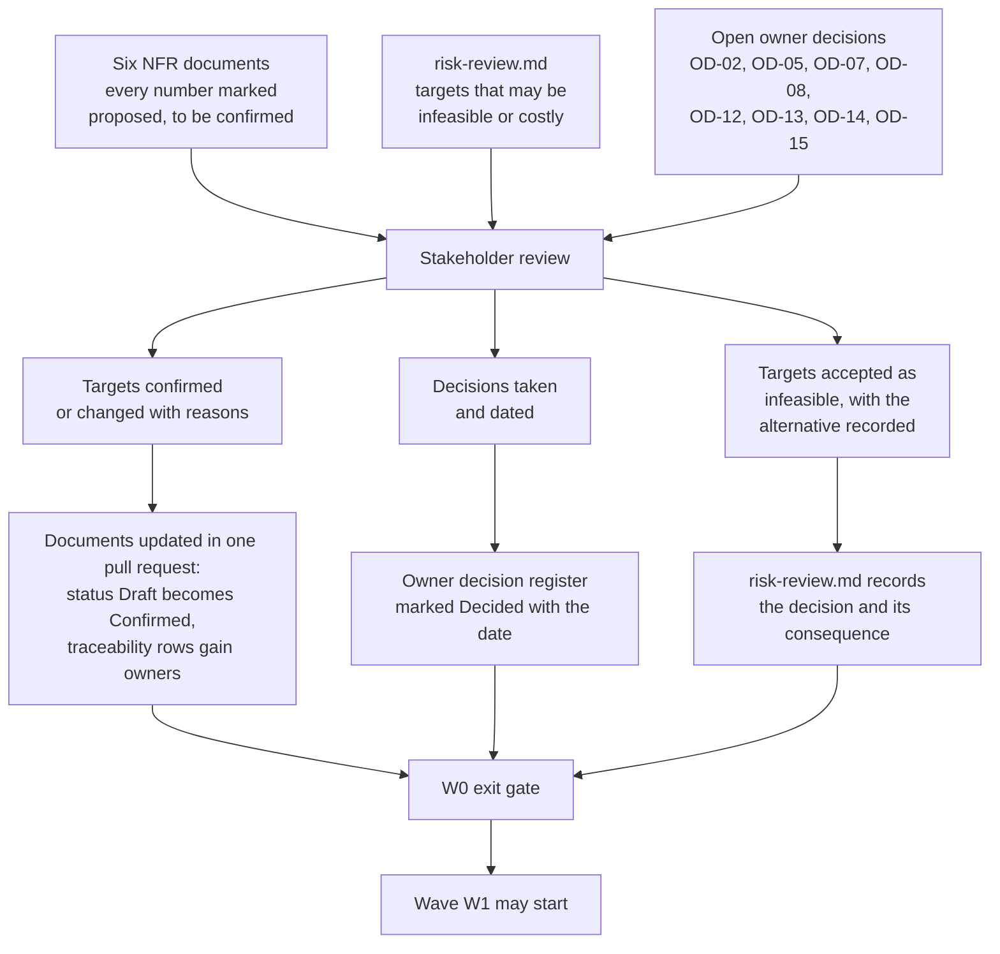

# Non-functional requirements — stakeholder review record

This is the record of the review at which the proposed non-functional targets for HyFib Tailor 360 stop being
proposals. Five perspectives must be satisfied — product, engineering, security, operations and the accountant —
and the accountant's confirmation is singled out because GST record retention, the classification of financial data
and the exports the practice needs are the three questions that no engineer can answer and that are expensive to
discover late. The document is written as a template: it carries the agenda, the questions each stakeholder must
answer, and the signature blocks, so that the review is conducted against it and completed in it. Read it with
[`../traceability.md`](../traceability.md) (the targets under review), [`../slo.md`](../slo.md),
[`../capacity-and-performance.md`](../capacity-and-performance.md),
[`../security-operations-targets.md`](../security-operations-targets.md),
[`../support-matrix.md`](../support-matrix.md), [`../data-classification.md`](../data-classification.md) and
[`../risk-review.md`](../risk-review.md).

> **Status: awaiting the workshop. The review has not been held.** Nothing in this document is a record of anything
> anyone has said. Every field marked _to be completed at the review_ is filled in the pull request that follows
> the meeting, together with the date.

---

## 1. Meeting details

| Field | Value |
| --- | --- |
| Purpose | Confirm, change or reject the proposed non-functional targets, and close the owner decisions that block wave W1 |
| Status | **Not yet held** |
| Date | _To be completed at the review_ |
| Time and duration | _To be completed at the review_ — 150 minutes is the proposed length, per the agenda in section 4 |
| Location | _To be completed at the review_ |
| Chaired by | Business owner |
| Recorded by | Technical reviewer |
| Document drafted | 2026-09-04, issue #19, wave W0 |
| Gate this review unlocks | The W0 exit gate, and with it the start of wave W1 — plan [Section 6.2](../../IMPLEMENTATION_PLAN.md) |

---

## 2. What this review decides

Three outcomes are legitimate for any target: **confirmed as proposed**, **changed to a different number with the
reason recorded**, or **rejected as infeasible**, in which case the alternative and its consequence go into
[`../risk-review.md`](../risk-review.md). What is not legitimate is leaving a number unaddressed: an unconfirmed
target that reaches wave W1 is carried as a documented risk with an owner, never as a silent assumption.

---

## 3. Attendance

| Perspective | Role at the review | Name | Present | Signed section |
| --- | --- | --- | --- | --- |
| Product | Business owner — the HyFib proprietor, who owns what the system promises | _To be completed_ | _To be completed_ | 5 |
| Engineering | Technical reviewer | _To be completed_ | _To be completed_ | 6 |
| Security | Security owner, or the Owner until #56a appoints one | _To be completed_ | _To be completed_ | 7 |
| Operations | Operations owner, per **OD-15** | _To be completed_ | _To be completed_ | 8 |
| Finance | The practice's accountant | _To be completed_ | _To be completed_ | 9 |
| Shop floor (advisory) | One representative each of Reception, Tailor Master, Inventory Clerk, Cashier and Delivery Staff, for the sections that affect their work | _To be completed_ | _To be completed_ | — |

The shop-floor representatives do not sign the targets; they attend section 4's items 3 and 6 so that the device,
accessibility and turnaround targets are challenged by the people who will live with them. Their comments are
recorded in section 11.

---

## 4. Agenda

| # | Item | Papers | Minutes |
| --- | --- | --- | --- |
| 1 | Purpose, the three legitimate outcomes, and how a target becomes binding | This document, sections 1 and 2 | 10 |
| 2 | **Hosting model (OD-02)**: the two candidate models, what each costs, what each promises for availability, recovery point and recovery time, and who operates it | [`../slo.md`](../slo.md) sections 2, 6 and 11 | 30 |
| 3 | **Device, browser and printer matrix (OD-07)**, with the shop-floor representatives | [`../support-matrix.md`](../support-matrix.md) | 15 |
| 4 | **Capacity**: the order, scan, image and storage figures, and the object-storage growth question | [`../capacity-and-performance.md`](../capacity-and-performance.md) sections 2 and 3 | 15 |
| 5 | **Security and operations targets**: patching, incident response, access reviews, and who is paged out of hours (**OD-15**) | [`../security-operations-targets.md`](../security-operations-targets.md) | 20 |
| 6 | **Accessibility and localisation**: the WCAG 2.2 AA commitment and the Tamil launch condition | [`../accessibility-localisation.md`](../accessibility-localisation.md) | 10 |
| 7 | **Retention and data classification (OD-08)**, including credentials, media, logs and audit | [`../data-classification.md`](../data-classification.md) | 15 |
| 8 | **The accountant's session**: GST record retention, financial-data classification, and export needs | Section 9 of this document | 25 |
| 9 | **Risk review**: the targets that may be infeasible or costly, and what to do about each | [`../risk-review.md`](../risk-review.md) | 20 |
| 10 | Decisions, actions, owners and dates | Sections 10 to 13 | 10 |

---

## 5. Product confirmation — the business owner

| # | Question | Answer | Effect if the answer changes the draft |
| --- | --- | --- | --- |
| 5.1 | Is the service window — the hours during which availability is measured — correct for the branches? | _To be completed_ | The availability objective and the on-call arrangement |
| 5.2 | Is availability of 99.5% within that window acceptable, given what the chosen hosting model can actually deliver? | _To be completed_ | **NFR-AV-01**, the hosting selection, the cost band |
| 5.3 | Is a recovery time of up to 4 hours acceptable on the worst day, and a recovery point of up to 15 minutes of lost work? | _To be completed_ | **NFR-BR-01**, **NFR-BR-02**, the backup design |
| 5.4 | Which journeys are priority zero — the ones a release may never ship broken? | _To be completed_ | **TRC-OD-02**, and the severity of gates RG-05 and RG-06 |
| 5.5 | Is the device, browser and printer matrix the one the branches will actually use, and are shop-issued devices being provided? | _To be completed_ | **OD-07**, the whole compatibility area |
| 5.6 | Are the order, garment, image and scan volumes right for the first year, and what growth should be provisioned for? | _To be completed_ | Capacity, storage cost, the hosting size |
| 5.7 | Is the Tamil launch condition — the interface ships in Tamil when its catalogue is at least 95% translated — acceptable, or must Tamil be present at go-live? | _To be completed_ | **NFR-LO-02**, translation effort and schedule |
| 5.8 | Who is accountable when a target is missed: who is told, and who decides whether to stop releasing? | _To be completed_ | The owner column of [`../traceability.md`](../traceability.md) |

**Product sign-off statement.** _I confirm that the targets recorded in section 12 are the promises HyFib Tailor 360
will make to its staff and its customers, and that the risks accepted in section 13 are risks the business accepts._

| Name | Signature | Date |
| --- | --- | --- |
| _To be completed_ | _To be completed_ | _To be completed_ |

---

## 6. Engineering confirmation — the technical reviewer

| # | Question | Answer | Effect |
| --- | --- | --- | --- |
| 6.1 | Is every target in [`../traceability.md`](../traceability.md) measurable from a signal the system will actually emit? | _To be completed_ | Any target that is not becomes evidence-only or is dropped |
| 6.2 | Are the latency targets achievable on the chosen hosting model, including from a branch that is not where the server is? | _To be completed_ | **NFR-LT-01** to **NFR-LT-03**, and **RR-04** |
| 6.3 | Is the 15-minute pull-request pipeline budget achievable with the test tiers the Definition of Done requires? | _To be completed_ | **NFR-MQ-03**, **RR-07**, and the split between per-pull-request and nightly runs |
| 6.4 | Is the per-project coverage floor agreed, and at what number? | _To be completed_ | **NFR-MQ-08**, **DOD-OD-02** |
| 6.5 | Are the release gates and their severities right, and can each be implemented by the issue that owns it? | _To be completed_ | [`../../process/release-gates.md`](../../process/release-gates.md) section 4 |
| 6.6 | Does any target require work that is not in the backlog? | _To be completed_ | New issues raised against the relevant epic |

**Engineering sign-off statement.** _I confirm that every target recorded in section 12 has a named proof, that the
proof is deliverable by the issue named against it, and that no target is stated that cannot be measured._

| Name | Signature | Date |
| --- | --- | --- |
| _To be completed_ | _To be completed_ | _To be completed_ |

---

## 7. Security confirmation — the security owner

| # | Question | Answer | Effect |
| --- | --- | --- | --- |
| 7.1 | Are the vulnerability remediation targets — critical within 7 days, high within 30, medium within 90 — achievable with the people available? | _To be completed_ | **NFR-SE-08**, **RR-14**, gate RG-08 |
| 7.2 | Is the classification of every data class correct, including password hashes, multi-factor secrets, recovery codes, session tickets, provider keys and backup keys? | _To be completed_ | [`../data-classification.md`](../data-classification.md) |
| 7.3 | Are the retention periods for logs, telemetry, media access logs, notification bodies and feedback free text acceptable? | _To be completed_ | **OD-08**, **NFR-PR-02** |
| 7.4 | Is the rule that no release ships with an unresolved critical or high finding accepted without exception? | _To be completed_ | The never-waivable list in [`../../process/waivers.md`](../../process/waivers.md) |
| 7.5 | Who holds the security owner role, and who deputises? | _To be completed_ | **RG-OD-02**, every RG-08 to RG-11 waiver |
| 7.6 | Is the session revocation target of 60 seconds at p99 the right trade-off against the per-request revalidation cost? | _To be completed_ | **NFR-SE-03**, **RR-05** |

**Security sign-off statement.** _I confirm that the security and privacy targets recorded in section 12 are
sufficient for the data this system holds, and that the accepted risks in section 13 are within appetite._

| Name | Signature | Date |
| --- | --- | --- |
| _To be completed_ | _To be completed_ | _To be completed_ |

---

## 8. Operations confirmation — the operations owner

| # | Question | Answer | Effect |
| --- | --- | --- | --- |
| 8.1 | Who receives a priority-one page outside business hours, through which channel, and who escalates? | _To be completed_ | **OD-15**, **NFR-OP-02**, the alert receivers of #58 |
| 8.2 | Is the weekly restore verification, monthly point-in-time-recovery exercise and quarterly disaster-recovery exercise cadence achievable, and is there an environment to run them in? | _To be completed_ | **NFR-BR-04** to **NFR-BR-06**, gate RG-13, **RR-12** |
| 8.3 | Is the 7-day restore-freshness requirement at release time achievable? | _To be completed_ | **RG-OD-03** |
| 8.4 | Who holds the backup encryption keys and the key-encryption key, and where are they escrowed? | _To be completed_ | **NFR-BR-07** |
| 8.5 | Is the telemetry backend decided, and who holds its credentials? | _To be completed_ | **OD-14**, whether every objective can be measured at all |
| 8.6 | Can a member of staff raise an incident through the same channel the alerts use? | _To be completed_ | **NFR-OP-07** |

**Operations sign-off statement.** _I confirm that the availability, backup, recovery and alerting targets recorded
in section 12 can be operated with the people, tools and environments that will exist at go-live._

| Name | Signature | Date |
| --- | --- | --- |
| _To be completed_ | _To be completed_ | _To be completed_ |

---

## 9. Accountant confirmation — GST retention, financial-data classification and exports

This section exists because three questions in it cannot be answered by anyone else, and each one changes the
system's design if it is answered late: how long GST records must be kept, how financial data is classified and
therefore protected, and what the practice needs to receive from the system and in what form.

### 9.1 GST record retention

| # | Question | Answer | Effect |
| --- | --- | --- | --- |
| 9.1.1 | For how long must invoices, credit and debit notes, receipts, payment records and the supporting tax calculation snapshots be retained, counted from which date? | _To be completed_ | **OD-05**; the retention policy of #57; the backup retention window; the audit partition retention |
| 9.1.2 | Do the underlying records — measurements, design snapshots, media — need to be retained for the same period where they evidence a taxable supply, or may they be deleted earlier? | _To be completed_ | **NFR-PR-02**; the media and measurement retention classes |
| 9.1.3 | Must the audit trail of who changed what be retained for the same statutory period as the records it evidences? | _To be completed_ | **NFR-AU-05**; the audit partition-detach schedule |
| 9.1.4 | Are there records that must be producible in a specific form on request — an inspection, an assessment, a query from the authority? | _To be completed_ | The export formats in 9.3; the restricted audit viewer of #57 |
| 9.1.5 | Does the retention period differ for any branch, or for any registration? | _To be completed_ | Whether retention policy is per branch or per organisation |

**The accountant confirms the statutory GST record retention period as:** _To be completed at the review_ —
recorded here, mirrored into [`../data-classification.md`](../data-classification.md) and marked **Decided** against
**OD-05** in [`../../prd/assumptions-and-open-decisions.md`](../../prd/assumptions-and-open-decisions.md).

### 9.2 Financial-data classification

| # | Question | Answer | Effect |
| --- | --- | --- | --- |
| 9.2.1 | Which financial data is confidential to the business rather than merely internal — margins, purchase prices, supplier terms, valuation? | _To be completed_ | The class, and therefore who may read it and whether it may be exported |
| 9.2.2 | Who may see the sales and payment totals of a branch other than their own? | _To be completed_ | The branch-scope rules of the reporting permissions |
| 9.2.3 | Which financial data may appear in a notification to a customer, and which may not? | _To be completed_ | The notification templates of #47 and the customer-link pages |
| 9.2.4 | Is any financial data subject to a confidentiality obligation that limits where it may be stored or backed up — for example outside India? | _To be completed_ | The hosting region under **OD-02**, and the backup destination |
| 9.2.5 | Card and bank details: the design stores no card credentials at all. Is that acceptable, and what payment reference is the practice content for the system to keep? | _To be completed_ | The payment record fields of #43 and the reconciliation of #55 |
| 9.2.6 | Who, by role, may export financial data at all — Cashier, Branch Manager, Owner, an Auditor role? | _To be completed_ | The `reports.export` grants in the permission matrix (**OD-13**) |

**The accountant confirms the classification of financial data as recorded in**
[`../data-classification.md`](../data-classification.md) **with the following changes:** _To be completed at the
review_.

### 9.3 Export needs

| # | Question | Answer | Effect |
| --- | --- | --- | --- |
| 9.3.1 | What must the practice receive, and how often — a sales register, a tax summary by rate, a payments and receipts listing, a debtors position, a stock valuation, purchase records? | _To be completed_ | The scheduled reports of #46 and the export jobs of #45 |
| 9.3.2 | In what format: the accounting package's own import format, a spreadsheet, a comma-separated file, a PDF, or more than one? | _To be completed_ | The accounting export adapter of #55 (**OD-03**) and the export formats of #45 |
| 9.3.3 | Which accounting package is the target, and which version of its import format? | _To be completed_ | **OD-03**; the adapter's contract tests |
| 9.3.4 | What identifiers must appear on every exported row so that a figure can be traced back to its source document? | _To be completed_ | The metric dictionary; the export column definitions |
| 9.3.5 | How should a cancelled invoice, a credit note and a refund appear in an export, so that the practice's books and the system agree? | _To be completed_ | The compensating-transaction model of #42; the reconciliation report of #46 |
| 9.3.6 | What is the financial-year cut-off treatment for an order taken in March and delivered in April? | _To be completed_ | The report cut-off rules, the document sequences, and the branch timezone handling |
| 9.3.7 | How is an export delivered — downloaded by a person, emailed on a schedule, or collected from a location — and who may receive it? | _To be completed_ | The export delivery and expiry rules; the `reports.export` permission |
| 9.3.8 | Are e-invoicing or e-way-bill obligations applicable to this business now, or foreseeably? | _To be completed_ | If applicable, this is new scope and a new issue, not a configuration change |

**The accountant confirms the export needs as recorded above, and confirms that the golden-master examples for GST
calculation, rounding and round-off will be supplied by:** _To be completed at the review_ — these examples become
the acceptance tests for **NFR-FI-02**.

**Accountant sign-off statement.** _I confirm the statutory retention period recorded in 9.1, the classification of
financial data recorded in 9.2, and the export needs recorded in 9.3, and I undertake to review the GST output of a
release candidate before go-live._

| Name | Practice | Signature | Date |
| --- | --- | --- | --- |
| _To be completed_ | _To be completed_ | _To be completed_ | _To be completed_ |

---

## 10. Owner decisions closed at this review

| Decision | Expected to close here | Decision taken | Date |
| --- | --- | --- | --- |
| **OD-02** hosting model and indicative monthly budget | Yes — blocks the W1 exit gate | _To be completed_ | _To be completed_ |
| **OD-05** valuation, rounding and GST record retention | The retention part, yes; valuation may follow | _To be completed_ | _To be completed_ |
| **OD-07** device, browser and printer matrix | Yes — blocks the W0 exit gate | _To be completed_ | _To be completed_ |
| **OD-08** retention periods | Yes — blocks the W1 exit gate | _To be completed_ | _To be completed_ |
| **OD-12** authentication strategy and devices | Yes | _To be completed_ | _To be completed_ |
| **OD-13** permission matrix | Direction here; approval with #24 | _To be completed_ | _To be completed_ |
| **OD-14** telemetry backend | Yes, if the hosting model is decided | _To be completed_ | _To be completed_ |
| **OD-15** operations ownership and alert channel | Yes | _To be completed_ | _To be completed_ |
| **TRC-OD-02** priority-zero journeys | Yes | _To be completed_ | _To be completed_ |
| **RG-OD-01** gate severities and waiver durations | Yes | _To be completed_ | _To be completed_ |

Any decision not closed here is re-dated in
[`../../prd/assumptions-and-open-decisions.md`](../../prd/assumptions-and-open-decisions.md) with the wave gate it
must close before, and the default in force meanwhile is restated.

---

## 11. Shop-floor comments

Recorded verbatim where they challenge a target, because the people at the counter and in the workshop are the ones
who discover that a target was written by someone who has never stood at a counter.

| Role | Comment | Target affected | Outcome |
| --- | --- | --- | --- |
| Reception | _To be completed_ | | |
| Tailor Master | _To be completed_ | | |
| Inventory Clerk | _To be completed_ | | |
| Cashier | _To be completed_ | | |
| Delivery Staff | _To be completed_ | | |

---

## 12. Targets confirmed or changed

Completed at the review, one row per target that changed. Targets confirmed unchanged are recorded as a list of
identifiers rather than one row each.

| NFR ID | Proposed | Confirmed value | Reason for the change | Owner |
| --- | --- | --- | --- | --- |
| _To be completed_ | | | | |

**Confirmed unchanged:** _To be completed at the review — the list of `NFR-…` identifiers accepted as drafted._

---

## 13. Risks accepted, and actions

| # | Risk accepted or action agreed | Owner | Due | Recorded in |
| --- | --- | --- | --- | --- |
| _To be completed_ | | | | |

Every accepted risk is copied into [`../risk-review.md`](../risk-review.md) with its decision, and any risk that
will reach a release without being resolved is expected to appear later in
[`../../process/waivers.md`](../../process/waivers.md).

---

## 14. What happens after the review

1. One pull request updates every affected document: the status line of each NFR document changes from **Draft —
   proposed** to **Confirmed**, with the review date; the numbers change where section 12 says so; the owner column
   of [`../traceability.md`](../traceability.md) is filled with names.
2. [`../../prd/assumptions-and-open-decisions.md`](../../prd/assumptions-and-open-decisions.md) marks each closed
   decision **Decided**, with the date and a link to this record.
3. [`../risk-review.md`](../risk-review.md) records the decision taken on every risk it raised.
4. [`../../process/release-gates.md`](../../process/release-gates.md) and
   [`../../process/waivers.md`](../../process/waivers.md) become binding, with the confirmed severities and
   durations.
5. The W0 exit gate is assessed against plan [Section 6.2](../../IMPLEMENTATION_PLAN.md); wave W1 starts only when
   it passes.

---

## 15. Open decisions recorded by this document

| ID | Question | Blocks | Owner | Status |
| --- | --- | --- | --- | --- |
| **SR-OD-01** | The date of the review | The W0 exit gate, and therefore the start of wave W1 | Business owner | **Open** — raised 2026-09-04; the review is on the critical path |
| **SR-OD-02** | Whether the accountant attends the whole review or only the session in section 9 | The agenda length and the scheduling | Business owner | **Proposed** — section 9 only, with the papers circulated in advance |
| **SR-OD-03** | Whether a separate signature is required from each branch, or whether the Owner signs for all branches | Section 5's sign-off and the branch working calendars under **OD-06** | Business owner | **Open** |
| **RG-OD-02** | Who holds the security owner role for section 7 | Whether section 7 can be signed at all at this review | Business owner | **Open** — needed before W2 |
| **OD-15** | Who holds the operations owner role for section 8 | Whether section 8 can be signed at all at this review | Business owner | **Open** — needed before W5, but the role is needed to sign here |

---

## 16. Related documents

| Document | Why it matters here |
| --- | --- |
| [`../traceability.md`](../traceability.md) | The targets under review, their proofs and their owners |
| [`../slo.md`](../slo.md) | Availability, latency, recovery and cost per hosting model — agenda item 2 |
| [`../capacity-and-performance.md`](../capacity-and-performance.md) | Capacity figures and client budgets — agenda item 4 |
| [`../support-matrix.md`](../support-matrix.md) | Devices, browsers, scanners and printers — agenda item 3 |
| [`../security-operations-targets.md`](../security-operations-targets.md) | Patching, incidents, rotation, access reviews — agenda item 5 |
| [`../data-classification.md`](../data-classification.md) | The classes the accountant confirms in section 9.2 |
| [`../accessibility-localisation.md`](../accessibility-localisation.md) | WCAG commitment and launch languages — agenda item 6 |
| [`../risk-review.md`](../risk-review.md) | The infeasibility challenge — agenda item 9 |
| [`../../process/release-gates.md`](../../process/release-gates.md) | The gates and severities confirmed here |
| [`../../process/waivers.md`](../../process/waivers.md) | Where an unmet target is recorded once releases begin |
| [`../../prd/assumptions-and-open-decisions.md`](../../prd/assumptions-and-open-decisions.md) | The owner decision register updated after the review |
| [`../../IMPLEMENTATION_PLAN.md`](../../IMPLEMENTATION_PLAN.md) | Section 6.2 wave gates and Section 11 owner decisions |
