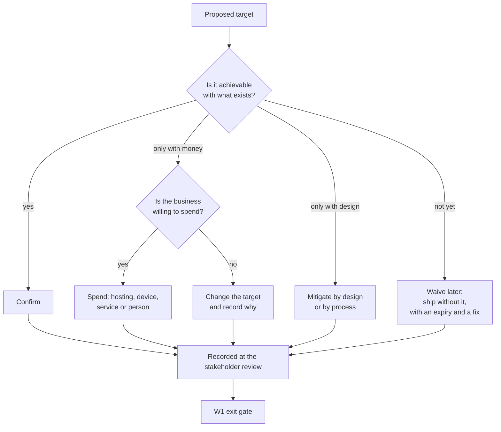

# Risk review — the targets that may prove infeasible or too costly

Every number in the non-functional documents of HyFib Tailor 360 is currently a proposal. This document is the
deliberate attempt to break those proposals before anything is built against them: it lists the targets that are
most likely to be unachievable, unaffordable, or achievable only by spending money or effort the business has not
agreed to spend, and for each one states the impact, the likelihood, the mitigation or the waiver that would be
proposed instead, and the decision that must be taken before wave W1 completes. Read it with
[`traceability.md`](traceability.md) (the targets themselves and their proofs), [`slo.md`](slo.md) (the hosting
models and their cost bands), [`capacity-and-performance.md`](capacity-and-performance.md),
[`security-operations-targets.md`](security-operations-targets.md),
[`reviews/stakeholder-review.md`](reviews/stakeholder-review.md) (where these decisions are taken) and
[`../process/waivers.md`](../process/waivers.md) (where an unresolved one ends up once releases begin).

---

## 1. Status and scope

| Field | Value |
| --- | --- |
| Status | **Draft — the challenge, not the answers.** Every decision column is open until the stakeholder review is held |
| Drafted | 2026-09-04, issue #19, wave W0 |
| Owner of the document | Technical reviewer, with the Owner as approver |
| Completed by | Plan Section 6.2 requires this review to be completed **before wave W1 completes**; the plan's own wording for issue #19 is that the risk review is "completed before W1" |
| Scope | Only targets whose feasibility or cost is genuinely in doubt. A target that is merely hard to build is a work item, not a risk |
| Review cadence | At the stakeholder review, then at every wave exit gate until each row is closed |

---

## 2. How to read the tables

### 2.1 Impact

| Level | Meaning |
| --- | --- |
| **High** | The business feels it directly: lost work, lost money, a garment that cannot be found, a customer who cannot be served, or a legal exposure |
| **Medium** | Staff feel it as friction, or the project feels it as rework or delay |
| **Low** | Noticeable but absorbable |

### 2.2 Likelihood

| Level | Meaning |
| --- | --- |
| **High** | On current evidence, expected to happen unless something changes |
| **Medium** | Plausible; depends on a decision or a measurement not yet taken |
| **Low** | Possible; listed because the consequence is large |

### 2.3 The five responses

| Response | What it means |
| --- | --- |
| **Confirm** | The target stands; the concern was unfounded once examined |
| **Change the target** | The number moves, with the reason recorded. This is not failure; it is the point of the review |
| **Spend** | The target stands and the business pays for what makes it achievable — a second machine, a managed service, a person, a device |
| **Mitigate** | The target stands and is made achievable by design or process rather than by money |
| **Waive later** | The target stands but the first releases will not meet it, so a waiver in [`../process/waivers.md`](../process/waivers.md) is expected, with an expiry |

---

## 3. Availability, recovery and hosting

| ID | Target at risk | Why it may be infeasible or costly | Impact | Likelihood | Mitigation or proposed waiver | Decision needed before W1 completes | Owner |
| --- | --- | --- | --- | --- | --- | --- | --- |
| **RR-01** | **NFR-AV-01** availability 99.5% monthly | On a single machine running everything — proxy, web, worker, database, object storage, malware scanner, collector — there is no redundancy at any layer. One failed disk, one power cut at the head branch, or one broadband outage takes the whole system out for every branch. 99.5% monthly allows about 3.6 hours of downtime in a 30-day month, which a single hardware fault can exceed on its own | High | High if the on-premises model is chosen; Medium for a rented machine; Low for managed services | **Change the target** for the single-machine model — propose availability measured within the service window only, with a lower figure and an explicit statement that a hardware failure is a multi-hour outage. Or **spend**: choose managed services, which move the failure domains apart | Which hosting model, and therefore which availability figure is binding (**OD-02**) | Business owner |
| **RR-02** | **NFR-BR-02** recovery time objective of 4 hours | Recovery time depends on a person being available to perform it. With one operator, no formal out-of-hours cover and no deputy, a failure at 21:00 is realistically recovered the following morning, not within four hours | High | High until an out-of-hours arrangement exists | **Mitigate**: state the objective within the service window and state the out-of-hours reality honestly, or **spend** on a second trained operator or a support arrangement | Who operates the system out of hours, and whether a 4-hour objective applies at night (**OD-15**) | Business owner |
| **RR-03** | **NFR-BR-01** recovery point objective of 15 minutes | Continuous write-ahead-log archiving to an off-site bucket depends on the shop's broadband uplink. When the uplink is down, archiving stalls while work continues, and the recovery point silently degrades to the age of the last successful archive | High | Medium | **Mitigate**: alert on archive lag as a first-class signal, so a stalled archive is visible within minutes rather than discovered at restore; state the objective as conditional on connectivity. **Spend** if a second uplink is wanted | Whether an archive-lag alert and its escalation are accepted as the control, and who acts on it | Operations owner, with the Business owner |
| **RR-04** | **NFR-LT-03** scan round trip under 1 second at p95 on 4G | If the server sits at the head branch, every scan from another branch crosses the head branch's uplink twice. The target is achievable on a local network and optimistic across a domestic broadband connection at peak time | Medium — it is felt on every garment handoff | Medium | **Mitigate**: keep the scan endpoint minimal and measure it separately from other commands; **change the target** for cross-branch scans specifically; or **spend** on a hosted model where every branch reaches the server over its own uplink | Whether the target is stated per branch topology, and what the cross-branch figure is (**OD-02**) | Technical reviewer |
| **RR-19** | **NFR-AV-06** interruption during deployment | The Compose baseline has no rolling update, so a web container swap costs a few seconds of failed requests on every release. If releases are frequent and the availability objective is tight, these add up | Low | High — it is a property of the design, not a possibility | **Confirm** and state it: the interruption is accepted, minimised by waiting for health and proxy retries, and eliminated only if Kubernetes is adopted. Releases are scheduled outside the service window | Whether releases outside the service window are acceptable to the branches | Business owner |

**On RR-01.** The most common way a project of this kind misleads itself is to write "99.5%" because it looks
modest, without noticing that the figure is not a property of the software at all. On one machine, availability is
a property of that machine's disk, power and network. The honest response is not to write a smaller number in the
same place, but to state availability twice: what the software will do, and what the machine it runs on can do.

---

## 4. Performance and capacity

| ID | Target at risk | Why it may be infeasible or costly | Impact | Likelihood | Mitigation or proposed waiver | Decision needed before W1 completes | Owner |
| --- | --- | --- | --- | --- | --- | --- | --- |
| **RR-05** | **NFR-SE-03** session revocation within 60 seconds at p99 | Revocation this fast means checking a revocation signal on effectively every request. With one web host it is a cached lookup; with more than one it needs a shared cache or a per-request database read, which costs latency on every request to protect against a rare event | Medium | Medium | **Mitigate**: keep one web replica for the first release, where the local cache is authoritative and the target is met cheaply; introduce a shared cache only when a second replica appears, and re-measure then | Whether a single web replica at launch is accepted, and the propagation bound when that changes | Technical reviewer |
| **RR-06** | **NFR-CP-03** object-storage growth within the provisioned volume | The baseline sizing states about 22 GB of originals a year, but its own multiplicands — branches, orders, garments, images, image size — produce an order of magnitude more. Until the arithmetic is reconciled, the storage line of any hosting quotation is unreliable, and so is the backup window | High — it is a direct monthly cost and it compounds | High — the discrepancy is already identified in [`capacity-and-performance.md`](capacity-and-performance.md) as **CP-05** | **Change the target**: fix the real figure by choosing among fewer retained images per order, a smaller re-encode target, or a shorter image retention period. Then re-price | Which of the three levers is pulled, and the resulting figure (**CP-05**, feeding **OD-02**) | Business owner, with the technical reviewer |
| **RR-09** | **NFR-CL-03** memory budget on the lowest supported device | The scan and capture screens hold a live camera stream, a decoder and image buffers at once. On an entry-level Android device with limited memory this is exactly the workload that triggers a tab reload, which is felt as "the scanner keeps restarting" | Medium — it lands on the busiest screens in the shop | Medium, and High if very low-end devices are in use | **Mitigate**: lazy-load the scanner and camera bundles, release camera streams on navigation, cap decode resolution, and prefer the keyboard-wedge scanner at the counter. **Spend** if the reference device must be raised | The reference device, and whether shop-issued devices are provided (**OD-07**) | Business owner, with the technical reviewer |
| **RR-10** | **NFR-CB-02** barcode decoding across the browser matrix | The native detector is not available everywhere, so on some devices decoding runs in JavaScript or WebAssembly, which is slower and warmer, and struggles in poor light on a worn label | Medium | Medium | **Mitigate**: the design already forbids depending solely on the native detector; make the keyboard-wedge scanner the primary source at fixed stations and the camera the fallback, and always offer audited manual entry | Which stations get a hardware scanner (**OD-07**) | Business owner |
| **RR-07** | **NFR-MQ-03** pull-request pipeline within 15 minutes | The Definition of Done requires unit, architecture, contract and integration tiers with a real database and object store, plus browser journeys for touched flows. Starting containers and browsers alone consumes several minutes before a single assertion runs | Medium — a slow pipeline is paid on every pull request, and eventually gets bypassed | High as the suite grows | **Mitigate**: the plan's split — Chromium and touched journeys per pull request, the full browser and device matrix nightly; a shared container per run with a template database cloned per test class; an issue raised automatically when the budget is exceeded twice in a week | Confirm the split and the budget, and what happens when it is exceeded | Technical reviewer |

---

## 5. Cost

| ID | Target at risk | Why it may be costly | Impact | Likelihood | Mitigation or proposed waiver | Decision needed before W1 completes | Owner |
| --- | --- | --- | --- | --- | --- | --- | --- |
| **RR-12** | **NFR-BR-04** weekly restore verification | A restore must run somewhere that is neither production nor a shared runner. That means a standing staging machine, or a machine created and destroyed for each exercise. Either is a recurring cost, and the throwaway option needs the provisioning automation to be reliable before it can be trusted weekly | Medium — the cost is modest; the consequence of dropping the exercise is not | Medium | **Spend**: keep the staging machine, which is needed anyway for real-device testing and later as the training environment. Or **mitigate**: create a throwaway machine per exercise once the provisioning automation is proven | Whether a standing staging environment is funded (**OD-02** budget line) | Business owner |
| **RR-13** | Baseline machine sizing with the malware scanner resident | The malware scanner alone wants 1.5 to 2 GB of resident memory, alongside PostgreSQL, the object store, two application hosts, a proxy and a collector. On the baseline machine this is tight, and a self-hosted observability stack does not fit at all | Medium | Medium | **Mitigate**: keep the collector-only observability default and treat the self-hosted stack as a development and air-gapped profile; feature-flag the scanner so it can be disabled with the risk recorded. **Spend** on more memory if scanning must always be on | The memory line of the hosting quotation, and whether malware scanning is on from day one (**OD-02**, **OD-14**) | Business owner |
| **RR-20** | Self-hosted observability on the application machine | Running the metrics, logs and traces stack next to the application competes for the memory and disk the application needs, and its failure mode — filling the disk — takes the application with it | Medium | Medium if self-hosting is chosen | **Mitigate**: the collector-only default with a hosted backend, container log caps, and an external dead-man's switch that does not depend on the machine being healthy | The telemetry backend (**OD-14**) | Business owner |
| **RR-16** | **NFR-LO-02** Tamil interface at launch | A Tamil interface is not a translation of strings alone: it needs the measurement and phase vocabulary agreed with the Tailor Master, a font that renders correctly in the application and in printed documents, and a review by someone who reads Tamil. That is effort with a cost and a lead time | Medium — it affects adoption by the staff who use the system most | Medium | **Mitigate**: ship English first with the Tamil catalogue at 95% as the release condition, keep the glossary from the workflow work as the source, and ship the Tamil-capable font from the start so documents are not blocked later. Or **spend** on translation to make Tamil available at go-live | Whether Tamil is required at go-live or may follow | Business owner |

---

## 6. Security, compliance and operations

| ID | Target at risk | Why it may be infeasible or costly | Impact | Likelihood | Mitigation or proposed waiver | Decision needed before W1 completes | Owner |
| --- | --- | --- | --- | --- | --- | --- | --- |
| **RR-14** | **NFR-SE-08** critical vulnerabilities fixed within 7 days | A seven-day clock runs during holidays, festivals and absences. With one maintainer and no deputy, a critical advisory published on a Friday before a festival week will breach it | High — it is a stated release criterion, and a breach blocks releases | High without a deputy | **Mitigate**: automate the weekly base-image and lock-file rebuild so most advisories are absorbed without human action; define an expedited patch path; name a deputy. Or **change the target** to a stated working-day count with an explicit exception process | Who deputises for patching, and whether the clock is calendar days or working days | Business owner, with the security owner |
| **RR-15** | **NFR-AU-03** hourly audit-chain verification and external anchoring | Verifying a growing hash chain hourly costs input and output on the same machine that serves the counter, and anchoring the chain head off-site adds a scheduled outbound call that must not fail silently | Low to Medium | Medium as the chain grows | **Mitigate**: verify incrementally from the last verified sequence rather than from the beginning, run it in the worker under a bulkhead, and alert on verification age rather than on each run | Confirm the hourly cadence, or agree a longer one with the security owner | Security owner |
| **RR-17** | **NFR-FI-02** GST correctness against the accountant's examples | The golden-master examples do not exist yet, and the billing work cannot be accepted without them. If they arrive late, either billing is built against assumptions and reworked, or the wave slips | High — it is the part of the system the business is most exposed on | Medium | **Mitigate**: obtain the examples at the stakeholder review as a deliverable with a date, and build the pricing and tax engine behind a configuration version so that a change to the rules is data, not code | When the accountant supplies the examples (**OD-05**) | Business owner, with the accountant |
| **RR-18** | **NFR-CU-06**, **NFR-CB-04** physical label, scanner and printer evidence | Nothing about printing on thermal stock, scanning a worn label under workshop lighting, or a keyboard-wedge scanner's terminator behaviour can be tested in continuous integration. The evidence needs hardware, a place to keep it and a person to run the rehearsal | Medium — discovering a label that will not scan after go-live is expensive | High — it is certain that some of it can only be found on real hardware | **Mitigate**: hardware available from wave W3, a printed training label sheet kept as a fixture, and physical rehearsals scheduled into the issues that need them rather than left to the end. **Spend** on the label printer and scanners early | Which printer and scanner models, and when they are available (**OD-07**, **OD-09**) | Business owner |
| **RR-21** | **NFR-AC-01** WCAG 2.2 AA across the whole staff application | The demanding surfaces are exactly the ones this system needs most: a live camera preview, a scanner that must not steal focus from a typing member of staff, dense queue tables on a phone, and bottom navigation that must never obscure the focused control. Meeting the standard there is real work, and the manual screen-reader part cannot be automated away | Medium to High — it decides who can work here | Medium | **Mitigate**: build the accessible primitives once in the design system, with the overflow and obscured-focus helper running from wave W1 so regressions are caught immediately rather than audited at the end; keep the manual checklist per journey | Confirm WCAG 2.2 AA as a binding release criterion rather than an aspiration | Business owner |
| **RR-22** | **NFR-OP-02** every alert has a tested delivery path and an owner | Alerts are only worth building if someone receives them. Until the operations owner and the channel are named, the alerting work of the hardening wave has no destination, and the risk is that alerts are built, fire into an empty room, and are then muted | High — a muted alert is worse than no alert, because it looks like coverage | High until **OD-15** is answered | **Mitigate**: build the external dead-man's switch and the uptime check first, since they need only an address; treat the named receiver as a prerequisite for the rest of the alerting work | Who receives priority-one alerts, through which channel (**OD-15**) | Business owner |

---

## 7. Decisions needed before wave W1 completes

| # | Decision | Risks it resolves | Owner | Where it is taken |
| --- | --- | --- | --- | --- |
| 1 | **OD-02** hosting model and indicative monthly budget | RR-01, RR-03, RR-04, RR-06, RR-12, RR-13 | Business owner | [`reviews/stakeholder-review.md`](reviews/stakeholder-review.md) agenda item 2 |
| 2 | The object-storage growth figure, and which lever fixes it (**CP-05**) | RR-06 | Business owner, with the technical reviewer | Agenda item 4 |
| 3 | **OD-07** device, browser and printer matrix, including which stations get a hardware scanner | RR-09, RR-10, RR-18 | Business owner | Agenda item 3 |
| 4 | **OD-15** operations ownership, alert channel and out-of-hours arrangement | RR-02, RR-14, RR-22 | Business owner | Agenda item 5 |
| 5 | **OD-05** GST record retention, and the date the accountant's golden-master examples arrive | RR-17 | Business owner, with the accountant | Agenda item 8 |
| 6 | Whether the availability, recovery-time and scan-latency targets are restated per hosting model and per branch topology | RR-01, RR-02, RR-04 | Business owner | Agenda item 2 |
| 7 | Whether Tamil is required at go-live | RR-16 | Business owner | Agenda item 6 |
| 8 | Confirm WCAG 2.2 AA as binding | RR-21 | Business owner | Agenda item 6 |
| 9 | The pipeline budget split and what happens when it is exceeded | RR-07 | Technical reviewer | Agenda item 9 |
| 10 | **OD-14** telemetry backend | RR-13, RR-20 | Business owner | Agenda item 5 |

A decision not taken by the end of wave W1 does not disappear: it becomes a documented risk carried into the wave
that needs it, with the default in force restated in
[`../prd/assumptions-and-open-decisions.md`](../prd/assumptions-and-open-decisions.md), and it is reported at every
wave exit gate until it is closed.

---

## 8. Risks most likely to become waivers

If nothing changes, these are the rows that will produce the first entries in
[`../process/waivers.md`](../process/waivers.md). Naming them now is cheaper than discovering them at a release.

| Risk | Gate it will fail | Expected waiver owner | Note |
| --- | --- | --- | --- |
| RR-21 accessibility on the scanner and camera screens | RG-06 | Owner | A serious violation with a documented workaround is waivable for 30 days; a barrier on a priority-zero journey is not waivable at all |
| RR-09 memory on the lowest supported device | RG-07 | Technical reviewer | Likely to appear as a performance-budget breach on the scan screen |
| RR-14 critical patch within 7 days | RG-08 | Not waivable | Critical and high findings cannot be waived; this one becomes a release block, which is why the deputy decision matters |
| RR-12 restore freshness at release time | RG-13 | Operations owner, staging only | Not waivable for a production release |
| RR-07 pipeline budget | None — it is a monitored target | Technical reviewer | Reported at the release train rather than gated |

---

## 9. Open decisions recorded by this document

Raised 2026-09-04 by issue #19; mirrored in
[`../prd/assumptions-and-open-decisions.md`](../prd/assumptions-and-open-decisions.md) and referenced against plan
[Section 11](../IMPLEMENTATION_PLAN.md).

| ID | Question | Blocks | Owner | Status |
| --- | --- | --- | --- | --- |
| **RR-OD-01** | Whether availability and recovery targets are stated once for the whole system or separately for the software and for the machine it runs on | How **NFR-AV-01** and **NFR-BR-02** are worded, and what an outage report is measured against | Business owner, with the technical reviewer | **Open** — needed before the W1 exit gate |
| **RR-OD-02** | Whether the vulnerability clocks run in calendar days or working days, and what the expedited path is | **NFR-SE-08** and gate RG-08 | Business owner, with the security owner | **Open** — needed before W2 |
| **RR-OD-03** | Whether one web replica at launch is accepted, so the session-revocation target is met by a local cache | **NFR-SE-03**, and whether a shared cache is needed at all in the first release | Technical reviewer | **Proposed** — one replica stands until a second is needed |
| **RR-OD-04** | Whether malware scanning is enabled from day one, given its memory cost on the baseline machine | **NFR-SE-11** and the machine sizing | Business owner, with the security owner | **Open** — needed before W2 |
| **OD-02**, **OD-05**, **OD-07**, **OD-14**, **OD-15** (plan Section 11) | See section 7 | The majority of the rows above | Business owner | **Open** |

---

## 10. Related documents

| Document | Why it matters here |
| --- | --- |
| [`traceability.md`](traceability.md) | The `NFR-…` identifiers every row here challenges |
| [`slo.md`](slo.md) | The hosting models, their promises and their cost bands |
| [`capacity-and-performance.md`](capacity-and-performance.md) | The capacity figures and the storage-growth discrepancy behind RR-06 |
| [`support-matrix.md`](support-matrix.md) | The devices, scanners and printers behind RR-09, RR-10 and RR-18 |
| [`security-operations-targets.md`](security-operations-targets.md) | The patching, incident and rotation targets behind RR-14 and RR-22 |
| [`accessibility-localisation.md`](accessibility-localisation.md) | The commitment behind RR-21 and the launch languages behind RR-16 |
| [`reviews/stakeholder-review.md`](reviews/stakeholder-review.md) | Where every decision in section 7 is taken |
| [`../process/release-gates.md`](../process/release-gates.md) | The gates the section 8 rows will fail |
| [`../process/waivers.md`](../process/waivers.md) | Where an unresolved risk is recorded once releases begin |
| [`../prd/assumptions-and-open-decisions.md`](../prd/assumptions-and-open-decisions.md) | The owner decision register these risks depend on |
| [`../IMPLEMENTATION_PLAN.md`](../IMPLEMENTATION_PLAN.md) | Section 10 risks, Section 11 decisions, and the #19 blueprint requiring this review before wave W1 completes |
