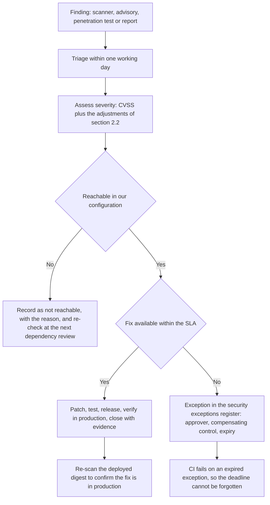
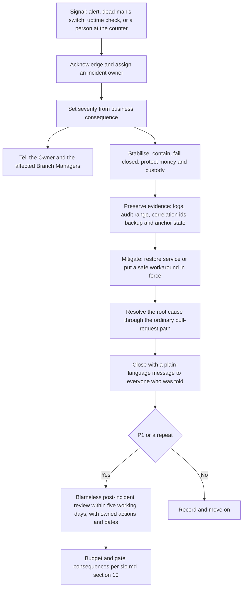

# Security and operations targets

This document fixes the operational side of security for HyFib Tailor 360: how quickly a vulnerability must be
fixed, how often dependencies are updated and secrets rotated, what counts as a priority-one incident and how fast
it must be detected, acknowledged, mitigated and communicated, how often access is reviewed, how long logs and audit
records are kept, and — the part that decides whether any of the rest is real — the support arrangement a
tailoring business with a handful of branches can actually staff. It is the operational counterpart to
[`slo.md`](slo.md), which states the availability, latency and recovery objectives per hosting model. Targets are
enforced as gates, not as good intentions: the vulnerability SLAs become a release gate in #59, the exception expiry
check fails continuous integration in #56a, and each incident target is measured from the alerting of #58. Every
number here is **proposed, to be confirmed** at the stakeholder review in
[`reviews/stakeholder-review.md`](reviews/stakeholder-review.md), except where it reproduces a target the plan has
already proposed.

---

## 1. Status and scope

| Field | Value |
| --- | --- |
| Status | **Draft — proposed targets**; binding after the stakeholder review of issue #19 |
| Owner of the document | Technical reviewer, with the Owner as approver and the operations owner as co-signer |
| Drafted | 2026-09-04 (issue #19, wave W0) |
| Depends on | **OD-08** retention periods, **OD-13** permission matrix, **OD-14** telemetry backend, **OD-15** operations ownership and alert channel — see [`../prd/assumptions-and-open-decisions.md`](../prd/assumptions-and-open-decisions.md) |
| Expanded by | #56a vulnerability management and exceptions, #57 privacy, audit, encryption and secrets, #58 observability and incident response, #59 patch management and release gates, #60 backups and disaster recovery |
| Review cadence | Quarterly, and immediately after any priority-one incident |

**In scope**: application dependencies, container images, the host operating system, the staff-facing client, the
provider adapters of #55, secrets and keys, staff accounts and permissions, logs, audit records and the support
arrangement.

**Out of scope**: the customers' own devices and messaging apps; the security posture of the SMS, WhatsApp, payment
and accounting providers beyond the contract tests and support-ownership document required before any adapter is
enabled (plan D20); and legal obligations under India's data-protection law, which need advice — see section 8.4.

---

## 2. Vulnerability remediation service levels

### 2.1 The clocks

| Severity | Remediate within | Clock starts | Clock stops |
| --- | --- | --- | --- |
| **Critical** | **7 calendar days** | When the finding first appears in a scanner run, a penetration-test report, a provider advisory or a credible external report | When the fix is **deployed to production** and verified — not when the pull request merges |
| **High** | **30 calendar days** | Same | Same |
| **Medium** | **90 calendar days** | Same | Same |
| **Low** | **The next scheduled release** | Same | Same |

The critical, high and medium figures are the plan's proposed targets (plan Section 8, issue #56a); the low row is
introduced here. Calendar days, not working days — an attacker does not observe Pongal.

### 2.2 How severity is decided

Severity is **not** the scanner's number taken at face value. It starts from the CVSS base score and is then
adjusted for how this system actually deploys the affected component:

| Adjustment | Effect | Example |
| --- | --- | --- |
| The component is reachable from an unauthenticated surface | Raise one level | A parser used on the customer-link pages under `/c/**` |
| The component handles money, custody, audit or authentication | Raise one level | Anything in the pricing engine, the dispatch gate, the audit chain or the session path |
| The component is not reachable in our configuration | Lower one level, and record why | A vulnerable code path in a library feature the code never calls |
| A working exploit is public | Raise to at least high; raise to critical if the surface is unauthenticated | |
| The fix is only available in a major version with breaking changes | Severity is unchanged; the **plan** changes — an exception with an expiry and a compensating control | |

Every adjustment is written down with the finding. An undocumented downgrade is treated as a missed SLA.

### 2.3 Triage flow

The register itself is `../security/vulnerability-management.md` and `../security/exceptions.md`, both delivered
by issue #56a. An exception is always time-boxed, always names a compensating control, and is approved by the Owner
for critical and high findings and by the technical reviewer below that.

### 2.4 What is scanned, and how often

| Surface | Tool | Cadence |
| --- | --- | --- |
| Application dependencies (NuGet, npm) | Dependency review with a licence allowlist; advisory feeds | Every pull request, plus a nightly re-scan of `main` |
| Source code | CodeQL | Every pull request and weekly on `main` |
| Secrets in the repository | gitleaks over the whole history, configured by [`../../.gitleaks.toml`](../../.gitleaks.toml) | Every pull request |
| Container images, including third-party ones | Trivy | At build, plus a **weekly re-scan of the digests actually deployed** — a scan at build time says nothing about a vulnerability published afterwards |
| Infrastructure as code | Trivy | Every pull request that touches `infra/` |
| Host operating system | Provider or distribution advisories, unattended security updates | Weekly patch window |
| The running system | Independent penetration test | Before production, and after any material change to authentication, payments or uploads (#56b) |

**A finding that is wrong, and a finding that is right but carried, are different things.** CodeQL's
findings gate the build at high severity and above. One that is a false positive is read, and recorded in
[`../../.github/sarif-accepted.json`](../../.github/sarif-accepted.json) with the sentence that says why
it is not a defect — matched on the rule, the file and a fragment of the message, never on a line number
and never on the file alone, so a different finding of the same rule in the same file still fails. An
accepted finding is still printed in the job summary with its reason beside it: the register removes the
build failure, not the visibility. An entry that matches nothing also fails the build, because a register
that has quietly stopped matching is one that is accepting something nobody read — and each entry names
the scan it belongs to, so that rule stays usable across the CodeQL matrix rather than failing whichever
language the entry does not describe. A finding that is
genuinely right and is being shipped anyway is not this; that is a waiver, with an owner and an expiry,
in [`../process/waivers.md`](../process/waivers.md).

The secret scan's configuration allowlists **exact literal values**, never files and never rules: the
documented example payloads and the integration-test account password, each with the sentence that says
why it authenticates nothing. A path allowlist would say "never look in this file again", and every file
concerned is one this repository writes examples into. The consequence is deliberate — changing one of
those fixtures fails the scan until somebody updates the configuration, which is the moment at which
"somebody changed an example" and "somebody pasted a real token into an example" stop looking identical.

---

## 3. Dependency update cadence

Patching is a rhythm, not a reaction. The rhythm below exists so that the SLAs in section 2 are almost always met by
the ordinary schedule, and an emergency patch is genuinely rare.

| Class | Cadence | Mechanism | Notes |
| --- | --- | --- | --- |
| Application dependencies, patch and minor | **Weekly**, grouped | Automated dependency pull requests, merged when the pipeline is green | Grouped by ecosystem so a single review covers many bumps |
| Application dependencies, major | **Quarterly review**, scheduled deliberately | A planned pull request with its own testing | Never bundled with a feature |
| Base images and third-party images (PostgreSQL, MinIO, ClamAV, the reverse proxy, the collector) | **Weekly rebuild**, pinned to exact patch releases | The scheduled rebuild of #59, followed by a Trivy re-scan | Floating major tags are forbidden by [`../architecture/deployment.md`](../architecture/deployment.md) |
| Host operating system | **Weekly patch window**, outside the service window | Unattended security updates plus a reviewed reboot | Under a managed model, the provider's maintenance windows are recorded and announced |
| Malware signatures | Continuous | `freshclam` inside the scanner container | Failure to refresh is a **Degraded** health signal and an alert |
| Provider SDKs (#55) | With the quarterly major review, or immediately on a provider advisory | Contract tests must pass before the adapter is re-enabled | |
| Runtime and database major versions | **Annual runway review** | .NET 10 LTS and PostgreSQL 16 support end in November 2028, so the moves are planned for 2028 (plan #59) | A component inside twelve months of end of support is a `release-blocker` |
| The staff client (PWA) | Every release | `minimumClient` raised only in the release **after** the change that requires it; an outdated client receives `426` | Keeps a cached client from breaking on the day of a deployment |

**Emergency path.** A critical finding on an internet-reachable surface skips the rhythm: patch, test, deploy, and
verify the deployed digest, inside the seven-day clock and normally inside one working day. The expedited path is
the same pull-request-and-review path — a security emergency is never a reason to push to `main` directly.

---

## 4. Secret and key rotation cadence

Secret classes follow #57: **(a)** verify-only secrets are stored as salted hashes and are never rotated as such,
only reissued; **(b)** reversible secrets are encrypted under the Data Protection ring; **(c)** infrastructure
secrets arrive as files from the environment or secret manager, never from the repository.

| Secret or key | Class | Rotation cadence | Rotate immediately when | Notes |
| --- | --- | --- | --- | --- |
| Data Protection key-encryption key and key ring | b | **90 days** | Suspected compromise | The plan's figure (plan Section 4.4); the ring lives in `platform.data_protection_keys`, protected by a certificate or KMS key, and startup fails if it is on the local file system outside development |
| Staff passwords | a | No forced expiry | Compromise, or a failed access review | Forced rotation trains people to pick worse passwords; strength and MFA carry the load |
| Recovery codes | a | Regenerated whenever one is used, and on MFA reset | Compromise | |
| TOTP seeds and passkeys | b / a | On device change or loss | Compromise, staff departure | |
| Session tickets | b | Rotated automatically on login, MFA, step-up, password change, MFA reset and role change | Any suspicion — logout-all is one action and takes effect within 60 s at p99 ([`slo.md`](slo.md)) | |
| Webhook signing secrets | b | **180 days**, with an overlap window so subscribers can roll | Compromise, or a subscriber leaving | **Proposed, to be confirmed** |
| Provider credentials — SMS, WhatsApp, email, payment gateway, accounting | b | **180 days** | Compromise, or the vendor changing (OD-03) | **Proposed, to be confirmed** |
| Database role passwords (`t360_app`, `t360_reporting`, `t360_retention`, `t360_migrator`, `t360_backup`) | c | **180 days**, and on any change of operator | Operator departure, compromise | **Proposed, to be confirmed** |
| Object-storage access keys, per module prefix | c | **180 days** | Operator departure, compromise | **Proposed, to be confirmed** |
| Backup repository cipher passphrase | c | **12 months**, with the old passphrase retained until every backup encrypted under it has expired | Compromise, operator departure | Escrowed in the owner's password manager or KMS, **never only on the VM**, never inside the backup set it protects |
| Backup bucket archiver credential | c | **180 days** | Operator departure | Put, get and list only — it must not be able to delete |
| TLS certificates | c | Automatic, every 60–90 days by ACME DNS-01 | Private-key exposure | Renewal failure is an alert, not a surprise expiry |
| Cloud or provider account root credentials | c | Not rotated routinely; protected by MFA and escrowed break glass | Any use of break glass, operator departure | Model B only; reviewed quarterly |

**Rotation is rehearsed.** #57 delivers a rotation runbook and an emergency revocation runbook, and #60's disaster
exercises include a restore performed on a machine that never held the key file — the test that proves escrow works.
A rotation that has never been performed is an assumption, not a control.

---

## 5. Access review cadence

Authorisation is deny-by-default and permission-based (plan Section 4.4), so an access review is a review of
**permissions and branch scope**, not of role names.

| Review | Cadence | Who performs it | Evidence |
| --- | --- | --- | --- |
| Staff accounts: is each account still needed, in the right branch scope, with the right role bundle | **Quarterly** | Branch Manager for their branch's staff — Reception, Tailor Master, Tailor, Inventory Clerk, Cashier, Delivery Staff — countersigned by the Owner | A dated list per branch, retained with the audit record |
| Privileged accounts: Owner, Admin, the HyFib super-user, Auditor and anyone holding `admin.*`, `billing.post_invoice`, `billing.approve_dispatch_exception` or `audit.export` | **Monthly** | Owner with the technical reviewer | Dated list, with a justification per account |
| Leavers and role changes | **Same working day**, no exceptions | Branch Manager raises it; Admin executes the deactivation | Deactivation is effective on every host within 60 s at p99 ([`slo.md`](slo.md)), and the event is audited |
| Custom roles and any deviation from the approved permission matrix (**OD-13**) | **Quarterly**, and whenever a custom role is created | Owner | Diff against `../security/permission-matrix.md` |
| Production and infrastructure access: shell, deploy, backup bucket, cloud console, DNS and registrar, password-manager vaults | **Quarterly** | Operations owner with the Owner | Dated list naming every human and machine identity |
| Feature flags that are switched on, and standing dispatch exceptions | **Quarterly** | Owner | Flag evaluation audit; the dispatch-exception register |
| Third-party and provider access, including any support access granted to a vendor | **Quarterly**, and immediately on adapter changes | Technical reviewer | Support-ownership documents required by plan D20 |

A review that finds nothing still produces a dated record. The record is the control; the finding is the exception.

---

## 6. Incident severity, and the targets per severity

### 6.1 Severity definitions

Severity is decided by **business consequence**, not by how alarming the stack trace looks. Any suspected breach of
personal data, credentials or the audit chain is **P1 regardless of how few records are involved**.

| Severity | Definition | Examples from this system |
| --- | --- | --- |
| **P1 — critical** | The business cannot trade, money or custody correctness is at risk, or personal data or credentials may be exposed | The counter cannot take orders at any branch; PostgreSQL is down or corrupt; invoices cannot be posted; the dispatch gate wrongly authorises dispatch of unpaid orders; an invoice-number gap or duplicate; the audit chain fails verification or disagrees with its anchor; a suspected data breach; backups have been failing unnoticed; ransomware-like behaviour |
| **P2 — major** | A whole role or branch cannot work, or a control is degraded but money and custody remain correct | One branch is offline while others work; barcode scanning is unavailable so custody transfers fall back to manual entry; the worker is stopped so notifications, due-date evaluation and projections do not run; the malware scanner is down so uploads cannot be promoted; QC or workboard screens unusable for the Tailor Master |
| **P3 — minor** | A feature is degraded with a usable workaround; no money, custody or personal-data risk | A report is stale; label printing fails at one station while another works; one notification channel is failing while another delivers; slow but working screens |
| **P4 — low** | Cosmetic or single-user, no operational impact | A wrong label on a screen; a single user's preference not saving |

An incident's severity is set at detection and **re-assessed** as facts arrive; it may be raised or lowered, and the
change is recorded with its reason.

### 6.2 Targets per severity

All figures below are **proposed, to be confirmed**, and every one of them is conditional on the support
arrangement selected in section 9. "Inside the service window" means 09:00–21:00 Asia/Kolkata as proposed in
[`slo.md`](slo.md).

| Target | **P1** | **P2** | **P3** | **P4** |
| --- | --- | --- | --- | --- |
| **Detect** — event to alert raised | ≤ 5 min, automated | ≤ 15 min, automated | ≤ 1 working day, alert or report | Whenever reported |
| **Acknowledge** — alert to a named human responding, inside the window | ≤ 15 min | ≤ 30 min | ≤ 1 working day | ≤ 5 working days |
| **Acknowledge** — outside the window | ≤ 60 min, best effort (section 9) | Next morning | Next working day | Next working day |
| **Mitigate** — service usable again, or a safe workaround in force | ≤ 4 hours, consistent with the RTO in [`slo.md`](slo.md) | ≤ 1 working day | ≤ 5 working days | Next scheduled release |
| **Resolve** — root cause fixed, not merely worked around | ≤ 5 working days | ≤ 10 working days | Next scheduled release | Backlog |
| **First communication** — to the Owner and affected Branch Managers | ≤ 30 min from acknowledgement | ≤ 2 hours | Same working day | With the release notes |
| **Update cadence** while open | Every 60 min | Every half working day | At status change | None |
| **Closing communication** | Always, in plain language | Always | At status change | With the release notes |
| **Post-incident review** | **Mandatory**, within 5 working days, blameless, with owned actions and dates | Mandatory for a repeat; otherwise at the technical reviewer's discretion | Not required | Not required |

### 6.3 The lifecycle

Two rules that override convenience during an incident:

1. **Fail closed on money and custody.** If the dispatch gate, the pricing engine or the custody chain cannot be
   trusted, the answer is to block the action and say so on the screen, never to let it through and reconcile later
   ([`../architecture/failure-modes.md`](../architecture/failure-modes.md), principle 1).
2. **Preserve evidence before repairing.** Capture the audit range, correlation identifiers and the backup and
   anchor state before restarting or restoring anything. A restore that erases the evidence turns an incident into
   a mystery.

### 6.4 Security incidents specifically

| Situation | Immediate action |
| --- | --- |
| Suspected credential compromise | Revoke sessions (logout-all), reset the credential, rotate any secret the account could reach, review the audit trail for that actor |
| Suspected data exposure | P1; preserve evidence; determine the classes and record counts from [`data-classification.md`](data-classification.md); do not communicate externally before section 8.4 advice is taken |
| Audit chain verification fails or disagrees with the anchor | P1; treat the database as suspect; compare against the anchored chain head in the locked bucket; do not truncate or "repair" the chain |
| Backup failure discovered | P1 if backups have been failing beyond the RPO window; restore capability is verified before anything else is changed |
| Ransomware-like behaviour | P1; the recovery runbook restores onto a machine that never held the key file (#60); the object-locked bucket is what makes this survivable |

---

## 7. Detection: what makes these targets possible

A five-minute detection target is a property of the monitoring, not of the people. The following must exist for the
P1 detection target in section 6.2 to be honest, and each is already required by the plan:

| Mechanism | Why it exists | Delivered by |
| --- | --- | --- |
| Multi-window burn-rate alerts on availability | Catches both a sudden outage and a slow leak | #58, thresholds in [`slo.md`](slo.md) section 10.1 |
| **External** uptime check against `/health/live` | Detects "the machine is down", which the machine cannot report about itself | Plan D13, mandatory in both hosting models |
| **External** dead-man's switch, pinged by the backup job, the worker heartbeat and the alert watchdog | Detects the silent failures: a dead backup job, a stopped worker, an alerting system that has itself stopped | Plan D13 |
| WAL freshness and backup-age alerts | "No WAL archived for 15 minutes" is the RPO alarm; "no successful base backup for 26 hours" is the backup alarm | #58, from `pg_stat_archiver` and the scheduler's metrics |
| Business-correctness alerts: stock reconciliation mismatch, numbering or payment mismatch, report freshness, scan conflicts, dead letters | The P1 examples in section 6.1 that no infrastructure metric would ever show | #58, #40, #42, #46 |
| A runbook link on every alert | An alert without a runbook wastes the acknowledgement window | #58 |
| A path for a person to raise an incident | Reception noticing that labels will not print is a valid detector; the channel of **OD-15** must accept a human report, not only a machine one | #58, #61c |

---

## 8. Log, telemetry and audit retention

Retention has three drivers that pull in opposite directions: investigating an incident needs data, privacy needs it
gone, and the accountant needs financial records kept. The table records the proposal for each class; the periods
marked **OD-08** are the owner's decision, and the financial rows additionally need the accountant.

| Class | Contains | Proposed retention | Deleted how | Decided by |
| --- | --- | --- | --- | --- |
| Application logs (structured, redacted) | Correlation and causation identifiers, actor identifiers, route, outcome. Never request bodies, tokens, measurements, image bytes, message bodies, recipient addresses or card data (plan Section 5.2) | **30 days** searchable, **90 days** archived | Telemetry backend retention policy | **OD-08**, **OD-14** |
| Container logs on the host | The same, before shipping | Capped at 50 MB × 5 per service | Log rotation | Fixed by [`../architecture/deployment.md`](../architecture/deployment.md) |
| Traces (sampled) | Request paths across web, worker and database | **14 days** | Backend retention policy | **OD-14** |
| Metrics | Latency, errors, saturation, lag, backup age | **13 months**, so a year-on-year comparison and the SLO history survive | Backend retention policy | **OD-14** |
| Client telemetry | Web vitals, error stack hashes, scanner and service-worker events. No personal data | **30 days** | Backend retention policy | **OD-14** |
| Media access log | Who streamed which media object and when | **12 months** | Retention job | **OD-08** |
| Authentication and authorisation events, including every denied state-changing request | Actor, endpoint, outcome, correlation | **12 months** minimum, as part of the audit record | Partition detach | **OD-08** |
| **Audit events** (append-only, hash-chained) | Every state-changing action and sensitive read | **Statutory period for records they evidence**; the GST-linked financial trail is retained for the period the accountant confirms under **OD-05** | Partition detach under the retention role, never a `DELETE`, and never before the anchored chain is verified | Owner, co-signed by the accountant |
| Audit chain anchors | Hourly `(seq, row_hash, verified_at)` in the locked bucket | With the backups they sit beside: 35 days plus 12 monthly | Bucket lifecycle | Plan D18 |
| Scan events, custody transfers, ledger entries, posted invoices, payments, receipts | Business records, immutable | Retained as business records; never deleted by a retention job, and explicitly excluded from customer deletion (#57) | Not deleted | Owner, with the accountant |
| Notification bodies | Rendered message content | **Short** — proposed 90 days, then only the metadata | Retention job | **OD-08** |
| Feedback free text | Customer's words | Per **OD-08**; deleted on an approved deletion request | Retention job | **OD-08** |
| Backups | Everything above, as it stood | 35 daily plus 12 monthly ([`slo.md`](slo.md) section 6) | Bucket lifecycle expiry | Plan D18, **OD-08** |
| Exports | Generated report and data-subject exports | Expiring, short-lived, encrypted | Retention job | **OD-08** |

Three rules that hold whatever the periods turn out to be:

1. **Audit retention is independent of log retention.** Logs are an operational convenience; the audit chain is
   evidence, and it is protected by triggers, hashing and anchoring (plan Section 4.4, #57).
2. **Deleted data survives in backups until those backups expire**, which is precisely why the backup retention is
   bounded rather than infinite, and why a restore replays the data-subject requests executed after the restore
   point before the environment is opened (#57, #60).
3. Anything longer than the periods above needs a legal basis recorded in the retention policy, not a preference.

### 8.1 Legal review is owed

The statutory retention period for GST records, and any obligation to notify a data-protection authority or affected
individuals after a personal-data breach under India's Digital Personal Data Protection Act 2023, are **not settled
in this document and must not be presented as settled anywhere else**. They need professional advice.

| Open item | Owner | Needed before | Status |
| --- | --- | --- | --- |
| Statutory GST record retention period (**OD-05**) | Business owner, co-signed by the accountant | The retention policies of #57 are configured | **Open** — raised 2026-09-04 |
| Breach-notification obligations and timelines, and who signs an external communication | Business owner, on legal advice | The incident communication plan of #58 is finalised | **Open** — raised 2026-09-04 |

---

## 9. The support arrangement — what a small business can actually staff

This is the section the Owner must decide, because every response target above depends on it. A tailoring business
with a few branches in Tamil Nadu cannot staff a 24×7 rota, and a document that pretends otherwise produces targets
that are missed on the first weekend. The plan therefore records this as **OD-15**: who receives priority-one pages
outside business hours, through which channel, and who is the escalation contact.

### 9.1 The proposal

**Attended hours** track the service window: 09:00–21:00 Asia/Kolkata, seven days, matching the branches. Within
those hours the acknowledgement targets of section 6.2 apply as stated.

**Outside those hours the arrangement is best effort, and is described to everyone in exactly those words.** A
priority-one alert is delivered to the named operator through the **OD-15** channel; if it is not acknowledged within
60 minutes it escalates to the deputy, and then to the Owner. Nothing else is paged overnight: a P2 or below waits
for the morning, and the system is designed so that it can — money and custody fail closed rather than proceeding
incorrectly, and the outbox holds work until the worker returns.

**What is protected overnight, without a human:**

| Protection | Mechanism |
| --- | --- |
| The machine being down is noticed | External uptime check and dead-man's switch, which page rather than merely record |
| Backups continuing to run | Backup job pings the dead-man's switch; a missed ping pages |
| Nothing being silently lost | At-least-once outbox with dead letters and audited operator replay |
| Nothing being silently wrong | Fail-closed dispatch, pricing and custody; the audit chain and its hourly anchor |
| Staff not being left guessing | The persistent network banner and the explicit blocked-action state on the client |

### 9.2 The options, so the decision is a real one

| | **Option 1 — best effort, one operator** | **Option 2 — two-person alternating rota** | **Option 3 — external managed support** |
| --- | --- | --- | --- |
| Attended hours | 09:00–21:00, seven days | 09:00–21:00, seven days | Per the contract |
| Out of hours | Best effort; P1 only; 60-minute escalation to the deputy, then the Owner | Named person on call each week, P1 acknowledgement ≤ 30 min | Contracted acknowledgement, typically ≤ 30 min |
| P1 acknowledgement out of hours | ≤ 60 min, best effort | ≤ 30 min | Per the contract |
| Realistic RTO out of hours | The four-hour target applies from acknowledgement, so an overnight fault may not be resolved until morning | The four-hour target holds through the night | Per the contract |
| Cost | Staff time only, roughly 4–8 hours a month plus incidents ([`slo.md`](slo.md) section 8) | Staff time for two people, plus an on-call allowance | A monthly fee, **proposed, to be confirmed** by quotation |
| Key risk | A single point of failure who may be unreachable, ill or travelling | Requires a second competent person to exist and stay | The provider needs production access, which needs its own access review and support-ownership document |
| Honest verdict | Adequate at launch **only** because the system fails closed and the branches are shut overnight | The right answer once order volume makes a night outage costly | Worth pricing before go-live, and the only option that survives the operator leaving |

**Recommendation, for the Owner to accept or reject**: start on **Option 1** with a named deputy who has completed a
restore exercise, and review at the end of hypercare (#61c) against the incidents actually seen. Whichever option is
chosen, the arrangement is written into the go-live record with names, the alert channel and the escalation order,
and it is re-stated in the compatibility statement of [`slo.md`](slo.md) section 13.

### 9.3 The non-negotiables, whichever option is chosen

1. A **named** operator and a **named** deputy, both of whom have completed a restore exercise. "Whoever is free" is
   not an arrangement.
2. Alerts go to a channel a human actually watches (**OD-15**), and the channel accepts a report from a person —
   Reception ringing to say the labels will not print is a valid detector.
3. The escalation order ends at the Owner, who decides on rebuild-versus-repair, customer communication and any
   waiver.
4. Every alert carries a runbook link, and the runbooks are testable by the deputy, not only by their author — which
   is why #60 requires the quarterly disaster exercise to be run by someone who did not write the runbook.
5. The out-of-hours arrangement is **stated to the staff in plain language** during training (#61c), so nobody
   waits at 23:00 for a response that was never promised.

---

## 10. How these targets are enforced

| Target | Enforced by | Fails what |
| --- | --- | --- |
| Vulnerability SLAs (section 2) | Scanner findings tracked with due dates; the release gate of #59 | The release |
| Exception expiry (section 2.3) | A continuous-integration check that fails on an expired exception (#56a) | The pull request |
| Dependency and image cadence (section 3) | Scheduled weekly rebuild and re-scan (#59) | An alert, then the release gate |
| Secret rotation (section 4) | Rotation runbook with dated evidence; startup refuses a file-system Data Protection ring outside development | The quarterly review |
| Access reviews (section 5) | Dated review records; the authorisation matrix fixtures keep the permission model itself honest | The quarterly review |
| Incident targets (section 6) | Measured from alert and incident records; reported at the release train | The post-incident review |
| Retention (section 8) | The retention job, per policy, with an exception report for anything skipped (#57) | The privacy review |
| Support arrangement (section 9) | Named in the go-live record and the compatibility statement | Go-live |

The complete requirement-to-evidence mapping is [`traceability.md`](traceability.md); the release gates and their
waiver owners are [`../process/release-gates.md`](../process/release-gates.md) and
[`../process/waivers.md`](../process/waivers.md).

---

## 11. Open decisions recorded by this document

All raised 2026-09-04 by issue #19, and mirrored in
[`../prd/assumptions-and-open-decisions.md`](../prd/assumptions-and-open-decisions.md).

| ID | Question | Blocks | Owner | Status |
| --- | --- | --- | --- | --- |
| **OD-15** (plan Section 11 item 15) | Who receives priority-one pages out of hours, through which channel, and who is the escalation contact | Every acknowledgement target in section 6.2; the alert receivers of #58 | Business owner | **Open** — needed before W5 |
| **SEC-OPS-01** | Choose Option 1, 2 or 3 in section 9.2, and name the operator and deputy | The out-of-hours targets and the realistic overnight RTO | Business owner | **Open** |
| **OD-08** | Retention periods for logs, telemetry, media access logs, notification bodies and feedback free text | The retention rows in section 8 and the retention job configuration | Business owner | **Open** — needed before the W1 exit gate |
| **OD-05** | Statutory GST record retention, co-signed by the accountant | Audit and financial-record retention in section 8 | Business owner with the accountant | **Open** |
| **SEC-OPS-02** | Breach-notification obligations, timelines and who signs an external communication, on legal advice | The incident communication plan and section 6.4 | Business owner, on legal advice | **Open** |
| **SEC-OPS-03** | Confirm the proposed 180-day rotation cadences for provider credentials, webhook secrets, database roles and storage keys, and the 12-month backup passphrase cadence | The rotation runbook of #57 | Technical reviewer, approved by the Owner | **Proposed** — the stated cadences stand until reviewed |
| **OD-13** | Approve the default role-to-permission grants and any custom roles | The quarterly access review in section 5 has nothing to compare against until this exists | Business owner | **Open** — needed before the W1 exit gate |
| **OD-14** | Telemetry backend | The detection targets of section 7 and the log, trace and metric retention of section 8 | Business owner | **Open** — needed before W5 |
