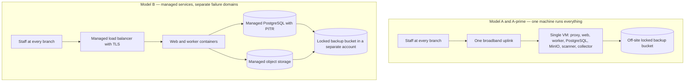
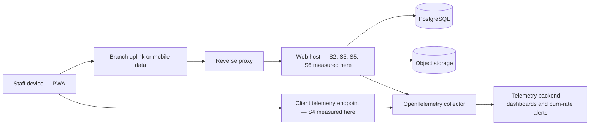
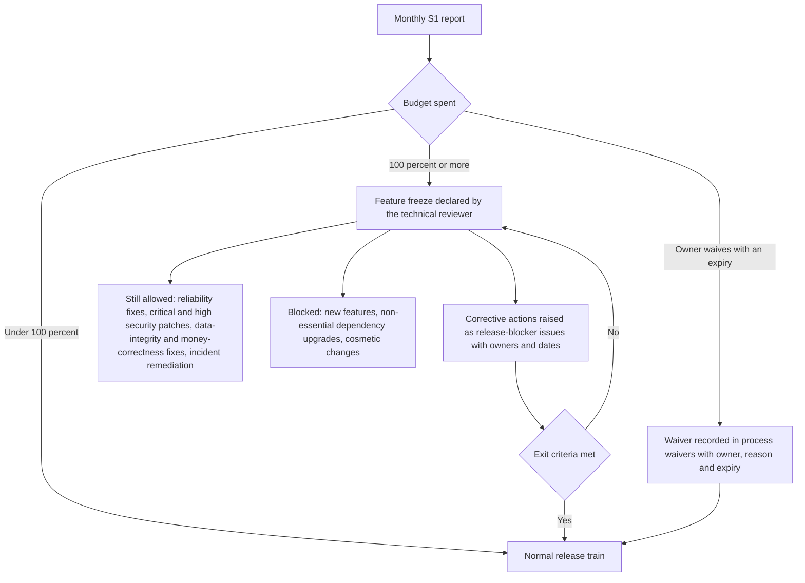

# Service level objectives — stated per candidate hosting model

This document states what HyFib Tailor 360 promises about availability, speed, errors, background work,
notifications and recoverability, and it states those promises **twice**: once for a single virtual machine running
the Docker Compose stack on premises, and once for managed cloud services. It is written this way because the
hosting model is still an open owner decision — plan [Section 11 item 2](../IMPLEMENTATION_PLAN.md) and **OD-02** in
[`../prd/assumptions-and-open-decisions.md`](../prd/assumptions-and-open-decisions.md) — and because availability,
recovery time, cost, failover and the staff needed to operate the system are not separable from that choice. Every
number here is **proposed, to be confirmed**: the targets become binding only when the owner selects a model and
signs the compatibility statement in section 13. Read this with
[`capacity-and-performance.md`](capacity-and-performance.md) (the load these targets are measured at),
[`security-operations-targets.md`](security-operations-targets.md) (patching, incidents and support hours),
[`../architecture/failure-modes.md`](../architecture/failure-modes.md) (what happens when a dependency is down) and
[`../architecture/deployment.md`](../architecture/deployment.md) (the containers these models place).

---

## 1. Status, scope and how to read this document

| Field | Value |
| --- | --- |
| Status | **Draft — proposed targets**; nothing here is binding until section 13 is signed |
| Owner of the document | Technical reviewer, with the Owner as approver |
| Drafted | 2026-09-04 (issue #19, wave W0) |
| Blocking decision | **OD-02 hosting model and indicative monthly budget** — until it is taken, both models remain live and both sets of targets are maintained |
| Confirmed by | The stakeholder review in [`reviews/stakeholder-review.md`](reviews/stakeholder-review.md) and the feasibility challenge in [`risk-review.md`](risk-review.md), both completed before wave W1 |
| Review cadence | Every release train, and immediately after any incident that breaches a target or any change of hosting model |

**Vocabulary.** An **SLI** is a measured ratio or distribution (for example, the share of requests answered without a
server error). An **SLO** is the target that SLI must meet over a stated window. The **error budget** is the amount
by which the SLO may be missed in that window before the release policy in section 11 takes effect. A **service
window** is the period during which the availability SLO is measured. Targets given as `p95` and `p99` are
percentiles of a distribution, never averages: an average hides exactly the tail that a member of staff at the
counter notices.

**Two rules govern every number below.**

1. A target is stated only where it can be measured from a signal the system already emits — OpenTelemetry metrics
   and traces from the web and worker hosts, the client-telemetry endpoint of #52, the WAL and backup metrics of
   #58, or a scheduled probe. A promise nobody can measure is not an objective, it is a wish.
2. Where the plan fixes a number it is reproduced faithfully and marked as the plan's proposal. Where the plan is
   silent — the error-rate objective, the notification-latency objective, the service window, the cost bands — the
   number is introduced here, marked **proposed, to be confirmed**, and listed in section 12 as an open decision.

---

## 2. The candidate hosting models

Two models are carried, plus one variant of the first that the owner may prefer once costs are compared. All three
run the **identical container images** — this is the point of ADR-0010
([`../adr/0010-deployment-portability.md`](../adr/0010-deployment-portability.md)); what differs is who operates
PostgreSQL, the object storage and the machine, and therefore what happens when one of them fails.

| | **Model A — single VM, on premises, Compose** | **Model A′ — single rented VM, Compose** | **Model B — managed cloud services** |
| --- | --- | --- | --- |
| Where it runs | A machine in the head branch | One infrastructure-as-a-service VM in an Indian region | A cloud account in an Indian region |
| Application hosts | `tailor360-web`, `tailor360-worker` under Compose | Identical | Identical images on a container service or a VM |
| PostgreSQL | Self-hosted container with pgBackRest inside the image | Identical | Managed PostgreSQL with provider point-in-time recovery |
| Object storage | Self-hosted MinIO on the same machine | Identical | Managed S3-compatible bucket |
| Malware scanner, collector, proxy | Self-hosted containers on the same machine | Identical | Identical, alongside the application |
| Provisioning | Ansible | Ansible | Terraform |
| Failure domain | One machine, one building, one broadband line | One machine in a provider region | Provider services, each with its own redundancy |
| Reached by other branches over | The head branch's broadband uplink | The public internet | The public internet |
| Fixed by | Plan D17, D18 | Plan D17, D18 | Plan D17, D18 |

**Model A′ inherits every Model A target** except those that depend on the building: mains power, the branch
broadband line, the physical machine and the person who can walk up to it. Where a row below differs for A′ it is
called out; otherwise read A′ as A.

---

## 3. Service window and the availability definition

Availability is measured over a **service window**, because a shop that closes at 21:00 is not harmed in the same
way by a fault at 03:00 as by one at 11:00 — and because pretending otherwise would buy a 24-hour promise nobody
can staff (see [`security-operations-targets.md`](security-operations-targets.md) section 9).

| Item | Proposed value | Note |
| --- | --- | --- |
| Service window | 09:00–21:00 Asia/Kolkata, seven days | **Proposed, to be confirmed.** The real window is each branch's working calendar, fixed by **OD-06**; the SLO uses the union of the branch calendars once they exist |
| Availability SLO inside the window | **99.5% per calendar month** | The plan's proposed target |
| Availability objective outside the window | **99.0% per calendar month**, best effort | **Proposed, to be confirmed.** Background work, notifications and reports run out of hours; a fault there is a ticket, not a page, unless it threatens money, custody or the backup chain |
| Availability SLI | `good requests ÷ valid requests`, per minute, aggregated over the month | |
| A **valid** request | Any request that reaches the web host with a resolvable route | Requests rejected by rate limiting or anti-forgery are excluded — they are the system working |
| A **good** request | Answered with a status below 500 within the request timeout | |
| Counted as bad | Every `5xx`, every request that times out or is dropped, and — deliberately — a `503 media.unavailable` emitted while object storage is degraded | Declared degradation still costs error budget. The alternative, excusing planned degradation, makes the number flattering and useless |
| Excluded from the SLI | `4xx` responses, including `401`, `403`, `409` idempotency and concurrency conflicts and `426` outdated client | These are the authorisation, idempotency and versioning rules doing their job (plan Section 4.4) |
| Planned maintenance | Counted, not excused | Compose has no rolling update, so a container swap costs a few seconds of `502` per release ([`../architecture/deployment.md`](../architecture/deployment.md) section on releases). It is small, it is budgeted, and it is visible |

### 3.1 What 99.5% actually buys

| Window | Length | Error budget at 99.5% |
| --- | --- | --- |
| A 30-day month, 12-hour service window | 21,600 minutes | **108 minutes** — one hour and 48 minutes |
| A 31-day month, 12-hour service window | 22,320 minutes | 112 minutes |
| The same month measured 24×7, for comparison | 43,200 minutes | 216 minutes — three hours and 36 minutes |

108 minutes a month is roughly **one unplanned restart plus one bad afternoon**. It is deliberately not 99.9%
(43 minutes a month measured 24×7), which no single-machine deployment and no one-person support arrangement can
honour.

---

## 4. The SLI catalogue

Every objective below names the signal it is measured from. Instrumentation is the responsibility of #58; the
client-measured rows depend on the telemetry endpoint of #52.

| # | SLI | Definition | Measured from | Excludes |
| --- | --- | --- | --- | --- |
| S1 | API availability | Good ÷ valid requests, section 3 | Web host request metrics at the host, plus an external uptime check on `/health/live` | Client network, device faults |
| S2 | Read latency | Server time to first byte for safe `GET` requests under `/api/v1` | Web host histogram, per route group | Time on the client's network |
| S3 | Command latency | Server processing time for state-changing requests | Web host histogram, per route group | Provider calls made asynchronously by the worker |
| S4 | Scan round trip | Barcode decoded on the device to the server's answer rendered | Client telemetry, tagged with the connection type | Time spent aiming the camera |
| S5 | MFA challenge | Submission of the second factor to the answer | Web host histogram on the identity routes | Time the user spends reading the code |
| S6 | Error rate | Share of valid requests answered `5xx` | Web host request metrics | The exclusions in section 3 |
| S7 | Outbox lag | Age of the oldest unprocessed outbox message, per module | Worker gauge over `outbox_messages` | Messages already dead-lettered, counted by S8 |
| S8 | Dead-letter rate | Dead-lettered messages ÷ messages enqueued | Worker counters | Deliberate operator replays |
| S9 | Projection lag | Event timestamp to read-model checkpoint | Reporting projection checkpoints | Reports whose schedule is longer than the lag target |
| S10 | Notification hand-off | Notification intent created to provider acceptance | Notifications module timers | Carrier and handset delivery time, which nobody in this system controls |
| S11 | Revocation effectiveness | Session revocation or user deactivation committed, to the first request refused on every host | Identity metric plus a synthetic probe per host | |
| S12 | Flag propagation | Feature flag written to evaluation changed on every host | Platform metric on the `LISTEN/NOTIFY` path (plan D21) | |
| S13 | Backup freshness | Age of the newest archived WAL segment and of the newest successful base backup | `pg_stat_archiver` and the backup scheduler's metrics; provider metrics under Model B | |
| S14 | Restore proof | Age of the last successful automated restore that passed its invariant queries | The weekly restore job's report (#60) | |

---

## 5. Latency, error and freshness objectives

These are the plan's proposed targets. **They are identical for both hosting models** — the same code answering the
same load should not be slower because of who owns the database — but section 5.2 records the different conditions
under which each model can actually hold them.

| Objective | Target | Window | Model A | Model B |
| --- | --- | --- | --- | --- |
| Read latency (S2) | **p95 < 400 ms** | Rolling 28 days at the load in [`capacity-and-performance.md`](capacity-and-performance.md) | Same | Same |
| Command latency (S3) | **p95 < 800 ms** | Rolling 28 days | Same | Same |
| Scan round trip (S4) | **p95 < 1 s on a 4G connection** | Rolling 28 days, client-measured | Same, conditional on section 5.2 | Same |
| MFA challenge (S5) | **p95 < 2 s** | Rolling 28 days | Same | Same |
| Error rate (S6) | **≤ 0.5% of valid requests per month; commands ≤ 0.2%** | Calendar month | Same | Same |
| Outbox lag (S7) | **p95 < 30 s**, p99 < 5 min | Rolling 28 days | Same | Same |
| Dead-letter rate (S8) | **≤ 0.1% of messages per month**, and every dead letter is triaged within one working day | Calendar month | Same | Same |
| Projection lag (S9) | **p95 < 60 s**, p99 < 5 min | Rolling 28 days | Same | Same |
| Notification hand-off (S10) | **p95 < 60 s**, p99 < 5 min for transactional messages | Rolling 28 days | Same | Same |
| In-app notification visible | **p95 < 10 s** | Rolling 28 days | Same | Same |
| Revocation effectiveness (S11) | **≤ 60 s at p99, on every host** | Rolling 28 days | Same | Same |
| Feature flag propagation (S12) | **≤ 30 s** | Rolling 28 days | Same | Same |

Every target in this table is **proposed, to be confirmed**. The error rate, dead-letter rate, projection lag,
notification hand-off and in-app rows are introduced by this document rather than by the plan and are listed in
section 12.

### 5.1 Where latency is measured

S2, S3, S5 and S6 are **server-side**: they stop at the web host and say nothing about the customer-facing counter
experience on a bad line. S4 is **client-side** and is the only objective that includes the network the staff member
is actually using. Both are needed; neither substitutes for the other.

### 5.2 The condition attached to Model A

Under Model A every branch other than the one hosting the machine reaches the system across the **head branch's
broadband uplink**, in both directions. That uplink is then part of the service for those branches, and the
server-side objectives above will look healthy while a second branch cannot work at all.

Accepting the Model A targets therefore carries three conditions, all of which belong in the compatibility
statement:

1. A business broadband line at the hosting branch **with a mobile-data failover router**, so a line fault is a
   slowdown and not an outage.
2. TLS by ACME **DNS-01** (already the design, plan Section 4.7) so no inbound port forwarding or static IP is
   required, and certificates renew behind the shop's router.
3. Per-branch client telemetry so S1 and S4 are reported **per branch**, making a remote-branch outage visible even
   when the host branch is fine.

Without those three, Model A's honest availability figure is the availability of one shop's internet connection, and
the 99.5% target should be lowered rather than quietly missed.

---

## 6. Recovery objectives: RPO, RTO, backups and restore proof

Backup design is fixed by plan D18 and issue #60; what changes between models is the mechanism, the destination and
how long the recovery actually takes.

| Item | **Model A / A′** | **Model B** |
| --- | --- | --- |
| **RPO — data loss tolerated** | **≤ 15 minutes**, from continuous WAL archiving by pgBackRest to the off-site bucket; alerted as "no WAL archived for 15 minutes" | **≤ 5 minutes** inside the provider account, from managed continuous PITR; **≤ 24 hours** if the provider account itself is lost, from the nightly logical dump held in a separate account |
| **RTO — time to serve again** | **≤ 4 hours**, conditional on section 6.1 | **≤ 1 hour** with a high-availability database instance; **≤ 4 hours** with a single instance; **≤ 8 hours** to rebuild in another region or account — all proposed |
| **Backup destination** | Encrypted, versioned, **object-locked** bucket at a provider that is **not the premises** — never a disk in the same building; 35-day lock plus a 12-month locked monthly prefix; lifecycle expiry enforces retention, never `pgbackrest expire`; the archiver identity may put, get and list but **not delete** | The same locked bucket, and it must live in a **different provider account** from the managed database — so that a closed, compromised or unpaid account cannot take the backups with it |
| **Key custody** | Repository cipher passphrase and the Data Protection key-encryption key in the owner's password manager or KMS, escrowed separately, **never only on the VM** and never inside the backup set they protect | Identical, plus break-glass credentials for the provider account |
| **Media** | Bucket versioning with non-current-version expiry ≥ 35 days, `media_objects` storing the object version id, and a mandatory off-site mirror | Identical, using the managed bucket's versioning and replication |
| **Backup retention** | **35 daily plus monthly for 12 months** (plan D18); monthly copies exclude media derivatives and expired exports | Identical; the provider's own PITR window counts towards, not instead of, the 35 days |
| **Retention beyond 12 months** | Only if **OD-08** and the accountant's GST record retention decision require it; longer retention delays the ageing-out of deleted personal data and needs the privacy review of #57 | Identical |
| **Restore test — automated** | **Weekly**, on the staging VM or a throwaway VM built by the provisioning job — never on the production host, never on a hosted CI runner; restores to `now() − 1 h`, runs `migrate --check` and the invariant queries, records measured RPO and RTO | Identical, plus **quarterly** a restore into a **different account or region**, because provider-account loss is this model's tail risk |
| **PITR exercise** | **Monthly**, to a chosen timestamp | Monthly |
| **Missing-object recovery** | **Monthly**, from bucket versioning | Monthly |
| **Full DR exercise** | **Quarterly**, run by an operator who did not write the runbook | Quarterly |
| **Evidence** | Every exercise records actual RPO and RTO against this document and opens a `release-blocker` corrective issue when a target is missed (#60) | Identical |

### 6.1 The condition attached to Model A's four-hour RTO

Four hours is achievable only if the replacement machine exists. Composed honestly, the Model A budget is:

| Step | Proposed allowance | Depends on |
| --- | --- | --- |
| Detect and confirm | 15 min | The external uptime check and dead-man's switch (mandatory in both models, plan D13) |
| Decide to rebuild rather than repair | 15 min | A named decision-maker who is reachable — see [`security-operations-targets.md`](security-operations-targets.md) section 9 |
| Provision a replacement host | 60 min | **A pre-agreed cloud account with the Ansible run rehearsed**, because a failed motherboard cannot be bought on a Sunday |
| Restore the database and verify | 90 min | Baseline data volume from assumption A5; re-measured at every restore test |
| Media, TLS, DNS and smoke test | 30 min | ACME DNS-01, and a short DNS time-to-live agreed in advance |
| Contingency | 30 min | |

Without the pre-agreed replacement host, Model A's realistic RTO is **hardware procurement time**, which in a
Tamil Nadu branch on a holiday is a day or more. This is the single most important thing the owner is being asked to
accept or fund in section 13.

---

## 7. Failover mechanism

| Failure | **Model A / A′** | **Model B** |
| --- | --- | --- |
| A container crashes | In-process watchdog exits with code 70 after three failed liveness checks; `restart: unless-stopped` brings it back within seconds. Compose does **not** restart merely unhealthy containers, which is why the watchdog exists | The container service restarts or replaces the task; a second replica means no visible interruption |
| The web host is swapped during a release | A few seconds of `502`, minimised by `--wait` and proxy retry, and charged to the error budget | Rolling replacement with no interruption where two replicas run |
| PostgreSQL is unavailable | Nothing works: `/health/ready` fails, requests answer problem details, the host stays up and retries. Recovery is a restart, then restore or PITR if the data is damaged | Managed failover to the standby, typically minutes, if HA is purchased; otherwise the provider's own restart, then PITR |
| Object storage is unavailable | The system degrades exactly as [`../architecture/failure-modes.md`](../architecture/failure-modes.md) describes: uploads answer `503 media.unavailable`, everything else continues | The managed bucket's redundancy makes this rare; behaviour is unchanged |
| The machine, the building or the line is lost | **No automatic failover exists.** Recovery is rebuild-and-restore per section 6.1 | The application layer moves within the region automatically; a region or account loss is a rebuild-and-restore |
| The whole provider or premises is lost | Rebuild anywhere from the locked bucket; this is what the quarterly DR exercise proves | Identical, using the copy held in the separate account |

Neither model buys automatic cross-site failover, and neither should pretend to. Model B buys **faster, more
predictable recovery of the data tier**; Model A buys **lower running cost and physical control**. The choice in
section 13 is exactly that trade.

---

## 8. Staffing each model requires

These are the people the targets assume exist. They are not job descriptions; they are the minimum without which
the numbers above are fiction. The support arrangement itself — hours, channel, escalation — is defined in
[`security-operations-targets.md`](security-operations-targets.md) section 9 and depends on **OD-15**.

| Role | **Model A / A′** | **Model B** |
| --- | --- | --- |
| Named technical operator | Required. Holds shell access, the deploy script, the read-only backup credential and the escalation duty. Proposed effort: **4–8 hours per month** for patching, restore-evidence review and alert triage, excluding incidents | Required, same duties. Proposed effort: **3–6 hours per month** |
| Deputy operator | Required — one person cannot be the whole recovery plan. Must have completed one restore exercise | Required, same |
| Owner as decision-maker | Required for the rebuild-or-repair decision, dispatch-affecting incidents and any communication to customers | Required |
| Physical duties | UPS check, disk health alerts, a spare disk on the shelf, a router and line owner, and someone who can be at the machine within the RTO | None |
| Cloud account governance | Only for the backup bucket: billing owner, MFA on the account, credentials escrowed | Full: billing owner, MFA on the root account, break-glass credentials escrowed, quarterly access review of the console |
| Branch-side duties | Both models: a Branch Manager who can confirm what staff are seeing, and a Reception, Cashier or Delivery Staff member available to re-verify a journey after recovery | Same |

---

## 9. Indicative monthly cost band

**These bands are budgeting aids, not quotations.** They are **proposed, to be confirmed** by real quotations under
**OD-02**; the method is listed so a quotation can be compared line by line. All figures are INR per month,
exclusive of GST, and exclude staff time, one-off setup, and the licensed provider costs of #55 adapters (SMS,
WhatsApp, payment gateway), which are the same whichever model is chosen.

| Line | **Model A — on premises** | **Model A′ — rented VM** | **Model B — managed** |
| --- | --- | --- | --- |
| Compute | ₹2,000–₹4,000 — server hardware amortised over three years | ₹4,000–₹9,000 — 4 vCPU, 16 GB, 200 GB SSD in an Indian region | ₹3,000–₹8,000 — container or VM host for web and worker |
| Database | Included in compute | Included in compute | ₹8,000–₹25,000 — managed PostgreSQL; the upper half of the band is what **high availability** costs, and it is what buys the one-hour RTO |
| Object storage | Included in compute; disk only | Included, plus ₹300–₹1,000 for a volume or snapshots | ₹500–₹2,000 for 100–300 GB with versioning, plus egress |
| Power protection and spares | ₹300–₹800 — UPS and spare disk amortised | Not applicable | Not applicable |
| Network | ₹1,500–₹4,000 — business broadband **plus mobile-data failover** (section 5.2) | Included in the provider price | ₹1,500–₹3,000 — managed load balancer and TLS |
| Off-site backup bucket | ₹400–₹1,500 — versioned, object-locked, 35 days plus 12 monthly | ₹400–₹1,500 | ₹500–₹1,500 beyond the included PITR |
| Telemetry backend | ₹0–₹2,500 — free tier upward, per **OD-14** | ₹0–₹2,500 | ₹0–₹4,000 |
| Domain, ACME, dead-man's switch, uptime check | ₹0–₹800 | ₹0–₹800 | ₹0–₹800 |
| **Indicative run rate** | **₹4,200–₹13,600** | **₹4,700–₹14,800** | **₹13,500–₹44,300** |
| One-off | ₹70,000–₹1,60,000 for the machine, UPS and installation | None material | None material |

Three honest observations for the owner:

1. **Model B without high availability is not Model B.** Buying a single managed instance removes most of the
   recovery advantage while keeping most of the cost; if the budget cannot carry the HA line, Model A′ is the more
   coherent choice.
2. **Model A′ costs about what Model A costs to run** and removes the building, the power and the "someone must
   drive there" clauses, at the price of physical control.
3. Storage grows. Assumption A5 puts originals at roughly 22 GB a year plus about 30% derivatives; the storage and
   backup lines therefore rise year on year and the growth alert of the capacity document is what keeps that from
   being a surprise.

---

## 10. Error budget policy

The error budget for availability (S1) is the operating rule that keeps reliability from being argued about after
the fact.

| Item | Rule |
| --- | --- |
| Budget | 0.5% of the service window per calendar month — **108 minutes** in a 30-day month (section 3.1) |
| Owner of the budget | The technical reviewer reports it; the Owner decides on any waiver |
| Reported | Monthly, in the release train review, from the S1 dashboard; the report names every incident that consumed budget and links its post-incident review |
| Reset | On the first day of each calendar month. Budget is never carried forward, and never borrowed from next month |
| Secondary budgets | Latency (S2–S4), outbox lag (S7) and notification hand-off (S10) each carry their own 28-day budget; they raise tickets and block the performance release gate, but only S1 triggers the freeze in section 10.2 |

### 10.1 Burn-rate alerting

Multi-window burn-rate alerts are configured by #58 so that a fast outage pages immediately and a slow leak is
caught before the month is spent. A burn rate of 1 consumes the budget exactly over the month.

| Alert | Long window | Short window | Burn rate | Budget consumed before it fires | Response |
| --- | --- | --- | --- | --- | --- |
| Fast burn | 1 hour | 5 minutes | 14.4× | 2% | Page the operator immediately, in and out of hours |
| Slow burn | 6 hours | 30 minutes | 6× | 5% | Page during the service window; ticket outside it |
| Leak | 24 hours | 2 hours | 3× | 10% | Ticket, triaged the same working day |
| Drift | 3 days | 6 hours | 1× | 10% | Ticket, reviewed at the release train |

Every alert carries a `runbook_url` into `../runbooks/` (arriving with #58 and #60). An alert with no runbook is a
defect in the alert.

### 10.2 What happens when the budget is exhausted

**Freeze rules.**

1. The freeze is declared by the technical reviewer on the day the monthly report shows the budget spent, and is
   announced to the Owner and every Branch Manager in plain language: what broke, what is being fixed, what will
   not ship meanwhile.
2. Permitted during a freeze: reliability work, security patches within the SLAs of
   [`security-operations-targets.md`](security-operations-targets.md), corrections to money, custody or audit
   correctness, and incident remediation. Everything else waits.
3. Corrective actions are raised as `release-blocker` issues with a named owner and a date, exactly as a missed
   recovery target is under #60.
4. **Exit criteria**, all three: the trailing 28-day S1 figure is back above target; every `release-blocker`
   corrective issue is merged or explicitly re-scoped by the Owner; and one clean automated restore has run since
   the incident, proving recovery was not damaged by the fix.
5. A freeze may be **waived** only by the Owner, recorded in [`../process/waivers.md`](../process/waivers.md) with
   reason, compensating control and an expiry date — never open-ended. An expired waiver fails the release gate,
   the same rule that governs security exceptions.
6. Two consecutive exhausted months are treated as a design signal, not a run of bad luck: the risk review in
   [`risk-review.md`](risk-review.md) is reopened and the hosting model itself is put back on the table.

---

## 11. Evidence and traceability

| Target class | Enforced or evidenced by | Where the evidence lives |
| --- | --- | --- |
| Availability, error rate, burn rate | Dashboards and alert rules as code (#58); external uptime check and dead-man's switch | Monthly SLO report in the release train record |
| Latency budgets | k6 smoke per pull request, full load and mixed-load test per release (#58), Lighthouse CI budgets (#52) | Release evidence checklist (#59) |
| Scan round trip | Client telemetry, plus the physical rehearsal on real devices and labels (#36, #37) | [`support-matrix.md`](support-matrix.md) device evidence |
| Outbox, projection and notification lag | Worker metrics and the alert rules of #58 | Monthly SLO report |
| Revocation and flag propagation | Verification tests for logout and revocation (#57), the propagation-bound test of D21 | Test run in the release evidence |
| RPO, RTO, retention | Weekly automated restore, monthly PITR, quarterly DR exercise (#60) | Restore and DR records; measured figures compared against section 6 |
| Cost band | Quotations attached to the OD-02 decision | [`../prd/assumptions-and-open-decisions.md`](../prd/assumptions-and-open-decisions.md) |

The row-by-row mapping of every non-functional requirement to its test, monitor, evidence and owner is
[`traceability.md`](traceability.md).

### 11.1 What these objectives deliberately do not cover

- The **customer's** network, handset or messaging app when they open an estimate, status or feedback link.
- **Carrier delivery** of SMS and WhatsApp messages: S10 stops at provider acceptance, because nothing after that
  is under this system's control. Delivery receipts are recorded and reported, but not promised.
- **Provider outages** at the payment, messaging or accounting vendors: these degrade features by design and are
  covered by the failure-mode rules, not by an availability promise on someone else's service.
- **Staff device faults**, printers and scanners: covered by [`support-matrix.md`](support-matrix.md).
- **Mains power** at the branch under Model A, beyond the UPS runtime funded in section 9.

---

## 12. Open decisions recorded by this document

All raised 2026-09-04 by issue #19. Owner column names the person accountable for the answer; each item is mirrored
in [`../prd/assumptions-and-open-decisions.md`](../prd/assumptions-and-open-decisions.md).

| ID | Question | Blocks | Owner | Status |
| --- | --- | --- | --- | --- |
| **OD-02** (plan Section 11 item 2) | Which hosting model, and the indicative monthly budget | The selection in section 13, ADR-0010's final status, #59 environments, #60 backup design | Business owner | **Open** — needed before the W1 exit gate |
| **SLO-01** | Confirm the 09:00–21:00 Asia/Kolkata service window, or replace it with the branch working calendars of **OD-06** | The availability SLI, the out-of-hours objective, the on-call arrangement | Business owner, with each Branch Manager | **Proposed** — the stated window stands until OD-06 is answered |
| **SLO-02** | Confirm the error-rate objectives (0.5% overall, 0.2% commands) and the dead-letter, projection-lag, notification hand-off and in-app targets introduced here | The alert thresholds of #58 and the performance release gate | Technical reviewer, approved by the Owner | **Proposed** — confirm at the stakeholder review |
| **SLO-03** | Accept the three Model A conditions in section 5.2 and the pre-agreed replacement host in section 6.1, or lower the Model A availability and RTO targets to match reality | Whether Model A can be signed at 99.5% and four hours | Business owner | **Open** |
| **SLO-04** | Under Model B, is high availability purchased for the managed database | The RTO row in section 6 and the cost band in section 9 | Business owner | **Open** — only relevant if Model B is selected |
| **SLO-05** | Replace the indicative cost bands with quotations | The budget line of OD-02 | Business owner | **Open** |
| **OD-08** | Retention periods that may extend backup retention beyond 35 days plus 12 months | Section 6 retention rows; the privacy work of #57 | Business owner, co-signed by the accountant | **Open** |
| **OD-14** | Telemetry backend | Whether every SLI in section 4 can actually be measured and alerted on | Business owner | **Open** — needed before W5 |
| **OD-15** | Who receives priority-one pages out of hours, and through which channel | Detection and acknowledgement targets in [`security-operations-targets.md`](security-operations-targets.md) | Business owner | **Open** — needed before W5 |

---

## 13. Compatibility statement — for the Owner to sign

This section is signed **once**, after the hosting model is selected under OD-02. Until it is signed, no target in
this document is binding, and both models continue to be maintained. Signing it closes the W0 exit gate item
"owner confirms D17 (hosting model and indicative budget) in writing".

**Selected hosting model** (tick one):

| | Model | Selected |
| --- | --- | --- |
| ☐ | **A** — single VM on the premises, Docker Compose, self-hosted PostgreSQL and object storage | |
| ☐ | **A′** — single rented VM, Docker Compose, self-hosted PostgreSQL and object storage | |
| ☐ | **B** — managed cloud services, with high availability ☐ / without high availability ☐ | |

**The targets accepted with that model** (from sections 3, 5 and 6, as they stand on the date of signature):

| Target | Value for the selected model | Accepted |
| --- | --- | --- |
| Availability in the service window | 99.5% per calendar month | ☐ |
| Service window | 09:00–21:00 Asia/Kolkata, or the branch working calendars once OD-06 is answered | ☐ |
| Read and command latency | p95 < 400 ms and < 800 ms | ☐ |
| Scan round trip | p95 < 1 s on 4G | ☐ |
| Error rate | ≤ 0.5% of valid requests; commands ≤ 0.2% | ☐ |
| Outbox lag | p95 < 30 s | ☐ |
| Notification hand-off to the provider | p95 < 60 s | ☐ |
| Session revocation and user deactivation | ≤ 60 s at p99 on every host | ☐ |
| RPO | Model A/A′ ≤ 15 min · Model B ≤ 5 min in-account, ≤ 24 h on account loss | ☐ |
| RTO | Model A/A′ ≤ 4 h · Model B ≤ 1 h with HA, ≤ 4 h without | ☐ |
| Backup retention | 35 daily plus monthly for 12 months, object-locked and off site | ☐ |
| Restore-test cadence | Weekly automated restore, monthly PITR, monthly object recovery, quarterly full DR exercise | ☐ |
| Monthly cost band | The band in section 9 for the selected model, pending quotations | ☐ |

**Conditions the Owner accepts by signing** (strike out any that are declined, and record the corresponding lower
target beside it):

1. The Model A network conditions of section 5.2 — business broadband with mobile-data failover, ACME DNS-01, and
   per-branch telemetry. *(Models A and A′ only.)*
2. The pre-agreed replacement host and rehearsed provisioning run of section 6.1, without which the four-hour RTO
   does not hold. *(Models A and A′ only.)*
3. High availability purchased for the managed database, without which the RTO is four hours, not one.
   *(Model B only.)*
4. The staffing in section 8: a named operator and a named deputy, both of whom have completed a restore exercise.
5. The support arrangement chosen in [`security-operations-targets.md`](security-operations-targets.md) section 9,
   including the explicit statement that overnight cover is best effort, not a rota.
6. The error budget policy of section 10, including the feature freeze when the budget is spent.

| Signature | Name | Role | Date |
| --- | --- | --- | --- |
| | | Owner (approves the targets, the budget and the conditions) | |
| | | Technical reviewer (confirms the targets are measurable and achievable) | |
| | | Operations owner (confirms the staffing and the support arrangement) | |
| | | Accountant (confirms only the backup retention against GST record requirements) | |

**On signature**: OD-02 is marked *Decided* with this date in
[`../prd/assumptions-and-open-decisions.md`](../prd/assumptions-and-open-decisions.md), ADR-0010 is updated to name
the selected model, the unselected model's rows in this document are retained for the record and marked
*not selected*, and this statement is re-signed at the next annual review or on any material change of hosting,
branch count or volumes.
