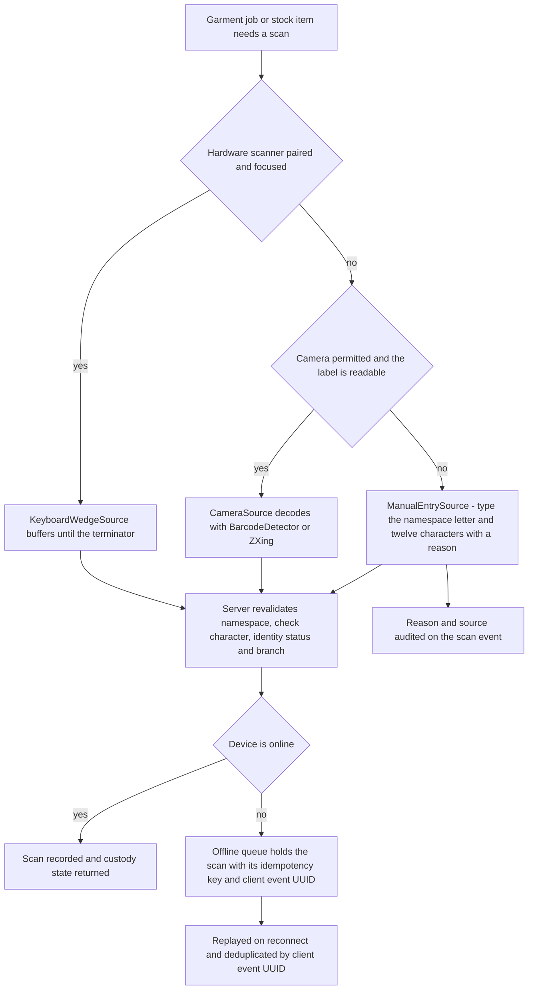
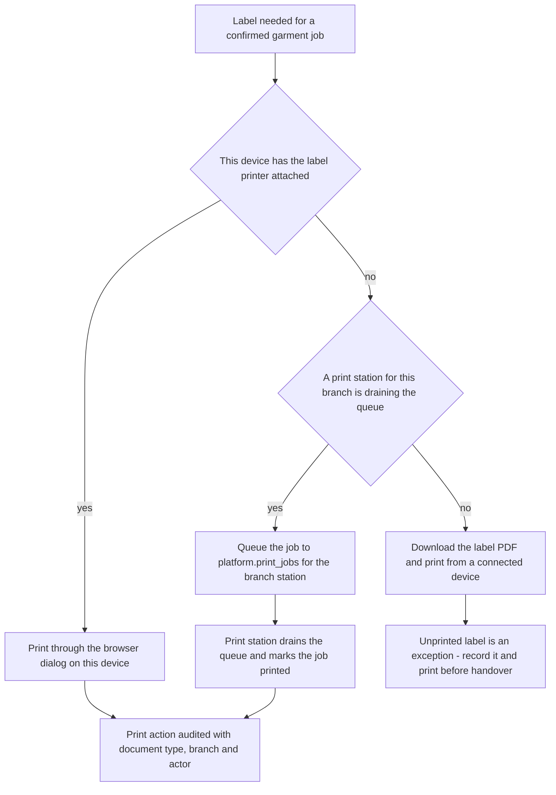

# HyFib Tailor 360 — Device, browser and printer support matrix

This document fixes what "works on the shop's devices" means for HyFib Tailor 360. It names the device classes,
browsers, operating-system floors and orientations the product supports, states the **lowest supported device** that
every performance budget is measured on, and gives, for each hardware capability the shop depends on — camera
scanning, hardware scanner, manual entry, thermal label printing, A4/A5 document printing and offline working — the
support level per device class and the **fallback ladder** used when that capability is unavailable. It is the
acceptance boundary for the cross-browser and accessibility gates (issue #52), the label-printing evidence (#35) and
the scanner fallbacks (#36).

Read it with [`capacity-and-performance.md`](capacity-and-performance.md), which sets the budgets measured on the
reference device named here, and with [`../prd/assumptions-and-open-decisions.md`](../prd/assumptions-and-open-decisions.md),
which holds the owner decision register this document feeds.

> **Everything numeric in this document is proposed, to be confirmed.** The matrix is drafted from plan assumption
> A4 and is the agenda for owner decision **OD-07** (device, browser and printer matrix), plan
> [Section 11](../IMPLEMENTATION_PLAN.md) item 7. Nothing here is settled until the stakeholder review in
> [`reviews/stakeholder-review.md`](reviews/stakeholder-review.md) is signed. Section 10 lists every open item with
> an owner and a date.

---

## 1. How to read this document

### 1.1 Support tiers

| Tier | Meaning | Automated evidence | Manual evidence | Release behaviour |
| --- | --- | --- | --- | --- |
| **Tier 1 — supported and gated** | The configuration a paid staff member uses daily. A defect here blocks the release | Playwright project on the matching engine runs on every pull request for touched journeys and nightly in full | Recorded real-device walkthrough of the scan, capture, billing and dispatch journeys **every release** | Release gate fails |
| **Tier 2 — supported, evidence per milestone** | A configuration staff may legitimately use. A defect is a normal bug with a priority | Playwright project on the matching engine, nightly | Real-device walkthrough at least once per milestone | Release gate does not fail; the defect is triaged |
| **Tier 3 — best effort** | Works because it shares an engine with a Tier 1 or Tier 2 configuration; not exercised deliberately | None specific | None | Defects are recorded, fixed only when cheap |
| **Not supported** | The application refuses to run and shows the unsupported-configuration page with the upgrade path | Feature-detection test asserts the refusal page appears | — | — |

Support is decided by **feature detection, never by user-agent sniffing**. The user-agent string is used only for
advisory wording on the unsupported-configuration page and for the device-evidence log; it never gates a code path.
An architecture-adjacent lint rule in the PWA (`no-restricted-globals` for `navigator.userAgent` outside the
telemetry and advisory modules) is proposed to enforce this — proposed, to be confirmed.

### 1.2 Capability vocabulary

| Term | Meaning in this document |
| --- | --- |
| **Camera scanning** | Decoding a garment-job, stock, invoice or receipt barcode from the device camera through `CameraSource` — the native `BarcodeDetector` when present, the bundled ZXing decoder otherwise (plan D2, #36) |
| **Hardware scanner** | A USB or Bluetooth **keyboard-wedge (HID)** scanner that types the payload followed by a terminator; read by `KeyboardWedgeSource` |
| **Manual entry** | Typing the namespace letter and the twelve-character payload body through `ManualEntrySource`. Always available, always requires a reason and is always audited |
| **Label printer** | A thermal label printer producing the garment-job label. Never driven directly from a mobile browser: work is queued to `platform.print_jobs` and drained by the branch **print station** (plan D15, #35) |
| **Document printer** | An A4 or A5 printer producing invoices, receipts, estimates, measurement sheets and job cards through the browser print dialog or a downloaded PDF |
| **Offline behaviour** | What each journey does without a network: precached shell, allowlisted queued commands, or an explicit blocked-action state (plan Section 4.6, #51) |

---

## 2. The lowest supported device and the performance reference

The lowest supported device is stated once and used everywhere. **It is the performance reference device**: every
budget in [`capacity-and-performance.md`](capacity-and-performance.md) — Largest Contentful Paint, Interaction to
Next Paint, Cumulative Layout Shift, scan round-trip, bundle size and memory ceiling — is a target *on this device
over the emulated 4G profile*, not on a developer laptop.

| Attribute | Reference device — proposed, to be confirmed |
| --- | --- |
| Class | Android phone, entry level, of the kind already carried by Tailors and Delivery Staff |
| Operating system | Android 10 |
| Memory | 4 GB RAM |
| Processor | Eight-core 2.0 GHz-class mobile SoC of the Snapdragon 665 / Helio G35 generation |
| Display | 720 × 1600 physical, device pixel ratio 2, **360 CSS px** logical width |
| Browser | Chrome, current stable channel |
| Network for budget measurement | Emulated 4G: 9 Mbit/s down, 1.5 Mbit/s up, 170 ms round-trip time, applied by Lighthouse CI and the Playwright network profile |
| Camera | Single rear camera, autofocus, no dedicated macro; the barcode must be decodable at 15 cm |
| Why this device | It is the slowest configuration the shop is expected to buy or already own; a budget met here is met on every other supported device |

Consequences that follow from choosing this reference, and which the whole design must respect:

- The narrowest layout that must work without horizontal overflow is **320 CSS px**; the reference device's 360 px
  is the design width for phone layouts. The Playwright overflow helper asserts 320, 360, 768, 1024 and 1280 px and
  200% zoom (plan Section 4.6).
- 4 GB of RAM shared with the camera pipeline is the reason the scan and capture screens carry explicit memory
  ceilings rather than "no leaks".
- Image processing never happens on the device: uploads are bytes, all decoding, stripping, re-encoding and
  derivative generation happen in the worker under a bulkhead (plan Section 4.4, #31).
- A device slower or older than the reference is **not supported**; it is refused with the
  unsupported-configuration page rather than served a degraded experience that quietly fails at the counter.

---

## 3. Device classes

| Class | Typical hardware | Primary roles | Primary journeys | Tier |
| --- | --- | --- | --- | --- |
| **Shop-floor phone** | Android phone at or above the reference device; iPhone | Tailor, Tailor Master, Delivery Staff | Scan, take custody, work phases, workboard, delivery stops, doorstep confirmation | Tier 1 |
| **Counter tablet** | Android tablet 10 inch; iPad | Reception, Tailor Master, Inventory Clerk | Customer search and creation, consent, measurement capture, design selection, image capture, order intake, estimate, label printing, stock issue | Tier 1 |
| **Back-office desktop or laptop** | Windows 10/11 laptop; macOS laptop | Cashier, Branch Manager, Owner, Admin, Auditor | Billing, payments, cashier session close, reconciliation, reports, exports, administration, permission and catalogue management | Tier 1 |
| **Print station** | A counter tablet or desktop with the thermal label printer and the A4 printer attached | Any role with `print.station` in the branch | Draining `platform.print_jobs` for the branch: labels, receipts, invoices, estimates, measurement sheets | Tier 1 |
| **Personal phone used occasionally by a manager** | Any Tier 1 or Tier 2 phone | Branch Manager, Owner | Read-only dashboards, approvals that do not require step-up on a shared device | Tier 2 |

Counter and workshop devices may be shared between staff (plan assumption A4). The session model for shared devices —
short inactivity timeout, the optional revocable trusted-device cookie and which roles may re-login with a password
only — is owner decision **OD-12** and is specified in the authentication issue (#23), not here.

---

## 4. Browser, engine and operating-system matrix

| Platform | Minimum OS — proposed | Engine | Browsers | Version policy | Tier | PWA install |
| --- | --- | --- | --- | --- | --- | --- |
| Android phone | Android 10 | Blink | **Chrome** | Current stable and the previous major | **Tier 1** | Yes, `beforeinstallprompt` plus the Install page |
| Android phone | Android 10 | Blink | Samsung Internet, Edge on Android | Current stable | Tier 2 | Yes |
| Android tablet | Android 10 | Blink | **Chrome** | Current stable and the previous major | **Tier 1** | Yes |
| iPhone | iOS 16.4 | **WebKit** | **Safari** | Current major and the previous major | **Tier 1** | Yes, Safari **Add to Home Screen** only |
| iPhone | iOS 16.4 | **WebKit** | Chrome, Edge, Firefox on iOS | Current stable | Tier 2 | **No** — see section 4.1 |
| iPad | iPadOS 16.4 | **WebKit** | **Safari** | Current major and the previous major | **Tier 1** | Yes, Add to Home Screen |
| iPad | iPadOS 16.4 | **WebKit** | Chrome, Edge, Firefox on iOS | Current stable | Tier 2 | No |
| Windows desktop | Windows 10 22H2 | Blink | **Chrome**, **Edge** | Current stable and the previous major | **Tier 1** | Yes, installable window |
| Windows desktop | Windows 10 22H2 | Gecko | **Firefox** | Current stable and the current ESR | **Tier 1** for function; Tier 2 for printing | Site-specific browser only |
| macOS desktop | macOS 13 | WebKit | **Safari** | Current major and the previous major | **Tier 1** | Yes, Add to Dock |
| macOS desktop | macOS 13 | Blink / Gecko | Chrome, Edge, Firefox | Current stable | Tier 2 | Yes for Blink |
| Linux desktop | Any current distribution | Blink / Gecko | Chrome, Firefox | Current stable | Tier 3 — engineering use | Yes for Blink |
| Anything else | — | — | Internet Explorer, Opera Mini and other proxy or mini browsers, Android WebView shells, embedded in-app browsers | — | **Not supported** | — |

Version policy notes:

- Browsers are treated as **evergreen**: the floor is "current stable and the previous major", not a pinned number.
  A browser more than two majors behind receives the unsupported-configuration page with instructions to update.
- The operating-system floors are the *reason* for the browser floor: an Android 10 device cannot install a newer
  Chrome than its Play Services allow, and an iPhone on iOS 16 cannot receive a newer Safari than 16.x.
- The floors are chosen so that the platform features the product depends on are present without a polyfill:
  service workers, `getUserMedia` on a secure origin, CSS container queries, `:focus-visible`, `structuredClone`,
  ES2021 syntax and the Web Crypto API. A feature-detection probe on first load records which of these are missing
  and posts the result to the client telemetry endpoint (#52, #58).
- In-app browsers — the browser inside a messaging application — are not supported for staff work. Customer links
  under `/c/{purpose}/{token}` are a different, server-rendered surface outside the PWA shell and **must** work in
  them; that surface uses no service worker, no camera and no storage (plan Section 4.4).

### 4.1 The WebKit engine constraint on iOS and iPadOS

On iOS and iPadOS every browser renders with the system **WebKit** engine. Chrome, Edge and Firefox on iOS are
WebKit browsers with different user interfaces; the alternative-engine allowance introduced for the European Union
has produced no shipping engine that HyFib supports. Everything below follows from that single fact and applies to
**all** iOS browsers, not only Safari.

| Constraint | Consequence for HyFib Tailor 360 | Mitigation |
| --- | --- | --- |
| No `BarcodeDetector` API | Camera scanning on iOS always runs the bundled ZXing decoder, which is slower and more sensitive to focus and glare | Plan D2 already forbids depending solely on `BarcodeDetector`. The decoder is loaded as a route chunk, not in the initial bundle. iOS decode time carries its own budget in [`capacity-and-performance.md`](capacity-and-performance.md) |
| Installation only from Safari | A Tailor who opens the application in Chrome on iPhone cannot install it and works in a browser tab | The Install page detects iOS plus a non-Safari browser and tells the user to open the same URL in Safari. Device evidence is recorded both in a tab and in installed mode |
| Each iOS browser has its **own** storage | An offline scan queued in Chrome on iOS is invisible in Safari on the same iPhone | The offline-queue indicator names the browser it belongs to, and the sign-out flow warns when the queue is not empty |
| Script-writable storage is evicted after roughly seven days without interaction for sites **not** added to the Home Screen | A queued scan could be lost on a rarely used iPhone | The offline queue maximum age is proposed at **24 hours**, far inside the eviction window, and satisfies the plan's configuration test `Idempotency:Retention ≥ 2 × OfflineQueue:MaxAge` against the seven-day idempotency retention — proposed, to be confirmed |
| The camera is released when the tab is backgrounded or the device is locked | The scanner appears frozen when the user returns | `CameraSource` re-acquires the stream on `visibilitychange` and shows the "tap to resume scanning" state rather than a dead preview |
| Web push only for Home Screen web apps, and only from iOS 16.4 | v1 does not rely on web push for anything operational | Customer messaging uses SMS, WhatsApp and email adapters (plan D20); the staff in-app notification centre is polled, and the polling interval is stated in [`capacity-and-performance.md`](capacity-and-performance.md) |
| Playwright's WebKit build is **not** Safari on a device | An automated WebKit pass is necessary but not sufficient | Real-device evidence on an iPhone and an iPad is mandatory each release for the scan, capture, billing and dispatch journeys; the WebKit Playwright project remains the per-pull-request signal |

---

## 5. Orientation support

WCAG 2.2 success criterion 1.3.4 forbids locking content to a single orientation. HyFib Tailor 360 therefore
**never** locks orientation; the manifest declares `any`. Layouts are chosen by container queries, not by
orientation or user agent (plan Section 4.6).

| Screen class | Portrait | Landscape | Notes |
| --- | --- | --- | --- |
| Shop-floor phone | **Primary** | **Supported** | The scanner viewfinder, the phase actions and the bottom navigation reflow; focus is never obscured by the bottom bar or the virtual keyboard in either orientation |
| Counter tablet | Supported — stacked single column | **Primary** — master-detail | Measurement capture uses the two-column layout in landscape and a stepped single column in portrait; the diagram stays visible in both |
| Back-office desktop | n/a | **Primary** | Dense tables; wide content scrolls inside its own container, never the page body |
| Print station | Supported | **Primary** | The queue list and the preview sit side by side in landscape |
| Customer link pages | **Primary** | Supported | Server-rendered, single column, no scripts beyond the minimum |

Both orientations of every touched screen are exercised by the Playwright phone and tablet projects
(plan Section 5.3), and the overflow and obscured-focus helper runs in both.

---

## 6. Capability matrix

Legend: **Yes** — supported and gated at the class's tier. **Fallback** — not available on this class; the named
ladder in section 7 applies. **No** — deliberately unavailable.

| Capability | Shop-floor phone Android | Shop-floor phone iPhone | Counter tablet Android | iPad | Desktop Blink | Desktop Firefox | Desktop Safari | Print station |
| --- | --- | --- | --- | --- | --- | --- | --- | --- |
| **Camera scanning** | Yes — `BarcodeDetector` then ZXing | Yes — ZXing only | Yes | Yes — ZXing only | Yes where a webcam exists, otherwise Fallback | Yes — ZXing only | Yes — ZXing only | Fallback |
| **Hardware scanner, USB HID** | Fallback — needs OTG | No | Yes with an OTG or USB-C adapter | Yes with a USB-C adapter | **Yes — preferred** | **Yes — preferred** | **Yes — preferred** | **Yes — preferred** |
| **Hardware scanner, Bluetooth HID** | Yes | Yes | Yes | Yes | Yes | Yes | Yes | Yes |
| **Manual entry** | **Yes — always** | **Yes — always** | **Yes — always** | **Yes — always** | **Yes — always** | **Yes — always** | **Yes — always** | **Yes — always** |
| **Thermal label printing** | Fallback — queue to the station | Fallback — queue to the station | Fallback unless the printer is attached | Fallback | Yes when the printer is attached | Yes when the printer is attached | Yes when the printer is attached | **Yes — primary** |
| **A4 / A5 document printing** | Fallback — download the PDF | Fallback — download the PDF | Yes through the print dialog | Yes through the print dialog | **Yes** | Yes — page-break fidelity is Tier 2 | Yes | **Yes** |
| **Installable PWA** | Yes | Yes — Safari only | Yes | Yes — Safari only | Yes | Site-specific browser only | Yes | Yes |
| **Offline shell and reference data** | Yes | Yes | Yes | Yes | Yes | Yes | Yes | Yes |
| **Offline queued scan submissions** | Yes | Yes — storage caveat, section 4.1 | Yes | Yes — storage caveat | Yes | Yes | Yes | Yes |
| **Offline billing, payments, stock reconciliation** | **No — blocked by design** | **No** | **No** | **No** | **No** | **No** | **No** | **No** |

The final row is a design decision, not a limitation: money and stock movements are online-only and show the
`OfflineBlockedAction` state — "Needs connection — this will not be queued" — rather than silently accepting input
that cannot be honoured (plan Section 4.6).

---

## 7. Capability detail and fallback ladders

### 7.1 Scanning: camera, hardware scanner, manual entry

All three sources produce the same normalised result — `{ raw, normalised, namespace, id, checksumValid, source,
timestamp }` — and the server re-validates the namespace, the check character, the identity status and the branch on
every resolve and every command, whatever the source (plan Section 4.4, #36). A fallback therefore never weakens a
control; it only changes how the characters reached the field, and the source is recorded on the scan event.

| Source | Preferred where | Requirements | Failure mode | Next rung |
| --- | --- | --- | --- | --- |
| **Hardware scanner, keyboard wedge** | Counter, workshop bench, print station, back office | Scanner configured to emit the payload plus a terminator; the buffer is ignored while the user is typing in an unrelated field | Not paired, out of battery, wrong terminator configured | Camera |
| **Camera** | Phones and tablets on the floor and at the doorstep | Secure origin, granted camera permission, adequate light, label within 15 cm | Permission denied, camera in use by another application, label damaged or wet, glare under workshop lighting | Manual entry |
| **Manual entry** | Anywhere, always present | The human-readable payload printed on the label; a reason is mandatory and is audited | The label is destroyed or illegible | Damaged-label exception |
| **Damaged-label exception** | Any | The garment-job identity is re-derived from the order and a new barcode identity is issued; the previous identity becomes `superseded` | — | Paper fallback runbook |

Notes that the matrix must not lose:

- Web serial, WebHID and WebUSB are **not** used. Keyboard-wedge HID is the contract because it is the only mode
  that works identically on Android, iOS, Windows, macOS and Linux without a driver or a Chromium-only API.
- A Bluetooth HID scanner suppresses the on-screen keyboard on iOS and iPadOS. The scan screens therefore never
  depend on the virtual keyboard being visible, and the manual-entry field can be summoned explicitly.
- Manual entry is rate-limited by the `scan-burst` policy like any other scan submission and is never exempt from
  authorisation, idempotency or audit.
- Torch or flash control is best effort where the browser exposes it; its absence is never a blocker.

### 7.2 Label printing — thermal

Phones and tablets never drive a thermal printer through the browser. The ladder is fixed by plan D15 and #35.

| Rung | Availability | Notes |
| --- | --- | --- |
| **Print station queue** | Every branch, all device classes | The default from every phone layout: **Send to print station** is offered first |
| **Direct browser print** | Devices with the printer attached | The print station screen and any desktop with the printer installed |
| **Download PDF** | Every device | Always offered as the second action; the PDF embeds a Tamil-capable font |
| **Print bridge** | Optional, from #55 | A network or local bridge adapter; an `http` bridge is permitted only on an explicitly allowlisted private address per branch (plan Section 4.4) |
| **Operational fallback** | Any | Continue the handover with manual entry against the order's human-readable number and reprint the label when the printer returns; the gap is an exception recorded in [`../prd/exceptions.md`](../prd/exceptions.md) |

The label stock size and whether a QR code accompanies the Code 128 are owner decision **OD-09** and are not fixed
here. The matrix records only that **at least one** thermal label printer model per branch must be nominated,
tested with printed sheets, and listed in the release evidence.

### 7.3 Document printing — A4 and A5

| Document | Format | Where printed | Fallback |
| --- | --- | --- | --- |
| Tax invoice, credit note | A4 | Back-office desktop or print station | Download PDF; e-mail or WhatsApp the customer copy subject to consent |
| Receipt | A5 or thermal roll — proposed, to be confirmed with OD-09 | Cashier desktop or print station | Download PDF |
| Estimate | A4 | Counter tablet through the station, or desktop | Customer link to the estimate page |
| Job card | A4 | Print station | On-screen job card on the workboard |
| Measurement sheet | A4 | Print station | On-screen; printing it is an audited sensitive read |

Firefox is Tier 2 for printing only: page-break and margin fidelity across engines is verified once per milestone
with a stored print-to-PDF artefact per document type, because print CSS differs measurably between Blink, Gecko
and WebKit. Functionally Firefox remains Tier 1.

### 7.4 Offline behaviour

| Journey | Offline behaviour | Rationale |
| --- | --- | --- |
| Application shell, navigation, design system, icons, fonts | Precached by the service worker, versioned | The counter must not show a browser error page during a link flap |
| Reference reads on the allowlist — catalogue availability, workflow definitions, permission catalogue | Stale-while-revalidate with a visible staleness marker | Explicitly allowlisted non-sensitive endpoints only (plan Section 4.6) |
| Any other API read | Network-first; the last response is **not** reused unless it is on the allowlist | Protected responses are never cached |
| **Scan submissions** | **Queued**, bounded, with the idempotency key and client event UUID preserved; replayed on reconnect | The workshop and the delivery route have real dead spots |
| **Doorstep delivery-confirmed scan** | **Queued**, but only when it references a dispatch authorisation obtained **while online** | The payment gate is never evaluated offline |
| Billing, payment recording, receipt issue, cashier session close | **Blocked** with `OfflineBlockedAction`; typed input is preserved | Money is never accepted into a queue |
| Stock issue, return, wastage, stocktake posting | **Blocked** | Balances must not be reconciled against a stale view |
| Order confirmation, invoice posting, label allocation | **Blocked** | Sequence allocation and barcode identity allocation are transactional server actions |
| Image capture | Capture is permitted; the upload is retried while the file is held, and the user is told the upload is pending | Bytes are large and the media pipeline is server-side |

The offline queue is bounded by count and by age; the proposed maximum age is 24 hours (section 4.1) and the
proposed maximum depth is 200 queued scans per device — both proposed, to be confirmed. A queue at its bound shows
a persistent, non-dismissable banner and refuses further queuing rather than discarding the oldest entry.

---

## 8. Accessibility and assistive technology pairings

The full accessibility commitment lives in [`accessibility-localisation.md`](accessibility-localisation.md) and the
per-screen checks in [`a11y-checklist.md`](a11y-checklist.md). This matrix records only which assistive-technology
pairings are covered by the WCAG 2.2 AA release gate.

| Platform | Screen reader | Tier | Evidence |
| --- | --- | --- | --- |
| Android | TalkBack with Chrome | Tier 1 | Manual walkthrough of one new journey per release plus axe on every touched screen |
| iOS / iPadOS | VoiceOver with Safari | Tier 1 | Manual walkthrough per release |
| Windows | NVDA with Chrome or Edge | Tier 1 | Manual walkthrough per milestone |
| Windows | Narrator | Tier 2 | Spot check |
| macOS | VoiceOver with Safari | Tier 2 | Spot check |

Keyboard-only operation, 200% zoom and the reduced-motion and high-contrast preferences are Tier 1 on every
platform and are covered by the automated helpers rather than by a device pairing.

---

## 9. How the matrix is enforced

| Enforcement | Mechanism | Cadence |
| --- | --- | --- |
| Engine coverage | Playwright projects Chromium, Firefox and WebKit, each with phone, tablet and desktop profiles in both orientations | Every pull request for touched journeys; full suite nightly (plan Section 5.3) |
| Layout integrity | Overflow and obscured-focus helper at 320, 360, 768, 1024 and 1280 px and 200% zoom | Every pull request with a user-interface change |
| Accessibility | axe-core on every touched screen plus the manual screen-reader items | Every pull request with a user-interface change |
| Real-device evidence | A recorded walkthrough per Tier 1 device class, in a browser tab **and** in installed mode, with the device, operating system and browser versions logged | Every release; stored with the release evidence index |
| Capability detection in the field | The client telemetry module reports which capabilities were detected, which scanner source was used and which fallback rung was reached | Continuous, sampled and redacted (#52, #58) |
| Unsupported configurations | Feature-detection test asserting the refusal page and its upgrade instructions | Every pull request |
| Printing fidelity | Stored print-to-PDF artefact per document type per engine | Every milestone |

The fallback-rung telemetry is the evidence that decides whether the matrix is right: if manual entry is being
reached frequently on a particular device class, that is a scanner, label or lighting problem to fix, not a fact to
accept. A proposed alert threshold of **manual entry above 2% of scans in a branch over seven days** raises a
review — proposed, to be confirmed.

---

## 10. Open decisions

These items are **not settled**. They extend plan [Section 11](../IMPLEMENTATION_PLAN.md) — principally item 7,
**OD-07** — and must be transcribed into
[`../prd/assumptions-and-open-decisions.md`](../prd/assumptions-and-open-decisions.md) in the pull request that
closes issue #19. Identifiers `SM-01` and upwards are local to this document and are referenced from
[`traceability.md`](traceability.md).

| ID | Open decision | Proposed position, to be confirmed | Owner | Raised | Needed by |
| --- | --- | --- | --- | --- | --- |
| **SM-01** | The lowest supported device | Android 10, 4 GB RAM, 360 CSS px, Chrome stable — section 2 | Business owner with the technical reviewer | 2026-09-04 | Before W1 exit; every performance budget depends on it |
| **SM-02** | Minimum operating-system floors | Android 10; iOS and iPadOS 16.4; Windows 10 22H2; macOS 13 | Business owner | 2026-09-04 | Before W0 exit — OD-07 |
| **SM-03** | Browser version policy | Evergreen: current stable and the previous major; Firefox current plus ESR | Technical reviewer | 2026-09-04 | Before W0 exit |
| **SM-04** | Which hardware scanner models are bought or already owned, and USB versus Bluetooth per station | Keyboard-wedge HID only; at least one model per branch nominated and tested | Business owner | 2026-09-04 | Before W3 — feeds #36 |
| **SM-05** | Thermal label printer models per branch, and the label size and whether a QR accompanies Code 128 | Deferred to **OD-09**; at least one model nominated and printed sheets stored | Business owner | 2026-09-04 | Before W3 — feeds #35 |
| **SM-06** | Receipt format: A5 sheet or thermal roll | A5 by default, thermal roll if the counter printer is already a roll printer | Business owner with the accountant | 2026-09-04 | Before W4 |
| **SM-07** | Offline queue bounds | Maximum age 24 hours, maximum depth 200 scans per device | Technical reviewer | 2026-09-04 | Before #51 |
| **SM-08** | Manual-entry review threshold | Above 2% of a branch's scans over seven days raises a review | Business owner with the Branch Manager | 2026-09-04 | Before go-live |
| **SM-09** | Whether personal phones may be used at all, or only shop-issued devices | Shop-issued devices for Tier 1 journeys; personal phones Tier 2 and read-mostly | Business owner | 2026-09-04 | Before W1 exit — interacts with **OD-12** |
| **SM-10** | Whether any branch has a device below the reference specification today | Assumed no; if yes, either the device is replaced or the reference is lowered and every budget is re-derived | Business owner | 2026-09-04 | Before W0 exit |

---

## 11. Related documents

| Document | Why it matters here |
| --- | --- |
| [`capacity-and-performance.md`](capacity-and-performance.md) | The budgets measured on the reference device named in section 2 |
| [`slo.md`](slo.md) | Availability, latency, RPO and RTO per hosting model |
| [`accessibility-localisation.md`](accessibility-localisation.md) | WCAG 2.2 AA commitment, launch languages and the Tamil glossary |
| [`a11y-checklist.md`](a11y-checklist.md) | The per-screen screen-reader items referenced by the Definition of Done |
| [`traceability.md`](traceability.md) | Maps each entry here to its test, monitor, evidence and owner |
| [`../process/release-gates.md`](../process/release-gates.md) | The cross-browser, accessibility and performance gates that consume this matrix |
| [`../prd/assumptions-and-open-decisions.md`](../prd/assumptions-and-open-decisions.md) | The owner decision register, including OD-07, OD-09 and OD-12 |
| [`../prd/exceptions.md`](../prd/exceptions.md) | The damaged-label, missing-material and unpaid-dispatch exceptions the fallbacks feed |
| [`../adr/0003-react-typescript-pwa.md`](../adr/0003-react-typescript-pwa.md) | The PWA decision, the scanner library choice and the installability requirement |
| [`../architecture/failure-modes.md`](../architecture/failure-modes.md) | What the system does when storage, the worker or the network is down |
| [`../IMPLEMENTATION_PLAN.md`](../IMPLEMENTATION_PLAN.md) | Assumption A4, decisions D2, D13 and D15, Section 4.6 and Section 11 |
