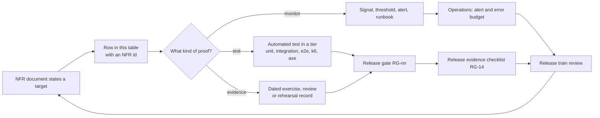

# Non-functional traceability — every target, its proof and its owner

This document answers one question for every non-functional requirement HyFib Tailor 360 states: **what proves it,
and who is accountable when it stops being true?** A target with no test, no monitor and no evidence artefact is not
a requirement — it is an aspiration, and this table is where that distinction is made visible. Read it with
[`slo.md`](slo.md) (availability, latency, recovery), [`capacity-and-performance.md`](capacity-and-performance.md)
(the load the targets hold at), [`support-matrix.md`](support-matrix.md) (devices and browsers),
[`security-operations-targets.md`](security-operations-targets.md) (patching, incidents, retention),
[`data-classification.md`](data-classification.md), [`accessibility-localisation.md`](accessibility-localisation.md)
and [`../process/release-gates.md`](../process/release-gates.md), which is where most of these proofs are actually
enforced.

---

## 1. Status and scope

| Field | Value |
| --- | --- |
| Status | **Draft.** Every target is **proposed, to be confirmed** until the stakeholder review in [`reviews/stakeholder-review.md`](reviews/stakeholder-review.md) is signed and the hosting model is selected under **OD-02** |
| Drafted | 2026-09-04, issue #19, wave W0 |
| Owner of the document | Technical reviewer, with the Owner as approver |
| Covers | Every numeric or testable target stated in the six documents of `docs/nfr/`, plus the release-level acceptance criteria of the roadmap (#1) |
| Maintenance rule | A pull request that adds or changes a target in any `docs/nfr/` document adds or changes its row here in the same pull request. A target without a row here is a defect in the documentation set |
| Review cadence | Every wave exit gate, and at each release train |

---

## 2. How to read the tables

### 2.1 Columns

| Column | Meaning |
| --- | --- |
| **ID** | Stable identifier, `NFR-<area>-<nn>`. Quoted by issues, pull requests and waivers |
| **Requirement and proposed target** | What is promised, with the number where one exists. Every number is proposed, to be confirmed |
| **How it is proven** | The specific test, monitor or evidence artefact. Where more than one exists, the primary proof is first |
| **Gate** | The release gate from [`../process/release-gates.md`](../process/release-gates.md) that enforces it, or the review that accepts it |
| **Owner** | The person accountable for the target being met, not for building the proof |
| **Status** | See 2.3 |

### 2.2 Proof types

| Type | Meaning | Fails at |
| --- | --- | --- |
| **Test** | An automated assertion that fails a build or a release when the property stops holding | A pull request or a release gate |
| **Monitor** | A signal the running system emits, with an alert threshold and a runbook | Operations, in production |
| **Evidence** | A dated artefact produced by an exercise, a review or a rehearsal, filed with the release | A release gate or a review |

A target proven only by **evidence** degrades silently between exercises. Where that is the case the row says so,
and the exercise cadence is part of the proof.

### 2.3 Status vocabulary

| Status | Meaning |
| --- | --- |
| **Proven** | The proof exists today and runs |
| **Proof scheduled (#NN)** | The proof is a deliverable of a named backlog issue and does not exist yet |
| **Target open** | The number itself depends on an owner decision; the proof cannot be calibrated until it is taken |
| **Evidence only** | No automated proof is possible; a dated exercise or review is the whole proof |

### 2.4 Owners

| Owner | Accountable for |
| --- | --- |
| **Owner** | Targets that express a promise to customers, staff or the accountant |
| **Technical reviewer** | Engineering targets: latency, correctness, maintainability, compatibility |
| **Security owner** | Security and privacy targets. Appointed by #56a; until then the Owner holds it |
| **Operations owner** | Availability, backup, recovery and alerting targets. Named by **OD-15** |
| **Owner with the accountant** | GST, retention of financial records, and financial export correctness |

---

## 3. How a target reaches a proof

---

## 4. Availability and resilience

| ID | Requirement and proposed target | How it is proven | Gate | Owner | Status |
| --- | --- | --- | --- | --- | --- |
| **NFR-AV-01** | Availability 99.5% monthly within the service window, stated per hosting model | Monitor: external uptime probe and the request-success ratio; Evidence: monthly attainment report | Release train review | Operations owner | Target open — depends on **OD-02**; see [`risk-review.md`](risk-review.md) **RR-01** |
| **NFR-AV-02** | Readiness never depends on a non-essential dependency: `/health/ready` checks the database only | Test: health-probe integration test asserting object storage, the malware scanner and providers cannot make the host unready | RG-03 | Technical reviewer | Proof scheduled (#20, #21) |
| **NFR-AV-03** | A degraded dependency degrades a feature, never the whole host: uploads answer `503 media.unavailable` while storage is down; the detail endpoint reports Degraded | Test: fault-injection integration test per dependency; Monitor: the detail endpoint's per-check status | RG-03 | Technical reviewer | Proof scheduled (#21, #58) |
| **NFR-AV-04** | An unresponsive host restarts itself: three consecutive liveness failures exit the process, and the container policy restarts it | Test: watchdog unit test; Evidence: a restart observed in the staging rehearsal | RG-05 | Operations owner | Proof scheduled (#20, #59) |
| **NFR-AV-05** | A second worker replica requires no code change; leases prevent duplicate scheduled work | Test: integration test with two dispatchers competing for one aggregate's messages and one job lease | RG-03 | Technical reviewer | Proof scheduled (#21) |
| **NFR-AV-06** | A container swap during deployment costs at most a few seconds of failed requests, and the reverse proxy retries | Evidence: deployment rehearsal record with the measured interruption window | RG-14 | Operations owner | Proof scheduled (#59) — see [`risk-review.md`](risk-review.md) **RR-19** |

## 5. Latency and responsiveness

| ID | Requirement and proposed target | How it is proven | Gate | Owner | Status |
| --- | --- | --- | --- | --- | --- |
| **NFR-LT-01** | Application programming interface reads: p95 under 400 ms at the stated load | Monitor: server-side latency histogram per route class; Test: k6 scenario at the stated load | RG-07 | Technical reviewer | Proposed, to be confirmed; proof scheduled (#52, #58) |
| **NFR-LT-02** | Commands: p95 under 800 ms at the stated load | Monitor and k6, as above | RG-07 | Technical reviewer | Proposed, to be confirmed; proof scheduled (#52, #58) |
| **NFR-LT-03** | Scan round trip: p95 under 1 s on a 4G connection, measured from scan to server acknowledgement | Test: k6 scan scenario with a throttled profile; Monitor: client scanner metric from the telemetry endpoint; Evidence: a real-device rehearsal on the shop network | RG-07 | Technical reviewer | Proposed, to be confirmed; proof scheduled (#36, #52, #58) — see **RR-04** |
| **NFR-LT-04** | Multi-factor authentication challenge round trip under 2 s at p95 | Test: k6 authentication scenario; Monitor: route latency | RG-07 | Technical reviewer | Proposed, to be confirmed; proof scheduled (#23, #58) |
| **NFR-LT-05** | Every endpoint declares a rate-limit policy from the catalogue, and the limiter keys on the client address resolved through the trusted proxy network only | Test: architecture test that fails on an endpoint without a policy; integration test for the resolution rule | RG-02, RG-03 | Security owner | Proof scheduled (#53) |

## 6. Capacity and scale

| ID | Requirement and proposed target | How it is proven | Gate | Owner | Status |
| --- | --- | --- | --- | --- | --- |
| **NFR-CP-01** | The stated concurrent users, orders per branch per month, scans per day and images per garment are carried without breaching the latency targets | Test: k6 mixed-load run at the capacity document's figures; Evidence: the load report per release | RG-07 | Technical reviewer | Target open — the figures are assumption A3 and A5 until measured; **CP-01** in [`capacity-and-performance.md`](capacity-and-performance.md) |
| **NFR-CP-02** | The connection budget is validated at startup against the database's configured maximum, and 80% use raises an alert | Test: configuration test; Monitor: connection-use gauge with an alert | RG-03 | Technical reviewer | Proof scheduled (#21, #58) |
| **NFR-CP-03** | Object-storage growth stays within the provisioned volume, with an alert before it does not | Monitor: bucket size and growth-rate alert; Evidence: the quarterly capacity review | Release train review | Operations owner | Target open — the growth arithmetic is contested; **CP-05** in [`capacity-and-performance.md`](capacity-and-performance.md) and **RR-06** |
| **NFR-CP-04** | Reporting load never degrades transactional work: a dedicated pool, statement timeouts, and large ranges only in the worker | Test: mixed-load run measuring transactional latency while reports run; Test: architecture test that reporting uses the read-only role | RG-07 | Technical reviewer | Proof scheduled (#44, #58) |
| **NFR-CP-05** | Exports are bounded: rows per file capped, larger exports paginated into an archive | Test: unit test for the cap; integration test for pagination | RG-03 | Technical reviewer | Proof scheduled (#44, #45) |

## 7. Background processing and data freshness

| ID | Requirement and proposed target | How it is proven | Gate | Owner | Status |
| --- | --- | --- | --- | --- | --- |
| **NFR-BG-01** | Outbox dispatch lag under 30 s at p95 | Monitor: lag gauge per module with a burn-rate alert; Test: integration test asserting dispatch after commit | RG-03 | Technical reviewer | Proposed, to be confirmed; proof scheduled (#21, #58) |
| **NFR-BG-02** | At-least-once delivery with inbox de-duplication: a redelivered message produces exactly one effect | Test: integration test that expires a lease mid-handler and redelivers | RG-03 | Technical reviewer | Proof scheduled (#21) |
| **NFR-BG-03** | One aggregate's events are never reordered by two dispatchers | Test: concurrency integration test with two dispatchers on one aggregate stream | RG-03 | Technical reviewer | Proof scheduled (#21) |
| **NFR-BG-04** | The dead-letter queue does not grow unattended: every dead letter raises an alert and is replayable by an authorised operator | Monitor: dead-letter count alert; Test: replay integration test | RG-03 | Operations owner | Proof scheduled (#21, #25) |
| **NFR-BG-05** | Reporting projections are never authoritative, and their freshness is visible to the reader | Test: architecture test that reporting reads only contracts; Monitor: projection freshness with a breach event | RG-02 | Technical reviewer | Proof scheduled (#44) |
| **NFR-BG-06** | Reconciliation detects projection drift and financial or stock mismatch, and reports it rather than correcting silently | Test: reconciliation integration test with a seeded mismatch; Monitor: mismatch event and alert | RG-03 | Owner with the accountant | Proof scheduled (#44, #46) |
| **NFR-BG-07** | Notification delivery latency target, measured from intent to provider acceptance | Monitor: delivery latency histogram | Release train review | Operations owner | Target open — the number is proposed in [`slo.md`](slo.md) and depends on **OD-03** |
| **NFR-BG-08** | "Worker down" is never silent: the alert fires when no instance heartbeat is younger than twice the interval, and an external dead-man's switch covers the whole machine | Monitor: heartbeat alert plus the external switch; Evidence: a recorded alert test | RG-14 | Operations owner | Proof scheduled (#58) |

## 8. Security

| ID | Requirement and proposed target | How it is proven | Gate | Owner | Status |
| --- | --- | --- | --- | --- | --- |
| **NFR-SE-01** | Deny by default: no endpoint without a permission policy or a justified anonymous marker | Test: architecture test; the endpoint inventory in the contract tier | RG-02, RG-04 | Security owner | Proof scheduled (#24, #53) |
| **NFR-SE-02** | Role and branch isolation: every endpoint behaves correctly for every role, for its own branch and for another branch, with field masks where they apply | Test: the authorisation-matrix integration suite, which fails on any endpoint without an entry | RG-03 | Security owner | Proof scheduled (#24) |
| **NFR-SE-03** | Session revocation and user deactivation take effect on every host within 60 s at p99 | Test: integration test measuring propagation; Monitor: revocation propagation metric | RG-03 | Security owner | Proposed, to be confirmed; proof scheduled (#23) — see **RR-05** |
| **NFR-SE-04** | Multi-factor authentication is mandatory for any principal whose effective permissions include a permission flagged as requiring it; step-up endpoints require re-authentication within five minutes | Test: architecture test for the declaration; matrix test with a fresh and a stale dimension | RG-02, RG-03 | Security owner | Proof scheduled (#23, #24) |
| **NFR-SE-05** | No bearer token in browser storage; the session is an opaque identifier in a host-prefixed, secure, HTTP-only cookie, with anti-forgery on every non-safe request including the authentication endpoints | Test: integration tests for the cookie attributes and anti-forgery; end-to-end assertion that storage holds no token | RG-03, RG-05 | Security owner | Proof scheduled (#23, #53) |
| **NFR-SE-06** | An enforcing, nonce-based Content Security Policy with no inline script or style | Test: end-to-end run failing on a policy violation; Evidence: the hardening review | RG-05, RG-06 | Security owner | Proof scheduled (#53, #56b) |
| **NFR-SE-07** | No unresolved critical or high security finding at release, across dependencies, static analysis and images | Test: the scan gates; Evidence: the vulnerability register with due dates | RG-08, RG-10, RG-11 | Security owner | Proof scheduled (#22, #56a) |
| **NFR-SE-08** | Vulnerability remediation: critical within 7 days, high within 30, medium within 90 | Monitor: the register's due dates; Test: the expired-exception check that fails the build | RG-08 | Security owner | Proposed, to be confirmed; proof scheduled (#56a) — see **RR-14** |
| **NFR-SE-09** | No secret in the repository, in a log, in a problem-details response, in a health payload or in telemetry | Test: secret scanning; redaction tests with sentinel values | RG-09 | Security owner | Proof scheduled (#21, #22) |
| **NFR-SE-10** | Every outbound call goes through the outbound-HTTP port, which refuses private, loopback, link-local and metadata addresses, disables redirects and caps response size | Test: architecture test for the port; unit tests for the address rules | RG-02, RG-03 | Security owner | Proof scheduled (#54, #55) |
| **NFR-SE-11** | Uploads are quarantined until a malware scan passes, and decoding happens only in the worker under a bounded bulkhead | Test: integration test with the scanner adapter; contract test against the real scanner | RG-03 | Security owner | Proof scheduled (#31) |
| **NFR-SE-12** | Application Security Verification Standard baseline coverage, with a traceability record and a penetration test whose findings are remediated | Evidence: the ASVS traceability record and the penetration-test report with remediation | RG-14 | Security owner | Evidence only; scheduled (#56a, #56b) |
| **NFR-SE-13** | Barcodes contain no personal data: an opaque namespaced payload with a check character and no customer, order or measurement information | Test: unit test over the payload format; Test: a test that no personal field can reach the payload builder | RG-02 | Security owner | Proof scheduled (#35) |
| **NFR-SE-14** | Customer links are random, purpose-bound, expiring, revocable and rate-limited, stored only as a hash, and their paths are redacted from logs and traces | Test: integration tests for expiry, revocation, purpose binding and rate limits; redaction test | RG-03 | Security owner | Proof scheduled (#32a, #47) |

## 9. Privacy and data protection

| ID | Requirement and proposed target | How it is proven | Gate | Owner | Status |
| --- | --- | --- | --- | --- | --- |
| **NFR-PR-01** | Every stored item is classified, including credentials, session material, provider keys and backup keys | Evidence: [`data-classification.md`](data-classification.md), reviewed at each wave gate; Test: a documentation check that new tables appear in the inventory | RG-14 | Security owner | Proof scheduled (#19 document, #57 inventory) |
| **NFR-PR-02** | Retention is enforced by a job, per policy, with an exception report for anything skipped | Test: retention job integration tests per class; Monitor: retention run outcome | RG-03 | Owner | Target open — periods depend on **OD-08**; proof scheduled (#57) |
| **NFR-PR-03** | Media is served only by an authorised streaming endpoint that re-authorises every request; the storage endpoint is not reachable from the internet and no storage URL reaches the browser | Test: integration test asserting authorisation on every request and no redirect; Evidence: the network configuration review | RG-03 | Security owner | Proof scheduled (#31) |
| **NFR-PR-04** | Consent is recorded before images and measurements are captured, and withdrawal is honoured | Test: integration tests for the consent gate; end-to-end coverage in the intake journey | RG-03, RG-05 | Owner | Proof scheduled (#26, #31) |
| **NFR-PR-05** | Data-subject requests — access, correction, deletion or pseudonymisation — are executed and evidenced, and are replayed after a restore before the environment is reopened | Test: data-subject request integration tests; Evidence: the restore runbook step | RG-03, RG-13 | Security owner | Proof scheduled (#57, #60) |
| **NFR-PR-06** | Integration event payloads carry identifiers, codes, statuses, timestamps, amounts and branch codes only, unless the event is classified personal and the subscriber is approved | Test: contract test over event schemas; reviewer check at the Definition of Done | RG-04 | Security owner | Proof scheduled (#54) |

## 10. Auditability

| ID | Requirement and proposed target | How it is proven | Gate | Owner | Status |
| --- | --- | --- | --- | --- | --- |
| **NFR-AU-01** | Every state-changing action and every sensitive read is audited with actor, action, resource, reason and correlation | Test: architecture test for the audit filter; integration test asserting the audit row | RG-02, RG-03 | Security owner | Proof scheduled (#21, #57) |
| **NFR-AU-02** | The audit log is append-only and tamper-evident: a hash chain written by a database trigger the application role cannot bypass | Test: integration test attempting update and delete as the application role; chain verification test | RG-03 | Security owner | Proof scheduled (#21) |
| **NFR-AU-03** | The chain is verified hourly, gaps are detected, and the chain head is anchored outside the database with an alert on disagreement | Monitor: verification job outcome and anchor comparison; Evidence: the verification record | RG-14 | Security owner | Proof scheduled (#57) |
| **NFR-AU-04** | Every denied request to a state-changing or step-up endpoint is audited, coalesced per actor, endpoint and minute, and never sampled away | Test: integration test for the denial audit; Monitor: denial rate | RG-03 | Security owner | Proof scheduled (#24) |
| **NFR-AU-05** | Audit retention is independent of log retention and is enforced by partition detach, never by deletion | Test: retention job test; Evidence: the partition record | RG-03 | Owner with the accountant | Target open — depends on **OD-05** and **OD-08** |

## 11. Financial integrity and GST

| ID | Requirement and proposed target | How it is proven | Gate | Owner | Status |
| --- | --- | --- | --- | --- | --- |
| **NFR-FI-01** | Posted invoices, payments, receipts and stock-ledger entries are immutable; corrections are compensating records | Test: integration tests attempting update and delete; database trigger tests | RG-03 | Owner with the accountant | Proof scheduled (#41, #42, #38) |
| **NFR-FI-02** | GST calculation is correct for the accountant's examples: line-level rounding to paise, document round-off, CGST and SGST against IGST by place of supply, and the configuration version recorded on every calculation | Test: golden-master tests from the accountant's examples; Evidence: the accountant's approval | RG-03, RG-14 | Owner with the accountant | Target open — depends on **OD-05**; proof scheduled (#41, #42) |
| **NFR-FI-03** | Document numbers are allocated atomically per branch and financial year, are never reused, and have no gaps that are not explained | Test: concurrency integration test on the sequence allocator; Test: the sequence-gap invariant query in the restore verification | RG-03, RG-13 | Owner with the accountant | Proof scheduled (#42) |
| **NFR-FI-04** | No money value uses floating point; amounts and rates use the stated fixed precisions | Test: architecture or analyzer rule; unit tests over the money type | RG-02 | Technical reviewer | Proof scheduled (#21, #41) |
| **NFR-FI-05** | Dispatch is blocked until the quality-control and payment rules pass, and an exception is single-use, bound, time-limited and approved | Test: integration tests per policy; end-to-end test of a blocked unpaid dispatch | RG-03, RG-05 | Owner | Target open — the rule depends on **OD-04**; proof scheduled (#43, #48) |
| **NFR-FI-06** | The stock ledger reconstructs every balance, and no reservation oversubscribes | Test: property test rebuilding balances from the ledger; concurrency test on reservation | RG-03 | Technical reviewer | Proof scheduled (#38) |
| **NFR-FI-07** | Financial and stock exports are safe to open in a spreadsheet: formula-injection prefixes, quoted cells, typed columns | Test: the injection corpus unit test for every export path | RG-03 | Technical reviewer | Proof scheduled (#44, #45) |
| **NFR-FI-08** | GST records are retained for the statutory period, and the export formats the accountant needs exist | Evidence: the accountant's confirmation in [`reviews/stakeholder-review.md`](reviews/stakeholder-review.md); Test: export contract tests | RG-14 | Owner with the accountant | Target open — depends on **OD-05** |

## 12. Custody and traceability integrity

| ID | Requirement and proposed target | How it is proven | Gate | Owner | Status |
| --- | --- | --- | --- | --- | --- |
| **NFR-CU-01** | Exactly one active barcode identity per garment job; payloads unique across every status | Test: integration test with a partial unique index and a reprint case | RG-03 | Technical reviewer | Proof scheduled (#35) |
| **NFR-CU-02** | The server re-validates namespace, check character, identity status and branch on every resolve and command | Test: integration tests per invalid case | RG-03 | Technical reviewer | Proof scheduled (#35, #36) |
| **NFR-CU-03** | Scan events and custody transfers are append-only; a correction is a new event linked to the corrected one | Test: append-only trigger tests; integration test for the correction path | RG-03 | Technical reviewer | Proof scheduled (#36, #37) |
| **NFR-CU-04** | A scan is de-duplicated on the actor and client event identifier; the same identifier under a different actor is a conflict, never a replay | Test: idempotency and conflict integration tests | RG-03 | Technical reviewer | Proof scheduled (#36) |
| **NFR-CU-05** | The offline queue carries only approved idempotent operations; billing, payment and inventory reconciliation are online-only with an explicit blocked state | Test: unit test over the allowlist; end-to-end test of the blocked action | RG-05 | Technical reviewer | Proof scheduled (#51) |
| **NFR-CU-06** | Every garment is traceable from intake to dispatch through the custody chain, on real labels and real devices | Evidence: the physical rehearsal records and the end-to-end regression | RG-05, RG-14 | Owner | Evidence only; scheduled (#35, #37, #61b) |

## 13. Accessibility

| ID | Requirement and proposed target | How it is proven | Gate | Owner | Status |
| --- | --- | --- | --- | --- | --- |
| **NFR-AC-01** | WCAG 2.2 AA across the staff application | Test: axe across every screen and state; Evidence: the manual screen-reader and keyboard walkthroughs | RG-06 | Owner | Proof scheduled (#50, #52) |
| **NFR-AC-02** | No serious or critical automated violation on any changed screen | Test: axe in the pull-request pipeline | RG-06 | Technical reviewer | Proof scheduled (#50, #52) |
| **NFR-AC-03** | Every priority-zero journey is completable with a keyboard alone and with a screen reader | Evidence: the walkthrough record per journey, per release | RG-06 | Owner | Evidence only; scheduled (#52) |
| **NFR-AC-04** | No horizontal overflow and no focus obscured by a bottom bar or the virtual keyboard, at 320, 360, 768, 1024 and 1280 pixels and at 200% zoom | Test: the Playwright overflow and obscured-focus helper | RG-06 | Technical reviewer | Proof scheduled (#50) |
| **NFR-AC-05** | Status is never conveyed by colour alone; every status badge carries an icon and text | Test: Storybook and axe checks; reviewer check at the Definition of Done | RG-06 | Technical reviewer | Proof scheduled (#50) |
| **NFR-AC-06** | Session expiry warns two minutes ahead and re-authenticates in place without losing typed input | Test: end-to-end test of the warning and the in-place re-authentication retry | RG-05 | Technical reviewer | Proof scheduled (#23, #50) |

## 14. Localisation

| ID | Requirement and proposed target | How it is proven | Gate | Owner | Status |
| --- | --- | --- | --- | --- | --- |
| **NFR-LO-01** | All user-facing text goes through message identifiers with ICU plurals and no string concatenation | Test: lint rule; Test: pseudo-locale story per screen | RG-01, RG-06 | Technical reviewer | Proof scheduled (#50) |
| **NFR-LO-02** | English (India) at launch; the Tamil interface ships when its catalogue is at least 95% translated | Evidence: the catalogue coverage report at the release train | RG-14 | Owner | Proposed, to be confirmed — see **RR-16** |
| **NFR-LO-03** | Layouts tolerate about 40% text growth | Test: pseudo-locale story plus the overflow helper | RG-06 | Technical reviewer | Proof scheduled (#50) |
| **NFR-LO-04** | Indian rupee grouping, `dd-MM-yyyy` dates and 12-hour times come from one formatters module | Test: unit tests over the formatters; lint rule against direct formatting | RG-02 | Technical reviewer | Proof scheduled (#50) |
| **NFR-LO-05** | Documents and labels render Tamil correctly: a Tamil-capable font is embedded in every generated PDF | Test: snapshot test of a Tamil document; Evidence: a printed sample | RG-03, RG-14 | Technical reviewer | Proof scheduled (#32a, #35) |
| **NFR-LO-06** | Customer-facing pages follow the customer's language, not the operator's | Test: integration test over the link-rendering path | RG-03 | Owner | Proof scheduled (#47, #49) |

## 15. Compatibility and device support

| ID | Requirement and proposed target | How it is proven | Gate | Owner | Status |
| --- | --- | --- | --- | --- | --- |
| **NFR-CB-01** | The browser matrix in [`support-matrix.md`](support-matrix.md) is supported, and behaviour outside it degrades gracefully | Test: the end-to-end matrix across Chromium, Firefox and WebKit at phone, tablet and desktop profiles | RG-05 | Technical reviewer | Target open — depends on **OD-07**; proof scheduled (#52) |
| **NFR-CB-02** | Barcode decoding never depends solely on the native detector: the camera source falls back to the bundled decoder, and the keyboard-wedge and manual sources always exist | Test: capability-detection unit tests; end-to-end fallback test on WebKit | RG-05 | Technical reviewer | Proof scheduled (#36) — see **RR-10** |
| **NFR-CB-03** | Manual entry is always available, requires a reason and is audited | Test: integration test; end-to-end test of the manual path | RG-03, RG-05 | Security owner | Proof scheduled (#36) |
| **NFR-CB-04** | Printing works from a phone through the print station, with a PDF download as the fallback | Evidence: the physical print rehearsal; Test: end-to-end test of the queue drain | RG-05, RG-14 | Owner | Target open — depends on **OD-09**; proof scheduled (#35) — see **RR-11** |
| **NFR-CB-05** | The application is installable on the supported devices and is used in installed mode for device evidence | Evidence: install records per device class from wave W2 onwards | RG-14 | Technical reviewer | Proof scheduled (#50, #51) |
| **NFR-CB-06** | An outdated client is refused with a clear upgrade path rather than failing obscurely | Test: integration test of the minimum-client response; end-to-end test of the update prompt | RG-03, RG-05 | Technical reviewer | Proof scheduled (#51, #53) |

## 16. Client performance

| ID | Requirement and proposed target | How it is proven | Gate | Owner | Status |
| --- | --- | --- | --- | --- | --- |
| **NFR-CL-01** | Largest Contentful Paint, Interaction to Next Paint and Cumulative Layout Shift budgets on a throttled mobile profile | Test: Lighthouse CI budgets; Monitor: web vitals from the client telemetry endpoint | RG-07 | Technical reviewer | Proposed, to be confirmed; proof scheduled (#52) |
| **NFR-CL-02** | JavaScript, CSS and image weight budgets, with the scanner, camera, PDF and dashboard bundles split out | Test: Lighthouse CI budgets and the bundle report | RG-07 | Technical reviewer | Proposed, to be confirmed; proof scheduled (#52) |
| **NFR-CL-03** | Memory on the lowest supported device stays within budget on the scan and capture screens | Evidence: a real-device profile per release | RG-07 | Technical reviewer | Target open — depends on **OD-07**; see **RR-09** |
| **NFR-CL-04** | Protected responses are never cached by the service worker; only an explicit allowlist of non-sensitive reference endpoints is revalidated in the background | Test: service-worker unit tests; end-to-end assertion on the cache contents | RG-05 | Security owner | Proof scheduled (#51) |

## 17. Operability and observability

| ID | Requirement and proposed target | How it is proven | Gate | Owner | Status |
| --- | --- | --- | --- | --- | --- |
| **NFR-OP-01** | Traces, metrics and logs are emitted with correlation and causation identifiers, and redaction is tested | Test: redaction tests with sentinel values; Evidence: a trace across web, worker and database | RG-03 | Technical reviewer | Proof scheduled (#21, #58) |
| **NFR-OP-02** | Every alert has a runbook, an owner and a tested delivery path | Evidence: the alert test record and the runbook index | RG-14 | Operations owner | Target open — depends on **OD-15**; proof scheduled (#58) |
| **NFR-OP-03** | Service level objective burn-rate alerts exist for availability and latency | Monitor: burn-rate alerts; Evidence: the alert test | RG-14 | Operations owner | Proof scheduled (#58) |
| **NFR-OP-04** | Backup age and completeness are monitored, and a dead backup job raises an alert rather than being discovered at restore time | Monitor: backup age metric with an alert; Evidence: a recorded alert test | RG-13 | Operations owner | Proof scheduled (#58, #60) |
| **NFR-OP-05** | An external dead-man's switch and uptime check cover the whole machine, so "the virtual machine is down" is never silent | Monitor: the external service; Evidence: a recorded test | RG-14 | Operations owner | Proof scheduled (#58) |
| **NFR-OP-06** | Container logs are capped so a log flood cannot exhaust the disk | Evidence: the compose configuration review; Monitor: disk-use alert | RG-11 | Operations owner | Proof scheduled (#20, #59) |
| **NFR-OP-07** | A member of staff can raise an incident through the same channel the alerts use | Evidence: the operations arrangement in [`security-operations-targets.md`](security-operations-targets.md) | RG-14 | Operations owner | Target open — depends on **OD-15** |

## 18. Backup, recovery and continuity

| ID | Requirement and proposed target | How it is proven | Gate | Owner | Status |
| --- | --- | --- | --- | --- | --- |
| **NFR-BR-01** | Recovery point objective 15 minutes or better | Test: the weekly automated restore measuring the achieved recovery point; Monitor: write-ahead-log archive lag | RG-13 | Operations owner | Proposed, to be confirmed; depends on **OD-02** — see **RR-03** |
| **NFR-BR-02** | Recovery time objective 4 hours or better | Evidence: the measured recovery time in the weekly restore and the quarterly disaster-recovery exercise | RG-13 | Operations owner | Proposed, to be confirmed — see **RR-02** |
| **NFR-BR-03** | Backups retained 35 daily plus 12 monthly, in an encrypted, versioned, object-locked bucket whose archiver identity cannot delete | Evidence: the bucket policy review; Monitor: retention and lifecycle metrics | RG-13 | Operations owner | Proposed, to be confirmed; depends on **OD-05** and **OD-08** |
| **NFR-BR-04** | A restore is verified weekly, on an environment that is neither production nor a shared runner, with the invariant queries passing | Test: the automated restore job; Evidence: its record | RG-13 | Operations owner | Proof scheduled (#60) — see **RR-12** |
| **NFR-BR-05** | Point-in-time recovery is exercised monthly, and missing-object recovery from bucket versioning likewise | Evidence: the exercise records | RG-13 | Operations owner | Proof scheduled (#60) |
| **NFR-BR-06** | A full disaster-recovery exercise runs quarterly, executed by an operator who did not write the runbook, and records the achieved recovery point and time | Evidence: the exercise record naming the operator | RG-13 | Operations owner | Evidence only; scheduled (#60) |
| **NFR-BR-07** | Encryption keys are escrowed separately from the data they protect, and a restore is rehearsed on a machine that never held the key file | Evidence: the key-escrow record and the ransomware-scenario rehearsal | RG-13 | Security owner | Proof scheduled (#60) |
| **NFR-BR-08** | Rollback works: release N runs against a database at N+1, with a client at N+1 still cached in a browser | Evidence: the rollback rehearsal record | RG-12, RG-14 | Technical reviewer | Proof scheduled (#59) |

## 19. Maintainability, quality and delivery

| ID | Requirement and proposed target | How it is proven | Gate | Owner | Status |
| --- | --- | --- | --- | --- | --- |
| **NFR-MQ-01** | Module boundaries hold: only `Contracts` and `Platform.*` cross modules, and no context maps another schema's tables | Test: the architecture rules `ARCH-nnn` | RG-02 | Technical reviewer | Proven from #20; extended by every later issue |
| **NFR-MQ-02** | No direct commits to `main`; every change arrives through a reviewed pull request linked to one issue | Evidence: branch protection configuration; Test: the pull-request policy check | RG-14 | Technical reviewer | Proof scheduled (#22, #59) |
| **NFR-MQ-03** | The pull-request pipeline completes within 15 minutes of wall-clock time | Monitor: pipeline duration, with an issue opened when it is exceeded twice in a week | Release train review | Technical reviewer | Proposed, to be confirmed — see **RR-07** |
| **NFR-MQ-04** | Synthetic data only: production refuses synthetic seeding unconditionally, with no override | Test: a test asserting the refusal in the production environment | RG-03 | Technical reviewer | Proven from #20 for the refusal; dataset scheduled (#21, #61a) |
| **NFR-MQ-05** | Configuration, not code: categories, measurement templates, workflow phases, quality-control checklists, taxes, prices, alerts, retention and feature availability are versioned data | Test: integration tests that add a category and a template without deployment | RG-03 | Owner | Proof scheduled (#27, #29, #30, #33, #34, #41) |
| **NFR-MQ-06** | Every published configuration version is immutable, enforced in the database | Test: trigger tests attempting to modify a published version | RG-03 | Technical reviewer | Proof scheduled (#27, #29) |
| **NFR-MQ-07** | A pull request stays under about 1,500 changed lines excluding generated code and tests | Evidence: the diff statistics, reviewed at the Definition of Done | RG-14 | Technical reviewer | Proposed, to be confirmed |
| **NFR-MQ-08** | Test coverage does not fall below the agreed per-project floor | Test: the coverage gate | RG-02 | Technical reviewer | Enforced from #22 against the measured floors in [`../../.github/coverage-floors.json`](../../.github/coverage-floors.json) (82.8% solution-wide at the baseline); the floors themselves are still **proposed, to be confirmed** as **DOD-OD-02** in [`../process/definition-of-done.md`](../process/definition-of-done.md) |

## 20. Portability

| ID | Requirement and proposed target | How it is proven | Gate | Owner | Status |
| --- | --- | --- | --- | --- | --- |
| **NFR-PO-01** | The same container images run on a single virtual machine under Compose and on a managed platform, with no cloud-provider-specific application programming interface in application code | Test: architecture test against provider software development kits outside the integration module; Evidence: a deployment of the same digest to both shapes | RG-02, RG-14 | Technical reviewer | Proof scheduled (#20, #59) |
| **NFR-PO-02** | Object storage is used through the S3 application programming interface only, so the store can be changed without code changes | Test: architecture test; contract test against the storage adapter | RG-02, RG-04 | Technical reviewer | Proof scheduled (#31) |
| **NFR-PO-03** | Environments are provisioned from code, and a clean environment reaches a healthy stack without manual steps | Evidence: the clean-environment provisioning test | RG-14 | Operations owner | Proof scheduled (#59) |

---

## 21. Coverage at a glance

| Area | Rows | Proven today | Proof scheduled | Target open |
| --- | --- | --- | --- | --- |
| Availability and resilience | 6 | 0 | 5 | 1 |
| Latency and responsiveness | 5 | 0 | 5 | 0 |
| Capacity and scale | 5 | 0 | 3 | 2 |
| Background processing | 8 | 0 | 7 | 1 |
| Security | 14 | 0 | 13 | 1 |
| Privacy and data protection | 6 | 0 | 5 | 1 |
| Auditability | 5 | 0 | 4 | 1 |
| Financial integrity and GST | 8 | 0 | 5 | 3 |
| Custody and traceability | 6 | 0 | 6 | 0 |
| Accessibility | 6 | 0 | 6 | 0 |
| Localisation | 6 | 0 | 5 | 1 |
| Compatibility and devices | 6 | 0 | 4 | 2 |
| Client performance | 4 | 0 | 3 | 1 |
| Operability and observability | 7 | 0 | 5 | 2 |
| Backup and recovery | 8 | 0 | 5 | 3 |
| Maintainability and delivery | 8 | 1 partly | 5 | 2 |
| Portability | 3 | 0 | 3 | 0 |

The single most important reading of this table is that **nothing is proven yet**: at the end of wave W0 the
project has documents and a scaffold, not evidence. The value of the table now is that every proof has a named
issue, so a wave that skips one is visible.

---

## 22. Targets that no automated proof will ever cover

These are honest gaps, not oversights. Each is proven by a dated exercise, and each degrades silently between
exercises — which is why the cadence is part of the requirement.

| ID | Why automation cannot prove it | Cadence of the evidence |
| --- | --- | --- |
| **NFR-CU-06** | A physical garment, a printed label and a real scanner cannot be simulated | Per release for the touched journeys; a full rehearsal before go-live |
| **NFR-CB-04** | Thermal printing depends on the shop's printer, driver and paper | Per release when the label or receipt template changes |
| **NFR-AC-03** | A screen reader's usability is a human judgement | Per release for changed journeys |
| **NFR-BR-06** | A disaster-recovery exercise is a rehearsal of people as much as of systems | Quarterly |
| **NFR-SE-12** | A penetration test is by definition adversarial and manual | Before go-live and after any material change to the authentication or media surface |
| **NFR-FI-02** and **NFR-FI-08** | Only the accountant can confirm that the GST output is what the authority expects | Before go-live and whenever tax configuration or invoice layout changes |

---

## 23. Open decisions recorded by this document

Raised 2026-09-04 by issue #19; mirrored in
[`../prd/assumptions-and-open-decisions.md`](../prd/assumptions-and-open-decisions.md) and referenced against plan
[Section 11](../IMPLEMENTATION_PLAN.md).

| ID | Question | Blocks | Owner | Status |
| --- | --- | --- | --- | --- |
| **TRC-OD-01** | Confirm that every row's accountable owner is correct, in particular where a target is owned by a role that has not yet been filled | The whole owner column; the escalation path when a target is missed | Business owner | **Open** — needed before the W1 exit gate |
| **TRC-OD-02** | Which journeys are priority zero, since several gates treat them as unwaivable | RG-05 and RG-06 severities in [`../process/release-gates.md`](../process/release-gates.md) | Business owner, with the technical reviewer | **Proposed, to be confirmed** — order confirmation, custody transfer, the dispatch gate, invoice posting and payment recording |
| **OD-02** (plan Section 11 item 2) | The hosting model | Every availability, recovery-point and recovery-time row | Business owner | **Open** — needed before the W1 exit gate |
| **OD-05** (plan Section 11 item 5) | Valuation, rounding and GST record retention | NFR-FI-02, NFR-FI-08, NFR-AU-05 | Business owner with the accountant | **Open** |
| **OD-07** (plan Section 11 item 7) | Device, browser and printer matrix | NFR-CB-01, NFR-CB-04, NFR-CL-03 | Business owner | **Open** — needed before the W0 exit gate |
| **OD-08** (plan Section 11 item 8) | Retention periods | NFR-PR-02, NFR-AU-05, NFR-BR-03 | Business owner | **Open** — needed before the W1 exit gate |
| **OD-15** (plan Section 11 item 15) | Operations ownership and alert channel | NFR-OP-02, NFR-OP-07, and every row owned by the operations owner | Business owner | **Open** — needed before W5 |

---

## 24. Related documents

| Document | Why it matters here |
| --- | --- |
| [`slo.md`](slo.md) | Availability, latency, background-processing, recovery-point and recovery-time targets |
| [`capacity-and-performance.md`](capacity-and-performance.md) | The load and the client budgets these targets hold at |
| [`support-matrix.md`](support-matrix.md) | The devices, browsers, scanners and printers the compatibility rows are measured against |
| [`security-operations-targets.md`](security-operations-targets.md) | Patching, incident, rotation, access-review and retention targets |
| [`data-classification.md`](data-classification.md) | The classes the privacy rows depend on |
| [`accessibility-localisation.md`](accessibility-localisation.md) | The WCAG commitment and the launch languages |
| [`a11y-checklist.md`](a11y-checklist.md) | The per-screen screen-reader items behind NFR-AC-03 |
| [`risk-review.md`](risk-review.md) | The targets in this table most likely to prove infeasible or costly |
| [`reviews/stakeholder-review.md`](reviews/stakeholder-review.md) | Where these targets stop being proposals |
| [`../process/release-gates.md`](../process/release-gates.md) | The gates named in the Gate column |
| [`../process/waivers.md`](../process/waivers.md) | Where a target that a release cannot meet is recorded |
| [`../IMPLEMENTATION_PLAN.md`](../IMPLEMENTATION_PLAN.md) | Section 2.3 release criteria, Section 5 standards, and the issue blueprints that build each proof |
