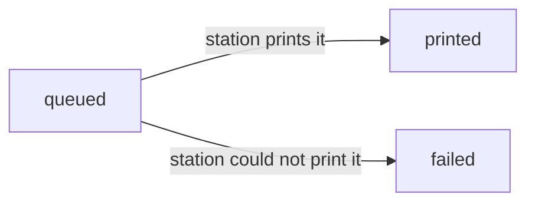

# The print queue

How a document or a label gets from "rendered" to "printed", and what a print station is actually draining.

## The problem it solves

Printing is a physical act a request cannot wait for: a receipt or a label may be requested from a phone with no
printer attached, from a branch whose print station is offline, or at a moment when nobody is standing at the
counter to collect it. `IPrintQueue.EnqueueAsync` therefore never prints anything itself — it writes a row to
`platform.print_jobs` and returns. A station drains the table on its own schedule, and the identity a caller queued
is stable and retrievable however long that takes.

**A queued job that is never drained stays queued for ever and blocks nothing**
([`../architecture/invariants.md`](../architecture/invariants.md) line 339). Printing is deliberately eventually
consistent: no confirmation, invoice or payment may fail because a print job sat unresolved, and nothing in this
table is ever a precondition for another module's write.

## Statuses and their one-way transitions

A job is created `queued` and moves exactly once, to `printed` or to `failed`, and never back. There is no retry
transition: a failed job is a fact about what happened, and a station that wants to try again enqueues a fresh job
through the module that originally asked for the print (Billing today), because that module — not the queue — knows
what artefact to point at.

The two resolving mutators, `PrintJob.TryMarkPrinted` and `PrintJob.TryMarkFailed`, refuse in memory once a job has
left `queued`. The genuinely concurrent case — two stations both loading the same queued row before either has
saved — is caught by the `xmin` token `PlatformDbContext` maps onto `print_jobs`: the loser's save throws
`DbUpdateConcurrencyException`, which `PrintStationQueue` turns into `print_job.already_resolved` rather than a
silent second write. Both paths — the in-memory refusal and the caught concurrency exception — answer a caller the
same way, because to a station they mean the same thing: there is nothing left here to resolve.

## The drain protocol

1. **List.** `IPrintStationQueue.ListQueuedAsync(branchId, limit)` returns a branch's still-`queued` jobs, oldest
   first. It takes the branch as a parameter and never reads an ambient context, so the authorisation decision —
   which branch a caller may drain — stays in the host that composes a route over this port
   (E07-F01-5b), not in Platform.
2. **Resolve.** The station streams the artefact by `payloadReference` through whichever route re-authorises it
   (E07-F01-5b's document route, for a document; the label route of E07-F01-7, once it exists), and then reports the
   outcome: `MarkPrintedAsync(jobId, by, station)` or `MarkFailedAsync(jobId, by, station, reason)`. A failure with
   no reason is refused before the database is touched — `ArgumentException.ThrowIfNullOrWhiteSpace(reason)` — because
   a failure nobody can act on is worse than no record at all.
3. **Audit.** Both resolutions write `platform.print_job.printed` or `platform.print_job.failed` through
   `IAuditWriter` before the row's own save, so the entry and the resolution commit or roll back together. The
   actor is an identifier, never a name.

## What `payloadReference` is, and the contract it imposes

`payloadReference` is an **opaque object-storage key**, not a document identifier a station looks up. Both of
today's callers — `DocumentArtifactHandler`'s invoice and receipt print routes — already pass `artifact.ObjectKey!`,
which is what lets this table be verified end to end without waiting for the label side (#191) to exist. **A module
that queues a print job must therefore render and store its artefact first, and pass that key** — rendering on
demand at print time is not an option this table supports, because nothing here dereferences the key to produce one.

This is never disclosed to a caller who asks for anything but the bytes: it is never returned by a listing endpoint,
never logged, and never a metric or trace attribute (CLAUDE.md section 4 item 9 — media is never given a URL).
`ListQueuedAsync` and `FindAsync` return it anyway, because the station itself is the one caller with a legitimate
reason to know it, and it never dereferences it either — a queued job whose object has since been deleted is still
listable, because listing does not touch object storage.

## What is audited, and what is not

Every resolution is audited. Enqueuing is not audited by this table directly — the queueing module already records
its own action (`billing.invoice.printed`, for example) and names the print job's identifier in it, which is enough
to trace the two together without a second, redundant entry here.

## The fallback ladder

Label printing (once #191 exists to queue one) follows the ladder
[`../nfr/support-matrix.md`](../nfr/support-matrix.md) section 7.2 already fixes: a device with a printer attached
prints directly through the browser; failing that, a branch with a print station drains this queue; failing that, a
label PDF is downloaded and printed from a connected device, with an unprinted label recorded as an exception. This
table exists for exactly the middle rung.

## What is out of scope here

The four `/api/v1/print-station/**` routes, the station permission and its resource scope, the
`frame-src 'self'` policy widening, and the client screens are **E07-F01-5b**, which follows this table. The
network or local print bridge that will eventually drain a branch's queue automatically is **#205** (of #55); until
it exists, a branch's queue is drained by whatever E07-F01-5b's routes let a station do by hand. Kiosk printing and
station-device setup are **E07-F01-6**.
