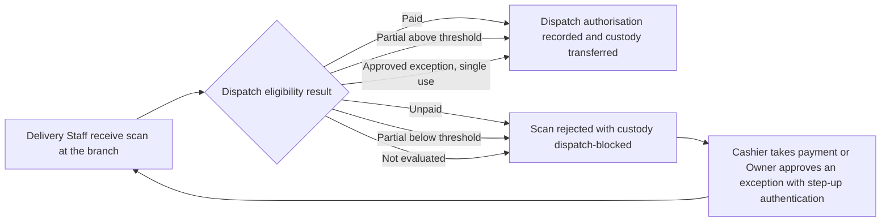

# HyFib Tailor 360 — Product overview

This document is the entry point to the HyFib Tailor 360 product requirement set. It describes the business the
system serves, the roles that use it, the end-to-end journey of a garment from measurement to feedback, the twelve
product outcomes the platform must deliver, and how the fifteen delivery epics map onto those outcomes. It is a
requirements document, not a design document: the architecture that realises it is recorded in
[`../IMPLEMENTATION_PLAN.md`](../IMPLEMENTATION_PLAN.md) Section 4 and, once issue #18 lands, in `../architecture/`.
Every term used here is defined in [`glossary.md`](glossary.md); everything an administrator may change without a
deployment is listed in [`configurable-vs-fixed.md`](configurable-vs-fixed.md); everything still awaiting an owner
decision is registered in [`assumptions-and-open-decisions.md`](assumptions-and-open-decisions.md).

---

## 1. The business

HyFib Tailor 360 is an operations platform for a ladies' tailoring business in Tamil Nadu. Customers bring or buy
material, are measured at the counter, choose a stitching category and design, and collect or receive the finished
garment after quality control and payment. The business runs one or more branches under a single legal entity.

| Fact | Value | Source |
| --- | --- | --- |
| Legal structure | One organisation, one or more branches, all in India | Plan assumption A1 |
| Currency | INR only | Plan assumption A1 |
| Tax regime | GST-registered; CGST/SGST for intra-state supply, IGST for inter-state, decided by place of supply | Plan D10, A1 |
| Financial year | April to March; document numbers are allocated per branch and financial year | Plan D9, D10 |
| Timezone | Branch IANA timezone, default `Asia/Kolkata`; all timestamps stored in UTC | Plan D11 |
| Languages | English (`en-IN`) at launch, Tamil (`ta-IN`) catalogue alongside; customer-facing pages follow the customer's language | Plan Section 4.6, #19 |
| Users | Staff only. Customers never hold accounts; they receive expiring, purpose-bound links for estimate, status and feedback | Plan assumption A2 |
| Devices | Android and iOS phones and tablets, desktop browsers, keyboard-wedge scanners, thermal label printers, A4 printers | Plan assumption A4 |
| Scale baseline | 20–50 concurrent users per branch, 100–500 orders per branch per month, about five images per garment | Plan assumption A3 — **proposed, to be confirmed** by #19 |

The application is an installable PWA served by an ASP.NET Core modular monolith behind a backend-for-frontend,
with PostgreSQL and private object storage (plan D1–D5). Delivery is portable: the same container images run under
Docker Compose on a single VM and, later, under Kubernetes (plan D17).

---

## 2. The eight roles

Roles are **default bundles of permissions**, not hard-coded behaviour. Every request is authorised on the
permission plus the branch scope of the principal, so a role can be re-cut without code changes (plan Section 4.4,
issue #24). The eight roles below are the operational vocabulary used throughout this documentation set.

| Role | Works from | What they do | Modules they mainly touch |
| --- | --- | --- | --- |
| Reception | Branch counter, phone or tablet | Finds or creates the customer, records consent, captures material and reference images, builds the order draft with categories, service types and design options, issues the estimate, confirms the order, prints labels, takes the advance | Customers/Measurements, Catalog/Design, Media, Orders/Workflow, Custody/Barcode |
| Tailor Master | Workshop, tablet or desktop | Starts production and pins the workflow version, assigns garment jobs against capability and capacity, runs the workboard, decides rework after a failed QC, approves capability grants | Orders/Workflow, Custody/Barcode |
| Tailor | Workshop, phone | Scans a garment job to take custody, starts and completes phases, records material issue, consumption, return and wastage, hands the garment on | Orders/Workflow, Custody/Barcode, Inventory |
| Inventory Clerk | Store room, phone or desktop | Maintains items, suppliers, locations and reorder rules, records purchase receipts, responds to low-stock alerts, runs stocktakes and explains variances | Inventory |
| Cashier | Branch counter, tablet or desktop | Records advances and payments, allocates them to invoices, issues receipts, opens and closes the cashier session with a denomination count, reconciles | Billing/Payments |
| Delivery Staff | Branch and on the road, phone | Works the delivery queue, performs the receive scan that evaluates the dispatch gate, dispatches, confirms the doorstep handover with OTP or signature, records failed and returned deliveries | Custody/Barcode, Notifications/Feedback |
| Branch Manager | One or more branches | Supervises the day: exception queues, holds, reschedules, custody reconciliation cases, stocktake and variance approvals, branch-level configuration within the permissions granted | All modules, branch-scoped |
| Owner | Business-wide | Approves the catalogue, prices and tax configuration, the permission matrix and the alert policies; approves dispatch exceptions; reads cross-branch reports | Reporting, Billing/Payments, Identity/Admin |

### 2.1 Other principals the platform recognises

These are not shop-floor roles but they appear in the permission catalogue and in audit records.

| Principal | Purpose |
| --- | --- |
| Admin | Administers users, branches, roles and configuration; a superset of Branch Manager without shop-floor duties |
| Measurement Staff | A permission bundle (`measurements.capture`) that may be granted to Reception or held by dedicated staff; the "Measurements needed" queue is theirs |
| Auditor | Read-only access to audit events, financial records and deactivated customers; never a state-changing principal |
| HyFib super-user | Vendor-side principal permitted to change feature flags (`admin.feature_flags`) with a mandatory reason and evaluation audit |
| `SystemPrincipal` | The worker's own identity, constructible only through `IWorkerScopeFactory` from a declared `[WorkerJob]` scope; used for retention, projections and scheduled evaluation |

> **Open decision.** The final role list and the default role-to-permission grants are owner decisions —
> plan Section 11 item 13, registered as OD-13 in
> [`assumptions-and-open-decisions.md`](assumptions-and-open-decisions.md). In particular, whether Branch Manager
> is a distinct role or a branch-scoped variant of Admin, and whether Measurement Staff remains separate from
> Reception, are decided there. The permission matrix itself is delivered by issue #24 as
> `../security/permission-matrix.md`.

---

## 3. The end-to-end journey

The happy path runs from a customer arriving at the counter to a recorded feedback response. Every step is a
state-changing, authorised, audited command; the garment itself is tracked by an opaque barcode identity from
confirmation onward (plan D9, issues #35–#37).

```mermaid
flowchart TD
    A[Reception finds or creates the customer and records consent] --> B[Measurement capture — draft becomes a confirmed measurement version]
    B --> C[Garments added — category, service type, design options, material and reference images]
    C --> D[Estimate issued and shared as an expiring customer link]
    D --> E[Order confirmed — measurement, design and price snapshots frozen, display numbers allocated]
    E --> F[Barcode identity allocated inside the confirmation transaction and label printed]
    F --> G[Advance recorded by the Cashier]
    G --> H[Tailor Master starts production, pins the workflow version and assigns each garment job]
    H --> I[Tailor scans the label to take custody]
    I --> J[Cutting, specialist work, stitching and finishing phases recorded with server timestamps]
    J --> K[QC recorded against the published checklist version]
    K --> L[Ready-for-delivery gate evaluates workflow, QC, evidence, holds, dependencies and custody]
    L --> M[Job enters the delivery queue for Delivery Staff]
    M --> N[Cashier records the balance payment and issues the receipt]
    N --> O[Delivery Staff receive scan evaluates dispatch eligibility and records the dispatch authorisation]
    O --> P[Dispatch — custody passes to Delivery Staff]
    P --> Q[Doorstep delivery confirmed with OTP or signature and optional photo]
    Q --> R[Feedback invitation sent on the consented channel]
    R --> S[Feedback recorded — a low rating or an alteration request opens a service-recovery case]
```

### 3.1 What each step guarantees

| Step | Actor | Guarantee | Issue |
| --- | --- | --- | --- |
| Customer and consent | Reception | Phone is validated but not unique; duplicates are scored and merged only by an authorised decision; consent purposes are versioned records | #26 |
| Measurement capture | Reception or Measurement Staff | Values are stored canonically in millimetres against a published template version; a draft is consumed exactly once; confirmed versions are never edited | #27, #28 |
| Design and images | Reception | Design selections are validated by configurable rules and frozen as a design snapshot that renders without a catalogue lookup; images are quarantined, scanned, stripped of metadata and re-encoded before they are usable | #30, #31 |
| Estimate | Reception | A priced snapshot of the draft, numbered `E-<branch>-<FY>-…`, never posted and never numbered in the invoice sequence; shared through an expiring, purpose-bound customer link | #32a |
| Order confirmation | Reception | One transaction: catalogue availability validated, snapshots taken, display numbers allocated, barcode identity allocated, outbox events written | #32a, #35 |
| Start production | Tailor Master | Pins the published workflow version onto the garment job; the pinned version never changes and order revision is refused afterwards | #33 |
| Phases and custody | Tailor | Scan events are append-only and idempotent per actor and client event UUID; the server validates the expected custodian, location and prerequisites | #33, #37 |
| QC | Tailor Master or the responsible role | The evaluated criteria are copied into the result so it renders identically after a checklist change; failure routes to rework without losing history | #34 |
| Ready-for-delivery | The gate alone | `ready_state` is computed only by the gate from workflow completion, QC pass, evidence, open holds, `deliver_together` dependencies and custody reconciliation | #34 |
| Payment | Cashier | Payments, allocations, refunds and receipts are append-only; the balance is posted charges minus allocations minus credits plus refunds | #43 |
| Dispatch | Delivery Staff | The dispatch gate **fails closed**: with no evaluation the scan is rejected | #37, #43, #48 |
| Delivery confirmation | Delivery Staff | Recipient confirmation is never skipped silently; the doorstep scan references an online dispatch authorisation and is re-validated on replay | #48 |
| Feedback | Customer, then Branch Manager | One service-recovery case per low rating or alteration request; accepted alterations open a garment job through the Orders contract | #49 |

### 3.2 The dispatch gate

Payment is not an afterthought at the door: it is a server-side gate evaluated by Billing and enforced by Custody.
Neither Custody nor Delivery computes a balance.

A dispatch exception is single-use, bound to the order, the job set, a maximum outstanding amount, the policy
version and an expiry of at most 72 hours; the approver must be a different person from the dispatcher. Jobs that
failed QC, are on hold, or are in the wrong custody have **no** exception path (issue #43).

### 3.3 Exceptions the documentation set must cover

The exception catalogue below is mapped step by step in `workflows/` and `state-transitions.md` (both delivered by
issue #17 alongside this document): duplicate customer, missing material, changed measurements, rejected QC,
rework, late order, damaged label, cancelled order, refund, unpaid dispatch attempt and negative feedback.

---

## 4. The twelve product outcomes

These are the product outcomes of plan Section 2.1 (derived from roadmap issue #1), numbered here so that the rest
of the documentation set can reference them. They are outcomes, not features: each is satisfied only when the
behaviour is enforced by the server and evidenced by tests.

| ID | Outcome | What "done" means |
| --- | --- | --- |
| O1 | Customer identity, contact details and consent | A customer is found or created without avoidable duplicates; consent is a versioned record per purpose and is checked server-side before any message or image use |
| O2 | Measurements | Every category has a published measurement template version; captured values are versioned, reusable and never edited in place; orders keep the exact version used |
| O3 | Material and reference images | Images are private, virus-scanned, metadata-stripped, re-authorised on every request, retained by policy and never served from a stable storage URL |
| O4 | Configurable stitching categories | Blouse with Pattern and Aari work, Salwar, Lehenga, Gown and Kids ship as seed data, and administrators add further categories **without a code change or deployment** |
| O5 | Shape and design selections | Design options are chosen per garment, validated by configurable rules and frozen into a snapshot the Tailor sees exactly as approved |
| O6 | Multi-garment orders, job cards and assignment | One order carries many garment jobs, each independently numbered, snapshotted, assignable and traceable, with declared dependencies between jobs |
| O7 | QC, rework and alterations | A failed QC routes to rework without losing history; alterations before and after delivery are first-class, priced and communicated |
| O8 | Delivery | A payment-cleared delivery queue, two-stage dispatch, doorstep confirmation, and compensating custody on failed or returned deliveries |
| O9 | Barcode tracking of every garment | Opaque, namespaced, checksummed payloads with **no PII**, from intake through Tailor Master, production, QC, delivery team, payment clearance, dispatch and feedback |
| O10 | Inventory | An immutable stock ledger behind every balance, with reservations, consumption, wastage, purchasing, low-stock alerts, stocktake and valuation |
| O11 | GST billing and payments | Configurable prices and tax, immutable posted invoices, payments and receipts, sales and GST reporting, and a payment-dependent dispatch gate |
| O12 | Trustworthy operation | Complete auditability, security, observability, backups, disaster recovery, automated testing and controlled releases |

---

## 5. How the epics map to the outcomes

Epic codes and their child issues are fixed by plan Section 6.4. The theme names below are derived from each
epic's child issues; the authoritative titles live on the GitHub epic issues (#2–#16).

### 5.1 Outcome-bearing epics

| Outcome | Epic | Theme | Issues |
| --- | --- | --- | --- |
| O1 | E04 | Customers and measurements | #26 |
| O2 | E04 | Customers and measurements | #27, #28 |
| O3 | E05 | Catalogue, design and media | #31 |
| O4 | E05, E04 | Catalogue, design and media | #29, #27 |
| O5 | E05 | Catalogue, design and media | #30 |
| O6 | E06 | Orders, job cards and production workflow | #32, #33 |
| O7 | E06, E11 | Orders and workflow; notifications and feedback | #34, #49 |
| O8 | E11, E07 | Notifications, delivery and feedback; custody | #48, #37 |
| O9 | E07 | Barcode identity, scanning and custody | #35, #36, #37 |
| O10 | E08, E10 | Inventory and stock ledger; reporting | #38, #39, #40, #46 |
| O11 | E09, E10, E07, E11 | Pricing, GST billing and payments; reporting; dispatch gate | #41, #42, #43, #44, #37, #48 |
| O12 | E14, E15 | Security, privacy and observability; environments, backups, QA and launch | #56, #57, #58, #59, #60, #61 |

### 5.2 Enabling epics

Five epics carry no product outcome of their own; every outcome depends on them.

| Epic | Theme | Issues | Why every outcome needs it |
| --- | --- | --- | --- |
| E01 | Product and architecture baseline | #17, #18, #19 | This document set, the architecture decision records and the measurable non-functional requirements |
| E02 | Platform foundation | #20, #21, #22 | Buildable repository, persistence conventions, transactional outbox, audit writer, feature flags, CI gates |
| E03 | Access control | #23, #24, #25 | Authentication behind the BFF, the permission and branch-scope model, audited administration |
| E12 | PWA experience, accessibility and performance | #50, #51, #52 | The design system, installable PWA, offline scan queue, WCAG 2.2 AA and performance budgets |
| E13 | API standards, integration events and adapters | #53, #54, #55 | Versioned API, idempotency, signed webhooks, replaceable payment, messaging, accounting and printing adapters |

### 5.3 Delivery order

Waves are fixed by plan Section 6.2: W0 baseline (E01), W1 platform and access control (E02, E03, part of E12 and
E13), W2 customers, catalogue and media (E04, E05), W3 orders, workflow and custody (E06, E07 with the pricing
engine of E09), W4 inventory, billing, reporting, notifications and delivery (E08, E09, E10, E11), W5 hardening,
security, operations and launch (E12, E14, E15). One issue equals one branch equals one pull request.

---

## 6. Product principles that constrain every requirement

These are non-negotiable across the whole documentation set (plan Section 2.2).

1. **Configuration, not code.** Categories, service types, measurement templates, design options, workflow phases,
   QC checklists, taxes, prices, alert policies, notification templates, retention and feature availability are
   data. See [`configurable-vs-fixed.md`](configurable-vs-fixed.md).
2. **Immutable financial and custody history.** Posted invoices, payments, receipts, stock-ledger entries, scan
   events, custody transfers, QC results and audit events are append-only; corrections are compensating records.
3. **Snapshots, not live lookups.** A confirmed garment job carries copies of the measurement, design and price
   data it was confirmed with, so republishing the catalogue never changes work in flight.
4. **No PII in barcodes.** Payloads are opaque, namespaced and checksummed; display numbers are never lookup keys
   on customer-facing surfaces.
5. **Reporting is never authoritative.** Financial, stock, workflow and custody truth lives in the owning module;
   projections carry a visible freshness indicator and are reconciled.
6. **Module ownership.** One PostgreSQL schema per module; modules talk through `Contracts` projects and events,
   never across tables.
7. **Deny by default.** Every state-changing endpoint enforces authentication, authorisation, validation,
   idempotency where it is retried, and audit logging.
8. **Consent and retention are enforced, not documented.** Consent is queried server-side before a message is sent
   or an image is served; retention runs as a job with holds and per-object audit.

---

## 7. Document map

| Document | Purpose | Delivered by |
| --- | --- | --- |
| [`00-overview.md`](00-overview.md) | This document | #17 |
| [`glossary.md`](glossary.md) | Authoritative definitions and Tamil shop-floor terms | #17 |
| [`configurable-vs-fixed.md`](configurable-vs-fixed.md) | What administrators change without a deployment | #17 |
| [`assumptions-and-open-decisions.md`](assumptions-and-open-decisions.md) | Assumptions, the owner decision register and scope exclusions | #17 |
| `workflows/` | Current practice and target workflow per category, plus branch scenarios | #17 |
| `state-transitions.md` | Transition, actor, preconditions, outputs, audit event, exception behaviour | #17 |
| `raci.md` | Responsibility assignment across the eight roles | #17 |
| `category-hierarchy.md` | The confirmed initial category hierarchy and the links each service type carries | #17 |
| `measurement-templates.md` | Proposed field sets per category, the seed source for #27 | #17 |
| `design-options.md` | Proposed design option groups and rules, the seed source for #30 | #17 |
| `walkthroughs.md`, `reviews/exception-review.md` | End-to-end walkthrough and exception review evidence | #17 |
| [`../IMPLEMENTATION_PLAN.md`](../IMPLEMENTATION_PLAN.md) | Architecture, decisions D1–D21, waves and per-issue blueprints | #1 |
| `../architecture/`, `../adr/` | C4 views, module ownership, invariants, conventions, ADR-0001…0013 | #18 |
| `../nfr/`, `../process/` | Support matrix, capacity, SLOs, data classification, Definition of Done, release gates | #19 |
| `../security/permission-matrix.md` | The owner-approved permission matrix | #24 |

---

## 8. Status

This overview is **drafted for the workshop**, not approved. Approval of the workflow maps, the glossary and the
category hierarchy is the W0 exit gate (plan Section 6.2). Open items are recorded only in
[`assumptions-and-open-decisions.md`](assumptions-and-open-decisions.md), which mirrors plan Section 11.
