# Assumptions, open decisions and scope

This document is the single place where HyFib Tailor 360 records what the design currently **assumes**, what is
still **undecided and blocking**, and what is deliberately **out of scope**. Nothing elsewhere in the documentation
set may present an item listed here as settled. It mirrors and expands plan
[Section 11](../IMPLEMENTATION_PLAN.md) — the decisions required from the business owner — and the assumptions A1 to
A5 of plan Section 3. Read it with [`00-overview.md`](00-overview.md),
[`configurable-vs-fixed.md`](configurable-vs-fixed.md) and [`glossary.md`](glossary.md).

**Register dates.** The decisions were raised in the implementation plan on 2026-09-03 and were transcribed into
this register on 2026-09-04. Every status line carries its own date, and the date is updated in the same pull
request that changes the status.

---

## 1. How to read this document

| Field | Meaning |
| --- | --- |
| **Decision** | The question the business owner must answer, in the owner's language rather than the engineer's |
| **Why it is needed** | What cannot be designed, priced or built until the answer exists |
| **Blocks** | The issues, waves or documents that stall without it |
| **Owner** | The person accountable for the answer. "Business owner" is the HyFib proprietor; a co-signer is named where a professional opinion is required |
| **Status** | One of **Open**, **Proposed** (a default is in place and will stand unless the owner objects), **Decided** (with the date and where the decision is recorded), or **Superseded** |

A **Proposed** status means work continues against the plan's engineering default, which a reviewer may overturn in
the first pull request that touches it. It does not mean the question is closed. Any numeric target reproduced from
the plan is **proposed, to be confirmed** by issue #19 until that issue's stakeholder review is signed.

---

## 2. Assumptions

These are the working assumptions the whole design rests on. Each is stated as the plan states it, together with
what would have to change if it turned out to be wrong.

| ID | Assumption | Why it is held | What breaks if it is wrong | Confirmed by |
| --- | --- | --- | --- | --- |
| **A1** | One legal entity — the organisation — with one or more branches, all in India; INR only; GST-registered | Fixes tenancy to branch-aware single tenancy (plan D7), the money type and the tax model (plan D10) | A second legal entity would require multi-entity tenancy: separate GST registrations per entity, separate document sequences, entity-scoped authorisation and a data-partitioning decision. This is out of scope — see section 5 | OD-06 confirms the branch list; a second entity would need a new architecture decision record |
| **A2** | Staff-only application with local accounts using a password plus TOTP or passkeys. Customers do not hold accounts; they interact through expiring, purpose-bound links for estimate, status and feedback | Fixes the BFF cookie session model (plan D5), the customer-link mechanism and the absence of a customer identity store | Federation with an external identity provider would change the authentication issue (#23) and the session and revocation model. Customer accounts would add a whole identity surface, out of scope — see section 5 | OD-12 — **still open. #23 was built under this default on 2026-09-05**; see the OD-12 row in section 3 for what would have to be revisited |
| **A3** | Concurrent users about 20 to 50 per branch; orders about 100 to 500 per branch per month; about five images per garment | Gives issue #19 a starting point for capacity, performance budgets and the hosting sizing | Materially larger numbers change the connection budget, the single-VM baseline and the reporting strategy | Issue #19 replaces these with measured targets — **proposed, to be confirmed** |
| **A4** | Hardware: Android phones and tablets, iPhone and iPad, desktop browsers, USB or Bluetooth keyboard-wedge scanners, thermal label printers via a print station or bridge, and A4 printers. Counter and workshop devices may be shared between staff | Fixes the scanner abstraction with camera, keyboard-wedge and manual sources, the print-queue and print-station design, and the shared-device session questions | An unsupported scanner or printer changes the label and scanning issues (#35, #36); genuinely personal devices would simplify the session model | OD-07 for the matrix; OD-12 for shared-device authentication |
| **A5** | Baseline sizing: 3 branches × 500 orders per month × 2 garments × 5 images × about 1.5 MB after re-encode, roughly 22 GB of originals per year plus about 30 per cent derivatives; database growth under 5 GB per year; fewer than 5,000 scans per day. Baseline production VM 4 vCPU, 16 GB RAM, 200 GB SSD; object storage 100 GB with growth alerts; staging 2 vCPU, 8 GB | Sizes the hosting model, the backup retention and the object-storage budget | Higher image volume or retention pushes storage cost and backup windows; more branches change the connection budget | OD-02 with issue #19 — **proposed, to be confirmed** |

---

## 3. Owner decision register

Twenty-three decisions. `OD-01` to `OD-15` are transcribed from plan Section 11 in the plan's order and correspond
one-to-one with plan Section 11 items 1 to 15 and are the stable reference used across the documentation set.

| Decision | Why it is needed | Blocks | Owner | Status |
| --- | --- | --- | --- | --- |
| **OD-01 Backend platform and build environment.** Keep ASP.NET Core on .NET 10 as the roadmap states and either allow the SDK, NuGet, npm and Playwright hosts for cloud sessions or run backend issues on a self-hosted runner or dev container with Docker; alternatively switch to a Node.js and TypeScript backend | The plan assumes ASP.NET Core. The environment currently used for planning has no .NET SDK and blocks the Microsoft download hosts, so no backend issue can be built or tested until one of the routes is chosen | Wave 1 in its entirety: #20, #21 and every backend issue after them; ADR-0002 cannot be marked final | Business owner, with the technical reviewer | **Open** — raised 2026-09-03, recorded 2026-09-04; needed **before W1 starts** |
| **OD-02 Hosting model and indicative monthly budget.** Cloud, and which provider, or on-premises | Fixes the infrastructure-as-code tooling, the backup destination, the TLS approach, and the availability, RPO and RTO figures that issue #19 must state per hosting model before one can be selected | #19 SLO selection and the signed compatibility statement; ADR-0010; #59 environments and CI/CD; #60 backups and disaster recovery | Business owner | **Open** — raised 2026-09-03, recorded 2026-09-04; needed **before W0 exit** (plan Section 6.2 W0 exit gate, Section 11 item 2) |
| **OD-03 Providers.** SMS, WhatsApp and email vendors; the payment gateway for UPI and card; the accounting export target | Real adapters cannot be contract-tested, priced or given a support owner until the vendors are named. Defaults are fakes and no adapter is enabled without a support-ownership document | #47 notification adapters; #55 payment, accounting and print-bridge adapters; the go-live notification plan | Business owner | **Open** — raised 2026-09-03, recorded 2026-09-04; needed **before W4** |
| **OD-04 Payment rule for dispatch and partial-delivery policy.** Full payment, a partial threshold, a per-job share, or approved exceptions; who may approve an exception — Owner only, or Admin too; whether advances may unlock dispatch; whether Delivery Staff may collect the balance at the doorstep | The dispatch gate is the business's cash-protection control. The rule decides the eligibility semantics, the exception approver's permission and step-up requirement, and whether a doorstep take-payment screen exists at all | #43 dispatch eligibility and exception approval; #48 partial-delivery policy and two-stage dispatch; the #37 physical rehearsal; the dispatch rows of [`configurable-vs-fixed.md`](configurable-vs-fixed.md) | Business owner | **Open** — raised 2026-09-03, recorded 2026-09-04; needed **before W4** |
| **OD-05 Valuation method, rounding and round-off conventions, and the statutory retention period for GST records** | Valuation is weighted average by default with FIFO optional, and the accountant's golden-master examples are the acceptance test for both the pricing engine and the valuation report. GST record retention drives the retention policy and the backup window | #40 valuation; #41 rounding and the accountant golden master; #57 retention and privacy | Business owner, co-signed by the accountant | **Open** — raised 2026-09-03, recorded 2026-09-04; needed **before W3 for rounding, before W4 for valuation**. **#147 shipped the rounding half under a documented default**: half away from zero to paise, once per printed component, sums never re-rounded, the document round-off explicit — as [`conventions.md`](../architecture/conventions.md) section 1.2 already fixed — plus one reading the convention had not covered: an inclusive rate backs the rounded tax components out of the quoted amount, so the customer pays the quoted price to the paisa and the rounding lands on the taxable value. The golden master in `tests/fixtures/billing/` pins every case and is what the accountant signs |
| **OD-06 Branches at launch**, with their timezones, working calendars and GST registrations | Branch code, timezone and working calendar drive every due date, SLA clock and report cut-off; the GST registration drives place of supply and the document sequences | #25 branch administration, which builds the register itself — code, name, timezone, address, contacts and the GST registration reference — and defers the **working calendar and holidays to #33**, the issue that first computes a promise date, because their semantics (roll forward or back off a holiday, half-days, branch-specific against organisation-wide) have no consumer to source them from until then; #42 invoice numbering and GST registration; the seed data for the interim staging environment | Business owner | **Open** — raised 2026-09-03, recorded 2026-09-04; needed **before W1 exit**. #25 shipped the register on 2026-09-07 — code, name, timezone, address, contacts and the GST registration reference — with the calendar deferred as described. A second thing #25 declined to invent is the **tailor-skills attribute** the plan lists on `IUserDirectory`: the vocabulary, whether it is seeded or free text, and whether it gates an assignment or only ranks it are product decisions, and the issue that first reads them is #45 |
| **OD-07 Device, browser and printer matrix to support**, including hardware scanners and label printers | The matrix is the acceptance boundary for cross-browser testing, the scanner fallbacks and the label templates. Without it, "works on the shop's devices" is untestable | #19 support matrix; #35 label printing evidence; #36 scanner fallbacks; #52 cross-browser and accessibility gates | Business owner | **Open** — raised 2026-09-03, recorded 2026-09-04; needed **before W0 exit** |
| **OD-08 Retention periods** for measurements, images, feedback free text, notification bodies, logs and backups | Retention is enforced by a job, not by a promise. Each class needs a period before the data-classification document can be signed and the retention job can be configured | #19 data classification; #57 retention and data-subject requests; #47 notification body retention | Business owner, co-signed by the accountant for financial records | **Open** — raised 2026-09-03, recorded 2026-09-04; needed **before W1 exit** |
| **OD-09 Label format.** Thermal label size, and whether a QR code accompanies the Code 128 | Decides the label template dimensions, what human-readable cues fit, and which printers must be tested. The barcode payload format itself is fixed in code and is not part of this decision | #35 label templates and printed test sheets | Business owner | **Open** — raised 2026-09-03, recorded 2026-09-04; needed **before W3** |
| **OD-10 Initial catalogue, measurement templates, design options and QC checklists**, reviewed from the seeded drafts | The seed data is drafted by issue #17 for the workshop. Publishing unreviewed field sets or checklists would put wrong instructions in front of tailors | #17 approval and the W0 exit gate; the seed data of #27, #29, #30 and #34 | Business owner, with the Tailor Master | **Open** — raised 2026-09-03, recorded 2026-09-04; the #17 category hierarchy is needed **before W0 exit**, the reviewed templates, design options and checklists **before W2** |
| **OD-11 Amend issue #41's declared dependency.** Replace the dependency on E06-F01 with the pricing contract, and add E09-F01 to #32's dependencies | Issue #41 and issue #32 currently declare a dependency cycle. The plan resolves it with a pricing contract that never references an order entity, but the issue text should match | The start of W3: #41 then #32a. If declined, the documented fallback applies and #32 ships with a feature-flagged pricing stub | Business owner, as the issue author | **Proposed** — the plan's resolution stands unless declined; raised 2026-09-03, recorded 2026-09-04; needed **before W3** |
| **OD-12 Primary authentication strategy and devices.** Local staff accounts with password plus TOTP or passkeys, or federation with an external identity provider; which roles beyond Owner, Admin and Cashier must use MFA; whether counter and workshop devices are shared per station or personal, and for which roles password-only re-login on a trusted device is acceptable | Decides the identity issue's scope, the MFA-required set, and whether a revocable trusted-device cookie is built for shared counter devices | #23 authentication, sessions, MFA and recovery; #24 the `RequiresMfa` flags in the permission catalogue | Business owner, with the technical reviewer | **Open** — raised 2026-09-03, recorded 2026-09-04; needed **before W1**. **#23 shipped on 2026-09-05 under the A2 default** — local staff accounts, password plus TOTP, passkeys behind operator configuration, a revocable trusted-device cookie, and no customer accounts. Choosing federation instead would not be an amendment: the session model, the revocation model and the whole of `Identity.Infrastructure/Security` are built on local credentials, and `docs/security/threat-models/authentication.md` would be superseded rather than revised. The MFA-required set is the one part still genuinely open — it is configuration (`Identity:Mfa`), defaulting to Owner, Admin and Cashier plus any role holding `admin.*` or `billing.*`, and takes effect once #24 supplies roles |
| **OD-13 Permission matrix.** Approve the default role-to-permission grants and any custom roles required at launch | Authorisation is deny-by-default and the matrix is the contract every endpoint's tests assert against. It also settles whether Branch Manager is a distinct role or a branch-scoped Admin, and whether Measurement Staff is separate from Reception | #24 and, through it, every business module endpoint; the "Who may change it" column of [`configurable-vs-fixed.md`](configurable-vs-fixed.md); the role table in [`00-overview.md`](00-overview.md) | Business owner | **Open** — raised 2026-09-03, recorded 2026-09-04; needed **before W1 exit**. **#24 shipped the matrix on 2026-09-06 under a documented default**: twelve seeded roles, Branch Manager among them as a distinct role, and Measurement Staff as a bundle assigned to nobody whose permissions Reception also holds. The default was chosen because it is the only reading under which no existing document has to be amended — [`state-transitions.md`](state-transitions.md) line 225 names Branch Manager as the sole actor for `orders.reschedule`, [`00-overview.md`](00-overview.md) defines Admin as "a superset of Branch Manager", and [`raci.md`](raci.md) makes it accountable for four rows. **Deciding otherwise is not an amendment**: folding Branch Manager into Admin moves 76 grants between two rows of the role register and needs no migration, no catalogue change and no endpoint change, and both readings of the Measurement Staff question already work with no code change at all. The consequence of each answer is tabulated in [`../security/permission-matrix.md`](../security/permission-matrix.md) section 2 |
| **OD-16 Dual confirmation for Owner-level administrative changes.** Whether a second administrator must approve a change to a role's grants, an account's roles, or a feature setting — and if so, who may approve, within what window, and for which of those actions | The #25 blueprint lists "dual confirmation for Owner-level changes" among its controls; the issue's own acceptance criterion reads "approved **step-up/confirmation**", and step-up is built and enforced by ARCH-018 in both directions. A second approver is a different control with a different cost: it needs a pending-change store, an approval expiry, a way to see what is waiting, and a rule for what happens when the shop has exactly one Owner — which is the common case for a single-branch shop and is why this cannot be defaulted safely | #25 shipped the administrative surface on 2026-09-07 with step-up, a mandatory reason and full before-and-after audit, and **without** a second approver, recording the gap here rather than inventing an approval model. Adding one later is additive: no migration to the existing tables, and the endpoints already carry the reason and the version an approval flow would need. Also touches #43's dispatch-exception approval, which has the same shape | Business owner | **Open** — raised 2026-09-07 by #25; needed **before W1 exit** |
| **OD-17 What a measurement-template field's order means, and how a step is named and moved.** Two questions with one answer between them. First: `display_order` is a single integer per field, global to the version, neither unique nor contiguous, and group order is *derived* from the display order of each group's first field (`TemplateVersion.InGroupOrder()`), so "move this field up one place" could mean swapping two numbers, renumbering the group, or renumbering the whole version — and each costs a different number of writes and a different audit trail. Second: `group_name` is free text on each field, with no group entity, no order column and no endpoint that lists, renames or moves a group, so renaming a step means writing every field that carries the old string and a rename is indistinguishable from a typo | The control cannot be built without an answer: it decides what pressing "move up" sends. It also decides whether a bulk field save or a group entity is owed, which is an API change rather than a screen change | #104, which shipped the control; a future bulk-rename or explicit group-ordering surface; any later API that adds a reorder endpoint | Business owner, with the Tailor Master for the step vocabulary and the technical reviewer for the write cost | **Open** — raised 2026-09-10 by #104. **#104 shipped under a documented default**: a move renumbers the whole version contiguously and then writes only the fields whose number actually changed. It is the only one of the three readings under which a within-group move cannot silently reorder the *groups* — because group order is derived from each group's first field — and the only one that removes ties, so the order on screen is the order stored rather than the order stored plus an alphabetical tie-break. The cost is bounded by the subtraction: the first move on a version normalises it, and every move after that on a contiguous version writes exactly the fields between the two positions, which is two for an adjacent swap. **Choosing otherwise is not an amendment** — the semantics live in one client module (`clients/pwa/src/admin/templateFieldOrder.ts`), no schema or endpoint depends on them, and no stored data would need converting. What #104 deliberately did **not** invent: a step is renamed one field at a time through the field editor's Step box, and there is no bulk rename and no group entity |
| **OD-18 What a stranded catalogue reference should do to the counter.** A published catalogue service type can end up pointing at a measurement template with no published version, because the two guards protecting INV-MTV-06 sit in different modules and a publication and a retirement that overlap can each observe the other's pre-write state. The reconciliation (#91) now detects that within a delivery of the event that caused it and records it as a breach. What it does **not** decide is whether the counter should then be stopped from ordering that service, or allowed to take the order and be told at capture time that there is nothing to measure by | Both answers cost a shop something real, and the cost is a business judgement rather than a technical one. Blocking makes an administrator's mistake with one template close a line of business until somebody notices; not blocking lets an order be taken that the workshop then cannot start. The window is narrow and both acts are rare, step-up-protected administrative ones, so this is a decision about the worst case rather than about the common one | Whether a breach flips `notOrderable`, whether `ICatalogAvailabilityQuery.IsOrderableAsync` consults the breach record, and what the intake screen says when it does; any later alerting policy on the breach record | Business owner, with the Tailor Master on what a counter should be told | **Open** — raised 2026-09-10 by #91. **#91 shipped under a documented default**: the reconciliation *records and does not block*. That is the reversible half — a breach row exists either way, so choosing to block later is a change to how the record is read rather than a change to what is stored, and no data would need converting. The reverse is not true: shipping the block first would mean a shop could stop taking orders overnight because an administrator retired the wrong template, before anybody had agreed that should happen |
| **OD-19 Whether a catalogue may be published ahead of its prices.** A published catalogue service type or design option names a price-list item code, and the code is checked against the price-list version that prices each branch the catalogue offers it at. What that check should do when *no* published price-list version prices the branch at all — refuse the catalogue, or let it through and let the counter find that nothing can be ordered there until a price list is published — is a question about the order in which a shop is set up, not about correctness | The two orders are both real: a new shop and a new branch both write the catalogue first and price it after, and the seed data publishes a catalogue with no price list at all; the opposite reading makes "publish the catalogue" impossible until every branch it names is priced. Refusing is the reading link 1 (measurement templates) takes, because a template is one specific thing the catalogue points at; a price list is branch-scoped and the catalogue names a code, not a version | Whether `catalog.price-list-not-published` is a warning or an error; whether `seed-synthetic` must publish a price list before it publishes the catalogue; what the intake screen says at an unpriced branch (E09-F01-3 refuses to price with no version in force) | Business owner, with the accountant | **Open** — raised 2026-09-12 by #146. **#146 shipped under a documented default**: the catalogue may be published ahead of its prices, and an unpriced branch is a **warning** on the catalogue's publication report; a code missing or retired in the version that *does* price the branch is an error, and the price list's own publication check refuses, from the other side, to retire the only version pricing a branch the catalogue offers priced services at, or to drop an item the catalogue names. **Choosing otherwise is not an amendment** to the schema — the severity lives in one validator (`PriceListCatalogValidator`), and the seed would then publish a price list first |
| **OD-20 Who may exceed a discount rule's counter threshold, and where a price list's currency is recorded.** Issue #41 lists "allowed roles by permission" against a discount rule and `currency INR` against a price list. #146 records neither column: anything above a rule's `maximum_without_approval` and up to its `maximum` is gated by the single permission `billing.override_price`, and the currency is recorded on the document (`docs/architecture/conventions.md` section 1.1 rule 4) rather than on the list, which E09-F01-3 writes into every calculation snapshot as `INR` | A per-rule permission or role list is a second authorisation model beside the permission catalogue, and would need a screen, a seed and a matrix row per rule; a currency on the list is a second place for one fact. Both are cheap to add later and expensive to remove, so neither is invented ahead of a request | Whether a `discount_rules.approval_permission` (or role list) column and a `price_lists.currency` column are added in an expand step; the override rows of [`configurable-vs-fixed.md`](configurable-vs-fixed.md) | Business owner, with the accountant for the currency question | **Open** — raised 2026-09-12 by #146; needed **before W4**, when the cashier's override screen is built |
| **OD-21 What a price-list version published ahead of its first day does to the branch until then.** Exactly one version of a list is published at a time and publishing retires its predecessor, so a version published in March with an effective date of 1 April leaves the branch with no version in force for the rest of March: the pricing engine refuses `billing.configuration-missing` naming the date rather than pricing on a version that does not yet apply. The alternative is a version model in which a retired version stays in force until its successor's first day | The refusal is safe but blunt: an administrator preparing April's rates early stops March's sales. Keeping the predecessor in force until the successor's date is the model a shop expects, and it changes what "published" and "retired" mean on both the tax configuration and the price list, so it is a decision rather than a fix | Whether publication of a version with a future `effectiveFrom` is refused, allowed with a warning, or allowed with the predecessor staying in force; the version-selection read in `PricingService` and the same on the tax configuration | Business owner, with the accountant | **Open** — raised 2026-09-12 by #147 (first noted in the review of #145). **#147 shipped under a documented default**: the refusal, with the date in the message, and no change to the version model. The engine reads one version per branch, so choosing the "predecessor stays in force" model later is a change to the read and to the publication checks, not to any stored figure |
| **OD-22 Whether one order may be invoiced in parts, and what becomes of an abandoned draft.** Issue #42 says an invoice is "generated from a confirmed order"; it does not say whether one order may carry more than one invoice — a customer who collects two of four garments and pays for those — nor what a cashier does with a draft raised in error. #153 ships both under a documented default: a draft names the garment jobs it covers, one live invoice per garment job is enforced at the database, and a draft may be **discarded** with a recorded reason, which frees its jobs for another draft. A posted invoice is never discarded; #154 cancels it by a compensating record | Partial invoicing is a business rule with a cash-protection consequence (the dispatch gate in #43 asks "is this garment paid for", not "is this order paid for"), and a discarded draft is a document that existed and now does not, which an auditor may ask about. Both are cheap to tighten later — refuse a second invoice per order; keep drafts forever — and expensive to loosen once invoices are numbered | Whether the counter screen in W4 offers a per-garment invoice at all; whether a discarded draft is listed or hidden; the dispatch gate's unit in #43 | Business owner, with the accountant | **Open** — raised 2026-09-12 by #153; needed **before W4**. Until then a draft covers whatever jobs the stored calculation priced, the unique index is the rule, and a discard is audited under `billing.invoice.discarded` with its reason |
| **OD-23 How long after posting an invoice may still be cancelled.** Issue #42 cancels a posted invoice "within the configured cancellation window" and names no window. #154 ships the cancellation with the window as configuration (`Billing:Invoices:CancellationWindow`) and **no value set**, so no window is enforced until one is decided; a cancellation always appends its record and posts a credit note for the whole amount, so the tax position is reversed whichever day it happens on, and it frees the invoice's garment jobs so the customer can be invoiced again. The alternative — a default of a day, or of the GST return period — is a number this register does not invent | A cancellation after the return has been filed is a credit note in the accountant's eyes and a cancellation in the cashier's; the window is where the two meet, and it is the accountant's to set. Enforcing no window is safe because the compensating documents are the same either way | The value of the window; whether a cancellation beyond it is refused outright or turned into a credit note by the same route | Business owner, with the accountant | **Open** — raised 2026-09-12 by #154; needed **before W4** |
| **OD-14 Telemetry backend.** A hosted backend with a collector on the application VM, or the self-hosted observability stack on a separate VM | Decides the observability running cost, who holds the credentials, and whether a second VM is provisioned. The external dead-man's switch and uptime check are mandatory either way | #58 observability, SLO alerting and dashboards; the hosting budget in OD-02 | Business owner | **Open** — raised 2026-09-03, recorded 2026-09-04; needed **before W5** |
| **OD-15 Operations ownership and alert channel.** Who receives priority-one pages outside business hours, through which channel — WhatsApp, SMS, Telegram or email — and who is the escalation contact | Alert receivers and escalation policies are built from this. Without it, alerts fire into an empty room | #58 alert receivers and runbooks; #61c hypercare | Business owner | **Open** — raised 2026-09-03, recorded 2026-09-04; needed **before W5** |

### 3.1 Decision dependencies at a glance

```mermaid
flowchart TD
    OD01[OD-01 Backend platform and build environment] --> W1[Wave 1 — platform and access control]
    OD02[OD-02 Hosting model and budget] --> NFR[Issue 19 — SLOs per hosting model]
    NFR --> W1
    OD12[OD-12 Authentication strategy] --> W1
    OD13[OD-13 Permission matrix] --> W1
    OD07[OD-07 Device and printer matrix] --> W0[Wave 0 exit gate]
    OD10[OD-10 Initial catalogue and templates] --> W0
    OD10 --> W2[Wave 2 — customers, catalogue, media]
    OD09[OD-09 Label format] --> W3[Wave 3 — orders, workflow, custody]
    OD11[OD-11 Amend issue 41 dependency] --> W3
    OD05[OD-05 Valuation and rounding] --> W3
    OD04[OD-04 Dispatch payment rule] --> W4[Wave 4 — inventory, billing, delivery]
    OD03[OD-03 Providers] --> W4
    OD06[OD-06 Branches at launch] --> W1
    OD08[OD-08 Retention periods] --> W1
    OD14[OD-14 Telemetry backend] --> W5[Wave 5 — hardening and launch]
    OD15[OD-15 Operations ownership] --> W5
```

Plan Section 6.2 makes OD-01 and OD-02 the W0 exit gate: no critical architecture decision may still be open when
Wave 1 begins.

---

## 4. Questions raised while drafting this documentation set

These arose from writing [`00-overview.md`](00-overview.md), [`glossary.md`](glossary.md) and
[`configurable-vs-fixed.md`](configurable-vs-fixed.md). None is a new decision area; each resolves inside an
existing plan Section 11 item, and is listed here so the workshop agenda is complete.

| Question | Resolves under | Interim position |
| --- | --- | --- |
| May a custom role correct contact fields it cannot read? | OD-13; #83 | **Decided — 2026-09-10, Owner response in the implementation task.** Reject changes to contact fields unless the caller can access them. A valid correction that would change any contact field returns 403 atomically; unchanged contact values remain permitted and masked in the response. See [`../security/field-visibility.md`](../security/field-visibility.md). |
| Is Branch Manager a distinct role, or a branch-scoped variant of Admin? | OD-13 | A distinct role, and since 2026-09-06 an implemented one: seeded by `init-reference-data` with 76 default grants and recorded in [`../security/permission-matrix.md`](../security/permission-matrix.md) section 3 |
| Does Measurement Staff remain a separate role, or is `measurements.capture` simply granted to Reception? | OD-13 | Both, deliberately: since 2026-09-06 the role is seeded and assigned to nobody, and `measurements.capture` is granted to Reception as well, so either answer needs no code change |
| Who may approve a stocktake variance and a custody reconciliation above threshold — Branch Manager or Owner? | OD-13 | The plan's rule stands: a different user from the one who recorded it, above a configurable threshold |
| Which Tamil words are correct on the shop floor for phases, measurements and money terms? | Issue #19 accessibility and localisation, using the glossary from issue #17 | Every Tamil entry in [`glossary.md`](glossary.md) is marked as needing native-speaker review and must not be used in a customer-facing message until reviewed |
| Do all branches share one price list, or does each branch price separately? | OD-06 with OD-05 | Price-list versions already carry branch availability; the business rule is confirmed at the workshop |
| Are advances refundable on cancellation, and under what approval? | OD-04 with OD-05 | Refunds and reversals exist as compensating, approved records; the business policy is confirmed at the workshop |

---

## 5. Out of scope

The following are explicitly **not** part of HyFib Tailor 360 as scoped by roadmap issue #1 and this plan. They are
listed so that a request for them produces a decision — a new issue or a recorded refusal — rather than silent scope
creep. Adopting any of them requires a new architecture decision record and a re-planned wave.

| Out of scope | Why | What adopting it would require |
| --- | --- | --- |
| **Customer self-service accounts** | Customers interact through expiring, purpose-bound links, not accounts (assumption A2). An account surface would add registration, credential recovery, a customer-facing permission model and a much larger attack surface for very little counter benefit | A customer identity store, a separate authentication path outside the staff BFF, consent and data-subject flows for self-service, and its own threat model |
| **Multi-legal-entity tenancy** | The business is one legal entity with branches (assumption A1). The platform is branch-aware from day one so this can be added later without a schema rewrite, but it is not built now | Entity-scoped GST registrations and document sequences, entity-scoped authorisation and reporting, a data-partitioning decision and a migration of every operational aggregate |
| **E-commerce and online ordering** | There is no online sales channel, no catalogue browsing by customers, no cart and no online order intake. The customer-facing surface is limited to estimate, status and feedback links | A public catalogue, pricing exposure, an online payment journey outside the cashier session, fulfilment logistics and consumer-protection obligations |
| **Payroll** | Salary calculation, statutory deductions, attendance and payslips are a finance-department function, not a tailoring-operations one | An HR and payroll domain, statutory compliance and a separate accounting integration |
| **Tailor piece-rate wages** | The platform records who did which phase and how long it took, but it does not compute or pay piece-rate earnings. **Unless raised later** — the workload and turnaround analytics of issue #45 give the data a future piece-rate calculation would need | A wage-rate configuration per category and phase, an earnings ledger, approval and dispute handling, and a link to payroll |
| **Microservices** | The roadmap fixes a modular monolith; extraction criteria are recorded in ADR-0001. Splitting now would buy operational complexity a three-branch business cannot staff | An approved architecture decision record, distributed transactions or sagas across module boundaries, and a re-planned deployment and observability model |

### 5.1 Deferred, not out of scope

These are in the product's direction of travel but deliberately not in the first release. Each has a stated
condition in the plan.

| Deferred item | Condition for taking it up |
| --- | --- |
| An external client API surface with API keys or OAuth client credentials on `/api/ext/v1/**` | A later issue; version 1 registers exactly one authentication path for `/api/v1/**` and an architecture test asserts no endpoint accepts two schemes |
| Redirect-to-presigned-URL media delivery | Only with an architecture decision record accepting an internet-reachable storage endpoint. Version 1 streams every object through an endpoint that re-authorises each request |
| Kubernetes deployment and blue-green releases | The same container images are Kubernetes-ready; Compose is the launch baseline. Taken up when scale or availability targets require it |
| A distributed cache such as Redis or Valkey | Introduced only when more than one web replica runs |
| Tamil user interface as a launch language | English at launch; Tamil when the message catalogue is at least 95 per cent translated and the glossary review is complete. Customer-facing pages already follow the customer's language |
| A network or local print-bridge adapter | The print station covers launch; the bridge adapter arrives with the provider-adapter issue |

---

## 6. Maintenance

This register is amended by pull request only. Recording a decision means, in the same pull request: setting the
status to **Decided** with the date and a link to where the decision is written down; updating every document that
stated the interim position; and, where the decision changes an architecture decision record, updating that record
under `../adr/`. A decision is never deleted from this file — superseded entries stay, marked **Superseded**, so the
history of why the system is shaped as it is remains readable.
