# Assumptions, open decisions and scope

This document is the single place where HyFib Tailor 360 records what the design currently **assumes**, what is
still **undecided and blocking**, and what is deliberately **out of scope**. Nothing elsewhere in the documentation
set may present an item listed here as settled. It mirrors and expands plan
[Section 11](../IMPLEMENTATION_PLAN.md) — the decisions required from the business owner — and the assumptions A1 to
A5 of plan Section 3. Read it with [`00-overview.md`](00-overview.md),
[`configurable-vs-fixed.md`](configurable-vs-fixed.md) and [`glossary.md`](glossary.md).

**Register dates.** The decisions were raised in the implementation plan on 2026-09-03 and were transcribed into
this register on 2026-09-04. Every status line carries its own date, and the date is updated in the same pull
request that changes the status.

---

## 1. How to read this document

| Field | Meaning |
| --- | --- |
| **Decision** | The question the business owner must answer, in the owner's language rather than the engineer's |
| **Why it is needed** | What cannot be designed, priced or built until the answer exists |
| **Blocks** | The issues, waves or documents that stall without it |
| **Owner** | The person accountable for the answer. "Business owner" is the HyFib proprietor; a co-signer is named where a professional opinion is required |
| **Status** | One of **Open**, **Proposed** (a default is in place and will stand unless the owner objects), **Decided** (with the date and where the decision is recorded), or **Superseded** |

A **Proposed** status means work continues against the plan's engineering default, which a reviewer may overturn in
the first pull request that touches it. It does not mean the question is closed. Any numeric target reproduced from
the plan is **proposed, to be confirmed** by issue #19 until that issue's stakeholder review is signed.

---

## 2. Assumptions

These are the working assumptions the whole design rests on. Each is stated as the plan states it, together with
what would have to change if it turned out to be wrong.

| ID | Assumption | Why it is held | What breaks if it is wrong | Confirmed by |
| --- | --- | --- | --- | --- |
| **A1** | One legal entity — the organisation — with one or more branches, all in India; INR only; GST-registered | Fixes tenancy to branch-aware single tenancy (plan D7), the money type and the tax model (plan D10) | A second legal entity would require multi-entity tenancy: separate GST registrations per entity, separate document sequences, entity-scoped authorisation and a data-partitioning decision. This is out of scope — see section 5 | OD-06 confirms the branch list; a second entity would need a new architecture decision record |
| **A2** | Staff-only application with local accounts using a password plus TOTP or passkeys. Customers do not hold accounts; they interact through expiring, purpose-bound links for estimate, status and feedback | Fixes the BFF cookie session model (plan D5), the customer-link mechanism and the absence of a customer identity store | Federation with an external identity provider would change the authentication issue (#23) and the session and revocation model. Customer accounts would add a whole identity surface, out of scope — see section 5 | OD-12 — **still open. #23 was built under this default on 2026-09-05**; see the OD-12 row in section 3 for what would have to be revisited |
| **A3** | Concurrent users about 20 to 50 per branch; orders about 100 to 500 per branch per month; about five images per garment | Gives issue #19 a starting point for capacity, performance budgets and the hosting sizing | Materially larger numbers change the connection budget, the single-VM baseline and the reporting strategy | Issue #19 replaces these with measured targets — **proposed, to be confirmed** |
| **A4** | Hardware: Android phones and tablets, iPhone and iPad, desktop browsers, USB or Bluetooth keyboard-wedge scanners, thermal label printers via a print station or bridge, and A4 printers. Counter and workshop devices may be shared between staff | Fixes the scanner abstraction with camera, keyboard-wedge and manual sources, the print-queue and print-station design, and the shared-device session questions | An unsupported scanner or printer changes the label and scanning issues (#35, #36); genuinely personal devices would simplify the session model | OD-07 for the matrix; OD-12 for shared-device authentication |
| **A5** | Baseline sizing: 3 branches × 500 orders per month × 2 garments × 5 images × about 1.5 MB after re-encode, roughly 22 GB of originals per year plus about 30 per cent derivatives; database growth under 5 GB per year; fewer than 5,000 scans per day. Baseline production VM 4 vCPU, 16 GB RAM, 200 GB SSD; object storage 100 GB with growth alerts; staging 2 vCPU, 8 GB | Sizes the hosting model, the backup retention and the object-storage budget | Higher image volume or retention pushes storage cost and backup windows; more branches change the connection budget | OD-02 with issue #19 — **proposed, to be confirmed** |

---

## 3. Owner decision register

Fifteen decisions, transcribed from plan Section 11 in the plan's order. Identifiers `OD-01` to `OD-15` correspond
one-to-one with plan Section 11 items 1 to 15 and are the stable reference used across the documentation set.

| Decision | Why it is needed | Blocks | Owner | Status |
| --- | --- | --- | --- | --- |
| **OD-01 Backend platform and build environment.** Keep ASP.NET Core on .NET 10 as the roadmap states and either allow the SDK, NuGet, npm and Playwright hosts for cloud sessions or run backend issues on a self-hosted runner or dev container with Docker; alternatively switch to a Node.js and TypeScript backend | The plan assumes ASP.NET Core. The environment currently used for planning has no .NET SDK and blocks the Microsoft download hosts, so no backend issue can be built or tested until one of the routes is chosen | Wave 1 in its entirety: #20, #21 and every backend issue after them; ADR-0002 cannot be marked final | Business owner, with the technical reviewer | **Open** — raised 2026-09-03, recorded 2026-09-04; needed **before W1 starts** |
| **OD-02 Hosting model and indicative monthly budget.** Cloud, and which provider, or on-premises | Fixes the infrastructure-as-code tooling, the backup destination, the TLS approach, and the availability, RPO and RTO figures that issue #19 must state per hosting model before one can be selected | #19 SLO selection and the signed compatibility statement; ADR-0010; #59 environments and CI/CD; #60 backups and disaster recovery | Business owner | **Open** — raised 2026-09-03, recorded 2026-09-04; needed **before W0 exit** (plan Section 6.2 W0 exit gate, Section 11 item 2) |
| **OD-03 Providers.** SMS, WhatsApp and email vendors; the payment gateway for UPI and card; the accounting export target | Real adapters cannot be contract-tested, priced or given a support owner until the vendors are named. Defaults are fakes and no adapter is enabled without a support-ownership document | #47 notification adapters; #55 payment, accounting and print-bridge adapters; the go-live notification plan | Business owner | **Open** — raised 2026-09-03, recorded 2026-09-04; needed **before W4** |
| **OD-04 Payment rule for dispatch and partial-delivery policy.** Full payment, a partial threshold, a per-job share, or approved exceptions; who may approve an exception — Owner only, or Admin too; whether advances may unlock dispatch; whether Delivery Staff may collect the balance at the doorstep | The dispatch gate is the business's cash-protection control. The rule decides the eligibility semantics, the exception approver's permission and step-up requirement, and whether a doorstep take-payment screen exists at all | #43 dispatch eligibility and exception approval; #48 partial-delivery policy and two-stage dispatch; the #37 physical rehearsal; the dispatch rows of [`configurable-vs-fixed.md`](configurable-vs-fixed.md) | Business owner | **Open** — raised 2026-09-03, recorded 2026-09-04; needed **before W4** |
| **OD-05 Valuation method, rounding and round-off conventions, and the statutory retention period for GST records** | Valuation is weighted average by default with FIFO optional, and the accountant's golden-master examples are the acceptance test for both the pricing engine and the valuation report. GST record retention drives the retention policy and the backup window | #40 valuation; #41 rounding and the accountant golden master; #57 retention and privacy | Business owner, co-signed by the accountant | **Open** — raised 2026-09-03, recorded 2026-09-04; needed **before W3 for rounding, before W4 for valuation** |
| **OD-06 Branches at launch**, with their timezones, working calendars and GST registrations | Branch code, timezone and working calendar drive every due date, SLA clock and report cut-off; the GST registration drives place of supply and the document sequences | #25 branch administration, which builds the register itself — code, name, timezone, address, contacts and the GST registration reference — and defers the **working calendar and holidays to #33**, the issue that first computes a promise date, because their semantics (roll forward or back off a holiday, half-days, branch-specific against organisation-wide) have no consumer to source them from until then; #42 invoice numbering and GST registration; the seed data for the interim staging environment | Business owner | **Open** — raised 2026-09-03, recorded 2026-09-04; needed **before W1 exit** |
| **OD-07 Device, browser and printer matrix to support**, including hardware scanners and label printers | The matrix is the acceptance boundary for cross-browser testing, the scanner fallbacks and the label templates. Without it, "works on the shop's devices" is untestable | #19 support matrix; #35 label printing evidence; #36 scanner fallbacks; #52 cross-browser and accessibility gates | Business owner | **Open** — raised 2026-09-03, recorded 2026-09-04; needed **before W0 exit** |
| **OD-08 Retention periods** for measurements, images, feedback free text, notification bodies, logs and backups | Retention is enforced by a job, not by a promise. Each class needs a period before the data-classification document can be signed and the retention job can be configured | #19 data classification; #57 retention and data-subject requests; #47 notification body retention | Business owner, co-signed by the accountant for financial records | **Open** — raised 2026-09-03, recorded 2026-09-04; needed **before W1 exit** |
| **OD-09 Label format.** Thermal label size, and whether a QR code accompanies the Code 128 | Decides the label template dimensions, what human-readable cues fit, and which printers must be tested. The barcode payload format itself is fixed in code and is not part of this decision | #35 label templates and printed test sheets | Business owner | **Open** — raised 2026-09-03, recorded 2026-09-04; needed **before W3** |
| **OD-10 Initial catalogue, measurement templates, design options and QC checklists**, reviewed from the seeded drafts | The seed data is drafted by issue #17 for the workshop. Publishing unreviewed field sets or checklists would put wrong instructions in front of tailors | #17 approval and the W0 exit gate; the seed data of #27, #29, #30 and #34 | Business owner, with the Tailor Master | **Open** — raised 2026-09-03, recorded 2026-09-04; the #17 category hierarchy is needed **before W0 exit**, the reviewed templates, design options and checklists **before W2** |
| **OD-11 Amend issue #41's declared dependency.** Replace the dependency on E06-F01 with the pricing contract, and add E09-F01 to #32's dependencies | Issue #41 and issue #32 currently declare a dependency cycle. The plan resolves it with a pricing contract that never references an order entity, but the issue text should match | The start of W3: #41 then #32a. If declined, the documented fallback applies and #32 ships with a feature-flagged pricing stub | Business owner, as the issue author | **Proposed** — the plan's resolution stands unless declined; raised 2026-09-03, recorded 2026-09-04; needed **before W3** |
| **OD-12 Primary authentication strategy and devices.** Local staff accounts with password plus TOTP or passkeys, or federation with an external identity provider; which roles beyond Owner, Admin and Cashier must use MFA; whether counter and workshop devices are shared per station or personal, and for which roles password-only re-login on a trusted device is acceptable | Decides the identity issue's scope, the MFA-required set, and whether a revocable trusted-device cookie is built for shared counter devices | #23 authentication, sessions, MFA and recovery; #24 the `RequiresMfa` flags in the permission catalogue | Business owner, with the technical reviewer | **Open** — raised 2026-09-03, recorded 2026-09-04; needed **before W1**. **#23 shipped on 2026-09-05 under the A2 default** — local staff accounts, password plus TOTP, passkeys behind operator configuration, a revocable trusted-device cookie, and no customer accounts. Choosing federation instead would not be an amendment: the session model, the revocation model and the whole of `Identity.Infrastructure/Security` are built on local credentials, and `docs/security/threat-models/authentication.md` would be superseded rather than revised. The MFA-required set is the one part still genuinely open — it is configuration (`Identity:Mfa`), defaulting to Owner, Admin and Cashier plus any role holding `admin.*` or `billing.*`, and takes effect once #24 supplies roles |
| **OD-13 Permission matrix.** Approve the default role-to-permission grants and any custom roles required at launch | Authorisation is deny-by-default and the matrix is the contract every endpoint's tests assert against. It also settles whether Branch Manager is a distinct role or a branch-scoped Admin, and whether Measurement Staff is separate from Reception | #24 and, through it, every business module endpoint; the "Who may change it" column of [`configurable-vs-fixed.md`](configurable-vs-fixed.md); the role table in [`00-overview.md`](00-overview.md) | Business owner | **Open** — raised 2026-09-03, recorded 2026-09-04; needed **before W1 exit**. **#24 shipped the matrix on 2026-09-06 under a documented default**: twelve seeded roles, Branch Manager among them as a distinct role, and Measurement Staff as a bundle assigned to nobody whose permissions Reception also holds. The default was chosen because it is the only reading under which no existing document has to be amended — [`state-transitions.md`](state-transitions.md) line 225 names Branch Manager as the sole actor for `orders.reschedule`, [`00-overview.md`](00-overview.md) defines Admin as "a superset of Branch Manager", and [`raci.md`](raci.md) makes it accountable for four rows. **Deciding otherwise is not an amendment**: folding Branch Manager into Admin moves 76 grants between two rows of the role register and needs no migration, no catalogue change and no endpoint change, and both readings of the Measurement Staff question already work with no code change at all. The consequence of each answer is tabulated in [`../security/permission-matrix.md`](../security/permission-matrix.md) section 2 |
| **OD-14 Telemetry backend.** A hosted backend with a collector on the application VM, or the self-hosted observability stack on a separate VM | Decides the observability running cost, who holds the credentials, and whether a second VM is provisioned. The external dead-man's switch and uptime check are mandatory either way | #58 observability, SLO alerting and dashboards; the hosting budget in OD-02 | Business owner | **Open** — raised 2026-09-03, recorded 2026-09-04; needed **before W5** |
| **OD-15 Operations ownership and alert channel.** Who receives priority-one pages outside business hours, through which channel — WhatsApp, SMS, Telegram or email — and who is the escalation contact | Alert receivers and escalation policies are built from this. Without it, alerts fire into an empty room | #58 alert receivers and runbooks; #61c hypercare | Business owner | **Open** — raised 2026-09-03, recorded 2026-09-04; needed **before W5** |

### 3.1 Decision dependencies at a glance

```mermaid
flowchart TD
    OD01[OD-01 Backend platform and build environment] --> W1[Wave 1 — platform and access control]
    OD02[OD-02 Hosting model and budget] --> NFR[Issue 19 — SLOs per hosting model]
    NFR --> W1
    OD12[OD-12 Authentication strategy] --> W1
    OD13[OD-13 Permission matrix] --> W1
    OD07[OD-07 Device and printer matrix] --> W0[Wave 0 exit gate]
    OD10[OD-10 Initial catalogue and templates] --> W0
    OD10 --> W2[Wave 2 — customers, catalogue, media]
    OD09[OD-09 Label format] --> W3[Wave 3 — orders, workflow, custody]
    OD11[OD-11 Amend issue 41 dependency] --> W3
    OD05[OD-05 Valuation and rounding] --> W3
    OD04[OD-04 Dispatch payment rule] --> W4[Wave 4 — inventory, billing, delivery]
    OD03[OD-03 Providers] --> W4
    OD06[OD-06 Branches at launch] --> W1
    OD08[OD-08 Retention periods] --> W1
    OD14[OD-14 Telemetry backend] --> W5[Wave 5 — hardening and launch]
    OD15[OD-15 Operations ownership] --> W5
```

Plan Section 6.2 makes OD-01 and OD-02 the W0 exit gate: no critical architecture decision may still be open when
Wave 1 begins.

---

## 4. Questions raised while drafting this documentation set

These arose from writing [`00-overview.md`](00-overview.md), [`glossary.md`](glossary.md) and
[`configurable-vs-fixed.md`](configurable-vs-fixed.md). None is a new decision area; each resolves inside an
existing plan Section 11 item, and is listed here so the workshop agenda is complete.

| Question | Resolves under | Interim position |
| --- | --- | --- |
| Is Branch Manager a distinct role, or a branch-scoped variant of Admin? | OD-13 | A distinct role, and since 2026-09-06 an implemented one: seeded by `init-reference-data` with 76 default grants and recorded in [`../security/permission-matrix.md`](../security/permission-matrix.md) section 3 |
| Does Measurement Staff remain a separate role, or is `measurements.capture` simply granted to Reception? | OD-13 | Both, deliberately: since 2026-09-06 the role is seeded and assigned to nobody, and `measurements.capture` is granted to Reception as well, so either answer needs no code change |
| Who may approve a stocktake variance and a custody reconciliation above threshold — Branch Manager or Owner? | OD-13 | The plan's rule stands: a different user from the one who recorded it, above a configurable threshold |
| Which Tamil words are correct on the shop floor for phases, measurements and money terms? | Issue #19 accessibility and localisation, using the glossary from issue #17 | Every Tamil entry in [`glossary.md`](glossary.md) is marked as needing native-speaker review and must not be used in a customer-facing message until reviewed |
| Do all branches share one price list, or does each branch price separately? | OD-06 with OD-05 | Price-list versions already carry branch availability; the business rule is confirmed at the workshop |
| Are advances refundable on cancellation, and under what approval? | OD-04 with OD-05 | Refunds and reversals exist as compensating, approved records; the business policy is confirmed at the workshop |

---

## 5. Out of scope

The following are explicitly **not** part of HyFib Tailor 360 as scoped by roadmap issue #1 and this plan. They are
listed so that a request for them produces a decision — a new issue or a recorded refusal — rather than silent scope
creep. Adopting any of them requires a new architecture decision record and a re-planned wave.

| Out of scope | Why | What adopting it would require |
| --- | --- | --- |
| **Customer self-service accounts** | Customers interact through expiring, purpose-bound links, not accounts (assumption A2). An account surface would add registration, credential recovery, a customer-facing permission model and a much larger attack surface for very little counter benefit | A customer identity store, a separate authentication path outside the staff BFF, consent and data-subject flows for self-service, and its own threat model |
| **Multi-legal-entity tenancy** | The business is one legal entity with branches (assumption A1). The platform is branch-aware from day one so this can be added later without a schema rewrite, but it is not built now | Entity-scoped GST registrations and document sequences, entity-scoped authorisation and reporting, a data-partitioning decision and a migration of every operational aggregate |
| **E-commerce and online ordering** | There is no online sales channel, no catalogue browsing by customers, no cart and no online order intake. The customer-facing surface is limited to estimate, status and feedback links | A public catalogue, pricing exposure, an online payment journey outside the cashier session, fulfilment logistics and consumer-protection obligations |
| **Payroll** | Salary calculation, statutory deductions, attendance and payslips are a finance-department function, not a tailoring-operations one | An HR and payroll domain, statutory compliance and a separate accounting integration |
| **Tailor piece-rate wages** | The platform records who did which phase and how long it took, but it does not compute or pay piece-rate earnings. **Unless raised later** — the workload and turnaround analytics of issue #45 give the data a future piece-rate calculation would need | A wage-rate configuration per category and phase, an earnings ledger, approval and dispute handling, and a link to payroll |
| **Microservices** | The roadmap fixes a modular monolith; extraction criteria are recorded in ADR-0001. Splitting now would buy operational complexity a three-branch business cannot staff | An approved architecture decision record, distributed transactions or sagas across module boundaries, and a re-planned deployment and observability model |

### 5.1 Deferred, not out of scope

These are in the product's direction of travel but deliberately not in the first release. Each has a stated
condition in the plan.

| Deferred item | Condition for taking it up |
| --- | --- |
| An external client API surface with API keys or OAuth client credentials on `/api/ext/v1/**` | A later issue; version 1 registers exactly one authentication path for `/api/v1/**` and an architecture test asserts no endpoint accepts two schemes |
| Redirect-to-presigned-URL media delivery | Only with an architecture decision record accepting an internet-reachable storage endpoint. Version 1 streams every object through an endpoint that re-authorises each request |
| Kubernetes deployment and blue-green releases | The same container images are Kubernetes-ready; Compose is the launch baseline. Taken up when scale or availability targets require it |
| A distributed cache such as Redis or Valkey | Introduced only when more than one web replica runs |
| Tamil user interface as a launch language | English at launch; Tamil when the message catalogue is at least 95 per cent translated and the glossary review is complete. Customer-facing pages already follow the customer's language |
| A network or local print-bridge adapter | The print station covers launch; the bridge adapter arrives with the provider-adapter issue |

---

## 6. Maintenance

This register is amended by pull request only. Recording a decision means, in the same pull request: setting the
status to **Decided** with the date and a link to where the decision is written down; updating every document that
stated the interim position; and, where the decision changes an architecture decision record, updating that record
under `../adr/`. A decision is never deleted from this file — superseded entries stay, marked **Superseded**, so the
history of why the system is shaped as it is remains readable.
