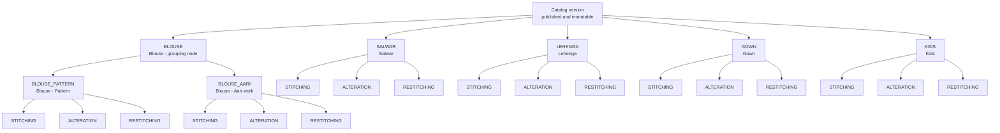
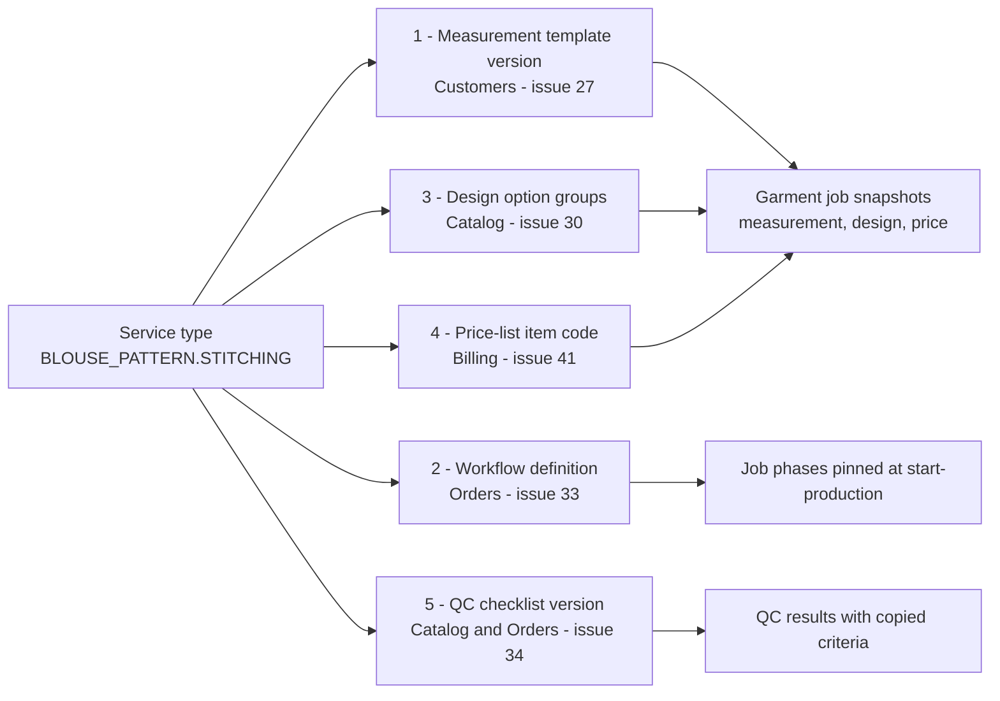
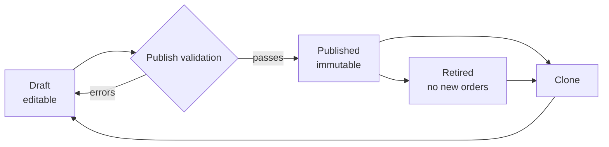

# Category hierarchy and service catalogue

This document fixes the initial stitching-category hierarchy for HyFib Tailor 360, the service types every
category offers, the machine keys and labels that identify them, and the five configuration links that each
service type carries. It is the confirmed seed source for the configurable catalogue built in issue #29 and,
together with [measurement-templates.md](./measurement-templates.md), for the measurement templates built in
issue #27. Everything described here is **versioned configuration data, not code** (decision D8 and ADR-0009 in
[../IMPLEMENTATION_PLAN.md](../IMPLEMENTATION_PLAN.md)); an administrator adds a category, a service type or an
option through the administration screens, and no deployment, migration or release is required.

Role names, garment job, order, estimate, custody transfer, phase, QC, rework, alteration and dispatch are used
exactly as defined in [glossary.md](./glossary.md). The end-to-end flow each category follows is in
[workflows/](./workflows/) (one file per category); what is configurable and what is fixed is summarised in
[configurable-vs-fixed.md](./configurable-vs-fixed.md).

---

## 1. Scope and ownership

| Aspect | Statement |
| --- | --- |
| Owning module | Catalog/Design (`catalog` schema) — see [../architecture/module-ownership.md](../architecture/module-ownership.md) |
| Implementing issue | #29 (categories, service types, catalog versions); #30 (design option groups); #27 (measurement templates); #33 (workflow definitions); #34 (QC checklist templates); #41 (price-list items) |
| Seeded by | `Tailor360.Cli init-reference-data` (idempotent, production-safe) |
| Consumed by | Estimates and orders (#32) through `Catalog.Contracts.ICatalogAvailabilityQuery`; job cards; pricing (#41); reporting (#45) |
| Authority | The published catalog version is the only source of orderable categories and service types. No module reads `catalog` tables directly; access is through the published contracts only. |
| Approval | The initial hierarchy below is drafted for the owner workshop and is confirmed under Section 11 item 10 of [../IMPLEMENTATION_PLAN.md](../IMPLEMENTATION_PLAN.md). |

---

## 2. Confirmed initial hierarchy

Two levels are used at launch: a top-level **category** and, where the craft differs enough to need its own
measurement template, workflow and QC checklist, a **sub-category**. Blouse is the only category with
sub-categories at launch. Deeper nesting is supported by the model but is not seeded.

| Code (machine key) | Level | Parent | Label (en-IN) | Tamil label (draft — confirm in the Tamil glossary, #19) | Description |
| --- | --- | --- | --- | --- | --- |
| `BLOUSE` | Category | — | Blouse | ரவிக்கை | Saree blouse. A grouping node only: orders are always placed against one of its sub-categories, never against `BLOUSE` itself. |
| `BLOUSE_PATTERN` | Sub-category | `BLOUSE` | Blouse — Pattern | ரவிக்கை — பேட்டர்ன் | Plain and pattern-cut saree blouses: princess cut, katori, paithani, high neck, boat neck and similar. Cutting and stitching only; no hand embroidery. The highest-volume category. |
| `BLOUSE_AARI` | Sub-category | `BLOUSE` | Blouse — Aari work | ரவிக்கை — ஆரி வேலை | Saree blouses that carry Aari (maggam) hand embroidery. Adds a specialist embroidery phase between cutting and stitching, a longer lead time, embroidery-specific placement measurements and its own QC criteria for stone, bead and thread security. |
| `SALWAR` | Category | — | Salwar | சல்வார் | Salwar kameez sets: kameez (top) plus salwar, churidar, pant or palazzo bottom, optionally with a dupatta. Priced and measured as one garment job covering both pieces. |
| `LEHENGA` | Category | — | Lehenga | லெஹங்கா | Lehenga sets: a flared kali skirt with a fitted choli and an optional dupatta. Bridal and festive work; the longest lead times and the highest material value. |
| `GOWN` | Category | — | Gown | கவுன் | Floor-length and calf-length gowns, including A-line, flared and fitted silhouettes, with optional slit, lining and trail. |
| `KIDS` | Category | — | Kids | குழந்தைகள் ஆடை | Children's garments (frocks, pattu pavadai, kids salwar, kids gowns) up to the 14-year age band. Simplified measurement set with an age band, and growth allowance applied at cutting. |

**Rules for the hierarchy**

1. A grouping node (`BLOUSE`) carries no service types of its own and is not orderable; `ICatalogAvailabilityQuery.IsOrderable` returns false for it.
2. A sub-category inherits nothing implicitly. Its measurement template, workflow, design option groups, price-list item and QC checklist are declared on its own service types.
3. A sub-category's branch availability must be a subset of its parent's branch availability (validated at publish, #29).
4. Display order is configuration and may differ per branch view; it never affects codes or behaviour.

---

## 3. Service types

Three service types are seeded for every orderable category. A service type is always scoped to one category:
`BLOUSE_PATTERN.STITCHING` and `SALWAR.STITCHING` are different records with different links, even though they
share a service-type code.

| Service code | Label (en-IN) | What it covers | Customer material | Measurement capture | Typical exception |
| --- | --- | --- | --- | --- | --- |
| `STITCHING` | Stitching | A new garment cut and stitched from material the customer supplies (or, where stocked, from shop material issued against the garment job). | Received at intake, recorded in Inventory as customer-material custody | New measurement version, or explicit reuse of a confirmed version | Missing or insufficient material |
| `ALTERATION` | Alteration | Adjusting an existing finished garment — taking in or letting out, shortening, re-fitting a neckline, replacing a closure. Covers both garments made by the shop (linked to the original garment job) and garments brought in from outside. | The finished garment is received and held in custody | Only the fields that change are re-measured; the rest are carried from the linked garment job where one exists | Alteration not achievable within the garment's seam allowance |
| `RESTITCHING` | Re-stitching | Reconstructing a garment: opening an existing garment and re-cutting or re-making it to a new fit or a new pattern, typically re-using the original material. More work than an alteration, less than new stitching. | The existing garment is received and held in custody | A full new measurement version is taken | Material found unusable after opening |

**Proposed expected durations (proposed, to be confirmed by the owner with the Tailor Master)** — used as the
default due-date offset in working days for the branch calendar (#33), never as a promise to the customer:

| Category | `STITCHING` | `ALTERATION` | `RESTITCHING` |
| --- | --- | --- | --- |
| `BLOUSE_PATTERN` | 3 | 1 | 2 |
| `BLOUSE_AARI` | 10 | 2 | 5 |
| `SALWAR` | 4 | 1 | 3 |
| `LEHENGA` | 12 | 2 | 6 |
| `GOWN` | 7 | 2 | 4 |
| `KIDS` | 3 | 1 | 2 |

Notes carried on the seeded service types:

- `BLOUSE_AARI.ALTERATION` warns at intake that alterations crossing an embroidered area may damage the work; the warning text is configuration on the service type, not code.
- Aari work applied to a garment the shop is already stitching is ordered as a `BLOUSE_AARI` garment job, not as an add-on to a `BLOUSE_PATTERN` job. Whether an add-on service type is also needed is open decision **OD-CAT-03** below.

---

## 4. Code and naming conventions

Machine keys are what every other module, every event payload, every report and every seed file refers to.
Human labels are what staff and customers see. They are deliberately separate so that renaming a category never
breaks a price list, a report or an integration.

| Rule | Convention | Example | Enforced by |
| --- | --- | --- | --- |
| Category code | `UPPER_SNAKE_CASE`, ASCII `A-Z`, `0-9`, `_`; must start with a letter; 2–40 characters | `BLOUSE_PATTERN` | Publish validation (#29), regular expression on the admin form |
| Sub-category code | Prefixed with the parent code and one underscore, so lineage is readable without a lookup | `BLOUSE_AARI` (parent `BLOUSE`) | Convention checked at publish; a warning, not an error, so historic codes stay valid |
| Service-type code | `UPPER_SNAKE_CASE`, unique **within its category** | `STITCHING` | Publish validation |
| Fully qualified service reference | `<CATEGORY_CODE>.<SERVICE_TYPE_CODE>` — the form used in price lists, seed files, event payloads, exports and this documentation set | `BLOUSE_AARI.STITCHING` | Convention |
| Uniqueness | Category codes are unique across the organisation, across all statuses, including retired ones | — | Unique index |
| Immutability | **A code is immutable once the catalog version that introduced it is published.** It cannot be edited, and it is never re-used for a different concept after retirement. | — | Database trigger on published rows; publish validation rejects a code reappearing with a different identifier |
| Labels | `name` (en-IN) and optional `name_ta` (ta-IN) are editable at any time, in draft or by an in-place correction to a published version's presentation fields, with a reason and an audit entry. Changing a label never changes behaviour, pricing or history. | "Blouse — Pattern" → "Blouse — Pattern cut" | Audit event `catalog.label_corrected` |
| Description and help text | Editable like labels; localisable; shown at intake and on the job card | — | — |
| Display order | Integer per parent; editable; may be overridden per branch | — | — |
| Identifiers | Every category, service type and version is addressed in the API by its UUIDv7 id (D9). Codes are stable business keys for seeds, price lists and exports; they are never used as an unauthenticated lookup key. | — | Architecture and API convention |

Reserved words: `NONE`, `DEFAULT`, `ALL` and `UNKNOWN` may not be used as codes, because they are used as
sentinel values in filters and exports.

---

## 5. The five links every service type carries

Each service type is the join point between the taxonomy and the five configuration sets that drive the rest of
the system. All five are references to **published versions** of independently versioned configuration, held in
their owning modules; the catalogue never copies their content.

| # | Link | Target | Owning module / issue | Cardinality | What it drives | Publish validator |
| --- | --- | --- | --- | --- | --- | --- |
| 1 | Measurement template | `measurement_template_id` → a published template version | Customers/Measurements, #27 | Exactly one per service type | The capture wizard's field set, groups, units, ranges, conditional rules and diagrams; the measurement snapshot taken into the garment job. Seeded from [measurement-templates.md](./measurement-templates.md). | #27 registers an `ICatalogDependencyValidator` rejecting a catalogue publish that references a non-published or retired template version |
| 2 | Workflow definition | `workflow_definition_id` → a workflow definition | Orders/Workflow, #33 | Exactly one per service type | The phase sequence, allowed transitions, required roles, evidence and SLA per phase. The concrete **version** is pinned on the garment job at start-production, not at confirmation. | #33's validator rejects a reference to a definition with no published version |
| 3 | Design option groups | `design_option_group_ids` → an ordered set of published groups | Catalog/Design, #30 | Zero or more per service type | The shape and design picker at intake, selection rules (requires / excludes / conditional note), price and time impacts, and the immutable `GarmentDesignSnapshot` stored on the garment job. Seeded from [design-options.md](./design-options.md). | #30's rule engine validates group and rule references at publish |
| 4 | Price-list item | `price_list_item_code` → an item in a published price-list version | Billing/Payments, #41 | Exactly one per service type | The base rate, inclusive/exclusive flag, permitted discounts, surcharges and the HSN/SAC and GST treatment used by the pricing engine. Prices are per branch and effective-dated; the catalogue holds the item **code**, never an amount. | #41's validator rejects a reference to an item absent from the branch's current published price-list version |
| 5 | QC checklist | `qc_checklist_template_id` → a published checklist version | Catalog/Design (template) with results in Orders, #34 | Exactly one per service type | The QC criteria (pass/fail, measurement tolerance, fit check), defect codes, evidence requirements and responsible role. The evaluated criteria are copied into the QC result so historic results render unchanged. | #34's validator rejects a reference to a non-published checklist version |

**Incomplete services.** A service type may be published with one or more links missing only when the
administrator sets `allow_incomplete=true`; #29 then flags it `not_orderable`, it is excluded from
`ICatalogAvailabilityQuery.IsOrderable` and it cannot be selected on an estimate or an order. This exists so a
new category can be created and reviewed before its price list and checklist are ready, never as a way to take
orders against half-configured services.

---

## 6. Administrators add categories and service types without a deployment

This is a non-negotiable delivery principle of the roadmap ("categories, measurements, workflow phases, QC
checklists, taxes, prices, alerts, retention and feature availability are configuration, not code") and it is
demonstrated as acceptance evidence for #29.

| Action | Who | Where | Deployment required |
| --- | --- | --- | --- |
| Add a category or sub-category | Administrators — Owner, and Branch Manager where the permission matrix grants `catalog.edit` | Catalogue admin tree editor (desktop-first) | No |
| Add or edit a service type and its five links | Administrators (`catalog.edit`) | Catalogue admin tree editor | No |
| Edit labels, descriptions, help text, display order, Tamil labels | Administrators (`catalog.edit`) | Catalogue admin | No |
| Publish a catalog version | `catalog.publish` — Owner and Admin by default, step-up authentication required | Catalogue admin, publish dialog with preview and validation report | No |
| Set branch availability or toggle the category's feature flag | Administrators (`catalog.edit`, `admin.feature_flags` for flags) | Catalogue admin / feature-flag admin | No |
| Add a new **kind** of link (a sixth configuration reference) | Engineering | Code change plus ADR | Yes |
| Change the shape of the hierarchy beyond two levels in the UI | Engineering (the data model already supports it) | — | Yes, for the editor only |

The default role-to-permission grants for `catalog.*` are proposed in
`../security/permission-matrix.md` (delivered by #24) and confirmed under Section 11 item 13 of
[../IMPLEMENTATION_PLAN.md](../IMPLEMENTATION_PLAN.md). Every catalogue change is audited with actor, reason and
correlation id; the publish action requires a reason.

---

## 7. Versioning: draft, published, retired

The catalogue is versioned as a whole. A **catalog version** is a coherent snapshot of the hierarchy, its
service types and their five links; an order is always placed against exactly one published catalog version.

| Status | Meaning | Who may act | Constraints |
| --- | --- | --- | --- |
| Draft | Work in progress. Freely editable, invisible to intake, previewable by administrators. | `catalog.edit` | Not orderable. Multiple drafts may exist; only one may be published at a time and a concurrent publish returns `409`. |
| Published | The active configuration. **Immutable** — enforced by a database trigger, not only by application code. Corrections are made by cloning to a new draft and publishing again. Only presentation fields (label, description, help text, display order, Tamil label) may be corrected in place, with a reason and an audit entry. | `catalog.publish`, step-up | Exactly one published version is current at any time per organisation; branch availability and effective dates narrow it per branch. |
| Retired | No longer offered. Hidden from intake and from the catalogue read API's orderable set. | `catalog.publish` | **Retirement is refused while any in-progress order or garment job references the version**, unless a successor version is published that carries a replacement for every referenced service type. Retired versions remain fully readable so historic orders, job cards, invoices and reports render exactly as they did. |

**How versioning protects in-flight orders.** Nothing an administrator does to the catalogue can change a garment
job that is already under way. Five separate pins guarantee it:

| Pinned at | What is pinned | Effect |
| --- | --- | --- |
| Measurement draft creation (#27, #28) | The measurement template version | Re-publishing a template mid-capture raises an explicit migration prompt; it never silently changes the field set. |
| Order confirmation (#32) | The catalog version, the category and service-type version, the measurement snapshot (with a provenance reference to the measurement version), the design snapshot and the price snapshot | The garment job renders from its own snapshots and needs no catalogue lookup. Snapshots are immutable after confirmation. |
| Start-production (#33) | The workflow definition **version** | Phase lists and SLAs for a job in production never shift under the Tailor. |
| QC recording (#34) | The QC checklist version plus a JSON copy of the criteria evaluated | Historic QC results render identically after the checklist changes. |
| Invoice posting (#42) | The price-list version and tax-configuration version used | A posted invoice is reproducible from its own snapshot. |

Consequences worth stating plainly for the workshop:

- Publishing a new catalog version **never** re-prices, re-routes or re-measures an existing garment job.
- Retiring a category stops new orders only; jobs in production run to dispatch on their pinned configuration.
- A design revision after confirmation is an explicit, audited command (`POST /jobs/{id}/design-revisions`, #30/#32) with the price and due-date delta shown before approval — not a side effect of a catalogue change.
- Version-keyed read caches for the catalogue are invalidated by the `CatalogVersionPublished` event (D21); no cache is ever authoritative.

---

## 8. Branch availability, effective dates and feature flags

| Control | Purpose | Scope | Notes |
| --- | --- | --- | --- |
| Branch availability | A category or service type is offered only at the branches that can deliver it (for example, Aari work only where an Aari specialist works). | Per category and per service type | A sub-category's branches must be a subset of its parent's. Enforced at publish. |
| Effective dates (`active_from`, `active_to`) | Seasonal or planned availability without an administrator having to remember to switch it on. | Per category and per service type | Evaluated in the branch timezone, default `Asia/Kolkata` (D11). |
| Feature flag | An emergency off switch, and the mechanism for piloting a new category at one branch. | Organisation or branch scope, `platform.feature_flags` | Mutation restricted to `admin.feature_flags` with a mandatory reason; safe default off; propagation bound documented in D21. |

`ICatalogAvailabilityQuery.IsOrderable(serviceTypeId, branchId, at)` returns true only when all of these hold:
the catalog version is published, the category and service type are within their active dates, the branch is in
the availability set, the feature flag is on, and the service is not flagged `not_orderable`. Intake neither
lists nor accepts anything else.

---

## 9. Seed data loaded by `init-reference-data`

| Seed | Content | Source document |
| --- | --- | --- |
| Categories | `BLOUSE`, `BLOUSE_PATTERN`, `BLOUSE_AARI`, `SALWAR`, `LEHENGA`, `GOWN`, `KIDS` | This document, Section 2 |
| Service types | `STITCHING`, `ALTERATION`, `RESTITCHING` for each of the six orderable categories (18 service types) | This document, Section 3 |
| Measurement templates | One published template version per orderable category | [measurement-templates.md](./measurement-templates.md) |
| Design option groups | Blouse, Salwar, Lehenga, Gown and Kids option groups and rules | [design-options.md](./design-options.md) |
| Workflow definition | Intake → Cutting → Specialist work (Aari, conditional) → Stitching → Finishing → QC → Ready for delivery, with Rework and On hold as exception states | [workflows/](./workflows/) and #33 |
| QC checklists | One checklist version per orderable category | #34, reviewed with the Tailor Master |
| Price-list items | One item code per service type; rates supplied by the owner | #41, Section 11 item 10 |

The seed is idempotent and production-safe: re-running it must not create a second catalog version or alter a
published one. Synthetic customers, orders and measurements are never seeded outside development and test.

---

## 10. Publish-time validation summary

The catalogue publish command runs every registered `ICatalogDependencyValidator` and refuses to publish while any
error remains. Errors are returned as field-level problem details.

| Check | Severity | Owning issue |
| --- | --- | --- |
| Duplicate category or service-type code | Error | #29 |
| Orphaned parent, or a cycle in the hierarchy | Error | #29 |
| Code changed on an already-published record | Error | #29 |
| Sub-category branch availability not a subset of the parent's | Error | #29 |
| Reference to a retired or non-published measurement template version | Error | #27 |
| Reference to a workflow definition with no published version | Error | #33 |
| Reference to a non-published QC checklist version | Error | #34 |
| Design option group or rule referencing an unknown option | Error | #30 |
| Price-list item code absent from the branch's published price-list version | Error | #41 |
| Missing link with `allow_incomplete=true` | Warning; the service type is flagged `not_orderable` | #29 |
| Sub-category code not prefixed with its parent code | Warning | #29 |
| Retirement while in-progress orders reference the version and no successor exists | Error | #29 |

---

## 11. Open decisions

Recorded here and tracked centrally in [assumptions-and-open-decisions.md](./assumptions-and-open-decisions.md).
Section references are to [../IMPLEMENTATION_PLAN.md](../IMPLEMENTATION_PLAN.md).

| ID | Question | Proposed default (not yet agreed) | Owner | Raised | Needed by |
| --- | --- | --- | --- | --- | --- |
| OD-CAT-01 | Is this the complete launch hierarchy, or are further categories (for example men's shirt/trouser, saree pre-pleating, kurta, uniform orders) offered at any branch today? | Launch with the six orderable categories above; anything else is added post-launch as configuration. | Owner, with each Branch Manager | 2026-09-04 | #29 (wave 3). Tracked as Section 11 item 10. |
| OD-CAT-02 | Is `RESTITCHING` a distinct service type, or an alteration variant distinguished by a reason code? | Keep it distinct: it takes a full new measurement version, uses a different workflow path and is priced separately. | Owner, with the Tailor Master | 2026-09-04 | #29 (wave 3) |
| OD-CAT-03 | Is Aari work ever sold as an add-on to a `BLOUSE_PATTERN` job, rather than as a `BLOUSE_AARI` job in its own right? | No. Aari work is ordered as `BLOUSE_AARI`; the embroidery placement fields and the specialist phase belong to that category. | Owner, with the Tailor Master | 2026-09-04 | #29 and #30 (wave 3). Related to Section 11 item 10. |
| OD-CAT-04 | Do any categories or service types differ **between branches** at launch (availability, or different price-list items)? | Same hierarchy at every branch; price-list items differ per branch, categories do not. | Owner, with each Branch Manager | 2026-09-04 | #25 (branch setup) and #29. Related to Section 11 item 6. |
| OD-CAT-05 | Are the proposed expected durations in Section 3 acceptable as default due-date offsets, and are they measured in working days against the branch calendar? | The table in Section 3, in working days, skipping branch holidays. | Owner, with the Tailor Master | 2026-09-04 | #33 (wave 4) |
| OD-CAT-06 | May a Branch Manager publish a catalog version, or is publishing restricted to the Owner and Admin? | Restricted to Owner and Admin, with step-up authentication; Branch Manager may edit drafts only. | Owner | 2026-09-04 | #24 permission matrix (wave 1). Section 11 item 13. |
| OD-CAT-07 | Which Tamil labels are correct for each category and service type? | The drafts in Section 2, to be corrected in the Tamil glossary review. | Owner, with Reception staff | 2026-09-04 | #19 accessibility and localisation, before the `ta-IN` catalogue reaches 95% |

---

## 12. Related documents

| Document | Why it matters here |
| --- | --- |
| [00-overview.md](./00-overview.md) | Product scope this taxonomy serves |
| [glossary.md](./glossary.md) | Definitions of every role and term used above |
| [measurement-templates.md](./measurement-templates.md) | Link 1 — the seeded field sets per category |
| [design-options.md](./design-options.md) | Link 3 — the seeded design option groups and rules |
| [workflows/](./workflows/) | Link 2 — the target workflow per category, and branch scenarios |
| [state-transitions.md](./state-transitions.md) | Transitions, actors, preconditions and audit events for orders and garment jobs |
| [configurable-vs-fixed.md](./configurable-vs-fixed.md) | The full list of what an administrator may change without a deployment |
| [raci.md](./raci.md) | Who edits, reviews and approves catalogue changes |
| [walkthroughs.md](./walkthroughs.md) | One end-to-end walkthrough per category |
| [assumptions-and-open-decisions.md](./assumptions-and-open-decisions.md) | Central register for the open decisions above |
| [../IMPLEMENTATION_PLAN.md](../IMPLEMENTATION_PLAN.md) | Decisions D8, D9, D21; blueprints for #27, #29, #30, #33, #34, #41; Section 11 owner decisions |
