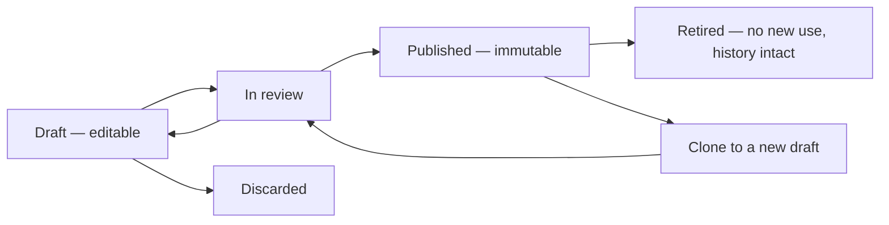

# Configurable versus fixed in code

This document draws the line between what a HyFib administrator changes for themselves — a new category, a new
design option, a new price, a new workflow phase, a new QC criterion — and what only a release can change: the
state machines, the invariants, the tax arithmetic, the barcode format and the permission catalogue. The roadmap
principle is blunt: *"Categories, measurements, workflow phases, QC checklists, taxes, prices, alerts, retention and
feature availability are configuration, not code"* (plan Section 2.2). This document says exactly how far that
reaches, who may pull each lever, whether the change is versioned, and — the question that matters most on the shop
floor — **what happens to work already in progress**. Terms are defined in [`glossary.md`](glossary.md); the
journey they sit in is described in [`00-overview.md`](00-overview.md).

---

## 1. The three tiers

| Tier | What it is | Who changes it | How it takes effect |
| --- | --- | --- | --- |
| **Configuration data** | Rows in the database with a draft → published → retired lifecycle, administered through the application's own screens | Owner, Admin or Branch Manager holding the relevant permission, with a reason recorded | On publish, subject to the version-keyed cache invalidation bound |
| **Runtime switch** | Feature flags, scoped to the organisation or a branch, with safe-off defaults | Owner and the HyFib super-user, holding `admin.feature_flags`, with a mandatory reason and evaluation audit | Within the documented propagation bound of at most 30 seconds |
| **Operator setting** | `appsettings` values, environment variables and secret files, validated on startup | The operator deploying the environment, not an in-app administrator | On restart of the host; startup fails fast if a required value is missing or invalid |
| **Fixed in code** | State machines, invariants, arithmetic, formats, the permission catalogue | Nobody, without a reviewed pull request, migration and release | On release |

### 1.1 The publishing lifecycle every piece of configuration shares

Publishing runs every registered dependency validator: cycles, unique codes, orphaned parents, retired references,
branch availability within the parent's, and the validators each module registers for its own links — measurement
template, workflow definition, design option groups, price-list item and QC checklist. A version that fails
validation cannot be published. Retirement is refused while a published catalogue version still maps a category to
the item, unless a successor is published.

### 1.2 The rule that makes configuration safe: snapshots

A confirmed garment job carries **copies** of the measurement values, the design selections and the price
calculation it was confirmed with, and the workflow version is **pinned** onto the job when production starts. This
is why an administrator can republish the catalogue in the middle of a working day without disturbing a single job
in the workshop. Every "Effect on in-flight work" answer below follows from this one rule; where an exception
exists, it is stated explicitly.

---

## 2. Configurable without a deployment

| Concern | Configurable? | Who may change it | Versioned? | Effect on in-flight work |
| --- | --- | --- | --- | --- |
| Categories and sub-categories — add, rename, reorder, set active dates, branch availability | Yes, configuration data | Owner or Admin with `catalog.edit` and `catalog.publish` | Yes — part of the catalog version | None. Confirmed jobs hold their own category and service version. A retired category cannot be selected on new drafts and retirement is refused while in-progress orders reference it |
| Service types and the links they carry — measurement template, workflow definition, design option groups, price-list item, QC checklist | Yes, configuration data | Owner or Admin with `catalog.edit` and `catalog.publish` | Yes — part of the catalog version | None for confirmed jobs. A service missing a dependency may be published only as `not_orderable`, and is then neither listed nor accepted at confirmation |
| Measurement templates — fields, labels, groups, units, precision, required flags, ranges, conditional rules, diagrams | Yes, configuration data | Owner or Admin with the measurement-template administration permission | Yes — draft, in review, published, retired; published versions immutable by database trigger | None. Existing measurement versions keep the template version they were captured against and render unchanged. New captures use the newly published version |
| Design option groups, options, illustrations, help text, price and time impact | Yes, configuration data | Owner or Admin with `catalog.edit` and `catalog.publish` | Yes — with the catalog version | None. A garment's design snapshot embeds labels, illustration references and option versions, so the job card renders exactly as approved even after a republish |
| Design rules — requires, excludes, conditional notes | Yes, configuration data | Owner or Admin with `catalog.edit` and `catalog.publish` | Yes — with the catalog version | None for confirmed jobs. New drafts and any post-confirmation design revision are validated against the currently published rules |
| Workflow definitions and versions — phases, permitted roles, required evidence, durations and SLAs, optional or skippable flags, the transition graph, category mapping | Yes, configuration data | Owner or Admin with `catalog.workflows.edit` and `catalog.workflows.publish`, with step-up | Yes — published versions immutable | **Partial exception.** A job that has already entered production keeps its pinned workflow version to completion. A job confirmed but not yet started picks up the version published at start-production |
| QC checklists — criteria, types, tolerances, defect codes, evidence requirements, responsible role | Yes, configuration data | Owner or Admin with `catalog.edit` and `catalog.publish` | Yes — draft, published, retired | **Partial exception.** A QC result already recorded stores a copy of the criteria evaluated and renders unchanged. A QC recorded after the republish uses the newly published version |
| Price lists — base rates, inclusive or exclusive pricing, discount rules, surcharges, approval thresholds, branch availability, effective dates | Yes, configuration data | Owner with the price-list publish permission, with the accountant's agreement | Yes — effective-dated, immutable when published | None. Confirmed orders hold a price snapshot naming the exact version used; an invoice recalculates with those same versions and refuses to post on a mismatch |
| Tax configuration — tax codes, HSN and SAC mappings, CGST, SGST, IGST and cess rates, place-of-supply rules, effective dates | Yes, configuration data | Owner with the tax-configuration publish permission, with the accountant's agreement | Yes — effective-dated, immutable when published | None for posted documents, which are frozen. A draft invoice recalculates against the version named in the order's snapshot |
| Document round-off convention — rounding to the nearest rupee at document level | Yes, configuration | Owner with the accountant's agreement | Yes — recorded with the calculation | Applies to calculations performed after the change. Posted documents never move |
| GST registrations per branch — GSTIN, state code | Yes, configuration data | Owner or Admin with the branch administration permission | Yes — audited change history | Applies to documents created afterwards; posted documents keep the registration they were posted with |
| Payment modes — code, name, required reference, required provider, refund eligibility, branch availability | Yes, configuration data | Owner or Admin | Yes — audited | Existing payments keep their mode. Deactivating a mode stops new use only |
| Dispatch policy per branch — `whole_order`, `per_job` or `exception`; payment rule and any partial threshold | Yes, configuration | Owner, per plan Section 11 item 4 | Yes — the policy version is carried on every eligibility result and dispatch authorisation | Evaluated at the receive scan, so a change applies to the next scan. An already-recorded dispatch authorisation keeps the policy version it was issued under |
| Inventory alert policies per branch — evaluation basis, whether open purchase quantity counts, hysteresis, cadence, escalation delay, target roles | Yes, configuration | Owner, Admin or Branch Manager | Yes — audited | Applied at the next evaluation. Alerts already raised keep their state machine and clear on replenishment |
| Reorder rules per item and location — minimum, reorder point, target quantity, lead time, responsible role | Yes, configuration data | Inventory Clerk or Branch Manager with `inventory.manage_reorder_rules` | Audited change history | Applied at the next evaluation |
| Negative-stock policy — block, or allow with approval | Yes, configuration | Owner or Admin | Audited | Applied to movements posted after the change; the ledger is never rewritten |
| Valuation method — weighted average or FIFO — and its configuration version | Yes, configuration | Owner with the accountant's agreement, per plan Section 11 item 5 | Yes — every valuation run records the method and configuration version | Past valuation runs are immutable. The next run uses the new method |
| Notification templates and their versions — body per channel and language, declared variable allowlist | Yes, configuration data | Owner or Admin with `notifications.manage_templates`, with a reason | Yes — draft, published, immutable, retired | None. A queued notification intent names the template version it will render |
| Notification routing — event to audience, channel policy, quiet hours, fallback | Yes, configuration | Owner or Admin | Yes — audited | Applied to intents created afterwards |
| Consent purposes and their wording versions | Yes, configuration data | Owner, with the wording reviewed before publication | Yes — every consent record names the wording version | Existing consent records keep their wording version. A new wording version does not silently re-consent anyone |
| Reason-code lists — hold, cancellation, rework, wastage, variance, dispatch exception | Yes, configuration data | Owner or Admin | Audited | Applied to new records; historical records keep the code they were saved with |
| Retention policies per data class | Yes, configuration | Owner, with the outcome recorded in `../nfr/data-classification.md` (issue #19) | Yes — audited | Applied at the next retention run. Legal and business holds always win; each deletion is audited individually |
| Feature availability — feature flags scoped to organisation or branch | Yes, runtime switch | Owner and the HyFib super-user with `admin.feature_flags`, mandatory reason | Evaluation is audited | Takes effect within the documented propagation bound of at most 30 seconds; defaults are off |
| Branches — code, name, IANA timezone, working calendar, holidays | Yes, configuration data | Owner or Admin with the branch administration permission | Audited change history | Due dates and SLA clocks recompute against the new calendar from the change onward; recorded server timestamps never move |
| Users, roles and branch assignments; custom roles built from the permission catalogue | Yes, configuration data | Owner or Admin with `admin.users`, with step-up on sensitive actions | Audited before-and-after | Effective within the session-revocation SLO. Work already recorded keeps the actor it was recorded with |
| Label templates — size, layout, which human-readable cues are printed, whether a QR accompanies the Code 128 | Yes, configuration data, subject to plan Section 11 item 9 | Owner or Admin | Yes — every label print records the template version | None. Reprinting a label re-uses the same barcode payload; only the printed presentation changes |
| Stock items, units and conversions, suppliers, locations | Yes, configuration data | Inventory Clerk or Branch Manager with the matching `inventory.manage_*` permission | Audited; retired rather than deleted | Retired items stay visible in history but cannot be purchased or issued |
| Report schedules and their recipients | Yes, configuration data | Owner or Admin with the reporting permissions | Audited | Applied to the next scheduled run |

---

## 3. Operator settings — configuration, but not in-app

These are legitimate configuration, but they live in `appsettings`, environment variables or secret files, are
validated on startup, and change only when an operator redeploys or restarts the host. They are listed here so that
nobody promises an administrator a screen that does not exist.

| Concern | Configurable? | Who may change it | Versioned? | Effect on in-flight work |
| --- | --- | --- | --- | --- |
| Whether the first phase scan starts production automatically | Operator setting per branch configuration | Operator, on the owner's instruction | Tracked in version control with the environment definition | Applies to scans after the restart |
| Whether a capability match is required before assignment | Operator setting | Operator | Version-controlled | Applies to assignments made afterwards |
| Upload size cap, image dimension and pixel limits, whether originals are kept | Operator setting | Operator | Version-controlled | Applies to uploads started afterwards; stored objects are untouched |
| Idempotency retention window and offline-queue maximum age | Operator setting, with a configuration test asserting retention is at least twice the queue age | Operator | Version-controlled | Applies after restart |
| Rate-limit policy values | Operator setting, from the policy catalogue | Operator, with the values confirmed by issue #19 | Version-controlled | Applies after restart |
| Connection budget, database roles, storage endpoints, provider base URLs and credentials | Operator setting and secrets | Operator | Version-controlled, secrets excluded | Startup fails fast rather than running mis-configured |

---

## 4. Fixed in code

Changing any of the following requires a reviewed pull request against one issue, a migration where data is
affected, and a release. An administrator cannot reach them, and no configuration screen should imply otherwise.

| Concern | Configurable? | Who may change it | Versioned? | Effect on in-flight work |
| --- | --- | --- | --- | --- |
| The order and garment-job lifecycle — draft, confirmed, in production, ready, delivered, closed, plus cancelled and on hold — and every permitted transition | No | Engineering, through a reviewed pull request and an architecture decision record where the model changes | Yes — by release and migration | A release may add states; existing rows are migrated explicitly, never reinterpreted |
| The custody state machine — transfer out, receive, accept, reject, expire, correct — and the rule that history is appended, never edited | No | Engineering | By release | Unchanged records stay valid; corrections remain new events |
| The QC, rework, hold, alteration and cancellation transitions and their guards | No | Engineering | By release | Unchanged |
| The ready-for-delivery gate's predicate set and the rule that only the gate writes `ready_state` | No | Engineering | By release | Unchanged |
| The dispatch gate's **fail-closed** semantics — an unevaluated eligibility result blocks — and the rule that failed-QC, held or wrong-custody jobs have no exception path | No | Engineering | By release | Unchanged |
| Append-only enforcement by database trigger on audit events, ledger entries, scan events, custody transfers, posted invoices, payments, receipts and QC results | No | Engineering, through the migrator role only | By release and migration | Unchanged. The application role holds insert rights only |
| Invariants — balances rebuildable from the stock ledger, no oversubscription, exactly one active barcode identity per garment job, payments balance formula, document numbers never reused, snapshots immutable after confirmation | No | Engineering, with an architecture decision record | By release | Unchanged; each invariant is asserted by a property test |
| Tax **arithmetic** — decimal types and precision, line-level half-up rounding to paise, rounding allocation, and the selection of CGST plus SGST versus IGST from the place of supply | No — the rates, codes and place-of-supply data are configuration; the arithmetic is not | Engineering, with accountant sign-off on the golden master | By release | Historical calculations are reproducible because every calculation records the configuration versions it used |
| Financial-year boundary of April to March and the shape of document sequences per branch and financial year | No | Engineering | By release | Unchanged |
| Barcode payload format — namespace letters `G-`, `S-`, `I-`, `R-`, the 11-character random body, the Crockford base32 alphabet, the check character, and the rule that a payload carries no PII and is never re-issued | No | Engineering, with an architecture decision record | By release | Existing payloads remain valid; a format change would be additive and namespaced |
| Display-number formats — `C-…`, `O-…`, `J-…`, `E-…`, invoice and receipt numbers | No | Engineering | By release and migration | Existing numbers never change |
| Identifier policy — UUIDv7 resource ids are the only identifiers in API paths, deep links and customer links | No | Engineering | By release | Unchanged |
| The permission **catalogue** — the set of permission strings and their `RequiresMfa` and `RequiresStepUp` flags | No — the grants of permissions to roles are configuration; the catalogue is not | Engineering, with the matrix approved by the Owner | By release; the matrix approval is recorded in `../security/permission-matrix.md` | A new permission is denied by default until granted |
| Branch-scope evaluation, including the narrow transfer-scoped grant during a pending cross-branch transfer | No | Engineering | By release | Unchanged |
| Session, cookie, anti-forgery and step-up mechanics | No | Engineering | By release | Unchanged |
| The audit hash chain and its verification and anchoring | No | Engineering | By release | Unchanged |
| Module ownership — one schema per module, cross-module access only through contracts and events | No | Engineering, only with an architecture decision record; enforced by architecture tests | By release | Unchanged |
| Outbox, inbox and idempotency semantics — at-least-once delivery, per-aggregate ordering, lease and replay | No | Engineering | By release | Unchanged |
| API surface and versioning rules, problem-details error shape, required headers | No | Engineering, with the OpenAPI difference gate | By release | A breaking change requires a new API version |
| Health probe semantics and the rule that non-essential dependencies report degraded rather than unready | No | Engineering | By release | Unchanged |
| The refusal to seed synthetic data in production | No | Engineering | By release | Unchanged |

---

## 5. Worked example — a new category without a deployment

This is the demonstration issue #29 must record as evidence. Nothing in it touches code.

| Step | Who | Screen | Result |
| --- | --- | --- | --- |
| 1 | Owner or Admin | Catalogue tree editor | New category created as a draft with code, name, parent, display order, active dates and branch availability |
| 2 | Owner or Admin | Measurement template administration | New template version drafted with its fields, units, ranges and diagram, then published |
| 3 | Owner or Admin | Design option group editor | Option groups, options, illustrations and rules drafted for the category |
| 4 | Owner or Admin | Workflow editor | An existing workflow definition mapped to the category, or a new definition drafted and published |
| 5 | Owner or Admin | QC checklist editor | A checklist version drafted and published |
| 6 | Owner | Price list editor | A price-list item added with a base rate and its tax code, then published with the accountant's agreement |
| 7 | Owner or Admin | Catalogue publish | Dependency validators run; the catalog version publishes and the version-keyed caches invalidate |
| 8 | Reception | Order intake | The new category appears and is orderable in the branches it was made available to |

If step 7 fails, the validator names the missing link. A service may be published deliberately incomplete, but it
is then flagged `not_orderable` and is neither listed nor accepted at confirmation.

---

## 6. Open decisions affecting this document

Recorded in full, with owners and status, in
[`assumptions-and-open-decisions.md`](assumptions-and-open-decisions.md), which mirrors plan Section 11.

| Reference | Open decision | What it changes here |
| --- | --- | --- |
| OD-04 | The payment rule for dispatch and the partial-delivery policy, including who may approve an exception and whether advances unlock dispatch | The dispatch-policy row in section 2 and the exception approver in the permission matrix |
| OD-05 | Valuation method, and rounding and round-off conventions, with the accountant | The valuation and round-off rows in section 2 |
| OD-09 | Label format — thermal size, and whether a QR accompanies the Code 128 | The label-template row in section 2; the payload format itself stays fixed |
| OD-10 | The initial catalogue, measurement templates, design options and QC checklists, to be reviewed from the seeded drafts | The seed content, not the mechanism |
| OD-13 | The permission matrix — default role-to-permission grants and any custom roles at launch | Every "Who may change it" cell in sections 2 and 3 |

Until each is closed, the corresponding cell above states the plan's engineering default and must not be read as an
approved business rule.
