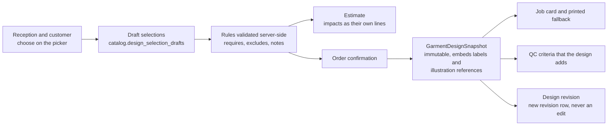

# Design options

This document specifies the proposed design option groups, options and selection rules for every category in
[category-hierarchy.md](./category-hierarchy.md) — Blouse (Pattern), Blouse (Aari work), Salwar, Lehenga, Gown and
Kids — together with the selection cardinality, the requires / excludes / requires-attachment / conditional-note
rules and the price and time impacts each option carries. It is the seed source for issue #30 (visual shape and
design catalogue with garment-level selections) and it is **link 3** of the five links every service type carries:
`Tailor360.Cli init-reference-data` loads exactly the groups described here, and the business review of the seeded
groups is an acceptance criterion of #30.

It is also the other half of the conditional-rule contract in
[measurement-templates.md](./measurement-templates.md): a measurement field written `Hidden when
design.sleeve_style = SLEEVELESS` reads a group defined in Section 9 below. Section 8 states that contract
precisely, so a template rule and a design group can never drift apart silently.

Every group, option, label, rule and impact below is **proposed and to be confirmed** by the Owner with the Tailor
Master (Section 11 item 10 of [../IMPLEMENTATION_PLAN.md](../IMPLEMENTATION_PLAN.md), tracked centrally as
**OD-10**); the model, the code conventions and the rule semantics are settled.

Design options are versioned configuration, not code. An administrator adds a group, adds an option, uploads a new
illustration, changes a label or adds a rule through the design administration screens; no deployment is needed.

---

## 1. Scope and ownership

| Aspect | Statement |
| --- | --- |
| Owning module | Catalog/Design (`catalog` schema): `design_option_groups` → `design_options`, with `design_rules` between them |
| Implementing issues | #30 (groups, options, rules, rule engine, picker, snapshot builder, job-card component), #29 (catalog versioning and publish validation), #32a (snapshot persistence and the design-revision command), #31 (uploaded illustration media; bundled line drawings until then), #41 (the rates the impacts resolve to) |
| Linked from | The catalogue: every service type carries an ordered set of published groups — link 3 in [category-hierarchy.md](./category-hierarchy.md) |
| Selected by | Reception at intake, on the tablet picker, with the customer present; revised after confirmation only by the audited design-revision command |
| Read by | The Tailor Master and the assigned Tailor on the job card and its printed fallback; QC (#34); pricing (#41) |
| Data class | Not personal data. A design snapshot is business data attached to a garment job and is readable wherever the job card is readable. Customer reference photographs are separate media (#31) and carry their own classification. |
| Seeded groups | 56 groups across the six orderable categories — 9, 13, 8, 10, 10 and 6 — all in catalog version 1 (Section 9) |
| Seeded rules | 44 rules, `DR-01` to `DR-44`, unique across the catalogue and never re-used (Section 4 rule 7). A rule is category-scoped, so a rule copied onto a second category is a second rule with its own identifier |

---

## 2. Groups, options and codes

| Rule | Convention | Example |
| --- | --- | --- |
| Group code | `lower_snake_case`, ASCII, unique **within a category**, immutable once the catalog version that introduced it is published | `sleeve_style` |
| Option code | `UPPER_SNAKE_CASE`, ASCII, unique **within its group**, immutable once published | `THREE_QUARTER` |
| Fully qualified reference | `<CATEGORY_CODE>.<group_code>.<OPTION_CODE>` — the form used in seed files, rules, event payloads and exports | `BLOUSE_PATTERN.sleeve_style.CAP` |
| Label | Free text, editable at any time, localisable (`en-IN` plus optional `ta-IN`). The label may differ from the code, and changing it never changes behaviour, pricing or history. | `THREE_QUARTER` → "Three-quarter sleeve" |
| Help text | One short sentence in the customer's language of the counter, stating what the choice means for the finished garment. Required for every option. | "Sleeve ends midway between elbow and wrist." |
| Display order | Integer per group, and per option within a group; the order the picker and the printed job card use | — |
| Storage | The option **code** is stored, never the label. The snapshot additionally embeds the label and illustration reference as they stood at confirmation (Section 7). | — |
| Reused codes across categories | The same group code may appear in more than one category and means the same thing — `sleeve_style` in `BLOUSE_PATTERN` and in `GOWN` — but each category holds its **own** group record with its own option list, because a gown offers sleeve lengths a blouse does not. | — |
| `NONE` | `NONE` is a **reserved option code** meaning "the customer chose not to have this feature". It is a real, selectable option, not a sentinel: it is what makes "no slit" an explicit, priced, printed decision rather than an omission. Reserved in every group; may not be given any other meaning. | `gown_slit.NONE` |

> **Note on the reserved-word list.** Section 4 of [category-hierarchy.md](./category-hierarchy.md) says `NONE`,
> `DEFAULT`, `ALL` and `UNKNOWN` "may not be used as codes". That section defines category, sub-category and
> service-type codes, and the prohibition is read here as covering exactly those: they are the codes that appear
> as sentinel values in catalogue filters and exports. It is not extended to option codes: design options need an
> explicit "none" the customer can be shown and can choose, and the measurement rules in
> [measurement-templates.md](./measurement-templates.md) are written against it. `DEFAULT`, `ALL` and `UNKNOWN`
> remain forbidden everywhere, and Section 8 defines how `NONE` and "nothing selected" differ.

---

## 3. Selection cardinality and the required flag

Two independent properties per group. Confusing them is the most common way a picker ends up unusable.

| Property | Values | Meaning |
| --- | --- | --- |
| Selection mode | `single` \| `multiple` | How many options may be chosen. `single` renders as a radio-style card grid, `multiple` as checkable cards with a running count. |
| Required | `true` \| `false` | Whether the garment may be confirmed with nothing chosen in this group. A required `multiple` group needs at least one option. |
| Branch availability | Set of branches | A group or an option is offered only where the branch can deliver it — the Aari groups only where an Aari specialist works. A group's availability must be a subset of its category's. |
| Active dates | `active_from`, `active_to` | Seasonal options without an administrator having to remember to switch them off. Evaluated in the branch timezone, default `Asia/Kolkata` (D11). |

**Rules**

1. A required group with every option unavailable at a branch is a publish-time error — it would make the category
   unorderable at that branch without saying so.
2. A group that is not required, and in which nothing is selected, is **unset**. Unset is not `NONE` (Section 8).
3. Making a group required in a new catalog version never invalidates a confirmed garment job; the requirement applies
   to new drafts and to any subsequent design revision.
4. The picker never pre-selects an option on the customer's behalf. A default would be printed on the job card and cut
   by a tailor without anyone having chosen it.

**Retirement.** A group or an option is retired by setting `active_to` in a new catalog version, or by clearing
the option's `active` flag; neither record is ever deleted, because confirmed snapshots, historic job cards and
historic invoices reference it. A retired group or option is not offered on a new draft and stops being
selectable on an open one — the draft carries the migration prompt of Section 7 naming what went — and it stays
valid for ever on every confirmed garment job, which renders from its own snapshot rather than from the
catalogue. Retirement is therefore a lifecycle state and not an absence: a retired option is still a known
option, which is why Section 10 needs its own checks for a required group whose every option is retired and for
a rule whose consequent set has been emptied by retirement, over and above the "unknown option" check.

---

## 4. Rules: requires, excludes, requires attachment and conditional notes

Four rule types, evaluated by
`IDesignSelectionValidator.Validate(catalogVersionId, categoryId, branchId, evaluatedAt, selections, garment)`,
which returns violations. `branchId` and `evaluatedAt` are what make the branch availability and the
`active_from`/`active_to` dates of Section 3 decidable — without them the engine cannot say whether a selected or
a rule-required option is offerable at all — and the design-revision command passes the revision's own branch and
instant. `garment` carries only what the fourth rule type reads: whether the garment holds a reference-media
object (#31). The plan's #30 blueprint sketches the three-argument form; #30 implements the extended one. The
engine is pure and deterministic, it holds no state, and it is the same code path at intake, at estimate, at
confirmation and at design revision.

| Type | Meaning | Effect on the picker | Effect on confirmation |
| --- | --- | --- | --- |
| **Requires** | Selecting A obliges B to be selected | Selecting A offers B and explains why; the summary lists what A brought with it | Blocking. Confirmation is refused with a field-level problem detail naming both options |
| **Excludes** | A and B may not both be selected | Selecting A disables B with the reason shown on the disabled card — never silently hidden | Blocking |
| **Requires attachment** | Selecting A obliges a reference image on the garment (#31) | Selecting A prompts for the upload and explains why the specialist needs it | Blocking. Confirmation is refused until the media object exists on the garment |
| **Conditional note** | Selecting A attaches a standing instruction to the garment job | Shown at selection and carried into the summary | Non-blocking. The note is copied into the snapshot and printed on the job card |

**Rule operand grammar**

Both sides of a rule are **option sets over one group** of the category, written in one of the forms below.
These are the only forms the seeded rules use and the only ones #30 implements; an administrator adding a rule
composes it from the same list.

| Operand form | Holds when | Seeded example |
| --- | --- | --- |
| `group = OPTION` | the single-selection group holds exactly that option | DR-02 |
| `group ≠ OPTION` | the group holds a value and that value is not the named option | DR-01, DR-21 |
| `group in (A, B)` | the group's value is one of the listed options | DR-13, DR-17 |
| `group includes OPTION` | the multiple-selection group holds that option among its selections | DR-07 |
| `group excludes OPTION` | the multiple-selection group holds a value and that option is not among it | Section 8 |
| `any selection in group` | the group holds at least one option, whichever it is | DR-10, DR-11 |
| `always` | unconditionally, for every garment of the category | DR-29 |
| `a reference image on the garment` | the garment holds at least one reference-media object (#31) — the one operand that is not an option set, and the reason for the **requires attachment** type | DR-08 |

`group other than OPTION` is written for readability in DR-25 and means `group ≠ OPTION`. Every condition over an
**unset** group is false, negations included, exactly as Section 8 states for the template side of the contract.

**Rules about rules**

1. A rule references options and groups **within one category**. Cross-category rules are not supported and are a
   publish-time error; a garment job belongs to exactly one category. The one operand that is not an option is
   the reference-image predicate of the **requires attachment** type, which reads the garment rather than the
   catalogue and is why the validator is handed the garment context.
2. `requires` is not transitive by declaration but is by evaluation: if A requires B and B requires C, selecting A
   yields all three, and the picker's summary shows the chain.
3. A `requires` cycle, or a rule whose two operand sets overlap, is a publish-time error.
4. A rule may not make a **required** group unsatisfiable — for example excluding every option of a required group.
   Publish-time error.
5. A conditional note is free text on the rule, localisable, and is the mechanism for craft instructions that are not
   themselves choices ("cut the lining 5 mm wider than the shell at the armhole").
6. Rules are evaluated **server-side and authoritatively**. The picker's copy is a convenience; a selection set that
   reaches confirmation is re-validated against the published rules regardless of what the client believed.
7. Every seeded rule carries a stable identifier, `DR-nn`, unique across the whole catalogue rather than per
   category. Identifiers are never re-used: a deleted rule's number is retired with it. They exist because a rule
   cannot be named reliably by the options it mentions — `DR-01` and `DR-06` both concern `padding = MOULDED_CUP`,
   so a publish-time error or a test that named only the option would be ambiguous between them. A rule an
   administrator adds is allocated the next free number by the catalogue, not by hand.
8. Evaluation runs in a **fixed order**, so that two implementations cannot reach different answers for the same
   selection set: `excludes` narrows each group's admissible set first, `requires` is then resolved against the
   narrowed sets to a fixed point, and conditional notes are attached last. A `requires` whose consequent set is
   emptied by an `excludes` is a publish-time error reported against both `DR-nn` identifiers, because the pair
   is the defect and neither rule alone is.
9. A `requires` whose consequent set holds **exactly one** option is satisfied by the picker, and by the
   design-revision command, selecting that option and saying so in the summary. A consequent set of **two or
   more** is never auto-selected: the picker prompts, and confirmation is refused until one is chosen. This is
   why DR-21 may add the bound edge on the customer's behalf and DR-24 may not choose between a ₹100.00
   concealed zip and a ₹280.00 lace-up back — no impact reaches the estimate without someone having chosen it.

---

## 5. Price and time impacts

| Aspect | Specification |
| --- | --- |
| Time impact | Signed whole **working days**, added to the service type's expected duration (Section 3 of [category-hierarchy.md](./category-hierarchy.md)) when computing the proposed due date against the branch calendar. Every selected option contributes its own impact, each selection in a multiple-selection group included; the contributions are summed across groups, the order of application is immaterial because the sum is commutative, and the total is floored at zero before it is added. A group may declare a **cap** on its own selections, applied within the group before the sum — `aari_placement` does, because its placements are worked in one mounting (Section 9.2). Never a promise to the customer — Reception may always set a later date. |
| Price impact | The option names a **price-list item code** (`PI_…`); the amount, the branch it applies at, its effective dates and its HSN/SAC and GST treatment live in the published price-list version owned by #41. The catalogue holds the code, never the money — the same invariant link 4 states in [category-hierarchy.md](./category-hierarchy.md). Each selected option produces at most one line, and lines are never netted against one another. |
| Zero-impact options | The great majority of options cost nothing extra — a boat neck is not dearer than a round neck. An option with no price-list item produces **no invoice line**, which is why the bills in [walkthroughs.md](./walkthroughs.md) list only the two or three selections that actually carry a charge. |
| Where impacts appear | On the estimate and the invoice as their own lines, labelled from the option's label at the time of the snapshot; in the price delta shown before a design revision is approved; never rolled silently into the base rate. |
| Proposed rates below | The ₹ amounts in Section 9 are the **proposed** rates for `PL_CBE01` version 4, the price list used throughout [walkthroughs.md](./walkthroughs.md). A few options are **proportional** rather than flat — the Aari density and stone options of Section 9.2 — and their Rate cell reads a percentage applied to the option lines that selection modifies, not a rupee amount of its own. Both kinds are indicative seed values confirmed under **OD-10** with **OD-05** and **OD-DES-02**; the authoritative amount is always the price-list version, per branch and effective-dated. |
| Material consumption is not a price impact | Stock issued against a job — an AD stone and bead kit, canvas, bias binding — is charged on at the configured consumption rate by Inventory (#40), on its own line. A design option chooses the look; it does not itself value the material. |

---

## 6. Illustrations and alternative text

A design picker that shows only words is a picker Reception has to translate at the counter, so every option is
primarily a **picture**.

| Rule | Specification |
| --- | --- |
| Illustration | `design_options.illustration_media_id` once media upload exists (#31); until then the bundled line drawing identified by `illustration_key` (#30) |
| Reference format | `<sheet_key>#<group_code>.<option_code>`, for example `design_kids_style_v1#lining.FULL`. The group code is part of the anchor because an option code is unique only **within its group** (Section 2) and several groups share one sheet: without it `design_kids_style_v1#FULL` is claimed by both `sleeve_style` and `lining`, and `design_gown_silhouette_v1#NONE` by three groups at once |
| Alt text | `illustration_alt` is **required** for every option and describes the shape in words, so the picker is usable with a screen reader and the job card is usable when printed in monochrome: "Deep rounded cup-shaped neckline with a curved seam under each cup." |
| Seeded sheets | `design_blouse_cut_v1`, `design_blouse_front_neck_v1`, `design_blouse_back_neck_v1`, `design_blouse_sleeve_v1`, `design_blouse_closure_v1`, `design_blouse_finish_v1`, `design_aari_motif_v1`, `design_aari_placement_v1`, `design_salwar_kameez_v1`, `design_salwar_neck_v1`, `design_salwar_bottom_v1`, `design_lehenga_skirt_v1`, `design_lehenga_dupatta_v1`, `design_gown_silhouette_v1`, `design_gown_neckline_v1`, `design_kids_style_v1` — sixteen sheets |
| Versioning | The `_v1` suffix is part of the key. A redrawn sheet is `_v2`, referenced by a new catalog version; existing snapshots keep pointing at the drawing the customer was actually shown. |
| Namespace | Every key here begins `design_`. Design illustrations and the measurement diagrams of [measurement-templates.md](./measurement-templates.md) section 8 share the single `diagram/` object-storage prefix ([../architecture/module-ownership.md](../architecture/module-ownership.md) section 4), and the two sets would otherwise have collided on `blouse_sleeve_v1`, `salwar_bottom_v1`, `lehenga_skirt_v1` and `lehenga_dupatta_v1` — four keys naming a different drawing in each document. `design_salwar_kameez_v1` is a fifth such pair, distinct from the measurement sheet `salwar_kameez_v1` for the same reason. The anchor vocabulary differs too: a measurement diagram is anchored by field key, a design illustration by group code and option code, because option codes are unique only within a group and several groups share a sheet. |
| Zoom | Every illustration opens full-screen on tap, because a customer choosing a neckline is looking closely at it (#30, #50) |
| Printable fallback | The job card renders the illustration where it can and the label plus alt text where it cannot, so a thermal or monochrome print is never ambiguous |

---

## 7. How a selection travels

| Stage | Rule |
| --- | --- |
| Draft | Server-side in `catalog.design_selection_drafts`, autosaved, shared within the branch, reused for intake autosave (#32b). **Pinned to one catalog version** — the version `Validate` is called with for the life of the draft — and expiring after 24 hours by default, matching the measurement draft in [measurement-templates.md](./measurement-templates.md) Section 11 |
| Catalogue republished mid-draft | The pin holds: the group set never changes under the person at the counter. On the next autosave the draft shows a migration prompt naming what moved — an option retired, a group newly required, a rule newly added — and Reception either migrates the draft to the new version and re-validates it, or finishes on the pinned one. A newly required group and a newly added rule apply to the migrated draft, never retrospectively to the pinned one (Section 3 rule 3); a selection whose option the republish retired cannot survive migration and must be re-chosen |
| Estimate | Selections must pass the rules before an estimate may be issued ([state-transitions.md](./state-transitions.md)); measurements are not required at this point, selections are |
| Confirmation | `GarmentDesignSnapshot.From(catalogVersion, selections, notes, instructions)` — a value object serialised as JSON embedding, per selection, the **group code and label**, the **option code and label**, the illustration reference and its **`illustration_alt`**, the **group and option display order**, the option's **price-list item code** and the option version, so the job card renders without a catalogue lookup, for ever. Everything the printed fallback of Section 6 and the ordering rule of Section 2 need is in the snapshot, because a reprint a year later may find the group retired or reordered |
| Immutability | The snapshot is a copy, not a reference. Republishing the catalogue, retiring a group or renaming an option never changes a confirmed garment job |
| Revision | Never an edit — `POST /jobs/{id}/design-revisions` (`orders.revise_design`) writes a new immutable row with `revision_number`, the reason, the approver, and the price and due-date delta shown **before** approval. Emits `orders.design-revised.v1`, consumed by #47 for notification |
| Freeze | Once the workflow marks the design frozen (#33), revision is refused and the change becomes an alteration (#34). Walkthrough 5 in [walkthroughs.md](./walkthroughs.md) is exactly this boundary: the gown's **order** is revised at 10:28 on 16 June — an order revision under EX-03, before production, not the design revision this section defines — and production starts at 09:00 on 17 June, after which the same request would have been an alteration. Walkthrough 6's Kids order takes the design-revision route proper |
| Re-validation on revision | A revision is validated against the **currently published** rules, not the rules the order was confirmed under. This is deliberate: a revision is a new decision taken today. Selections **carried over unchanged** from the previous snapshot are re-validated but are never rejected merely for having been retired since confirmation; only the groups the revision actually changes must resolve to currently offerable options. The revision summary flags every carried-over selection that is no longer offerable, so the approver sees it before agreeing |

---

## 8. The `design.<group_code>` operand contract

[measurement-templates.md](./measurement-templates.md) Section 6 lets a conditional measurement rule read the
garment's design selections, written `design.<group_code>`. This section is the other side of that contract; it
exists so a template rule can never reference a group that does not exist, and so the three-state semantics are
written down once rather than assumed twice.

| Operand state | When it holds | How a hide condition evaluates |
| --- | --- | --- |
| **A value** | The group has one or more selected options | Compared normally: `=` against a single-selection group, `excludes` / `includes` against a multiple-selection group |
| **`NONE`** | The customer explicitly chose the `NONE` option | A real value. `design.gown_slit = NONE` is **true**, so `slit_height` is hidden — the customer decided against a slit |
| **Unset** | The group is not required and nothing was chosen, or measurements are being captured **outside** order intake, where there are no design selections at all | Every condition over that operand evaluates **false**, so the field stays **shown and optional**. Nothing is lost when a customer is measured before a design is chosen |

The five groups the seeded measurement templates depend on, and the exact fields they gate:

| Operand | Category or categories | Selection | Gates |
| --- | --- | --- | --- |
| `design.sleeve_style` | `BLOUSE_PATTERN`, `BLOUSE_AARI`, `SALWAR`, `LEHENGA`, `GOWN`, `KIDS` | single | `sleeve_length`, `sleeve_round`, `sleeve_upper_round` hidden when `= SLEEVELESS`; also gates `aari_sleeve_work_length` |
| `design.aari_placement` | `BLOUSE_AARI` | multiple | `aari_front_work_height/width` (`FRONT`), `aari_back_work_height/width` (`BACK`), `aari_neck_work_depth` (`NECK`), `aari_sleeve_work_length` (`SLEEVE`), `aari_border_width` (`BORDER`) |
| `design.kameez_slit` | `SALWAR` | single | `kameez_slit_height` hidden when `= NONE` |
| `design.gown_slit` | `GOWN` | single | `slit_height` hidden when `= NONE` |
| `design.dupatta` | `LEHENGA` | single | `dupatta_length`, `dupatta_width` hidden when `= NONE` |

**Guarantees.**

1. A template rule naming a group absent from the template's category is a **publish-time error** in #27, and a
   catalogue publish that would orphan such a rule is a publish-time error in #29 and #30. The two validators run
   against the same catalog version, so the pair cannot be published in an inconsistent state.
2. Renaming an option's **label** never affects a rule; rules read codes. This is why codes are immutable once
   published.
3. Hiding a field clears any value already typed, with a visible notice — a hidden value is never carried silently
   into the measurement snapshot ([measurement-templates.md](./measurement-templates.md) Section 6).
4. Whether rules may read design selections at all is open decision **OD-MEA-02**, whose fallback is a seeded
   `has_sleeves` yes/no measurement field. If that fallback is taken, only the `sleeve_style` row above changes;
   the slit, dupatta and Aari-placement rows have no template-side equivalent, and those fields would be seeded as
   shown unconditionally and optional. The groups themselves are unaffected either way — they are what the customer
   chooses, not how a template reads them.
5. `waist_finish` names a `LEHENGA` design group in Section 9.4 **and** a `SALWAR` measurement choice field in
   [measurement-templates.md](./measurement-templates.md) Section 9.3, and the two share the code `DRAWSTRING`.
   They do not collide today, because one is a design group on the lehenga and the other a template field on the
   salwar. If **OD-MEA-03** resolves towards moving the measurement choice fields into design options, `SALWAR`
   gains a waist-finish group beside this one, and the Section 2 convention that a reused group code means the
   same thing forces a decision: either the new group carries the measurement's codes under a distinct code such
   as `bottom_waist_finish`, or one side is renamed. That is **OD-DES-10**.

**The same three states govern a design rule's own operands.** Section 4's rule grammar is read with the table
above: a condition over an unset group evaluates **false** in a design rule exactly as it does in a template
rule, negations included. DR-16's `dupatta_finish` ≠ `NONE` therefore does **not** fire on a salwar ordered with
nothing chosen in that group, and no note is printed; it fires only once the customer has chosen a dupatta
finish. Writing the semantics once, here, is what keeps the two sides of the contract from drifting.

---

## 9. Seeded option groups by category

Rate column: the proposed `PL_CBE01` version 4 amount for the named price-list item, `—` where the option carries
no charge, and a percentage where the option is a proportional adjustment rather than a line of its own (Section
5, and the Aari density and stone options of 9.2). Days column: working days added to the service type's expected
duration, `—` for none.

**Which service types carry which groups.** Link 3 attaches groups to a **service type**, not to a category
([category-hierarchy.md](./category-hierarchy.md) Section 5), and its cardinality is zero or more, so each
sub-section below opens with a "Linked from" line the way [measurement-templates.md](./measurement-templates.md)
Section 9 does. The proposal throughout is the same: `STITCHING` and `RESTITCHING` carry the category's full
group set, because both cut a garment to a design chosen at the counter; `ALTERATION` carries **none**, because
the garment already exists and what changes is recorded on the alteration request (#34) against the original
job's snapshot. Confirming this split is part of **OD-DES-01**.

### 9.1 `BLOUSE_PATTERN` — Blouse, Pattern

Linked from `BLOUSE_PATTERN.STITCHING` and `BLOUSE_PATTERN.RESTITCHING`; `BLOUSE_PATTERN.ALTERATION` carries no
groups.

Nine groups. The highest-volume category, so the picker is tuned for speed and the first screen carries the
decisions Reception asks for first — the cut, the two necklines and the sleeve. How many group cards the tablet
actually holds before the picker scrolls is **OD-DES-09**.

| Group code | Label | Selection | Required | Illustration sheet |
| --- | --- | --- | --- | --- |
| `blouse_cut` | Blouse cut | single | Yes | `design_blouse_cut_v1` |
| `front_neck` | Front neck shape | single | Yes | `design_blouse_front_neck_v1` |
| `back_neck` | Back neck shape | single | Yes | `design_blouse_back_neck_v1` |
| `sleeve_style` | Sleeve length | single | Yes | `design_blouse_sleeve_v1` |
| `sleeve_shape` | Sleeve shape | single | No | `design_blouse_sleeve_v1` |
| `closure` | Closure | single | Yes | `design_blouse_closure_v1` |
| `lining` | Lining and cup | single | Yes | `design_blouse_finish_v1` |
| `padding` | Padding | single | No | `design_blouse_finish_v1` |
| `finish` | Edge finish | multiple | No | `design_blouse_finish_v1` |

| Group | Option code | Label | Price item | Rate | Days |
| --- | --- | --- | --- | --- | --- |
| `blouse_cut` | `PLAIN_DART` | Plain, darted | — | — | — |
| `blouse_cut` | `PRINCESS_CUT` | Princess cut | — | — | — |
| `blouse_cut` | `KATORI` | Katori (cup) | — | — | — |
| `blouse_cut` | `PAITHANI` | Paithani | — | — | — |
| `front_neck` | `ROUND` | Round neck | — | — | — |
| `front_neck` | `DEEP_ROUND` | Deep round neck | — | — | — |
| `front_neck` | `V_NECK` | V neck | — | — | — |
| `front_neck` | `SWEETHEART` | Sweetheart neck | — | — | — |
| `front_neck` | `BOAT` | Boat neck | — | — | — |
| `front_neck` | `HIGH_NECK` | High neck | `PI_BLOUSE_HIGH_NECK` | ₹80.00 | — |
| `front_neck` | `SQUARE` | Square neck | — | — | — |
| `back_neck` | `ROUND` | Round back | — | — | — |
| `back_neck` | `ROUND_DEEP` | Deep round back | — | — | — |
| `back_neck` | `V_DEEP` | Deep V back | — | — | — |
| `back_neck` | `U_DEEP` | Deep U back | — | — | — |
| `back_neck` | `KEYHOLE` | Keyhole back | `PI_BLOUSE_KEYHOLE` | ₹60.00 | — |
| `back_neck` | `HIGH_NECK` | High back | — | — | — |
| `sleeve_style` | `SLEEVELESS` | Sleeveless | — | — | — |
| `sleeve_style` | `CAP` | Cap sleeve | — | — | — |
| `sleeve_style` | `SHORT` | Short sleeve | — | — | — |
| `sleeve_style` | `ELBOW` | Elbow sleeve | — | — | — |
| `sleeve_style` | `THREE_QUARTER` | Three-quarter sleeve | — | — | — |
| `sleeve_style` | `FULL` | Full sleeve | `PI_BLOUSE_FULL_SLEEVE` | ₹70.00 | — |
| `sleeve_shape` | `PLAIN` | Plain sleeve | — | — | — |
| `sleeve_shape` | `PUFF` | Puff sleeve | `PI_BLOUSE_PUFF` | ₹90.00 | — |
| `sleeve_shape` | `BELL` | Bell sleeve | `PI_BLOUSE_BELL` | ₹90.00 | — |
| `sleeve_shape` | `FRILL` | Frill sleeve | `PI_BLOUSE_FRILL` | ₹110.00 | — |
| `closure` | `HOOK` | Hooks, back | — | — | — |
| `closure` | `HOOK_FRONT` | Hooks, front | — | — | — |
| `closure` | `ZIP_BACK` | Zip, back | `PI_BLOUSE_ZIP` | ₹70.00 | — |
| `closure` | `ZIP_SIDE` | Zip, side | `PI_BLOUSE_ZIP` | ₹70.00 | — |
| `closure` | `TIE_BACK` | Tie back (dori) | `PI_BLOUSE_TIE` | ₹50.00 | — |
| `lining` | `NONE` | No lining | — | — | — |
| `lining` | `FULL` | Full lining | `PI_BLOUSE_LINING_FULL` | ₹70.00 | — |
| `lining` | `KATORI_CUP` | Katori cup lining | `PI_BLOUSE_LINING_KATORI` | ₹90.00 | — |
| `padding` | `NONE` | No padding | — | — | — |
| `padding` | `LIGHT` | Light padding | `PI_BLOUSE_PADDING` | ₹80.00 | — |
| `padding` | `MOULDED_CUP` | Moulded cup | `PI_BLOUSE_PADDING_CUP` | ₹150.00 | — |
| `finish` | `PIPING` | Piping | `PI_BLOUSE_PIPING` | ₹40.00 | — |
| `finish` | `CONTRAST_BINDING` | Contrast binding | `PI_BLOUSE_BINDING` | ₹50.00 | — |
| `finish` | `LACE_EDGE` | Lace edging | `PI_BLOUSE_LACE` | ₹60.00 | — |

**Rules**

| Id | Type | Statement | Why |
| --- | --- | --- | --- |
| **DR-01** | requires | `padding` in (`LIGHT`, `MOULDED_CUP`) requires `lining` ≠ `NONE` | Padding stitched against a single layer shows through and works loose. This is the rule named in the plan's #30 blueprint and named in walkthrough 1, where it is satisfied vacuously — no padding option is selected, so the group is unset (Section 3 rule 2) and the antecedent is false. Walkthrough 1's selections exercise DR-02. |
| **DR-02** | requires | `blouse_cut = KATORI` requires `lining = KATORI_CUP` | A katori blouse is defined by its cup seam; the cups cannot be cut unlined |
| **DR-03** | note | `front_neck = HIGH_NECK` with `back_neck = HIGH_NECK` → "Closed neck front and back: confirm the opening — back hooks or a side zip." | Seeded as an exclusion and re-typed here. The neckline height is not what opens the garment; the closure is, and this category already offers back hooks, a back zip and a side zip. A high neck front and back is an ordinary weekly order, especially for temple wear, so it must not be refused at confirmation (**OD-DES-04**) |
| **DR-04** | excludes | `sleeve_style = SLEEVELESS` excludes `finish = LACE_EDGE` | Seeded as a shop preference, not a physical law — listed here as the worked example of a rule the Owner may well delete at review (**OD-DES-04**) |
| **DR-05** | note | `closure` in (`ZIP_BACK`, `ZIP_SIDE`) → "Match the zip tape to the shell fabric; check the zip runs freely after lining." | Craft instruction, printed on the job card |
| **DR-06** | note | `padding = MOULDED_CUP` → "Confirm the cup size against the customer's reference garment before cutting." | Cup sizing is not in the measurement set |
| **DR-31** | excludes | `sleeve_shape` ≠ `PLAIN` excludes `sleeve_style = SLEEVELESS` | There is no sleeve to shape. `sleeve_shape` is not required, so a sleeveless blouse simply leaves it unset |

**The cut is a group, not a neckline.** `blouse_cut` is seeded because the category is defined by its
construction — [category-hierarchy.md](./category-hierarchy.md) Section 2 names princess cut, katori and
paithani — and because katori is a bodice built from separately cut cups with a curved seam under each, not a
neckline. A katori blouse routinely carries a deep round, sweetheart or V front neck, so filing `KATORI` as one
of the mutually exclusive `front_neck` options forced the customer to give up one decision to record the other,
and left `PRINCESS_CUT` and `PAITHANI` with nowhere to go at all. DR-02 now reads against the cut. Walkthrough 1
in [walkthroughs.md](./walkthroughs.md) records `KATORI` as a front neck and is to be corrected to name it as
the cut, with a front neck chosen beside it, at the **OD-10** review.

**Length is a measurement; shape is a group.** The plan's #30 seed line also names blouse length, kameez length,
lehenga flare and gown length. Those are seeded as measurement fields — `blouse_full_length`, `kameez_length`,
`lehenga_flare` and `gown_flare` in [measurement-templates.md](./measurement-templates.md) Section 9 — because a
length is measured on the customer, not chosen from a picture. The plan's `pattern` is `blouse_cut` above, and
its `embellishment` is `finish` here together with the `BLOUSE_AARI` groups of Section 9.2. Its `fit` is **not**
seeded: [measurement-templates.md](./measurement-templates.md) Section 5 rule 4 routes a deliberately loose or
tight fit to a design selection rather than to an inflated body measurement, and there is no group here to
receive it. Whether `fit` becomes its own group or stays a garment note is part of **OD-DES-01**.

The four cuts are seeded at the ₹0 baseline, because the base rate of `BLOUSE_PATTERN.STITCHING` is quoted for a
pattern-cut blouse in the first place; whether a princess cut or a paithani should carry a rate of its own is
part of **OD-DES-03**. Walkthrough 1 in [walkthroughs.md](./walkthroughs.md) therefore still bills exactly two
design lines: it selects cut `KATORI`, `ROUND_DEEP`, `THREE_QUARTER`, `HOOK`, `KATORI_CUP` and `PIPING`, and only
the katori cup lining (₹90.00) and the piping (₹40.00) reach the bill, which is why the taxable value is ₹580.00
against a ₹450.00 base rate.

### 9.2 `BLOUSE_AARI` — Blouse, Aari work

Linked from `BLOUSE_AARI.STITCHING` and `BLOUSE_AARI.RESTITCHING`; `BLOUSE_AARI.ALTERATION` carries no groups,
which is also why its intake warning about cutting into worked areas is configuration on the service type.

Inherits nothing from `BLOUSE_PATTERN`: the nine groups above are seeded again on this category, with the same
codes and the same meanings, plus four embroidery groups. Aari groups are branch-available only where an Aari
specialist works, and the embroidery groups are what the specialist phase is planned from.

| Group code | Label | Selection | Required | Illustration sheet |
| --- | --- | --- | --- | --- |
| `blouse_cut`, `front_neck`, `back_neck`, `sleeve_style`, `sleeve_shape`, `closure`, `lining`, `padding`, `finish` | As Section 9.1 | As Section 9.1 | As Section 9.1 | As Section 9.1 |
| `aari_motif` | Aari motif | multiple | Yes | `design_aari_motif_v1` |
| `aari_density` | Work density | single | Yes | `design_aari_motif_v1` |
| `aari_stone` | Stone and bead type | multiple | Yes | `design_aari_motif_v1` |
| `aari_placement` | Work placement | multiple | Yes | `design_aari_placement_v1` |

| Group | Option code | Label | Price item | Rate | Days |
| --- | --- | --- | --- | --- | --- |
| `aari_motif` | `PEACOCK_MEDIUM` | Peacock, medium | — | — | — |
| `aari_motif` | `PEACOCK_LARGE` | Peacock, large | `PI_AARI_MOTIF_LARGE` | ₹600.00 | 2 |
| `aari_motif` | `MANGO` | Mango (maanga) | — | — | — |
| `aari_motif` | `LOTUS` | Lotus | — | — | — |
| `aari_motif` | `FLORAL_VINE` | Floral vine | — | — | — |
| `aari_motif` | `TEMPLE_BORDER` | Temple border | — | — | — |
| `aari_motif` | `GEOMETRIC` | Geometric | — | — | — |
| `aari_motif` | `CUSTOM_REFERENCE` | To customer's reference image | `PI_AARI_MOTIF_CUSTOM` | ₹800.00 | 2 |
| `aari_density` | `LIGHT` | Light | `PI_AARI_DENSITY_LIGHT` | −25% | −2 |
| `aari_density` | `MEDIUM` | Medium | — | — | — |
| `aari_density` | `HEAVY` | Heavy (bridal) | `PI_AARI_DENSITY_HEAVY` | +35% | 3 |
| `aari_stone` | `AD_STONE` | AD stones | — | — | — |
| `aari_stone` | `KUNDAN` | Kundan | `PI_AARI_KUNDAN` | +20% | 1 |
| `aari_stone` | `BEADS` | Beads | — | — | — |
| `aari_stone` | `ZARI_THREAD` | Zari thread | — | — | — |
| `aari_stone` | `MIRROR` | Mirror work | `PI_AARI_MIRROR` | +15% | 1 |
| `aari_placement` | `FRONT` | Front panel | `PI_AARI_FRONT` | ₹2,200.00 | 3 |
| `aari_placement` | `BACK` | Back panel | `PI_AARI_BACK` | ₹1,800.00 | 3 |
| `aari_placement` | `NECK` | Neckline band | `PI_AARI_NECK` | ₹700.00 | 1 |
| `aari_placement` | `SLEEVE` | Sleeve bands, pair | `PI_AARI_SLEEVE` | ₹500.00 | 1 |
| `aari_placement` | `BORDER` | Hem border | `PI_AARI_BORDER` | ₹600.00 | 1 |

**Rules**

| Id | Type | Statement | Why |
| --- | --- | --- | --- |
| **DR-07** | requires | `aari_placement` includes `SLEEVE` requires `sleeve_style` ≠ `SLEEVELESS` | There is no sleeve to embroider. This rule and the measurement rule on `aari_sleeve_work_length` are the same fact stated on both sides of the contract in Section 8 |
| **DR-08** | requires attachment | `aari_motif` includes `CUSTOM_REFERENCE` requires a reference image on the garment (#31) | The specialist cannot work from a code alone. This is the rule the fourth type in Section 4 exists for: its consequent is media on the garment, not an option, so the engine is given the garment context it needs rather than being asked to decide something it cannot see |
| **DR-09** | note | `aari_density = HEAVY` → "Confirm with the customer whether the heavy work is stone or thread; thread-only bridal work takes longer on the frame." | Seeded as a `requires` on `AD_STONE` or `KUNDAN` and re-typed here. Density describes how much of the ground is covered, not what covers it, and heavy zari and thread maggam with no stones at all is a recognised bridal finish — which is why `ZARI_THREAD` is a seeded stone-and-bead option (**OD-DES-04**) |
| **DR-10** | note | Any `aari_placement` selection → "When trimming the returned panels, do not cut closer than 15 mm to the worked edge." | Printed on the job card and read at **stitching**. The cutting phase runs before the panels go out to the specialist ([workflows/blouse.md](./workflows/blouse.md) section 2.3), so at cutting there is no embroidery to cut into; the risk arises when the worked panels come back to be trimmed and stitched |
| **DR-11** | note | Any `aari_placement` selection → "Back the worked area so knots and stone settings do not sit against the skin." | Seeded as a note rather than as `requires lining = FULL`, because the specialist backs the panel as part of the work; whether it should instead force a lining selection is **OD-DES-04** |
| **DR-12** | note | `aari_density = HEAVY` → "Confirm the specialist's capacity before promising the due date." | Heavy work is the most common cause of a missed date on this category |

**The copied groups bring their rules.** A rule is category-scoped (Section 4 rule 1), so DR-01 to DR-06 and
DR-31 are not inherited: they are seeded again on `BLOUSE_AARI` as **DR-32** (padding requires a lining),
**DR-33** (`blouse_cut = KATORI` requires `lining = KATORI_CUP`), **DR-34** (the closed-neck note), **DR-35**
(the sleeveless/lace-edge exclusion, flagged for deletion together with its `BLOUSE_PATTERN` original),
**DR-36** (the zip note), **DR-37** (the moulded-cup note) and **DR-38** (`sleeve_shape` ≠ `PLAIN` excludes
`sleeve_style = SLEEVELESS`), each with the same statement read against this category's own groups. The copies
take the next free identifiers; DR-01 to DR-06 are never re-used on a second category. Without them an Aari
blouse could be confirmed with a katori cut and no lining, and with moulded-cup padding on no lining at all.
Whether the duplication should instead become a shared group by reference is **OD-DES-05**.

**Placement is the price.** The rupee impacts sit on `aari_placement`, not on the motif, because the specialist
is paid by the area worked. Density and stone type are properties **of that area**, not lines of their own, so
they are seeded as proportional adjustments on the placement lines the selection modifies rather than as flat
amounts: light density on a neckband alone and light density across all five placements cannot be the same flat
discount — as a flat −₹400.00 it took a ₹700.00 neckband down to ₹300.00, below what any specialist here will
mount a frame for, while against all five placements it was a 7% rebate — and kundan on a hem border is not
the same money as kundan over a full front panel. `MEDIUM`
density and the common motifs are the baseline, which is why walkthrough 2 — `PEACOCK_MEDIUM`, `MEDIUM`,
`AD_STONE`, placement `FRONT` + `NECK` + `SLEEVE` — bills exactly three design lines (₹2,200.00 + ₹700.00 +
₹500.00) on a ₹600.00 base, and the AD stone kit appears separately as inventory consumption at ₹340.00. That
the catalogue may hold a percentage as well as a price-list item code is registered against **OD-DES-02**.

**Placement days are capped, not summed.** The five placements are worked in a single mounting, on one frame in
one sitting, so `aari_placement` contributes the **maximum** of its selected placements' day impacts and not
their sum; the motif and density days are then added once on top, as Section 5's cap describes. Summing every
placement instead would put a full-work bridal blouse — heavy density, large peacock, kundan, mirror and all
five placements — at 16 extra days on a 10-day lead time, better than five weeks for one blouse, which no
specialist in this city quotes. The cap is the reason **OD-DES-03** asks about it rather than assuming
additivity. Walkthrough 2 is the open end of the same question: it promises the bare 10 working days of
`BLOUSE_AARI.STITCHING` for a front, neck and sleeve order that the table above extends even under the cap, so
the seeded placement days and that promised date are reconciled at the **OD-10** review.

**Aari is a category, not an add-on.** Aari work is ordered as a `BLOUSE_AARI` garment job and never as an option on
a `BLOUSE_PATTERN` job — open decision **OD-CAT-03** in [category-hierarchy.md](./category-hierarchy.md). This is
why the embroidery groups are seeded on this category only.

### 9.3 `SALWAR` — Salwar

Linked from `SALWAR.STITCHING` and `SALWAR.RESTITCHING`; `SALWAR.ALTERATION` carries no groups.

Eight groups covering both pieces, because a salwar set is one garment job.

| Group code | Label | Selection | Required | Illustration sheet |
| --- | --- | --- | --- | --- |
| `kameez_style` | Kameez cut | single | Yes | `design_salwar_kameez_v1` |
| `kameez_neck` | Kameez neck | single | Yes | `design_salwar_neck_v1` |
| `sleeve_style` | Sleeve length | single | Yes | `design_blouse_sleeve_v1` |
| `sleeve_shape` | Sleeve shape | single | No | `design_blouse_sleeve_v1` |
| `kameez_slit` | Kameez slit | single | Yes | `design_salwar_neck_v1` |
| `bottom_style` | Bottom style | single | Yes | `design_salwar_bottom_v1` |
| `lining` | Lining | single | No | `design_salwar_neck_v1` |
| `dupatta_finish` | Dupatta finish | single | No | `design_lehenga_dupatta_v1` |

| Group | Option code | Label | Price item | Rate | Days |
| --- | --- | --- | --- | --- | --- |
| `kameez_style` | `STRAIGHT` | Straight cut | — | — | — |
| `kameez_style` | `A_LINE` | A-line | — | — | — |
| `kameez_style` | `ANARKALI` | Anarkali | `PI_SALWAR_ANARKALI` | ₹250.00 | 1 |
| `kameez_style` | `UMBRELLA` | Umbrella cut | `PI_SALWAR_UMBRELLA` | ₹300.00 | 1 |
| `kameez_style` | `SHORT_TOP` | Short top | — | — | — |
| `kameez_neck` | `ROUND` | Round neck | — | — | — |
| `kameez_neck` | `V_NECK` | V neck | — | — | — |
| `kameez_neck` | `BOAT` | Boat neck | — | — | — |
| `kameez_neck` | `COLLAR` | Collar | `PI_SALWAR_COLLAR` | ₹90.00 | — |
| `kameez_neck` | `KEYHOLE` | Keyhole | — | — | — |
| `sleeve_style` | `SLEEVELESS`, `CAP`, `SHORT`, `ELBOW`, `THREE_QUARTER`, `FULL` | Codes and labels as Section 9.1, seeded here with no price or time impact | — | — | — |
| `sleeve_shape` | `PLAIN`, `PUFF`, `BELL`, `FRILL` | Codes and labels as Section 9.1, seeded here with no price or time impact | — | — | — |
| `kameez_slit` | `NONE` | No slit | — | — | — |
| `kameez_slit` | `SIDE_SHORT` | Short side slit | — | — | — |
| `kameez_slit` | `SIDE_HIGH` | High side slit | `PI_SALWAR_SLIT_HIGH` | ₹60.00 | — |
| `kameez_slit` | `FRONT_SLIT` | Front slit | `PI_SALWAR_SLIT_FRONT` | ₹80.00 | — |
| `bottom_style` | `SALWAR` | Salwar | — | — | — |
| `bottom_style` | `CHURIDAR` | Churidar | — | — | — |
| `bottom_style` | `PANT` | Pant | — | — | — |
| `bottom_style` | `PALAZZO` | Palazzo | `PI_SALWAR_PALAZZO` | ₹100.00 | — |
| `bottom_style` | `PATIALA` | Patiala | `PI_SALWAR_PATIALA` | ₹150.00 | 1 |
| `lining` | `NONE` | No lining | — | — | — |
| `lining` | `KAMEEZ_ONLY` | Kameez lined | `PI_SALWAR_LINING` | ₹110.00 | — |
| `lining` | `FULL` | Both pieces lined | `PI_SALWAR_LINING_FULL` | ₹190.00 | 1 |
| `dupatta_finish` | `NONE` | No dupatta | — | — | — |
| `dupatta_finish` | `HEM_ONLY` | Hemmed | — | — | — |
| `dupatta_finish` | `LACE_BORDER` | Lace border | `PI_SALWAR_DUPATTA_LACE` | ₹180.00 | 1 |
| `dupatta_finish` | `TASSELS` | Tassels | `PI_SALWAR_DUPATTA_TASSEL` | ₹120.00 | — |

**Rules**

| Id | Type | Statement | Why |
| --- | --- | --- | --- |
| **DR-13** | requires | `kameez_slit = FRONT_SLIT` requires `lining` in (`KAMEEZ_ONLY`, `FULL`) | A front slit exposes the inside of the kameez |
| **DR-14** | note | `bottom_style = CHURIDAR` with `lining = FULL` → "Cut the churidar lining to the same ankle length and gather both layers together; allow the extra length." | Seeded as an exclusion and re-typed here. Churidars in net, georgette and light silk are lined as a matter of course; the lining is cut to the same pattern and gathered with the shell, so the gathering at the ankle is what the lining follows rather than a reason it cannot exist (**OD-DES-04**) |
| **DR-15** | note | `bottom_style = PATIALA` → "Confirm the fabric length covers the pleats before cutting; a patiala takes about 0.5 m more." | The most frequent material shortage on this category |
| **DR-16** | note | `dupatta_finish` ≠ `NONE` → "The dupatta is finished with the set and delivered with it; it is not a separate job." | Distinguishes this from the Lehenga treatment in Section 9.4. The group is not required, so on a set ordered with nothing chosen there the antecedent is false and the note does not print (Section 8) |
| **DR-39** | excludes | `sleeve_shape` ≠ `PLAIN` excludes `sleeve_style = SLEEVELESS` | As DR-31 on the blouse |

**The cut of the kameez.** `kameez_style` is seeded because it is the first question asked at the counter for a
salwar set, it decides the fabric length and the cutting method, and without it the shop's most-requested
festival top could only be ordered as an unlabelled straight kameez. The category modelled the bottom's shape in
five options and the top's not at all, although every other group on it — neck, sleeve, slit, lining — is about
the top. A flared kameez also needs a hem-flare measurement that `MT_SALWAR` does not yet seed; that is raised
under **OD-MEA-01** in [measurement-templates.md](./measurement-templates.md).

The group is labelled "Kameez slit" and not "Side slit", because one of its four options is a front slit and the
group label is what Reception reads aloud at the counter and what prints on the job card. The group code
`kameez_slit` is unchanged, so the `design.kameez_slit = NONE` rule in Section 8 is untouched; the matching
relabel of `kameez_slit_height` in [measurement-templates.md](./measurement-templates.md) is a follow-up in that
document.

Walkthrough 3 adds two garments to one draft and uses "duplicate garment" to copy the first garment's selections
into the second before changing `bottom_style` from `CHURIDAR` to `PALAZZO`. That is the only difference between the
two jobs and the only reason the second bills ₹880.00 against the first's ₹780.00.

### 9.4 `LEHENGA` — Lehenga

Linked from `LEHENGA.STITCHING` and `LEHENGA.RESTITCHING`; `LEHENGA.ALTERATION` carries no groups.

Ten groups. The choli reuses the blouse neck, sleeve, closure, lining and padding groups; the skirt and dupatta
groups are specific to this category.

| Group code | Label | Selection | Required | Illustration sheet |
| --- | --- | --- | --- | --- |
| `front_neck` | Choli front neck | single | Yes | `design_blouse_front_neck_v1` |
| `back_neck` | Choli back | single | Yes | `design_blouse_back_neck_v1` |
| `sleeve_style` | Choli sleeve length | single | Yes | `design_blouse_sleeve_v1` |
| `sleeve_shape` | Choli sleeve shape | single | No | `design_blouse_sleeve_v1` |
| `closure` | Choli closure | single | Yes | `design_blouse_closure_v1` |
| `lining` | Choli lining | single | Yes | `design_blouse_finish_v1` |
| `padding` | Choli padding | single | No | `design_blouse_finish_v1` |
| `skirt_style` | Skirt style | single | Yes | `design_lehenga_skirt_v1` |
| `waist_finish` | Skirt waist finish | multiple | Yes | `design_lehenga_skirt_v1` |
| `dupatta` | Dupatta | single | Yes | `design_lehenga_dupatta_v1` |

| Group | Option code | Label | Price item | Rate | Days |
| --- | --- | --- | --- | --- | --- |
| `front_neck`, `back_neck`, `sleeve_style`, `sleeve_shape`, `closure`, `lining`, `padding` | As Section 9.1 | Codes and labels as Section 9.1, seeded here with no price or time impact: the choli base rate is quoted for a lined, fastened choli | — | — | — |
| `skirt_style` | `KALI` | Kali (panelled) | — | — | — |
| `skirt_style` | `CIRCULAR` | Circular | `PI_LEHENGA_CIRCULAR` | ₹700.00 | 2 |
| `skirt_style` | `A_LINE` | A-line | — | — | — |
| `skirt_style` | `MERMAID` | Mermaid | `PI_LEHENGA_MERMAID` | ₹900.00 | 2 |
| `skirt_style` | `LAYERED` | Layered with can-can | `PI_LEHENGA_LAYERED` | ₹1,200.00 | 3 |
| `waist_finish` | `HOOK_BAND` | Hook and band | — | — | — |
| `waist_finish` | `ZIP` | Concealed zip | `PI_LEHENGA_WAIST_ZIP` | ₹120.00 | — |
| `waist_finish` | `DRAWSTRING` | Drawstring (nada) | — | — | — |
| `waist_finish` | `ELASTIC_BACK` | Elastic at back only | — | — | — |
| `dupatta` | `NONE` | No dupatta | — | — | — |
| `dupatta` | `PLAIN` | Plain dupatta | — | — | — |
| `dupatta` | `BORDER_WORK` | Dupatta with border work | — | — | — |
| `dupatta` | `DOUBLE` | Two dupattas | — | — | — |

**Rules**

| Id | Type | Statement | Why |
| --- | --- | --- | --- |
| **DR-17** | requires | `skirt_style = LAYERED` requires `waist_finish` to include `HOOK_BAND` or `ZIP` | A drawstring alone will not hold the weight of a can-can layered skirt. A nada may still be added beside the band, which is why the group is a multiple |
| **DR-18** | excludes | `skirt_style = MERMAID` excludes `waist_finish` including `ELASTIC_BACK` | A mermaid skirt is fitted through the hip and cannot gather at the waist. Read against the set: the rule fires whenever `ELASTIC_BACK` is among the selections, whatever else is |
| **DR-19** | note | `dupatta` ≠ `NONE` → "The dupatta is stitched as its own garment job on the same order, with a `deliver_together` dependency." | The reason this group carries no price impact — see below |
| **DR-20** | note | `skirt_style = KALI` → "Confirm the kali count with the Tailor Master against the flare before cutting." | `kali_count` is a measurement; the two must agree |
| **DR-40** | requires | `padding` in (`LIGHT`, `MOULDED_CUP`) requires `lining` ≠ `NONE` | The DR-01 analogue on the choli, seeded with its own identifier because a rule is category-scoped. This is the category where moulded cups are asked for most often |
| **DR-41** | excludes | `sleeve_shape` ≠ `PLAIN` excludes `sleeve_style = SLEEVELESS` | As DR-31 on the blouse |

**The choli is a fitted bodice, so it carries the bodice groups.** The category is "a flared kali skirt with a
fitted choli" ([category-hierarchy.md](./category-hierarchy.md) Section 2), and `MT_LEHENGA` seeds the full choli
shaping set (`dart_point`, `apex_to_apex`) — a cup-fitted bodice. Seeding only the two necklines and the sleeve
left the highest-value category in the shop confirming a job that never said how the choli opens or whether it is
cup-lined, and gave DR-01 no lehenga equivalent. `closure`, `lining` and `padding` close that; `NONE` stays
selectable in `lining`, so a choli that needs none records the decision explicitly. All three are seeded with no
price or time impact, because the lehenga base rate is quoted for a lined and fastened choli — which is why
walkthrough 4's choli, cut with "lining, canvas, hooks and a concealed zip issued from shop stock", still bills
no design line and shows those materials as inventory consumption instead.

**A dupatta-only job cannot satisfy the choli and skirt groups.** DR-19 sends the dupatta out as its own garment
job on the same order — job `-03` in walkthrough 4 — but that job is also a `LEHENGA.STITCHING` job, so link 3
hands it the whole group set, and seven of those groups are required for a garment that has no choli and no
skirt. The proposal is a fourth `LEHENGA` service type carrying the `dupatta` group alone (link 3's cardinality
is zero or more, so a narrow set is legitimate); the alternative is making the choli and skirt groups
not-required on this category, which would let a real lehenga be confirmed with no skirt style at all. That is
**OD-DES-11**, and it is read together with DR-19.

**Why the `dupatta` group is free.** On a lehenga the dupatta is a garment in its own right and is ordered as a
separate `LEHENGA.STITCHING` job — job `-03` at ₹900.00 in walkthrough 4 — with a `deliver_together` dependency
across the set. The group therefore records *whether and what kind*, which is what gates `dupatta_length` and
`dupatta_width` on `MT_LEHENGA` and what tells Reception to add the third job; it carries no impact of its own,
because the price is the job's. Walkthrough 4's three jobs (₹3,500.00 + ₹7,200.00 + ₹900.00 = ₹11,600.00
taxable) carry no design lines at all, which is exactly what the seeded rates above predict for `KALI`,
`HOOK_BAND`, and a plain choli lined and closed with a concealed zip at no impact of their own.

### 9.5 `GOWN` — Gown

Linked from `GOWN.STITCHING` and `GOWN.RESTITCHING`; `GOWN.ALTERATION` carries no groups.

Ten groups, the largest set of category-specific groups: a gown is the category where the fewest customers
arrive knowing what they want.

| Group code | Label | Selection | Required | Illustration sheet |
| --- | --- | --- | --- | --- |
| `silhouette` | Silhouette | single | Yes | `design_gown_silhouette_v1` |
| `neckline` | Neckline | single | Yes | `design_gown_neckline_v1` |
| `sleeve_style` | Sleeve length | single | Yes | `design_blouse_sleeve_v1` |
| `sleeve_shape` | Sleeve shape | single | No | `design_blouse_sleeve_v1` |
| `gown_slit` | Slit | single | Yes | `design_gown_silhouette_v1` |
| `trail` | Trail | single | Yes | `design_gown_silhouette_v1` |
| `closure` | Closure | single | Yes | `design_blouse_closure_v1` |
| `lining` | Lining | single | Yes | `design_gown_silhouette_v1` |
| `padding` | Cup and support | single | No | `design_gown_silhouette_v1` |
| `edge_finish` | Edge finish | multiple | No | `design_blouse_finish_v1` |

| Group | Option code | Label | Price item | Rate | Days |
| --- | --- | --- | --- | --- | --- |
| `silhouette` | `A_LINE` | A-line | — | — | — |
| `silhouette` | `FLARED` | Flared | — | — | — |
| `silhouette` | `FITTED` | Fitted | `PI_GOWN_FITTED` | ₹250.00 | 1 |
| `silhouette` | `MERMAID` | Mermaid | `PI_GOWN_MERMAID` | ₹450.00 | 2 |
| `silhouette` | `EMPIRE` | Empire line | — | — | — |
| `neckline` | `ROUND` | Round | — | — | — |
| `neckline` | `BOAT` | Boat | — | — | — |
| `neckline` | `V_NECK` | V neck | — | — | — |
| `neckline` | `SWEETHEART` | Sweetheart | — | — | — |
| `neckline` | `HALTER` | Halter | `PI_GOWN_HALTER` | ₹200.00 | — |
| `neckline` | `OFF_SHOULDER` | Off shoulder | `PI_GOWN_OFF_SHOULDER` | ₹300.00 | 1 |
| `sleeve_style` | `SLEEVELESS`, `CAP`, `SHORT`, `ELBOW`, `THREE_QUARTER`, `FULL` | Codes and labels as Section 9.1, seeded here with no price or time impact | — | — | — |
| `sleeve_shape` | `PLAIN`, `PUFF`, `BELL`, `FRILL` | Codes and labels as Section 9.1, seeded here with no price or time impact | — | — | — |
| `gown_slit` | `NONE` | No slit | — | — | — |
| `gown_slit` | `SIDE_LOW` | Low side slit | `PI_GOWN_SLIT_LOW` | ₹100.00 | — |
| `gown_slit` | `THIGH_HIGH` | Thigh-high slit | `PI_GOWN_SLIT_HIGH` | ₹150.00 | — |
| `gown_slit` | `FRONT_CENTRE` | Centre front slit | `PI_GOWN_SLIT_FRONT` | ₹150.00 | — |
| `trail` | `NONE` | No trail | — | — | — |
| `trail` | `SHORT_TRAIL` | Short trail | `PI_GOWN_TRAIL_SHORT` | ₹350.00 | — |
| `trail` | `LONG_TRAIL` | Long trail | `PI_GOWN_TRAIL_LONG` | ₹650.00 | 2 |
| `closure` | `CONCEALED_ZIP` | Concealed zip | `PI_GOWN_ZIP` | ₹100.00 | — |
| `closure` | `ZIP_BACK` | Exposed zip, back | — | — | — |
| `closure` | `LACE_UP` | Lace-up back | `PI_GOWN_LACE_UP` | ₹280.00 | 1 |
| `closure` | `HOOK` | Hooks | — | — | — |
| `lining` | `NONE` | No lining | — | — | — |
| `lining` | `BODICE_ONLY` | Bodice lined | `PI_GOWN_LINING_BODICE` | ₹180.00 | — |
| `lining` | `FULL` | Fully lined | `PI_GOWN_LINING_FULL` | ₹350.00 | — |
| `padding` | `NONE` | No cup or support | — | — | — |
| `padding` | `LIGHT` | Light padding | `PI_GOWN_PADDING` | ₹120.00 | — |
| `padding` | `MOULDED_CUP` | Moulded cup | `PI_GOWN_PADDING_CUP` | ₹220.00 | — |
| `padding` | `BONED_BODICE` | Boned bodice | `PI_GOWN_BONED_BODICE` | ₹450.00 | 1 |
| `edge_finish` | `BOUND_EDGE` | Bound edge | `PI_GOWN_BOUND_EDGE` | ₹50.00 | — |
| `edge_finish` | `PIPING` | Piping | `PI_GOWN_PIPING` | ₹60.00 | — |
| `edge_finish` | `HORSEHAIR_HEM` | Horsehair braid hem | `PI_GOWN_HORSEHAIR` | ₹220.00 | 1 |

**Rules**

| Id | Type | Statement | Why |
| --- | --- | --- | --- |
| **DR-21** | requires | `gown_slit` ≠ `NONE` requires `edge_finish` to include `BOUND_EDGE` | A raw slit edge frays on the first wear. This is the rule walkthrough 5 exercises, and the worked example of Section 4 rule 9: the consequent set holds exactly one option, so revising the gown to a thigh-high slit adds the bound edge automatically and adds a QC criterion with it |
| **DR-22** | requires | `gown_slit` ≠ `NONE` requires `lining` ≠ `NONE` | An unlined slit shows the seam allowance |
| **DR-23** | requires | `trail` ≠ `NONE` requires `lining` in (`FULL`) | A trail drags on the floor and needs the second layer to hold its shape |
| **DR-24** | requires | `neckline = OFF_SHOULDER` requires `closure` in (`CONCEALED_ZIP`, `LACE_UP`) | The bodice must be held without shoulder support |
| **DR-25** | excludes | `neckline = HALTER` excludes `sleeve_style` other than `SLEEVELESS` | There is no shoulder to hang a sleeve from |
| **DR-26** | note | `trail = LONG_TRAIL` → "Measure the trail on the customer in the shoes she will wear." | Not in the measurement set; the most common gown remake |
| **DR-42** | requires | `neckline` in (`HALTER`, `OFF_SHOULDER`) requires `padding` ≠ `NONE` | Neither neckline has a shoulder to hang from: the bodice carries its own support, and it has to be built in at cutting. The consequent set holds three options, so by Section 4 rule 9 the picker prompts rather than choosing one |
| **DR-43** | excludes | `sleeve_shape` ≠ `PLAIN` excludes `sleeve_style = SLEEVELESS` | As DR-31 on the blouse |

**Where the support is recorded.** The blouse has a `padding` group and the gown, where the support does the
structural work, had none, although its own neckline list offers halter, off-shoulder and sweetheart — three
necklines that cannot be made without an inbuilt cup or a boned bodice to hold the front up. "Cup pottu kudunga"
is a routine gown request, and it now has somewhere to be recorded, a price line of its own and a line on the job
card telling the tailor to build it.

Walkthrough 5 confirms `A_LINE`, `BOAT`, `FULL` sleeve, `FULL` lining, `SHORT_TRAIL`, `CONCEALED_ZIP` and slit
`NONE` — three impacts on a ₹2,600.00 base: full lining `PI_GOWN_LINING_FULL` ₹350.00, short trail
`PI_GOWN_TRAIL_SHORT` ₹350.00 and the concealed zip `PI_GOWN_ZIP` ₹100.00, giving the ₹3,400.00 taxable value at
confirmation. The 16 June revision to `THIGH_HIGH` adds ₹150.00 and the rule-required `BOUND_EDGE` adds ₹50.00,
giving ₹3,600.00 — the ₹200.00 delta the customer sees and approves before the change is written, and the moment
`slit_height` stops being hidden on `MT_GOWN`.

**One divergence to settle.** Walkthrough 5's bill in [walkthroughs.md](./walkthroughs.md) section 6.2 shows the
lining and the zip on a single ₹450.00 line labelled "Full lining" and no closure line at all. The two totals
agree at ₹3,400.00, because ₹350.00 + ₹100.00 is ₹450.00, and that is what makes the disagreement silent: a
reader reconciling the documents finds either that `PI_GOWN_LINING_FULL` is ₹450.00 rather than ₹350.00, or
that a ₹100.00 concealed zip was folded into a line labelled for something else. Section 5 forbids the second
reading — every impact appears as its own line, never rolled into another — so the seeds above stand and the gown
bill must show four impact lines (full lining ₹350.00, short trail ₹350.00, concealed zip ₹100.00, and after the
revision the thigh-high slit ₹150.00 with the bound edge ₹50.00). Splitting the merged line in
[walkthroughs.md](./walkthroughs.md) is a separate edit to that document, at the **OD-10** review.

### 9.6 `KIDS` — Kids

Linked from `KIDS.STITCHING` and `KIDS.RESTITCHING`; `KIDS.ALTERATION` carries no groups.

Six groups, deliberately the smallest set: a guardian with a restless child at the counter will not work through
twenty choices. Age-band guidance is attached as notes rather than as rules, because a band is a measurement
(`age_band` on `MT_KIDS`), not a design decision.

| Group code | Label | Selection | Required | Illustration sheet |
| --- | --- | --- | --- | --- |
| `garment_style` | Style | single | Yes | `design_kids_style_v1` |
| `sleeve_style` | Sleeve length | single | Yes | `design_kids_style_v1` |
| `sleeve_shape` | Sleeve shape | single | No | `design_kids_style_v1` |
| `closure` | Closure | single | Yes | `design_kids_style_v1` |
| `lining` | Lining | single | No | `design_kids_style_v1` |
| `trim` | Trim | multiple | No | `design_kids_style_v1` |

| Group | Option code | Label | Price item | Rate | Days |
| --- | --- | --- | --- | --- | --- |
| `garment_style` | `A_LINE_FROCK` | A-line frock | — | — | — |
| `garment_style` | `A_LINE_FRILL` | A-line frock with frill | — | — | — |
| `garment_style` | `GATHERED_FROCK` | Gathered frock | — | — | — |
| `garment_style` | `PATTU_PAVADAI` | Pattu pavadai | `PI_KIDS_PAVADAI` | ₹120.00 | 1 |
| `garment_style` | `KIDS_SALWAR` | Kids salwar set | `PI_KIDS_SALWAR` | ₹100.00 | — |
| `garment_style` | `KIDS_GOWN` | Kids gown | `PI_KIDS_GOWN` | ₹200.00 | 1 |
| `sleeve_style` | `SLEEVELESS` | Sleeveless | — | — | — |
| `sleeve_style` | `CAP` | Cap sleeve | — | — | — |
| `sleeve_style` | `SHORT` | Short sleeve | — | — | — |
| `sleeve_style` | `FULL` | Full sleeve | — | — | — |
| `sleeve_shape` | `PLAIN` | Plain sleeve | — | — | — |
| `sleeve_shape` | `PUFF` | Puff sleeve | — | — | — |
| `sleeve_shape` | `BELL` | Bell sleeve | — | — | — |
| `sleeve_shape` | `FRILL` | Frill sleeve | — | — | — |
| `closure` | `BACK_BUTTON` | Buttons, back | — | — | — |
| `closure` | `BACK_ZIP` | Zip, back | `PI_KIDS_ZIP` | ₹40.00 | — |
| `closure` | `TIE_BACK` | Tie back | — | — | — |
| `closure` | `ELASTIC` | Elastic, no opening | — | — | — |
| `lining` | `NONE` | No lining | — | — | — |
| `lining` | `FULL` | Full lining | `PI_KIDS_LINING` | ₹30.00 | — |
| `trim` | `CONTRAST_FRILL` | Contrast frill | `PI_KIDS_FRILL` | ₹60.00 | — |
| `trim` | `LACE` | Lace trim | `PI_KIDS_LACE` | ₹40.00 | — |
| `trim` | `BOW` | Bow | — | — | — |
| `trim` | `POCKETS` | Pockets | `PI_KIDS_POCKETS` | ₹30.00 | — |

**Rules**

| Id | Type | Statement | Why |
| --- | --- | --- | --- |
| **DR-27** | requires | `garment_style = PATTU_PAVADAI` requires `lining = FULL` | Silk against a child's skin is lined as a matter of course |
| **DR-28** | excludes | `closure = ELASTIC` excludes `garment_style` in (`PATTU_PAVADAI`, `KIDS_GOWN`) | Neither garment can be pulled on over the head |
| **DR-29** | note | `always` → "Apply the published `KIDS` growth allowance at cutting; do not add it to the measurement." | The ease convention of [measurement-templates.md](./measurement-templates.md) Section 5, restated where the cutter reads it |
| **DR-30** | note | `trim = BOW` → "Stitch the bow down; a tied bow on a young child's garment is a safety hazard." | Safety instruction, always printed |
| **DR-44** | excludes | `sleeve_shape` ≠ `PLAIN` excludes `sleeve_style = SLEEVELESS` | As DR-31 on the blouse |

Walkthrough 6's two jobs take `A_LINE_FRILL`, sleeve shape `PUFF`, `BACK_BUTTON` and `FULL` lining — one ₹30.00
lining impact per garment, the ₹60.00 line on the bill. The 20 April design revision adds `CONTRAST_FRILL` to job
`-01` for ₹60.00 after the material is found short, which is why the taxable value moves from ₹540.00 to
₹600.00. Walkthrough 6 records `PUFF` as a sleeve style; naming it as the sleeve shape is a follow-up in
[walkthroughs.md](./walkthroughs.md), and no rate changes with it because `PUFF` carries no impact on this
category.

---

## 10. Publish-time validation

Registered by #30 as an `ICatalogDependencyValidator` and run by the catalogue publish command; a publish is
refused while any error remains. Errors are returned as field-level problem details. An error about a rule names
that rule's `DR-nn` identifier, because several of the checks below — a cycle, an unsatisfiable required group —
involve two rules at once, and an administrator has to be told which pair to change rather than which options are
implicated.

| Check | Severity | Owning issue |
| --- | --- | --- |
| Duplicate group code within a category, or duplicate option code within a group | Error | #30 |
| A rule referencing an unknown group or option | Error | #30, and listed in [category-hierarchy.md](./category-hierarchy.md) Section 10 |
| A rule crossing categories | Error | #30 |
| A `requires` cycle, or a rule whose two operand sets overlap | Error | #30 |
| A rule that makes a required group unsatisfiable | Error | #30 |
| A `requires` whose consequent set holds no option that is available, unretired and within its active dates wherever the antecedent option is offered | Error | #30 |
| A `requires` whose consequent set is emptied by an `excludes`, reported against both `DR-nn` identifiers | Error | #30 |
| A rule referencing a retired option, or a required group whose every option is retired | Error | #30 |
| A required group with no available option at a branch in the category's availability set | Error | #30 |
| A group's branch availability not a subset of its category's | Error | #29 |
| A code changed on an already-published group or option | Error | #29 |
| An option missing `illustration_alt` | Error | #30, [../nfr/accessibility-localisation.md](../nfr/accessibility-localisation.md) |
| A price-list item code absent from the branch's published price-list version | Error | #41 |
| A measurement-template rule reading a `design.<group_code>` absent from the template's category | Error | #27 with #30 — the pair in Section 8 |
| An option with no illustration (bundled or uploaded) | Warning; the picker falls back to label plus alt text | #30 |
| A group with more than twelve options (**proposed, to be confirmed** — the figure is a guess at the picker's capacity, **OD-DES-09**) | Warning; the tablet picker becomes a scrolling list | #30 |
| Retiring a group still referenced by a service type of a published catalog version | Error | #29 |

---

## 11. Open decisions

Recorded here and tracked centrally in [assumptions-and-open-decisions.md](./assumptions-and-open-decisions.md);
all of them resolve under **OD-10**. Section references are to
[../IMPLEMENTATION_PLAN.md](../IMPLEMENTATION_PLAN.md).

| ID | Question | Proposed default (not yet agreed) | Owner | Raised | Needed by |
| --- | --- | --- | --- | --- | --- |
| OD-DES-01 | Are the groups and options in Section 9 the choices this shop actually offers, and is anything missing that a customer asks for weekly? Specifically: is the plan's `fit` needed as its own group, or does a loose or tight fit stay a garment note? Are parrot and deity Aari motifs offered beside the seeded mango and lotus? And do `ALTERATION` and `RESTITCHING` carry the group sets Section 9 proposes for them? | The sets above, reviewed group by group against the counter's current practice; `fit` left unseeded; `RESTITCHING` carrying the full set and `ALTERATION` none. | Owner, with the Tailor Master and Reception | 2026-09-04 | #30 (wave 2). Tracked as Section 11 item 10. |
| OD-DES-02 | Does a design option carry a **literal amount**, a price-list item code resolved by #41 at pricing time, or — for the Aari density and stone options of 9.2 — a **proportional percentage** applied to the lines it modifies? | The price-list item code, as in Section 5, so money lives in one place, per branch and effective-dated, and the catalogue holds no amount; #41 supports a proportional item kind for the three options that need one. The plan's #30 model says "price impact" without settling which. | Technical reviewer, with the Owner and the accountant | 2026-09-04 | #30 and #41 (wave 2 design, wave 3 pricing). Related to **OD-05**. |
| OD-DES-03 | Are the proposed rates and day impacts in Section 9 right, and is the `aari_placement` cap the correct treatment? | The rates above; day impacts additive across groups but **capped to the maximum within `aari_placement`**, because its placements are worked in one mounting — summing them puts a full-work bridal blouse at 26 working days, which no specialist here quotes. The proposed due date stays editable by Reception, and walkthrough 2's 10-day promise is reconciled against the seeded placement days at the same review. | Owner, with the Tailor Master | 2026-09-04 | #30 and #41 (wave 3). Related to **OD-CAT-05**. |
| OD-DES-04 | Which seeded rules are real craft constraints and which are shop preferences that should not block a confirmation? | Every seeded `requires` and `excludes` blocks, except the sleeveless/lace-edge exclusion in 9.1 (DR-04 and its `BLOUSE_AARI` copy DR-35), which is flagged for deletion at review; conditional notes never block, by type (Section 4). DR-03, DR-09 and DR-14 were drafted as exclusions and are re-typed as notes for the same reason — a closed neck front and back, thread-only bridal work and a lined churidar are all ordinary orders here. | Owner, with the Tailor Master | 2026-09-04 | #30 (wave 2) |
| OD-DES-05 | Should `BLOUSE_AARI` reuse the seven `BLOUSE_PATTERN` groups by reference rather than by copy, so a change to a blouse neckline reaches both categories at once? | Copy at seed, as Section 9.2 describes. Shared groups would couple two categories that the shop may want to price and offer separately. Revisit if the duplication proves a maintenance burden. | Technical reviewer, with the Owner | 2026-09-04 | #30 (wave 2) |
| OD-DES-06 | May Reception add a free-text design instruction that is not any option, and does it price? | Yes, as a garment note carried into the snapshot and printed on the job card; it never prices and never affects the due date. Anything chargeable must become an option. | Owner | 2026-09-04 | #30 with #32a (wave 3) |
| OD-DES-07 | Who draws the sixteen illustration sheets, and are photographs of past work acceptable instead of line drawings? | Line drawings commissioned before #30; bundled with the application until media upload (#31) exists. Photographs of customers' garments may not be used without a consent record. | Owner | 2026-09-04 | #30 (wave 2). Same question as **OD-MEA-09** for the measurement diagrams. |
| OD-DES-08 | What are the Tamil labels for every group and option, and does the picker show Tamil beside English? | Tamil labels supplied with the Tamil glossary; the picker shows English with Tamil beneath, as the measurement sheet does. | Owner, with Reception staff | 2026-09-04 | [../nfr/accessibility-localisation.md](../nfr/accessibility-localisation.md) (#19), before the `ta-IN` catalogue reaches 95% |
| OD-DES-09 | How many option cards and how many group cards does the tablet picker actually hold before it scrolls? The twelve-option warning in Section 10 and the "first screen" claim in 9.1 are both guesses, and nothing in this repository measures either. | Measure it on the tablets the shop will use, then set the warning threshold from the measurement rather than from the figure seeded here. | Owner, with Reception | 2026-09-04 | #30 and #50 (wave 2) |
| OD-DES-10 | If **OD-MEA-03** moves the salwar bottom's `waist_finish` off the measurement template, does `SALWAR` gain a design group for it, and under what code, given that `waist_finish` is already a `LEHENGA` group here? | Yes — a `bottom_waist_finish` group on `SALWAR` carrying the measurement's codes (`ELASTIC`, `DRAWSTRING`, `BOTH`), mirroring the `waist_finish` group already seeded on `LEHENGA` in Section 9.4 without reusing its code for a different option list. | Technical reviewer, with the Owner | 2026-09-04 | #30 with #27 (wave 2). Counterpart of **OD-MEA-03**. |
| OD-DES-11 | What design selections does the dupatta-only garment job of DR-19 carry, given that all but two `LEHENGA` groups are required and a dupatta has neither choli nor skirt? | A fourth `LEHENGA` service type linked to the `dupatta` group alone, since link 3 permits a narrow set; making the choli and skirt groups not-required is rejected, because it would let a real lehenga be confirmed with no skirt style. | Technical reviewer, with the Owner | 2026-09-04 | #29 and #30 (wave 2). Read with DR-19 and walkthrough 4's job `-03`. |
| OD-DES-12 | This document specifies **four** rule types. The plan ([../IMPLEMENTATION_PLAN.md](../IMPLEMENTATION_PLAN.md) Section 4, #30 blueprint) and [category-hierarchy.md](./category-hierarchy.md) link 3 both specify three — requires, excludes and conditional note. Is the fourth, **requires attachment**, adopted, or is DR-08 enforced some other way? | Adopt it. DR-08 — a custom Aari motif requires a reference image on the garment — cannot be written in the three-type grammar, because its consequent is media rather than an option, and rule 1 confines a rule's operands to the catalogue. The alternatives are worse: a non-blocking note lets a specialist start work with nothing to work from, and folding it into the confirmation media precondition of [state-transitions.md](./state-transitions.md) hides a craft rule inside a generic check where no administrator would find it. If declined, DR-08 becomes a conditional note and the reference image stops being enforced. | Technical reviewer, with the Owner | 2026-09-04 | #30 (wave 2), before the rule engine is built. The plan and link 3 are corrected in the same change that settles this. |

---

## 12. Related documents

| Document | Why it matters here |
| --- | --- |
| [category-hierarchy.md](./category-hierarchy.md) | The categories and service types these groups are linked from; link 3, the code conventions and the publish-validation summary |
| [measurement-templates.md](./measurement-templates.md) | The conditional rules that read `design.sleeve_style`, `design.aari_placement`, `design.kameez_slit`, `design.gown_slit` and `design.dupatta` — the contract in Section 8 |
| [glossary.md](./glossary.md) | Definitions of design option group, design option, design revision, design snapshot and every role used above |
| [workflows/](./workflows/) | Where design selection sits in each category's flow, and the specialist phase the Aari groups plan |
| [state-transitions.md](./state-transitions.md) | The estimate and confirmation preconditions that require valid selections, and the design-revision transition with its actor and audit event |
| [configurable-vs-fixed.md](./configurable-vs-fixed.md) | What an administrator may change in a group, an option or a rule without a deployment |
| [walkthroughs.md](./walkthroughs.md) | The selections, impacts and revisions in Section 9 as they appear end to end, with the bills they produce |
| [exceptions.md](./exceptions.md) | EX-02 missing material and EX-03 changed measurements — the paths that reach a design revision in walkthrough 6 and an order revision in walkthrough 5. exceptions.md itself stops at the hold and at `POST /orders/{id}/revisions`; it names neither a design option nor a design revision, so the connection is made here rather than there |
| [raci.md](./raci.md) | Who drafts, reviews and approves design catalogue changes |
| [assumptions-and-open-decisions.md](./assumptions-and-open-decisions.md) | Central register; every decision above resolves under **OD-10** |
| [../nfr/accessibility-localisation.md](../nfr/accessibility-localisation.md) | Alt-text requirements for illustrations; the Tamil glossary for design terms |
| [../IMPLEMENTATION_PLAN.md](../IMPLEMENTATION_PLAN.md) | Decisions D8, D9, D21; blueprints for #29, #30, #31, #32a, #41; Section 11 item 10 |
