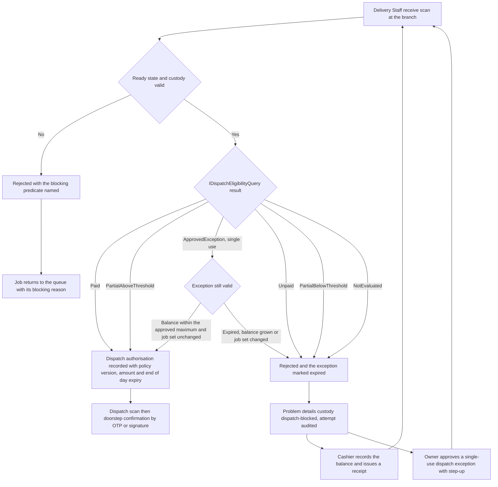
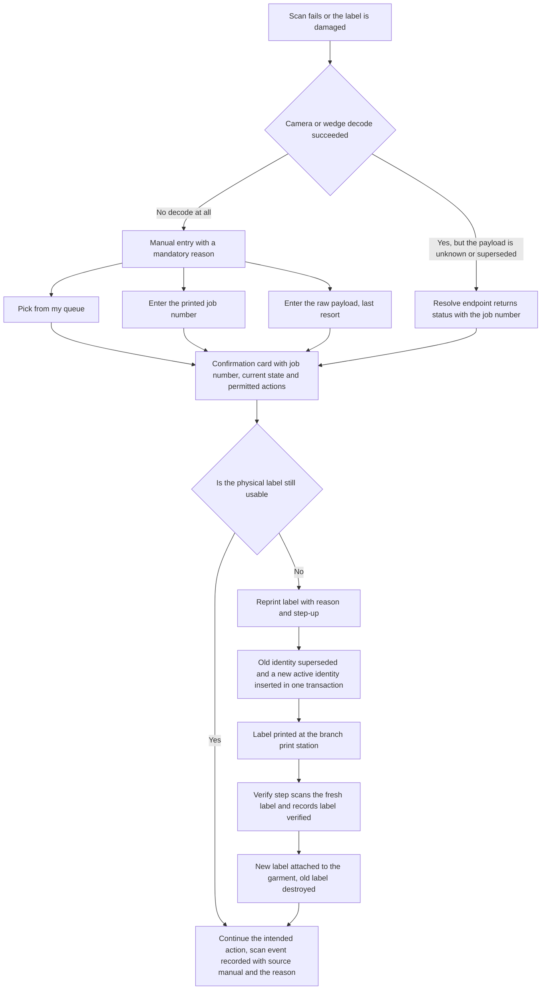

# Exception catalogue

Nothing in a tailoring shop goes to plan every day. This document is the authoritative catalogue of the exceptions
HyFib Tailor 360 must handle — what triggers each one, who notices it, what the staff member does immediately,
what the system does to help, what compensating record is written, what the customer is told, and which issue
implements it. It is the companion to [`state-transitions.md`](state-transitions.md), which gives the transitions
themselves, and to [`workflows/branch-scenarios.md`](workflows/branch-scenarios.md), which gives the branch
dimension. Terms are defined in [`glossary.md`](glossary.md); the journey is in [`00-overview.md`](00-overview.md).
Every statement here traces to [`../IMPLEMENTATION_PLAN.md`](../IMPLEMENTATION_PLAN.md); anything the plan has not
settled is registered in section 6 against plan [Section 11](../IMPLEMENTATION_PLAN.md) and mirrored into
[`assumptions-and-open-decisions.md`](assumptions-and-open-decisions.md).

---

## 1. The four rules every exception obeys

1. **Nothing is deleted.** Business records are never soft-deleted or hard-deleted. An exception is resolved by a
   compensating record — a credit note, a correction scan event, a compensating ledger entry, a reversal row, a
   new active barcode identity — that sits beside the original and leaves the history readable (plan Section 2.2).
2. **The refusal is explicit.** A blocked action returns an RFC 9457 problem-details response with a reason code
   and the next action, never a silent no-op and never a toast. Denied state-changing and step-up requests are
   audited (plan Sections 4.4 and 4.6).
3. **The customer hears it from the system, on a consented channel.** Consent and communication preferences are
   checked server-side before any send; quiet hours, de-duplication and rate limits apply; a send refused for any
   of those reasons is suppressed **and audited** with the reason, so "we told them" is verifiable (issue #47).
4. **The compensating record carries a reason.** Reasons are mandatory, stored on the audit event, and taken from
   configurable reason codes where the exception has them, so the same situation reads the same way in reports.

---

## 2. The catalogue

Detecting role names follow [`glossary.md`](glossary.md). "System" means a worker job running under a
a system principal from a declared `[WorkerJob]` scope.

| ID | Exception | Trigger | Detecting role | Immediate action | System support | Compensating record | Customer communication | Issue |
| --- | --- | --- | --- | --- | --- | --- | --- | --- |
| **EX-01** | Duplicate customer | A create or a search reveals a probable second record for the same person: phone match, name similarity on both the transliterated and native name forms, or address similarity | Reception | Compare the scored duplicate card against the person in front of you; use the existing record, or create a new one and record why | `duplicate_candidates` with score and **explained** reasons; inline duplicate warning always visible on the create screen; search by phone, last four to six digits, customer number or alias; masked disambiguation card showing branch and last order date | `customer_merges` written by `POST /customers/{survivor}/merge` — irreversible, reason and step-up; the merged number survives as an alias and measurements and orders are re-pointed by `CustomerMerged` | None routinely. After a merge the survivor's consent and channel preferences govern every later message | #26 |
| **EX-02** | Missing material | A reservation cannot be satisfied, or a Tailor finds the cloth or trim absent when issuing against a phase | Tailor or Inventory Clerk | Record the shortage against the job and phase; place the garment job on hold with a reason, or issue an approved substitute | Reservation serialised by a row lock on the balance so stock cannot be oversubscribed; negative-stock policy configurable to block or to allow with approval; low-stock alert state machine raised, acknowledged, snoozed, escalated, cleared; the hold appears on the Branch Manager's overdue-hold dashboard | `holds` row with reason and approval; ledger `release` entry for the reservation; purchase order and receipt for the replenishment; `inventory.approve_negative_stock` where the policy allows a negative balance — reason and step-up | Only if the promised date moves: an explicit reschedule with a reason, sent on the consented channel | #39, #40, #34 |
| **EX-03** | Changed measurements | The customer's measurements change, or an error is found, after the values were captured | Reception, Measurement Staff or Tailor Master | Capture a **new** measurement version — never edit the old one — then decide the route by production state | Before production: `POST /orders/{id}/revisions` re-validates and re-prices while every job is still `confirmed`. After production starts: the revision endpoint refuses and the only route is an alteration request | `order_revisions` row and a superseded estimate, or `alteration_requests` with its price and due-date decisions; the new `MeasurementVersionConfirmed` stands beside the old one | The re-priced estimate or the alteration decision, with any date change, on the consented channel | #28, #32a, #34 |
| **EX-04** | Rejected QC | A criterion of the published QC checklist version fails | Tailor Master, or the checklist's responsible role | Record the failure with defect codes and evidence photographs; decide rework or, exceptionally, a hold | `qc_results` immutable and embedding a copy of the criteria evaluated; evidence media required where the checklist says so; the ready gate stays closed with `QcPassed` as the blocking reason | The failed `qc_results` row itself is the record; it is never edited, and a later result supersedes without deleting | None at the moment of failure. The customer hears about it only if the promised date moves | #34 |
| **EX-05** | Rework | A rework task is opened after a failed QC, or a re-QC fails again | Tailor Master, then the assigned Tailor | Open the rework naming the phase to return to; reassign if capability or capacity demands it | `rework_tasks` and `ReworkOpened`; the job returns to the named phase without losing history; earlier completions stay attributed to the previous assignee; repeated rework is surfaced on the quality dashboard | `rework_tasks` row and a **new** QC result after the rework; the ready gate needs a fresh pass and never inherits the previous one | A reschedule notification where the promised date moves; otherwise silent | #34, #45 |
| **EX-06** | Late order | The due-date and SLA evaluator finds a job due soon, overdue, or a phase past its SLA | System, then Branch Manager and Tailor Master | Triage the overdue queue; expedite, reassign, or reschedule with a reason | Evaluator every fifteen minutes in the branch timezone against the branch working calendar; `JobDueSoon`, `JobOverdue` and `PhaseSlaBreached` raised **exactly once** per job and condition and cleared on completion; due-soon window and escalation delay are branch configuration; queue filters for overdue, blocked, due soon and priority | `JobRescheduled` with reason where a new date is promised; the original date remains on the job's history | A reschedule message on the consented channel, and the status link if the customer has one. An overdue job is never silently left | #33, #47, #45 |
| **EX-07** | Damaged or unreadable label | A camera or wedge scan fails, or the label is torn, soiled or unreadable | Tailor, Reception or Delivery Staff | Resolve the job by its printed job number or from the personal queue; request a reprint if the label cannot be relied on | `GET /custody/jobs/by-number/{jobNumber}` returns the same confirmation card as a scan; `ManualEntrySource` offers pick from my queue, then job number, then raw payload last; a `superseded` or `invalidated` response carries a **Reprint label** action; the print station's Verify step scans the fresh label before it is attached | A new active `barcode_identities` row with the old one superseded in one transaction under the job's row lock; a `label_prints` row with reason and batch; a scan event with `source = manual` and the manual reason | None. This is an internal recovery | #35, #36 |
| **EX-08** | Cancelled order | The customer cancels, or the business cannot complete the work | Reception or Branch Manager | Check what has already happened — material issued, invoice posted, garment in custody elsewhere — and run the compensating flows before cancelling | Cancellation is **blocked** in prohibited financial, stock and custody states, with the blocking reason named; configurable reason codes; `OrderCancelled` and `JobCancelled` carry the billing adjustment intent as event data because Orders never posts a financial document | `cancellations` row with reason and approval; credit note where value was recognised; reservation released as a ledger entry; customer material returned and recorded; barcode identity invalidated where no garment exists | A cancellation confirmation stating what was cancelled and what is refunded or still owed, on the consented channel | #34, #42, #43 |
| **EX-09** | Refund | Money must go back after a cancellation, an overcharge, a duplicate payment or an unrecoverable service failure | Cashier, approved by Branch Manager or Owner | Establish the amount from Billing's own records; take the approval; record the refund in a mode that allows refunds | Balance is computed only by Billing as posted charges minus allocations minus credits plus refunds; the payment mode's `allowed_for_refund` flag gates the tender; refunds are append-only | `refunds` or `reversals` row — reason and step-up, `payments.refund` or `payments.reverse` — plus the credit note where the charge is being relieved, and a numbered receipt | A refund confirmation with the amount, the mode and the reference, on the consented channel | #43, #42 |
| **EX-10** | Unpaid dispatch attempt | The delivery team's receive scan finds the payment rule unsatisfied | Delivery Staff, then Cashier and Owner | Stop. Take the balance at the counter, or obtain a single-use dispatch exception approved with step-up by someone other than the dispatcher | `IDispatchEligibilityQuery` is evaluated server-side and **fails closed**: `Unpaid`, `PartialBelowThreshold` and `NotEvaluated` are rejected `custody.dispatch-blocked`; the queue shows the policy outcome and the blocking reason per job; every denied attempt is audited | `payments` row and receipt when the balance is taken, or a `dispatch_exceptions` record bound to order, job set, maximum outstanding amount, policy version and an expiry of at most 72 hours, consumed exactly once | A payment request or reminder before the visit, and a receipt afterwards. Never a message implying the garment is on its way while it is blocked | #43, #48, #37 |
| **EX-11** | Negative feedback | Feedback arrives at or below the configured rating threshold, or the customer explicitly asks for an alteration | System, then Branch Manager | Own the case within its due time; contact the customer; decide the alteration or the remedy | `service_recovery_cases` created idempotently — exactly one case per low rating or alteration request; branch `service_recovery_policy` sets the threshold, the owning role, the due time in business hours and the escalation ladder; free-text visibility limited by role and branch | The case itself with contact attempts, resolution code and closure; an accepted alteration opens a garment job through `IAlterationRequests.OpenAsync(...)`, carrying the configured reason code and the feedback identifier rather than the words the customer wrote; feedback rows are read-only after the edit window and never mutate measurements, design or job history | The contact during the case, and a closure confirmation on the preferred consented channel when the case closes — suppressed and audited when no consented channel exists | #49, #34, #47 |
| **EX-12** | Failed or returned delivery | Nobody at the address, refusal at the door, or the parcel comes back to the branch | Delivery Staff | Record the outcome with its reason at the door; bring the garment back and receive it into branch custody | `DeliveryFailed` and `DeliveryReturned` create the compensating custody transfer back to the branch and reopen the delivery queue entry; the spent dispatch authorisation cannot be reused | The compensating `custody_transfers` and `scan_events` rows; a new dispatch authorisation is required for the next attempt, re-evaluated against the payment rule from scratch | A message explaining the failed attempt and offering a new slot, on the consented channel | #48 |
| **EX-13** | Custody mismatch or lost garment | A scan contradicts the recorded custodian, a duplicate or stale event arrives, the location is unknown, or a garment cannot be found | Any scanning role, then Branch Manager | Open a reconciliation case with evidence rather than forcing the scan through | Stale and conflicting events are rejected with problem details; duplicates return the original outcome; case types mismatch, duplicate, stale, unknown location, lost and disputed, each with its own screen | A new `scan_events` row with `action = CORRECTION` linked to the corrected event and the case; above the configured threshold — branch change, phase skip, dispatch reversal — approval by a different user with `custody.approve_reconciliation`, reason and step-up | Only where the customer is affected, for example a reschedule while the garment is found | #37 |
| **EX-14** | Notification not delivered | A provider rejects, bounces or times out, or a delivery dead-letters after its retries | System, then Branch Manager | Check the delivery record and the reason; retry or replay; fall back to a second channel or a telephone call | `deliveries` carry queued, accepted, delivered, failed, bounced, suppressed and acknowledged with the provider reference and attempt count; retry with backoff, de-duplication, rate limits and a dead-letter queue; operator screen for failed and dead-lettered deliveries | A replay recorded under `notifications.replay` — reason and step-up — never an edit of the original delivery row | The message itself, resent on the fallback channel where consent allows; the in-app centre is the staff-side fallback | #47 |
| **EX-15** | Dispatch exception expired or invalid | An approved exception is presented after its expiry, or the balance grew or the job set changed since approval | System, at the dispatch scan | Treat it as a fresh unpaid dispatch attempt: take the balance or seek a new approval | The exception is single-use and validated at consumption against the outstanding balance, the job set, the policy version and the expiry; `DispatchExceptionExpired` is published and surfaced on the Owner dashboard | A new `dispatch_exceptions` record, or a payment and receipt | As EX-10 | #43 |

---

## 3. The two flows worth drawing

### 3.1 Unpaid dispatch attempt (EX-10)

The payment rule is enforced at the **delivery team's receive scan at the branch**, not at the customer's door, so
that a garment never leaves the branch against an unpaid balance and no staff member is left negotiating money on
a doorstep. Billing computes the answer; Custody enforces it.

Three rules make this safe and are not negotiable at the counter: the approver of an exception must be a different
person from the dispatcher; the exception expires within at most 72 hours and is consumed exactly once; and jobs
that failed QC, are on hold or are in the wrong custody have **no** exception path at all.

### 3.2 Damaged or unreadable label (EX-07)

A damaged label must never stop work, and must never become a licence to guess which garment is which. The
recovery path therefore resolves the **job**, not the payload, and every step is audited.

The old payload is **never** re-issued: it keeps resolving as `superseded` so that an old label found later in the
workshop is recognised as stale rather than mistaken for a live garment. Manual lookup requires
`custody.manual_lookup` and a reason on every use, and reprint and invalidation require step-up, because both are
ways of breaking the one-to-one bond between a garment and its identity.

---

## 4. Exceptions that need more than a row

### 4.1 Duplicate customer (EX-01)

Prevention is cheaper than the cure, because the cure is irreversible. The create screen shows the duplicate
warning inline and always visible, the search offers a segmented phone or name mode so Reception can use the
telephone keypad for a number and the text keyboard for a name, and the disambiguation card carries enough to
decide — name, native name, masked phone, branch, last order date — without opening a record. A merge is a
last resort: it is authorised by `customers.merge` with step-up and a reason, it re-points measurements and orders
through `CustomerMerged`, it keeps the merged customer number searchable as an alias, and there is no un-merge.

### 4.2 Changed measurements (EX-03)

The rule that makes this tractable is that measurement versions are never edited and a garment job holds a
**copy** of the values it was confirmed with. So a change is always a new version plus a decision about what to do
with work already committed:

| When the change arrives | Route | Effect |
| --- | --- | --- |
| Before confirmation | Capture a new version and select it on the draft | Nothing to compensate |
| After confirmation, before any job enters production | `POST /orders/{id}/revisions` with a reason | Re-validation and re-pricing, a superseded estimate and a new revision row |
| After production has started | Alteration request under issue #34 | Price and due-date decisions taken and communicated before work resumes |
| After delivery | Alteration request from staff or from feedback | A new or reopened garment job linked to the original |

### 4.3 Cancelled order and refund (EX-08, EX-09)

These two are one conversation with the customer and two separate records in the system. Cancellation is an
Orders decision that is refused while a prohibited financial, stock or custody state stands; the money is a
Billing decision made from Billing's own records. Orders never posts a financial document: the cancellation
credit travels to Billing as an intent on the event. Whether advances are refundable on cancellation, and under
what approval, is an owner decision registered as OD-04 with OD-05 in
[`assumptions-and-open-decisions.md`](assumptions-and-open-decisions.md) and must not be assumed either way.

### 4.4 Negative feedback (EX-11)

The trigger is deliberately mechanical so that a bad experience cannot be quietly absorbed: a rating at or below
the branch threshold — default at most 3 of 5, **proposed, to be confirmed** — or any explicit alteration request
opens exactly one service-recovery case, idempotently, on the feedback id. The case has an owner, a due time in
business hours and an escalation ladder. Closing it emits `ServiceRecoveryClosed`, which becomes a closure
confirmation to the customer on their preferred consented channel; where no consented channel exists, the send is
suppressed and audited rather than skipped invisibly, and the case notes must record how the customer was reached.

---

## 5. What every exception leaves behind

| Exception | Compensating record | Where it is visible afterwards |
| --- | --- | --- |
| EX-01 duplicate customer | `customer_merges`, surviving alias | Customer timeline, audit |
| EX-02 missing material | Hold, ledger release, purchase receipt | Job card, ledger browser, hold dashboard |
| EX-03 changed measurements | New measurement version, order revision or alteration | Customer timeline, order revisions, job card |
| EX-04 rejected QC | Immutable failed QC result with defects and evidence | Job card, quality dashboard |
| EX-05 rework | Rework task and a fresh QC result | Job card, quality and turnaround analytics |
| EX-06 late order | Reschedule with reason | Job history, pipeline and turnaround analytics |
| EX-07 damaged label | Superseded identity, new identity, label print record, manual scan event | Custody timeline, label print history |
| EX-08 cancelled order | Cancellation row, credit note, released reservations | Order timeline, financial reports |
| EX-09 refund | Refund or reversal row, credit note, receipt | Customer timeline, cashier session, receivables |
| EX-10 unpaid dispatch attempt | Payment and receipt, or a consumed dispatch exception | Delivery queue, Owner dashboard, audit |
| EX-11 negative feedback | Service-recovery case, alteration job | Customer timeline, quality analytics |
| EX-12 failed delivery | Compensating custody transfer, reopened queue entry | Custody timeline, delivery reports |
| EX-13 custody mismatch | Correction scan event and reconciliation case | Custody timeline showing original and correction side by side |
| EX-14 notification failure | Delivery attempts and an audited replay | Notification operator screen, audit |
| EX-15 expired dispatch exception | Expiry event and a new payment or approval | Owner dashboard, audit |

---

## 6. Open decisions raised by this document

Registered against plan [Section 11](../IMPLEMENTATION_PLAN.md); to be transcribed into
[`assumptions-and-open-decisions.md`](assumptions-and-open-decisions.md) when settled.

| ID | Question | Interim position | Resolves under | Owner | Raised |
| --- | --- | --- | --- | --- | --- |
| **XQ-01** | The configurable reason-code lists for hold, cancellation, rework, delivery failure and custody correction | Proposed, to be confirmed: drafted from the seed configuration and reviewed with one representative each of Reception, Tailor Master, Inventory Clerk, Cashier and Delivery Staff at the exception review that issue #17 records | OD-10 initial catalogue and seed data | Business owner with the Tailor Master | 2026-09-04 |
| **XQ-02** | Who may approve a dispatch exception — Owner only, or Admin and Branch Manager too — and whether Delivery Staff may collect the balance at the door | Proposed, to be confirmed: Owner only, with no doorstep collection, until the owner decides otherwise; the plan's `collect_on_delivery` policy is not built unless it is chosen | OD-04 payment rule for dispatch | Business owner | 2026-09-04 |
| **XQ-03** | Whether an advance is refundable on cancellation, and with which approval | Already registered; refunds and reversals exist as compensating approved records and the business policy is confirmed at the workshop | OD-04 with OD-05 | Business owner with the accountant | 2026-09-04 |
| **XQ-04** | The service-recovery rating threshold, case due time and escalation ladder per branch | Proposed, to be confirmed: at most 3 of 5, owned by the Branch Manager, due within one business day | OD-15 operations ownership, with issue #49 | Business owner | 2026-09-04 |
| **XQ-05** | Whether a customer must be told when a garment fails QC, or only when the promised date moves | Proposed, to be confirmed: only when the date moves. Telling a customer about every internal failure erodes trust in the message channel | OD-03 providers and the notification policy, with issue #47 | Business owner | 2026-09-04 |

---

## 7. Review and maintenance

Issue #17 requires each exception flow to be walked through with one representative each of Reception, Tailor
Master, Inventory Clerk, Cashier and Delivery Staff, recorded in `reviews/exception-review.md`; the end-to-end
walkthroughs live in `walkthroughs.md`. This catalogue is amended by pull request only, in the same change that
adds or alters an exception path, and every new exception adds its row here, its transition rows in
[`state-transitions.md`](state-transitions.md) and its regression scenario to the business-scenario suite that
issue #61b maintains.
