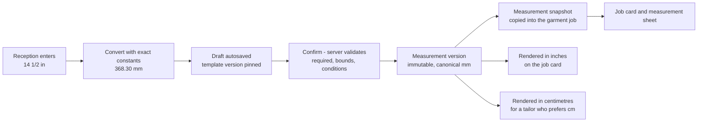

# Measurement templates

This document specifies the proposed measurement field set for every category in
[category-hierarchy.md](./category-hierarchy.md) — Blouse (Pattern), Blouse (Aari work), Salwar, Lehenga, Gown and
Kids — together with the units, precision, validation bands, conditional rules and diagram references each field
carries. It is the seed source for issue #27 (configurable measurement-template administration) and the reference
for the capture wizard built in issue #28: `Tailor360.Cli init-reference-data` loads exactly the templates
described here, and the business review of each template is an acceptance criterion of #27. Every field set below
is **proposed and to be confirmed** by the Owner with the Tailor Master (Section 11 item 10 of
[../IMPLEMENTATION_PLAN.md](../IMPLEMENTATION_PLAN.md)); the units, storage and validation rules are settled.

Templates are versioned configuration, not code. An administrator adds a field, changes a label, widens a range or
adds a diagram through the template administration screens; no deployment is needed.

---

## 1. Scope and ownership

| Aspect | Statement |
| --- | --- |
| Owning module | Customers/Measurements (`customers` schema): `measurement_templates` → `template_versions` → `template_fields` |
| Implementing issues | #27 (template administration, lifecycle, publish validation), #28 (capture, validation, versioning, reuse), #31 (uploaded diagram media; bundled line drawings until then) |
| Linked from | The catalogue: every service type carries exactly one published measurement-template version — link 1 in [category-hierarchy.md](./category-hierarchy.md) |
| Captured by | Reception at intake or from the **Measurements needed** queue; reviewed by the Tailor Master; read by the assigned Tailor on the job card and the printed measurement sheet |
| Data class | Personal data. Values are never written to logs or telemetry (the redaction policy lists `measurements.*`), reads of the measurement sheet are audited, and retention is set in [../nfr/data-classification.md](../nfr/data-classification.md). |
| Seeded templates | `MT_BLOUSE_PATTERN`, `MT_BLOUSE_AARI`, `MT_SALWAR`, `MT_LEHENGA`, `MT_GOWN`, `MT_KIDS` — one published version each (version 1) |

---

## 2. Units, storage and rendering

The single most important rule in this document:

> **Every length is stored canonically in millimetres and is only ever rendered in the display unit the user has
> chosen.** The stored value is the converted value the user entered — never a value re-derived from a rounded
> display value, and never a value converted twice.

| Rule | Specification |
| --- | --- |
| Canonical unit | Millimetres (`mm`) for every length, stored as `numeric(8,2)`. Counts (for example `kali_count`) are stored as integers with the canonical unit `count`. |
| Display units | Inches (`in`) and centimetres (`cm`) for every length. Millimetres are never shown to staff; they exist only in storage, the API and this document's ranges. |
| Conversion constants | Exact: `1 in = 25.4 mm`, `1 cm = 10 mm`. No approximations, no locale-dependent parsing. |
| Unit choice | Chosen once at the start of capture (template default, or the user's saved preference) and shown as a persistent adornment on every field. Changing it mid-capture requires an explicit confirmation and converts nothing silently (#28). |
| Precision | Per field. Inch fields use a fraction step — `1/8` for general lengths, `1/16` for the small shaping and neckline fields where a quarter-inch error changes the fit. Centimetre fields use one decimal place. Millimetre storage keeps two decimals so a `1/16 in` step (1.5875 mm) round-trips. |
| Rounding | Half-up to the field's precision **for display only**. |
| Round-trip guarantee | `toDisplay(fromDisplay(x)) == x` at the field's precision in both display units — a property test in #27. |
| Entry ergonomics | Inch fields with a fraction step use a whole-number keypad plus a segmented fraction control (`FractionInput`); centimetre fields use `inputmode="decimal"` and accept both `,` and `.` (#28, #50). |
| Historic rendering | A measurement version always renders through the template version it was captured under, in the reader's chosen display unit. Changing the template later never changes a stored value. |

Worked example: Reception enters a blouse length of `14 1/2 in`. The client sends `368.30` mm. The value stored is
`368.30`. A Tailor whose preference is centimetres sees `36.8 cm`; the same record printed for a Tailor working in
inches shows `14 1/2 in`. No arithmetic happens twice.

---

## 3. Field keys, labels and groups

| Rule | Convention | Example |
| --- | --- | --- |
| Field key | `lower_snake_case`, ASCII, unique **within a template version**, immutable once the version is published | `front_neck_depth` |
| Shared dictionary | Keys are drawn from the shared dictionary in Section 4 so that the same measurement means the same thing in every template, and so a value can be compared or carried between categories | `chest_bust` means the same in `MT_SALWAR` and `MT_GOWN` |
| Label | Free text, editable at any time, localisable (`en-IN` plus optional `ta-IN`). **The label may differ from the key**: `blouse_full_length` is labelled "Blouse length" in `MT_BLOUSE_PATTERN` and "Choli length" in `MT_LEHENGA`. | — |
| Group | Presentation grouping that drives the wizard steps and the printed sheet. Groups are ordered; fields are ordered within a group. | `Bodice`, `Sleeve`, `Neckline`, `Shaping`, `Bottom` |
| Display order | Integer; the physical order in which a tailor measures, so that `enterkeyhint="next"` follows the tape and not the alphabet | — |
| Help text | One short sentence stating where the tape starts and ends. Required for every field. | "Round the fullest part of the bust, tape level at the back." |

---

## 4. Shared field dictionary

These keys appear in more than one template. A template includes a key only when the category needs it; the
label, ranges and precision may be tuned per template, the meaning may not.

| Key | Meaning (where the tape runs) | Typical group |
| --- | --- | --- |
| `shoulder` | Shoulder point to shoulder point across the back | Bodice |
| `upper_chest` | Round the chest above the bust, under the armholes | Bodice |
| `chest_bust` | Round the fullest part of the bust | Bodice |
| `waist` | Round the natural waist | Bodice |
| `hip` | Round the fullest part of the hip | Bodice |
| `armhole` | Round the armhole, over the shoulder and under the arm | Bodice |
| `sleeve_length` | Shoulder point to the intended sleeve hem | Sleeve |
| `sleeve_round` | Round the arm at the sleeve opening | Sleeve |
| `sleeve_upper_round` | Round the widest part of the upper arm | Sleeve |
| `front_neck_depth` | Shoulder-seam line at the neck, straight down the front to the neckline point | Neckline |
| `back_neck_depth` | Shoulder-seam line at the neck, straight down the back to the neckline point | Neckline |
| `cross_front` | Across the front, armhole crease to armhole crease | Shaping |
| `cross_back` | Across the back, armhole crease to armhole crease | Shaping |
| `dart_point` | Shoulder point down to the bust apex | Shaping |
| `apex_to_apex` | Apex to apex across the bust | Shaping |
| `blouse_full_length` | Shoulder seam at the neck to the intended garment hem (blouse or choli) | Bodice |

---

## 5. Body measurements, finished measurements and the ease convention

Two kinds of value are captured, and confusing them is the most common source of a re-make:

| Kind | Definition | How it is taken |
| --- | --- | --- |
| **Body** | The customer's body, tape snug, no ease added | Over a fitted garment, tape level, customer standing relaxed |
| **Finished** | The intended dimension of the finished garment | Measured on the body to the point the hem or opening should sit, or measured on a garment the customer brings as a reference |

**Convention.** Every field in the seeded templates is a **body** measurement except the length and opening
fields listed per category below, which are **finished**. The kind is stated in the field's help text and on the
printed measurement sheet; it is never left to the reader to infer.

**Ease/allowance convention.** Ease is the difference between a body measurement and the cut, and it is a craft
decision belonging to the category, the service type and the material — not a property of the customer. Therefore:

1. Ease is **never** added to a stored measurement. What Reception captures is what was measured.
2. Ease is applied at cutting by the Tailor Master or the Tailor, following the per-category standard published in [workflows/](./workflows/).
3. Finished fields carry no ease by definition — the value already is the intended finished dimension.
4. Where a customer asks for a deliberately loose or tight fit, that is recorded as a design selection or a job note (#30, #32), not by inflating a body measurement.

Proposed standard ease at cutting (**proposed, to be confirmed** by the Owner with the Tailor Master; expressed in
millimetres added to the body measurement):

| Category | Chest/bust | Waist | Hip | Armhole | Sleeve round | Notes |
| --- | --- | --- | --- | --- | --- | --- |
| Blouse — Pattern | +25 | +25 | — | +20 | +25 | Lining adds nothing; padding is allowed for in the cut, not the measurement |
| Blouse — Aari work | +35 | +35 | — | +25 | +30 | Extra allowance because embroidered fabric loses drape and the frame stretches the ground |
| Salwar (kameez) | +50 | +50 | +50 | +25 | +30 | — |
| Salwar (bottom) | — | +0 with elastic, +25 with drawstring | +50 | — | — | Thigh +60, knee +40 |
| Lehenga (choli) | +25 | +25 | — | +20 | +25 | Skirt waist +25 |
| Gown | +40 | +40 | +50 | +25 | +30 | — |
| Kids | +40 | +40 | — | — | +25 | `MT_KIDS` captures neither hip nor armhole, so no ease is prescribed for them; plus a growth allowance of +20 mm on garment length |

Whether these figures should become a structured `measurement_kind` and `default_ease_mm` on `template_fields`,
rather than help text and workflow guidance, is open decision **OD-MEA-04**.

---

## 6. Required fields, conditional fields and hidden values

| Rule | Specification |
| --- | --- |
| Required | A required field must have a value before the capture can be confirmed. Validation is server-authoritative; the client's copy is a convenience only (#28). |
| Conditional | A field may be shown or hidden by a rule. The seeded rules are simple: `sleeve_length`, `sleeve_round` and `sleeve_upper_round` are hidden when the garment is sleeveless; slit, dupatta and Aari-placement fields are hidden when the corresponding design option is not selected. |
| Rule operands | A rule reads other **fields of the same template version** and the garment's **design selections** (#30), written `design.<option_group_code>`. The operand namespace is confirmed in **OD-MEA-02**; the fallback, if rules may read template fields only, is a `has_sleeves` yes/no field seeded at the head of the Sleeve group. |
| Required + conditional | A conditionally shown field may be required **while it is shown**. A field that is required and hidden by an unconditional rule is a publish-time error (#27). |
| Hidden values | A hidden field is not required, is not validated and **its value is not stored**. Hiding a field after a value was typed clears it, with a visible notice — a hidden value is never silently carried into the garment job's snapshot. |
| Standalone capture | When measurements are captured outside order intake there are no design selections. Conditional fields default to **shown and optional**, so nothing is lost; the wizard states that sleeve fields may be skipped for a sleeveless garment. |
| Publish-time checks (#27) | Unknown field keys in conditions; cyclic conditional dependencies; `min > max`; a warning band outside `min`/`max`; a precision not allowed for the display unit; a required field hidden unconditionally; duplicate keys; a missing or retired category or service reference. |

---

## 7. Validation bands: reject versus confirm

Two bands guard every numeric field. They exist to catch tape-reading and unit-entry mistakes without ever
standing between a tailor and an unusual but real customer.

| Band | Behaviour | Where enforced |
| --- | --- | --- |
| **Hard bounds** (`Min`, `Max` in the tables below) | The value is **rejected**. The capture cannot be confirmed. Returned as a field-level problem detail. | Client and server; the server is authoritative |
| **Confirmation band** (Section 9 tables, per category) | The value is **accepted after an explicit acknowledgement**. The field shows an inline warning — "This is outside the usual range. Check the tape and the unit, then confirm." — and the wizard's review step lists every acknowledged value before confirmation. A warning never blocks a save and never blocks the order. | Client warning; the server records the acknowledgement |
| Cross-field sanity checks (proposed) | Warnings only, never rejections: `waist > chest_bust + 150`, `cross_back > shoulder`, `apex_to_apex > chest_bust / 2`, `upper_chest > chest_bust`, kids `garment_length > height`. | #27 publish-time rule set and #28 review step |

Hard bounds are deliberately wide: they exclude impossible values (a 3 m shoulder, a 2 mm waist, a centimetre
value typed into an inch field) and nothing else. The confirmation band is where the real accuracy check happens.
Recording the acknowledgement on the measurement version, so a later dispute can show that an unusual value was
seen and confirmed at capture, is open decision **OD-MEA-05**.

---

## 8. Diagrams

| Rule | Specification |
| --- | --- |
| Reference format | `<diagram_key>#<field_key>` — the sheet plus the callout for that field, for example `blouse_front_v1#front_neck_depth` |
| Storage | `template_fields.diagram_media_id` when an image has been uploaded (#31); until then the bundled line drawing identified by `diagram_key` (#27) |
| Alt text | `diagram_alt` is **required** for every field and describes the measuring path in words, so the field is usable with a screen reader and on a printed sheet: "From the shoulder seam beside the neck, straight down the front to the neckline point." |
| Seeded sheets | `blouse_front_v1`, `blouse_back_v1`, `blouse_sleeve_v1`, `blouse_aari_placement_v1`, `salwar_kameez_v1`, `salwar_bottom_v1`, `lehenga_skirt_v1`, `lehenga_dupatta_v1`, `gown_front_v1`, `kids_front_v1` |
| Versioning | The `_v1` suffix is part of the key. A redrawn sheet is `_v2` and is referenced by a new template version; existing versions keep pointing at the drawing their fields were captured against. |
| Placement | Beside the field list on tablet and desktop; above the active field on phone; printed on the measurement sheet (#28) |

---

## 9. Seeded templates by category

In every table below: `Canonical unit` is millimetres for all lengths (`count` for counts, `—` for choice fields);
`Display units` are inches and centimetres; `Precision` is written as the inch step and the centimetre decimals;
`Min` and `Max` are the hard bounds in millimetres; `Conditional rule` is empty (`—`) when the field is always
shown. Bounds are stored canonically and rendered to the user in the chosen display unit.

### 9.1 `MT_BLOUSE_PATTERN` — Blouse, Pattern

Linked from `BLOUSE_PATTERN.STITCHING`, `BLOUSE_PATTERN.ALTERATION` and `BLOUSE_PATTERN.RESTITCHING`.

| Key | Label | Group | Canonical unit | Display units | Precision | Required | Min | Max | Conditional rule | Diagram reference |
| --- | --- | --- | --- | --- | --- | --- | --- | --- | --- | --- |
| `blouse_full_length` | Blouse length | Bodice | mm | in, cm | 1/8 in · 1 dp cm | Yes | 250 | 900 | — | `blouse_front_v1#blouse_full_length` |
| `shoulder` | Shoulder | Bodice | mm | in, cm | 1/8 in · 1 dp cm | Yes | 250 | 560 | — | `blouse_back_v1#shoulder` |
| `upper_chest` | Upper chest | Bodice | mm | in, cm | 1/8 in · 1 dp cm | Yes | 500 | 1400 | — | `blouse_front_v1#upper_chest` |
| `chest_bust` | Chest (bust) | Bodice | mm | in, cm | 1/8 in · 1 dp cm | Yes | 550 | 1500 | — | `blouse_front_v1#chest_bust` |
| `waist` | Waist | Bodice | mm | in, cm | 1/8 in · 1 dp cm | Yes | 450 | 1500 | — | `blouse_front_v1#waist` |
| `armhole` | Armhole round | Bodice | mm | in, cm | 1/8 in · 1 dp cm | Yes | 250 | 700 | — | `blouse_sleeve_v1#armhole` |
| `sleeve_length` | Sleeve length | Sleeve | mm | in, cm | 1/8 in · 1 dp cm | Yes while shown | 40 | 800 | Hidden when `design.sleeve_style = SLEEVELESS` | `blouse_sleeve_v1#sleeve_length` |
| `sleeve_upper_round` | Sleeve upper round (bicep) | Sleeve | mm | in, cm | 1/8 in · 1 dp cm | No | 200 | 700 | Hidden when `design.sleeve_style = SLEEVELESS` | `blouse_sleeve_v1#sleeve_upper_round` |
| `sleeve_round` | Sleeve round at opening | Sleeve | mm | in, cm | 1/8 in · 1 dp cm | Yes while shown | 150 | 650 | Hidden when `design.sleeve_style = SLEEVELESS` | `blouse_sleeve_v1#sleeve_round` |
| `front_neck_depth` | Front neck depth | Neckline | mm | in, cm | 1/16 in · 1 dp cm | Yes | 30 | 450 | — | `blouse_front_v1#front_neck_depth` |
| `back_neck_depth` | Back neck depth | Neckline | mm | in, cm | 1/16 in · 1 dp cm | Yes | 30 | 500 | — | `blouse_back_v1#back_neck_depth` |
| `cross_front` | Cross front | Shaping | mm | in, cm | 1/16 in · 1 dp cm | Yes | 200 | 500 | — | `blouse_front_v1#cross_front` |
| `cross_back` | Cross back | Shaping | mm | in, cm | 1/16 in · 1 dp cm | Yes | 200 | 520 | — | `blouse_back_v1#cross_back` |
| `dart_point` | Dart point (shoulder to apex) | Shaping | mm | in, cm | 1/16 in · 1 dp cm | Yes | 120 | 400 | — | `blouse_front_v1#dart_point` |
| `apex_to_apex` | Apex to apex | Shaping | mm | in, cm | 1/16 in · 1 dp cm | Yes | 100 | 350 | — | `blouse_front_v1#apex_to_apex` |

**Finished fields:** `blouse_full_length`, `sleeve_length`, `sleeve_round`, `front_neck_depth`, `back_neck_depth`.
All others are body measurements.

**Confirmation band** (accepted after acknowledgement; outside the hard bounds above the value is rejected):

| Key | Warn below (mm) | Warn above (mm) |
| --- | --- | --- |
| `blouse_full_length` | 330 | 520 |
| `shoulder` | 320 | 480 |
| `upper_chest` | 680 | 1200 |
| `chest_bust` | 710 | 1270 |
| `waist` | 610 | 1220 |
| `armhole` | 330 | 560 |
| `sleeve_length` | 100 | 650 |
| `sleeve_upper_round` | 230 | 550 |
| `sleeve_round` | 200 | 500 |
| `front_neck_depth` | 50 | 300 |
| `back_neck_depth` | 50 | 350 |
| `cross_front` | 280 | 430 |
| `cross_back` | 300 | 450 |
| `dart_point` | 180 | 330 |
| `apex_to_apex` | 150 | 280 |

### 9.2 `MT_BLOUSE_AARI` — Blouse, Aari work

Linked from `BLOUSE_AARI.STITCHING`, `BLOUSE_AARI.ALTERATION` and `BLOUSE_AARI.RESTITCHING`. The bodice, sleeve,
neckline and shaping fields are identical to `MT_BLOUSE_PATTERN` (same keys, same meaning, same bounds); the
template adds the **Aari placement** group, which records where the embroidery sits on the garment. Motif,
density, stone type and placement style are **design options** (#30), not measurements.

| Key | Label | Group | Canonical unit | Display units | Precision | Required | Min | Max | Conditional rule | Diagram reference |
| --- | --- | --- | --- | --- | --- | --- | --- | --- | --- | --- |
| `blouse_full_length` | Blouse length | Bodice | mm | in, cm | 1/8 in · 1 dp cm | Yes | 250 | 900 | — | `blouse_front_v1#blouse_full_length` |
| `shoulder` | Shoulder | Bodice | mm | in, cm | 1/8 in · 1 dp cm | Yes | 250 | 560 | — | `blouse_back_v1#shoulder` |
| `upper_chest` | Upper chest | Bodice | mm | in, cm | 1/8 in · 1 dp cm | Yes | 500 | 1400 | — | `blouse_front_v1#upper_chest` |
| `chest_bust` | Chest (bust) | Bodice | mm | in, cm | 1/8 in · 1 dp cm | Yes | 550 | 1500 | — | `blouse_front_v1#chest_bust` |
| `waist` | Waist | Bodice | mm | in, cm | 1/8 in · 1 dp cm | Yes | 450 | 1500 | — | `blouse_front_v1#waist` |
| `armhole` | Armhole round | Bodice | mm | in, cm | 1/8 in · 1 dp cm | Yes | 250 | 700 | — | `blouse_sleeve_v1#armhole` |
| `sleeve_length` | Sleeve length | Sleeve | mm | in, cm | 1/8 in · 1 dp cm | Yes while shown | 40 | 800 | Hidden when `design.sleeve_style = SLEEVELESS` | `blouse_sleeve_v1#sleeve_length` |
| `sleeve_upper_round` | Sleeve upper round (bicep) | Sleeve | mm | in, cm | 1/8 in · 1 dp cm | No | 200 | 700 | Hidden when `design.sleeve_style = SLEEVELESS` | `blouse_sleeve_v1#sleeve_upper_round` |
| `sleeve_round` | Sleeve round at opening | Sleeve | mm | in, cm | 1/8 in · 1 dp cm | Yes while shown | 150 | 650 | Hidden when `design.sleeve_style = SLEEVELESS` | `blouse_sleeve_v1#sleeve_round` |
| `front_neck_depth` | Front neck depth | Neckline | mm | in, cm | 1/16 in · 1 dp cm | Yes | 30 | 450 | — | `blouse_front_v1#front_neck_depth` |
| `back_neck_depth` | Back neck depth | Neckline | mm | in, cm | 1/16 in · 1 dp cm | Yes | 30 | 500 | — | `blouse_back_v1#back_neck_depth` |
| `cross_front` | Cross front | Shaping | mm | in, cm | 1/16 in · 1 dp cm | Yes | 200 | 500 | — | `blouse_front_v1#cross_front` |
| `cross_back` | Cross back | Shaping | mm | in, cm | 1/16 in · 1 dp cm | Yes | 200 | 520 | — | `blouse_back_v1#cross_back` |
| `dart_point` | Dart point (shoulder to apex) | Shaping | mm | in, cm | 1/16 in · 1 dp cm | Yes | 120 | 400 | — | `blouse_front_v1#dart_point` |
| `apex_to_apex` | Apex to apex | Shaping | mm | in, cm | 1/16 in · 1 dp cm | Yes | 100 | 350 | — | `blouse_front_v1#apex_to_apex` |
| `aari_front_work_height` | Front work area height | Aari placement | mm | in, cm | 1/8 in · 1 dp cm | Yes while shown | 50 | 800 | Hidden when `design.aari_placement` excludes `FRONT` | `blouse_aari_placement_v1#aari_front_work_height` |
| `aari_front_work_width` | Front work area width | Aari placement | mm | in, cm | 1/8 in · 1 dp cm | Yes while shown | 50 | 600 | Hidden when `design.aari_placement` excludes `FRONT` | `blouse_aari_placement_v1#aari_front_work_width` |
| `aari_back_work_height` | Back work area height | Aari placement | mm | in, cm | 1/8 in · 1 dp cm | No | 50 | 800 | Hidden when `design.aari_placement` excludes `BACK` | `blouse_aari_placement_v1#aari_back_work_height` |
| `aari_back_work_width` | Back work area width | Aari placement | mm | in, cm | 1/8 in · 1 dp cm | No | 50 | 600 | Hidden when `design.aari_placement` excludes `BACK` | `blouse_aari_placement_v1#aari_back_work_width` |
| `aari_neck_work_depth` | Neck work band depth | Aari placement | mm | in, cm | 1/16 in · 1 dp cm | No | 20 | 400 | Hidden when `design.aari_placement` excludes `NECK` | `blouse_aari_placement_v1#aari_neck_work_depth` |
| `aari_sleeve_work_length` | Sleeve work band length | Aari placement | mm | in, cm | 1/8 in · 1 dp cm | No | 30 | 500 | Hidden when `design.sleeve_style = SLEEVELESS` or `design.aari_placement` excludes `SLEEVE` | `blouse_aari_placement_v1#aari_sleeve_work_length` |
| `aari_border_width` | Hem border work width | Aari placement | mm | in, cm | 1/16 in · 1 dp cm | No | 10 | 300 | Hidden when `design.aari_placement` excludes `BORDER` | `blouse_aari_placement_v1#aari_border_width` |

**Finished fields:** as `MT_BLOUSE_PATTERN`, plus every `aari_*` field (they describe the finished garment, not
the body).

**Confirmation band:** as `MT_BLOUSE_PATTERN` for the shared fields, plus:

| Key | Warn below (mm) | Warn above (mm) |
| --- | --- | --- |
| `aari_front_work_height` | 80 | 600 |
| `aari_front_work_width` | 80 | 450 |
| `aari_back_work_height` | 80 | 600 |
| `aari_back_work_width` | 80 | 450 |
| `aari_neck_work_depth` | 25 | 250 |
| `aari_sleeve_work_length` | 50 | 400 |
| `aari_border_width` | 15 | 200 |

### 9.3 `MT_SALWAR` — Salwar

Linked from `SALWAR.STITCHING`, `SALWAR.ALTERATION` and `SALWAR.RESTITCHING`. Covers the kameez and the bottom in
one template; the bottom fields apply to salwar, churidar, pant and palazzo, with the style itself a design
option (#30).

| Key | Label | Group | Canonical unit | Display units | Precision | Required | Min | Max | Conditional rule | Diagram reference |
| --- | --- | --- | --- | --- | --- | --- | --- | --- | --- | --- |
| `kameez_length` | Kameez length | Kameez | mm | in, cm | 1/8 in · 1 dp cm | Yes | 600 | 1600 | — | `salwar_kameez_v1#kameez_length` |
| `shoulder` | Shoulder | Kameez | mm | in, cm | 1/8 in · 1 dp cm | Yes | 250 | 560 | — | `salwar_kameez_v1#shoulder` |
| `chest_bust` | Chest (bust) | Kameez | mm | in, cm | 1/8 in · 1 dp cm | Yes | 550 | 1500 | — | `salwar_kameez_v1#chest_bust` |
| `waist` | Waist | Kameez | mm | in, cm | 1/8 in · 1 dp cm | Yes | 450 | 1500 | — | `salwar_kameez_v1#waist` |
| `hip` | Hip | Kameez | mm | in, cm | 1/8 in · 1 dp cm | Yes | 550 | 1700 | — | `salwar_kameez_v1#hip` |
| `armhole` | Armhole round | Kameez | mm | in, cm | 1/8 in · 1 dp cm | Yes | 250 | 700 | — | `salwar_kameez_v1#armhole` |
| `sleeve_length` | Sleeve length | Sleeve | mm | in, cm | 1/8 in · 1 dp cm | Yes while shown | 40 | 800 | Hidden when `design.sleeve_style = SLEEVELESS` | `salwar_kameez_v1#sleeve_length` |
| `sleeve_round` | Sleeve round at opening | Sleeve | mm | in, cm | 1/8 in · 1 dp cm | Yes while shown | 150 | 650 | Hidden when `design.sleeve_style = SLEEVELESS` | `salwar_kameez_v1#sleeve_round` |
| `front_neck_depth` | Front neck depth | Neckline | mm | in, cm | 1/16 in · 1 dp cm | Yes | 30 | 450 | — | `salwar_kameez_v1#front_neck_depth` |
| `back_neck_depth` | Back neck depth | Neckline | mm | in, cm | 1/16 in · 1 dp cm | Yes | 30 | 500 | — | `salwar_kameez_v1#back_neck_depth` |
| `kameez_slit_height` | Side slit height | Kameez | mm | in, cm | 1/8 in · 1 dp cm | No | 0 | 700 | Hidden when `design.kameez_slit = NONE` | `salwar_kameez_v1#kameez_slit_height` |
| `salwar_waist_round` | Bottom waist round | Bottom | mm | in, cm | 1/8 in · 1 dp cm | Yes | 500 | 1500 | — | `salwar_bottom_v1#salwar_waist_round` |
| `waist_finish` | Waist finish | Bottom | — (choice: `ELASTIC`, `DRAWSTRING`, `BOTH`) | — | n/a | Yes | — | — | — | `salwar_bottom_v1#waist_finish` |
| `elastic_relaxed_length` | Elastic relaxed length | Bottom | mm | in, cm | 1/8 in · 1 dp cm | No | 400 | 1200 | Shown when `waist_finish` is `ELASTIC` or `BOTH` | `salwar_bottom_v1#elastic_relaxed_length` |
| `salwar_length` | Salwar length | Bottom | mm | in, cm | 1/8 in · 1 dp cm | Yes | 700 | 1300 | — | `salwar_bottom_v1#salwar_length` |
| `thigh_round` | Thigh round | Bottom | mm | in, cm | 1/8 in · 1 dp cm | Yes | 350 | 900 | — | `salwar_bottom_v1#thigh_round` |
| `knee_round` | Knee round | Bottom | mm | in, cm | 1/8 in · 1 dp cm | Yes | 250 | 700 | — | `salwar_bottom_v1#knee_round` |
| `bottom_round` | Bottom (ankle) round | Bottom | mm | in, cm | 1/8 in · 1 dp cm | Yes | 200 | 700 | — | `salwar_bottom_v1#bottom_round` |

`waist_finish` is a choice field, not a length; see Section 10 and open decision **OD-MEA-03**.

**Finished fields:** `kameez_length`, `sleeve_length`, `sleeve_round`, `front_neck_depth`, `back_neck_depth`,
`kameez_slit_height`, `elastic_relaxed_length`, `salwar_length`, `bottom_round`. All others are body measurements.

**Confirmation band:**

| Key | Warn below (mm) | Warn above (mm) |
| --- | --- | --- |
| `kameez_length` | 800 | 1400 |
| `shoulder` | 320 | 480 |
| `chest_bust` | 710 | 1270 |
| `waist` | 610 | 1220 |
| `hip` | 760 | 1320 |
| `armhole` | 330 | 560 |
| `sleeve_length` | 100 | 650 |
| `sleeve_round` | 200 | 500 |
| `front_neck_depth` | 50 | 300 |
| `back_neck_depth` | 50 | 350 |
| `kameez_slit_height` | 100 | 500 |
| `salwar_waist_round` | 630 | 1220 |
| `elastic_relaxed_length` | 550 | 1000 |
| `salwar_length` | 850 | 1150 |
| `thigh_round` | 450 | 800 |
| `knee_round` | 320 | 600 |
| `bottom_round` | 250 | 560 |

### 9.4 `MT_LEHENGA` — Lehenga

Linked from `LEHENGA.STITCHING`, `LEHENGA.ALTERATION` and `LEHENGA.RESTITCHING`. The choli group repeats the
blouse field set (same keys, relabelled); the skirt and dupatta groups are specific to this category.

| Key | Label | Group | Canonical unit | Display units | Precision | Required | Min | Max | Conditional rule | Diagram reference |
| --- | --- | --- | --- | --- | --- | --- | --- | --- | --- | --- |
| `blouse_full_length` | Choli length | Choli | mm | in, cm | 1/8 in · 1 dp cm | Yes | 250 | 900 | — | `blouse_front_v1#blouse_full_length` |
| `shoulder` | Shoulder | Choli | mm | in, cm | 1/8 in · 1 dp cm | Yes | 250 | 560 | — | `blouse_back_v1#shoulder` |
| `upper_chest` | Upper chest | Choli | mm | in, cm | 1/8 in · 1 dp cm | Yes | 500 | 1400 | — | `blouse_front_v1#upper_chest` |
| `chest_bust` | Chest (bust) | Choli | mm | in, cm | 1/8 in · 1 dp cm | Yes | 550 | 1500 | — | `blouse_front_v1#chest_bust` |
| `waist` | Waist | Choli | mm | in, cm | 1/8 in · 1 dp cm | Yes | 450 | 1500 | — | `blouse_front_v1#waist` |
| `armhole` | Armhole round | Choli | mm | in, cm | 1/8 in · 1 dp cm | Yes | 250 | 700 | — | `blouse_sleeve_v1#armhole` |
| `sleeve_length` | Sleeve length | Sleeve | mm | in, cm | 1/8 in · 1 dp cm | Yes while shown | 40 | 800 | Hidden when `design.sleeve_style = SLEEVELESS` | `blouse_sleeve_v1#sleeve_length` |
| `sleeve_round` | Sleeve round at opening | Sleeve | mm | in, cm | 1/8 in · 1 dp cm | Yes while shown | 150 | 650 | Hidden when `design.sleeve_style = SLEEVELESS` | `blouse_sleeve_v1#sleeve_round` |
| `front_neck_depth` | Front neck depth | Neckline | mm | in, cm | 1/16 in · 1 dp cm | Yes | 30 | 450 | — | `blouse_front_v1#front_neck_depth` |
| `back_neck_depth` | Back neck depth | Neckline | mm | in, cm | 1/16 in · 1 dp cm | Yes | 30 | 500 | — | `blouse_back_v1#back_neck_depth` |
| `cross_front` | Cross front | Shaping | mm | in, cm | 1/16 in · 1 dp cm | Yes | 200 | 500 | — | `blouse_front_v1#cross_front` |
| `cross_back` | Cross back | Shaping | mm | in, cm | 1/16 in · 1 dp cm | Yes | 200 | 520 | — | `blouse_back_v1#cross_back` |
| `dart_point` | Dart point (shoulder to apex) | Shaping | mm | in, cm | 1/16 in · 1 dp cm | Yes | 120 | 400 | — | `blouse_front_v1#dart_point` |
| `apex_to_apex` | Apex to apex | Shaping | mm | in, cm | 1/16 in · 1 dp cm | Yes | 100 | 350 | — | `blouse_front_v1#apex_to_apex` |
| `lehenga_waist` | Lehenga waist | Skirt | mm | in, cm | 1/8 in · 1 dp cm | Yes | 500 | 1500 | — | `lehenga_skirt_v1#lehenga_waist` |
| `hip` | Hip | Skirt | mm | in, cm | 1/8 in · 1 dp cm | No | 550 | 1700 | — | `lehenga_skirt_v1#hip` |
| `lehenga_length` | Lehenga length (waist to hem) | Skirt | mm | in, cm | 1/8 in · 1 dp cm | Yes | 700 | 1300 | — | `lehenga_skirt_v1#lehenga_length` |
| `lehenga_flare` | Flare (hem circumference) | Skirt | mm | in, cm | 1/8 in · 1 dp cm | Yes | 1500 | 8000 | — | `lehenga_skirt_v1#lehenga_flare` |
| `kali_count` | Kali count (number of panels) | Skirt | count | count | 0 dp | Yes | 4 | 24 | — | `lehenga_skirt_v1#kali_count` |
| `dupatta_length` | Dupatta length | Dupatta | mm | in, cm | 1/8 in · 1 dp cm | No | 1800 | 3000 | Hidden when `design.dupatta = NONE` | `lehenga_dupatta_v1#dupatta_length` |
| `dupatta_width` | Dupatta width | Dupatta | mm | in, cm | 1/8 in · 1 dp cm | No | 700 | 1200 | Hidden when `design.dupatta = NONE` | `lehenga_dupatta_v1#dupatta_width` |

`kali_count` is a count, not a length: the canonical unit is `count`, there is no unit conversion, and the
precision is zero decimals.

**Finished fields:** `blouse_full_length`, `sleeve_length`, `sleeve_round`, `front_neck_depth`,
`back_neck_depth`, `lehenga_length`, `lehenga_flare`, `dupatta_length`, `dupatta_width`. `lehenga_waist` is a body
measurement; the skirt waist is cut with the ease in Section 5.

**Confirmation band:**

| Key | Warn below | Warn above |
| --- | --- | --- |
| `blouse_full_length` | 330 mm | 520 mm |
| `shoulder` | 320 mm | 480 mm |
| `upper_chest` | 680 mm | 1200 mm |
| `chest_bust` | 710 mm | 1270 mm |
| `waist` | 610 mm | 1220 mm |
| `armhole` | 330 mm | 560 mm |
| `sleeve_length` | 100 mm | 650 mm |
| `sleeve_round` | 200 mm | 500 mm |
| `front_neck_depth` | 50 mm | 300 mm |
| `back_neck_depth` | 50 mm | 350 mm |
| `cross_front` | 280 mm | 430 mm |
| `cross_back` | 300 mm | 450 mm |
| `dart_point` | 180 mm | 330 mm |
| `apex_to_apex` | 150 mm | 280 mm |
| `lehenga_waist` | 630 mm | 1220 mm |
| `hip` | 760 mm | 1320 mm |
| `lehenga_length` | 850 mm | 1150 mm |
| `lehenga_flare` | 2000 mm | 6000 mm |
| `kali_count` | 6 | 16 |
| `dupatta_length` | 2000 mm | 2800 mm |
| `dupatta_width` | 800 mm | 1150 mm |

### 9.5 `MT_GOWN` — Gown

Linked from `GOWN.STITCHING`, `GOWN.ALTERATION` and `GOWN.RESTITCHING`.

| Key | Label | Group | Canonical unit | Display units | Precision | Required | Min | Max | Conditional rule | Diagram reference |
| --- | --- | --- | --- | --- | --- | --- | --- | --- | --- | --- |
| `gown_full_length` | Full length (shoulder to hem) | Bodice | mm | in, cm | 1/8 in · 1 dp cm | Yes | 600 | 1800 | — | `gown_front_v1#gown_full_length` |
| `shoulder` | Shoulder | Bodice | mm | in, cm | 1/8 in · 1 dp cm | Yes | 250 | 560 | — | `gown_front_v1#shoulder` |
| `chest_bust` | Chest (bust) | Bodice | mm | in, cm | 1/8 in · 1 dp cm | Yes | 550 | 1500 | — | `gown_front_v1#chest_bust` |
| `waist` | Waist | Bodice | mm | in, cm | 1/8 in · 1 dp cm | Yes | 450 | 1500 | — | `gown_front_v1#waist` |
| `hip` | Hip | Bodice | mm | in, cm | 1/8 in · 1 dp cm | Yes | 550 | 1700 | — | `gown_front_v1#hip` |
| `armhole` | Armhole round | Bodice | mm | in, cm | 1/8 in · 1 dp cm | Yes | 250 | 700 | — | `gown_front_v1#armhole` |
| `sleeve_length` | Sleeve length | Sleeve | mm | in, cm | 1/8 in · 1 dp cm | Yes while shown | 40 | 800 | Hidden when `design.sleeve_style = SLEEVELESS` | `gown_front_v1#sleeve_length` |
| `sleeve_round` | Sleeve round at opening | Sleeve | mm | in, cm | 1/8 in · 1 dp cm | Yes while shown | 150 | 650 | Hidden when `design.sleeve_style = SLEEVELESS` | `gown_front_v1#sleeve_round` |
| `front_neck_depth` | Front neck depth | Neckline | mm | in, cm | 1/16 in · 1 dp cm | Yes | 30 | 450 | — | `gown_front_v1#front_neck_depth` |
| `back_neck_depth` | Back neck depth | Neckline | mm | in, cm | 1/16 in · 1 dp cm | Yes | 30 | 500 | — | `gown_front_v1#back_neck_depth` |
| `gown_flare` | Flare (hem circumference) | Silhouette | mm | in, cm | 1/8 in · 1 dp cm | Yes | 800 | 6000 | — | `gown_front_v1#gown_flare` |
| `slit_height` | Slit height from hem | Silhouette | mm | in, cm | 1/8 in · 1 dp cm | No | 0 | 1200 | Hidden when `design.gown_slit = NONE` | `gown_front_v1#slit_height` |

**Finished fields:** `gown_full_length`, `sleeve_length`, `sleeve_round`, `front_neck_depth`, `back_neck_depth`,
`gown_flare`, `slit_height`. All others are body measurements.

**Confirmation band:**

| Key | Warn below (mm) | Warn above (mm) |
| --- | --- | --- |
| `gown_full_length` | 900 | 1600 |
| `shoulder` | 320 | 480 |
| `chest_bust` | 710 | 1270 |
| `waist` | 610 | 1220 |
| `hip` | 760 | 1320 |
| `armhole` | 330 | 560 |
| `sleeve_length` | 100 | 650 |
| `sleeve_round` | 200 | 500 |
| `front_neck_depth` | 50 | 300 |
| `back_neck_depth` | 50 | 350 |
| `gown_flare` | 1200 | 4500 |
| `slit_height` | 100 | 900 |

### 9.6 `MT_KIDS` — Kids

Linked from `KIDS.STITCHING`, `KIDS.ALTERATION` and `KIDS.RESTITCHING`. Deliberately short: a child rarely stands
still for fourteen measurements. The age band is captured first because it drives the growth allowance at cutting
and the plausibility warnings.

| Key | Label | Group | Canonical unit | Display units | Precision | Required | Min | Max | Conditional rule | Diagram reference |
| --- | --- | --- | --- | --- | --- | --- | --- | --- | --- | --- |
| `age_band` | Age band | Child | — (choice: `0_1`, `1_2`, `2_4`, `4_6`, `6_8`, `8_10`, `10_12`, `12_14` years) | — | n/a | Yes | — | — | — | `kids_front_v1#age_band` |
| `height` | Height | Child | mm | in, cm | 1/8 in · 1 dp cm | Yes | 500 | 1700 | — | `kids_front_v1#height` |
| `chest_bust` | Chest | Body | mm | in, cm | 1/8 in · 1 dp cm | Yes | 350 | 1100 | — | `kids_front_v1#chest_bust` |
| `waist` | Waist | Body | mm | in, cm | 1/8 in · 1 dp cm | Yes | 300 | 1100 | — | `kids_front_v1#waist` |
| `shoulder` | Shoulder | Body | mm | in, cm | 1/8 in · 1 dp cm | Yes | 150 | 450 | — | `kids_front_v1#shoulder` |
| `garment_length` | Garment length | Garment | mm | in, cm | 1/8 in · 1 dp cm | Yes | 200 | 1400 | — | `kids_front_v1#garment_length` |
| `sleeve_length` | Sleeve length | Sleeve | mm | in, cm | 1/8 in · 1 dp cm | Yes while shown | 40 | 650 | Hidden when `design.sleeve_style = SLEEVELESS` | `kids_front_v1#sleeve_length` |
| `sleeve_round` | Sleeve round at opening | Sleeve | mm | in, cm | 1/8 in · 1 dp cm | No | 100 | 450 | Hidden when `design.sleeve_style = SLEEVELESS` | `kids_front_v1#sleeve_round` |
| `front_neck_depth` | Front neck depth | Neckline | mm | in, cm | 1/16 in · 1 dp cm | No | 20 | 300 | — | `kids_front_v1#front_neck_depth` |

`age_band` is a choice field, not a length; see Section 10 and open decision **OD-MEA-03**.

**Finished fields:** `garment_length`, `sleeve_length`, `sleeve_round`, `front_neck_depth`. `height`,
`chest_bust`, `waist` and `shoulder` are body measurements.

**Confirmation band** — the warning bands are narrowed by the selected age band, because a chest of 900 mm is
ordinary at 12–14 years and impossible at 1–2. The bands below are the template's defaults; the age-band overlay
is a cross-field warning, never a rejection:

| Key | Warn below (mm) | Warn above (mm) |
| --- | --- | --- |
| `height` | 600 | 1600 |
| `chest_bust` | 450 | 950 |
| `waist` | 400 | 900 |
| `shoulder` | 180 | 400 |
| `garment_length` | 300 | 1200 |
| `sleeve_length` | 80 | 550 |
| `sleeve_round` | 130 | 380 |
| `front_neck_depth` | 30 | 200 |

Age-band overlay (proposed, to be confirmed) — a value outside the band's expected height triggers the
confirmation prompt, together with a reminder to check the age band itself:

| Age band | Expected height (mm) | Expected chest (mm) |
| --- | --- | --- |
| `0_1` | 500–800 | 380–500 |
| `1_2` | 750–900 | 450–530 |
| `2_4` | 850–1050 | 500–580 |
| `4_6` | 1000–1200 | 550–640 |
| `6_8` | 1150–1350 | 600–700 |
| `8_10` | 1250–1450 | 650–760 |
| `10_12` | 1350–1550 | 700–840 |
| `12_14` | 1450–1700 | 750–950 |

---

## 10. Non-numeric fields

`waist_finish` (Salwar) and `age_band` (Kids) are **choice** fields: a fixed list of codes with editable labels,
no unit and no conversion. They are captured with the measurements because a tailor asks for them with the tape in
hand, and because the value drives conditional fields and the cut.

| Rule | Specification |
| --- | --- |
| Storage | The option **code** (`ELASTIC`, `4_6`), never the label. Labels are localisable and editable. |
| Units | Canonical unit `—`, display units `—`, precision `n/a`. The millimetre rule in Section 2 does not apply. |
| Validation | The value must be one of the codes declared on the field in the template version. |
| Use in rules | Choice fields are ordinary rule operands: `Shown when waist_finish is ELASTIC or BOTH`. |
| Boundary with design options | Anything the customer *chooses about the look* is a design option (#30) — neckline shape, sleeve style, bottom style, Aari motif. Anything the tailor *needs in order to cut* is a measurement field. `waist_finish` and `age_band` sit on the measurement side of that line. |

Whether `template_fields` supports choice fields at all, or whether these two move to design options, is open
decision **OD-MEA-03**. Until it is settled, the seed keeps them here and #27 treats a choice field as a field
with canonical unit `none`.

---

## 11. How a value travels

| Stage | Rule |
| --- | --- |
| Draft | Server-side, autosaved per step, expires after 24 hours by default, pinned to one template version (#28) |
| Confirm | One transaction, mandatory `Idempotency-Key`, inserts one immutable `measurement_versions` row and consumes the draft exactly once |
| Correction | Never an edit — a new version with a reason, which is why the confirmation band matters at capture rather than later |
| Reuse | Offered explicitly ("Reuse version N, taken on <date> by <staff>" or "Take new measurements"), recorded with actor and reason, never defaulted silently |
| Snapshot | Order confirmation copies the values into the garment job with a provenance reference to the measurement version; a later measurement version never changes a confirmed job |
| Template republished mid-capture | Migration prompt; the field set never changes under the person holding the tape |

---

## 12. Open decisions

Recorded here and tracked centrally in [assumptions-and-open-decisions.md](./assumptions-and-open-decisions.md).
Section references are to [../IMPLEMENTATION_PLAN.md](../IMPLEMENTATION_PLAN.md).

| ID | Question | Proposed default (not yet agreed) | Owner | Raised | Needed by |
| --- | --- | --- | --- | --- | --- |
| OD-MEA-01 | Are the field sets in Section 9 complete and correctly named for how this shop actually measures? Are any fields missing (for example a separate blouse waist-to-hem, a churidar `ankle_to_knee`, or a bridal trail length)? In particular, `MT_KIDS` captures neither `hip` nor `armhole`, so the Kids row of the Section 5 ease table prescribes ease for neither; adding either field here means adding its ease there. | The sets above, reviewed field by field against the current paper register. | Owner, with the Tailor Master and Reception | 2026-09-04 | #27 (wave 3). Tracked as Section 11 item 10. |
| OD-MEA-02 | May a conditional rule read the garment's design selections (`design.sleeve_style`), or only other fields in the same template version? | Rules may read design selections when measurements are captured inside order intake, and treat them as unset otherwise. Fallback: a seeded `has_sleeves` yes/no field. | Technical reviewer, with the Owner | 2026-09-04 | #27 (rule language) and #30 (design option codes), wave 3 |
| OD-MEA-03 | Does `template_fields` support non-numeric **choice** fields (`waist_finish`, `age_band`), or do those two move to design options? | Support choice fields in the template, with canonical unit `none`. | Technical reviewer, with the Owner | 2026-09-04 | #27 (wave 3) |
| OD-MEA-04 | Should the ease convention in Section 5 become structured data (`measurement_kind` and `default_ease_mm` on `template_fields`) rather than help text plus workflow guidance? | Keep it as guidance for launch; revisit once the standard ease per category has been observed for one quarter. | Owner, with the Tailor Master | 2026-09-04 | #27 (wave 3); revisit post-launch |
| OD-MEA-05 | Is a confirmation-band acknowledgement recorded on the measurement version (who confirmed an unusual value, and when)? | Record it, so a fit dispute can be traced without re-measuring the customer. | Owner | 2026-09-04 | #28 (wave 3) |
| OD-MEA-06 | Is the default display unit set per branch, per user, or per template? | Per user, defaulting to the template's default (inches for every seeded template), with the branch able to set the default for new users. | Owner, with each Branch Manager | 2026-09-04 | #27 and #28 (wave 3) |
| OD-MEA-07 | Which inch fraction step do the tailors actually work to — 1/8 or 1/4 — and is 1/16 too fine for the neckline and shaping fields? | 1/8 in generally, 1/16 in for neckline and shaping, as in Section 9. | Owner, with the Tailor Master | 2026-09-04 | #27 (wave 3) |
| OD-MEA-08 | Are the confirmation bands and hard bounds in Section 9 right for this customer base, and does the kids age-band overlay match the sizes actually seen? | The values in Section 9, reviewed against a sample of the paper register. | Owner, with the Tailor Master | 2026-09-04 | #27 (wave 3) |
| OD-MEA-09 | Who draws the ten diagram sheets, and are photographs acceptable instead of line drawings? | Line drawings commissioned before #28; bundled with the application until media upload (#31) exists. | Owner | 2026-09-04 | #28 (wave 3) |
| OD-MEA-10 | What are the Tamil labels for every field, and is the measurement sheet printed in Tamil, English or both? | Tamil labels supplied with the Tamil glossary; the sheet prints English labels with Tamil beneath. | Owner, with Reception staff | 2026-09-04 | [../nfr/accessibility-localisation.md](../nfr/accessibility-localisation.md) (#19), before the `ta-IN` catalogue reaches 95% |

---

## 13. Related documents

| Document | Why it matters here |
| --- | --- |
| [category-hierarchy.md](./category-hierarchy.md) | The categories and service types these templates are linked from, and the five links a service type carries |
| [design-options.md](./design-options.md) | The design option codes the conditional rules read (`sleeve_style`, `aari_placement`, `kameez_slit`, `gown_slit`, `dupatta`) |
| [glossary.md](./glossary.md) | Definitions of every role and term used above |
| [workflows/](./workflows/) | Where measurement capture sits in each category's flow, and the per-category ease standard applied at cutting |
| [state-transitions.md](./state-transitions.md) | The measurement draft and version transitions, their actors and their audit events |
| [configurable-vs-fixed.md](./configurable-vs-fixed.md) | What an administrator may change in a template without a deployment |
| [assumptions-and-open-decisions.md](./assumptions-and-open-decisions.md) | Central register for the open decisions above |
| [../nfr/data-classification.md](../nfr/data-classification.md) | Measurement data class, retention and access rules |
| [../nfr/accessibility-localisation.md](../nfr/accessibility-localisation.md) | Tamil glossary for measurement terms; screen-reader requirements for diagrams |
| [../IMPLEMENTATION_PLAN.md](../IMPLEMENTATION_PLAN.md) | Decision D8; blueprints for #27, #28, #30; Section 11 item 10 |
