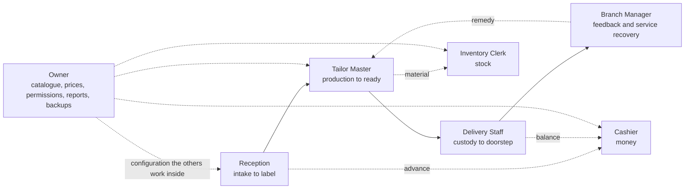

# RACI — accountability across the garment lifecycle

This document names, for every activity in the HyFib Tailor 360 lifecycle, the one role that answers for the
outcome and the roles that do the work, are asked first, or are told afterwards. It exists so that no step of the
journey is owned by "whoever is at the counter", and so that the permission the system enforces can be checked
against the accountability the business intends. Section 2 is the RACI grid; section 3 maps each activity to the
permission that gates it, which is what the software actually enforces. Read it with
[`00-overview.md`](00-overview.md) for the journey, [`state-transitions.md`](state-transitions.md) for the
transitions themselves, [`exceptions.md`](exceptions.md) for what happens when an activity goes wrong, and
[`glossary.md`](glossary.md) for every term used. Everything here traces to
[`../IMPLEMENTATION_PLAN.md`](../IMPLEMENTATION_PLAN.md); nothing here overrides it.

> **Status: drafted for the owner workshop, not approved.** The grid is the plan's proposal. The default
> role-to-permission grants that make it real are owner decision **OD-13** in
> [`assumptions-and-open-decisions.md`](assumptions-and-open-decisions.md) (plan
> [Section 11](../IMPLEMENTATION_PLAN.md) item 13), and are delivered as `../security/permission-matrix.md` by
> issue #24.

---

## 1. How to read this document

### 1.1 The four letters

| Letter | Meaning | Test to apply |
| --- | --- | --- |
| **A** | Accountable — the single role that answers for the outcome and holds the decision right when the activity is contested | "If this is wrong next month, whose answer is it?" |
| **R** | Responsible — the role that performs the work | "Whose hands and whose login?" |
| **C** | Consulted — asked before the decision, two-way | "Would we redo the work if we had not asked them?" |
| **I** | Informed — told after the fact, one-way | "Do they need to change what they do because of it?" |
| **–** | Not involved in this activity | — |

### 1.2 Rules the grid obeys

1. **Exactly one A per row.** Accountability is never shared and never delegated to a queue. Where the accountable
   role also does the work, the cell reads `A R`.
2. **Accountability is not a permission.** The grid is a business statement; section 3 is the enforcement
   statement. Where the two disagree, one of them is a defect and the pull request that fixes it changes both.
3. **A role in a cell means the role, not a person.** A branch may staff two roles with one person; the audit
   record still names the permission that was used.
4. **The system is not a role.** Work performed by a worker job under a `SystemPrincipal` — due-date evaluation,
   low-stock evaluation, notification sending, projections, retention, backup-age monitoring — is footnoted on the
   row it affects, never given a column, because software cannot be accountable.
5. **Branch scope applies to every row.** Every activity is authorised on permission **plus** branch scope
   (plan Section 4.4, issue #24). A Branch Manager who is `A` is accountable in their own branches only; the Owner
   is accountable across the organisation.

### 1.3 Principals that are not columns

The grid has eight columns because the shop floor has eight roles
([`00-overview.md`](00-overview.md) section 2). These principals appear in the footnotes instead.

| Principal | How it appears in the grid |
| --- | --- |
| Admin | Performs the administrative rows (user administration, branch and flag configuration) under the Owner's accountability where the business employs one; where it does not, the Owner performs them |
| Measurement Staff | The `measurements.capture` permission bundle. Held by Reception in the default grant, or by dedicated staff — OD-13 |
| Auditor | Read-only. Never `R` or `A` on any row; `I` on report review and backup verification by way of the audit viewer |
| HyFib super-user | Vendor-side; feature-flag changes only, with a mandatory reason and evaluation audit |
| `SystemPrincipal` | The worker's own identity; see rule 4 |

---

## 2. The RACI grid

Twenty-eight activities, in lifecycle order: intake to feedback first, then the supporting activities that run
alongside the lifecycle rather than inside it.

| # | Activity | Reception | Tailor Master | Tailor | Inventory Clerk | Cashier | Delivery Staff | Branch Manager | Owner |
| --- | --- | --- | --- | --- | --- | --- | --- | --- | --- |
| 1 | Customer intake — find or create the customer, record consent and contact details | **A R** | – | – | – | – | – | C (1) | – |
| 2 | Measurement capture — draft to confirmed measurement version | **A R** | C | I | – | – | – | C | – |
| 3 | Estimate — priced snapshot of the draft, issued and shared | **A R** | C (2) | – | – | I | – | I | C (3) |
| 4 | Order confirmation — snapshots frozen, numbers allocated | **A R** | C (4) | – | – | I | – | I | – |
| 5 | Advance collection — money taken before the invoice exists | R (5) | – | – | – | **A R** | – | I | I |
| 6 | Barcode allocation — one active opaque identity per garment job | **A R** (6) | I | – | – | – | – | C (7) | – |
| 7 | Label print — label produced, verified and attached | **A R** | I | I | – | – | – | C (8) | – |
| 8 | Material issue — customer material into custody, shop stock reserved, issued and consumed | I | C | R | **A R** | – | – | C (9) | I |
| 9 | Cutting — panels cut with the published ease | – | **A** | R | I | – | – | I | – |
| 10 | Stitching | – | **A** | R | – | – | – | I | – |
| 11 | Embellishment — Aari and other specialist work, in-house or at a specialist | – | **A R** (10) | R | C (11) | – | – | I | – |
| 12 | Finishing — pressing, trimming, closures, packing | – | **A** | R | – | – | – | – | – |
| 13 | QC — result recorded against the pinned checklist version | – | **A R** | I | – | – | – | I | I |
| 14 | Rework decision — after a failed QC | I | **A R** | R | – | – | – | C | I |
| 15 | Alteration decision — price, due date and who bears the cost | R | C | – | – | I | I | **A** | I (12) |
| 16 | Ready declaration — the ready-for-delivery gate opens | I | **A R** (13) | – | – | I | I | I | – |
| 17 | Delivery custody — receive scan at the branch, custody to the delivery team | I | C | – | – | I | **A R** | C | – |
| 18 | Payment settlement — invoice posted, balance taken, allocated, receipted | C | – | – | – | **A R** | I | C (14) | I |
| 19 | Dispatch — garment leaves the branch against a dispatch authorisation | – | – | – | – | C | **A R** | I | C (15) |
| 20 | Feedback capture — invitation sent, response recorded | I | I | – | – | – | I | **A** (16) | I |
| 21 | Service recovery — case owned, customer contacted, remedy decided, case closed | R | C | – | – | C | I | **A R** | I |
| 22 | Stock receipt — purchase order, receipt, evidence, cost | – | I | – | **A R** | – | – | C | I |
| 23 | Stocktake — count, recount, variance explanation, approval, posting | – | – | – | R | – | – | **A** (17) | I |
| 24 | Price change — price-list version drafted, approved and published | I | C | – | – | I | – | C | **A R** |
| 25 | Catalogue change — categories, service types, design options, workflows, QC checklists | C | C | – | C (18) | – | – | C | **A R** |
| 26 | User administration — users, roles, branch assignments, feature flags | I | I | I | I | I | I | C | **A R** (19) |
| 27 | Report review — sales, GST, pipeline, quality, stock and profitability figures | – | I | – | I | I | – | R | **A R** |
| 28 | Backup verification — restore test, backup age, audit-chain verification | – | – | – | – | – | – | I | **A** (20) |

### 2.1 Footnotes to the grid

| Mark | Note |
| --- | --- |
| (1) | A duplicate merge is irreversible and needs `customers.merge` with step-up and a reason; the plan's proposal is that the Branch Manager holds it, so Reception is consulted-then-blocked rather than free to merge (EX-01 in [`exceptions.md`](exceptions.md)) |
| (2) | Lead time and feasibility for Aari, lehenga and bridal work come from the Tailor Master's queue, not from a promise at the counter |
| (3) | The Owner is consulted only where a discount or a price override crosses the configured threshold (`billing.override_price`, step-up) |
| (4) | Consulted on the due date, which is derived from the service type's expected duration against the branch working calendar and the current workload |
| (5) | Whether Reception may hold `payments.record` for advances, or whether every rupee passes through the Cashier, is part of OD-13. The grid shows the plan's proposal: Reception may record an advance, the Cashier is accountable for the money |
| (6) | The identity is allocated by the Custody module **inside** the order-confirmation transaction, so no human keystroke allocates it. Reception is accountable because Reception issues the command that creates it |
| (7) | Manual generation of an identity outside confirmation needs `custody.generate_identity` with step-up and a reason |
| (8) | Reprint and invalidation need `custody.reprint_label` / `custody.invalidate_label` with step-up and a reason, because both break the one-to-one bond between a garment and its identity (EX-07) |
| (9) | Consulted where the branch's negative-stock policy requires `inventory.approve_negative_stock`, and where a shortage puts the job on hold (EX-02) |
| (10) | Where the work leaves the shop, the Tailor Master performs the two-sided custody transfer with condition evidence on both legs and stays accountable for the garment while it is away |
| (11) | Stones, beads and thread issued to the job are stock ledger entries, so the Inventory Clerk is consulted on what is issued and what comes back |
| (12) | Informed as a matter of course; consulted where the remedy is a free remake or a refund above the branch threshold |
| (13) | `ready_state` is written by the ready-for-delivery gate alone and by no role. The Tailor Master is accountable for closing the predicates the gate reads — workflow complete, QC passed, no open rework, evidence complete, no open hold |
| (14) | Consulted at the cashier session close, where expected and counted totals are reconciled and a variance needs a reason and an approver |
| (15) | A dispatch exception is single-use and approved with step-up by someone other than the dispatcher. Who may approve is OD-04 with XQ-02; the plan's interim position is the Owner only |
| (16) | The invitation is sent by the Notifications worker and the response is written by the customer through a one-time link, so no staff role records it. The Branch Manager is accountable for the invitations going out and the responses being read |
| (17) | The approver of a variance must be a different user from the counter, above the configured threshold (`inventory.approve_variance`, step-up) |
| (18) | Consulted where a catalogue change adds a service type that consumes stock items the store does not carry |
| (19) | Performed by Admin where the business employs one; see section 1.3 |
| (20) | The restore test is executed by the operator named under OD-15 and evidenced in the issue #60 runbook, and the backup-age monitor runs as a worker job. Neither is a shop-floor role; the Owner is accountable for the evidence existing |

---

## 3. What gates each activity

This is the enforcement view of the same twenty-eight rows. Every state-changing endpoint enforces
authentication, permission plus branch scope, validation, idempotency where it is retried, and an audit event
(plan Section 5.1). "Step-up" means re-authentication with a second factor within the last five minutes;
"Reason" means free text stored on the audit event, never defaulted by the client.

Permission names marked **°** are proposed by this document because the plan does not yet name them; they are
confirmed or renamed by issue #24 under OD-13. Every other name is taken from the plan or from
[`state-transitions.md`](state-transitions.md).

| # | Activity | Representative command | Gating permission(s) | Step-up | Reason | Owning module | Issue |
| --- | --- | --- | --- | --- | --- | --- | --- |
| 1 | Customer intake | `POST /api/v1/customers`, `POST /customers/{id}/consents` | `customers.create`°, `customers.update`, `customers.read`, `customers.read_contact`; merge `customers.merge` | Merge only | Correction, merge | Customers/Measurements | #26 |
| 2 | Measurement capture | `POST /customers/{id}/measurement-drafts/{id}/confirm` | `measurements.capture`; sheet read `measurements.read_sheet` | No | Capture reason on the version | Customers/Measurements | #27, #28 |
| 3 | Estimate | `POST /orders/drafts/{id}/estimate` | `orders.estimate` | No | No | Orders/Workflow | #32a |
| 4 | Order confirmation | `POST /orders/drafts/{id}/confirm` with `Idempotency-Key` | `orders.confirm` | No | No | Orders/Workflow | #32a |
| 5 | Advance collection | `POST /billing/payments` with `Idempotency-Key` | `payments.record`, `payments.session` (the session audit actions are `payments.open_session` and `payments.close_session`); manual allocation `payments.allocate_manual` | Manual allocation only | Manual allocation | Billing/Payments | #43 |
| 6 | Barcode allocation | Confirmation participant hook; manual `POST /custody/identities` | `orders.confirm`; manual `custody.generate_identity` | Manual only | Manual only | Custody/Barcode | #35 |
| 7 | Label print | `POST /custody/labels/print` | `custody.print_label`, `custody.bulk_print_label`, `custody.verify_label`; `custody.reprint_label`, `custody.invalidate_label` | Reprint, invalidate | Reprint, invalidate | Custody/Barcode | #35 |
| 8 | Material issue | `POST /inventory/reservations`, `POST /inventory/movements` | `inventory.record_movement`; `inventory.approve_negative_stock` | Negative stock only | Wastage, negative stock | Inventory | #39 |
| 9 | Cutting | `POST /custody/scans`, `POST /orders/jobs/{id}/phases/{code}/start\|complete` | `custody.scan`, `orders.phase_transition` | No | No | Custody, Orders | #33, #37 |
| 10 | Stitching | As row 9 | `custody.scan`, `orders.phase_transition` | No | No | Custody, Orders | #33, #37 |
| 11 | Embellishment | As row 9, plus `POST /custody/transfers`, `POST /custody/transfers/{id}/receive` | `custody.transfer_out`, `custody.receive`, `custody.reject_transfer`, `orders.phase_transition` | No | Rejection of a transfer | Custody, Orders | #37, #33 |
| 12 | Finishing | As row 9 | `custody.scan`, `orders.phase_transition` | No | No | Custody, Orders | #33, #37 |
| 13 | QC | `POST /orders/jobs/{id}/qc-results` | `orders.record_qc` | No | On failure | Orders/Workflow | #34 |
| 14 | Rework decision | `POST /orders/jobs/{id}/rework`, `.../rework/{id}/complete` | `orders.open_rework`, `orders.complete_rework` | No | Yes | Orders/Workflow | #34 |
| 15 | Alteration decision | `POST /orders/alterations/{id}/decision` | `orders.alteration_decide` | No | Yes | Orders/Workflow | #34, #49 |
| 16 | Ready declaration | None — computed by the ready-for-delivery gate | No permission exists; the audit action is `orders.ready_state_changed` | n/a | n/a | Orders/Workflow | #34 |
| 17 | Delivery custody | `POST /custody/scans` with action `RECEIVE` | `custody.receive`, `custody.scan` | No | Manual entry only | Custody/Barcode | #37, #48 |
| 18 | Payment settlement | `POST /billing/invoices/{id}/post`, `POST /billing/payments`, `POST /billing/payments/{id}/allocations` | `billing.post_invoice`, `payments.record`, `payments.allocate`; `billing.cancel_invoice`, `payments.refund`, `payments.reverse` | Cancel, refund, reverse | Cancel, refund, reverse | Billing/Payments | #42, #43 |
| 19 | Dispatch | `POST /custody/dispatch`, then `POST /custody/deliveries/{id}/confirm` | `custody.dispatch`, `custody.confirm_delivery`; exception `billing.approve_dispatch_exception` | Exception approval | Exception approval, failed delivery | Custody, Billing | #37, #43, #48 |
| 20 | Feedback capture | `/c/feedback/{token}` — a customer link, no staff session | None for the customer; staff read `feedback.read`° | No | No | Notifications/Feedback | #49 |
| 21 | Service recovery | `POST /feedback/cases/{id}/contact`, `.../close` | `feedback.manage_cases`° | No | Closure resolution code | Notifications/Feedback | #49 |
| 22 | Stock receipt | `POST /inventory/purchase-orders`, `POST /inventory/purchase-receipts` | `inventory.record_movement`, `inventory.manage_suppliers` | No | Variance against the order | Inventory | #39 |
| 23 | Stocktake | `POST /inventory/stocktakes/{id}/counts`, `.../post` | `inventory.stocktake`°; approval `inventory.approve_variance` | Approval | Variance explanation, approval | Inventory | #40 |
| 24 | Price change | `POST /billing/price-lists/{id}/publish` | `billing.manage_price_lists`, `billing.publish_price_list`; override `billing.override_price` | Publish, override | Publish, override | Billing/Payments | #41 |
| 25 | Catalogue change | `POST /catalog/versions/{id}/publish` | `catalog.edit`, `catalog.publish` (and the template, workflow and checklist publish permissions) | Publish | Publish | Catalog/Design, Orders, Customers | #29, #27, #30, #33, #34 |
| 26 | User administration | `POST /admin/users`, `/admin/roles`, `/admin/branches`, `/platform/feature-flags` | `admin.users`, `admin.roles`, `admin.branches`, `admin.feature_flags` | All | All | Identity/Admin, Platform | #25 |
| 27 | Report review | `GET /reports/...`, `POST /reports/exports` | `reports.read`, `reports.export`, `inventory.view_reports`, `inventory.view_valuation` | No | No | Reporting, Inventory | #44, #45, #46, #40 |
| 28 | Backup verification | Operator runbook on the host; `GET /health/detail` for backup age | No application permission for the restore; `admin.health.read` for the indicator; audit verification viewer under #57 | n/a | Restore-test record | Platform, infrastructure | #57, #58, #60 |

Two rows deserve emphasis because they are the controls the business is buying:

- **Row 16** has no permission at all. `ready_state` is computed by the gate from workflow completion, QC pass
  with no open rework, evidence completeness, open holds, `deliver_together` dependencies and custody
  reconciliation. No role, however senior, can declare a garment ready.
- **Row 19** fails closed. Custody asks Billing whether the order may be dispatched; an unevaluated answer blocks
  the scan (`custody.dispatch-blocked`) and the attempt is audited. Neither Custody nor Delivery Staff computes a
  balance. `custody.recipient_confirmation` is not a permission and grants nobody anything: it is the branch
  configuration value `otp_or_signature | signature | otp` that decides whether the doorstep confirmation needs an
  OTP, a signature stroke or either ([`state-transitions.md`](state-transitions.md) section 4.1, issue #48).

---

## 4. Where accountability changes hands

Each solid arrow is a point where a garment, and with it the accountability for it, moves between roles. Every one
of those points is a scan: an append-only custody event naming the from-custodian, the to-custodian, the location,
the actor, the device and the server timestamp. That is the difference between this grid and a wall chart — the
handover is recorded, not remembered.

---

## 5. What this grid does not decide

| Question | Resolves under | Interim position in this document |
| --- | --- | --- |
| The default role-to-permission grants, and any custom roles at launch | **OD-13** (plan Section 11 item 13), delivered as `../security/permission-matrix.md` by #24 | Section 3 is the plan's proposal; permissions marked ° are proposed names |
| Whether Branch Manager is a distinct role or a branch-scoped Admin | **OD-13** | Treated as a distinct role, accountable for rows 15, 20, 21 and 23 |
| Whether Measurement Staff is a separate role or `measurements.capture` granted to Reception | **OD-13** | Granted to Reception; row 2 shows Reception as `A R` |
| Whether Reception may record an advance, or only the Cashier | **OD-13**, with OD-04 | Reception `R`, Cashier `A R` (footnote (5)) |
| Who may approve a dispatch exception, and whether Delivery Staff may collect the balance at the door | **OD-04**, with **XQ-02** in [`exceptions.md`](exceptions.md) | Owner only, no doorstep collection; row 19 shows the Owner as `C` |
| Who approves a stocktake variance and a custody reconciliation above threshold | **OD-13** | A different user from the one who recorded it; Branch Manager accountable on row 23 |
| Which roles must use MFA beyond Owner, Admin and Cashier | **OD-12** (plan Section 11 item 12) | Every permission flagged `RequiresMfa` in the catalogue forces enrolment for the principals that hold it |
| Operations ownership for backup verification and out-of-hours alerts | **OD-15** | Row 28 is the Owner's accountability with the execution delegated to the operator OD-15 names |

None of the above may be presented elsewhere in this documentation set as settled. Every one is registered in
[`assumptions-and-open-decisions.md`](assumptions-and-open-decisions.md) against plan
[Section 11](../IMPLEMENTATION_PLAN.md).

---

## 6. Maintenance

This grid is amended by pull request only, in the same change that adds or alters an activity. A pull request that
adds a state-changing endpoint adds its row to section 3 and to the issue #24 authorisation matrix fixtures in the
same change; a pull request that changes who is accountable for something updates section 2, the affected workflow
map under [`workflows/`](workflows/), and the training material of issue #61c. The grid is walked with the shop at
the exception review recorded in [`reviews/exception-review.md`](reviews/exception-review.md), and the workshop's
corrections land here before the W0 exit gate.
